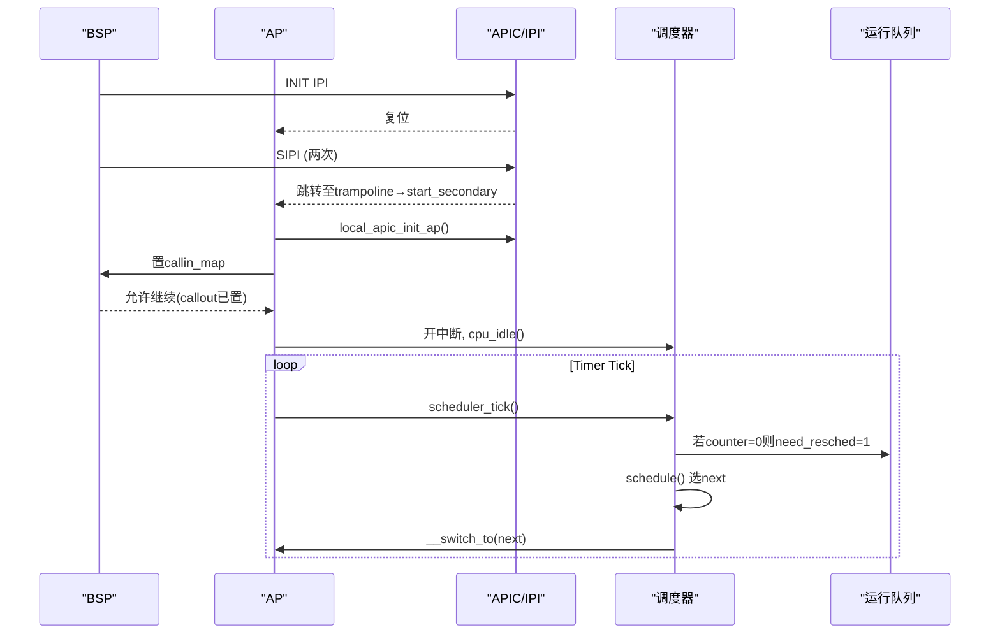
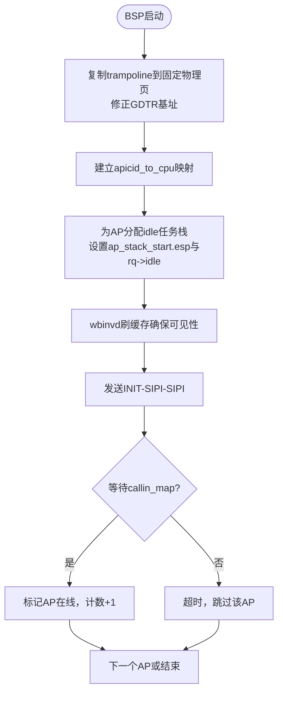
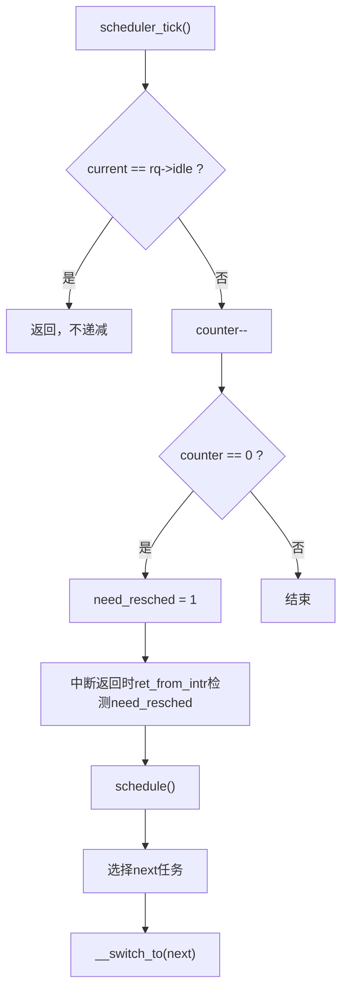
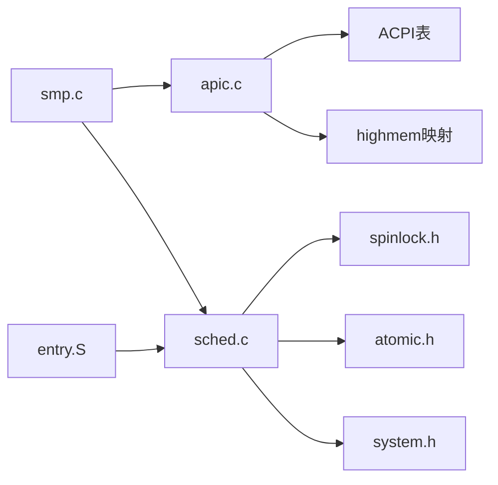

# SMP多处理器支持

<cite>
**本文引用的文件**
- [arch/x86/kernel/smp.c](file://arch/x86/kernel/smp.c)
- [includes/arch/x86/smp.h](file://includes/arch/x86/smp.h)
- [arch/x86/kernel/apic.c](file://arch/x86/kernel/apic.c)
- [includes/arch/x86/apic.h](file://includes/arch/x86/apic.h)
- [kernel/sched.c](file://kernel/sched.c)
- [includes/kernel/sched.h](file://includes/kernel/sched.h)
- [arch/x86/kernel/setup.c](file://arch/x86/kernel/setup.c)
- [includes/arch/x86/spinlock.h](file://includes/arch/x86/spinlock.h)
- [includes/arch/x86/atomic.h](file://includes/arch/x86/atomic.h)
- [includes/arch/x86/system.h](file://includes/arch/x86/system.h)
- [arch/x86/entry.S](file://arch/x86/entry.S)
</cite>

## 目录
1. [简介](#简介)
2. [项目结构](#项目结构)
3. [核心组件](#核心组件)
4. [架构总览](#架构总览)
5. [详细组件分析](#详细组件分析)
6. [依赖关系分析](#依赖关系分析)
7. [性能与调优](#性能与调优)
8. [故障排查指南](#故障排查指南)
9. [结论](#结论)
10. [附录：SMP编程指导](#附录smp编程指导)

## 简介
本文件面向LulaOS的SMP（对称多处理）实现，系统性说明多核CPU的启动与管理机制、APIC初始化、从处理器唤醒流程、负载均衡策略、跨CPU同步与通信方式、内存一致性与锁机制，以及SMP相关配置与性能调优建议。文档同时提供架构图与任务调度流程图，帮助多核应用开发者在LulaOS上正确编写并发程序。

## 项目结构
LulaOS的SMP相关代码主要分布在以下位置：
- 架构层x86：
  - smp.c：BSP启动AP、握手、idle任务分配、IPI发送等
  - apic.c：Local APIC/IOAPIC初始化、定时器校准、IPI发送、微秒延迟
  - setup.c：内存布局与保留区域（含SMP trampoline页预留）
  - entry.S：中断返回前检查need_resched并触发调度
- 内核层：
  - sched.c：每CPU运行队列、调度器、空闲循环、负载均衡
  - spinlock.h/atomic.h/system.h：自旋锁、原子操作、本地中断开关与屏障
- 头文件：
  - smp.h/apic.h/sched.h：对外API与关键常量定义

```mermaid
graph TB
BSP["BSP(主处理器)"] --> |INIT-SIPI-SIPI| AP["AP(从处理器)"]
BSP --> |IPI| AP
AP --> |callin_map| BSP
AP --> |Timer Tick| SCHED["调度器(scheduler_tick)"]
SCHED --> |schedule()| RUNQ["每CPU运行队列(runqueue)"]
RUNQ --> |__switch_to| AP
RUNQ --> |__switch_to| BSP
```

图表来源
- [arch/x86/kernel/smp.c:74-215](file://arch/x86/kernel/smp.c#L74-L215)
- [arch/x86/kernel/apic.c:449-475](file://arch/x86/kernel/apic.c#L449-L475)
- [kernel/sched.c:223-259](file://kernel/sched.c#L223-L259)

章节来源
- [arch/x86/kernel/smp.c:74-215](file://arch/x86/kernel/smp.c#L74-L215)
- [arch/x86/kernel/apic.c:449-475](file://arch/x86/kernel/apic.c#L449-L475)
- [kernel/sched.c:223-259](file://kernel/sched.c#L223-L259)

## 核心组件
- 启动与握手
  - BSP侧：复制trampoline到固定物理页、设置GDTR、遍历ACPI LAPIC表、为每个AP分配独立idle任务栈、写入ap_stack_start.esp与rq->idle、wbinvd保证可见性、发送INIT-SIPI-SIPI、等待callin_map确认
  - AP侧：start_secondary尽早标记在线、等待callout、初始化Local APIC/TIMER、置callin_map、创建ksoftirqd、开中断、进入cpu_idle
- APIC与IPI
  - Local APIC/IOAPIC初始化、LVT配置、定时器校准、IPI发送（send_ipi/send_startup_ipi）、微秒级udelay
- 调度与负载均衡
  - 每CPU runqueue、scheduler_tick递减counter、schedule选择next、find_idlest_cpu扫描最空闲CPU、sys_fork/kernel_thread支持KT_BALANCE
- 同步与一致性
  - 自旋锁保护runqueue、原子变量用于PID分配、volatile位图用于BSP-AP握手、wbinvd与memory barrier确保跨核可见性

章节来源
- [arch/x86/kernel/smp.c:74-276](file://arch/x86/kernel/smp.c#L74-L276)
- [arch/x86/kernel/apic.c:37-100](file://arch/x86/kernel/apic.c#L37-L100)
- [kernel/sched.c:76-124](file://kernel/sched.c#L76-L124)
- [includes/arch/x86/smp.h:35-46](file://includes/arch/x86/smp.h#L35-L46)

## 架构总览
下图展示SMP启动与调度交互的关键路径：BSP通过IPI唤醒AP，AP初始化后进入idle；定时器tick驱动调度，任务在各CPU间迁移以实现负载均衡。



图表来源
- [arch/x86/kernel/smp.c:185-215](file://arch/x86/kernel/smp.c#L185-L215)
- [arch/x86/kernel/apic.c:449-475](file://arch/x86/kernel/apic.c#L449-L475)
- [kernel/sched.c:223-259](file://kernel/sched.c#L223-L259)

## 详细组件分析

### 多核启动与AP唤醒（BSP/AP握手）
- BSP侧关键步骤
  - 将trampoline复制到固定物理页，修正GDTR基址
  - 建立apicid_to_cpu映射，记录BSP APIC ID
  - 为每个AP分配thread_union作为idle任务栈，设置ap_stack_start.esp与rq->idle
  - wbinvd确保数据对AP可见
  - 发送INIT-SIPI-SIPI序列，等待callin_map超时
- AP侧关键步骤
  - start_secondary中尽早置cpu_online_map，避免重复SIPI导致Triple Fault
  - 等待callout信号后再初始化Local APIC/TIMER
  - 置callin_map通知BSP完成
  - 创建ksoftirqd，开中断，进入cpu_idle



图表来源
- [arch/x86/kernel/smp.c:74-215](file://arch/x86/kernel/smp.c#L74-L215)
- [arch/x86/kernel/apic.c:449-475](file://arch/x86/kernel/apic.c#L449-L475)

章节来源
- [arch/x86/kernel/smp.c:74-215](file://arch/x86/kernel/smp.c#L74-L215)
- [arch/x86/kernel/apic.c:449-475](file://arch/x86/kernel/apic.c#L449-L475)

### APIC初始化与定时器校准
- Local APIC
  - remapping_apic启用并映射APIC寄存器
  - enable_hardware_apic打开硬件APIC
  - LVT配置：屏蔽8259A LINT0/LINT1，错误向量设置
  - TPR设置接受优先级阈值
  - SPIV软件使能APIC
- IOAPIC
  - 基于ACPI信息映射所有IOAPIC
  - 遍历RTE条目，默认屏蔽，按ACPI覆盖极性/触发模式
- 定时器校准
  - 使用PIT Channel 2作为参考，测量APIC Timer在已知时间窗口内的tick数
  - 设置为周期性模式，供调度tick使用
- IPI与延迟
  - send_ipi/send_init_ipi/send_sipi封装IPI发送
  - udelay基于PIT轮询实现精确微秒延迟

章节来源
- [arch/x86/kernel/apic.c:37-100](file://arch/x86/kernel/apic.c#L37-L100)
- [arch/x86/kernel/apic.c:125-180](file://arch/x86/kernel/apic.c#L125-L180)
- [arch/x86/kernel/apic.c:230-380](file://arch/x86/kernel/apic.c#L230-L380)
- [arch/x86/kernel/apic.c:387-475](file://arch/x86/kernel/apic.c#L387-L475)
- [arch/x86/kernel/apic.c:482-509](file://arch/x86/kernel/apic.c#L482-L509)

### 任务调度与负载均衡
- 每CPU运行队列
  - runqueues[NR_CPUS]，每个包含自旋锁、链表、nr_running、idle指针
  - sched_init初始化所有CPU的rq，默认idle指向init_task
- 调度器
  - schedule获取当前CPU rq，加锁，处理counter与need_resched，选择next，调用__switch_to
  - scheduler_tick在每个CPU上由APIC Timer触发，递减counter，必要时置need_resched
  - cpu_idle循环safe_halt等待need_resched
- 负载均衡
  - find_idlest_cpu扫描所有在线CPU，比较nr_running，优先当前CPU以利用缓存亲和性
  - sys_fork/kernel_thread支持KT_BALANCE标志，将新任务加入最空闲CPU的运行队列
  - add_task_to_cpu直接写目标CPU的rq->idle->need_resched以唤醒空闲CPU



图表来源
- [kernel/sched.c:223-259](file://kernel/sched.c#L223-L259)
- [arch/x86/entry.S:41-58](file://arch/x86/entry.S#L41-L58)

章节来源
- [kernel/sched.c:76-124](file://kernel/sched.c#L76-L124)
- [kernel/sched.c:136-213](file://kernel/sched.c#L136-L213)
- [kernel/sched.c:223-259](file://kernel/sched.c#L223-L259)
- [kernel/sched.c:275-356](file://kernel/sched.c#L275-L356)
- [kernel/sched.c:369-433](file://kernel/sched.c#L369-L433)
- [includes/kernel/sched.h:83-181](file://includes/kernel/sched.h#L83-L181)
- [arch/x86/entry.S:41-58](file://arch/x86/entry.S#L41-L58)

### 同步机制与内存一致性
- 自旋锁
  - 每CPU runqueue使用spinlock_t保护，防止并发修改链表与计数
  - spin_lock_irqsave/local_irq_save用于临界区前后保存/恢复中断状态
- 原子操作
  - next_pid使用atomic_t递增，避免SMP下重复分配
- 握手与可见性
  - cpu_callout_map/cpu_callin_map使用volatile位图进行BSP-AP握手
  - wbinvd在BSP侧强制回写缓存，确保AP读取最新数据
  - 系统屏障barrier与memory约束防止编译器重排
- 中断上下文
  - safe_halt/hlt配合中断返回前的need_resched检查，实现低功耗与及时调度

章节来源
- [includes/arch/x86/spinlock.h:95-100](file://includes/arch/x86/spinlock.h#L95-L100)
- [includes/arch/x86/atomic.h:46-62](file://includes/arch/x86/atomic.h#L46-L62)
- [arch/x86/kernel/smp.c:175-180](file://arch/x86/kernel/smp.c#L175-L180)
- [includes/arch/x86/system.h:12-24](file://includes/arch/x86/system.h#L12-L24)

### 内存布局与SMP相关预留
- 启动阶段保留0-8K空间，其中4K-8K专门用于SMP trampoline页
- 页表与内存映射完成后，再执行SMP初始化，确保AP能访问所需内存

章节来源
- [arch/x86/kernel/setup.c:153-161](file://arch/x86/kernel/setup.c#L153-L161)
- [arch/x86/kernel/setup.c:182-197](file://arch/x86/kernel/setup.c#L182-L197)

## 依赖关系分析
- smp.c依赖apic.c的IPI与定时器接口，依赖sched.c的runqueue与idle管理
- apic.c依赖ACPI表信息与highmem映射，提供底层硬件抽象
- sched.c依赖spinlock/atomic/system提供的同步原语
- entry.S在中断返回路径中触发调度，与scheduler_tick协同工作



图表来源
- [arch/x86/kernel/smp.c:15-25](file://arch/x86/kernel/smp.c#L15-L25)
- [arch/x86/kernel/apic.c:1-10](file://arch/x86/kernel/apic.c#L1-L10)
- [kernel/sched.c:28-37](file://kernel/sched.c#L28-L37)
- [arch/x86/entry.S:41-58](file://arch/x86/entry.S#L41-L58)

章节来源
- [arch/x86/kernel/smp.c:15-25](file://arch/x86/kernel/smp.c#L15-L25)
- [arch/x86/kernel/apic.c:1-10](file://arch/x86/kernel/apic.c#L1-L10)
- [kernel/sched.c:28-37](file://kernel/sched.c#L28-L37)
- [arch/x86/entry.S:41-58](file://arch/x86/entry.S#L41-L58)

## 性能与调优
- 启动稳定性
  - 确保wbinvd在SIPI之前执行，避免AP读到旧值导致崩溃
  - 合理设置超时轮询，避免长时间阻塞
- 调度效率
  - 使用KT_BALANCE在新进程/线程创建时选择最空闲CPU，减少热点拥塞
  - 保持cache亲和性：find_idlest_cpu优先当前CPU，降低迁移开销
- 定时器精度
  - 校准APIC Timer时使用PIT作为参考，确保tick频率稳定
- 中断与IPI
  - 避免频繁IPI；批量处理可合并
  - 使用自旋锁保护短临界区，减少持有时间
- 内存与缓存
  - 谨慎使用wbinvd，仅在必要处刷新缓存一致性
  - 合理划分per-CPU数据结构，减少伪共享

[本节为通用性能建议，不直接引用具体代码行]

## 故障排查指南
- AP未响应
  - 检查callout/callin握手是否成功，确认IPI发送顺序与超时
  - 查看APIC日志输出，确认Local APIC/IOAPIC初始化是否完成
- Triple Fault
  - 常见于AP栈未正确设置或rq->idle未注册，导致__switch_to恢复ESP异常
  - 确认ap_stack_start.esp与idle->thread.esp在SIPI前已写入且wbinvd已执行
- 调度异常
  - 检查scheduler_tick是否正确递减counter，need_resched是否在ret_from_intr中被检测
  - 验证runqueue自旋锁使用是否正确，避免死锁
- 定时器失效
  - 校准失败时打印日志，确认PIT通道配置与APIC Timer分频设置

章节来源
- [arch/x86/kernel/smp.c:175-215](file://arch/x86/kernel/smp.c#L175-L215)
- [arch/x86/kernel/apic.c:125-180](file://arch/x86/kernel/apic.c#L125-L180)
- [kernel/sched.c:223-259](file://kernel/sched.c#L223-L259)
- [arch/x86/entry.S:41-58](file://arch/x86/entry.S#L41-L58)

## 结论
LulaOS的SMP实现遵循经典的BSP-AP握手与IPI唤醒模型，结合每CPU运行队列与轻量级负载均衡，提供了稳定的多核执行环境。通过APIC初始化、定时器校准与严格的内存一致性保障，系统在多核场景下具备可扩展性与可靠性。开发者应遵循SMP编程最佳实践，合理使用同步原语与负载均衡选项，以获得更好的性能与稳定性。

[本节为总结性内容，不直接引用具体代码行]

## 附录：SMP编程指导
- 多核安全
  - 使用自旋锁保护共享数据结构，避免竞态条件
  - 使用原子操作更新全局计数器或标志位
  - 在跨核共享数据读写前后使用适当的内存屏障
- 任务创建与迁移
  - 使用sys_fork/kernel_thread的KT_BALANCE标志，将任务分配到最空闲CPU
  - 避免在热路径中频繁迁移任务，保持cache亲和性
- 中断与软中断
  - 在中断上下文中避免长时间阻塞，尽量快速返回
  - 使用软中断处理耗时任务，降低中断延迟
- 调试技巧
  - 打印APIC ID与逻辑CPU号，确认映射正确
  - 监控各CPU的nr_running与idle状态，定位负载不均问题
  - 使用wbinvd与barrier辅助定位缓存一致性问题

[本节为通用编程指导，不直接引用具体代码行]