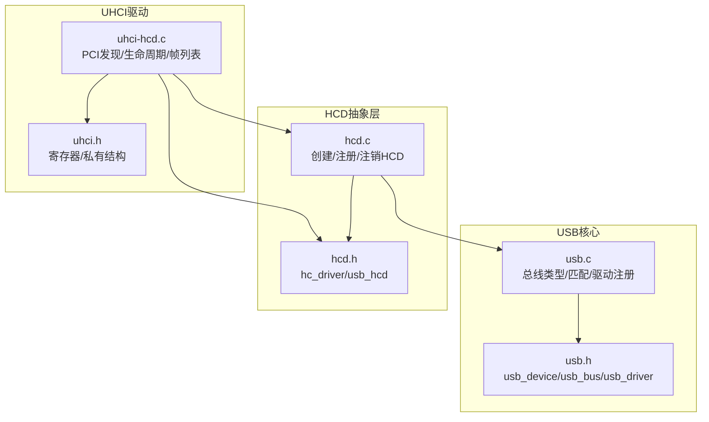
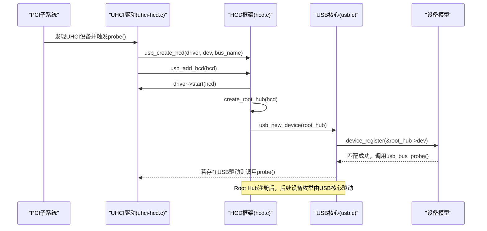
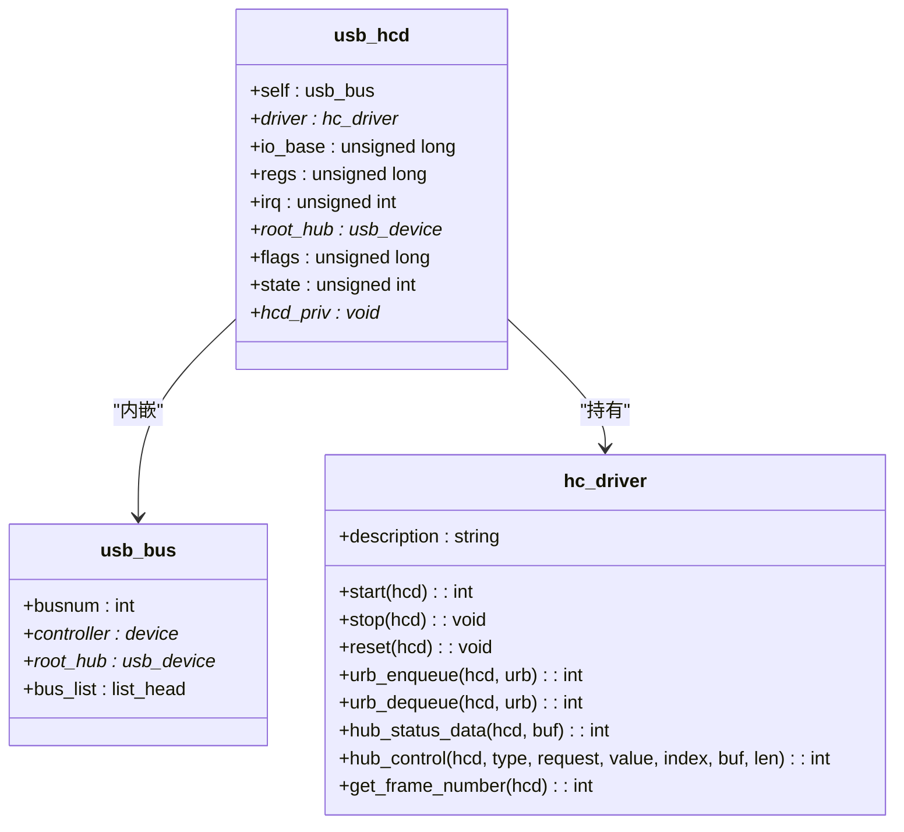
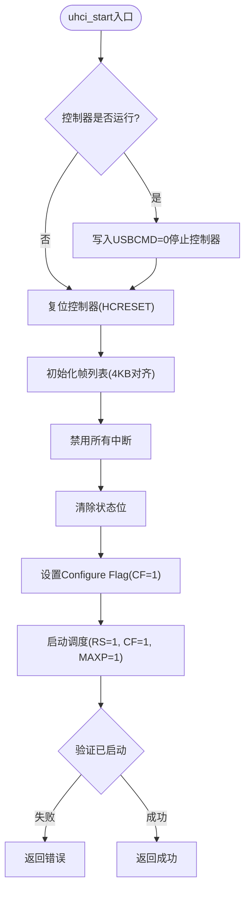
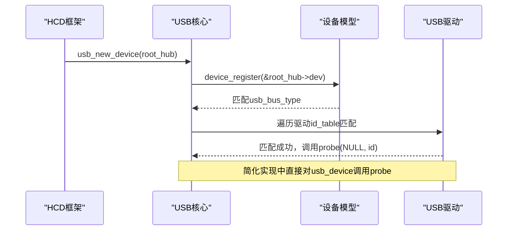

# HCD框架抽象

<cite>
**本文引用的文件**
- [includes/usb/hcd.h](file://includes/usb/hcd.h)
- [kernel/usb/hcd.c](file://kernel/usb/hcd.c)
- [includes/usb/uhci.h](file://includes/usb/uhci.h)
- [kernel/usb/u hci-hcd.c](file://kernel/usb/uhci-hcd.c)
- [includes/usb/usb.h](file://includes/usb/usb.h)
- [kernel/usb/usb.c](file://kernel/usb/usb.c)
</cite>

## 目录
1. [简介](#简介)
2. [项目结构](#项目结构)
3. [核心组件](#核心组件)
4. [架构总览](#架构总览)
5. [详细组件分析](#详细组件分析)
6. [依赖关系分析](#依赖关系分析)
7. [性能与可扩展性](#性能与可扩展性)
8. [故障排查指南](#故障排查指南)
9. [结论](#结论)
10. [附录：新主机控制器驱动移植指南](#附录：新主机控制器驱动移植指南)

## 简介
本文件面向LulaOS的USB主机控制器驱动（HCD）框架抽象层，系统性说明其设计理念、接口规范与实现要点。重点覆盖以下方面：
- HCD抽象层的职责划分：设备枚举、数据传输、电源管理的统一接口
- HCD与USB核心层的交互机制：设备添加、移除与状态同步
- 不同主机控制器类型的适配方法：以UHCI为例，说明如何集成到框架
- 新主机控制器驱动的移植指南：必要接口实现与测试方法

该抽象层参考了Linux 2.6.20的USB子系统设计思想，在LulaOS中进行了简化与裁剪，便于快速集成与扩展。

## 项目结构
围绕USB子系统与HCD抽象层的关键代码分布如下：
- 头文件定义：
  - includes/usb/hcd.h：HCD抽象接口与数据结构（hc_driver、usb_hcd）
  - includes/usb/usb.h：USB核心类型（usb_device、usb_bus、usb_driver等）
  - includes/usb/uhci.h：UHCI寄存器定义与私有数据结构
- 核心实现：
  - kernel/usb/hcd.c：HCD框架实现（创建、注册、注销；Root Hub创建与注册）
  - kernel/usb/usb.c：USB核心总线实现（总线类型、匹配、驱动注册、设备注册）
  - kernel/usb/uhci-hcd.c：UHCI主机控制器驱动（PCI发现、生命周期管理、帧列表初始化）

**图表来源**
- [kernel/usb/usb.c:126-188](file://kernel/usb/usb.c#L126-L188)
- [includes/usb/usb.h:96-181](file://includes/usb/usb.h#L96-L181)
- [kernel/usb/hcd.c:85-189](file://kernel/usb/hcd.c#L85-L189)
- [includes/usb/hcd.h:23-111](file://includes/usb/hcd.h#L23-L111)
- [kernel/usb/uhci-hcd.c:250-396](file://kernel/usb/uhci-hcd.c#L250-L396)
- [includes/usb/uhci.h:17-159](file://includes/usb/uhci.h#L17-L159)

**章节来源**
- [kernel/usb/usb.c:1-188](file://kernel/usb/usb.c#L1-L188)
- [includes/usb/usb.h:1-181](file://includes/usb/usb.h#L1-L181)
- [kernel/usb/hcd.c:1-189](file://kernel/usb/hcd.c#L1-L189)
- [includes/usb/hcd.h:1-111](file://includes/usb/hcd.h#L1-L111)
- [kernel/usb/uhci-hcd.c:1-396](file://kernel/usb/uhci-hcd.c#L1-L396)
- [includes/usb/uhci.h:1-159](file://includes/usb/uhci.h#L1-L159)

## 核心组件
- hc_driver：HCD驱动回调接口，包含start/stop/reset、urb_enqueue/urb_dequeue、hub_status_data/hub_control、get_frame_number等回调。各具体HCD（如UHCI/OHCI/EHCI）需实现这些回调以对接硬件。
- usb_hcd：HCD实例，内嵌usb_bus作为对外暴露的总线描述，持有driver指针、硬件信息（I/O基址、MMIO基址、中断号）、root_hub指针、标志位和私有数据指针。
- usb_bus_type：USB总线类型，提供match/probe/remove回调，负责将USB设备与驱动进行匹配并调用驱动的probe/disconnect。
- usb_device/usb_driver：USB设备与驱动的核心结构，用于设备描述符、配置、接口以及驱动的id_table匹配。

职责划分：
- HCD抽象层（hcd.c + hcd.h）：负责HCD实例的生命周期管理、Root Hub创建与注册、与USB核心的桥接。
- USB核心（usb.c + usb.h）：负责总线类型、设备/驱动注册、匹配逻辑、设备模型集成。
- 具体HCD驱动（如UHCI）：实现hc_driver回调，完成硬件初始化、传输调度、端口/Hub控制等。

**章节来源**
- [includes/usb/hcd.h:23-111](file://includes/usb/hcd.h#L23-L111)
- [kernel/usb/hcd.c:85-189](file://kernel/usb/hcd.c#L85-L189)
- [includes/usb/usb.h:96-181](file://includes/usb/usb.h#L96-L181)
- [kernel/usb/usb.c:72-188](file://kernel/usb/usb.c#L72-L188)

## 架构总览
下图展示了HCD抽象层与USB核心、具体HCD驱动之间的交互关系与控制流。

**图表来源**
- [kernel/usb/uhci-hcd.c:275-347](file://kernel/usb/uhci-hcd.c#L275-L347)
- [kernel/usb/hcd.c:125-166](file://kernel/usb/hcd.c#L125-L166)
- [kernel/usb/usb.c:178-188](file://kernel/usb/usb.c#L178-L188)

## 详细组件分析

### HCD抽象层（hc_driver与usb_hcd）
- hc_driver定义了HCD驱动必须实现的回调函数集合，包括控制器生命周期管理、URB入队/出队、Hub状态查询与控制、帧号获取等。当前实现中部分回调为空，表示简化版暂不启用完整URB与中断驱动。
- usb_hcd封装了HCD实例，内嵌usb_bus，并提供公共API：
  - usb_create_hcd：分配并初始化HCD实例，设置busnum、controller、flags等
  - usb_add_hcd：启动控制器、创建Root Hub、注册到USB总线
  - usb_remove_hcd：注销Root Hub、停止控制器、释放资源

**图表来源**
- [includes/usb/hcd.h:23-76](file://includes/usb/hcd.h#L23-L76)
- [includes/usb/usb.h:96-106](file://includes/usb/usb.h#L96-L106)

**章节来源**
- [includes/usb/hcd.h:23-111](file://includes/usb/hcd.h#L23-L111)
- [kernel/usb/hcd.c:85-189](file://kernel/usb/hcd.c#L85-L189)

### UHCI主机控制器驱动
UHCI驱动实现了hc_driver回调，并通过PCI子系统发现并绑定UHCI控制器。关键流程如下：
- uhci_pci_probe：使能设备、读取BAR4 I/O基址、创建HCD、分配私有数据、预分配QH/TD池、注册HCD
- uhci_start：复位控制器、初始化帧列表、禁用中断、清除状态位、启动调度器
- uhci_stop：停止调度器、等待HCH置位、释放帧列表与池

**图表来源**
- [kernel/usb/uhci-hcd.c:148-202](file://kernel/usb/uhci-hcd.c#L148-L202)

**章节来源**
- [kernel/usb/uhci-hcd.c:80-248](file://kernel/usb/uhci-hcd.c#L80-L248)
- [includes/usb/uhci.h:17-159](file://includes/usb/uhci.h#L17-L159)

### USB核心与设备枚举
USB核心提供总线类型与匹配逻辑，HCD通过usb_new_device将Root Hub注册到总线，触发匹配流程。简化实现中，probe以usb_device为单位，未区分interface。

**图表来源**
- [kernel/usb/usb.c:72-188](file://kernel/usb/usb.c#L72-L188)

**章节来源**
- [kernel/usb/usb.c:1-188](file://kernel/usb/usb.c#L1-L188)
- [includes/usb/usb.h:132-181](file://includes/usb/usb.h#L132-L181)

## 依赖关系分析
- HCD框架依赖USB核心提供的总线类型与设备注册能力
- UHCI驱动依赖HCD抽象层提供的hc_driver接口与公共API
- USB核心依赖设备模型进行驱动与设备的匹配与生命周期管理

**图表来源**
- [kernel/usb/uhci-hcd.c:250-396](file://kernel/usb/uhci-hcd.c#L250-L396)
- [kernel/usb/hcd.c:85-189](file://kernel/usb/hcd.c#L85-L189)
- [kernel/usb/usb.c:126-188](file://kernel/usb/usb.c#L126-L188)

**章节来源**
- [kernel/usb/uhci-hcd.c:1-396](file://kernel/usb/uhci-hcd.c#L1-L396)
- [kernel/usb/hcd.c:1-189](file://kernel/usb/hcd.c#L1-L189)
- [kernel/usb/usb.c:1-188](file://kernel/usb/usb.c#L1-L188)

## 性能与可扩展性
- 当前实现为简化版本，URB入队/出队与中断驱动尚未启用，适合基础功能验证与教学用途
- 帧列表采用静态分配与轮询方式，避免了复杂的中断处理开销
- 可扩展点：
  - 实现完整的URB队列与中断驱动以提升吞吐
  - 增加Hub端口管理与热插拔支持
  - 引入更精细的错误处理与重试机制

[本节为通用指导，不直接分析具体文件]

## 故障排查指南
常见问题与定位建议：
- HCD启动失败：检查控制器是否处于停止状态、复位是否超时、帧列表分配是否成功
- Root Hub注册失败：确认usb_new_device返回值与设备模型注册流程
- UHCI控制器未响应：核对BAR4 I/O基址是否正确、USBCMD/USBSTS寄存器读写是否正常
- 驱动匹配失败：检查usb_device_id表与设备描述符字段是否匹配

**章节来源**
- [kernel/usb/uhci-hcd.c:87-102](file://kernel/usb/uhci-hcd.c#L87-L102)
- [kernel/usb/hcd.c:125-166](file://kernel/usb/hcd.c#L125-L166)
- [kernel/usb/usb.c:30-70](file://kernel/usb/usb.c#L30-L70)

## 结论
LulaOS的HCD框架抽象层通过清晰的接口设计与模块化实现，将主机控制器驱动与USB核心解耦，提供了统一的设备枚举、数据传输与电源管理接口。UHCI驱动的集成示例展示了如何基于hc_driver回调完成硬件适配。未来可通过完善URB与中断驱动、增强Hub管理与错误处理，进一步提升系统性能与稳定性。

[本节为总结性内容，不直接分析具体文件]

## 附录：新主机控制器驱动移植指南
为新主机控制器（如OHCI/EHCI）移植到LulaOS HCD框架的步骤：
1. 定义私有数据结构：
   - 在头文件中定义控制器私有结构（类似uhci_hcd），包含I/O基址、寄存器访问函数、队列/池管理等
2. 实现hc_driver回调：
   - start：复位控制器、初始化队列/帧列表、启动调度器
   - stop：停止调度器、释放资源
   - reset：可选，用于控制器复位
   - urb_enqueue/urb_dequeue：根据控制器协议实现URB队列操作
   - hub_status_data/hub_control：实现Hub端口状态查询与控制
   - get_frame_number：返回当前帧号（用于等时传输）
3. 集成PCI/平台发现：
   - 实现probe函数，使能设备、读取资源基址、创建HCD、分配私有数据、注册HCD
   - 实现remove函数，注销HCD并释放资源
4. 注册驱动：
   - 定义pci_driver或platform_driver结构，填充id_table与回调
   - 在子系统初始化阶段注册驱动
5. 测试方法：
   - 使用USB存储设备或键盘鼠标进行基本功能验证
   - 检查日志输出，确认控制器启动、Root Hub注册、设备枚举流程
   - 逐步启用URB与中断驱动，验证数据传输正确性

**章节来源**
- [includes/usb/hcd.h:23-111](file://includes/usb/hcd.h#L23-L111)
- [kernel/usb/uhci-hcd.c:250-396](file://kernel/usb/uhci-hcd.c#L250-L396)
- [kernel/usb/hcd.c:85-189](file://kernel/usb/hcd.c#L85-L189)