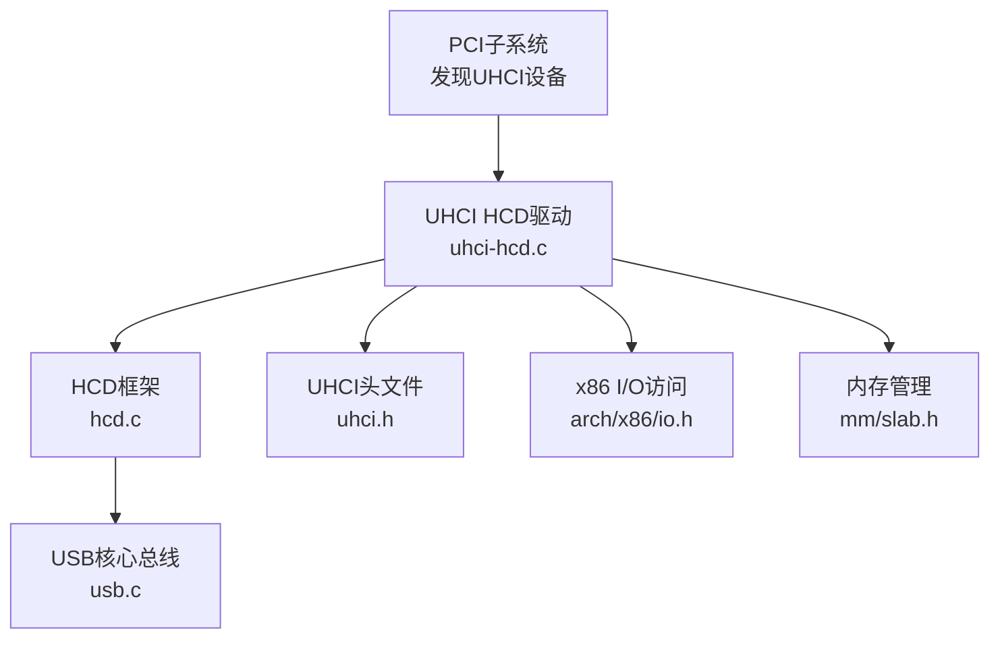
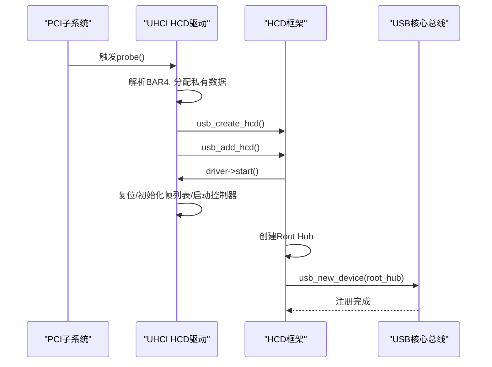
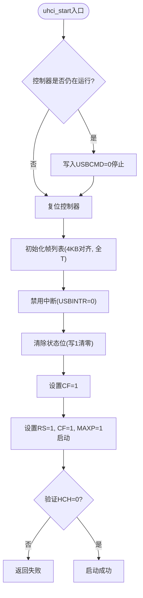
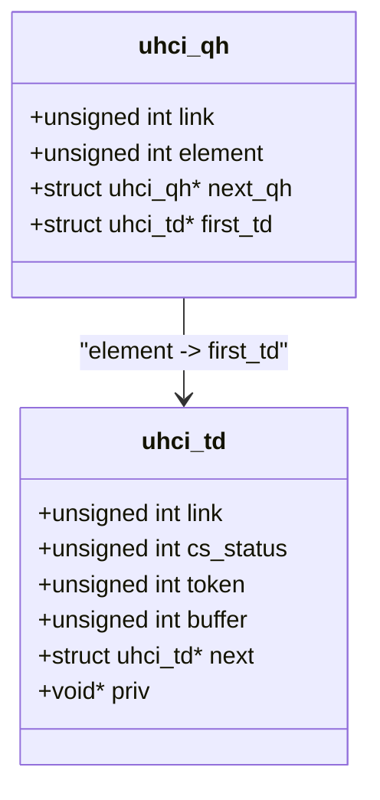
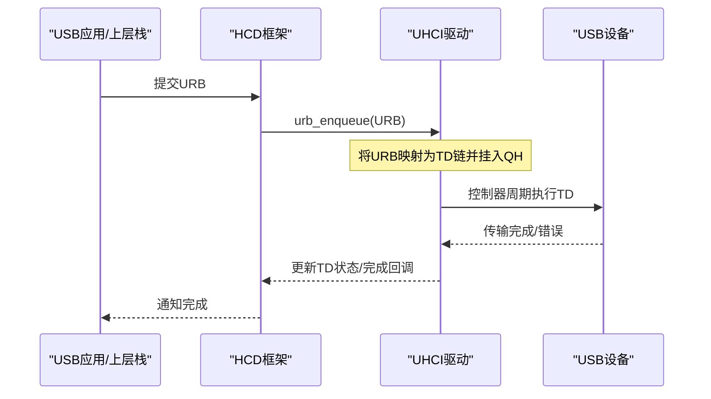
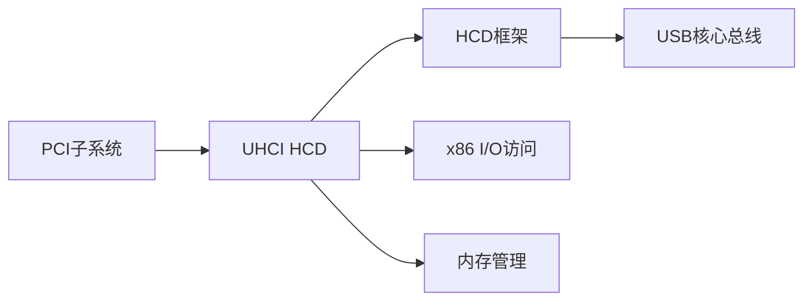

# UHCI主机控制器驱动

<cite>
**本文引用的文件**
- [kernel/usb/uhci-hcd.c](file://kernel/usb/uhci-hcd.c)
- [includes/usb/uhi.h](file://includes/usb/uhi.h)
- [includes/usb/uhci.h](file://includes/usb/uhci.h)
- [kernel/usb/hcd.c](file://kernel/usb/hcd.c)
- [includes/usb/hcd.h](file://includes/usb/hcd.h)
- [kernel/usb/usb.c](file://kernel/usb/usb.c)
- [includes/usb/usb.h](file://includes/usb/usb.h)
- [includes/pci/pci.h](file://includes/pci/pci.h)
</cite>

## 目录
1. [简介](#简介)
2. [项目结构](#项目结构)
3. [核心组件](#核心组件)
4. [架构总览](#架构总览)
5. [详细组件分析](#详细组件分析)
6. [依赖关系分析](#依赖关系分析)
7. [性能与资源特性](#性能与资源特性)
8. [故障诊断与调试](#故障诊断与调试)
9. [结论](#结论)
10. [附录：寄存器与数据结构速查](#附录寄存器与数据结构速查)

## 简介
本文件为LulaOS中UHCI（Universal Host Controller Interface）主机控制器驱动的完整技术文档。内容覆盖：
- 硬件抽象层实现：I/O端口寄存器读写、控制器复位与启动流程、帧列表初始化
- 中断处理现状与扩展点：当前简化实现未启用中断，提供后续接入中断的接口说明
- 内存管理：QH/TD池分配、对齐要求、物理地址转换
- 描述符队列机制：TD（传输描述符）与QH（队列头）的结构、链接方式与调度语义
- USB事务处理链路：从HCD框架到UHCI控制器的请求提交流程与完成通知路径
- 错误处理与重试策略：常见错误位含义、状态清理与恢复建议
- 初始化配置与调试方法：关键寄存器读写示例、日志输出定位问题

## 项目结构
UHCI驱动位于内核USB子系统下，采用分层设计：
- HCD框架层：定义统一的HCD接口（start/stop等），负责创建Root Hub、注册总线设备
- UHCI具体实现：基于PCI发现UHCI控制器，操作I/O端口寄存器，初始化帧列表并启动控制器
- USB核心总线：提供设备匹配、驱动注册、设备枚举的基础设施

图表来源
- [kernel/usb/uhci-hcd.c:275-395](file://kernel/usb/uhci-hcd.c#L275-L395)
- [kernel/usb/hcd.c:88-166](file://kernel/usb/hcd.c#L88-L166)
- [kernel/usb/usb.c:126-188](file://kernel/usb/usb.c#L126-L188)
- [includes/usb/uhci.h:17-159](file://includes/usb/uhci.h#L17-L159)

章节来源
- [kernel/usb/uhci-hcd.c:275-395](file://kernel/usb/uhci-hcd.c#L275-L395)
- [kernel/usb/hcd.c:88-166](file://kernel/usb/hcd.c#L88-L166)
- [kernel/usb/usb.c:126-188](file://kernel/usb/usb.c#L126-L188)
- [includes/usb/uhci.h:17-159](file://includes/usb/uhci.h#L17-L159)

## 核心组件
- UHCI HCD私有数据与结构体：包含I/O基址、帧列表指针、QH/TD池、端口数、运行状态等
- 寄存器定义与位域：命令、状态、中断使能、端口状态、帧列表项标志、TD控制/令牌字段
- HCD回调：start/stop用于控制器生命周期管理；urb_enqueue/dequeue在简化实现中为空
- PCI驱动：按类别码匹配UHCI控制器，解析BAR4获取I/O基址，创建并注册HCD

章节来源
- [includes/usb/uhci.h:17-159](file://includes/usb/uhci.h#L17-L159)
- [kernel/usb/uhci-hcd.c:27-262](file://kernel/usb/uhci-hcd.c#L27-L262)

## 架构总览
UHCI驱动通过PCI子系统发现控制器，随后由HCD框架统一协调控制器启动、Root Hub创建与设备注册。UHCI控制器使用I/O端口进行寄存器访问，帧列表必须4KB对齐，所有项初始化为终止项。

图表来源
- [kernel/usb/uhci-hcd.c:275-347](file://kernel/usb/uhci-hcd.c#L275-L347)
- [kernel/usb/hcd.c:125-166](file://kernel/usb/hcd.c#L125-L166)
- [kernel/usb/usb.c:178-188](file://kernel/usb/usb.c#L178-L188)

## 详细组件分析

### 硬件抽象层（HAL）：寄存器操作与控制器生命周期
- I/O端口访问封装：提供16/32位读写的内联函数，基于UHCI I/O基址偏移
- 控制器复位：设置USBCMD.HCRESET并轮询等待复位完成
- 启动流程：
  - 检查并停止可能仍在运行的控制器
  - 复位控制器
  - 初始化帧列表（分配4KB对齐内存，填充终止项，写入USBFLBASEADD）
  - 禁用中断（简化实现）
  - 清除状态位（写1清零）
  - 设置Configure Flag并启动调度器（RS=1, CF=1, MAXP=1）
- 停止流程：关闭调度器、等待HCH置位、禁用中断、释放帧列表与QH/TD池

图表来源
- [kernel/usb/uhci-hcd.c:148-202](file://kernel/usb/uhci-hcd.c#L148-L202)
- [includes/usb/uhci.h:17-75](file://includes/usb/uhci.h#L17-L75)

章节来源
- [kernel/usb/uhci-hcd.c:87-202](file://kernel/usb/uhci-hcd.c#L87-L202)
- [includes/usb/uhci.h:17-75](file://includes/usb/uhci.h#L17-L75)

### 内存管理与QH/TD池
- 帧列表：分配1024项×4字节，必须4KB对齐；每项初始化为终止项（bit0=1）
- QH/TD池：静态预分配，便于快速分配与复用；QH用于端点队列头，TD用于单次传输描述
- 对齐要求：QH与TD需满足16字节对齐；帧列表需4KB对齐；物理地址通过__pa()转换后写入寄存器
- 释放策略：在uhci_stop中释放帧列表与QH/TD池，避免内存泄漏

章节来源
- [kernel/usb/uhci-hcd.c:110-137](file://kernel/usb/uhci-hcd.c#L110-L137)
- [kernel/usb/uhci-hcd.c:231-245](file://kernel/usb/uhci-hcd.c#L231-L245)
- [includes/usb/uhci.h:67-123](file://includes/usb/uhci.h#L67-L123)

### 描述符队列工作机制：TD与QH
- TD（传输描述符）：
  - link：下一个TD/QH的物理地址，含类型位（QH或TD）
  - cs_status：控制/状态字段，包含Active、错误位（Stalled、CRC/Timeout、NAK等）
  - token：PID（SETUP/IN/OUT）、设备地址、端点、数据长度等
  - buffer：数据缓冲区物理地址
- QH（队列头）：
  - link：下一个QH的物理地址
  - element：当前TD的物理地址
  - 软件维护first_td指向该端点的第一个TD
- 调度语义：
  - 帧列表每毫秒一项，指向QH或TD
  - bit0=1表示终止（空链尾）
  - bit1=1表示QH，否则为TD

图表来源
- [includes/usb/uhci.h:95-123](file://includes/usb/uhci.h#L95-L123)

章节来源
- [includes/usb/uhci.h:76-123](file://includes/usb/uhci.h#L76-L123)

### USB事务处理流程：从提交到完成
当前实现的HCD回调中，urb_enqueue与urb_dequeue为空，因此上层USB栈无法通过标准URB通道提交传输。但框架已具备：
- HCD实例与Root Hub创建
- 控制器启动与帧列表就绪
- 预留urb_enqueue/urb_dequeue接口，可在后续实现中填充

若未来实现urb_enqueue，典型流程如下：
- 将URB转换为TD链，挂入对应端点的QH
- 将QH插入帧列表对应槽位
- 控制器周期扫描帧列表执行传输
- 完成时更新TD状态位，上层通过轮询或中断获取结果

图表来源
- [kernel/usb/uhci-hcd.c:252-262](file://kernel/usb/uhci-hcd.c#L252-L262)
- [includes/usb/hcd.h:28-48](file://includes/usb/hcd.h#L28-L48)

章节来源
- [kernel/usb/uhci-hcd.c:252-262](file://kernel/usb/uhci-hcd.c#L252-L262)
- [includes/usb/hcd.h:28-48](file://includes/usb/hcd.h#L28-L48)

### 错误处理与重试策略
- 错误位识别：
  - TD_CTRL_STALLED：端点暂停
  - TD_CTRL_DBUFERR：数据缓冲区错误
  - TD_CTRL_BABBLE：溢出检测
  - TD_CTRL_NAK：无响应
  - TD_CTRL_CRCTIMEO：CRC/超时错误
  - TD_CTRL_BITSTUFF：比特填充错误
- 状态清理：
  - 写USBSTS相应位以清除挂起状态
  - 控制器复位（HCRESET）用于严重错误恢复
- 重试策略（建议）：
  - NAK/CRC错误可有限次重试
  - Stalled需配合SetFeature/GetStatus协商
  - Babble/DBUFERR通常不可重试，需上报上层并重置端点

章节来源
- [includes/usb/uhci.h:76-85](file://includes/usb/uhci.h#L76-L85)
- [kernel/usb/uhci-hcd.c:178-181](file://kernel/usb/uhci-hcd.c#L178-L181)
- [kernel/usb/uhci-hcd.c:87-102](file://kernel/usb/uhci-hcd.c#L87-L102)

### 中断处理现状与扩展点
- 当前实现禁用中断（USBINTR=0），控制器通过轮询或上层框架驱动
- 可扩展点：
  - 启用USBINTR_IOC（完成中断）
  - 在ISR中读取USBSTS，处理TD完成与错误
  - 唤醒等待的URB并完成回调

章节来源
- [kernel/usb/uhci-hcd.c:175-177](file://kernel/usb/uhci-hcd.c#L175-L177)
- [includes/usb/uhci.h:48-54](file://includes/usb/uhci.h#L48-L54)

## 依赖关系分析
UHCI驱动依赖以下子系统：
- PCI子系统：发现UHCI设备，解析BAR4，提供中断号
- HCD框架：统一控制器生命周期管理，创建Root Hub
- USB核心总线：设备匹配与注册
- x86 I/O访问：inw/inl/outw/outl
- 内存管理：kmalloc/kfree，页对齐与物理地址转换

图表来源
- [kernel/usb/uhci-hcd.c:275-395](file://kernel/usb/uhci-hcd.c#L275-L395)
- [kernel/usb/hcd.c:88-166](file://kernel/usb/hcd.c#L88-L166)
- [kernel/usb/usb.c:126-188](file://kernel/usb/usb.c#L126-L188)

章节来源
- [kernel/usb/uhci-hcd.c:275-395](file://kernel/usb/uhci-hcd.c#L275-L395)
- [kernel/usb/hcd.c:88-166](file://kernel/usb/hcd.c#L88-L166)
- [kernel/usb/usb.c:126-188](file://kernel/usb/usb.c#L126-L188)

## 性能与资源特性
- 帧列表大小：1024项，对应1ms帧周期
- 对齐要求：帧列表4KB对齐，QH/TD 16字节对齐，确保硬件正确访问
- 池化分配：QH/TD池减少频繁分配开销，适合嵌入式环境
- 中断禁用：当前简化实现避免中断上下文复杂性，可通过轮询或后续添加中断提升实时性

[本节为通用指导，不直接分析具体文件]

## 故障诊断与调试
- 启动失败排查：
  - 检查BAR4是否为I/O空间，确认io_base正确
  - 查看控制器是否仍运行（USBSTS.HCH），必要时先停止再启动
  - 验证帧列表分配与写入USBFLBASEADD
- 控制器未启动：
  - 确认USBCMD设置（RS/CF/MAXP）
  - 轮询USBSTS.HCH，确认Halted位变化
- 传输错误：
  - 读取TD cs_status位，定位具体错误类型
  - 清除USBSTS状态位，必要时复位控制器
- 日志定位：
  - 打印io_base、端口数、启动/停止过程
  - 记录帧列表分配与初始化结果

章节来源
- [kernel/usb/uhci-hcd.c:275-347](file://kernel/usb/uhci-hcd.c#L275-L347)
- [kernel/usb/uhci-hcd.c:148-202](file://kernel/usb/uhci-hcd.c#L148-L202)
- [includes/usb/uhci.h:17-75](file://includes/usb/uhci.h#L17-L75)

## 结论
LulaOS的UHCI驱动实现了基础的控制器发现、初始化与生命周期管理，提供了QH/TD结构与帧列表机制，为后续完整URB支持奠定基础。当前简化实现未启用中断与URB提交流程，建议在后续迭代中：
- 实现urb_enqueue/urb_dequeue，完成TD链构建与调度
- 添加中断处理，提升传输效率与实时性
- 完善错误处理与重试策略，增强鲁棒性

[本节为总结性内容，不直接分析具体文件]

## 附录：寄存器与数据结构速查
- 关键寄存器：
  - USBCMD：命令（RS/HCRESET/CF/MAXP等）
  - USBSTS：状态（USBINT/ERROR/RD/HSERR/HCPE/HCH）
  - USBINTR：中断使能（TIMEOUT/RESUME/IOC/SP）
  - USBFLBASEADD：帧列表基地址（物理地址）
  - USBPORTSC1/2：端口状态与控制
- 数据结构：
  - uhci_td：link/cs_status/token/buffer/next/priv
  - uhci_qh：link/element/next_qh/first_td
  - uhci_hcd：io_base/frame_list/qh_pool/td_pool/rh_num_ports/is_stopped

章节来源
- [includes/usb/uhci.h:17-159](file://includes/usb/uhci.h#L17-L159)