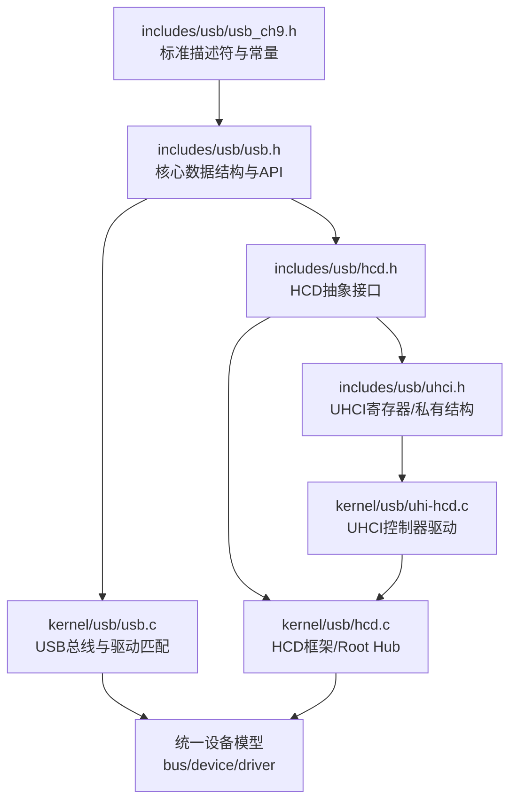
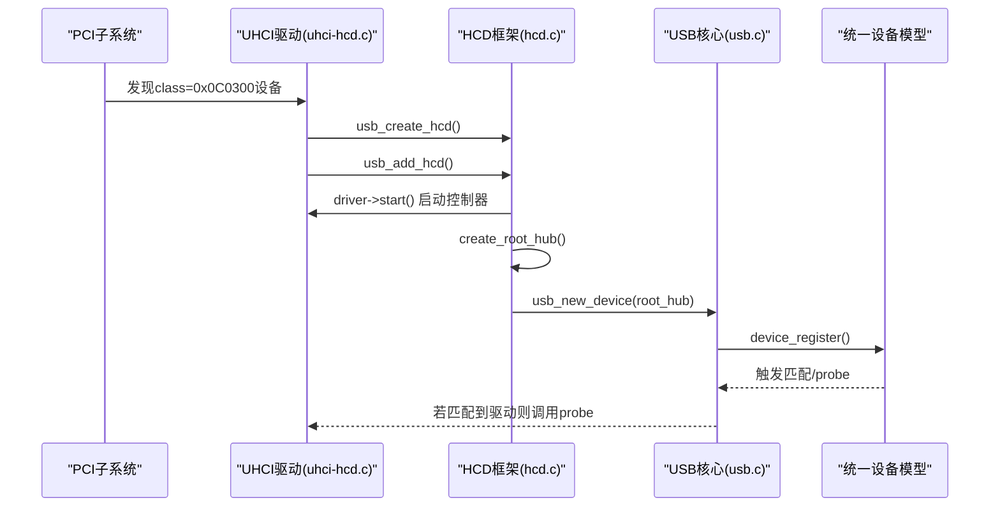
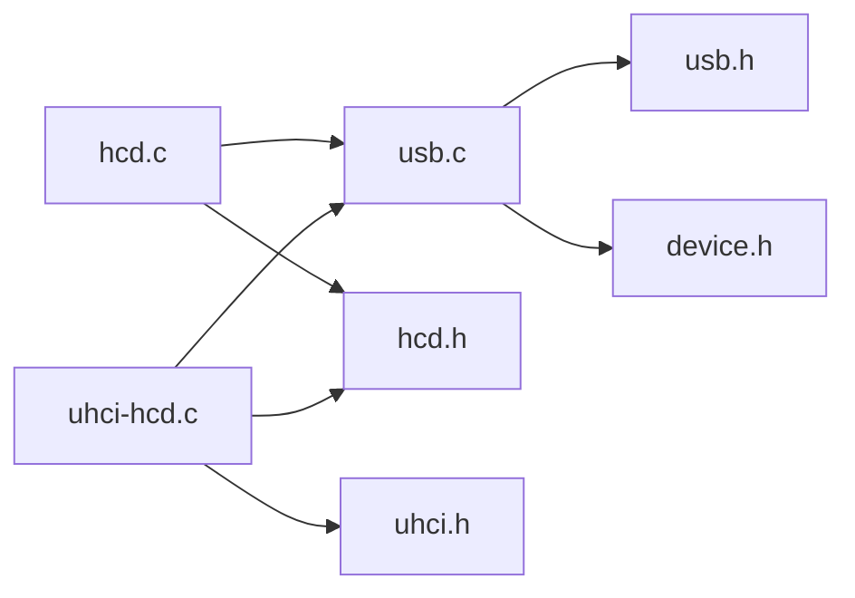
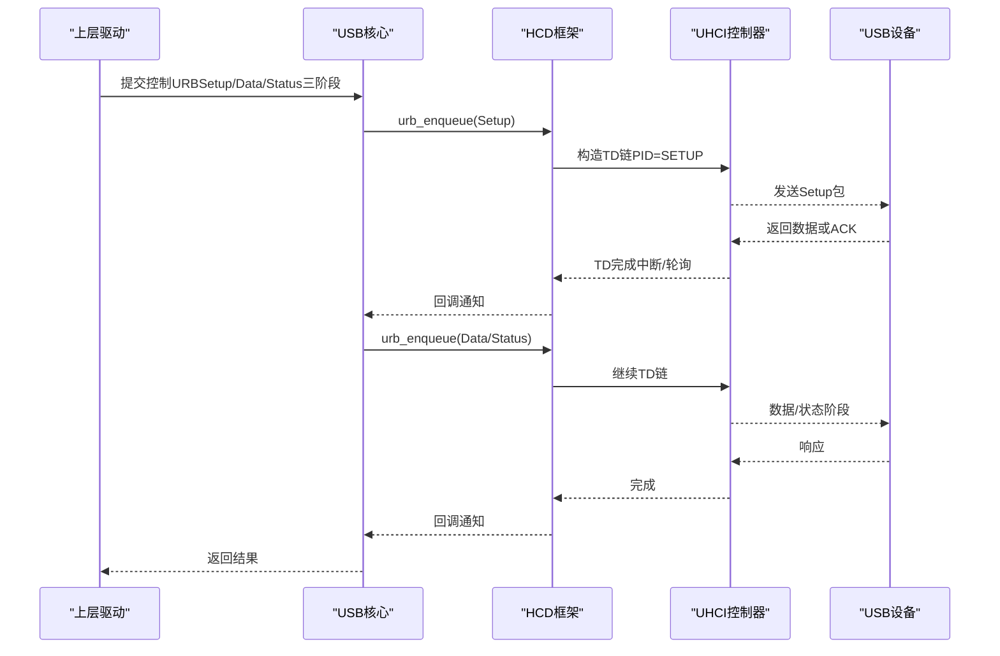

# USB协议栈实现

<cite>
**本文引用的文件**
- [usb.h](file://includes/usb/usb.h)
- [usb_ch9.h](file://includes/usb/usb_ch9.h)
- [hcd.h](file://includes/usb/hcd.h)
- [uhci.h](file://includes/usb/uhci.h)
- [usb.c](file://kernel/usb/usb.c)
- [hcd.c](file://kernel/usb/hcd.c)
- [uhci-hcd.c](file://kernel/usb/uhi-hcd.c)
</cite>

## 目录
1. [简介](#简介)
2. [项目结构](#项目结构)
3. [核心组件](#核心组件)
4. [架构总览](#架构总览)
5. [详细组件分析](#详细组件分析)
6. [依赖关系分析](#依赖关系分析)
7. [性能与带宽](#性能与带宽)
8. [故障排查指南](#故障排查指南)
9. [结论](#结论)
10. [附录：命令发送与响应流程](#附录：命令发送与响应流程)

## 简介
本文件为LulaOS的USB协议栈实现提供系统化文档，覆盖以下主题：
- USB标准描述符（设备、配置、接口、端点）的定义与处理
- USB设备枚举流程（从地址分配到配置选择）
- USB数据传输类型（控制、批量、中断、等时）的实现差异与现状
- 端点管理与带宽分配机制
- 错误处理策略与恢复机制
- USB命令发送与响应处理的流程图与代码路径指引

该实现基于Linux 2.6.20风格抽象，包含USB核心总线、HCD框架以及UHCI主机控制器驱动。当前实现聚焦于“发现并注册Root Hub”的基础能力，传输层（URB/端点调度）处于预留阶段。

## 项目结构
USB相关代码分为三层：
- 头文件定义层：集中在 includes/usb，定义标准描述符、核心数据结构、HCD抽象和UHCI寄存器/私有结构
- 核心与框架层：kernel/usb 下的 usb.c（总线与驱动匹配）、hcd.c（HCD框架与Root Hub创建）
- 具体HCD实现：kernel/usb/uhi-hcd.c（UHCI PCI驱动，控制器生命周期管理）

图表来源
- [usb_ch9.h:1-177](file://includes/usb/usb_ch9.h#L1-L177)
- [usb.h:1-181](file://includes/usb/usb.h#L1-L181)
- [usb.c:1-188](file://kernel/usb/usb.c#L1-L188)
- [hcd.h:1-111](file://includes/usb/hcd.h#L1-L111)
- [hcd.c:1-189](file://kernel/usb/hcd.c#L1-L189)
- [uhci.h:1-159](file://includes/usb/uhci.h#L1-L159)
- [uhci-hcd.c:1-396](file://kernel/usb/uhi-hcd.c#L1-L396)

章节来源
- [usb.h:1-181](file://includes/usb/usb.h#L1-L181)
- [usb_ch9.h:1-177](file://includes/usb/usb_ch9.h#L1-L177)
- [hcd.h:1-111](file://includes/usb/hcd.h#L1-L111)
- [uhci.h:1-159](file://includes/usb/uhci.h#L1-L159)
- [usb.c:1-188](file://kernel/usb/usb.c#L1-L188)
- [hcd.c:1-189](file://kernel/usb/hcd.c#L1-L189)
- [uhci-hcd.c:1-396](file://kernel/usb/uhi-hcd.c#L1-L396)

## 核心组件
- 标准描述符与常量：设备/配置/接口/端点描述符、请求码、方向/类型/接收者位、速度/状态枚举等
- 核心数据结构：usb_device、usb_host_config、usb_interface、usb_bus、usb_driver、usb_device_id、Pipe宏
- HCD抽象：hc_driver回调、usb_hcd实例、创建/添加/移除HCD的API
- UHCI实现：I/O端口寄存器访问、帧列表初始化、控制器启停、PCI探测与驱动注册

章节来源
- [usb_ch9.h:1-177](file://includes/usb/usb_ch9.h#L1-L177)
- [usb.h:1-181](file://includes/usb/usb.h#L1-L181)
- [hcd.h:1-111](file://includes/usb/hcd.h#L1-L111)
- [uhci.h:1-159](file://includes/usb/uhci.h#L1-L159)

## 架构总览
整体分层如下：
- 应用/驱动层：通过usb_driver与id_table声明支持的设备，由总线匹配后调用probe
- USB核心层：usb_bus_type负责匹配、probe/remove；usb_new_device将设备挂入总线
- HCD框架层：usb_create_hcd/usb_add_hcd/usb_remove_hcd管理控制器生命周期与Root Hub
- 具体HCD层：UHCI驱动完成PCI发现、寄存器操作、帧列表与控制器启停

图表来源
- [uhci-hcd.c:275-346](file://kernel/usb/uhi-hcd.c#L275-L346)
- [hcd.c:88-166](file://kernel/usb/hcd.c#L88-L166)
- [usb.c:126-188](file://kernel/usb/usb.c#L126-L188)

## 详细组件分析

### 标准描述符与常量（usb_ch9.h）
- 定义了bmRequestType的方向、类型、接收者位，以及标准请求码（如GET_DESCRIPTOR、SET_CONFIGURATION等）
- 描述符类型码（设备、配置、字符串、接口、端点等）
- 设备类别码（HUB、HID、MASS_STORAGE等）
- 端点属性与方向掩码、速度枚举、设备状态枚举
- 关键结构体：usb_device_descriptor、usb_config_descriptor、usb_interface_descriptor、usb_endpoint_descriptor、usb_ctrlrequest

这些是枚举与配置过程的数据基础，后续所有描述符读取与解析均基于此。

章节来源
- [usb_ch9.h:1-177](file://includes/usb/usb_ch9.h#L1-L177)

### 核心数据结构与API（usb.h）
- Pipe宏：将端点地址与方向、传输类型编码为整数，供HCD使用
- 主机侧端点/接口/配置结构：嵌入标准描述符，附加HCD私有数据指针
- usb_bus：每条USB主机控制器对应一个总线，持有root_hub指针
- usb_device：设备描述，含设备描述符、配置数组、当前激活配置、父/子设备等
- usb_driver：驱动描述符，含id_table与probe/disconnect回调
- 公共API：usb_init、usb_register_driver、usb_deregister、usb_new_device

章节来源
- [usb.h:1-181](file://includes/usb/usb.h#L1-L181)

### HCD抽象与框架（hcd.h + hcd.c）
- hc_driver：定义start/stop/reset、urb_enqueue/urb_dequeue、hub_status_data/hub_control、get_frame_number等回调
- usb_hcd：内嵌usb_bus，保存io_base、regs、irq、root_hub、flags/state、hcd_priv
- 公共API：
  - usb_create_hcd：分配并初始化usb_hcd，设置busnum、controller、flags
  - usb_add_hcd：调用driver->start、创建Root Hub、注册到总线
  - usb_remove_hcd：注销Root Hub、停止控制器、释放资源

Root Hub创建逻辑会填充设备描述符（模拟USB_CLASS_HUB），并直接标记为已配置状态以简化流程。

章节来源
- [hcd.h:1-111](file://includes/usb/hcd.h#L1-L111)
- [hcd.c:29-166](file://kernel/usb/hcd.c#L29-L166)

### UHCI主机控制器驱动（uhci.h + uhci-hcd.c）
- 寄存器与位定义：USBCMD、USBSTS、USBINTR、USBFRNUM、USBFLBASEADD、USBPORTSC等
- 帧列表：1024项，每项4字节，必须4KB对齐；项中bit0=T标志表示终止
- TD/QH结构：硬件直接使用，需物理地址对齐；TD包含link/cs_status/token/buffer及软件字段
- 控制器生命周期：
  - uhci_reset：置HCRESET并等待完成
  - uhci_init_frame_list：分配并清零帧列表，写入基址寄存器
  - uhci_start：复位、初始化帧列表、清状态、设CF、启动RS
  - uhci_stop：停止RS、等待HCH、禁中断、释放帧列表与池
- PCI驱动：
  - 识别class=0x0C0300的UHCI控制器
  - 从BAR4获取I/O基址，创建并注册HCD
  - 预分配QH/TD池（简化实现）
  - 注册pci_driver，自动探测与绑定

章节来源
- [uhci.h:1-159](file://includes/usb/uhci.h#L1-L159)
- [uhci-hcd.c:87-248](file://kernel/usb/uhi-hcd.c#L87-L248)
- [uhci-hcd.c:275-396](file://kernel/usb/uhi-hcd.c#L275-L396)

### USB总线与驱动匹配（usb.c）
- usb_bus_match：根据设备描述符与驱动的id_table进行匹配
- usb_bus_probe：匹配成功后调用驱动probe（简化实现中以device为单位）
- usb_bus_remove：调用驱动disconnect
- 公共API：
  - usb_init：注册usb_bus_type
  - usb_register_driver / usb_deregister：驱动注册/注销
  - usb_new_device：将设备挂入总线并触发匹配

章节来源
- [usb.c:20-188](file://kernel/usb/usb.c#L20-L188)

## 依赖关系分析
- usb.c依赖usb.h、device.h、printk.h、vsprintf.h
- hcd.c依赖hcd.h、usb.h、device.h、mm/slab.h、printk.h、vsprintf.h
- uhci-hcd.c依赖uhci.h、hcd.h、usb.h、pci/pci.h、arch/x86/io.h、arch/x86/page.h、mm/slab.h、printk.h、vsprintf.h

图表来源
- [usb.c:1-188](file://kernel/usb/usb.c#L1-L188)
- [hcd.c:1-189](file://kernel/usb/hcd.c#L1-L189)
- [uhci-hcd.c:1-396](file://kernel/usb/uhi-hcd.c#L1-L396)

章节来源
- [usb.c:1-188](file://kernel/usb/usb.c#L1-L188)
- [hcd.c:1-189](file://kernel/usb/hcd.c#L1-L189)
- [uhci-hcd.c:1-396](file://kernel/usb/uhi-hcd.c#L1-L396)

## 性能与带宽
- 当前实现未实现URB队列与端点调度，因此不涉及实际带宽计算与分配
- UHCI帧列表长度为1024项，对应1ms帧周期；在完整实现中，每帧可调度若干TD，用于控制/批量/中断/等时传输
- 等时传输需要按帧周期性调度，需实现get_frame_number与按帧插入TD
- 建议优化：
  - 引入URB抽象与端点队列，按传输类型组织TD链
  - 对批量/中断传输采用Q-TD链，减少CPU干预
  - 对等时传输维护每端点的周期槽位表，避免冲突
  - 增加超时与重试策略，提升鲁棒性

[本节为通用指导，不直接分析具体文件]

## 故障排查指南
- 控制器无法启动
  - 检查usbcmd是否成功置RS，且USBSTS.HCH未置位
  - 确认帧列表已正确初始化并写入USBFLBASEADD
  - 参考：[uhci-hcd.c:148-201](file://kernel/usb/uhi-hcd.c#L148-L201)
- Root Hub未注册或匹配失败
  - 确认usb_add_hcd成功调用create_root_hub并调用usb_new_device
  - 检查usb_bus_type是否正确注册，设备是否进入匹配流程
  - 参考：[hcd.c:125-166](file://kernel/usb/hcd.c#L125-L166)、[usb.c:126-188](file://kernel/usb/usb.c#L126-L188)
- 传输错误（TD状态位）
  - 关注TD_CTRL_*位：STALLED、DBUFERR、BABBLE、NAK、CRCTIMEO、BITSTUFF
  - 需在完整实现中根据错误类型采取重试、回退或上报上层策略
  - 参考：[uhci.h:76-85](file://includes/usb/uhci.h#L76-L85)
- 端口事件（连接/断开）
  - 轮询USBPORTSC.CSC/CCS，必要时执行端口复位与重新枚举
  - 参考：[uhci.h:55-66](file://includes/usb/uhci.h#L55-L66)

章节来源
- [uhci-hcd.c:148-201](file://kernel/usb/uhi-hcd.c#L148-L201)
- [hcd.c:125-166](file://kernel/usb/hcd.c#L125-L166)
- [usb.c:126-188](file://kernel/usb/usb.c#L126-L188)
- [uhci.h:55-85](file://includes/usb/uhci.h#L55-L85)

## 结论
LulaOS的USB协议栈实现了基础的分层架构：标准描述符定义、核心数据结构、HCD抽象与UHCI控制器驱动。当前重点在于控制器发现、初始化与Root Hub注册，为后续设备枚举与数据传输奠定基础。下一步工作包括实现URB与端点调度、完善枚举流程（地址分配、配置选择）、实现各类传输类型与错误恢复机制，以提升系统对真实USB设备的可用性。

[本节为总结，不直接分析具体文件]

## 附录：命令发送与响应流程
说明：当前实现未提供完整的URB/控制传输函数，以下流程为概念性示意，展示典型USB控制传输在完整实现中的步骤。

[本图为概念流程，不映射到具体源码文件]

章节来源
- [hcd.h:28-48](file://includes/usb/hcd.h#L28-L48)
- [uhci.h:95-123](file://includes/usb/uhci.h#L95-L123)