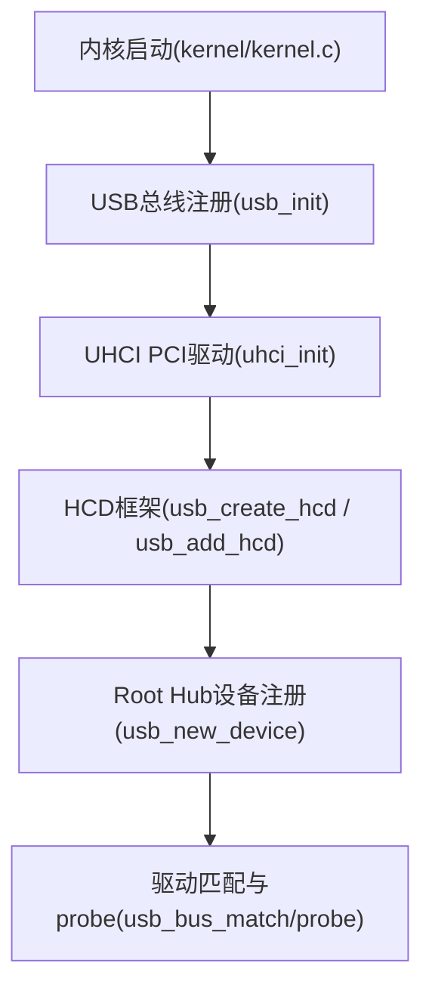
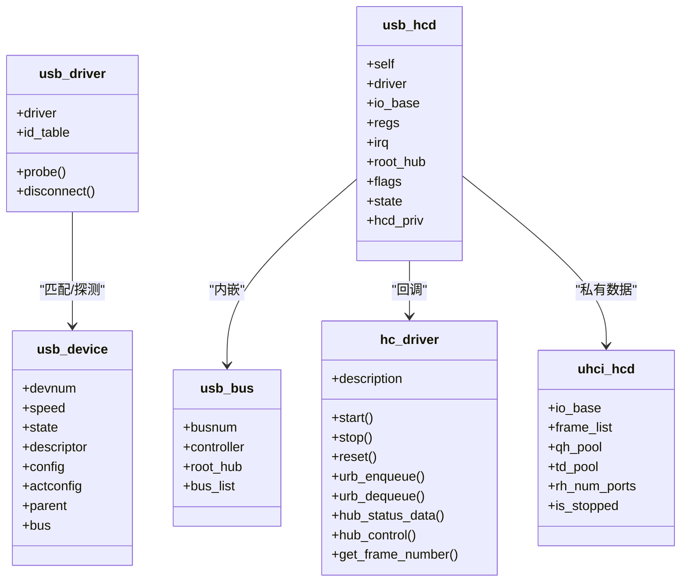
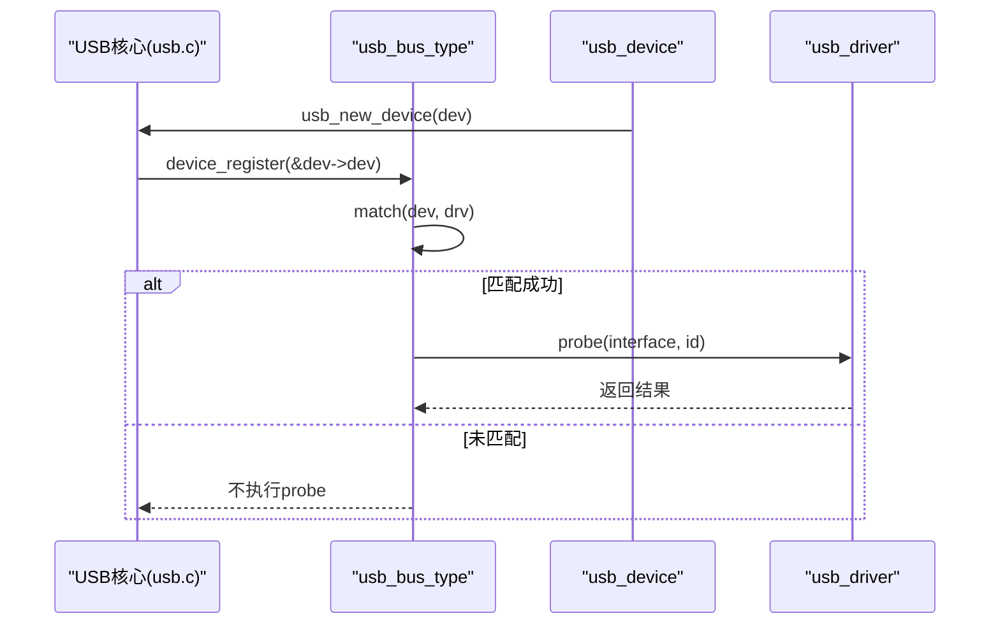
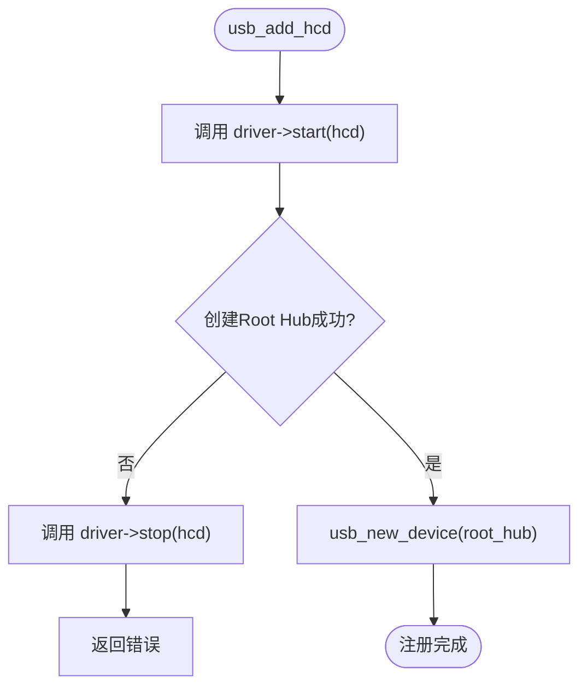
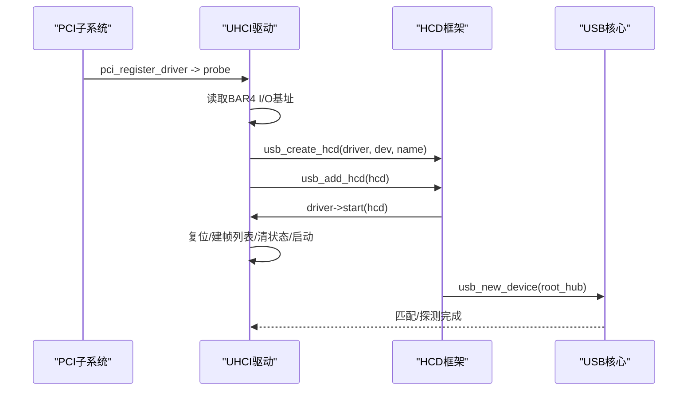
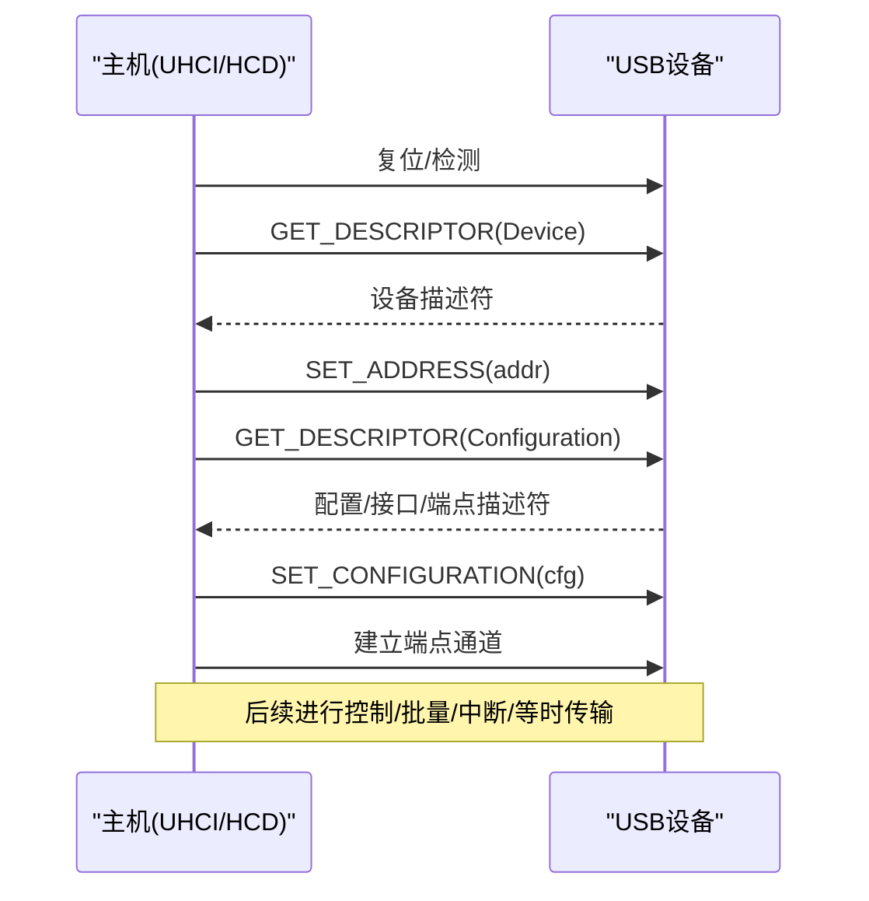
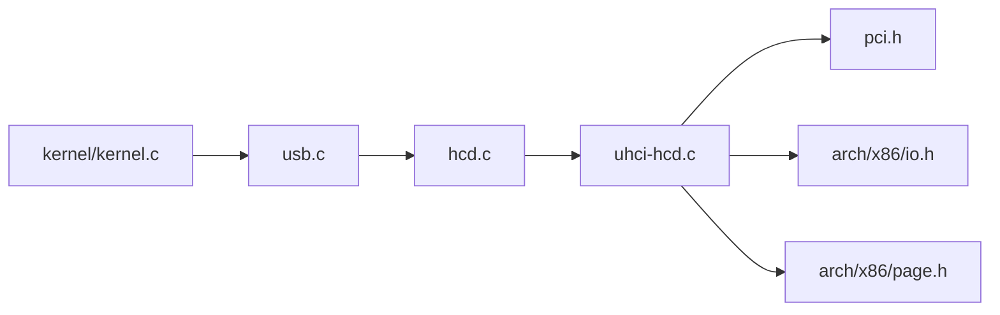

# USB子系统

<cite>
**本文引用的文件**
- [includes/usb/usb.h](file://includes/usb/usb.h)
- [includes/usb/usb_ch9.h](file://includes/usb/usb_ch9.h)
- [includes/usb/hcd.h](file://includes/usb/hcd.h)
- [includes/usb/uhci.h](file://includes/usb/uhci.h)
- [kernel/usb/usb.c](file://kernel/usb/usb.c)
- [kernel/usb/hcd.c](file://kernel/usb/hcd.c)
- [kernel/usb/uhci-hcd.c](file://kernel/usb/uhci-hcd.c)
- [kernel/kernel.c](file://kernel/kernel.c)
</cite>

## 目录
1. [简介](#简介)
2. [项目结构](#项目结构)
3. [核心组件](#核心组件)
4. [架构总览](#架构总览)
5. [详细组件分析](#详细组件分析)
6. [依赖关系分析](#依赖关系分析)
7. [性能与可扩展性](#性能与可扩展性)
8. [故障排查指南](#故障排查指南)
9. [结论](#结论)
10. [附录：开发环境与调试方法](#附录开发环境与调试方法)

## 简介
本文件系统性地梳理LulaOS的USB子系统，覆盖协议栈抽象、设备枚举与配置流程、数据传输机制、电源管理要点以及UHCI主机控制器驱动的工作方式。文档同时提供扩展开发指南、时序图与错误处理说明，帮助USB设备开发者快速搭建环境并定位问题。

## 项目结构
LulaOS的USB子系统由“核心总线 + HCD框架 + UHCI具体实现”三层组成：
- 核心总线层：定义USB设备/驱动模型、匹配与注册机制（usb_bus_type）。
- HCD框架层：抽象主机控制器生命周期、Root Hub创建与注册。
- UHCI实现层：基于PCI发现UHCI控制器，初始化寄存器、帧列表，启动调度器。

图表来源
- [kernel/kernel.c:113-117](file://kernel/kernel.c#L113-L117)
- [kernel/usb/usb.c:140-144](file://kernel/usb/usb.c#L140-L144)
- [kernel/usb/hcd.c:125-165](file://kernel/usb/hcd.c#L125-L165)
- [kernel/usb/uhci-hcd.c:391-395](file://kernel/usb/uhci-hcd.c#L391-L395)

章节来源
- [kernel/kernel.c:113-117](file://kernel/kernel.c#L113-L117)
- [kernel/usb/usb.c:140-144](file://kernel/usb/usb.c#L140-L144)
- [kernel/usb/hcd.c:125-165](file://kernel/usb/hcd.c#L125-L165)
- [kernel/usb/uhci-hcd.c:391-395](file://kernel/usb/uhci-hcd.c#L391-L395)

## 核心组件
- USB标准描述符与请求码：集中在usb_ch9.h，涵盖方向、类型、接收者、标准请求、描述符类型、速度/状态枚举、packed描述符结构等。
- USB核心数据结构：usb_device、usb_interface、usb_host_config、usb_bus、usb_driver、usb_device_id等，位于usb.h；并提供管道宏与辅助宏。
- HCD抽象：hc_driver回调接口、usb_hcd实例、公共API（创建/添加/移除HCD），位于hcd.h。
- UHCI私有定义：寄存器偏移、命令/状态/中断位、端口控制位、帧列表常量、TD/QH结构、uhci_hcd私有数据及uhci_init入口，位于uhci.h。

章节来源
- [includes/usb/usb_ch9.h:11-176](file://includes/usb/usb_ch9.h#L11-L176)
- [includes/usb/usb.h:16-180](file://includes/usb/usb.h#L16-L180)
- [includes/usb/hcd.h:16-110](file://includes/usb/hcd.h#L16-L110)
- [includes/usb/uhci.h:17-158](file://includes/usb/uhci.h#L17-L158)

## 架构总览
整体采用分层设计：
- 上层：USB设备驱动通过usb_driver注册到usb_bus_type，按id_table匹配设备。
- 中层：HCD框架负责控制器生命周期、Root Hub创建与总线注册。
- 下层：UHCI驱动完成PCI发现、I/O空间映射、寄存器初始化、帧列表分配与调度器启动。

图表来源
- [includes/usb/usb.h:101-158](file://includes/usb/usb.h#L101-L158)
- [includes/usb/hcd.h:28-76](file://includes/usb/hcd.h#L28-L76)
- [includes/usb/uhci.h:130-146](file://includes/usb/uhci.h#L130-L146)

## 详细组件分析

### USB核心总线与驱动匹配
- 总线类型usb_bus_type定义了match/probe/remove回调，将USB设备纳入统一设备模型。
- 匹配逻辑遍历驱动的id_table，依据match_flags对厂商、产品、类别、子类别、协议进行精确匹配。
- 注册流程：
  - usb_register_driver设置driver.bus为usb_bus_type并调用底层driver_register触发匹配。
  - usb_new_device将设备挂入总线并触发匹配。
  - 匹配成功后调用驱动probe；断开时调用disconnect。

图表来源
- [kernel/usb/usb.c:79-131](file://kernel/usb/usb.c#L79-L131)
- [kernel/usb/usb.c:151-187](file://kernel/usb/usb.c#L151-L187)

章节来源
- [kernel/usb/usb.c:22-131](file://kernel/usb/usb.c#L22-L131)
- [kernel/usb/usb.c:151-187](file://kernel/usb/usb.c#L151-L187)

### HCD框架与Root Hub
- usb_create_hcd分配并初始化usb_hcd，设置busnum、控制器指针、标志位。
- usb_add_hcd调用driver->start启动硬件，创建Root Hub设备，并将其注册到usb_bus_type。
- usb_remove_hcd注销Root Hub、停止控制器、释放资源。
- Root Hub在简化实现中直接填充描述符并标记为已配置，便于后续Hub功能扩展。

图表来源
- [kernel/usb/hcd.c:88-115](file://kernel/usb/hcd.c#L88-L115)
- [kernel/usb/hcd.c:125-165](file://kernel/usb/hcd.c#L125-L165)
- [kernel/usb/hcd.c:171-188](file://kernel/usb/hcd.c#L171-L188)

章节来源
- [kernel/usb/hcd.c:29-81](file://kernel/usb/hcd.c#L29-L81)
- [kernel/usb/hcd.c:88-165](file://kernel/usb/hcd.c#L88-L165)
- [kernel/usb/hcd.c:171-188](file://kernel/usb/hcd.c#L171-L188)

### UHCI主机控制器驱动
- PCI发现：匹配class=0x0C0300的UHCI控制器，使能设备并从BAR4获取I/O基址。
- 初始化流程：
  - 复位控制器（USBCMD.HCRESET）并等待完成。
  - 分配并初始化帧列表（1024项，每项4字节，4KB对齐），写入USBFLBASEADD。
  - 禁用所有中断（简化实现暂不使用中断驱动）。
  - 清除状态位，设置Configure Flag（CF=1），启动调度器（RS=1）。
- 生命周期：
  - start：复位、建帧列表、清状态、启动。
  - stop：停止调度器、等待HCH置位、清中断、释放帧列表与池。
- 私有数据结构：
  - uhci_td：传输描述符，含link/cs_status/token/buffer及软件字段next/priv。
  - uhci_qh：队列头，含link/element及软件字段next_qh/first_td。
  - uhci_hcd：保存I/O基址、帧列表、QH/TD池、端口数、运行状态。

图表来源
- [kernel/usb/uhci-hcd.c:275-346](file://kernel/usb/uhci-hcd.c#L275-L346)
- [kernel/usb/uhci-hcd.c:148-201](file://kernel/usb/uhci-hcd.c#L148-L201)
- [kernel/usb/hcd.c:125-165](file://kernel/usb/hcd.c#L125-L165)

章节来源
- [kernel/usb/uhci-hcd.c:87-201](file://kernel/usb/uhci-hcd.c#L87-L201)
- [kernel/usb/uhci-hcd.c:207-248](file://kernel/usb/uhci-hcd.c#L207-L248)
- [kernel/usb/uhci-hcd.c:275-346](file://kernel/usb/uhci-hcd.c#L275-L346)
- [kernel/usb/uhci-hcd.c:391-395](file://kernel/usb/uhci-hcd.c#L391-L395)

### 设备枚举与配置流程（概念性时序）
尽管当前代码以Root Hub注册为主，但完整的USB设备枚举通常包括：
- 上电检测与复位
- 获取设备描述符
- 设置地址
- 获取配置描述符
- 选择配置并激活接口
- 端点初始化与数据传输建立

[此图为概念性流程图，不直接对应具体源码文件]

### 数据传输与URB（当前实现状态）
- 当前UHCI驱动预留了urb_enqueue/urb_dequeue回调位置，但未实现完整URB队列与TD链调度。
- 传输抽象使用pipe宏将端点地址与方向编码为整数，供上层构建控制/批量/中断/等时传输。
- 建议后续扩展：
  - 实现TD链构建与QH链接到帧列表槽位。
  - 实现中断或轮询机制以处理TD完成。
  - 增加错误重试与超时处理。

章节来源
- [includes/usb/usb.h:29-49](file://includes/usb/usb.h#L29-L49)
- [includes/usb/hcd.h:36-48](file://includes/usb/hcd.h#L36-L48)
- [kernel/usb/uhci-hcd.c:252-262](file://kernel/usb/uhci-hcd.c#L252-L262)

### 电源管理与Hub控制（当前实现状态）
- UHCI支持全局挂起/恢复、端口复位、连接状态检测等能力（寄存器位定义完备）。
- 当前简化实现未启用中断驱动，Hub控制回调为空，电源管理主要在控制器启停阶段体现。
- 建议后续扩展：
  - 实现hub_status_data/hub_control以响应插拔事件。
  - 实现端口级电源门控与唤醒。
  - 结合系统电源状态机协调USB子系统。

章节来源
- [includes/usb/uhci.h:28-66](file://includes/usb/uhci.h#L28-L66)
- [kernel/usb/uhci-hcd.c:148-201](file://kernel/usb/uhci-hcd.c#L148-L201)
- [kernel/usb/uhci-hcd.c:207-248](file://kernel/usb/uhci-hcd.c#L207-L248)

## 依赖关系分析
- 启动顺序：内核启动后先注册USB总线，再注册UHCI PCI驱动，确保总线可用后再发现控制器。
- 模块耦合：
  - usb.c依赖device模型与printk/vsprintf。
  - hcd.c依赖slab分配器与device模型。
  - uhci-hcd.c依赖PCI子系统、x86 I/O访问、页表转换(__pa)。
- 外部依赖：
  - PCI枚举与BAR解析。
  - 内存分配器（kmalloc/kfree）。
  - 打印与格式化输出。

图表来源
- [kernel/kernel.c:113-117](file://kernel/kernel.c#L113-L117)
- [kernel/usb/usb.c:14-18](file://kernel/usb/usb.c#L14-L18)
- [kernel/usb/hcd.c:12-20](file://kernel/usb/hcd.c#L12-L20)
- [kernel/usb/uhci-hcd.c:16-25](file://kernel/usb/uhci-hcd.c#L16-L25)

章节来源
- [kernel/kernel.c:113-117](file://kernel/kernel.c#L113-L117)
- [kernel/usb/usb.c:14-18](file://kernel/usb/usb.c#L14-L18)
- [kernel/usb/hcd.c:12-20](file://kernel/usb/hcd.c#L12-L20)
- [kernel/usb/uhci-hcd.c:16-25](file://kernel/usb/uhci-hcd.c#L16-L25)

## 性能与可扩展性
- 帧列表大小固定为1024项，适合Full/Low Speed场景；未来可考虑动态调整或按需分配。
- QH/TD池静态分配，简化实现但缺乏弹性；建议改为对象池+LRU回收策略。
- 当前未启用中断驱动，可能影响吞吐与时延；建议引入软中断/任务队列处理TD完成。
- 错误处理与重试：需完善TD错误位（如CRCTIMEO、STALLED、BABBLE）的处理与回退策略。
- 可扩展性：
  - 新增EHCI/OHCI HCD只需实现hc_driver回调并遵循相同注册流程。
  - 设备驱动仅需实现usb_driver与id_table即可接入。

[本节为通用指导，不直接分析具体文件]

## 故障排查指南
- 控制器无法启动：
  - 检查USBCMD是否成功置位RS且USBSTS的HCH未置位。
  - 确认帧列表已正确写入USBFLBASEADD且物理地址对齐。
  - 参考：[kernel/usb/uhci-hcd.c:148-201](file://kernel/usb/uhci-hcd.c#L148-L201)
- Root Hub未注册：
  - 确认usb_add_hcd中create_root_hub成功且usb_new_device返回非负值。
  - 参考：[kernel/usb/hcd.c:125-165](file://kernel/usb/hcd.c#L125-L165)
- 驱动未匹配：
  - 检查usb_driver的id_table是否正确填写match_flags与字段。
  - 确认usb_bus_match逻辑与设备描述符一致。
  - 参考：[kernel/usb/usb.c:22-85](file://kernel/usb/usb.c#L22-L85)
- 传输失败：
  - 检查TD状态位（如CRCTIMEO、STALLED、Babble）并实现重试/清理。
  - 建议在后续实现中增加日志与统计计数。
  - 参考：[includes/usb/uhci.h:76-92](file://includes/usb/uhci.h#L76-L92)

章节来源
- [kernel/usb/uhci-hcd.c:148-201](file://kernel/usb/uhci-hcd.c#L148-L201)
- [kernel/usb/hcd.c:125-165](file://kernel/usb/hcd.c#L125-L165)
- [kernel/usb/usb.c:22-85](file://kernel/usb/usb.c#L22-L85)
- [includes/usb/uhci.h:76-92](file://includes/usb/uhci.h#L76-L92)

## 结论
LulaOS的USB子系统已具备清晰的层次结构与基础能力：USB总线与驱动模型、HCD框架与Root Hub注册、UHCI控制器发现与启动。当前重点在于完善数据传输（URB/TD链）、中断驱动与Hub控制，以实现完整的设备枚举、数据传输与电源管理。在此基础上，新增HCD或设备驱动的成本较低，具备良好的可扩展性。

[本节为总结，不直接分析具体文件]

## 附录：开发环境与调试方法
- 开发环境
  - 使用Bochs/QEMU加载内核镜像，启用USB控制器（UHCI）与串口输出以便日志观察。
  - 确保PCI枚举正常，BAR4映射为I/O空间。
- 编译与运行
  - 在Makefile中添加USB相关目标，确保包含usb.c、hcd.c、uhci-hcd.c。
  - 在kernel.c中保持usb_init与uhci_init的调用顺序。
- 调试技巧
  - 利用printk输出关键路径：控制器启动、帧列表初始化、Root Hub注册、驱动匹配。
  - 使用GDB断点在uhci_start、usb_add_hcd、usb_bus_probe处观察寄存器与状态。
  - 逐步验证：先确认控制器启动，再验证Root Hub注册，最后实现数据传输。
- 扩展步骤
  - 实现urb_enqueue/urb_dequeue：构建TD链、链接到QH、插入帧列表槽位。
  - 实现中断处理：读取USBSTS，处理完成/错误，唤醒等待队列。
  - 实现Hub控制：响应插拔事件，更新设备树与驱动匹配。

[本节为通用指导，不直接分析具体文件]