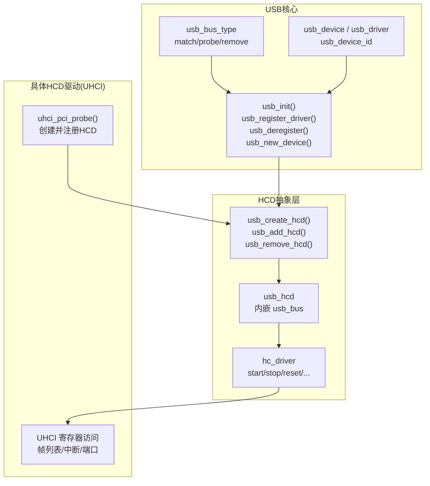
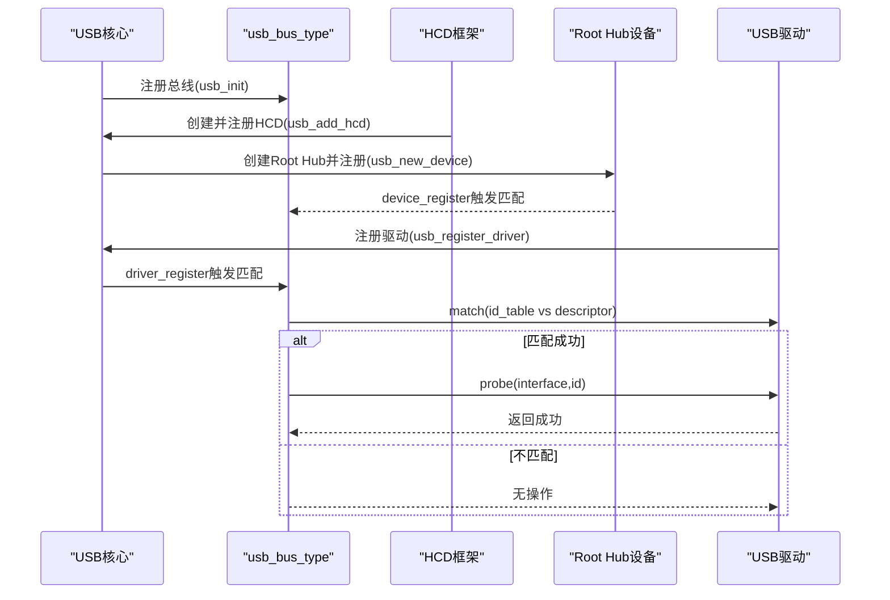
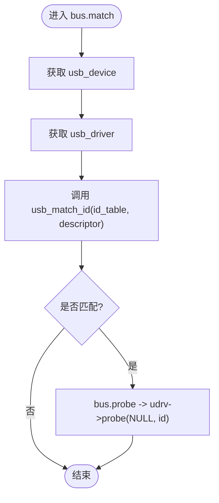
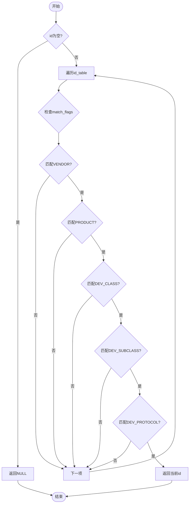
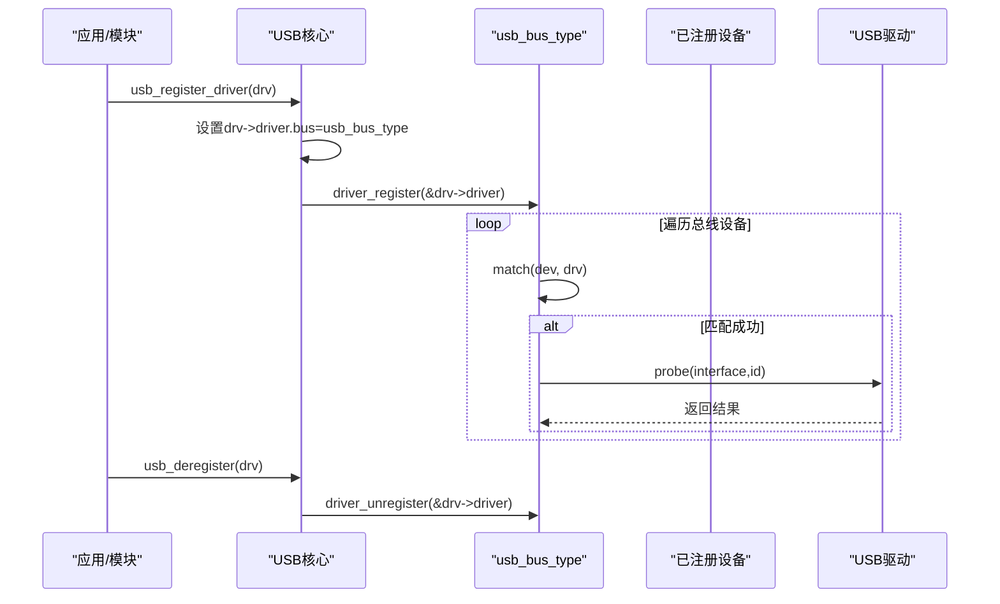
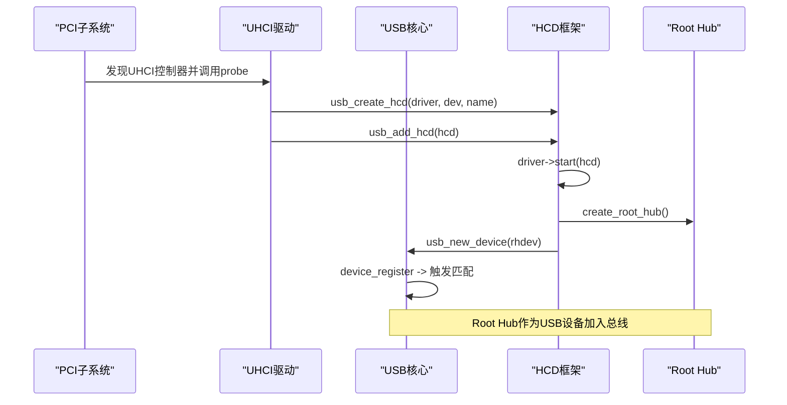
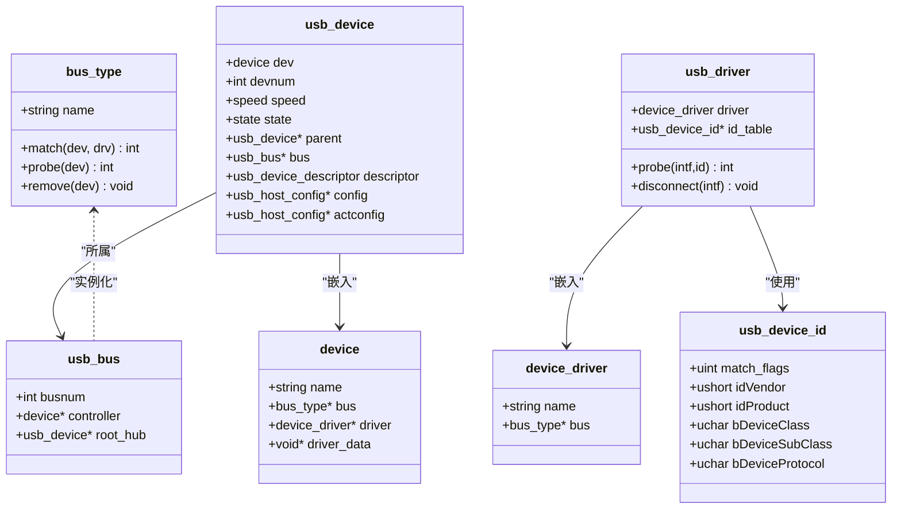
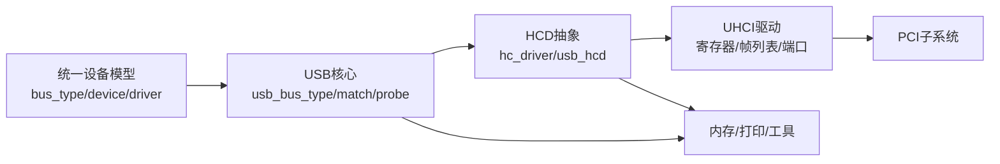

# USB核心框架

<cite>
**本文引用的文件**
- [includes/usb/usb.h](file://includes/usb/usb.h)
- [kernel/usb/usb.c](file://kernel/usb/usb.c)
- [includes/usb/hcd.h](file://includes/usb/hcd.h)
- [kernel/usb/hcd.c](file://kernel/usb/hcd.c)
- [includes/usb/usb_ch9.h](file://includes/usb/usb_ch9.h)
- [includes/device/device.h](file://includes/device/device.h)
- [kernel/usb/uhci-hcd.c](file://kernel/usb/uhci-hcd.c)
</cite>

## 目录
1. [简介](#简介)
2. [项目结构](#项目结构)
3. [核心组件](#核心组件)
4. [架构总览](#架构总览)
5. [详细组件分析](#详细组件分析)
6. [依赖关系分析](#依赖关系分析)
7. [性能考虑](#性能考虑)
8. [故障排查指南](#故障排查指南)
9. [结论](#结论)
10. [附录：驱动注册与使用示例](#附录驱动注册与使用示例)

## 简介
本文件为 LulaOS USB 核心框架的技术文档，聚焦于 USB 总线类型的实现、设备匹配机制、驱动注册流程与设备发现过程。重点说明 usb_bus_type 的结构定义与回调函数实现，详解 usb_match_id 的匹配逻辑（vendor/product/class/subclass/protocol），并阐述 usb_register_driver 与 usb_deregister 的驱动生命周期管理。同时提供 USB 驱动的注册和使用示例，包含完整的代码片段路径与配置方法。

## 项目结构
USB 子系统由“核心总线”、“HCD抽象层”和“具体HCD驱动”三层组成：
- 核心总线：定义 usb_bus_type、设备/驱动模型、匹配与探测流程
- HCD抽象层：定义 hc_driver、usb_hcd，封装控制器生命周期与 Root Hub 创建
- 具体HCD驱动：以 UHCI 为例，完成硬件初始化、帧列表设置、Root Hub 注册

图表来源
- [kernel/usb/usb.c:126-131](file://kernel/usb/usb.c#L126-L131)
- [kernel/usb/hcd.c:88-115](file://kernel/usb/hcd.c#L88-L115)
- [kernel/usb/uhci-hcd.c:252-262](file://kernel/usb/uhci-hcd.c#L252-L262)

章节来源
- [includes/usb/usb.h:97-158](file://includes/usb/usb.h#L97-L158)
- [includes/usb/hcd.h:23-76](file://includes/usb/hcd.h#L23-L76)
- [kernel/usb/hcd.c:88-115](file://kernel/usb/hcd.c#L88-L115)
- [kernel/usb/uhci-hcd.c:275-346](file://kernel/usb/uhci-hcd.c#L275-L346)

## 核心组件
- usb_bus_type：USB 总线类型，定义 name、match、probe、remove 回调，用于统一设备模型下的匹配与绑定
- usb_device / usb_driver / usb_device_id：设备描述、驱动描述与匹配表项，构成匹配基础
- HCD 抽象：hc_driver 与 usb_hcd，封装控制器生命周期与 Root Hub 管理
- 公共API：usb_init、usb_register_driver、usb_deregister、usb_new_device、usb_create_hcd、usb_add_hcd、usb_remove_hcd

章节来源
- [includes/usb/usb.h:97-158](file://includes/usb/usb.h#L97-L158)
- [includes/usb/hcd.h:23-76](file://includes/usb/hcd.h#L23-L76)
- [kernel/usb/usb.c:140-187](file://kernel/usb/usb.c#L140-L187)
- [kernel/usb/hcd.c:88-189](file://kernel/usb/hcd.c#L88-L189)

## 架构总览
USB 子系统的启动与设备发现流程如下：
- 系统启动时调用 usb_init() 注册 usb_bus_type
- HCD 驱动（如 UHCI）通过 pci_register_driver 发现控制器，在 probe 中创建并注册 HCD
- usb_add_hcd() 启动控制器、创建 Root Hub，并通过 usb_new_device() 将 Root Hub 挂入 usb_bus_type
- 当驱动通过 usb_register_driver() 注册后，总线会遍历设备并尝试匹配；匹配成功则调用 probe

图表来源
- [kernel/usb/usb.c:140-187](file://kernel/usb/usb.c#L140-L187)
- [kernel/usb/hcd.c:125-166](file://kernel/usb/hcd.c#L125-L166)
- [kernel/usb/uhci-hcd.c:391-395](file://kernel/usb/uhci-hcd.c#L391-L395)

## 详细组件分析

### USB总线类型与回调
- usb_bus_type 定义了 USB 总线名称与回调：
  - match：比较设备描述符与驱动 id_table
  - probe：匹配成功后调用驱动 probe
  - remove：卸载时调用驱动 disconnect
- 简化实现中，probe 直接以 usb_device 为单位调用驱动 probe，未区分接口

图表来源
- [kernel/usb/usb.c:79-131](file://kernel/usb/usb.c#L79-L131)

章节来源
- [kernel/usb/usb.c:79-131](file://kernel/usb/usb.c#L79-L131)
- [includes/usb/usb.h:97-158](file://includes/usb/usb.h#L97-L158)

### usb_match_id 匹配逻辑
- 遍历驱动 id_table，直到遇到终止项
- 根据 match_flags 决定参与匹配的字段：
  - VENDOR/PRODUCT：精确匹配 idVendor/idProduct
  - DEV_CLASS/SUBCLASS/PROTOCOL：精确匹配 bDeviceClass/bDeviceSubClass/bDeviceProtocol
- 所有被标志位选中的字段必须全部匹配才认为该项匹配成功

图表来源
- [kernel/usb/usb.c:30-70](file://kernel/usb/usb.c#L30-L70)
- [includes/usb/usb.h:22-28](file://includes/usb/usb.h#L22-L28)

章节来源
- [kernel/usb/usb.c:30-70](file://kernel/usb/usb.c#L30-L70)
- [includes/usb/usb.h:22-28](file://includes/usb/usb.h#L22-L28)

### 驱动注册与注销生命周期
- usb_register_driver：
  - 校验参数，设置 drv->driver.bus = &usb_bus_type，初始化链表节点
  - 调用 driver_register() 触发总线匹配流程
- usb_deregister：
  - 调用 driver_unregister() 从总线移除驱动，解除绑定并清理资源

图表来源
- [kernel/usb/usb.c:151-171](file://kernel/usb/usb.c#L151-L171)
- [includes/device/device.h:68-77](file://includes/device/device.h#L68-L77)

章节来源
- [kernel/usb/usb.c:151-171](file://kernel/usb/usb.c#L151-L171)
- [includes/device/device.h:68-77](file://includes/device/device.h#L68-L77)

### 设备发现与 Root Hub 注册
- HCD 抽象层负责控制器生命周期与 Root Hub 管理：
  - usb_create_hcd：分配并初始化 usb_hcd，设置 busnum、controller、flags
  - usb_add_hcd：调用 driver->start() 启动硬件，创建 Root Hub，并通过 usb_new_device() 注册到 usb_bus_type
  - usb_remove_hcd：注销 Root Hub、停止控制器、释放资源
- UHCI 具体实现：
  - uhci_pci_probe：发现 PCI 类设备，读取 BAR4 I/O 基址，创建 HCD 并注册
  - uhci_start：复位控制器、初始化帧列表、启动调度器
  - uhci_stop：停止调度器、释放帧列表与池资源

图表来源
- [kernel/usb/hcd.c:88-166](file://kernel/usb/hcd.c#L88-L166)
- [kernel/usb/uhci-hcd.c:275-346](file://kernel/usb/uhci-hcd.c#L275-L346)
- [kernel/usb/uhci-hcd.c:148-202](file://kernel/usb/uhci-hcd.c#L148-L202)

章节来源
- [kernel/usb/hcd.c:88-189](file://kernel/usb/hcd.c#L88-L189)
- [kernel/usb/uhci-hcd.c:148-202](file://kernel/usb/uhci-hcd.c#L148-L202)
- [kernel/usb/uhci-hcd.c:275-346](file://kernel/usb/uhci-hcd.c#L275-L346)

### 数据结构与关系图

图表来源
- [includes/device/device.h:32-66](file://includes/device/device.h#L32-L66)
- [includes/usb/usb.h:97-158](file://includes/usb/usb.h#L97-L158)

章节来源
- [includes/device/device.h:32-66](file://includes/device/device.h#L32-L66)
- [includes/usb/usb.h:97-158](file://includes/usb/usb.h#L97-L158)

## 依赖关系分析
- 核心总线依赖统一设备模型（bus_type、device、device_driver）
- HCD抽象层依赖核心总线与内存分配、打印等基础设施
- UHCI驱动依赖PCI子系统、I/O访问、页管理与内存分配

图表来源
- [includes/device/device.h:32-66](file://includes/device/device.h#L32-L66)
- [kernel/usb/usb.c:126-131](file://kernel/usb/usb.c#L126-L131)
- [kernel/usb/hcd.c:88-115](file://kernel/usb/hcd.c#L88-L115)
- [kernel/usb/uhci-hcd.c:275-346](file://kernel/usb/uhci-hcd.c#L275-L346)

章节来源
- [includes/device/device.h:32-66](file://includes/device/device.h#L32-L66)
- [kernel/usb/usb.c:126-131](file://kernel/usb/usb.c#L126-L131)
- [kernel/usb/hcd.c:88-115](file://kernel/usb/hcd.c#L88-L115)
- [kernel/usb/uhci-hcd.c:275-346](file://kernel/usb/uhci-hcd.c#L275-L346)

## 性能考虑
- 匹配复杂度：usb_match_id 线性扫描 id_table，时间复杂度 O(N)，N 为表项数；建议合理组织 id_table，避免过大
- 设备注册：device_register 与 driver_register 均可能触发匹配，频繁注册/注销会带来开销；建议在初始化阶段批量注册
- HCD 启动：UHCI 启动涉及寄存器写入与状态轮询，需确保超时处理与错误恢复
- 内存分配：Root Hub 与 HCD 私有数据使用 kmalloc/kfree，注意失败路径与资源清理

[本节为通用指导，无需特定文件引用]

## 故障排查指南
- 总线未注册：确认 usb_init() 已调用且 bus_register() 成功
- 驱动未匹配：检查驱动 id_table 的 match_flags 与设备 descriptor 字段是否一致
- HCD 启动失败：查看 start 回调返回值与状态寄存器，确认帧列表与中断配置正确
- Root Hub 注册失败：确认 usb_new_device() 返回值与设备名称生成逻辑

章节来源
- [kernel/usb/usb.c:140-187](file://kernel/usb/usb.c#L140-L187)
- [kernel/usb/hcd.c:125-166](file://kernel/usb/hcd.c#L125-L166)
- [kernel/usb/uhci-hcd.c:148-202](file://kernel/usb/uhci-hcd.c#L148-L202)

## 结论
LulaOS USB 核心框架通过统一的设备模型实现了 USB 总线类型、设备匹配与驱动生命周期管理。usb_bus_type 的 match/probe/remove 回调与 usb_match_id 的匹配逻辑构成了设备-驱动绑定的核心。HCD 抽象层屏蔽了不同控制器的差异，UHCI 驱动提供了具体的硬件实现。整体架构清晰、可扩展性强，便于后续添加更多 HCD 与上层 USB 协议栈。

[本节为总结性内容，无需特定文件引用]

## 附录：驱动注册与使用示例
以下示例展示如何编写一个 USB 驱动，声明支持的设备及匹配规则，并在模块初始化时注册驱动，在 probe 中完成设备初始化。

- 驱动结构体与匹配表
  - 定义 usb_driver，包含驱动名、id_table、probe 与 disconnect 回调
  - 定义 usb_device_id 数组，设置 match_flags 与对应字段（vendor/product/class/subclass/protocol）
  - 参考路径：[includes/usb/usb.h:132-158](file://includes/usb/usb.h#L132-L158)

- 注册与注销
  - 在模块初始化中调用 usb_register_driver(&my_usb_driver)
  - 在模块退出中调用 usb_deregister(&my_usb_driver)
  - 参考路径：[kernel/usb/usb.c:151-171](file://kernel/usb/usb.c#L151-L171)

- 设备发现与匹配
  - 当 USB 设备插入或 Root Hub 注册后，总线会遍历设备并调用 match
  - 若匹配成功，调用 probe(interface, id)
  - 参考路径：[kernel/usb/usb.c:79-111](file://kernel/usb/usb.c#L79-L111)

- 配置方法
  - 在 id_table 中按需求启用 match_flags：
    - USB_DEVICE_ID_MATCH_VENDOR：匹配厂商ID
    - USB_DEVICE_ID_MATCH_PRODUCT：匹配产品ID
    - USB_DEVICE_ID_MATCH_DEV_CLASS：匹配设备类别
    - USB_DEVICE_ID_MATCH_DEV_SUBCLASS：匹配设备子类别
    - USB_DEVICE_ID_MATCH_DEV_PROTOCOL：匹配设备协议
  - 参考路径：[includes/usb/usb.h:22-28](file://includes/usb/usb.h#L22-L28)

- 完整代码片段路径
  - 驱动定义与匹配表：[includes/usb/usb.h:132-158](file://includes/usb/usb.h#L132-L158)
  - 驱动注册/注销：[kernel/usb/usb.c:151-171](file://kernel/usb/usb.c#L151-L171)
  - 匹配逻辑：[kernel/usb/usb.c:30-70](file://kernel/usb/usb.c#L30-L70)
  - 设备发现流程：[kernel/usb/hcd.c:125-166](file://kernel/usb/hcd.c#L125-L166)

[本节为示例与配置说明，引用了相关源文件路径]