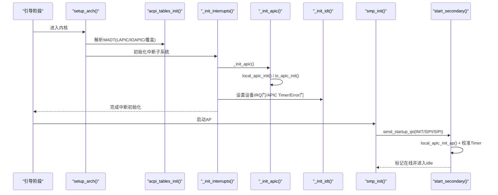
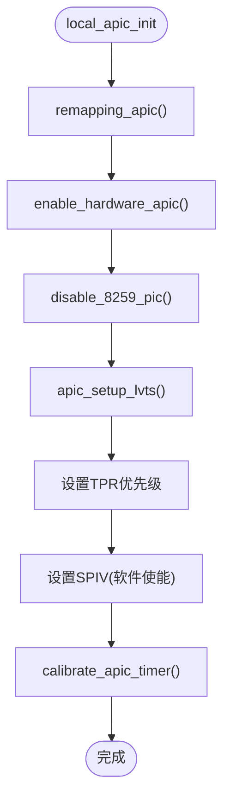
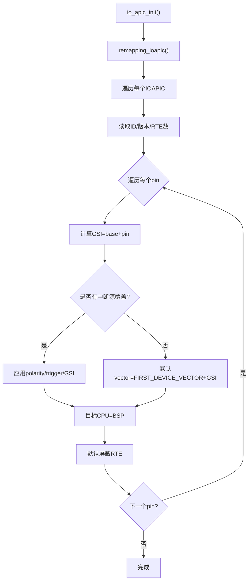
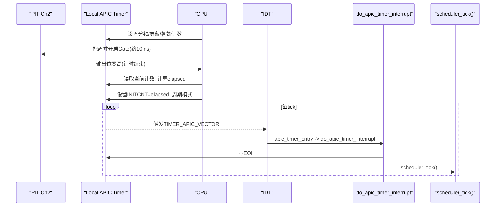
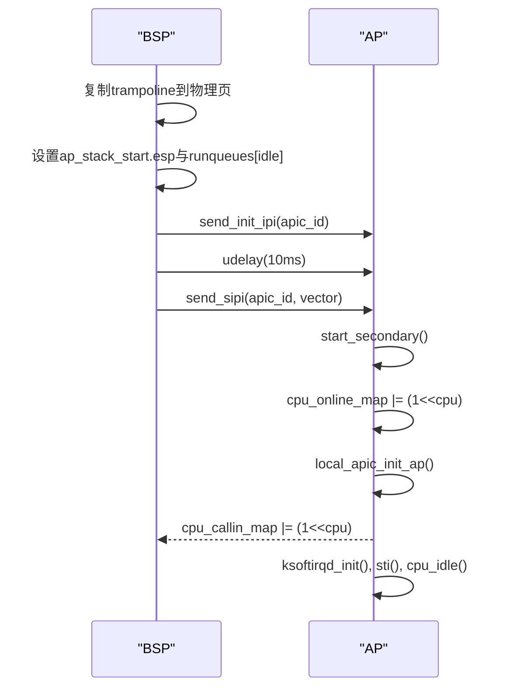
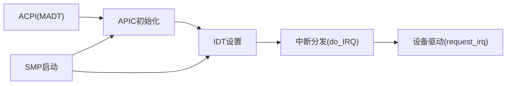

# APIC支持

<cite>
**本文引用的文件**
- [arch/x86/kernel/apic.c](file://arch/x86/kernel/apic.c)
- [includes/arch/x86/apic.h](file://includes/arch/x86/apic.h)
- [arch/x86/kernel/smp.c](file://arch/x86/kernel/smp.c)
- [arch/x86/kernel/idt.c](file://arch/x86/kernel/idt.c)
- [kernel/interrupts/interrupts.c](file://kernel/interrupts/interrupts.c)
- [includes/arch/x86/acpi.h](file://includes/arch/x86/acpi.h)
- [arch/x86/kernel/setup.c](file://arch/x86/kernel/setup.c)
</cite>

## 目录
1. [简介](#简介)
2. [项目结构](#项目结构)
3. [核心组件](#核心组件)
4. [架构总览](#架构总览)
5. [详细组件分析](#详细组件分析)
6. [依赖关系分析](#依赖关系分析)
7. [性能考量](#性能考量)
8. [故障诊断指南](#故障诊断指南)
9. [结论](#结论)
10. [附录](#附录)

## 简介
本文件为LulaOS的APIC（高级可编程中断控制器）支持提供全面文档，覆盖本地APIC与I/O APIC初始化、定时器中断实现、错误处理、负载均衡、寄存器访问接口与编程模型，以及多处理器环境下的协调机制。同时为系统管理员提供性能调优与故障诊断建议。

## 项目结构
与APIC相关的代码主要分布在以下位置：
- 本地APIC与I/O APIC初始化、定时器校准、IPI发送等核心逻辑位于 arch/x86/kernel/apic.c
- APIC/I/O APIC寄存器定义、RTE结构体、PIT常量等接口在 includes/arch/x86/apic.h
- SMP启动流程、AP在线握手、idle任务注册等在 arch/x86/kernel/smp.c
- IDT设置与APIC Timer/Error中断门在 arch/x86/kernel/idt.c
- 中断分发、request_irq/free_irq、APIC Timer/Error处理在 kernel/interrupts/interrupts.c
- ACPI MADT解析、IOAPIC/LAPIC信息在 includes/arch/x86/acpi.h 及对应解析逻辑
- 早期引导阶段内存与页表初始化在 arch/x86/kernel/setup.c

```mermaid
graph TB
subgraph "初始化阶段"
SETUP["setup_arch()"] --> ACPI["acpi_tables_init()"]
ACPI --> MADT["MADT解析<br/>LAPIC/IOAPIC/中断源覆盖"]
end
subgraph "中断子系统"
INTS["_init_interrupts()"] --> APIC_INIT["_init_apic()"]
APIC_INIT --> LAPIC["local_apic_init()"]
APIC_INIT --> IOAPIC["io_apic_init()"]
IDT["_init_idt()"] --> TIMER_GATE["TIMER_APIC_VECTOR 门"]
IDT --> ERR_GATE["ERROR_APIC_VECTOR 门"]
end
subgraph "SMP"
SMP["smp_init()"] --> TRAMP["复制trampoline到物理页"]
SMP --> IPI["send_startup_ipi()"]
SMP --> ONLINE["等待AP响应并标记在线"]
end
SETUP --> INTS
INTS --> IDT
```

图表来源
- [arch/x86/kernel/setup.c:201-213](file://arch/x86/kernel/setup.c#L201-L213)
- [kernel/interrupts/interrupts.c:18-27](file://kernel/interrupts/interrupts.c#L18-L27)
- [arch/x86/kernel/apic.c:512-529](file://arch/x86/kernel/apic.c#L512-L529)
- [arch/x86/kernel/idt.c:284-331](file://arch/x86/kernel/idt.c#L284-L331)
- [arch/x86/kernel/smp.c:74-215](file://arch/x86/kernel/smp.c#L74-L215)

章节来源
- [arch/x86/kernel/setup.c:201-213](file://arch/x86/kernel/setup.c#L201-L213)
- [kernel/interrupts/interrupts.c:18-27](file://kernel/interrupts/interrupts.c#L18-L27)
- [arch/x86/kernel/apic.c:512-529](file://arch/x86/kernel/apic.c#L512-L529)
- [arch/x86/kernel/idt.c:284-331](file://arch/x86/kernel/idt.c#L284-L331)
- [arch/x86/kernel/smp.c:74-215](file://arch/x86/kernel/smp.c#L74-L215)

## 核心组件
- 本地APIC初始化与配置：包括硬件使能、LVT设置、TPR优先级、SPIV软件使能、Timer校准。
- I/O APIC初始化与路由：基于ACPI MADT发现IOAPIC，映射其基址，遍历RTE并默认屏蔽，驱动通过request_irq解除屏蔽。
- APIC定时器：使用PIT Channel 2进行校准，设置为周期性模式，触发调度器tick。
- 错误处理：配置错误LVT向量，记录错误状态。
- IPI与SMP启动：INIT-SIPI-SIPI序列，AP独立初始化Local APIC并进入idle。
- 中断分发：统一入口do_IRQ，按向量查找已注册的handler执行。

章节来源
- [arch/x86/kernel/apic.c:37-100](file://arch/x86/kernel/apic.c#L37-L100)
- [arch/x86/kernel/apic.c:230-380](file://arch/x86/kernel/apic.c#L230-L380)
- [arch/x86/kernel/apic.c:125-180](file://arch/x86/kernel/apic.c#L125-L180)
- [kernel/interrupts/interrupts.c:84-145](file://kernel/interrupts/interrupts.c#L84-L145)
- [arch/x86/kernel/smp.c:233-276](file://arch/x86/kernel/smp.c#L233-L276)

## 架构总览
下图展示了从系统启动到中断处理的完整路径，包括ACPI发现、APIC初始化、IDT设置、SMP启动与定时器tick。



图表来源
- [arch/x86/kernel/setup.c:201-213](file://arch/x86/kernel/setup.c#L201-L213)
- [kernel/interrupts/interrupts.c:18-27](file://kernel/interrupts/interrupts.c#L18-L27)
- [arch/x86/kernel/apic.c:512-529](file://arch/x86/kernel/apic.c#L512-L529)
- [arch/x86/kernel/idt.c:284-331](file://arch/x86/kernel/idt.c#L284-L331)
- [arch/x86/kernel/smp.c:74-215](file://arch/x86/kernel/smp.c#L74-L215)
- [arch/x86/kernel/smp.c:233-276](file://arch/x86/kernel/smp.c#L233-L276)

## 详细组件分析

### 本地APIC初始化与配置
- 功能要点：
  - 重映射APIC基地址到固定映射区，启用硬件APIC。
  - 屏蔽8259 PIC，避免冲突。
  - 配置LINT0/LINT1与错误LVT，设置TPR接受优先级高于32的中断。
  - 软件使能APIC（SPIV），分配伪中断向量。
  - 使用PIT校准APIC Timer并设置为周期性模式。
- 关键流程：
  - remapping_apic → enable_hardware_apic → disable_8259_pic → apic_setup_lvts → TPR设置 → SPIV设置 → calibrate_apic_timer。
- AP专用初始化：
  - local_apic_init_ap跳过PIC禁用与IOAPIC初始化，仅做本地LAPIC配置与Timer校准。



图表来源
- [arch/x86/kernel/apic.c:37-63](file://arch/x86/kernel/apic.c#L37-L63)
- [arch/x86/kernel/apic.c:74-100](file://arch/x86/kernel/apic.c#L74-L100)
- [arch/x86/kernel/apic.c:102-113](file://arch/x86/kernel/apic.c#L102-L113)
- [arch/x86/kernel/apic.c:125-180](file://arch/x86/kernel/apic.c#L125-L180)

章节来源
- [arch/x86/kernel/apic.c:37-100](file://arch/x86/kernel/apic.c#L37-L100)
- [arch/x86/kernel/apic.c:102-113](file://arch/x86/kernel/apic.c#L102-L113)
- [arch/x86/kernel/apic.c:125-180](file://arch/x86/kernel/apic.c#L125-L180)

### I/O APIC初始化与路由表(RTE)配置
- 功能要点：
  - 根据ACPI MADT枚举IOAPIC，映射其MMIO基址。
  - 读取版本与RTE数量，遍历每个pin，计算GSI范围。
  - 应用中断源覆盖（bus_irq→global_irq、极性、触发模式）。
  - 默认将目标设为BSP，并屏蔽所有RTE；驱动通过request_irq解除屏蔽。
- 关键函数：
  - io_apic_init：发现并初始化IOAPIC。
  - ioapic_set_rte：写入RTE（先高后低顺序）。
  - ioapic_enable_irq/ioapic_disable_irq：动态使能/屏蔽指定GSI。



图表来源
- [arch/x86/kernel/apic.c:230-289](file://arch/x86/kernel/apic.c#L230-L289)
- [arch/x86/kernel/apic.c:301-380](file://arch/x86/kernel/apic.c#L301-L380)
- [includes/arch/x86/acpi.h:222-266](file://includes/arch/x86/acpi.h#L222-L266)

章节来源
- [arch/x86/kernel/apic.c:230-380](file://arch/x86/kernel/apic.c#L230-L380)
- [includes/arch/x86/acpi.h:222-266](file://includes/arch/x86/acpi.h#L222-L266)

### APIC定时器中断实现
- 校准原理：
  - 使用PIT Channel 2作为时间基准，设定约10ms窗口。
  - 在该窗口内让APIC Timer从最大值倒计时，统计消耗ticks。
  - 将ticks写入INITCNT并设置为周期性模式，产生定时中断。
- 中断处理：
  - IDT中设置TIMER_APIC_VECTOR门指向apic_timer_entry。
  - do_apic_timer_interrupt发送EOI，调用scheduler_tick更新调度器时间片。



图表来源
- [arch/x86/kernel/apic.c:125-180](file://arch/x86/kernel/apic.c#L125-L180)
- [arch/x86/kernel/idt.c:321-325](file://arch/x86/kernel/idt.c#L321-L325)
- [kernel/interrupts/interrupts.c:116-128](file://kernel/interrupts/interrupts.c#L116-L128)

章节来源
- [arch/x86/kernel/apic.c:125-180](file://arch/x86/kernel/apic.c#L125-L180)
- [arch/x86/kernel/idt.c:321-325](file://arch/x86/kernel/idt.c#L321-L325)
- [kernel/interrupts/interrupts.c:116-128](file://kernel/interrupts/interrupts.c#L116-L128)

### 错误处理与负载均衡
- 错误处理：
  - 配置APIC_ERR LVT为ERROR_APIC_VECTOR，发生错误时触发中断。
  - do_apic_error_interrupt读取APIC_ERR寄存器并打印错误码，随后发送EOI。
- 负载均衡：
  - 当前实现未启用最低优先级投递（APIC_DM_LOWEST），设备中断默认固定目标为BSP。
  - 可通过修改RTE的delivery_mode为LOWEST以启用负载均衡，但需确保目标CPU集合正确。

章节来源
- [arch/x86/kernel/apic.c:102-113](file://arch/x86/kernel/apic.c#L102-L113)
- [kernel/interrupts/interrupts.c:135-145](file://kernel/interrupts/interrupts.c#L135-L145)
- [includes/arch/x86/apic.h:64-71](file://includes/arch/x86/apic.h#L64-L71)

### 寄存器访问接口与编程模型
- Local APIC寄存器：
  - 通过apic_read/apic_write访问，基址由FIXMAP映射。
  - 常用寄存器：ID、VERSION、TPR、EOI、SPIV、ICRLO/ICRHI、TIMER_*、LINT0/LINT1、ERR。
- I/O APIC寄存器：
  - 通过ioapic_read/ioapic_write访问，使用SEL/WIN寄存器窗口。
  - RTE条目结构ioapic_rte_entry包含vector、delivery_mode、dest_mode、polarity、trigger、mask、dest等字段。
- 编程模型：
  - 初始化顺序：先本地APIC，再I/O APIC；IDT设置中断门；驱动注册中断时解除屏蔽。
  - 安全写入RTE：先写高32位（目标），再写低32位（向量/mask），避免竞态。

章节来源
- [includes/arch/x86/apic.h:97-167](file://includes/arch/x86/apic.h#L97-L167)
- [arch/x86/kernel/apic.c:371-380](file://arch/x86/kernel/apic.c#L371-L380)

### 多处理器协调机制（SMP）
- BSP启动AP流程：
  - 复制trampoline到物理页，修正GDTR base。
  - 建立APIC ID到逻辑CPU号映射，为每个AP分配独立idle任务栈。
  - 发送INIT-SIPI-SIPI序列，等待AP响应并标记在线。
- AP侧流程：
  - start_secondary尽早标记cpu_online_map，防止BSP重复SIPI导致复位。
  - 调用local_apic_init_ap初始化本地APIC与Timer，通知BSP完成，进入idle循环。



图表来源
- [arch/x86/kernel/smp.c:74-215](file://arch/x86/kernel/smp.c#L74-L215)
- [arch/x86/kernel/smp.c:233-276](file://arch/x86/kernel/smp.c#L233-L276)
- [arch/x86/kernel/apic.c:438-475](file://arch/x86/kernel/apic.c#L438-L475)

章节来源
- [arch/x86/kernel/smp.c:74-215](file://arch/x86/kernel/smp.c#L74-L215)
- [arch/x86/kernel/smp.c:233-276](file://arch/x86/kernel/smp.c#L233-L276)
- [arch/x86/kernel/apic.c:438-475](file://arch/x86/kernel/apic.c#L438-L475)

## 依赖关系分析
- APIC模块依赖：
  - ACPI表解析（MADT）提供LAPIC/IOAPIC信息与中断源覆盖。
  - IDT提供中断门映射，将硬件向量连接到C处理函数。
  - 中断子系统提供request_irq/free_irq与统一入口do_IRQ。
  - SMP模块负责多核启动与协调。
- 耦合点：
  - APIC初始化必须在IDT设置之前完成，以确保中断门有效。
  - request_irq会解除IOAPIC RTE屏蔽，需在驱动加载时调用。
  - SMP启动依赖APIC IPI能力，且需要正确的AP栈与idle任务注册。



图表来源
- [includes/arch/x86/acpi.h:222-266](file://includes/arch/x86/acpi.h#L222-L266)
- [arch/x86/kernel/apic.c:512-529](file://arch/x86/kernel/apic.c#L512-L529)
- [arch/x86/kernel/idt.c:284-331](file://arch/x86/kernel/idt.c#L284-L331)
- [kernel/interrupts/interrupts.c:18-59](file://kernel/interrupts/interrupts.c#L18-L59)
- [arch/x86/kernel/smp.c:74-215](file://arch/x86/kernel/smp.c#L74-L215)

章节来源
- [includes/arch/x86/acpi.h:222-266](file://includes/arch/x86/acpi.h#L222-L266)
- [arch/x86/kernel/apic.c:512-529](file://arch/x86/kernel/apic.c#L512-L529)
- [arch/x86/kernel/idt.c:284-331](file://arch/x86/kernel/idt.c#L284-L331)
- [kernel/interrupts/interrupts.c:18-59](file://kernel/interrupts/interrupts.c#L18-L59)
- [arch/x86/kernel/smp.c:74-215](file://arch/x86/kernel/smp.c#L74-L215)

## 性能考量
- 定时器频率：
  - 校准结果决定tick间隔，过高会导致频繁中断开销，过低影响调度精度。建议根据负载调整校准窗口或分频。
- 中断目标：
  - 当前默认目标为BSP，可能成为瓶颈。可考虑对高频设备启用最低优先级投递，分散到多个CPU。
- EOI时机：
  - 在do_IRQ与do_apic_timer_interrupt中尽早发送EOI，避免阻塞同级与低优先级中断。
- IPI延迟：
  - send_startup_ipi与send_ipi中包含轮询等待Delivery Status，确保可靠交付，但应避免在热路径频繁调用。

[本节为通用指导，不直接分析具体文件]

## 故障诊断指南
- APIC不支持或x2APIC检测失败：
  - 检查isSupportApic/isSupportX2Apic返回值，确认CPU特性位。
- Timer校准失败：
  - 若elapsed为0，说明Timer未工作，检查PIT配置与APIC Timer分频设置。
- 设备中断无响应：
  - 确认request_irq是否成功调用，ioapic_enable_irq是否解除屏蔽。
  - 检查ACPI中断源覆盖是否正确映射GSI与极性/触发模式。
- AP启动超时：
  - 检查send_startup_ipi序列是否成功，cpu_callout_map/cpu_callin_map握手是否正常。
  - 确认AP栈与idle任务已正确注册，wbinvd缓存一致性已保证。
- 错误中断频繁：
  - 查看do_apic_error_interrupt输出的APIC_ERR值，定位具体错误类型。

章节来源
- [arch/x86/kernel/apic.c:13-23](file://arch/x86/kernel/apic.c#L13-L23)
- [arch/x86/kernel/apic.c:169-172](file://arch/x86/kernel/apic.c#L169-L172)
- [kernel/interrupts/interrupts.c:40-77](file://kernel/interrupts/interrupts.c#L40-L77)
- [arch/x86/kernel/smp.c:188-211](file://arch/x86/kernel/smp.c#L188-L211)
- [kernel/interrupts/interrupts.c:135-145](file://kernel/interrupts/interrupts.c#L135-L145)

## 结论
LulaOS的APIC支持实现了完整的本地APIC与I/O APIC初始化、定时器校准与周期性中断、错误处理、IPI与SMP启动流程。通过ACPI MADT获取平台中断拓扑，结合IDT与中断分发机制，形成稳定的中断子系统。当前实现以BSP为目标，后续可引入负载均衡以提升多核性能。对于管理员，建议关注定时器校准结果、中断目标分布与错误日志，以优化系统稳定性与性能。

[本节为总结性内容，不直接分析具体文件]

## 附录
- 关键API参考：
  - _init_apic：APIC子系统入口。
  - local_apic_init/local_apic_init_ap：本地APIC初始化。
  - io_apic_init/ioapic_set_rte/ioapic_enable_irq/ioapic_disable_irq：I/O APIC管理。
  - calibrate_apic_timer：定时器校准。
  - send_ipi/send_startup_ipi：IPI发送。
  - request_irq/free_irq：设备中断注册与注销。
  - do_IRQ/do_apic_timer_interrupt/do_apic_error_interrupt：中断处理。

章节来源
- [arch/x86/kernel/apic.c:512-529](file://arch/x86/kernel/apic.c#L512-L529)
- [arch/x86/kernel/apic.c:37-100](file://arch/x86/kernel/apic.c#L37-L100)
- [arch/x86/kernel/apic.c:230-380](file://arch/x86/kernel/apic.c#L230-L380)
- [arch/x86/kernel/apic.c:125-180](file://arch/x86/kernel/apic.c#L125-L180)
- [arch/x86/kernel/apic.c:387-475](file://arch/x86/kernel/apic.c#L387-L475)
- [kernel/interrupts/interrupts.c:40-145](file://kernel/interrupts/interrupts.c#L40-L145)