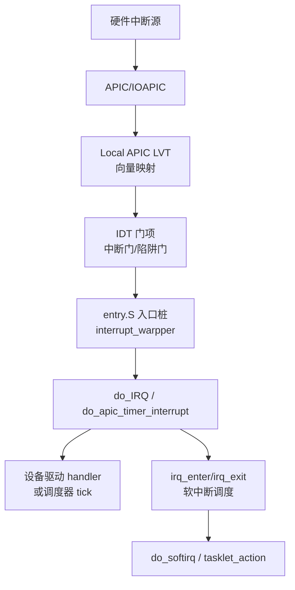
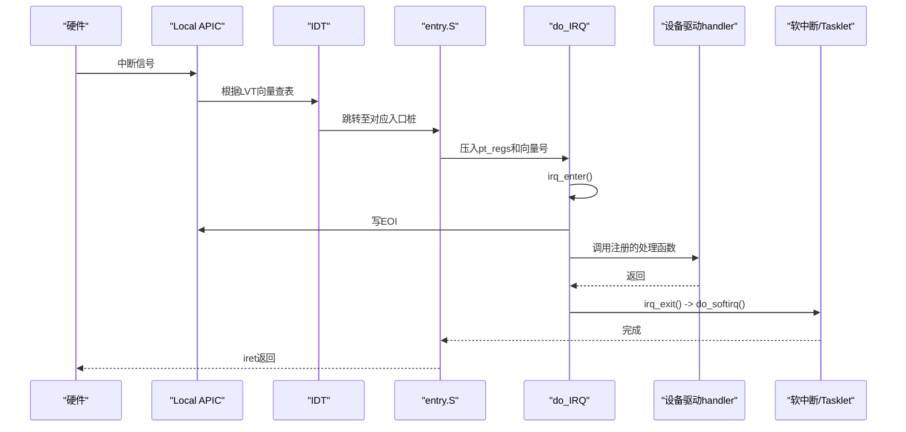
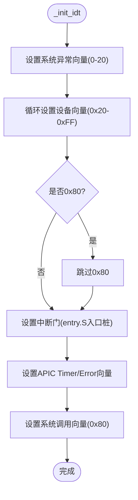
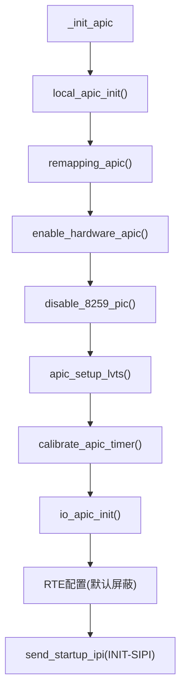
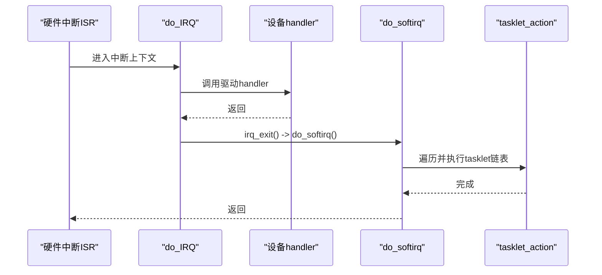
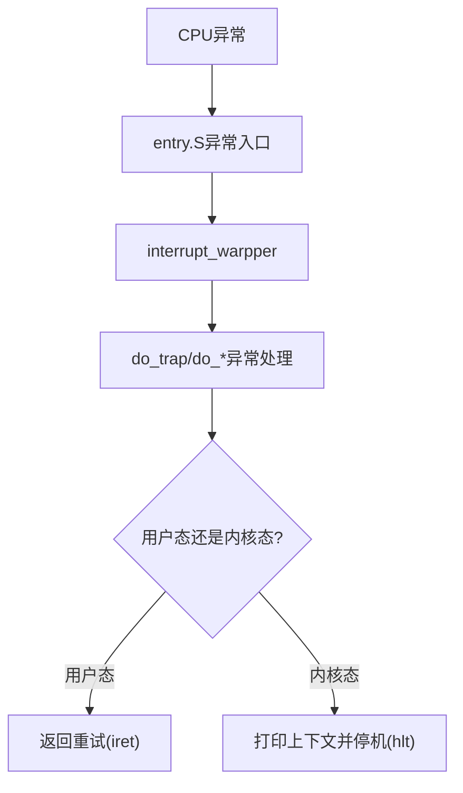
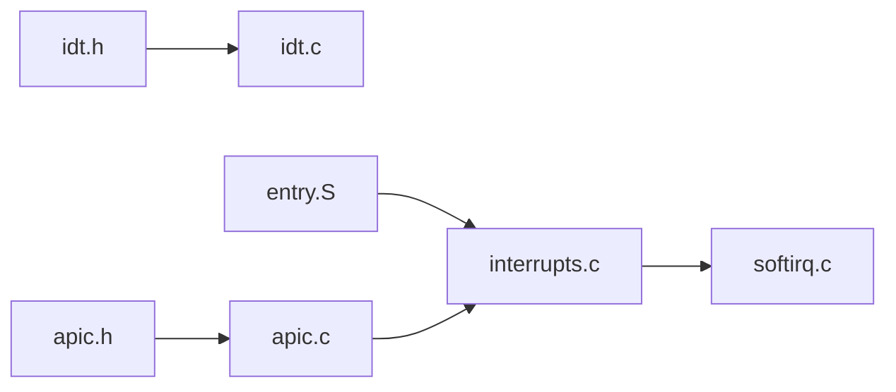

# 中断处理系统

<cite>
**本文引用的文件**
- [includes/arch/x86/idt.h](file://includes/arch/x86/idt.h)
- [arch/x86/kernel/idt.c](file://arch/x86/kernel/idt.c)
- [includes/arch/x86/apic.h](file://includes/arch/x86/apic.h)
- [arch/x86/kernel/apic.c](file://arch/x86/kernel/apic.c)
- [includes/interrupts/interrupts.h](file://includes/interrupts/interrupts.h)
- [kernel/interrupts/interrupts.c](file://kernel/interrupts/interrupts.c)
- [arch/x86/entry.S](file://arch/x86/entry.S)
- [includes/arch/x86/ptrace.h](file://includes/arch/x86/ptrace.h)
- [kernel/softirq.c](file://kernel/softirq.c)
</cite>

## 目录
1. [简介](#简介)
2. [项目结构](#项目结构)
3. [核心组件](#核心组件)
4. [架构总览](#架构总览)
5. [详细组件分析](#详细组件分析)
6. [依赖关系分析](#依赖关系分析)
7. [性能考虑](#性能考虑)
8. [故障排查指南](#故障排查指南)
9. [结论](#结论)
10. [附录](#附录)

## 简介
本文件为 LulaOS 中断处理系统的完整技术文档，覆盖以下主题：
- 中断描述符表（IDT）的管理机制：向量分配、门类型选择、服务程序注册与初始化流程。
- APIC（高级可编程中断控制器）配置与使用：本地 APIC、IOAPIC、LVT、定时器校准、IPI/SMP 启动。
- 硬件中断与软中断的处理差异：顶半部/底半部分离、软中断与 Tasklet 机制。
- 编程接口与最佳实践：设备驱动如何注册/释放中断、异常处理注意事项、时序与 EOI 要求。
- 关键时序图与异常处理流程图：从硬件触发到内核调度返回的完整路径。

## 项目结构
与中断子系统相关的代码主要分布在以下位置：
- 架构层 x86：
  - IDT 定义与初始化：includes/arch/x86/idt.h、arch/x86/kernel/idt.c
  - APIC 抽象与实现：includes/arch/x86/apic.h、arch/x86/kernel/apic.c
  - 汇编入口与通用包装：arch/x86/entry.S
  - 寄存器上下文结构：includes/arch/x86/ptrace.h
- 内核层：
  - 中断子系统接口与 IRQ 分发：includes/interrupts/interrupts.h、kernel/interrupts/interrupts.c
  - 软中断与 Tasklet：kernel/softirq.c

图表来源
- [arch/x86/kernel/apic.c:102-180](file://arch/x86/kernel/apic.c#L102-L180)
- [arch/x86/kernel/idt.c:284-331](file://arch/x86/kernel/idt.c#L284-L331)
- [arch/x86/entry.S:186-443](file://arch/x86/entry.S#L186-L443)
- [kernel/interrupts/interrupts.c:84-145](file://kernel/interrupts/interrupts.c#L84-L145)
- [kernel/softirq.c:89-149](file://kernel/softirq.c#L89-L149)

章节来源
- [arch/x86/kernel/idt.c:284-331](file://arch/x86/kernel/idt.c#L284-L331)
- [arch/x86/kernel/apic.c:512-529](file://arch/x86/kernel/apic.c#L512-L529)
- [arch/x86/entry.S:186-443](file://arch/x86/entry.S#L186-L443)
- [kernel/interrupts/interrupts.c:18-27](file://kernel/interrupts/interrupts.c#L18-L27)

## 核心组件
- IDT 管理：提供设置不同门类型的函数（中断门/陷阱门/系统门），并初始化系统异常向量与外部设备向量。
- APIC 子系统：启用本地 APIC、配置 LVT、校准定时器、映射 IOAPIC RTE、发送 IPI、SMP 启动流程。
- 中断分发：统一的 do_IRQ 将向量路由到已注册的驱动 handler；APIC Timer/Error 专用处理。
- 软中断与 Tasklet：在 irq_exit 时执行 pending 软中断，支持高/普通优先级任务延迟执行。
- 异常处理：对 CPU 异常进行统一打印与停机保护，区分用户态/内核态行为。

章节来源
- [includes/arch/x86/idt.h:7-26](file://includes/arch/x86/idt.h#L7-L26)
- [arch/x86/kernel/idt.c:256-331](file://arch/x86/kernel/idt.c#L256-L331)
- [includes/arch/x86/apic.h:97-187](file://includes/arch/x86/apic.h#L97-L187)
- [arch/x86/kernel/apic.c:37-180](file://arch/x86/kernel/apic.c#L37-L180)
- [kernel/interrupts/interrupts.c:84-145](file://kernel/interrupts/interrupts.c#L84-L145)
- [kernel/softirq.c:54-149](file://kernel/softirq.c#L54-L149)

## 架构总览
下图展示了从硬件中断到内核处理的完整调用链，包括异常路径与软中断路径。

图表来源
- [arch/x86/entry.S:186-443](file://arch/x86/entry.S#L186-L443)
- [kernel/interrupts/interrupts.c:84-145](file://kernel/interrupts/interrupts.c#L84-L145)
- [kernel/softirq.c:89-149](file://kernel/softirq.c#L89-L149)

## 详细组件分析

### IDT 管理与向量分配
- 门类型与属性：
  - 中断门：自动关中断，适合需要屏蔽嵌套的中断处理。
  - 陷阱门：不自动关中断，适合异常与系统调用。
  - 系统门：DPL=3，允许用户态通过 int 0x80 进入内核。
- 初始化流程：
  - 设置 0~20 的系统异常向量（除保留位）。
  - 循环设置 0x20~0xFF 的外部设备向量，跳过 0x80（系统调用）。
  - 设置 APIC Timer 与 Error 向量。
  - 设置系统调用向量。
- 向量分配策略：
  - FIRST_EXTERNAL_VECTOR = 0x20，FIRST_DEVICE_VECTOR = 0x31，NR_IRQS = 224。
  - 设备驱动通过 request_irq(vector, ...) 注册 handler，并在成功后解除 IOAPIC RTE 屏蔽。

图表来源
- [arch/x86/kernel/idt.c:284-331](file://arch/x86/kernel/idt.c#L284-L331)
- [includes/interrupts/interrupts.h:35-42](file://includes/interrupts/interrupts.h#L35-L42)

章节来源
- [includes/arch/x86/idt.h:7-26](file://includes/arch/x86/idt.h#L7-L26)
- [arch/x86/kernel/idt.c:256-331](file://arch/x86/kernel/idt.c#L256-L331)
- [includes/interrupts/interrupts.h:35-42](file://includes/interrupts/interrupts.h#L35-L42)

### APIC 配置与使用
- 本地 APIC：
  - 重映射物理基址到固定虚拟地址。
  - 使能硬件 APIC，关闭 8259 PIC。
  - 配置 LINT0/LINT1/ERR LVT，设置 TPR 接受优先级阈值。
  - 软件使能 SPIV，设置 SPURIOUS 向量。
- 定时器校准：
  - 使用 PIT Channel 2 作为参考，测量 10ms 内 APIC Timer 的 tick 数。
  - 设置为周期性模式，产生 TIMER_APIC_VECTOR 中断以驱动调度器 tick。
- IOAPIC：
  - 根据 ACPI 信息映射每个 IOAPIC 的 RTE，默认屏蔽所有 GSI。
  - 驱动通过 ioapic_enable_irq(vector) 解除屏蔽，使能具体设备中断。
- IPI 与 SMP：
  - send_ipi/send_init_ipi/send_sipi 实现 INIT-SIPI 序列。
  - 标准启动流程：BSP 向 AP 发送 INIT，等待后发送两次 SIPI，检查响应标志避免重复复位。

图表来源
- [arch/x86/kernel/apic.c:37-180](file://arch/x86/kernel/apic.c#L37-L180)
- [arch/x86/kernel/apic.c:230-289](file://arch/x86/kernel/apic.c#L230-L289)
- [arch/x86/kernel/apic.c:449-475](file://arch/x86/kernel/apic.c#L449-L475)

章节来源
- [includes/arch/x86/apic.h:97-187](file://includes/arch/x86/apic.h#L97-L187)
- [arch/x86/kernel/apic.c:37-180](file://arch/x86/kernel/apic.c#L37-L180)
- [arch/x86/kernel/apic.c:230-289](file://arch/x86/kernel/apic.c#L230-L289)
- [arch/x86/kernel/apic.c:449-475](file://arch/x86/kernel/apic.c#L449-L475)

### 硬件中断与软中断处理差异
- 硬件中断（顶半部）：
  - entry.S 生成每个向量的入口桩，压入 pt_regs 与向量号，调用 interrupt_warpper。
  - do_IRQ 负责 EOI、调用设备 handler、irq_exit 触发软中断。
  - 特点：快速、最小化工作，避免阻塞。
- 软中断（底半部）：
  - irq_exit 中若存在 pending 则调用 do_softirq，开中断执行各 action。
  - Tasklet 通过 HI_SOFTIRQ/TASKLET_SOFTIRQ 队列延迟执行，支持优先级。
  - ksoftirqd 进程线程用于处理风暴场景，避免长时间占用中断上下文。

图表来源
- [arch/x86/entry.S:186-443](file://arch/x86/entry.S#L186-L443)
- [kernel/interrupts/interrupts.c:84-145](file://kernel/interrupts/interrupts.c#L84-L145)
- [kernel/softirq.c:89-149](file://kernel/softirq.c#L89-L149)
- [kernel/softirq.c:371-385](file://kernel/softirq.c#L371-L385)

章节来源
- [arch/x86/entry.S:186-443](file://arch/x86/entry.S#L186-L443)
- [kernel/interrupts/interrupts.c:84-145](file://kernel/interrupts/interrupts.c#L84-L145)
- [kernel/softirq.c:89-149](file://kernel/softirq.c#L89-L149)

### 异常处理流程
- 统一入口：entry.S 为每个异常向量生成入口，压入错误码与处理器函数指针，跳转到 interrupt_warpper。
- 默认处理：id t.c 中的 do_trap 打印寄存器、EIP 附近指令字节，内核态异常直接停机防止无限循环。
- 特殊处理：如 invalid_TSS 输出更详细的错误码含义，便于定位段描述符问题。

图表来源
- [arch/x86/entry.S:93-184](file://arch/x86/entry.S#L93-L184)
- [arch/x86/kernel/idt.c:173-231](file://arch/x86/kernel/idt.c#L173-L231)

章节来源
- [arch/x86/entry.S:93-184](file://arch/x86/entry.S#L93-L184)
- [arch/x86/kernel/idt.c:173-231](file://arch/x86/kernel/idt.c#L173-L231)

### 编程接口与最佳实践
- 设备驱动注册中断：
  - 使用 request_irq(vector, handler, name, dev_id)，成功后自动解除 IOAPIC RTE 屏蔽。
  - 释放时使用 free_irq(vector)，先屏蔽再清除 handler，避免悬空中断。
- 中断处理原则：
  - 顶半部尽量短小，复杂逻辑放入软中断/Tasklet。
  - 必须在尽可能早的位置写 EOI，避免阻塞同级及低优先级中断。
  - 避免在中断上下文中睡眠或长时间阻塞操作。
- 定时器与调度：
  - APIC Timer 周期性中断驱动 scheduler_tick()，确保时间片递减与调度点。
- 系统调用：
  - 通过 int 0x80 进入，entry.S 保存寄存器并调用 do_syscall，返回值写入 eax 槽位后 iret。

章节来源
- [kernel/interrupts/interrupts.c:40-77](file://kernel/interrupts/interrupts.c#L40-L77)
- [kernel/interrupts/interrupts.c:116-145](file://kernel/interrupts/interrupts.c#L116-L145)
- [arch/x86/entry.S:445-486](file://arch/x86/entry.S#L445-L486)

## 依赖关系分析
- IDT 依赖：
  - 头文件 includes/arch/x86/idt.h 定义门类型与偏移宏。
  - arch/x86/kernel/idt.c 实现 _set_*_gate_entry 与 _init_idt。
- APIC 依赖：
  - includes/arch/x86/apic.h 提供寄存器访问与常量。
  - arch/x86/kernel/apic.c 实现初始化、校准、IPI、SMP 启动。
- 中断分发依赖：
  - kernel/interrupts/interrupts.c 维护 irq_desc 数组，提供 request_irq/free_irq/do_IRQ。
  - 依赖 apic.h 进行 EOI 与 IOAPIC 控制。
- 软中断依赖：
  - kernel/softirq.c 提供 open_softirq/raise_softirq/do_softirq/tasklet_*。
  - 在 irq_exit 中被调用，形成顶半部/底半部分离。

图表来源
- [includes/arch/x86/idt.h:7-26](file://includes/arch/x86/idt.h#L7-L26)
- [arch/x86/kernel/idt.c:256-331](file://arch/x86/kernel/idt.c#L256-L331)
- [includes/arch/x86/apic.h:97-187](file://includes/arch/x86/apic.h#L97-L187)
- [arch/x86/kernel/apic.c:37-180](file://arch/x86/kernel/apic.c#L37-L180)
- [arch/x86/entry.S:186-443](file://arch/x86/entry.S#L186-L443)
- [kernel/interrupts/interrupts.c:84-145](file://kernel/interrupts/interrupts.c#L84-L145)
- [kernel/softirq.c:89-149](file://kernel/softirq.c#L89-L149)

章节来源
- [includes/arch/x86/idt.h:7-26](file://includes/arch/x86/idt.h#L7-L26)
- [arch/x86/kernel/idt.c:256-331](file://arch/x86/kernel/idt.c#L256-L331)
- [includes/arch/x86/apic.h:97-187](file://includes/arch/x86/apic.h#L97-L187)
- [arch/x86/kernel/apic.c:37-180](file://arch/x86/kernel/apic.c#L37-L180)
- [arch/x86/entry.S:186-443](file://arch/x86/entry.S#L186-L443)
- [kernel/interrupts/interrupts.c:84-145](file://kernel/interrupts/interrupts.c#L84-L145)
- [kernel/softirq.c:89-149](file://kernel/softirq.c#L89-L149)

## 性能考虑
- 中断延迟：
  - 尽早写 EOI，减少同级中断阻塞。
  - 使用中断门屏蔽嵌套，避免深度递归。
- 软中断负载：
  - 将耗时操作移至软中断/Tasklet，避免顶半部过长。
  - 利用 HI_SOFTIRQ 提高关键任务优先级。
- 定时器精度：
  - APIC Timer 校准基于 PIT，确保 tick 频率稳定，支撑调度器准确性。
- SMP 启动：
  - INIT-SIPI 序列需严格时序，避免重复 SIPI 导致 Triple Fault。

[本节为通用指导，不直接分析具体文件]

## 故障排查指南
- 常见异常：
  - 未注册 handler：do_IRQ 会打印“unexpected vector”或“no handler registered”，检查 request_irq 是否正确调用。
  - EOI 缺失：可能导致同级中断被阻塞，确认在 handler 前写 EOI。
  - APIC Timer 校准失败：打印“0 ticks”，检查 PIT 配置与计时窗口。
- 调试技巧：
  - 使用 do_trap 打印 EIP 附近指令字节，定位故障指令。
  - 查看 APIC ERR 寄存器内容，诊断 LVT 错误。
  - 检查 IOAPIC RTE 屏蔽位，确认设备中断是否被意外屏蔽。

章节来源
- [kernel/interrupts/interrupts.c:94-105](file://kernel/interrupts/interrupts.c#L94-L105)
- [kernel/interrupts/interrupts.c:135-145](file://kernel/interrupts/interrupts.c#L135-L145)
- [arch/x86/kernel/apic.c:169-172](file://arch/x86/kernel/apic.c#L169-L172)
- [arch/x86/kernel/idt.c:173-231](file://arch/x86/kernel/idt.c#L173-L231)

## 结论
LulaOS 的中断处理系统采用分层设计：
- IDT 统一管理向量与门类型，确保异常与设备中断的正确路由。
- APIC 提供灵活的硬件中断配置与定时器支持，配合 IOAPIC 实现多设备中断管理。
- 顶半部/底半部分离通过软中断与 Tasklet 提升系统响应性与可扩展性。
- 严格的 EOI 与时序要求保障中断处理的正确性与稳定性。

[本节为总结性内容，不直接分析具体文件]

## 附录
- 关键常量与向量：
  - FIRST_EXTERNAL_VECTOR = 0x20，SYSCALL_VECTOR = 0x80，TIMER_APIC_VECTOR = 0xEF，ERROR_APIC_VECTOR = 0xFE。
- 数据结构：
  - pt_regs：保存中断时的寄存器上下文，供异常与中断处理使用。
  - irq_action：记录设备 handler、设备 ID 与名称。
  - ioapic_rte_entry：IOAPIC RTE 条目，包含向量、交付模式、目标等字段。

章节来源
- [includes/interrupts/interrupts.h:35-42](file://includes/interrupts/interrupts.h#L35-L42)
- [includes/arch/x86/ptrace.h:5-23](file://includes/arch/x86/ptrace.h#L5-L23)
- [kernel/interrupts/interrupts.c:9-16](file://kernel/interrupts/interrupts.c#L9-L16)
- [includes/arch/x86/apic.h:129-154](file://includes/arch/x86/apic.h#L129-L154)