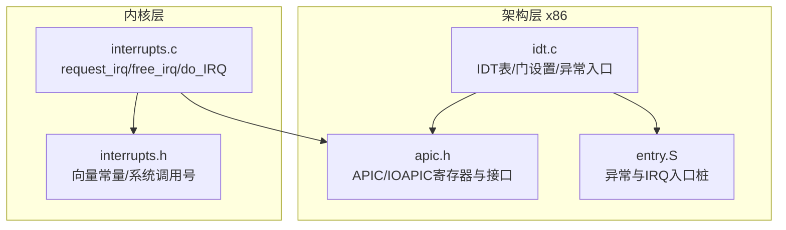
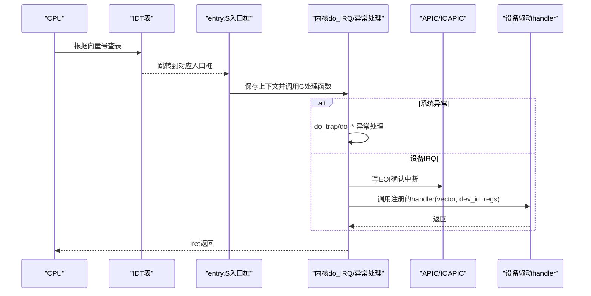
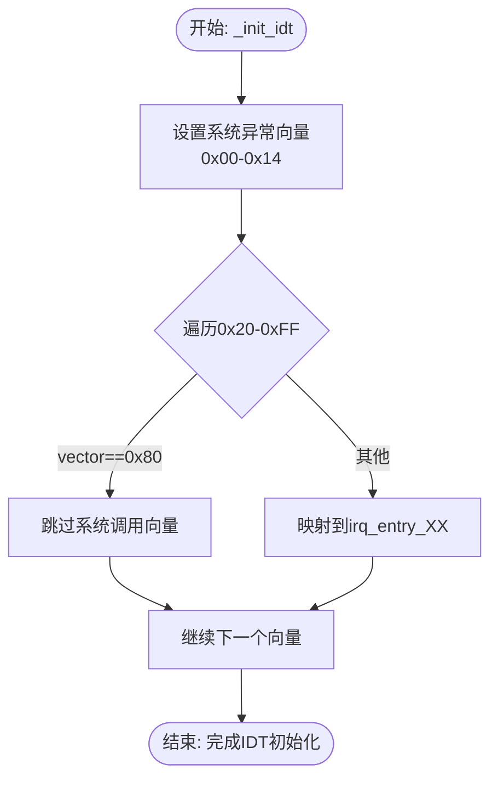
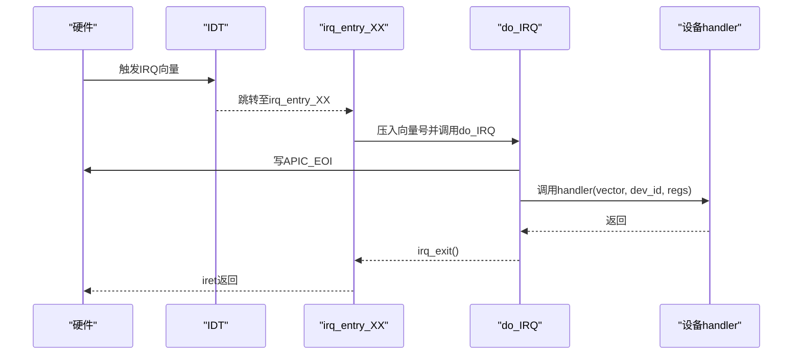
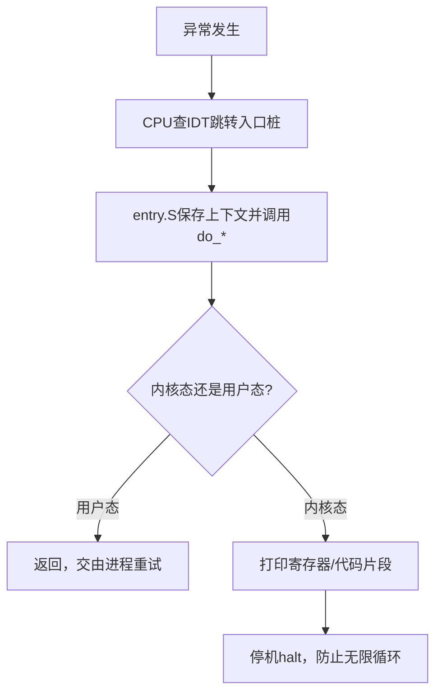
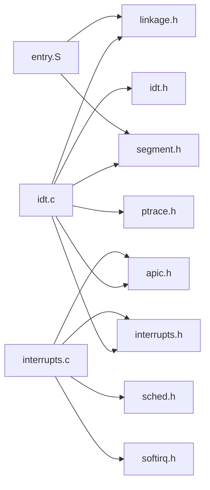

# 中断描述符表管理

<cite>
**本文引用的文件**
- [arch/x86/kernel/idt.c](file://arch/x86/kernel/idt.c)
- [includes/arch/x86/idt.h](file://includes/arch/x86/idt.h)
- [kernel/interrupts/interrupts.c](file://kernel/interrupts/interrupts.c)
- [includes/interrupts/interrupts.h](file://includes/interrupts/interrupts.h)
- [arch/x86/entry.S](file://arch/x86/entry.S)
- [includes/arch/x86/apic.h](file://includes/arch/x86/apic.h)
</cite>

## 目录
1. [简介](#简介)
2. [项目结构](#项目结构)
3. [核心组件](#核心组件)
4. [架构总览](#架构总览)
5. [详细组件分析](#详细组件分析)
6. [依赖关系分析](#依赖关系分析)
7. [性能考虑](#性能考虑)
8. [故障排查指南](#故障排查指南)
9. [结论](#结论)
10. [附录：API与使用指南](#附录api与使用指南)

## 简介
本文件为LulaOS的x86中断描述符表（IDT）管理提供完整、深入的技术文档。内容涵盖：
- IDT数据结构定义与初始化流程
- 门描述符类型（中断门、陷阱门、系统门）的区别与使用场景
- 中断向量分配策略（系统异常向量与设备IRQ向量）
- IDT操作API说明（_set_idt_entry、_set_interrupt_gate_entry等）
- 完整的IDT初始化流程与错误处理机制
- 自定义中断服务程序（ISR）开发指导

## 项目结构
与IDT相关的代码主要分布在以下位置：
- 架构层（x86）：IDT数据表、门设置函数、系统异常入口桩与默认处理器
- 内核层：设备中断注册/注销、通用硬件中断入口do_IRQ、APIC定时器与错误中断处理
- 头文件：IDT常量与宏、中断向量定义、APIC寄存器与IOAPIC接口

图表来源
- [arch/x86/kernel/idt.c:256-331](file://arch/x86/kernel/idt.c#L256-L331)
- [arch/x86/entry.S:93-184](file://arch/x86/entry.S#L93-L184)
- [kernel/interrupts/interrupts.c:18-108](file://kernel/interrupts/interrupts.c#L18-L108)
- [includes/interrupts/interrupts.h:35-42](file://includes/interrupts/interrupts.h#L35-L42)

章节来源
- [arch/x86/kernel/idt.c:1-331](file://arch/x86/kernel/idt.c#L1-L331)
- [includes/arch/x86/idt.h:1-41](file://includes/arch/x86/idt.h#L1-L41)
- [kernel/interrupts/interrupts.c:1-145](file://kernel/interrupts/interrupts.c#L1-L145)
- [includes/interrupts/interrupts.h:1-78](file://includes/interrupts/interrupts.h#L1-L78)
- [arch/x86/entry.S:1-200](file://arch/x86/entry.S#L1-L200)
- [includes/arch/x86/apic.h:1-197](file://includes/arch/x86/apic.h#L1-L197)

## 核心组件
- IDT表与门描述符：由全局数组_idt[]承载，条目类型为64位门描述符；通过宏组合段选择子、偏移、类型属性与DPL等字段。
- 门设置API：_set_idt_entry为底层写入函数；上层封装_set_interrupt_gate_entry/_set_trap_gate_entry/_set_system_gate_entry/_set_task_gate_entry。
- 系统异常处理：在_init_idt中为0x00~0x14等系统异常设置陷阱门或中断门，并绑定到对应的C语言处理函数（如divide_error、page_fault等）。
- 设备IRQ路由：0x20~0xFF区间用于外部中断，其中0x80保留给系统调用；其余向量映射到entry.S生成的irq_entry_XX桩，统一进入do_IRQ进行分发。
- APIC相关：TIMER_APIC_VECTOR(0xEF)与ERROR_APIC_VECTOR(0xFE)分别用于定时器和错误中断，已在_init_idt中配置。

章节来源
- [includes/arch/x86/idt.h:7-26](file://includes/arch/x86/idt.h#L7-L26)
- [arch/x86/kernel/idt.c:256-331](file://arch/x86/kernel/idt.c#L256-L331)
- [includes/interrupts/interrupts.h:35-42](file://includes/interrupts/interrupts.h#L35-L42)

## 架构总览
下图展示了从CPU触发中断到内核处理的完整路径，包括IDT查找、入口桩、通用处理与设备驱动回调。

图表来源
- [arch/x86/entry.S:93-184](file://arch/x86/entry.S#L93-L184)
- [kernel/interrupts/interrupts.c:84-108](file://kernel/interrupts/interrupts.c#L84-L108)
- [includes/arch/x86/apic.h:97-110](file://includes/arch/x86/apic.h#L97-L110)

## 详细组件分析

### IDT数据结构与门描述符
- 数据结构：全局uint64_t _idt[]，每个元素为一个门描述符。
- 字段构造：通过宏IDT_OFFSET_H/L、IDT_SEGMENT_SELECTOR、IDT_GATE_TYPE、IDT_DPL、IDT_PRESENT等组合成完整描述符。
- 门类型：
  - 中断门（Interrupt Gate）：自动屏蔽可屏蔽中断，适合需要原子性的ISR。
  - 陷阱门（Trap Gate）：不改变IF标志，允许嵌套中断，适合调试/跟踪类异常。
  - 系统门（System Gate）：DPL=3，用户态可通过INT n或syscall-like方式进入，常用于系统调用。
  - 任务门（Task Gate）：指向TSS，现代x86较少使用。

章节来源
- [includes/arch/x86/idt.h:7-26](file://includes/arch/x86/idt.h#L7-L26)
- [arch/x86/kernel/idt.c:256-282](file://arch/x86/kernel/idt.c#L256-L282)

### 初始化过程与条目设置机制
- _init_idt负责：
  - 为0x00~0x14系统异常设置陷阱门/中断门/系统门，并绑定到具体处理函数。
  - 覆盖0x20~0xFF设备IRQ向量空间，跳过0x80（系统调用），将各向量映射到entry.S生成的irq_entry_XX。
  - 配置APIC Timer与Error中断向量。
- 底层写入：_set_idt_entry将selector、func地址与type_attr组装为64位描述符写入_idt[index]。
- 上层封装：_set_interrupt_gate_entry/_set_trap_gate_entry/_set_system_gate_entry/_set_task_gate_entry简化不同门类型的设置。

图表来源
- [arch/x86/kernel/idt.c:284-331](file://arch/x86/kernel/idt.c#L284-L331)

章节来源
- [arch/x86/kernel/idt.c:284-331](file://arch/x86/kernel/idt.c#L284-L331)

### 中断向量分配策略
- 系统异常向量：0x00~0x14，按Intel规范固定，分别对应除零、调试、NMI、断点、溢出、边界检查、无效操作、设备不可用、双重故障、协处理器越界、无效TSS、段不存在、栈段错误、一般保护、页错误、协处理器错误、对齐检查、机器检查、SIMD错误、虚拟化异常等。
- 设备IRQ向量：0x20~0xFF，共224个（NR_IRQS=224），其中0x80保留给系统调用；其余映射到entry.S中的irq_entry_XX桩，统一进入do_IRQ。
- 特殊向量：
  - TIMER_APIC_VECTOR=0xEF：APIC定时器中断，用于调度tick。
  - ERROR_APIC_VECTOR=0xFE：APIC错误中断，记录并上报错误状态。
  - SYSCALL_VECTOR=0x80：系统调用入口，设置为系统门（DPL=3）。

章节来源
- [includes/interrupts/interrupts.h:35-42](file://includes/interrupts/interrupts.h#L35-L42)
- [arch/x86/kernel/idt.c:68-99](file://arch/x86/kernel/idt.c#L68-L99)
- [arch/x86/kernel/idt.c:284-331](file://arch/x86/kernel/idt.c#L284-L331)

### 门描述符类型与使用场景
- 中断门（Interrupt Gate）：自动清零IF，防止ISR中被嵌套中断打断，适用于大多数设备ISR。
- 陷阱门（Trap Gate）：保持IF不变，允许嵌套中断，适用于调试、跟踪、某些需要快速响应的异常。
- 系统门（System Gate）：DPL=3，允许用户态触发，典型用途是系统调用入口。
- 任务门（Task Gate）：指向TSS，现代操作系统极少使用。

章节来源
- [includes/arch/x86/idt.h:17-26](file://includes/arch/x86/idt.h#L17-L26)
- [arch/x86/kernel/idt.c:284-331](file://arch/x86/kernel/idt.c#L284-L331)

### 设备IRQ管理与分发
- request_irq：注册设备中断处理函数，参数包含向量号、处理函数指针、设备名、设备私有数据；成功后解除IOAPIC RTE屏蔽使能硬件中断。
- free_irq：注销中断处理函数，先屏蔽硬件中断再清除handler，避免悬空中断触发。
- do_IRQ：硬件中断总入口，接收向量号，发送EOI，校验范围，调用已注册的handler；若无注册则打印日志。
- APIC Timer与Error：各自有专用处理函数do_apic_timer_interrupt与do_apic_error_interrupt，负责调度tick与错误上报。

图表来源
- [kernel/interrupts/interrupts.c:40-108](file://kernel/interrupts/interrupts.c#L40-L108)
- [arch/x86/entry.S:186-200](file://arch/x86/entry.S#L186-L200)

章节来源
- [kernel/interrupts/interrupts.c:18-145](file://kernel/interrupts/interrupts.c#L18-L145)
- [includes/arch/x86/apic.h:97-110](file://includes/arch/x86/apic.h#L97-L110)

### 系统异常处理流程
- 入口桩：entry.S为每个系统异常生成入口，压入错误码（部分异常无错误码时压0）并跳转到对应的do_*函数。
- 默认处理器：idt.c中do_trap统一打印寄存器、EIP附近指令字节等信息；内核态异常会停机防止无限循环，用户态异常直接返回让iret重试。
- 特殊处理：invalid_TSS等异常有专门的处理逻辑，输出更详细的错误信息。

图表来源
- [arch/x86/entry.S:93-184](file://arch/x86/entry.S#L93-L184)
- [arch/x86/kernel/idt.c:173-231](file://arch/x86/kernel/idt.c#L173-L231)

章节来源
- [arch/x86/entry.S:93-184](file://arch/x86/entry.S#L93-L184)
- [arch/x86/kernel/idt.c:173-254](file://arch/x86/kernel/idt.c#L173-L254)

## 依赖关系分析
- idt.c依赖：
  - arch/x86/idt.h：IDT宏与API声明
  - arch/linkage.h：符号链接
  - arch/x86/ptrace.h：pt_regs结构
  - tty/tty.h：终端输出
  - arch/x86/segment.h：段选择子常量
  - printk.h：内核打印
  - arch/x86/apic.h：APIC常量与接口
  - interrupts/interrupts.h：中断向量常量
- entry.S依赖：
  - arch/linkage.h、arch/x86/segment.h：符号与段常量
- interrupts.c依赖：
  - interrupts.h：向量常量、系统调用号
  - apic.h：APIC/IOAPIC接口
  - ptrace.h：pt_regs
  - sched.h、softirq.h：调度与软中断
  - printk.h：日志

图表来源
- [arch/x86/kernel/idt.c:1-9](file://arch/x86/kernel/idt.c#L1-L9)
- [kernel/interrupts/interrupts.c:1-7](file://kernel/interrupts/interrupts.c#L1-L7)
- [arch/x86/entry.S:1-3](file://arch/x86/entry.S#L1-L3)

章节来源
- [arch/x86/kernel/idt.c:1-9](file://arch/x86/kernel/idt.c#L1-L9)
- [kernel/interrupts/interrupts.c:1-7](file://kernel/interrupts/interrupts.c#L1-L7)
- [arch/x86/entry.S:1-3](file://arch/x86/entry.S#L1-L3)

## 性能考虑
- 中断门与陷阱门的选择影响中断嵌套能力与响应延迟。对高吞吐设备建议使用中断门以避免嵌套开销；对调试或需快速响应的场景可使用陷阱门。
- do_IRQ中尽早写APIC_EOI，确保同级及低优先级中断不被阻塞。
- request_irq/free_irq顺序：释放时先屏蔽硬件再清handler，避免竞态导致的中断风暴。
- IDT初始化阶段批量设置门描述符，减少重复计算与内存访问。

[本节为通用性能建议，不直接分析具体文件]

## 故障排查指南
- 未注册handler的设备IRQ：do_IRQ会打印“no handler registered”，需检查request_irq是否成功以及向量是否正确。
- 非法向量：do_IRQ对超出FIRST_EXTERNAL_VECTOR~NR_IRQS范围的向量会打印unexpected vector并退出。
- 系统异常：do_trap会打印寄存器与EIP附近指令字节，便于定位崩溃点；内核态异常会停机，需结合调试器分析。
- APIC错误：do_apic_error_interrupt读取LVT ERR寄存器并打印，有助于诊断APIC配置问题。

章节来源
- [kernel/interrupts/interrupts.c:94-108](file://kernel/interrupts/interrupts.c#L94-L108)
- [arch/x86/kernel/idt.c:173-231](file://arch/x86/kernel/idt.c#L173-L231)
- [kernel/interrupts/interrupts.c:135-144](file://kernel/interrupts/interrupts.c#L135-L144)

## 结论
LulaOS的IDT管理采用清晰的层次化设计：架构层负责IDT表与门描述符的设置，内核层负责设备中断的注册与分发，entry.S提供统一的入口桩。通过合理的向量分配策略与完善的错误处理机制，系统能够稳定地处理系统异常与设备中断。开发者可基于提供的API轻松扩展新的设备驱动与系统异常处理。

[本节为总结性内容，不直接分析具体文件]

## 附录：API与使用指南

### IDT操作API
- _set_idt_entry(index, selector, func, type_attr)
  - 作用：将指定索引的门描述符写入_idt表，包含段选择子、函数偏移与类型属性。
  - 参数：index为向量号；selector通常为__KERNEL_CS；func为ISR入口；type_attr为门类型宏组合。
  - 参考路径：[arch/x86/kernel/idt.c:256-263](file://arch/x86/kernel/idt.c#L256-L263)
- _set_interrupt_gate_entry(index, func)
  - 作用：设置中断门（自动屏蔽中断），适用于大多数设备ISR。
  - 参考路径：[arch/x86/kernel/idt.c:270-273](file://arch/x86/kernel/idt.c#L270-L273)
- _set_trap_gate_entry(index, func)
  - 作用：设置陷阱门（允许嵌套中断），适用于调试或需快速响应的异常。
  - 参考路径：[arch/x86/kernel/idt.c:275-278](file://arch/x86/kernel/idt.c#L275-L278)
- _set_system_gate_entry(index, func)
  - 作用：设置系统门（DPL=3），用于系统调用入口。
  - 参考路径：[arch/x86/kernel/idt.c:279-282](file://arch/x86/kernel/idt.c#L279-L282)
- _set_task_gate_entry(index)
  - 作用：设置任务门（指向TSS），现代系统较少使用。
  - 参考路径：[arch/x86/kernel/idt.c:265-268](file://arch/x86/kernel/idt.c#L265-L268)
- _init_idt()
  - 作用：初始化全部IDT条目，包括系统异常、设备IRQ、APIC Timer/Error与系统调用。
  - 参考路径：[arch/x86/kernel/idt.c:284-331](file://arch/x86/kernel/idt.c#L284-L331)

### 设备中断API
- request_irq(vector, handler, name, dev_id)
  - 作用：注册设备中断处理函数，成功后解除IOAPIC RTE屏蔽。
  - 返回：0成功，-1失败（向量越界或已被占用）。
  - 参考路径：[kernel/interrupts/interrupts.c:40-59](file://kernel/interrupts/interrupts.c#L40-L59)
- free_irq(vector)
  - 作用：注销设备中断处理函数，先屏蔽硬件再清handler。
  - 参考路径：[kernel/interrupts/interrupts.c:65-77](file://kernel/interrupts/interrupts.c#L65-L77)

### 自定义中断服务程序（ISR）指导
- 步骤：
  1. 实现符合签名的处理函数：void handler(int irq, void *dev_id, struct pt_regs *regs)。
  2. 在驱动初始化时调用request_irq注册，传入向量号、函数指针、设备名与私有数据。
  3. 在中断处理函数中尽快完成关键操作，必要时发送EOI（若由do_IRQ统一处理则无需手动）。
  4. 驱动卸载时调用free_irq释放资源。
- 注意事项：
  - 避免在ISR中进行长时间阻塞操作。
  - 确保向量号在FIRST_EXTERNAL_VECTOR~NR_IRQS范围内且未被占用。
  - 对于APIC Timer与Error中断，使用专用处理函数而非通用request_irq。
- 参考路径：
  - [kernel/interrupts/interrupts.c:18-108](file://kernel/interrupts/interrupts.c#L18-L108)
  - [includes/interrupts/interrupts.h:35-42](file://includes/interrupts/interrupts.h#L35-L42)

章节来源
- [arch/x86/kernel/idt.c:256-331](file://arch/x86/kernel/idt.c#L256-L331)
- [kernel/interrupts/interrupts.c:18-108](file://kernel/interrupts/interrupts.c#L18-L108)
- [includes/interrupts/interrupts.h:35-42](file://includes/interrupts/interrupts.h#L35-L42)