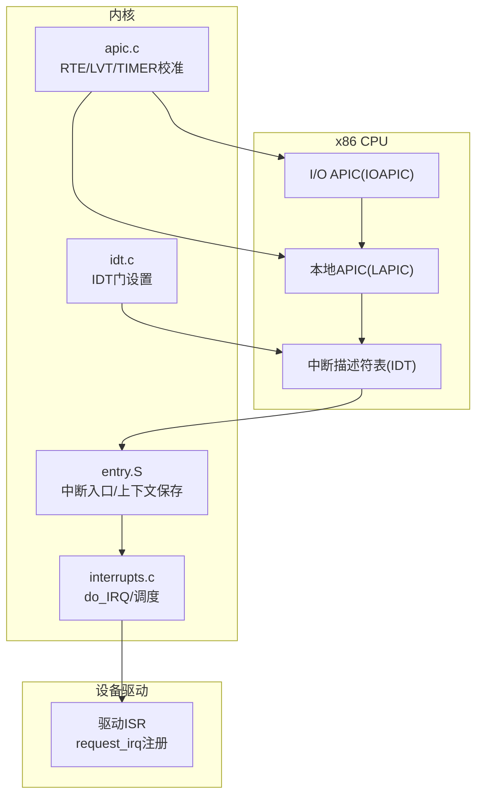
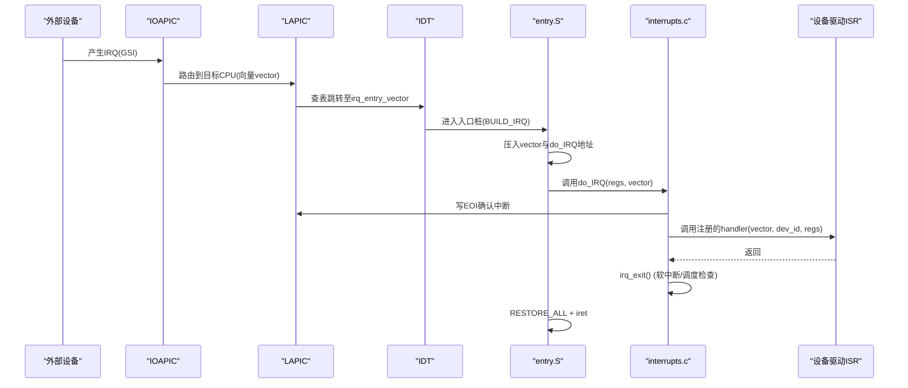
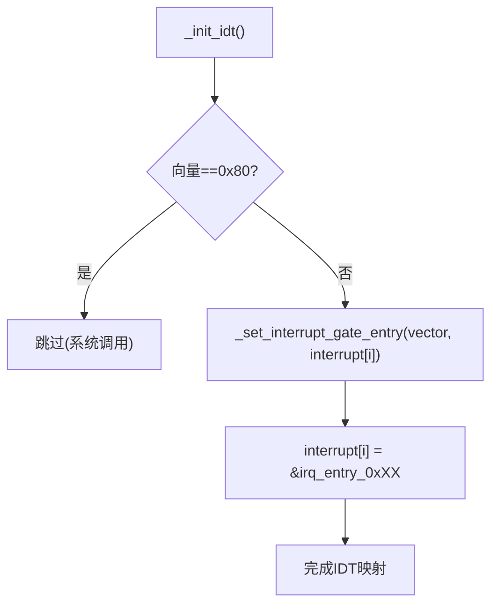
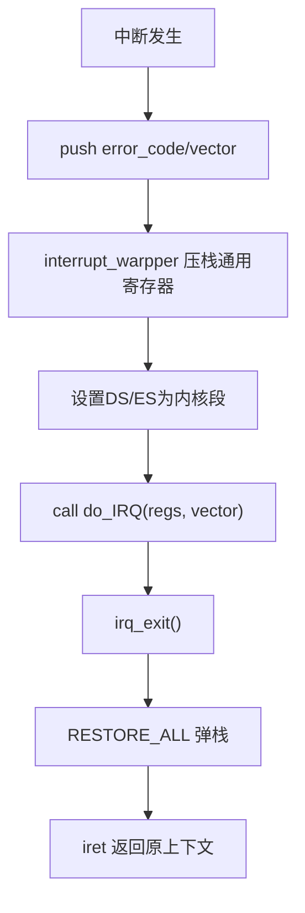
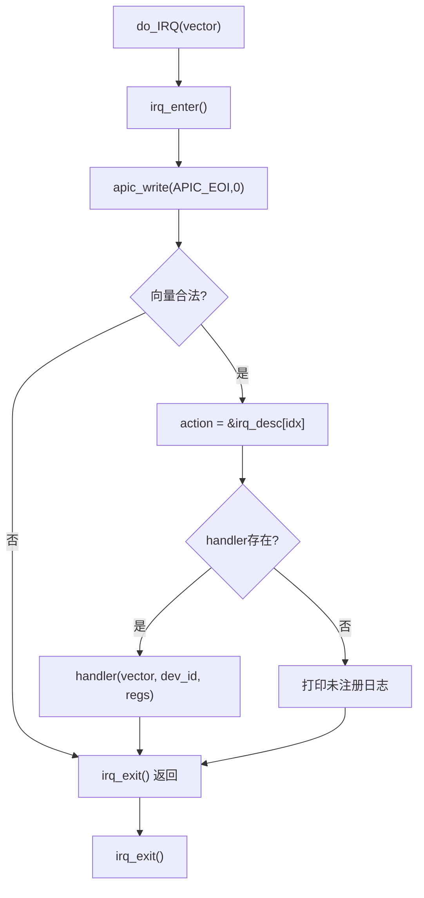
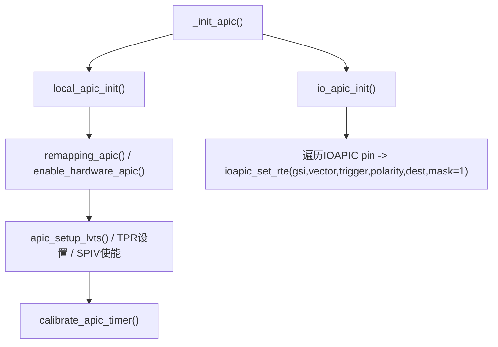
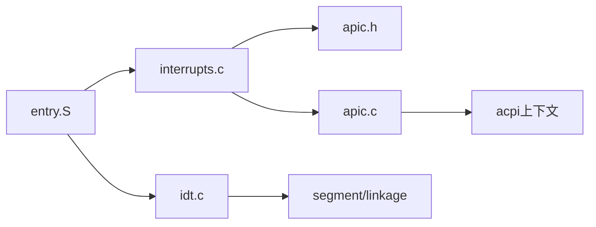

# 硬件中断处理

<cite>
**本文引用的文件**
- [interrupts.h](file://includes/interrupts/interrupts.h)
- [interrupts.c](file://kernel/interrupts/interrupts.c)
- [idt.c](file://arch/x86/kernel/idt.c)
- [entry.S](file://arch/x86/entry.S)
- [apic.c](file://arch/x86/kernel/apic.c)
- [apic.h](file://includes/arch/x86/apic.h)
- [ptrace.h](file://includes/arch/x86/ptrace.h)
</cite>

## 目录
1. [简介](#简介)
2. [项目结构](#项目结构)
3. [核心组件](#核心组件)
4. [架构总览](#架构总览)
5. [详细组件分析](#详细组件分析)
6. [依赖关系分析](#依赖关系分析)
7. [性能与优先级](#性能与优先级)
8. [故障排查指南](#故障排查指南)
9. [结论](#结论)
10. [附录：设备驱动编程指南](#附录：设备驱动编程指南)

## 简介
本文件面向LulaOS的硬件中断子系统，系统性说明从CPU接收到外部中断信号到最终执行设备驱动的中断服务程序（ISR）的完整流程；解释中断入口桩的生成机制、中断向量表（IDT）映射关系；详述中断上下文保存与恢复过程（寄存器状态管理）、中断屏蔽与使能控制接口；并给出中断优先级管理与嵌套中断策略。最后为设备驱动开发者提供可操作的编程指南与最佳实践。

## 项目结构
围绕中断的关键代码分布在以下位置：
- 抽象接口与常量定义：includes/interrupts/interrupts.h
- 中断分发与通用处理：kernel/interrupts/interrupts.c
- IDT初始化与异常门配置：arch/x86/kernel/idt.c
- 汇编级入口与上下文切换：arch/x86/entry.S
- APIC/IOAPIC初始化与RTE配置：arch/x86/kernel/apic.c, includes/arch/x86/apic.h
- 寄存器上下文结构：includes/arch/x86/ptrace.h

图表来源
- [entry.S:186-443](file://arch/x86/entry.S#L186-L443)
- [interrupts.c:18-108](file://kernel/interrupts/interrupts.c#L18-L108)
- [apic.c:230-380](file://arch/x86/kernel/apic.c#L230-L380)
- [idt.c:284-331](file://arch/x86/kernel/idt.c#L284-L331)

章节来源
- [interrupts.h:1-78](file://includes/interrupts/interrupts.h#L1-L78)
- [interrupts.c:1-145](file://kernel/interrupts/interrupts.c#L1-L145)
- [idt.c:1-332](file://arch/x86/kernel/idt.c#L1-L332)
- [entry.S:1-736](file://arch/x86/entry.S#L1-L736)
- [apic.c:1-532](file://arch/x86/kernel/apic.c#L1-L532)
- [apic.h:1-197](file://includes/arch/x86/apic.h#L1-L197)
- [ptrace.h:1-27](file://includes/arch/x86/ptrace.h#L1-L27)

## 核心组件
- 中断向量与常量：FIRST_EXTERNAL_VECTOR、NR_IRQS、TIMER_APIC_VECTOR、ERROR_APIC_VECTOR等，定义了系统保留与设备可用向量范围。
- IRQ描述符表：irq_desc[NR_IRQS]，维护每个向量的handler、dev_id、name。
- 中断入口桩：entry.S中通过BUILD_IRQ宏为每个向量生成独立入口，压入向量号后统一进入C层do_IRQ。
- IDT映射：idt.c将各向量门指向对应入口桩或专用处理函数（如APIC Timer/Error）。
- APIC/IOAPIC：apic.c负责LAPIC/IOAPIC初始化、LVT配置、RTE映射、Timer校准、中断屏蔽/使能。
- 上下文结构：pt_regs在ptrace.h中定义，entry.S在SAVE_ALL/RESTORE_ALL中完成寄存器压栈/出栈。

章节来源
- [interrupts.h:35-42](file://includes/interrupts/interrupts.h#L35-L42)
- [interrupts.c:9-27](file://kernel/interrupts/interrupts.c#L9-L27)
- [entry.S:195-431](file://arch/x86/entry.S#L195-L431)
- [idt.c:68-99](file://arch/x86/kernel/idt.c#L68-L99)
- [apic.c:102-180](file://arch/x86/kernel/apic.c#L102-L180)
- [ptrace.h:5-23](file://includes/arch/x86/ptrace.h#L5-L23)

## 架构总览
下图展示一次典型硬件中断从触发到驱动的调用序列。

图表来源
- [entry.S:195-443](file://arch/x86/entry.S#L195-L443)
- [interrupts.c:84-108](file://kernel/interrupts/interrupts.c#L84-L108)
- [apic.c:330-368](file://arch/x86/kernel/apic.c#L330-L368)
- [idt.c:284-331](file://arch/x86/kernel/idt.c#L284-L331)

## 详细组件分析

### 中断入口桩生成机制与IDT映射
- 入口桩生成：entry.S使用BUILD_IRQ宏为每个向量生成独立的irq_entry_n，压入向量号n并跳转到统一的C入口do_IRQ。这保证了do_IRQ可通过error_code参数识别具体中断源。
- IDT映射：idt.c在_init_idt中将0x20~0xFF（除0x80系统调用）的向量门指向对应的irq_entry_n；同时为APIC Timer(0xEF)和Error(0xFE)设置专用入口。
- 向量分配：FIRST_EXTERNAL_VECTOR=0x20，FIRST_DEVICE_VECTOR=0x31，NR_IRQS=224，覆盖设备可用向量空间。

图表来源
- [idt.c:284-331](file://arch/x86/kernel/idt.c#L284-L331)
- [entry.S:195-431](file://arch/x86/entry.S#L195-L431)

章节来源
- [entry.S:195-431](file://arch/x86/entry.S#L195-L431)
- [idt.c:68-99](file://arch/x86/kernel/idt.c#L68-L99)
- [interrupts.h:35-42](file://includes/interrupts/interrupts.h#L35-L42)

### 中断上下文保存与恢复
- 保存：entry.S的SAVE_ALL宏（配合中断包装器interrupt_warpper）将通用寄存器、段寄存器、EIP/CS/EFLAGS等按固定顺序压栈，形成pt_regs布局。
- 恢复：RESTORE_ALL按逆序弹出寄存器，并通过iret返回用户态或内核态上下文。
- pt_regs：包含ebx、ecx、edx、esi、edi、ebp、es、ds、eax、func_addr、error_code、eip、cs、eflags、esp、ss，确保C层可访问中断现场。

图表来源
- [entry.S:23-91](file://arch/x86/entry.S#L23-L91)
- [ptrace.h:5-23](file://includes/arch/x86/ptrace.h#L5-L23)

章节来源
- [entry.S:23-91](file://arch/x86/entry.S#L23-L91)
- [ptrace.h:5-23](file://includes/arch/x86/ptrace.h#L5-L23)

### 中断分发与设备ISR调用
- do_IRQ：接收向量号，计算索引idx=vector-FIRST_EXTERNAL_VECTOR，调用irq_enter()，发送EOI，校验向量合法性，查找irq_desc[idx].handler并调用，最后irq_exit()。
- request_irq/free_irq：注册/注销设备ISR，并在注册时解除对应GSI的屏蔽以启用中断；注销时先屏蔽再清理描述符。

图表来源
- [interrupts.c:84-108](file://kernel/interrupts/interrupts.c#L84-L108)

章节来源
- [interrupts.c:18-108](file://kernel/interrupts/interrupts.c#L18-L108)

### APIC/IOAPIC初始化与中断屏蔽/使能
- LAPIC初始化：local_apic_init()启用本地APIC、配置LINT/LVT、设置TPR接受优先级阈值、开启SPIV并配置SPURIOUS向量，校准APIC Timer。
- IOAPIC初始化：io_apic_init()遍历ACPI提供的IOAPIC信息，为每个pin配置RTE，默认屏蔽；根据ACPI覆盖更新GSI/trigger/polarity。
- 屏蔽/使能：ioapic_enable_irq()/ioapic_disable_irq()通过操作RTE低32位的mask位实现。
- Timer/Error：TIMER_APIC_VECTOR(0xEF)与ERROR_APIC_VECTOR(0xFE)分别绑定apic_timer_entry与apic_error_entry，用于定时与错误处理。

图表来源
- [apic.c:37-180](file://arch/x86/kernel/apic.c#L37-L180)
- [apic.c:230-380](file://arch/x86/kernel/apic.c#L230-L380)

章节来源
- [apic.c:37-180](file://arch/x86/kernel/apic.c#L37-L180)
- [apic.c:230-380](file://arch/x86/kernel/apic.c#L230-L380)
- [apic.h:97-197](file://includes/arch/x86/apic.h#L97-L197)

### 中断优先级与嵌套策略
- 优先级：通过LAPIC TPR设置接受优先级阈值（例如接受高于32的中断），从而限制低优先级中断进入。
- 嵌套：中断门类型（interrupt gate）在进入时会清除IF标志，防止同级别中断立即嵌套；若需允许嵌套，应在ISR中谨慎重新使能中断。
- 特殊路径：APIC Timer与Error使用专用入口，避免与设备中断竞争。

章节来源
- [apic.c:47-58](file://arch/x86/kernel/apic.c#L47-L58)
- [idt.c:284-331](file://arch/x86/kernel/idt.c#L284-L331)

## 依赖关系分析
- entry.S依赖IDT映射的入口桩名称与符号；interrupts.c依赖APIC接口进行EOI与屏蔽控制；apic.c依赖ACPI上下文与内存映射工具；idt.c依赖segment与linkage头以正确设置门属性。
- 关键耦合点：
  - 向量常量一致性：entry.S与interrupts.h必须保持一致（如VECTOR_TIMER、VECTOR_ERROR）。
  - RTE映射：apic.c中ioapic_set_rte配置的vector必须与IDT映射一致。
  - 上下文布局：entry.S压栈顺序与ptrace.h的pt_regs字段顺序严格匹配。

图表来源
- [entry.S:186-443](file://arch/x86/entry.S#L186-L443)
- [interrupts.c:1-145](file://kernel/interrupts/interrupts.c#L1-L145)
- [apic.c:1-532](file://arch/x86/kernel/apic.c#L1-L532)
- [idt.c:1-332](file://arch/x86/kernel/idt.c#L1-L332)

章节来源
- [entry.S:186-443](file://arch/x86/entry.S#L186-L443)
- [interrupts.c:1-145](file://kernel/interrupts/interrupts.c#L1-L145)
- [apic.c:1-532](file://arch/x86/kernel/apic.c#L1-L532)
- [idt.c:1-332](file://arch/x86/kernel/idt.c#L1-L332)

## 性能与优先级
- 快速路径：do_IRQ尽早发送EOI，减少同级/低优先级中断阻塞时间。
- 最小化开销：入口桩仅做必要压栈与跳转，C层尽快调用驱动ISR。
- 优先级控制：通过TPR限制可接受的中断优先级，避免低优先级中断干扰关键路径。
- 定时器：APIC Timer周期性tick驱动调度器，保证系统响应性。

[本节为通用指导，不直接分析具体文件]

## 故障排查指南
- 常见症状与定位：
  - “unexpected vector”：do_IRQ检测到非法向量，检查IDT映射与IOAPIC RTE配置。
  - “no handler registered”：驱动未成功注册request_irq或已free_irq。
  - APIC Error中断：读取APIC_ERR寄存器，检查LVT配置与引脚极性/触发模式。
- 调试建议：
  - 使用show_registers/printk输出中断现场，核对EIP/CS/EFLAGS。
  - 验证entry.S与ptrace.h的pt_regs布局一致性。
  - 检查ioapic_set_rte的vector是否与IDT映射一致。

章节来源
- [interrupts.c:84-108](file://kernel/interrupts/interrupts.c#L84-L108)
- [apic.c:135-144](file://arch/x86/kernel/apic.c#L135-L144)
- [idt.c:120-171](file://arch/x86/kernel/idt.c#L120-L171)

## 结论
LulaOS的硬件中断处理采用“汇编入口+通用C分发+设备ISR”的分层设计：entry.S生成向量专属入口并保存上下文，interrupts.c集中分发并调用驱动ISR，apic.c负责底层APIC/IOAPIC配置与屏蔽控制。该方案清晰分离了平台相关与平台无关逻辑，便于扩展与维护。通过合理的优先级设置与EOI时机控制，系统在多设备并发场景下具备良好稳定性。

[本节为总结，不直接分析具体文件]

## 附录：设备驱动编程指南
- 注册与注销：
  - 使用request_irq(vector, handler, name, dev_id)注册ISR，成功后自动解除对应GSI屏蔽。
  - 使用free_irq(vector)注销ISR，内部会先屏蔽硬件中断再清理描述符。
- 编写ISR的最佳实践：
  - 保持ISR短小精悍，尽快ACK设备（如读数据寄存器、清中断标志）。
  - 如需耗时操作，提交到底层软中断或工作队列异步处理。
  - 避免在ISR中进行可能阻塞的操作（睡眠、锁等待）。
  - 正确处理设备私有数据dev_id，确保多线程安全。
- 中断屏蔽与使能：
  - 一般由request_irq/free_irq管理；必要时可直接调用ioapic_enable_irq/ioapic_disable_irq。
- 优先级与嵌套：
  - 通过LAPIC TPR控制可接受的中断优先级；谨慎在ISR中重新使能中断以避免递归。
- 调试技巧：
  - 打印中断向量、设备状态寄存器值；结合show_registers查看上下文。
  - 对APIC Error中断，读取APIC_ERR并记录日志。

章节来源
- [interrupts.c:29-77](file://kernel/interrupts/interrupts.c#L29-L77)
- [apic.c:330-368](file://arch/x86/kernel/apic.c#L330-L368)
- [apic.c:135-144](file://arch/x86/kernel/apic.c#L135-L144)