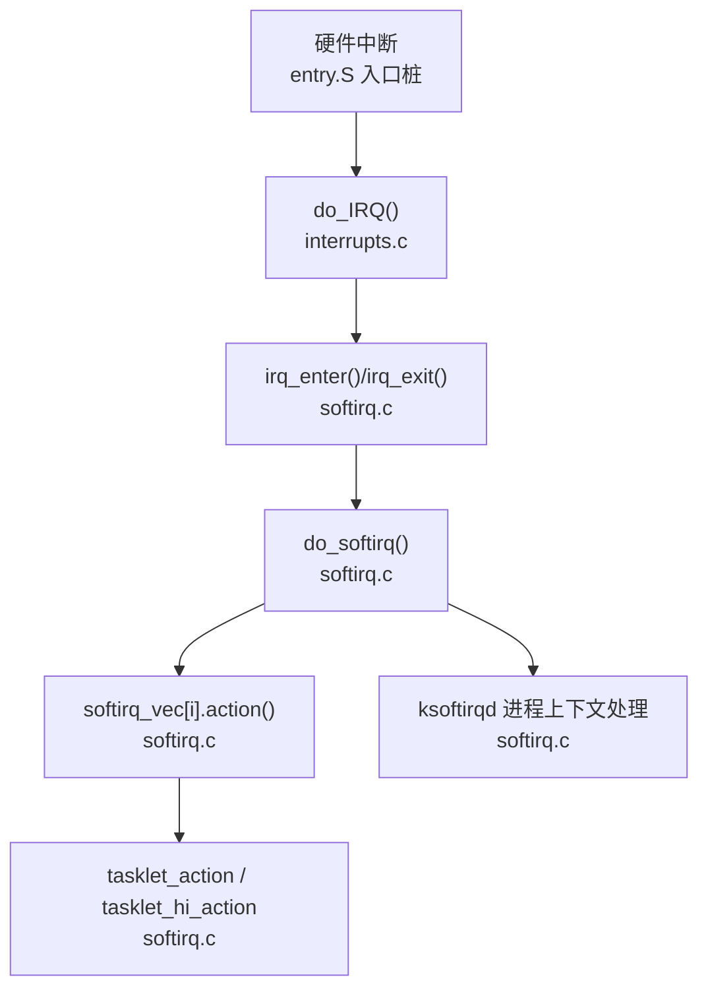
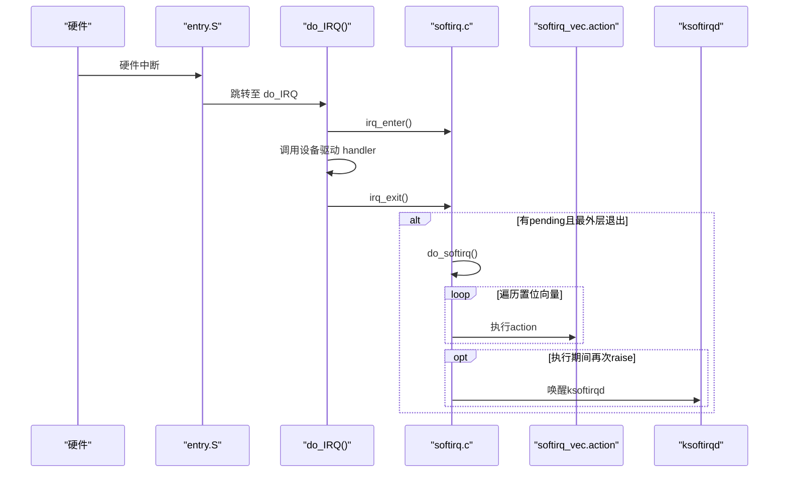
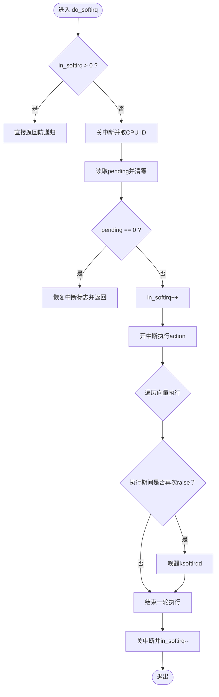
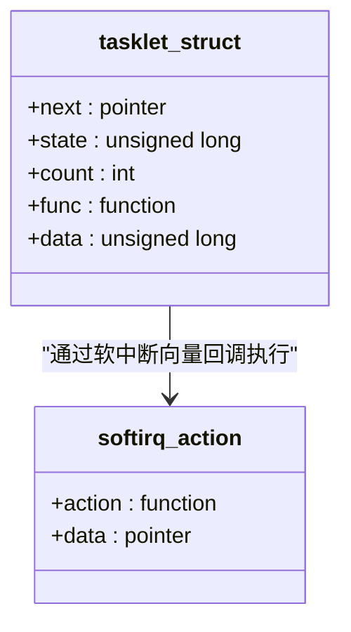
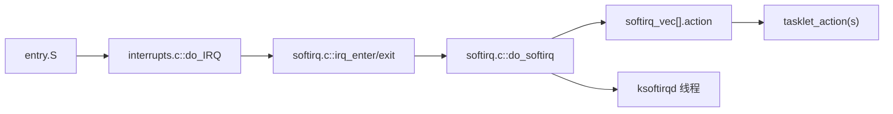

# 软中断机制

<cite>
**本文引用的文件**
- [includes/kernel/softirq.h](file://includes/kernel/softirq.h)
- [kernel/softirq.c](file://kernel/softirq.c)
- [includes/interrupts/interrupts.h](file://includes/interrupts/interrupts.h)
- [kernel/interrupts/interrupts.c](file://kernel/interrupts/interrupts.c)
- [arch/x86/entry.S](file://arch/x86/entry.S)
- [README.md](file://README.md)
</cite>

## 目录
1. [简介](#简介)
2. [项目结构](#项目结构)
3. [核心组件](#核心组件)
4. [架构总览](#架构总览)
5. [详细组件分析](#详细组件分析)
6. [依赖关系分析](#依赖关系分析)
7. [性能考虑](#性能考虑)
8. [故障排查指南](#故障排查指南)
9. [结论](#结论)
10. [附录：API 使用与最佳实践](#附录api-使用与最佳实践)

## 简介
本文件系统性说明 LulaOS 的软中断（softirq）机制，包括其概念、与硬件中断的区别、注册/触发/执行流程、队列管理与调度策略、与硬中断的协作模式，以及面向内核开发者的编程实践与性能优化建议。文档严格基于仓库源码进行分析，所有实现细节均对应具体源文件与行号。

## 项目结构
LulaOS 将软中断子系统与中断子系统解耦：
- 软中断子系统位于 includes/kernel/softirq.h 与 kernel/softirq.c，提供 softirq 向量表、per-CPU pending 位掩码、ksoftirqd 守护线程、Tasklet 支持等。
- 中断子系统位于 includes/interrupts/interrupts.h 与 kernel/interrupts/interrupts.c，负责设备中断注册、分发、以及 do_IRQ 入口。
- x86 架构入口 arch/x86/entry.S 生成各向量入口桩，统一进入 C 层 do_IRQ。

图表来源
- [arch/x86/entry.S:191-431](file://arch/x86/entry.S#L191-L431)
- [kernel/interrupts/interrupts.c:84-108](file://kernel/interrupts/interrupts.c#L84-L108)
- [kernel/softirq.c:89-123](file://kernel/softirq.c#L89-L123)
- [kernel/softirq.c:369-385](file://kernel/softirq.c#L369-L385)
- [kernel/softirq.c:161-177](file://kernel/softirq.c#L161-L177)

章节来源
- [arch/x86/entry.S:191-431](file://arch/x86/entry.S#L191-L431)
- [kernel/interrupts/interrupts.c:84-108](file://kernel/interrupts/interrupts.c#L84-L108)
- [kernel/softirq.c:89-123](file://kernel/softirq.c#L89-L123)

## 核心组件
- 软中断向量与动作表：维护每个软中断向量的 action 回调与私有数据。
- per-CPU pending 位掩码：记录当前 CPU 上待处理的软中断集合。
- 中断上下文计数 in_irq：防止嵌套中断错误触发软中断。
- ksoftirqd 守护线程：在进程上下文持续处理软中断风暴，避免长时间占用中断上下文。
- Tasklet 子系统：通过 TASKLET_SOFTIRQ/HI_SOFTIRQ 向量延迟执行轻量任务，提供优先级区分与并发控制。

章节来源
- [includes/kernel/softirq.h:16-31](file://includes/kernel/softirq.h#L16-L31)
- [kernel/softirq.c:31-44](file://kernel/softirq.c#L31-L44)
- [kernel/softirq.c:161-194](file://kernel/softirq.c#L161-L194)
- [kernel/softirq.c:213-385](file://kernel/softirq.c#L213-L385)

## 架构总览
软中断是“下半部”机制，用于将耗时或可延后工作从硬中断顶半部移出，降低中断关闭时间，提高系统响应性。LulaOS 中：
- 硬中断路径：entry.S 入口桩 → do_IRQ() → irq_enter() → 设备驱动 handler → irq_exit()。
- 若 irq_exit() 发现 pending 非零且为最外层中断退出，则调用 do_softirq() 执行所有置位的软中断。
- do_softirq() 会读+清零 per-CPU pending，开中断依次执行 action；若执行期间再次 raise，则唤醒 ksoftirqd 在进程上下文继续处理，避免中断风暴。

图表来源
- [arch/x86/entry.S:191-431](file://arch/x86/entry.S#L191-L431)
- [kernel/interrupts/interrupts.c:84-108](file://kernel/interrupts/interrupts.c#L84-L108)
- [kernel/softirq.c:89-123](file://kernel/softirq.c#L89-L123)
- [kernel/softirq.c:161-177](file://kernel/softirq.c#L161-L177)

## 详细组件分析

### 软中断向量与动作表
- 向量编号：HI_SOFTIRQ、TIMER_SOFTIRQ、NET_TX_SOFTIRQ、NET_RX_SOFTIRQ、BLOCK_SOFTIRQ、TASKLET_SOFTIRQ。
- 数据结构：softirq_action 包含函数指针与私有数据。
- 初始化：softirq_init() 清空向量表，并注册 HI_SOFTIRQ 与 TASKLET_SOFTIRQ 的默认 action。

章节来源
- [includes/kernel/softirq.h:16-31](file://includes/kernel/softirq.h#L16-L31)
- [kernel/softirq.c:31-32](file://kernel/softirq.c#L31-L32)
- [kernel/softirq.c:399-414](file://kernel/softirq.c#L399-L414)

### 注册与触发
- open_softirq(nr, action, data)：注册某向量的处理函数与数据。
- raise_softirq(nr)：原子置位当前 CPU 的 pending 位，等待下一次 irq_exit() 时由 do_softirq() 执行。

章节来源
- [kernel/softirq.c:54-77](file://kernel/softirq.c#L54-L77)

### 执行流程与防递归
- do_softirq()：读取并清零 pending，设置 in_softirq 防递归，开中断执行 action；结束后恢复 in_softirq，并在仍有 pending 时唤醒 ksoftirqd。
- irq_enter()/irq_exit()：维护 per-CPU in_irq 计数，确保仅在退出最外层中断时触发软中断。

图表来源
- [kernel/softirq.c:89-123](file://kernel/softirq.c#L89-L123)

章节来源
- [kernel/softirq.c:89-123](file://kernel/softirq.c#L89-L123)
- [kernel/softirq.c:131-149](file://kernel/softirq.c#L131-L149)

### ksoftirqd 守护线程
- 每 CPU 一个内核线程，当 do_softirq() 执行期间再次被 raise 时唤醒，在进程上下文循环处理 pending，避免中断上下文长时间占用 CPU。
- 无 pending 时睡眠，有 pending 时反复调用 do_softirq() 直到清空。

章节来源
- [kernel/softirq.c:161-194](file://kernel/softirq.c#L161-L194)

### Tasklet 子系统
- 数据结构：tasklet_struct 包含链表指针、状态位（SCHED/RUN）、禁用计数 count、回调函数与数据。
- 调度：tasklet_schedule() 将 tasklet 链入当前 CPU 普通优先级链表并 raise TASKLET_SOFTIRQ；tasklet_hi_schedule() 链入高优先级链表并 raise HI_SOFTIRQ。
- 执行：tasklet_action()/tasklet_hi_action() 在软中断上下文中遍历并执行各自链表中的 tasklet。
- 并发控制：STATE_RUN 标记正在执行，SMP 下防止重复执行；count>0 表示禁用，跳过执行。

图表来源
- [includes/kernel/softirq.h:59-65](file://includes/kernel/softirq.h#L59-L65)
- [includes/kernel/softirq.h:27-31](file://includes/kernel/softirq.h#L27-L31)
- [kernel/softirq.c:369-385](file://kernel/softirq.c#L369-L385)

章节来源
- [includes/kernel/softirq.h:54-96](file://includes/kernel/softirq.h#L54-L96)
- [kernel/softirq.c:213-385](file://kernel/softirq.c#L213-L385)

### 与硬中断的协作模式
- 设备驱动在硬中断顶半部完成快速操作，必要时通过 raise_softirq() 将耗时工作推迟到软中断上下文。
- do_IRQ() 在设备 handler 前后调用 irq_enter()/irq_exit()，确保软中断在最外层中断退出时执行。
- 若设备驱动频繁 raise，ksoftirqd 会在进程上下文兜底处理，避免中断风暴。

章节来源
- [kernel/interrupts/interrupts.c:84-108](file://kernel/interrupts/interrupts.c#L84-L108)
- [kernel/softirq.c:89-123](file://kernel/softirq.c#L89-L123)

## 依赖关系分析
- entry.S 为所有外部中断向量生成入口桩，统一跳转到 do_IRQ()。
- interrupts.c 管理设备中断描述符数组，request_irq/free_irq 控制使能/屏蔽。
- softirq.c 依赖调度器接口（如 interruptible_sleep、wake_up_process）和 SMP 接口（smp_processor_id）。
- 初始化顺序：_init_interrupts() 初始化 APIC 与系统调用；softirq_init() 注册默认软中断向量并创建 BSP 的 ksoftirqd。

图表来源
- [arch/x86/entry.S:191-431](file://arch/x86/entry.S#L191-L431)
- [kernel/interrupts/interrupts.c:84-108](file://kernel/interrupts/interrupts.c#L84-L108)
- [kernel/softirq.c:89-123](file://kernel/softirq.c#L89-L123)
- [kernel/softirq.c:369-385](file://kernel/softirq.c#L369-L385)
- [kernel/softirq.c:161-177](file://kernel/softirq.c#L161-L177)

章节来源
- [arch/x86/entry.S:191-431](file://arch/x86/entry.S#L191-L431)
- [kernel/interrupts/interrupts.c:18-27](file://kernel/interrupts/interrupts.c#L18-L27)
- [kernel/softirq.c:399-414](file://kernel/softirq.c#L399-L414)

## 性能考虑
- 最小化硬中断顶半部耗时：尽量只做寄存器读写、清除中断标志、少量数据处理，其余工作通过软中断或 tasklet 延后。
- 合理使用优先级：紧急任务使用 HI_SOFTIRQ/tasklet_hi_schedule，常规任务使用 TASKLET_SOFTIRQ。
- 避免在中断上下文做阻塞操作：如需等待，应让出 CPU 或在进程上下文处理（ksoftirqd）。
- 合并与批处理：减少多次 raise 的频率，批量处理可降低调度开销。
- 监控软中断风暴：若频繁 raise，确保 ksoftirqd 能及时处理，避免中断上下文长期占用。

[本节为通用性能指导，不直接分析具体文件]

## 故障排查指南
- 未注册 handler 的中断：do_IRQ() 会打印未注册信息，检查 request_irq 是否正确调用。
- 嵌套中断误触发：确认在设备 handler 前后正确调用 irq_enter()/irq_exit()，避免 in_irq 计数错误导致提前触发软中断。
- 软中断风暴：观察 ksoftirqd 是否频繁唤醒，检查是否有驱动在高频 raise；必要时调整任务粒度或改用进程上下文处理。
- Tasklet 未执行：检查 STATE_SCHED 与 count 状态，确认未被禁用且已正确调度。

章节来源
- [kernel/interrupts/interrupts.c:100-108](file://kernel/interrupts/interrupts.c#L100-L108)
- [kernel/softirq.c:131-149](file://kernel/softirq.c#L131-L149)
- [kernel/softirq.c:161-177](file://kernel/softirq.c#L161-L177)
- [kernel/softirq.c:341-367](file://kernel/softirq.c#L341-L367)

## 结论
LulaOS 的软中断机制通过 per-CPU pending 位掩码、严格的上下文计数与 ksoftirqd 守护线程，实现了高效、安全的下半部处理。Tasklet 提供了便捷的任务调度与优先级区分，配合合理的编程实践，可在保证实时性的同时提升系统吞吐与稳定性。

[本节为总结性内容，不直接分析具体文件]

## 附录：API 使用与最佳实践
- 注册软中断向量：open_softirq(nr, action, data)
- 触发软中断：raise_softirq(nr)
- 执行软中断：do_softirq()（通常由 irq_exit() 自动调用）
- 中断上下文边界：irq_enter()/irq_exit()
- 初始化：softirq_init()（注册默认向量并创建 BSP 的 ksoftirqd）
- AP 上线：ksoftirqd_init()（为每个 AP 创建守护线程）
- Tasklet 生命周期：
  - 声明与初始化：DECLARE_TASKLET(name, func, data) 或 tasklet_init(t, func, data)
  - 调度：tasklet_schedule(t)、tasklet_hi_schedule(t)
  - 禁用/启用：tasklet_disable_nosync(t)、tasklet_disable(t)、tasklet_enable(t)
  - 立即执行（调试）：tasklet_action_now(t)

章节来源
- [includes/kernel/softirq.h:33-52](file://includes/kernel/softirq.h#L33-L52)
- [includes/kernel/softirq.h:54-96](file://includes/kernel/softirq.h#L54-L96)
- [kernel/softirq.c:54-77](file://kernel/softirq.c#L54-L77)
- [kernel/softirq.c:89-123](file://kernel/softirq.c#L89-L123)
- [kernel/softirq.c:131-149](file://kernel/softirq.c#L131-L149)
- [kernel/softirq.c:161-194](file://kernel/softirq.c#L161-L194)
- [kernel/softirq.c:213-385](file://kernel/softirq.c#L213-L385)