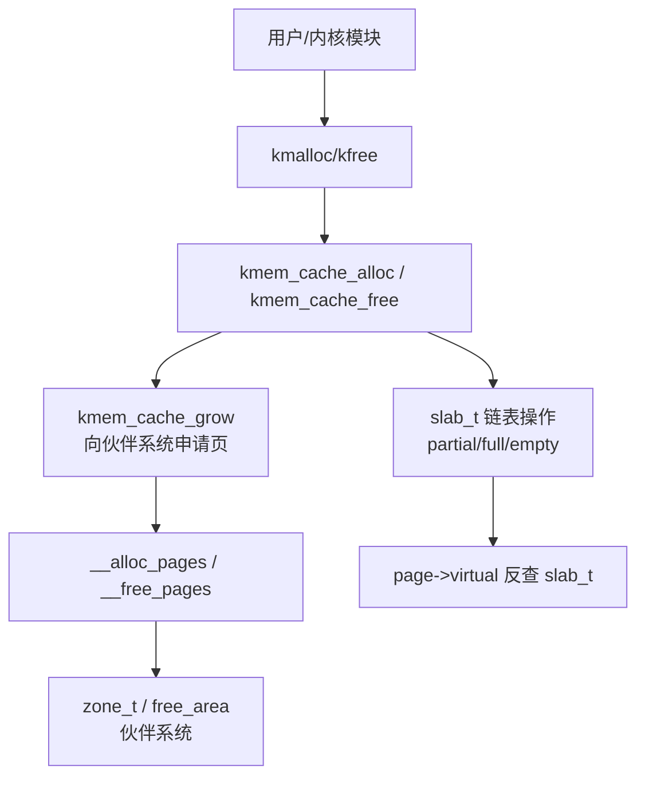
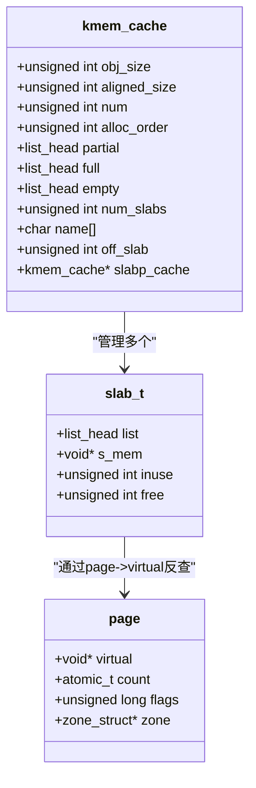
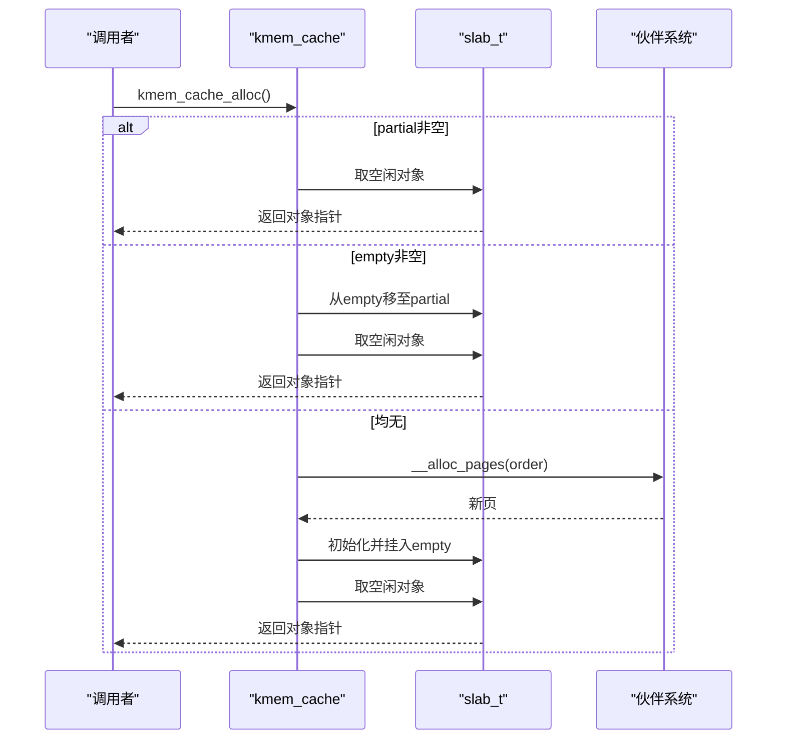
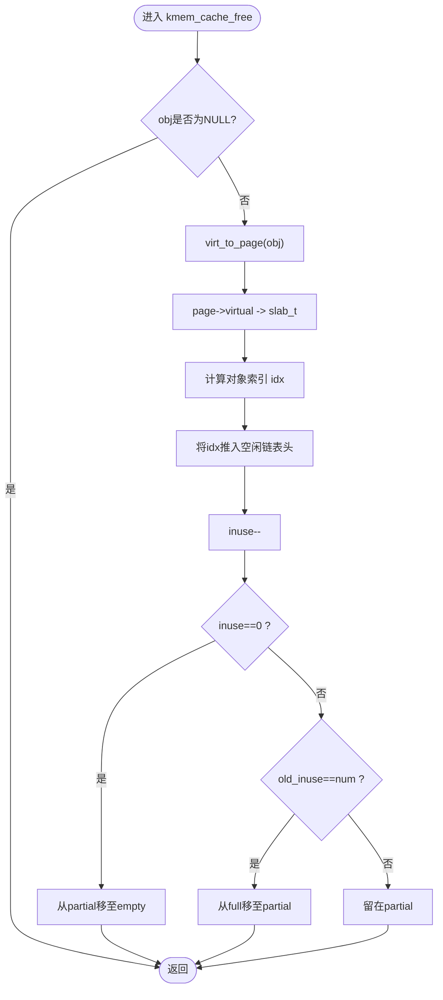
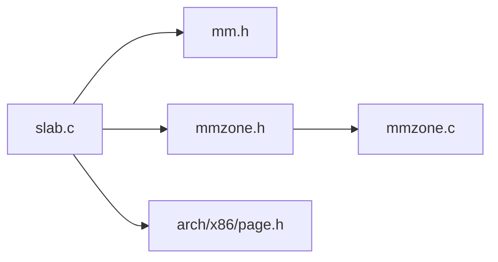
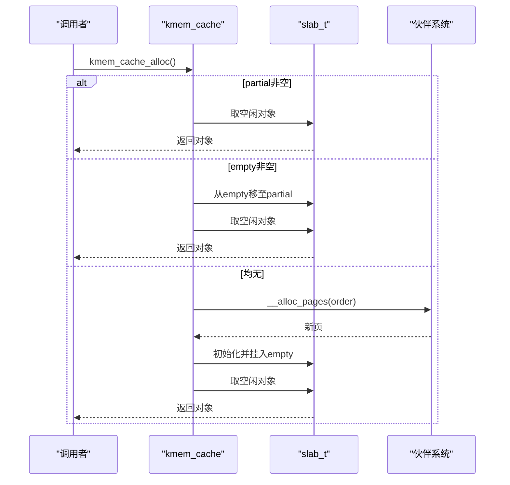
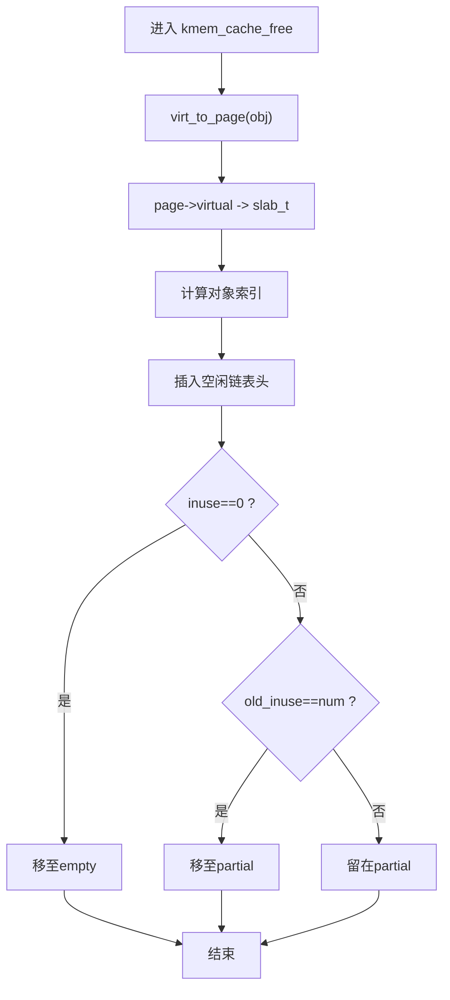

# Slab分配器

<cite>
**本文引用的文件**
- [includes/mm/slab.h](file://includes/mm/slab.h)
- [kernel/mm/slab.c](file://kernel/mm/slab.c)
- [includes/mm/mm.h](file://includes/mm/mm.h)
- [includes/mm/mmzone.h](file://includes/mm/mmzone.h)
- [kernel/mm/mmzone.c](file://kernel/mm/mmzone.c)
</cite>

## 目录
1. [简介](#简介)
2. [项目结构](#项目结构)
3. [核心组件](#核心组件)
4. [架构总览](#架构总览)
5. [详细组件分析](#详细组件分析)
6. [依赖关系分析](#依赖关系分析)
7. [性能考虑](#性能考虑)
8. [故障排查指南](#故障排查指南)
9. [结论](#结论)
10. [附录](#附录)

## 简介
本文件为LulaOS的Slab分配器提供系统化、可操作的文档。内容涵盖设计目标与优势（对象缓存与内存复用）、关键数据结构（slab_cache与slab_t）的组织方式、完整的对象分配/释放流程（缓存查找、分配、回收）、不同缓存类型与管理策略，以及性能调优建议与内存使用分析方法。同时提供架构图与数据流图，帮助开发者理解内核对象的高效内存管理方案。

## 项目结构
Slab分配器位于内核内存子系统，主要代码与接口分布如下：
- 头文件定义：includes/mm/slab.h（数据结构、常量、API）
- 实现文件：kernel/mm/slab.c（初始化、创建缓存、分配/释放、通用kmalloc/kfree）
- 页管理与伙伴系统：includes/mm/mm.h、includes/mm/mmzone.h、kernel/mm/mmzone.c（页面描述符、区管理、伙伴分配/回收）

图表来源
- [kernel/mm/slab.c:249-296](file://kernel/mm/slab.c#L249-L296)
- [kernel/mm/slab.c:392-450](file://kernel/mm/slab.c#L392-L450)
- [kernel/mm/slab.c:459-502](file://kernel/mm/slab.c#L459-L502)
- [kernel/mm/slab.c:518-584](file://kernel/mm/slab.c#L518-L584)
- [includes/mm/mmzone.h:75-80](file://includes/mm/mmzone.h#L75-L80)
- [kernel/mm/mmzone.c:61-150](file://kernel/mm/mmzone.c#L61-L150)

章节来源
- [includes/mm/slab.h:1-147](file://includes/mm/slab.h#L1-L147)
- [kernel/mm/slab.c:1-585](file://kernel/mm/slab.c#L1-L585)
- [includes/mm/mm.h:1-98](file://includes/mm/mm.h#L1-L98)
- [includes/mm/mmzone.h:1-80](file://includes/mm/mmzone.h#L1-L80)
- [kernel/mm/mmzone.c:1-200](file://kernel/mm/mmzone.c#L1-L200)

## 核心组件
- slab_t：单个slab页的描述符，嵌入在页首或独立分配（OFF_SLAB），维护对象起始地址、已用计数、空闲链表头索引。
- kmem_cache_t：对象缓存，维护对象规格（原始大小、对齐后大小、每页对象数、申请阶数）、三条链表（partial/full/empty）、统计信息、名称、OFF_SLAB标志及描述符来源缓存。
- 全局静态池：cache_pool用于避免“鸡生蛋”问题，限制最大缓存数量。
- 通用分配器缓存：malloc_caches[9]对应固定尺寸（32/64/128/256/512/1024/2048/4096/8192字节），供kmalloc/kfree使用。
- 伙伴系统接口：__alloc_pages/__free_pages用于按阶申请/归还物理页。

章节来源
- [includes/mm/slab.h:35-88](file://includes/mm/slab.h#L35-L88)
- [kernel/mm/slab.c:10-47](file://kernel/mm/slab.c#L10-L47)
- [includes/mm/mmzone.h:75-80](file://includes/mm/mmzone.h#L75-L80)

## 架构总览
Slab分配器通过“缓存→slab页→对象”的层次化组织，结合空闲对象的嵌入式单链表，实现低开销的对象分配与回收。其关键特性包括：
- 延迟增长：首次分配时才向伙伴系统申请新slab页。
- 三色链表：partial（有空闲）、full（全满）、empty（全空可回收）。
- OFF_SLAB支持：大对象时，将slab_t从slabp_cache独立分配，使slab页100%用于对象并保证对齐。
- 通用分配器：kmalloc/kfree基于固定尺寸缓存快速命中。

图表来源
- [includes/mm/slab.h:45-88](file://includes/mm/slab.h#L45-L88)
- [includes/mm/mm.h:11-18](file://includes/mm/mm.h#L11-L18)

## 详细组件分析

### slab_t 与 kmem_cache_t 的设计
- slab_t
  - list：挂入partial/full/empty链表
  - s_mem：第一个对象的起始虚拟地址
  - inuse：已分配对象计数
  - free：空闲链表头索引，SLAB_NULL表示满
- kmem_cache_t
  - 对象规格：obj_size、aligned_size、num、alloc_order
  - 链表：partial（有空闲）、full（全满）、empty（全空）
  - 统计：num_slabs
  - 全局链：list（加入全局cache_cache）
  - 名称：name
  - OFF_SLAB：off_slab与slabp_cache，用于大对象场景

章节来源
- [includes/mm/slab.h:45-88](file://includes/mm/slab.h#L45-L88)

### 对象布局与空闲链表
- 页内布局：ON_SLAB时在页首放置slab_t并对齐，其后连续存放对象；OFF_SLAB时整页用于对象，s_mem=页基址。
- 空闲链表：每个对象前sizeof(unsigned int)存储下一个空闲对象索引，最后一个为SLAB_NULL。

章节来源
- [kernel/mm/slab.c:71-114](file://kernel/mm/slab.c#L71-L114)

### 缓存创建与增长
- kmem_cache_create：参数校验、对齐、计算最小order与num、选择是否启用OFF_SLAB、从静态池取描述符、初始化链表、记录名称、加入全局链。
- kmem_cache_grow：向伙伴系统申请页，构建slab_t并初始化空闲链表，设置page->virtual指向slab_t，挂入empty链表。

章节来源
- [kernel/mm/slab.c:304-384](file://kernel/mm/slab.c#L304-L384)
- [kernel/mm/slab.c:130-199](file://kernel/mm/slab.c#L130-L199)

### 分配流程（kmem_cache_alloc）
- 优先从partial取，其次从empty取（移入partial），均无则释放锁后调用grow再重试。
- 弹出空闲链表头节点，更新inuse，若满则移入full。

图表来源
- [kernel/mm/slab.c:392-450](file://kernel/mm/slab.c#L392-L450)
- [kernel/mm/slab.c:130-199](file://kernel/mm/slab.c#L130-L199)

章节来源
- [kernel/mm/slab.c:392-450](file://kernel/mm/slab.c#L392-L450)

### 释放流程（kmem_cache_free）
- 通过virt_to_page(obj)->virtual反查slab_t，计算对象索引，插入空闲链表头部。
- 根据inuse变化移动slab到empty或partial。

图表来源
- [kernel/mm/slab.c:459-502](file://kernel/mm/slab.c#L459-L502)

章节来源
- [kernel/mm/slab.c:459-502](file://kernel/mm/slab.c#L459-L502)

### 通用分配器（kmalloc/kfree）
- kmalloc：在malloc_caches[9]中查找最小满足size的缓存，调用kmem_cache_alloc。
- kfree：通过page->virtual反查slab_t，遍历malloc_caches匹配对象归属并调用kmem_cache_free。

章节来源
- [kernel/mm/slab.c:249-296](file://kernel/mm/slab.c#L249-L296)
- [kernel/mm/slab.c:518-584](file://kernel/mm/slab.c#L518-L584)

### 不同缓存类型的用途与管理策略
- 专用缓存：针对特定内核对象（如进程描述符、inode等）创建kmem_cache，减少碎片、提高命中率。
- 通用缓存：kmalloc使用的固定尺寸缓存，覆盖常见小对象分配需求。
- OFF_SLAB策略：当对象较大（≥PAGE_SIZE/8）且子系统已初始化时启用，描述符独立分配，提升对齐与空间利用率。

章节来源
- [includes/mm/slab.h:23-31](file://includes/mm/slab.h#L23-L31)
- [kernel/mm/slab.c:332-342](file://kernel/mm/slab.c#L332-L342)
- [kernel/mm/slab.c:278-295](file://kernel/mm/slab.c#L278-L295)

## 依赖关系分析
- slab.c依赖mm.h（page结构、标志位）、mmzone.h（伙伴系统接口）、arch/x86/page.h（页相关宏）。
- mmzone.c负责zone初始化、伙伴系统分配/回收，被slab.c在增长阶段调用。

图表来源
- [kernel/mm/slab.c:1-7](file://kernel/mm/slab.c#L1-L7)
- [kernel/mm/mmzone.c:1-13](file://kernel/mm/mmzone.c#L1-L13)

章节来源
- [kernel/mm/slab.c:1-7](file://kernel/mm/slab.c#L1-L7)
- [kernel/mm/mmzone.c:1-13](file://kernel/mm/mmzone.c#L1-L13)

## 性能考虑
- 命中率优化：尽量重用已有slab，避免频繁增长；合理设置对象大小以最大化每页对象数。
- 对齐与碎片：对齐到SLAB_ALIGN_BYTES，减少内部碎片；大对象启用OFF_SLAB以获得更好对齐与空间利用。
- 并发安全：使用自旋锁保护slab链表操作，避免竞态；注意unlock→lock窗口中的重新检查。
- 增长成本：增长涉及伙伴系统分配与初始化，应尽量避免热点路径触发；可通过预热缓存降低延迟。
- 通用分配器：kmalloc命中固定尺寸缓存，适合常见小对象；对于高频分配的大对象，建议创建专用缓存。

[本节为通用指导，不直接分析具体文件]

## 故障排查指南
- OOM告警：当无法增长slab时打印警告，检查伙伴系统可用页与order设置。
- 无效释放：kfree对非slab对象会打印警告，确认对象确实由slab分配。
- 缓存池耗尽：创建缓存超过KMEM_CACHE_MAX时会失败，需评估缓存数量与生命周期。
- 对齐错误：确保对象大小至少为SLAB_MIN_SIZE，否则会被调整。

章节来源
- [kernel/mm/slab.c:130-199](file://kernel/mm/slab.c#L130-L199)
- [kernel/mm/slab.c:518-584](file://kernel/mm/slab.c#L518-L584)
- [kernel/mm/slab.c:304-384](file://kernel/mm/slab.c#L304-L384)

## 结论
LulaOS的Slab分配器通过缓存与slab页两级组织、空闲对象嵌入式链表、三色链表管理以及OFF_SLAB策略，实现了高效的内核对象内存分配与回收。配合通用分配器与伙伴系统，能够在常见工作负载下提供良好的性能与较低的碎片率。开发者应根据对象特征选择合适的缓存策略，并结合性能分析与监控进行持续优化。

[本节为总结性内容，不直接分析具体文件]

## 附录

### 关键流程图与数据流图

#### 分配序列图（含增长）

图表来源
- [kernel/mm/slab.c:392-450](file://kernel/mm/slab.c#L392-L450)
- [kernel/mm/slab.c:130-199](file://kernel/mm/slab.c#L130-L199)

#### 释放流程图

图表来源
- [kernel/mm/slab.c:459-502](file://kernel/mm/slab.c#L459-L502)

### 内存使用分析工具与实践
- 观察日志：关注“created cache”、“enabled OFF_SLAB”、“OOM”等关键日志，定位缓存创建与增长情况。
- 统计指标：通过num_slabs与num估算内存占用；结合对象大小与每页对象数评估空间利用率。
- 热点路径：在高并发场景下，尽量减少跨锁增长；必要时预创建缓存以降低延迟。
- 对齐验证：确保对象大小对齐，避免浪费；大对象启用OFF_SLAB以获得更好的对齐与空间利用。

[本节为实践建议，不直接分析具体文件]