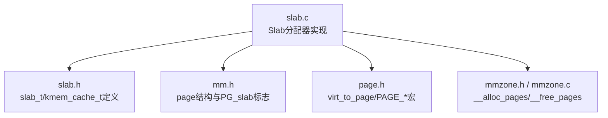
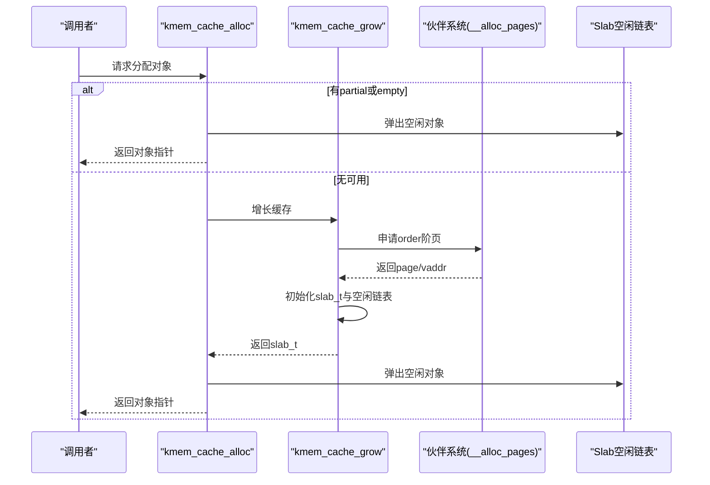
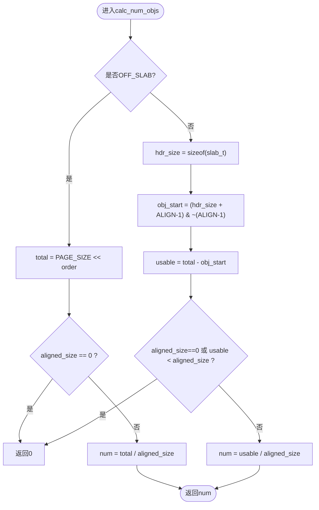
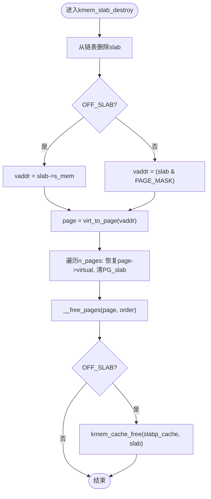
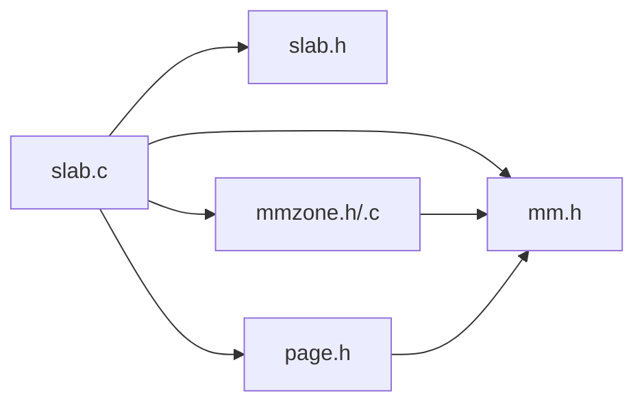

# Slab页管理

<cite>
**本文引用的文件**
- [slab.c](file://kernel/mm/slab.c)
- [slab.h](file://includes/mm/slab.h)
- [mm.h](file://includes/mm/mm.h)
- [page.h](file://includes/arch/x86/page.h)
- [mmzone.h](file://includes/mm/mmzone.h)
- [mmzone.c](file://kernel/mm/mmzone.c)
</cite>

## 目录
1. [简介](#简介)
2. [项目结构](#项目结构)
3. [核心组件](#核心组件)
4. [架构总览](#架构总览)
5. [详细组件分析](#详细组件分析)
6. [依赖关系分析](#依赖关系分析)
7. [性能与碎片分析](#性能与碎片分析)
8. [故障排查指南](#故障排查指南)
9. [结论](#结论)

## 简介
本文件面向LulaOS的Slab分配器，聚焦于“Slab页管理机制”。文档将系统阐述：
- slab_t描述符的结构设计与在页内的布局方式；
- ON_SLAB与OFF_SLAB两种模式的差异与适用场景；
- kmem_cache_grow()的增长算法（伙伴系统页面申请、描述符初始化、空闲对象链表构建）；
- kmem_slab_destroy()的销毁流程（页面回收与描述符释放）；
- calc_num_objs()的对象数量计算及不同order对内存利用率的影响；
- 内存碎片分析与性能优化最佳实践。

## 项目结构
与Slab页管理直接相关的代码位于内核内存子系统：
- 实现文件：kernel/mm/slab.c
- 接口与数据结构定义：includes/mm/slab.h
- 页/标志位等基础定义：includes/mm/mm.h、includes/arch/x86/page.h
- 伙伴系统与区域管理：includes/mm/mmzone.h、kernel/mm/mmzone.c



图表来源
- [slab.c:1-585](file://kernel/mm/slab.c#L1-L585)
- [slab.h:1-147](file://includes/mm/slab.h#L1-L147)
- [mm.h:1-98](file://includes/mm/mm.h#L1-L98)
- [page.h:1-47](file://includes/arch/x86/page.h#L1-L47)
- [mmzone.h:1-80](file://includes/mm/mmzone.h#L1-L80)
- [mmzone.c:275-329](file://kernel/mm/mmzone.c#L275-L329)

章节来源
- [slab.c:1-585](file://kernel/mm/slab.c#L1-L585)
- [slab.h:1-147](file://includes/mm/slab.h#L1-L147)
- [mm.h:1-98](file://includes/mm/mm.h#L1-L98)
- [page.h:1-47](file://includes/arch/x86/page.h#L1-L47)
- [mmzone.h:1-80](file://includes/mm/mmzone.h#L1-L80)
- [mmzone.c:275-329](file://kernel/mm/mmzone.c#L275-L329)

## 核心组件
- slab_t：单个Slab页的描述符，包含链表节点、对象起始地址s_mem、已用对象计数inuse、空闲链表头free。
- kmem_cache_t：对象缓存描述符，维护对象规格（obj_size、aligned_size）、每页对象数num、分配阶数alloc_order、partial/full/empty三链、统计num_slabs、名称name以及OFF_SLAB支持字段off_slab和slabp_cache。
- 全局静态池cache_pool[]：避免“鸡生蛋”问题，预分配kmem_cache_t实例。
- 通用kmalloc缓存数组malloc_caches[]：为常见尺寸提供快速路径。

章节来源
- [slab.h:35-88](file://includes/mm/slab.h#L35-L88)
- [slab.c:9-47](file://kernel/mm/slab.c#L9-L47)

## 架构总览
Slab分配器通过kmem_cache_t组织相同大小对象的分配与回收。每个缓存维护三条链表：
- partial：部分使用（有空闲对象）
- full：全满
- empty：完全空闲（可回收）

当需要分配对象时，优先从partial或empty取；若均无可用，则调用kmem_cache_grow()向伙伴系统申请新页并初始化一个Slab。释放时通过virt_to_page(obj)反查page->virtual得到slab_t，再将对象插入其空闲链表，并根据占用情况在三链间移动。



图表来源
- [slab.c:392-450](file://kernel/mm/slab.c#L392-L450)
- [slab.c:130-199](file://kernel/mm/slab.c#L130-L199)
- [mmzone.c:275-329](file://kernel/mm/mmzone.c#L275-L329)

## 详细组件分析

### slab_t描述符与页内布局
- 布局（ON_SLAB模式）：页首放置slab_t描述符，随后对齐填充，再是连续的对象区，s_mem指向第一个对象。
- OFF_SLAB模式：描述符不在页内，而是从独立的slabp_cache分配；s_mem指向页基址，整页用于对象，保证8KB对齐以配合current宏。



图表来源
- [slab.c:71-93](file://kernel/mm/slab.c#L71-L93)

章节来源
- [slab.h:35-50](file://includes/mm/slab.h#L35-L50)
- [slab.c:71-93](file://kernel/mm/slab.c#L71-L93)
- [slab.c:144-175](file://kernel/mm/slab.c#L144-L175)

### kmem_cache_grow()增长算法
步骤概览：
1. 读取缓存的alloc_order，调用__alloc_pages(gfp_mask=0, order)申请连续页块。
2. 获取虚拟地址vaddr（page->virtual）。
3. OFF_SLAB分支：
   - 从slabp_cache分配独立slab_t；
   - s_mem设为页基址（保证8KB对齐）；
   - 在页末尾保存slab_t指针以便销毁时反查；
   - 标记所有相关page的PG_slab标志，并将page->virtual指向slab_t。
4. ON_SLAB分支：
   - slab_t嵌入页首；
   - s_mem为页基址+对齐后的偏移；
   - 同样设置page->virtual与PG_slab标志。
5. 初始化空闲对象链表（slab_init_objs），将slab挂入缓存empty链表，更新num_slabs。

```mermaid
sequenceDiagram
participant C as "kmem_cache_grow"
participant B as "__alloc_pages"
participant V as "页虚拟地址"
participant I as "初始化"
C->>B : 申请order阶页
B-->>C : 返回page
C->>V : 取vaddr = page->virtual
alt OFF_SLAB
C->>I : 从slabp_cache分配slab_t
C->>I : s_mem=vaddr; 页尾写回slab_t指针
else ON_SLAB
C->>I : slab_t=vaddr; s_mem=vaddr+对齐偏移
end
C->>I : 设置page->virtual=slab_t; 置PG_slab
C->>I : 构建空闲对象链表
C-->>C : 挂入empty链表并返回slab_t
```

图表来源
- [slab.c:130-199](file://kernel/mm/slab.c#L130-L199)
- [mmzone.c:275-329](file://kernel/mm/mmzone.c#L275-L329)

章节来源
- [slab.c:130-199](file://kernel/mm/slab.c#L130-L199)

### kmem_slab_destroy()销毁流程
步骤概览：
1. 从缓存链表摘除slab，减少num_slabs。
2. 确定页基址vaddr：
   - OFF_SLAB：vaddr = slab->s_mem（即页基址）
   - ON_SLAB：vaddr = (unsigned long)slab & PAGE_MASK
3. 通过virt_to_page(vaddr)得到page，遍历order对应的多页，恢复page->virtual并清除PG_slab标志。
4. 调用__free_pages归还伙伴系统。
5. OFF_SLAB模式下，额外将slab_t归还给slabp_cache。



图表来源
- [slab.c:204-238](file://kernel/mm/slab.c#L204-L238)
- [page.h:40-42](file://includes/arch/x86/page.h#L40-L42)
- [mmzone.h:75-79](file://includes/mm/mmzone.h#L75-L79)

章节来源
- [slab.c:204-238](file://kernel/mm/slab.c#L204-L238)

### calc_num_objs()对象数量计算与order影响
- 计算逻辑：
  - 总容量total = PAGE_SIZE << order
  - OFF_SLAB：num = total / aligned_size
  - ON_SLAB：扣除slab_t与对齐填充后剩余usable，num = usable / aligned_size
- order对利用率的影响：
  - order越大，单slab容纳对象越多，但可能带来更大的内部碎片（尤其是ON_SLAB时头部开销占比更小，但大对象仍可能导致尾部浪费）；
  - 对于小对象，较小order即可满足需求，减少元数据与碎片；
  - 当aligned_size接近或超过单页大小时，需提升order以满足至少一个对象。

章节来源
- [slab.c:71-93](file://kernel/mm/slab.c#L71-L93)
- [slab.c:344-352](file://kernel/mm/slab.c#L344-L352)

### 空闲对象链表构建
- 每个空闲对象的前sizeof(unsigned int)字节存储下一个空闲对象的索引；
- 最后一个对象存储SLAB_NULL表示链表结束；
- 构建过程按顺序将i+1写入当前对象槽，最后写入SLAB_NULL。

章节来源
- [slab.c:95-114](file://kernel/mm/slab.c#L95-L114)
- [slab.h:14-18](file://includes/mm/slab.h#L14-L18)

### 分配与释放路径（含三链管理）
- 分配：
  - 优先partial，其次empty，否则grow；
  - 弹出空闲链表头，inuse++；
  - 若inuse==num，从partial移入full。
- 释放：
  - 通过virt_to_page(obj)->virtual反查slab_t；
  - 将对象推入空闲链表头，inuse--；
  - 根据old_inuse与新inuse在partial/full/empty之间移动。

章节来源
- [slab.c:392-450](file://kernel/mm/slab.c#L392-L450)
- [slab.c:459-502](file://kernel/mm/slab.c#L459-L502)
- [page.h:40-42](file://includes/arch/x86/page.h#L40-L42)

## 依赖关系分析
- slab.c依赖：
  - slab.h：slab_t、kmem_cache_t、常量与API声明
  - mm.h：page结构体与PG_slab标志操作
  - page.h：virt_to_page、PAGE_*宏
  - mmzone.h/.c：__alloc_pages/__free_pages（伙伴系统）
- 关键耦合点：
  - 通过page->virtual建立“对象→slab_t”的反查路径；
  - OFF_SLAB依赖slabp_cache（通常为kmalloc-32）来分配描述符；
  - 三链（partial/full/empty）由自旋锁保护，确保并发安全。



图表来源
- [slab.c:1-7](file://kernel/mm/slab.c#L1-L7)
- [slab.h:1-147](file://includes/mm/slab.h#L1-L147)
- [mm.h:1-98](file://includes/mm/mm.h#L1-L98)
- [page.h:1-47](file://includes/arch/x86/page.h#L1-L47)
- [mmzone.h:1-80](file://includes/mm/mmzone.h#L1-L80)
- [mmzone.c:275-329](file://kernel/mm/mmzone.c#L275-L329)

章节来源
- [slab.c:1-7](file://kernel/mm/slab.c#L1-L7)
- [slab.h:1-147](file://includes/mm/slab.h#L1-L147)
- [mm.h:1-98](file://includes/mm/mm.h#L1-L98)
- [page.h:1-47](file://includes/arch/x86/page.h#L1-L47)
- [mmzone.h:1-80](file://includes/mm/mmzone.h#L1-L80)
- [mmzone.c:275-329](file://kernel/mm/mmzone.c#L275-L329)

## 性能与碎片分析
- 内部碎片：
  - ON_SLAB：slab_t与对齐填充占用页首空间，导致对象区起始偏移；对象大小未对齐到aligned_size也会产生尾部碎片。
  - OFF_SLAB：描述符外置，页内100%用于对象，减少头部碎片；但描述符本身由slabp_cache分配，增加间接分配成本。
- 外部碎片：
  - 高order分配（如order≥2）会占用更大连续物理块，易受伙伴系统碎片影响；建议尽量使用最小必要order。
- 命中率与缓存设计：
  - 合理选择aligned_size与order，使num适中，避免过大导致局部热点集中、过小导致频繁grow；
  - 常用尺寸应放入malloc_caches[]以获得更快路径。
- 并发与锁竞争：
  - 三链操作受全局slab_lock保护，热点路径应尽量短；避免在持有锁时进行阻塞操作。
- 推荐实践：
  - 对象尺寸尽量对齐到4字节及以上，减少对齐浪费；
  - 对大对象（≥512B）启用OFF_SLAB以减少头部开销并保证8KB对齐；
  - 控制最大order上限（当前实现限制order≤5），防止过度碎片化；
  - 监控num_slabs与empty链表长度，适时调整缓存参数或引入阈值回收策略。

[本节为通用指导，不直接分析具体文件]

## 故障排查指南
- OOM告警：
  - __alloc_pages失败：检查伙伴系统空闲块与order设置；确认是否存在大量大阶分配导致碎片。
  - OFF_SLAB描述符分配失败：检查slabp_cache（kmalloc-32）是否耗尽。
- 非法释放：
  - kfree非slab对象：PageSlab检查失败，需确认对象来源与释放路径一致。
  - 找不到所属缓存：遍历malloc_caches匹配失败，检查对象对齐与aligned_size一致性。
- 并发问题：
  - 分配/释放路径中持有自旋锁，避免在中断或临界区内长时间持有；
  - 注意unlock→lock窗口中new_slab可能被其他CPU消耗，需重新从链表取。

章节来源
- [slab.c:130-199](file://kernel/mm/slab.c#L130-L199)
- [slab.c:204-238](file://kernel/mm/slab.c#L204-L238)
- [slab.c:518-584](file://kernel/mm/slab.c#L518-L584)
- [mm.h:64-66](file://includes/mm/mm.h#L64-L66)

## 结论
LulaOS的Slab分配器通过slab_t与kmem_cache_t实现了高效的小对象分配与回收机制。ON_SLAB与OFF_SLAB两种模式在不同场景下平衡了头部开销与对齐要求；增长与销毁流程与伙伴系统紧密协作，确保内存的动态扩展与回收。合理的order选择与对齐策略能显著降低内部碎片并提升内存利用率。建议在大规模部署中结合工作负载特征调优缓存参数，并持续监控碎片与分配延迟指标。

[本节为总结性内容，不直接分析具体文件]