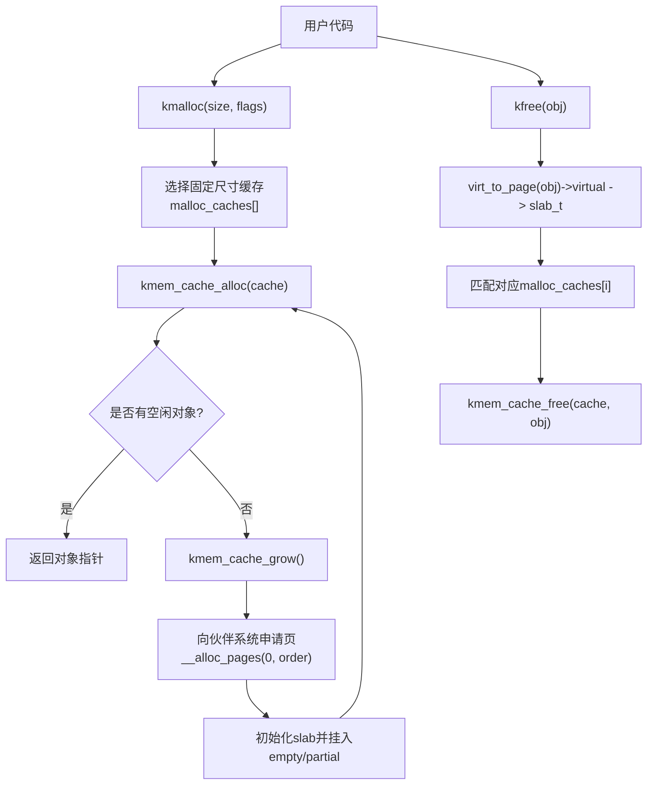
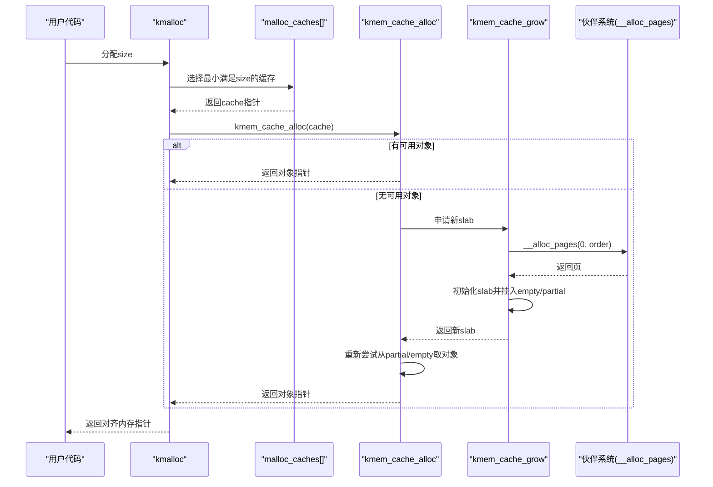
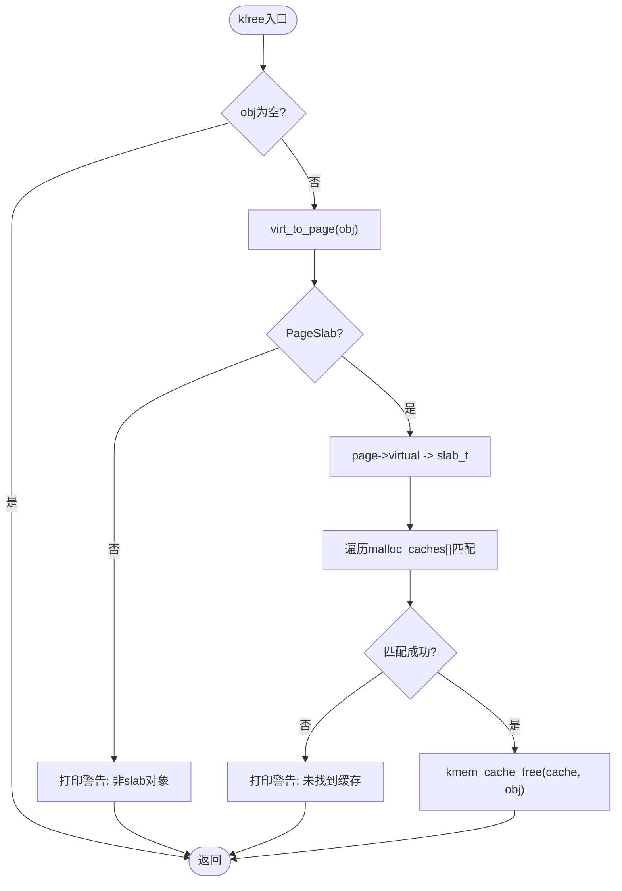
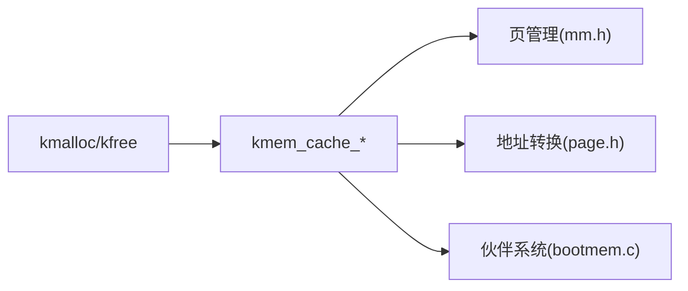

# kmalloc接口

<cite>
**本文引用的文件**
- [slab.c](file://kernel/mm/slab.c)
- [slab.h](file://includes/mm/slab.h)
- [mm.h](file://includes/mm/mm.h)
- [page.h](file://includes/arch/x86/page.h)
- [bootmem.c](file://kernel/mm/bootmem.c)
</cite>

## 目录
1. [简介](#简介)
2. [项目结构](#项目结构)
3. [核心组件](#核心组件)
4. [架构总览](#架构总览)
5. [详细组件分析](#详细组件分析)
6. [依赖关系分析](#依赖关系分析)
7. [性能考虑](#性能考虑)
8. [故障排查指南](#故障排查指南)
9. [结论](#结论)
10. [附录：使用示例与最佳实践](#附录：使用示例与最佳实践)

## 简介
本文件面向LulaOS内核中基于Slab的通用内存分配接口kmalloc/kfree，系统性说明其设计目标、选择策略、释放流程、错误处理以及与底层kmem_cache_alloc的映射关系。文档同时解释GFP标志参数的预留设计与未来扩展计划，并提供使用示例、性能注意事项与常见问题解决方案，帮助开发者正确、高效地使用内存分配接口。

## 项目结构
与kmalloc/kfree直接相关的代码位于内存管理子系统：
- 实现文件：kernel/mm/slab.c（包含kmem_cache_init、kmem_cache_create/alloc/free、kmalloc/kfree）
- 头文件：includes/mm/slab.h（定义缓存描述符、常量、API声明）
- 页管理相关：includes/mm/mm.h（页结构体、PageSlab等宏）、includes/arch/x86/page.h（virt_to_page等）
- 伙伴系统/引导期内存：kernel/mm/bootmem.c（提供__alloc_pages/__free_pages等底层能力）

图表来源
- [slab.c:518-540](file://kernel/mm/slab.c#L518-L540)
- [slab.c:392-450](file://kernel/mm/slab.c#L392-L450)
- [slab.c:130-199](file://kernel/mm/slab.c#L130-L199)
- [slab.c:551-584](file://kernel/mm/slab.c#L551-L584)

章节来源
- [slab.c:249-296](file://kernel/mm/slab.c#L249-L296)
- [slab.h:121-144](file://includes/mm/slab.h#L121-L144)

## 核心组件
- 固定尺寸缓存池：维护9个常用大小（32/64/128/256/512/1024/2048/4096/8192字节），由kmem_cache_init在启动时创建，供kmalloc/kfree快速命中。
- Slab缓存描述符：kmem_cache_t管理一组相同大小对象的分配/释放，维护partial/full/empty三条链表以及统计信息。
- Slab页描述符：slab_t嵌入在每块slab页中，记录对象起始地址、已用计数、空闲链表头索引。
- 通用分配器：kmalloc根据size选择最小满足的缓存；kfree通过页元数据反查slab并匹配缓存后释放。
- 伙伴系统对接：kmem_cache_grow通过__alloc_pages按阶数order申请连续页，构建slab并初始化空闲对象链表。

章节来源
- [slab.c:40-48](file://kernel/mm/slab.c#L40-L48)
- [slab.h:35-88](file://includes/mm/slab.h#L35-L88)
- [slab.c:130-199](file://kernel/mm/slab.c#L130-L199)
- [slab.c:392-502](file://kernel/mm/slab.c#L392-L502)

## 架构总览
kmalloc/kfree作为上层通用接口，屏蔽了具体缓存选择与slab细节，向下统一委托给kmem_cache_alloc/kmem_cache_free。kmem_cache层负责：
- 优先从partial或empty链表中获取对象，避免频繁访问伙伴系统
- 当无可用对象时，调用kmem_cache_grow申请新slab页并初始化
- 释放时将对象插入空闲链表，并根据inuse状态移动slab到full/partial/empty链表

图表来源
- [slab.c:518-540](file://kernel/mm/slab.c#L518-L540)
- [slab.c:392-450](file://kernel/mm/slab.c#L392-L450)
- [slab.c:130-199](file://kernel/mm/slab.c#L130-L199)

## 详细组件分析

### kmalloc：设计目标与9个固定尺寸缓存的选择策略
- 设计目标
  - 为内核模块和驱动提供统一的“小对象”分配入口，屏蔽缓存选择与slab细节
  - 通过固定尺寸缓存减少碎片、提高命中率、降低分配路径开销
  - 保证返回地址的对齐属性，尤其是8KB对齐用于线程栈等场景
- 9个固定尺寸缓存
  - 支持32/64/128/256/512/1024/2048/4096/8192字节
  - 选择策略：从小到大遍历，找到第一个size <= malloc_sizes[i]的缓存
  - 限制：MALLOC_MAX_SIZE=8192，超出范围直接拒绝并打印日志
- GFP标志参数
  - 当前未区分GFP_KERNEL/GFP_ATOMIC，仅做占位与类型兼容
  - 预留扩展点：可在后续版本中根据上下文决定是否允许睡眠、是否走原子路径

章节来源
- [slab.c:40-48](file://kernel/mm/slab.c#L40-L48)
- [slab.c:518-540](file://kernel/mm/slab.c#L518-L540)
- [slab.h:90-94](file://includes/mm/slab.h#L90-L94)

### kfree：释放流程、对象验证、缓存匹配与错误处理
- 释放流程
  - 空指针安全：若obj为空直接返回
  - 对象验证：通过virt_to_page(obj)获取页描述符，检查PageSlab标记，非slab对象直接返回并打印警告
  - 反查slab：page->virtual指向slab_t，计算对象相对s_mem偏移，判断是否为aligned_size整数倍且索引有效
  - 匹配缓存：遍历malloc_caches[]，找到匹配的缓存后调用kmem_cache_free
- 错误处理
  - 非slab对象：打印“不是slab对象”并返回
  - 找不到匹配缓存：打印“未在任意malloc_cache中找到”并返回
  - 正常释放：将对象插入空闲链表头部，更新inuse并按需移动slab到empty/partial

图表来源
- [slab.c:551-584](file://kernel/mm/slab.c#L551-L584)
- [slab.c:459-502](file://kernel/mm/slab.c#L459-L502)

章节来源
- [slab.c:551-584](file://kernel/mm/slab.c#L551-L584)
- [slab.c:459-502](file://kernel/mm/slab.c#L459-L502)

### 与底层kmem_cache_alloc的映射关系及通用接口的必要性
- 映射关系
  - kmalloc不直接操作伙伴系统，而是委托kmem_cache_alloc完成实际分配
  - kmem_cache_alloc内部维护partial/empty/full链表，必要时调用kmem_cache_grow向伙伴系统申请新slab
- 为什么需要通用接口
  - 简化内核开发：调用方无需关心缓存选择、slab布局与对齐细节
  - 提升可维护性：统一入口便于审计、统计与优化
  - 增强一致性：所有小对象分配遵循相同语义与约束

章节来源
- [slab.c:518-540](file://kernel/mm/slab.c#L518-L540)
- [slab.c:392-450](file://kernel/mm/slab.c#L392-L450)

### OFF_SLAB机制与8KB对齐保障
- 当对象大小达到一定阈值（>= PAGE_SIZE/8）且slab子系统已初始化时，启用OFF_SLAB
- OFF_SLAB下，slab描述符独立分配（来自slabp_cache，如kmalloc-32），slab页全部用于对象，s_mem=页基址，保证8KB对齐
- 该设计确保THREAD_SIZE(8KB)对齐需求，使current宏等依赖esp屏蔽的代码正常工作

章节来源
- [slab.c:144-175](file://kernel/mm/slab.c#L144-L175)
- [slab.c:279-295](file://kernel/mm/slab.c#L279-L295)
- [slab.h:23-31](file://includes/mm/slab.h#L23-L31)

## 依赖关系分析
kmalloc/kfree依赖以下子系统与接口：
- 页管理与标志：includes/mm/mm.h（page结构、PageSlab等）
- 地址转换：includes/arch/x86/page.h（virt_to_page等）
- 伙伴系统：kernel/mm/bootmem.c（__alloc_pages/__free_pages）
- 自旋锁与链表：libs/list.h、arch/x86/spinlock.h（隐含依赖）

图表来源
- [slab.c:518-584](file://kernel/mm/slab.c#L518-L584)
- [mm.h:11-66](file://includes/mm/mm.h#L11-L66)
- [page.h:40-43](file://includes/arch/x86/page.h#L40-L43)
- [bootmem.c:194-223](file://kernel/mm/bootmem.c#L194-L223)

章节来源
- [slab.c:518-584](file://kernel/mm/slab.c#L518-L584)
- [mm.h:11-66](file://includes/mm/mm.h#L11-L66)
- [page.h:40-43](file://includes/arch/x86/page.h#L40-L43)
- [bootmem.c:194-223](file://kernel/mm/bootmem.c#L194-L223)

## 性能考虑
- 分配路径优化
  - 优先从partial/empty链表取对象，避免频繁进入伙伴系统
  - 固定尺寸缓存减少碎片，提高命中率
- 释放路径优化
  - 通过页元数据快速反查slab，避免全局扫描
  - 仅在必要时移动slab到full/partial/empty链表
- 对齐与缓存友好
  - 8KB对齐保障线程栈等关键路径的性能与正确性
  - 对象内嵌空闲链表索引，减少额外数据结构开销
- 可扩展性
  - 预留GFP标志位，便于未来区分原子/睡眠上下文
  - 可考虑在对象头部嵌入缓存指针以加速kfree匹配（当前为线性扫描）

[本节为通用性能讨论，不直接分析具体文件]

## 故障排查指南
- 常见错误与定位
  - “无效size”：kmalloc传入size=0或>MALLOC_MAX_SIZE，检查调用方逻辑
  - “缓存未初始化”：malloc_caches[i]为空，确认kmem_cache_init已执行
  - “非slab对象”：kfree传入非kmalloc分配的指针，检查生命周期与配对
  - “未找到缓存”：对象不在任何malloc_caches范围内，可能越界或重复释放
- 调试建议
  - 关注内核日志中的[SLAB]前缀输出，定位问题阶段
  - 结合virt_to_page与page->virtual检查对象归属
  - 对高频分配路径进行采样，评估缓存命中率与增长频率

章节来源
- [slab.c:518-540](file://kernel/mm/slab.c#L518-L540)
- [slab.c:551-584](file://kernel/mm/slab.c#L551-L584)

## 结论
kmalloc/kfree为LulaOS提供了简洁、一致的小对象分配接口，依托9个固定尺寸缓存与Slab机制，显著降低了分配复杂度与碎片风险。通过页元数据反查与缓存匹配，kfree实现了安全的释放流程。GFP标志预留为未来上下文感知分配奠定基础。整体设计兼顾性能与可维护性，适合内核各子系统广泛使用。

[本节为总结性内容，不直接分析具体文件]

## 附录：使用示例与最佳实践
- 基本用法
  - 分配：ptr = kmalloc(size, GFP_KERNEL); 若ptr为空，处理失败分支
  - 释放：kfree(ptr); 之后置空指针避免悬垂引用
- 尺寸选择
  - 尽量接近实际需求，避免过大导致浪费或过小导致跨缓存碎片
  - 注意MALLOC_MAX_SIZE=8192的限制，超过应改用其他分配方式
- 对齐要求
  - 对于需要8KB对齐的场景（如线程栈），kmalloc-8192可满足
- 并发与上下文
  - 当前kmalloc不区分GFP标志，后续可依据上下文调整行为
  - 在高并发路径上，关注缓存命中率与slab增长频率
- 常见问题
  - 重复释放：确保每个kmalloc仅kfree一次
  - 越界访问：严格校验size与边界，避免破坏slab元数据
  - 初始化顺序：确保kmem_cache_init在mm_init之后执行

[本节为概念性指导，不直接分析具体文件]