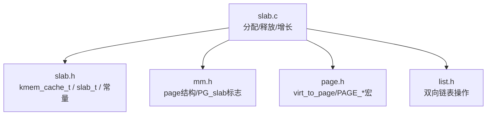
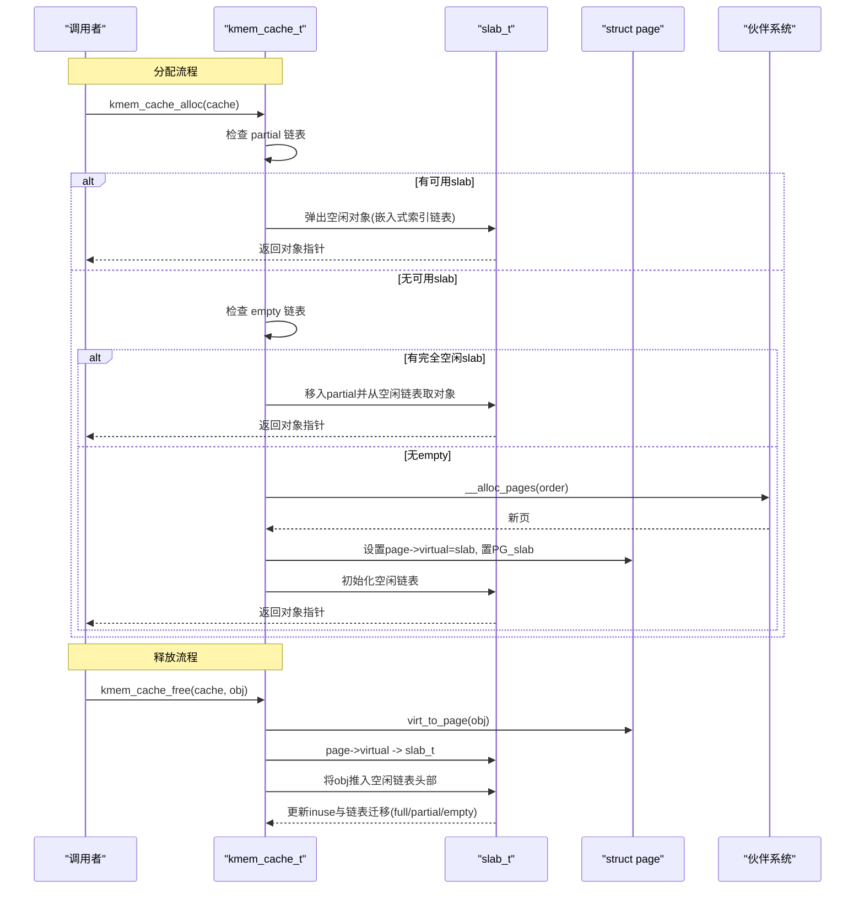
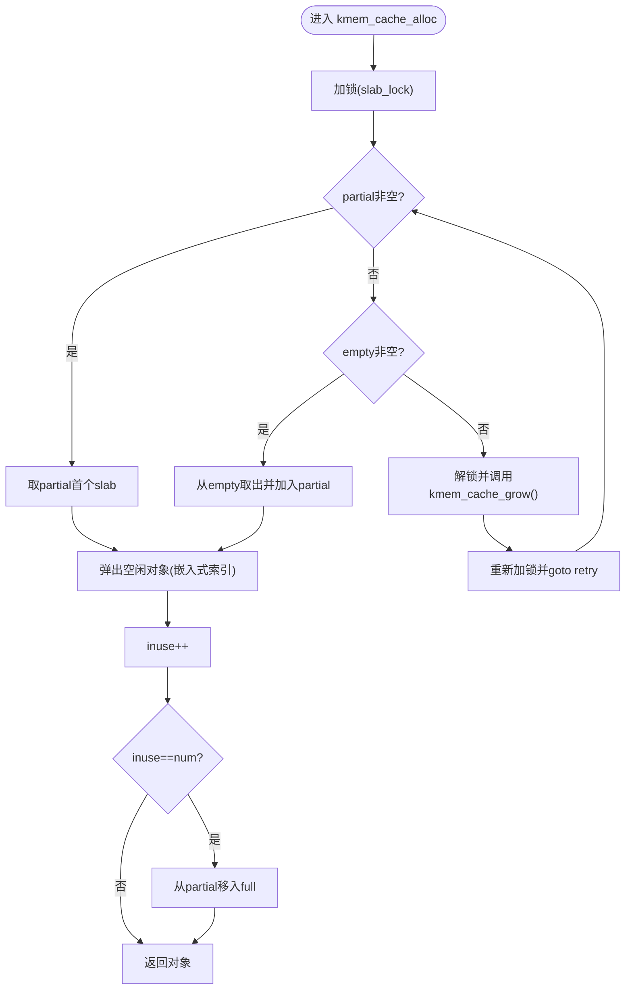
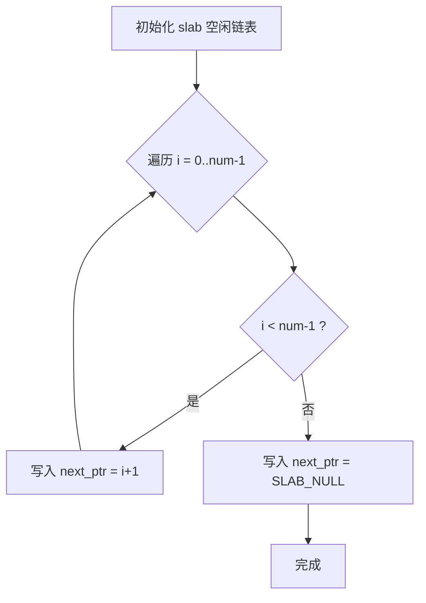
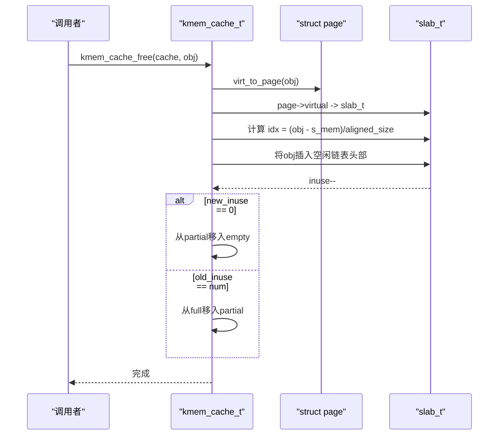
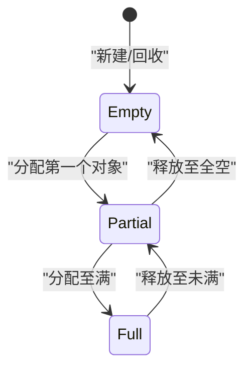
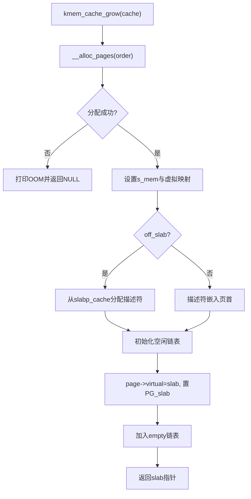
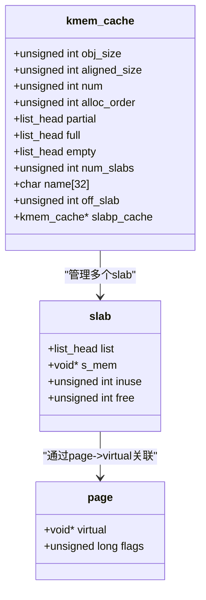
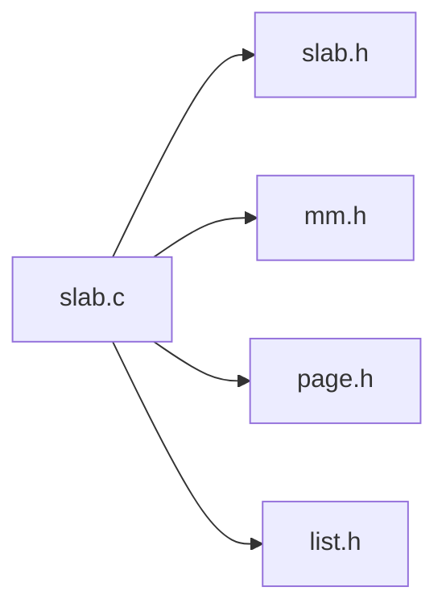

# 对象分配与释放

<cite>
**本文引用的文件**
- [slab.c](file://kernel/mm/slab.c)
- [slab.h](file://includes/mm/slab.h)
- [mm.h](file://includes/mm/mm.h)
- [page.h](file://includes/arch/x86/page.h)
- [list.h](file://includes/libs/list.h)
</cite>

## 目录
1. [简介](#简介)
2. [项目结构](#项目结构)
3. [核心组件](#核心组件)
4. [架构总览](#架构总览)
5. [详细组件分析](#详细组件分析)
6. [依赖关系分析](#依赖关系分析)
7. [性能考虑](#性能考虑)
8. [故障排查指南](#故障排查指南)
9. [结论](#结论)

## 简介
本文档聚焦于LulaOS中Slab分配器的对象分配与释放机制，重点解释：
- kmem_cache_alloc()的三级查找策略：partial链表优先、empty链表次之、动态增长（向伙伴系统申请新slab页）。
- 空闲对象链表的实现：嵌入式索引链表设计与SLAB_NULL终止标记。
- kmem_cache_free()的反查机制：通过virt_to_page()与page->virtual指针定位slab描述符。
- slab状态转换逻辑：full→partial→empty的链表迁移规则。
- 性能调优建议与常见问题诊断方法。

## 项目结构
本主题涉及的代码主要位于内核内存管理子系统：
- 核心实现：kernel/mm/slab.c
- 接口与数据结构定义：includes/mm/slab.h
- 页管理与标志位：includes/mm/mm.h
- 地址/页操作宏：includes/arch/x86/page.h
- 双向链表工具：includes/libs/list.h

**图表来源**
- [slab.c:1-585](file://kernel/mm/slab.c#L1-L585)
- [slab.h:1-147](file://includes/mm/slab.h#L1-L147)
- [mm.h:1-98](file://includes/mm/mm.h#L1-L98)
- [page.h:1-47](file://includes/arch/x86/page.h#L1-L47)
- [list.h:1-107](file://includes/libs/list.h#L1-L107)

**章节来源**
- [slab.c:1-585](file://kernel/mm/slab.c#L1-L585)
- [slab.h:1-147](file://includes/mm/slab.h#L1-L147)

## 核心组件
- kmem_cache_t：对象缓存描述符，维护对象尺寸、对齐、每slab对象数、页面阶数以及三条链表（partial/full/empty）等。
- slab_t：单个slab页的描述符，记录对象区起始地址、已用计数、空闲链表头索引。
- 全局静态池cache_pool[]：避免“鸡生蛋”问题，预分配若干缓存描述符。
- 通用大小缓存malloc_caches[]：为kmalloc/kfree提供固定尺寸的缓存集合。
- 自旋锁slab_lock：保护slab链表操作的并发安全。

关键职责划分：
- 创建缓存：kmem_cache_create()负责参数校验、计算布局、初始化链表并注册到全局列表。
- 分配对象：kmem_cache_alloc()执行三级查找并返回对象。
- 释放对象：kmem_cache_free()反查slab并将对象推回空闲链表，更新slab所在链表。
- 增长/销毁：kmem_cache_grow()/kmem_slab_destroy()负责从伙伴系统获取或归还页面。

**章节来源**
- [slab.h:35-88](file://includes/mm/slab.h#L35-L88)
- [slab.c:10-47](file://kernel/mm/slab.c#L10-L47)
- [slab.c:249-384](file://kernel/mm/slab.c#L249-L384)

## 架构总览
下图展示了Slab分配器在分配与释放过程中的关键交互：

**图表来源**
- [slab.c:392-450](file://kernel/mm/slab.c#L392-L450)
- [slab.c:459-502](file://kernel/mm/slab.c#L459-L502)
- [slab.c:130-199](file://kernel/mm/slab.c#L130-L199)
- [page.h:42](file://includes/arch/x86/page.h#L42)
- [mm.h:64-66](file://includes/mm/mm.h#L64-L66)

## 详细组件分析

### 分配算法：kmem_cache_alloc()
- 优先级顺序：
  - 首先尝试从partial链表取一个已有部分对象的slab；
  - 若partial为空，则从empty链表取一个完全空闲的slab，将其移入partial后再分配；
  - 若两者皆空，释放锁后调用kmem_cache_grow()向伙伴系统申请新slab页，再重试。
- 并发安全：使用自旋锁保护链表访问；在unlock→lock窗口期间可能已被其他CPU消耗，因此重新进入查找。
- 分配细节：
  - 从slab的空闲链表弹出一个对象（嵌入式索引），推进空闲头；
  - inuse加一；若inuse等于num，将slab从partial移入full。

**图表来源**
- [slab.c:392-450](file://kernel/mm/slab.c#L392-L450)
- [slab.c:130-199](file://kernel/mm/slab.c#L130-L199)

**章节来源**
- [slab.c:392-450](file://kernel/mm/slab.c#L392-L450)

### 空闲对象链表：嵌入式索引与SLAB_NULL
- 设计要点：
  - 每个空闲对象的前sizeof(unsigned int)字节存储下一个空闲对象的索引；
  - 最后一个对象存储SLAB_NULL作为链表结束标记；
  - 初始化时按顺序链接所有对象，形成obj0[→1] → obj1[→2] → ... → objN-1[→SLAB_NULL]。
- 复杂度：
  - 分配/释放均为O(1)：直接读写空闲链表头与对象内嵌索引。
- 优势：
  - 无需额外节点结构，节省内存；
  - 缓存局部性好，减少指针跳转。

**图表来源**
- [slab.c:104-114](file://kernel/mm/slab.c#L104-L114)
- [slab.h:14-18](file://includes/mm/slab.h#L14-L18)

**章节来源**
- [slab.c:104-114](file://kernel/mm/slab.c#L104-L114)
- [slab.h:14-18](file://includes/mm/slab.h#L14-L18)

### 释放流程：kmem_cache_free()与反查机制
- 反查路径：
  - 通过virt_to_page(obj)得到page；
  - 读取page->virtual得到slab_t指针；
  - 根据s_mem与aligned_size计算对象索引idx。
- 释放动作：
  - 将obj推入slab的空闲链表头部（next=obj->next, free=idx）；
  - inuse减一；
  - 根据old_inuse与new_inuse进行链表迁移：
    - full→partial：当old_inuse==num时；
    - partial→empty：当new_inuse==0时。
- 并发安全：同样受自旋锁保护。

**图表来源**
- [slab.c:459-502](file://kernel/mm/slab.c#L459-L502)
- [page.h:42](file://includes/arch/x86/page.h#L42)

**章节来源**
- [slab.c:459-502](file://kernel/mm/slab.c#L459-L502)

### slab状态转换与链表迁移规则
- 三种链表：
  - partial：有空闲对象的slab；
  - full：所有对象均已分配的slab；
  - empty：完全空闲的slab（可回收）。
- 迁移规则：
  - 分配时：empty→partial（首次使用时），partial→full（满时）；
  - 释放时：full→partial（释放最后一个对象前一次），partial→empty（全空时）。
- 实现要点：
  - 使用inuse计数与old_inuse判断当前所在链表；
  - 通过list_del/list_add完成迁移。

**图表来源**
- [slab.c:441-445](file://kernel/mm/slab.c#L441-L445)
- [slab.c:491-499](file://kernel/mm/slab.c#L491-L499)

**章节来源**
- [slab.c:441-445](file://kernel/mm/slab.c#L441-L445)
- [slab.c:491-499](file://kernel/mm/slab.c#L491-L499)

### 增长与销毁：kmem_cache_grow()与kmem_slab_destroy()
- 增长：
  - 根据cache->alloc_order向伙伴系统申请多页；
  - 若启用OFF_SLAB，slab描述符从slabp_cache独立分配，slab页全部用于对象；
  - 在page->virtual中保存slab指针，并置PG_slab标志；
  - 初始化空闲链表后将slab挂入empty链表。
- 销毁：
  - 从链表摘下，还原page->virtual并清除PG_slab；
  - 归还伙伴系统；
  - OFF_SLAB模式下还需释放描述符本身。

**图表来源**
- [slab.c:130-199](file://kernel/mm/slab.c#L130-L199)
- [slab.c:204-238](file://kernel/mm/slab.c#L204-L238)

**章节来源**
- [slab.c:130-199](file://kernel/mm/slab.c#L130-L199)
- [slab.c:204-238](file://kernel/mm/slab.c#L204-L238)

### 类图：核心数据结构关系

**图表来源**
- [slab.h:35-88](file://includes/mm/slab.h#L35-L88)
- [mm.h:11-18](file://includes/mm/mm.h#L11-L18)

**章节来源**
- [slab.h:35-88](file://includes/mm/slab.h#L35-L88)
- [mm.h:11-18](file://includes/mm/mm.h#L11-L18)

## 依赖关系分析
- slab.c依赖：
  - slab.h：定义kmem_cache_t、slab_t及常量；
  - mm.h：定义page结构与PG_slab标志；
  - page.h：提供virt_to_page与页相关宏；
  - list.h：提供双向链表操作；
  - 其他：printk、memcpy等基础库。
- 耦合点：
  - 通过page->virtual建立对象到slab的反查；
  - 通过PG_slab标志区分slab页与其他页；
  - 通过自旋锁保证并发安全。

**图表来源**
- [slab.c:1-7](file://kernel/mm/slab.c#L1-L7)
- [slab.h:1-10](file://includes/mm/slab.h#L1-L10)
- [mm.h:1-10](file://includes/mm/mm.h#L1-L10)
- [page.h:1-10](file://includes/arch/x86/page.h#L1-L10)
- [list.h:1-10](file://includes/libs/list.h#L1-L10)

**章节来源**
- [slab.c:1-7](file://kernel/mm/slab.c#L1-L7)

## 性能考虑
- 分配路径优化：
  - 优先从partial/empty获取，避免频繁调用伙伴系统；
  - 嵌入式空闲链表使分配/释放为O(1)。
- 内存局部性：
  - 同一缓存的对象连续存放，提高缓存命中率；
  - OFF_SLAB模式提升大对象场景的利用率。
- 并发控制：
  - 自旋锁粒度适中，减少临界区长度；
  - 在grow过程中释放锁以避免阻塞。
- 可能的瓶颈：
  - 高并发下自旋锁竞争；
  - 频繁增长/销毁导致伙伴系统压力。
- 调优建议：
  - 合理设置对象大小与对齐，减少碎片；
  - 对热点缓存预热（提前创建并填充少量对象）；
  - 监控num_slabs与链表长度，评估是否需要调整order或对象尺寸。

[本节为通用指导，不直接分析具体文件]

## 故障排查指南
- 常见错误与日志：
  - OOM：无法增长缓存或分配描述符失败，检查伙伴系统可用性与order设置；
  - 非法释放：kfree检测到非slab对象，检查是否误用或未正确匹配缓存；
  - 未找到对应缓存：kfree扫描malloc_caches[]未命中，确认对象来源与对齐。
- 调试手段：
  - 打印cache名、对象尺寸、num与order，验证布局计算；
  - 检查page->virtual与PG_slab标志是否正确设置；
  - 观察partial/full/empty链表长度变化，定位异常迁移。
- 定位步骤：
  - 分配失败：查看kmem_cache_grow返回值与日志；
  - 释放崩溃：确认virt_to_page与page->virtual有效；
  - 性能退化：统计链表长度与增长次数，评估缓存配置。

**章节来源**
- [slab.c:130-199](file://kernel/mm/slab.c#L130-L199)
- [slab.c:551-584](file://kernel/mm/slab.c#L551-L584)

## 结论
LulaOS的Slab分配器通过三级查找策略与嵌入式空闲链表实现了高效的对象分配与释放。其设计兼顾了内存利用率与性能：
- partial/empty优先减少伙伴系统调用；
- 嵌入式索引链表降低开销；
- 通过page->virtual与PG_slab标志实现可靠的反查；
- 明确的链表迁移规则确保状态一致性。
在实际使用中，应关注缓存配置、并发竞争与增长频率，结合日志与统计信息进行调优与排障。