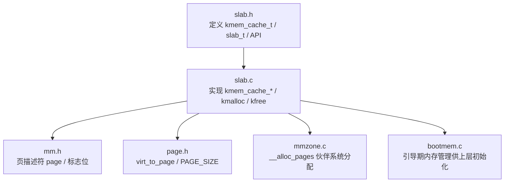
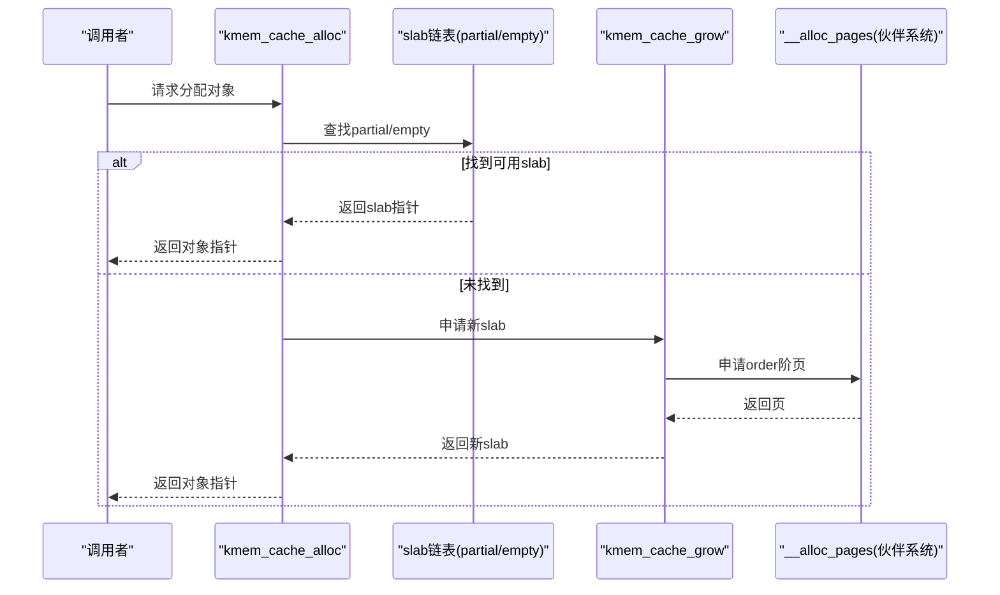
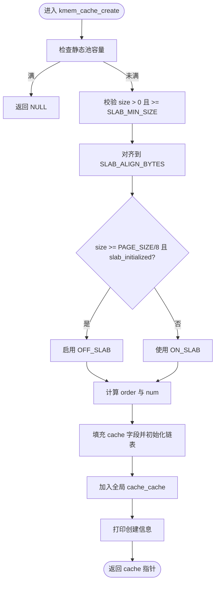
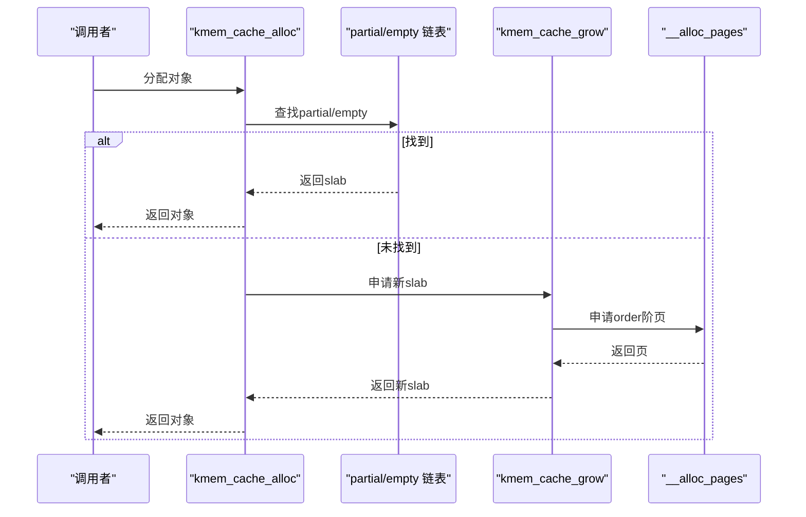
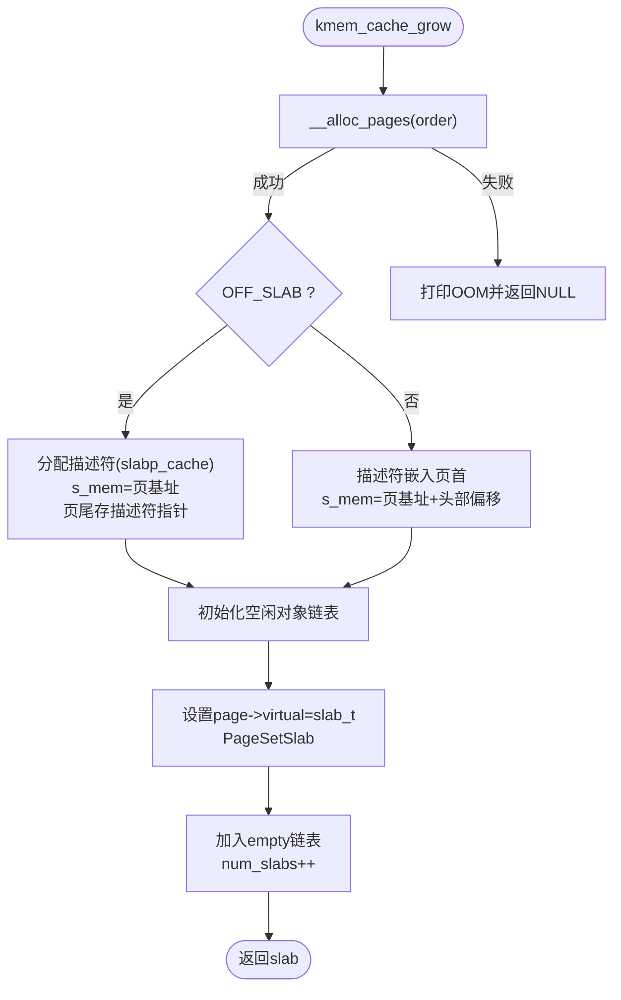
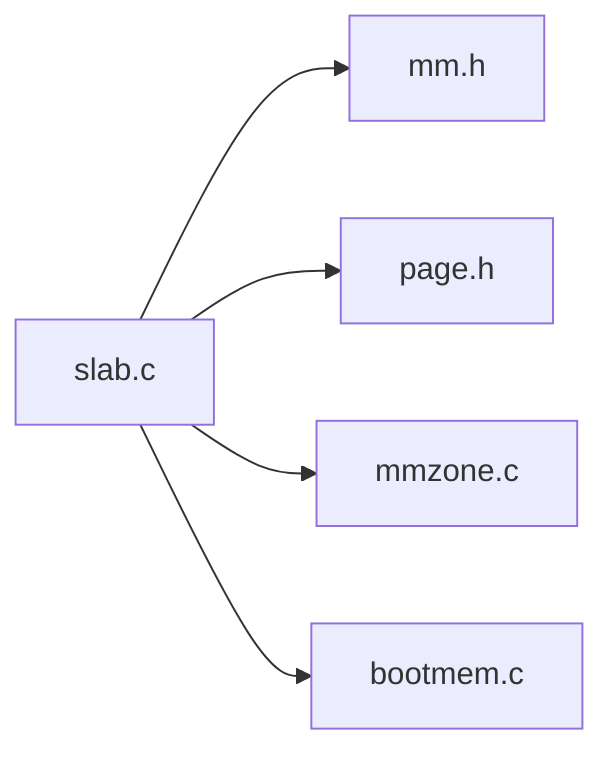

# 缓存管理

<cite>
**本文引用的文件**
- [slab.h](file://includes/mm/slab.h)
- [slab.c](file://kernel/mm/slab.c)
- [mm.h](file://includes/mm/mm.h)
- [page.h](file://includes/arch/x86/page.h)
- [mmzone.c](file://kernel/mm/mmzone.c)
- [bootmem.c](file://kernel/mm/bootmem.c)
</cite>

## 目录
1. [简介](#简介)
2. [项目结构](#项目结构)
3. [核心组件](#核心组件)
4. [架构总览](#架构总览)
5. [详细组件分析](#详细组件分析)
6. [依赖关系分析](#依赖关系分析)
7. [性能考量](#性能考量)
8. [故障排查指南](#故障排查指南)
9. [结论](#结论)
10. [附录](#附录)

## 简介
本文件为LulaOS Slab分配器的缓存管理系统提供系统化文档，重点围绕kmem_cache_t结构的设计理念与字段含义、缓存创建流程kmem_cache_create()的实现原理（静态池管理、参数校验、ON_SLAB/OFF_SLAB模式选择）、缓存生命周期管理（初始化、使用统计、销毁），以及通用缓存数组malloc_caches[]的9个固定尺寸设计。同时给出缓存配置优化建议与内存使用分析工具的使用说明。

## 项目结构
Slab子系统位于内核内存管理模块中，核心头文件与实现如下：
- 接口与数据结构定义：includes/mm/slab.h
- 实现逻辑：kernel/mm/slab.c
- 页管理与标志位：includes/mm/mm.h、includes/arch/x86/page.h
- 伙伴系统分配：kernel/mm/mmzone.c
- 引导期内存管理：kernel/mm/bootmem.c

图表来源
- [slab.h:58-88](file://includes/mm/slab.h#L58-L88)
- [slab.c:249-296](file://kernel/mm/slab.c#L249-L296)
- [mm.h:11-66](file://includes/mm/mm.h#L11-L66)
- [page.h:8-42](file://includes/arch/x86/page.h#L8-L42)
- [mmzone.c:275-329](file://kernel/mm/mmzone.c#L275-L329)

章节来源
- [slab.h:58-88](file://includes/mm/slab.h#L58-L88)
- [slab.c:249-296](file://kernel/mm/slab.c#L249-L296)
- [mm.h:11-66](file://includes/mm/mm.h#L11-L66)
- [page.h:8-42](file://includes/arch/x86/page.h#L8-L42)
- [mmzone.c:275-329](file://kernel/mm/mmzone.c#L275-L329)

## 核心组件
- kmem_cache_t：对象缓存的核心描述符，维护对象规格、slab链表、统计信息、名称及OFF_SLAB支持。
- slab_t：单个slab页的描述符，嵌入在页首或独立分配，维护对象区起始地址、已用计数和空闲链表头。
- 全局静态池cache_pool：避免“鸡生蛋”问题，预分配最多KMEM_CACHE_MAX个缓存描述符。
- 全局链表cache_cache：所有已创建缓存的登记链，便于调试/统计遍历。
- 自旋锁slab_lock：保护slab链表操作，保证SMP安全。
- 通用缓存数组malloc_caches[]：9个固定尺寸的kmalloc/kfree专用缓存。

章节来源
- [slab.h:58-88](file://includes/mm/slab.h#L58-L88)
- [slab.c:15-19](file://kernel/mm/slab.c#L15-L19)
- [slab.c:40-47](file://kernel/mm/slab.c#L40-L47)

## 架构总览
Slab子系统通过kmem_cache_t组织相同大小对象的分配与释放；每个缓存维护partial/full/empty三条slab链表，按需从伙伴系统申请新页并构建slab。通用分配器kmalloc/kfree基于malloc_caches[]进行快速匹配。

图表来源
- [slab.c:392-450](file://kernel/mm/slab.c#L392-L450)
- [slab.c:130-199](file://kernel/mm/slab.c#L130-L199)
- [mmzone.c:275-329](file://kernel/mm/mmzone.c#L275-L329)

## 详细组件分析

### kmem_cache_t 设计理念与字段含义
- 对象规格
  - obj_size：用户请求的原始对象大小
  - aligned_size：对齐后的实际存储大小（按SLAB_ALIGN_BYTES对齐）
  - num：每个slab页容纳的对象数
  - alloc_order：向伙伴系统申请的页面阶数（决定每slab占用多少页）
- slab链表
  - partial：有空闲对象的slab
  - full：全满的slab
  - empty：全空的slab（可回收）
- 统计
  - num_slabs：当前已分配的slab页数
- 全局缓存链
  - list：链入全局cache_cache，便于遍历
- 名称
  - name：用于调试输出
- OFF_SLAB支持
  - off_slab：1表示描述符在slab页外，由slabp_cache独立分配
  - slabp_cache：描述符来源缓存（off_slab=1时有效）

章节来源
- [slab.h:58-88](file://includes/mm/slab.h#L58-L88)

### 缓存创建流程 kmem_cache_create()
- 静态池管理
  - 从cache_pool取出一个描述符，若池满则失败
- 参数校验
  - size必须>0；最小尺寸为SLAB_MIN_SIZE（至少容纳空闲链表索引）
  - 对齐到SLAB_ALIGN_BYTES（4字节）
- 计算num与order
  - calc_num_objs根据aligned_size与order计算每页对象数；若为0则提升order（最大至order=5）
- ON_SLAB/OFF_SLAB模式选择策略
  - 当size >= PAGE_SIZE/8且slab_initialized=1时启用OFF_SLAB
  - OFF_SLAB：描述符从slabp_cache独立分配，slab页100%用于对象，s_mem=页基址（保证8KB对齐）
  - ON_SLAB：描述符嵌入页首，s_mem=页基址+对齐后的头部偏移
- 初始化链表与名称
  - 初始化partial/full/empty链表
  - 拷贝name（截断至KMEM_CACHE_NAMELEN）
- 登记与日志
  - 加入全局cache_cache
  - 打印创建信息（obj/aligned/num/order）

图表来源
- [slab.c:304-384](file://kernel/mm/slab.c#L304-L384)
- [slab.c:71-93](file://kernel/mm/slab.c#L71-L93)

章节来源
- [slab.c:304-384](file://kernel/mm/slab.c#L304-L384)
- [slab.c:71-93](file://kernel/mm/slab.c#L71-L93)

### 分配与释放流程
- 分配 kmem_cache_alloc
  - 优先从partial取，其次从empty取；均无则调用kmem_cache_grow申请新slab
  - 弹出空闲链表头节点，更新inuse；若slab变满则移入full
- 释放 kmem_cache_free
  - 通过virt_to_page + page->virtual反查slab_t
  - 将对象推入空闲链表头部，更新inuse；根据状态移动slab所在链表（full→partial，partial→empty）

图表来源
- [slab.c:392-450](file://kernel/mm/slab.c#L392-L450)
- [slab.c:130-199](file://kernel/mm/slab.c#L130-L199)
- [mmzone.c:275-329](file://kernel/mm/mmzone.c#L275-L329)

章节来源
- [slab.c:392-450](file://kernel/mm/slab.c#L392-L450)
- [slab.c:459-502](file://kernel/mm/slab.c#L459-L502)

### 增长与销毁
- 增长 kmem_cache_grow
  - 通过__alloc_pages申请order阶页
  - OFF_SLAB：从slabp_cache分配描述符，s_mem=页基址；在页尾保存描述符指针以便反查
  - ON_SLAB：描述符嵌入页首，s_mem=页基址+对齐后的头部偏移
  - 初始化空闲对象嵌入式链表，设置page->virtual指向slab_t，标记PageSetSlab
  - 挂入empty链表，num_slabs++
- 销毁 kmem_slab_destroy
  - 从链表摘下，num_slabs--
  - 还原page->virtual，清除PageSetSlab，归还伙伴系统
  - OFF_SLAB：描述符归还给slabp_cache

图表来源
- [slab.c:130-199](file://kernel/mm/slab.c#L130-L199)
- [slab.c:204-238](file://kernel/mm/slab.c#L204-L238)

章节来源
- [slab.c:130-199](file://kernel/mm/slab.c#L130-L199)
- [slab.c:204-238](file://kernel/mm/slab.c#L204-L238)

### 通用缓存数组 malloc_caches[] 与9个固定尺寸
- 目的：为kmalloc/kfree提供快速路径，避免每次分配都动态计算最佳缓存
- 尺寸序列：32/64/128/256/512/1024/2048/4096/8192字节
- 创建时机：kmem_cache_init末尾统一创建，并在slab_initialized置位后对大对象缓存启用OFF_SLAB（slabp_cache指向kmalloc-32）
- 特殊处理：对于size==8192（THREAD_SIZE）的缓存，使用order=1（2页）以保证8KB对齐，满足current宏需求

章节来源
- [slab.c:40-47](file://kernel/mm/slab.c#L40-L47)
- [slab.c:256-296](file://kernel/mm/slab.c#L256-L296)
- [slab.h:121-130](file://includes/mm/slab.h#L121-L130)

### 生命周期管理
- 初始化
  - kmem_cache_init：初始化全局链表、静态池计数、自旋锁；创建9个通用缓存；置位slab_initialized以允许后续缓存使用OFF_SLAB；对大对象缓存补设slabp_cache并重算num
- 使用统计
  - num_slabs：跟踪当前slab数量
  - 通过cache_cache链表可遍历所有缓存进行统计/调试
- 销毁
  - 当前实现未暴露显式销毁API；可通过kmem_slab_destroy内部函数释放单个slab页，但需确保对象全部释放后再调用

章节来源
- [slab.c:249-296](file://kernel/mm/slab.c#L249-L296)
- [slab.c:204-238](file://kernel/mm/slab.c#L204-L238)

## 依赖关系分析
- slab.c依赖
  - mm.h：page结构与PageSetSlab/PageClearSlab等标志位操作
  - page.h：virt_to_page、PAGE_SIZE等基础页操作
  - mmzone.c：__alloc_pages伙伴系统分配
  - bootmem.c：引导期内存管理（为上层初始化提供基础）
- 耦合与内聚
  - slab.c内聚了缓存创建、分配、释放、增长与销毁逻辑
  - 与伙伴系统的耦合点集中在kmem_cache_grow中的__alloc_pages调用
  - 与页管理的耦合点在于page->virtual的反查机制

图表来源
- [slab.c:1-7](file://kernel/mm/slab.c#L1-L7)
- [mm.h:11-66](file://includes/mm/mm.h#L11-L66)
- [page.h:8-42](file://includes/arch/x86/page.h#L8-L42)
- [mmzone.c:275-329](file://kernel/mm/mmzone.c#L275-L329)
- [bootmem.c:1-6](file://kernel/mm/bootmem.c#L1-L6)

章节来源
- [slab.c:1-7](file://kernel/mm/slab.c#L1-L7)
- [mm.h:11-66](file://includes/mm/mm.h#L11-L66)
- [page.h:8-42](file://includes/arch/x86/page.h#L8-L42)
- [mmzone.c:275-329](file://kernel/mm/mmzone.c#L275-L329)
- [bootmem.c:1-6](file://kernel/mm/bootmem.c#L1-L6)

## 性能考量
- 分配路径优化
  - 优先从partial/empty获取，减少伙伴系统调用
  - 关闭中断加锁（spin_lock_irqsave）降低竞争开销
- 对象布局优化
  - 对齐到4字节，减少碎片与访问成本
  - OFF_SLAB模式下整页用于对象，提高空间利用率与对齐质量（8KB对齐）
- 增长策略
  - 动态计算order，避免过小导致频繁增长
  - 限制最大order=5（32页=128KB），防止过大分配
- 通用缓存
  - 9个固定尺寸覆盖常见kmalloc场景，减少查找与对齐开销

[本节为一般性指导，不直接分析具体文件]

## 故障排查指南
- 常见问题
  - 缓存池耗尽：cache_pool_used达到KMEM_CACHE_MAX时无法创建新缓存
  - 对象过大：calc_num_objs始终返回0（超过最大order限制）
  - OOM：__alloc_pages失败，无法增长slab
  - 非slab对象释放：kfree检测到非slab页并拒绝释放
- 诊断方法
  - 查看printk输出定位错误位置
  - 遍历cache_cache链表统计各缓存的num_slabs与对象使用情况
  - 检查malloc_caches[]是否全部初始化成功

章节来源
- [slab.c:307-311](file://kernel/mm/slab.c#L307-L311)
- [slab.c:346-352](file://kernel/mm/slab.c#L346-L352)
- [slab.c:135-138](file://kernel/mm/slab.c#L135-L138)
- [slab.c:557-560](file://kernel/mm/slab.c#L557-L560)

## 结论
LulaOS的Slab缓存管理器通过kmem_cache_t与slab_t实现了高效的小对象分配与复用，结合ON_SLAB/OFF_SLAB模式与伙伴系统，兼顾了空间利用率与对齐要求。通用缓存数组malloc_caches[]为kmalloc/kfree提供了快速路径。建议在开发中合理选择对象大小与缓存粒度，关注num_slabs与分配失败日志，必要时调整order上限或引入更细粒度的缓存分类以提升性能。

[本节为总结性内容，不直接分析具体文件]

## 附录

### 缓存配置优化建议
- 对象大小对齐
  - 尽量使对象大小为4字节的倍数，避免额外填充
- 缓存粒度
  - 热点小对象建议使用较小缓存（如32/64/128），减少浪费
  - 大对象（>=512B）可依赖自动OFF_SLAB策略，获得更好的对齐与利用率
- 增长策略
  - 观察num_slabs增长频率，适当调高初始order以减少频繁分配
- 通用缓存
  - 遵循9个固定尺寸，避免绕过kmalloc直接使用底层分配

[本节为一般性指导，不直接分析具体文件]

### 内存使用分析工具使用方法
- 遍历全局缓存链表
  - 通过cache_cache遍历所有kmem_cache_t，统计num_slabs与名称
- 检查通用缓存
  - 遍历malloc_caches[]，确认初始化成功与num值
- 监控分配失败
  - 捕获printk中的警告与错误信息，定位OOM或参数非法

章节来源
- [slab.c:15-19](file://kernel/mm/slab.c#L15-L19)
- [slab.c:256-296](file://kernel/mm/slab.c#L256-L296)
- [slab.c:528-539](file://kernel/mm/slab.c#L528-L539)