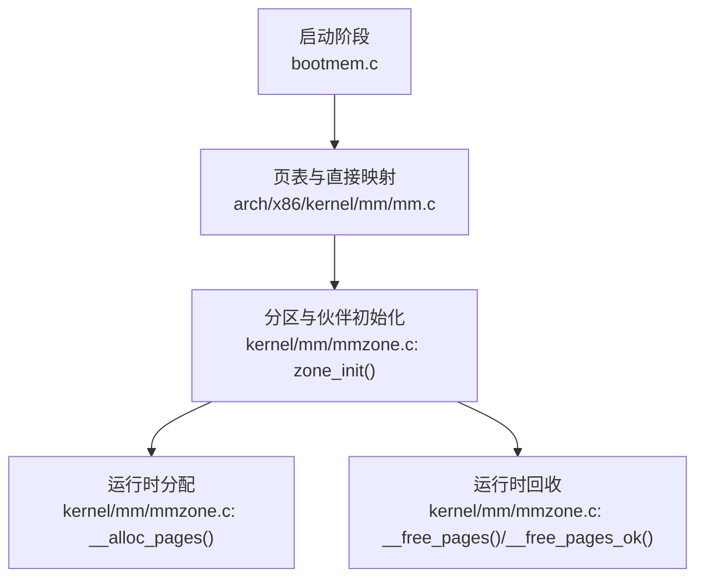
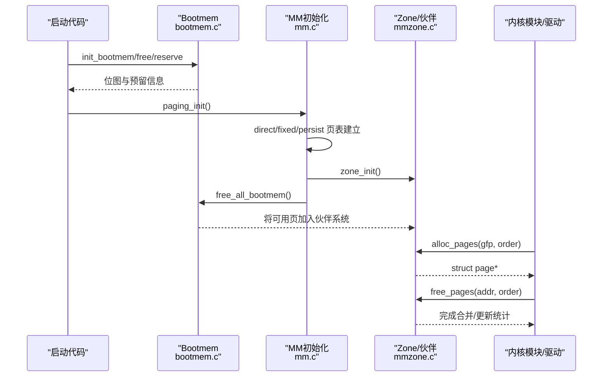
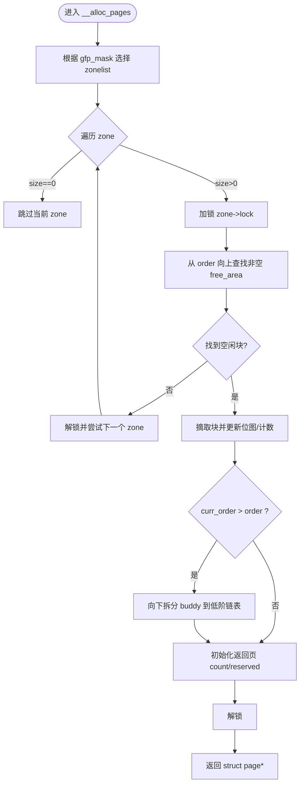
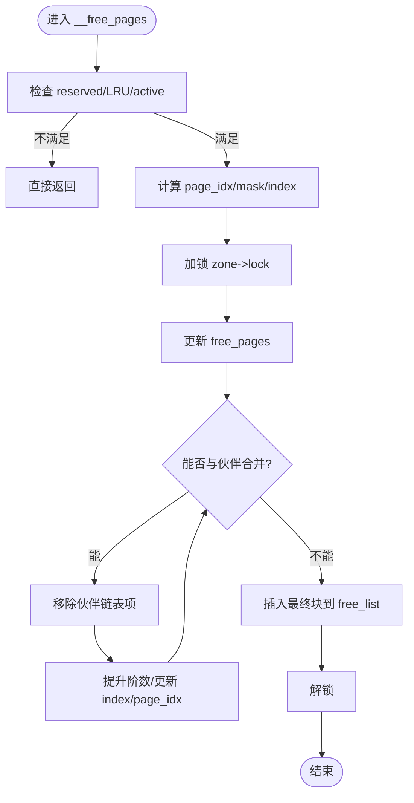
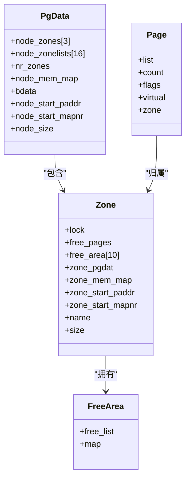
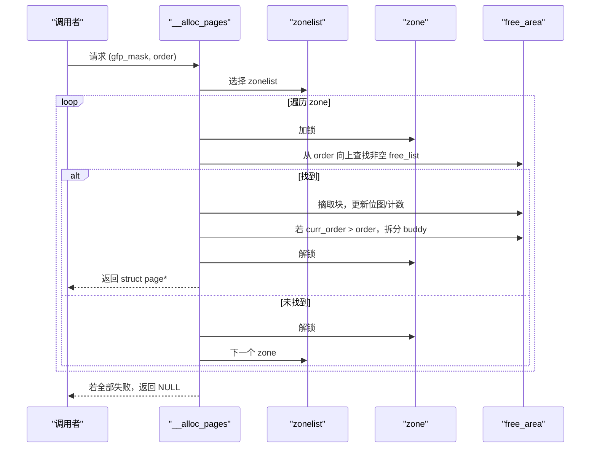
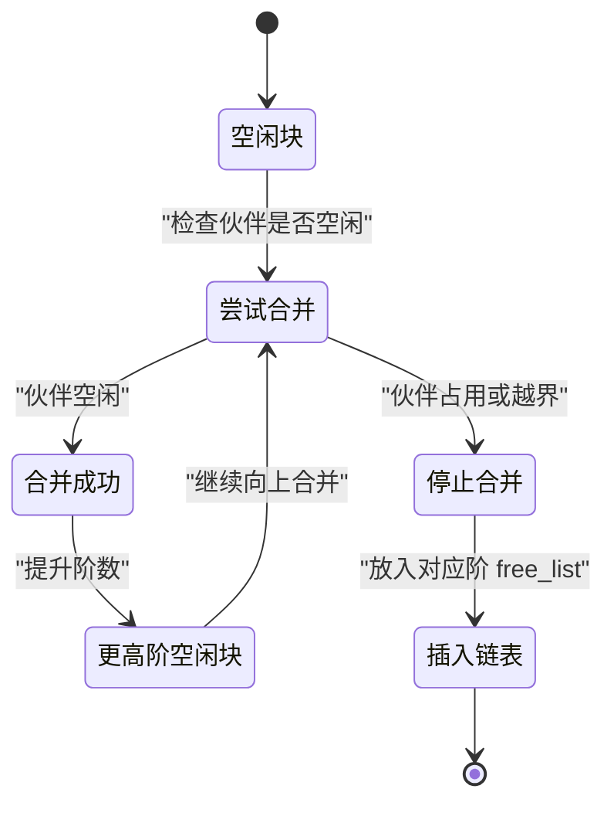

# 伙伴系统

<cite>
**本文引用的文件**
- [includes/mm/mmzone.h](file://includes/mm/mmzone.h)
- [kernel/mm/mmzone.c](file://kernel/mm/mmzone.c)
- [includes/mm/mm.h](file://includes/mm/mm.h)
- [includes/mm/bootmem.h](file://includes/mm/bootmem.h)
- [kernel/mm/bootmem.c](file://kernel/mm/bootmem.c)
- [arch/x86/kernel/mm/mm.c](file://arch/x86/kernel/mm/mm.c)
- [includes/arch/x86/page.h](file://includes/arch/x86/page.h)
</cite>

## 目录
1. [简介](#简介)
2. [项目结构](#项目结构)
3. [核心组件](#核心组件)
4. [架构总览](#架构总览)
5. [详细组件分析](#详细组件分析)
6. [依赖关系分析](#依赖关系分析)
7. [性能考虑](#性能考虑)
8. [故障排查指南](#故障排查指南)
9. [结论](#结论)
10. [附录](#附录)

## 简介
本文件为LulaOS的伙伴系统（Buddy System）提供全面文档，重点覆盖以下方面：
- 空闲页框管理器的设计思想与数据结构
- 页区域（page zone）的概念与管理方式，包括ZONE_DMA、ZONE_NORMAL、ZONE_HIGHMEM的划分
- 伙伴算法的实现细节：分配时的split与释放时的merge过程
- 页面分配器接口__alloc_page/__free_page的使用方法与性能特点
- 内存碎片化分析与优化建议
- 状态转换图与分配流程图，帮助开发者深入理解现代操作系统内存管理的核心算法

## 项目结构
LulaOS将内存子系统分为启动期分配器（bootmem）与运行时伙伴系统（buddy）。关键路径如下：
- 启动期：通过bootmem建立位图并保留/释放物理页，随后在mm_init中把可用页转入伙伴系统
- 运行时：zone_init初始化各zone及free_area数组；__alloc_pages按gfp_mask选择zonelist并在对应zone内查找合适阶的空闲块；__free_pages将页归还并按伙伴规则合并

图表来源
- [kernel/mm/bootmem.c:12-28](file://kernel/mm/bootmem.c#L12-L28)
- [arch/x86/kernel/mm/mm.c:117-134](file://arch/x86/kernel/mm/mm.c#L117-L134)
- [kernel/mm/mmzone.c:61-150](file://kernel/mm/mmzone.c#L61-L150)

章节来源
- [arch/x86/kernel/mm/mm.c:117-134](file://arch/x86/kernel/mm/mm.c#L117-L134)
- [kernel/mm/mmzone.c:61-150](file://kernel/mm/mmzone.c#L61-L150)
- [kernel/mm/bootmem.c:12-28](file://kernel/mm/bootmem.c#L12-L28)

## 核心组件
- 页描述符struct page：记录引用计数、标志位、虚拟地址、所属zone等
- 管理区zone_t：每个zone维护锁、空闲页计数、free_area[MAX_ORDER]（链表+位图）、起始物理地址、页面映射起点等
- 节点pg_data_t：包含多个zone、zonelist、node_mem_map、统计信息等
- 启动期分配器bootmem_data_t：位图、起止pfn、最近分配位置等

关键要点
- MAX_ORDER=10，表示最大阶为2^10个连续页
- ZONE_DMA < 16M，ZONE_NORMAL 16M~896M，ZONE_HIGHMEM > 896M
- free_area[i].map用于跟踪该阶空闲块的占用情况，最后一阶无位图
- 分配时从目标order向上查找首个非空free_list，再向下拆分（expand/split）
- 释放时尝试与伙伴合并（shrink/merge），直至无法合并或达到MAX_ORDER

章节来源
- [includes/mm/mm.h:11-18](file://includes/mm/mm.h#L11-L18)
- [includes/mm/mmzone.h:24-63](file://includes/mm/mmzone.h#L24-L63)
- [includes/mm/bootmem.h:12-19](file://includes/mm/bootmem.h#L12-L19)

## 架构总览
下图展示了从启动到运行时的内存管理流程，以及伙伴系统在其中的角色。

图表来源
- [arch/x86/kernel/mm/mm.c:117-134](file://arch/x86/kernel/mm/mm.c#L117-L134)
- [kernel/mm/mmzone.c:61-150](file://kernel/mm/mmzone.c#L61-L150)
- [kernel/mm/bootmem.c:194-223](file://kernel/mm/bootmem.c#L194-L223)

## 详细组件分析

### 页区域（Page Zones）与zonelist
- 三个区域：
  - ZONE_DMA：DMA设备可访问的低端内存（<16M）
  - ZONE_NORMAL：内核直接映射的常规内存（16M~896M）
  - ZONE_HIGHMEM：高端内存（>896M），需要特殊映射
- zonelist根据GFP标志位选择优先顺序，例如要求HIGHMEM或DMA时调整遍历顺序
- build_zonelists负责按gfp_mask填充zones指针数组并以NULL结尾

章节来源
- [includes/mm/mmzone.h:13-20](file://includes/mm/mmzone.h#L13-L20)
- [kernel/mm/mmzone.c:21-59](file://kernel/mm/mmzone.c#L21-L59)

### 伙伴系统数据结构
- free_area_t：包含free_list（同阶空闲块链表）和map（位图，标记该阶块是否空闲）
- zone_t：持有free_area[MAX_ORDER]、free_pages计数、锁、zone_mem_map、起始物理地址等
- pg_data_t：聚合node_zones、node_zonelists、node_mem_map等

复杂度与空间
- 每个zone维护MAX_ORDER个链表，位图大小随阶数增大而减小
- 分配/释放操作时间复杂度近似O(1)~O(MAX_ORDER)，取决于是否需要拆分或合并

章节来源
- [includes/mm/mmzone.h:24-63](file://includes/mm/mmzone.h#L24-L63)

### 分配流程：__alloc_pages
核心步骤
1. 根据gfp_mask选择zonelist
2. 遍历zonelist中的zone，从order开始向上查找首个非空的free_area
3. 摘取一个块，更新位图与free_pages计数
4. 若curr_order > order，执行split：将大块拆分为目标order，并将另一半（buddy）插入低阶free_list
5. 初始化返回页的count与reserved标志，返回struct page*

性能特点
- 查找与拆分均为常数级循环（最多MAX_ORDER次）
- 使用spinlock保护并发安全
- 位图操作减少重复扫描开销

图表来源
- [kernel/mm/mmzone.c:248-329](file://kernel/mm/mmzone.c#L248-L329)

章节来源
- [kernel/mm/mmzone.c:248-329](file://kernel/mm/mmzone.c#L248-L329)

### 释放流程：__free_pages 与 __free_pages_ok
核心步骤
1. 检查页是否可释放（非reserved、非LRU等）
2. 计算页索引与掩码，验证对齐性
3. 加锁后更新free_pages计数
4. 尝试与伙伴合并：当相邻伙伴空闲时，移除其链表项，提升阶数，继续向上合并
5. 将最终块插入对应阶的free_list头部

注意
- 合并过程中使用位图快速判断伙伴是否空闲
- 合并上限为MAX_ORDER，避免越界

图表来源
- [kernel/mm/mmzone.c:153-219](file://kernel/mm/mmzone.c#L153-L219)
- [kernel/mm/mmzone.c:221-246](file://kernel/mm/mmzone.c#L221-L246)

章节来源
- [kernel/mm/mmzone.c:153-219](file://kernel/mm/mmzone.c#L153-L219)
- [kernel/mm/mmzone.c:221-246](file://kernel/mm/mmzone.c#L221-L246)

### 启动期到伙伴系统的过渡：free_all_bootmem
- 遍历bootmem位图，将未保留页设置count=1并调用__free_page加入伙伴系统
- 释放bootmem位图自身页，同样加入伙伴系统
- 此步骤完成后，低端内存由伙伴系统统一管理

章节来源
- [kernel/mm/bootmem.c:194-223](file://kernel/mm/bootmem.c#L194-L223)

### 类关系图（数据结构）

图表来源
- [includes/mm/mm.h:11-18](file://includes/mm/mm.h#L11-L18)
- [includes/mm/mmzone.h:24-63](file://includes/mm/mmzone.h#L24-L63)

## 依赖关系分析
- mmzone.c依赖：
  - arch/x86/page.h：页大小、地址转换宏
  - arch/x86/pgtable.h：页表相关
  - arch/x86/highmem.h：高端内存支持
  - mm/bootmem.h：启动期分配器接口
  - libs/list.h：双向链表
  - arch/x86/bitops.h：位操作
  - arch/x86/spinlock.h：自旋锁
- bootmem.c依赖：
  - mm/mmzone.h：全局pg_data_t等
  - arch/x86/page.h：页操作
  - arch/x86/bitops.h：位操作
- mm.c依赖：
  - mm/bootmem.h：启动期分配器
  - arch/x86/page.h/pgtable.h：页表与地址
  - mm/mmzone.h：zone初始化入口

耦合与内聚
- 模块边界清晰：bootmem仅负责启动期位图与分配；mmzone实现运行时伙伴系统；mm.c协调页表与初始化流程
- 潜在风险：对全局变量（如mem_map、contig_page_data）的直接访问需保证初始化顺序正确

章节来源
- [kernel/mm/mmzone.c:1-13](file://kernel/mm/mmzone.c#L1-L13)
- [kernel/mm/bootmem.c:1-7](file://kernel/mm/bootmem.c#L1-L7)
- [arch/x86/kernel/mm/mm.c:1-9](file://arch/x86/kernel/mm/mm.c#L1-L9)

## 性能考虑
- 分配性能：
  - 查找free_area为O(MAX_ORDER)，通常很小（MAX_ORDER=10）
  - split操作为O(MAX_ORDER-order)，平均开销低
  - 位图操作避免重复扫描，提高命中率
- 释放性能：
  - 合并过程最多向上合并MAX_ORDER次
  - 位图快速判定伙伴空闲，减少链表遍历
- 碎片化分析：
  - 频繁不同阶分配易导致外部碎片，表现为高阶free_list为空但低阶碎片较多
  - 建议：尽量按需求order分配，避免过度小对象分配；批量分配可降低碎片
- 优化建议：
  - 合理设置GFP标志，避免跨zone盲目搜索
  - 在高负载下监控各zone的free_pages与高阶空闲率，必要时引入后台回收或迁移策略
  - 对高频分配模式进行池化（slab/kmalloc层）以减少底层分配次数

## 故障排查指南
常见问题与定位
- 分配失败：
  - 现象：__alloc_pages返回NULL并打印错误
  - 可能原因：所有zone均无足够连续块；gfp_mask限制过严
  - 排查：检查各zone的free_pages与各阶free_list是否为空
- 释放无效：
  - 现象：页未被回收或合并
  - 可能原因：页仍被锁定或在LRU链表中；页索引未对齐当前order
  - 排查：确认PageLocked/PageLRU/PageActive标志；验证order与页对齐

参考实现位置
- 分配失败处理与日志输出
- 释放前条件检查与合并逻辑

章节来源
- [kernel/mm/mmzone.c:248-329](file://kernel/mm/mmzone.c#L248-L329)
- [kernel/mm/mmzone.c:153-219](file://kernel/mm/mmzone.c#L153-L219)

## 结论
LulaOS的伙伴系统以zone为粒度组织空闲块，通过free_area链表与位图实现高效分配与合并。启动期由bootmem管理位图，随后将可用页移交伙伴系统。运行时__alloc_pages与__free_pages分别实现split与merge，配合spinlock保证并发安全。针对碎片化问题，可通过合理的分配策略与监控手段缓解。整体设计简洁且可扩展，适合教学与轻量级内核场景。

## 附录

### 分配流程图（代码级）

图表来源
- [kernel/mm/mmzone.c:248-329](file://kernel/mm/mmzone.c#L248-L329)

### 状态转换图（释放合并）

图表来源
- [kernel/mm/mmzone.c:153-219](file://kernel/mm/mmzone.c#L153-L219)