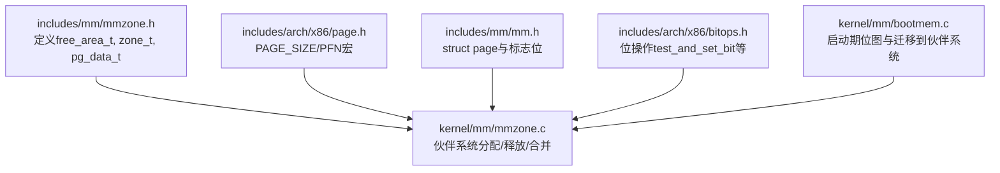
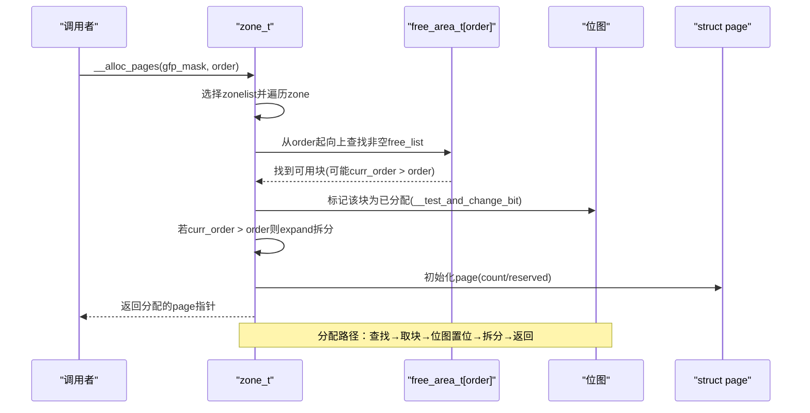
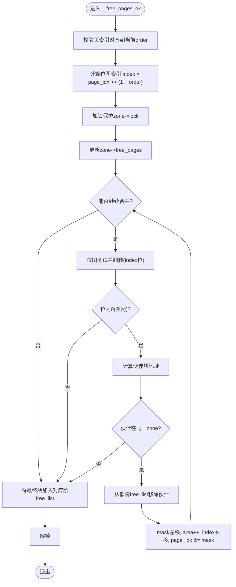
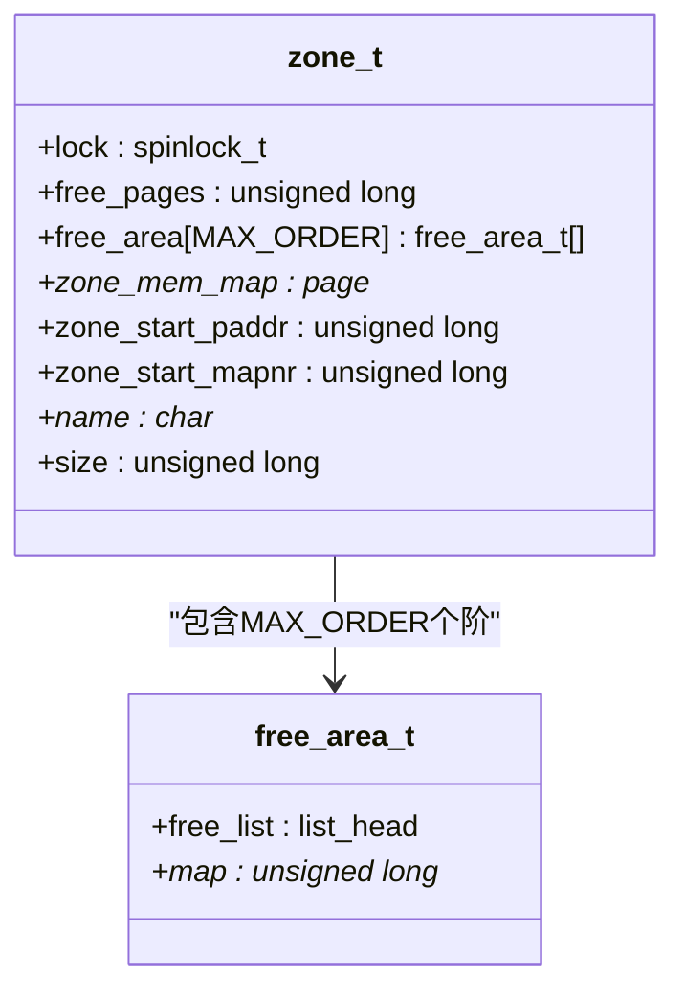
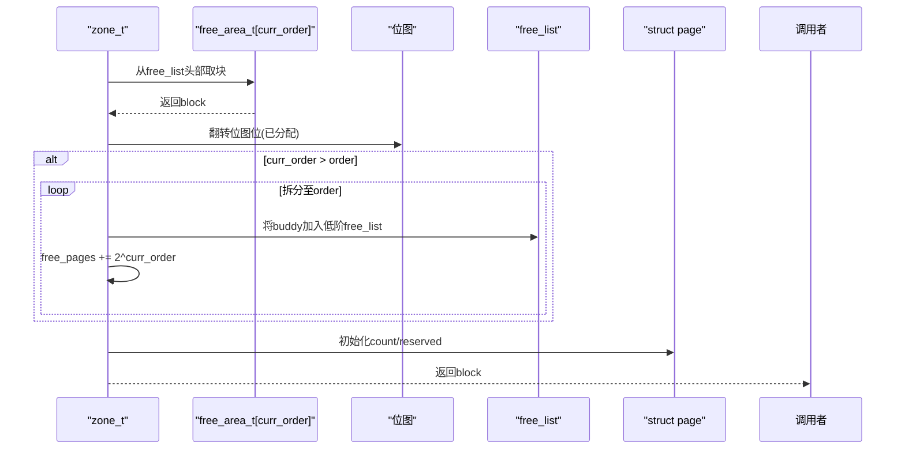
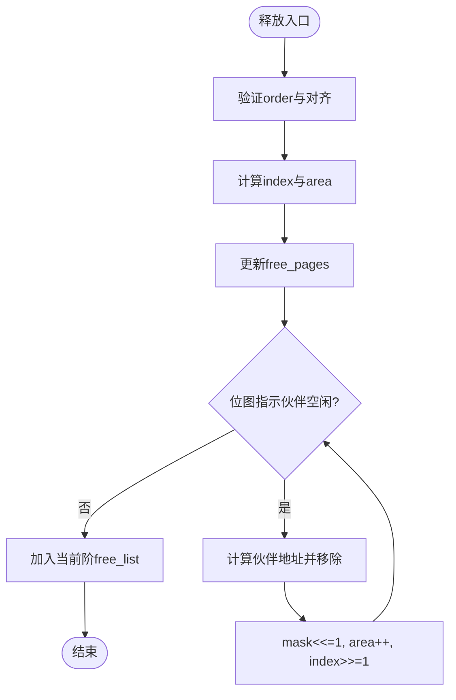
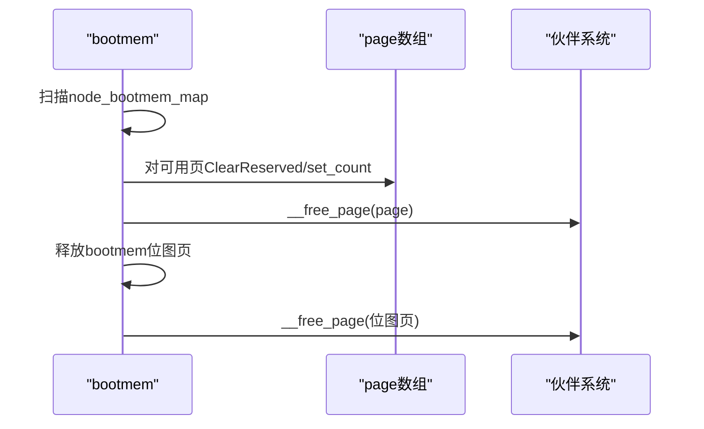
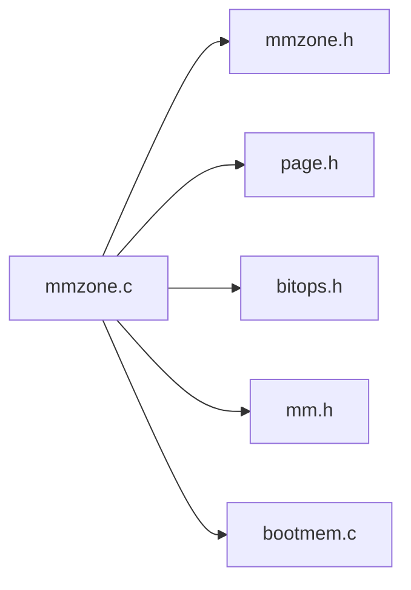

# 空闲区域管理

<cite>
**本文引用的文件**
- [mmzone.h](file://includes/mm/mmzone.h)
- [mmzone.c](file://kernel/mm/mmzone.c)
- [page.h](file://includes/arch/x86/page.h)
- [bootmem.c](file://kernel/mm/bootmem.c)
- [mm.h](file://includes/mm/mm.h)
- [bitops.h](file://includes/arch/x86/bitops.h)
</cite>

## 目录
1. [简介](#简介)
2. [项目结构](#项目结构)
3. [核心组件](#核心组件)
4. [架构总览](#架构总览)
5. [详细组件分析](#详细组件分析)
6. [依赖关系分析](#依赖关系分析)
7. [性能考量](#性能考量)
8. [故障排查指南](#故障排查指南)
9. [结论](#结论)
10. [附录](#附录)

## 简介
本文件面向LulaOS的伙伴系统（Buddy System）空闲区域管理，围绕free_area_t结构体、MAX_ORDER常量、各阶空闲链表与位图机制进行系统化说明。文档解释了：
- free_area_t中free_list链表与map位图的作用与协作方式
- MAX_ORDER定义的最大阶数及对应页面块大小范围
- 每个阶的空闲链表如何维护对应大小的空闲页面块
- 位图如何跟踪空闲块的分配/合并状态以提升查找效率
- 空闲区域统计信息的获取方法与性能分析技巧，帮助优化内存分配性能

## 项目结构
与空闲区域管理直接相关的代码分布在以下位置：
- 头文件：定义了页表、位操作、页描述符、管理区与伙伴系统数据结构
- 实现文件：实现了伙伴系统的初始化、分配、释放、合并流程以及启动期内存管理

**图表来源**
- [mmzone.h:22-46](file://includes/mm/mmzone.h#L22-L46)
- [mmzone.c:61-150](file://kernel/mm/mmzone.c#L61-L150)
- [page.h:8-11](file://includes/arch/x86/page.h#L8-L11)
- [mm.h:11-18](file://includes/mm/mm.h#L11-L18)
- [bitops.h:23-67](file://includes/arch/x86/bitops.h#L23-L67)
- [bootmem.c:194-223](file://kernel/mm/bootmem.c#L194-L223)

**章节来源**
- [mmzone.h:22-46](file://includes/mm/mmzone.h#L22-L46)
- [mmzone.c:61-150](file://kernel/mm/mmzone.c#L61-L150)
- [page.h:8-11](file://includes/arch/x86/page.h#L8-L11)
- [mm.h:11-18](file://includes/mm/mm.h#L11-L18)
- [bitops.h:23-67](file://includes/arch/x86/bitops.h#L23-L67)
- [bootmem.c:194-223](file://kernel/mm/bootmem.c#L194-L223)

## 核心组件
- free_area_t：每个阶的空闲区域单元，包含：
  - free_list：同阶空闲页面块的双向链表，用于快速插入/删除
  - map：位图，记录该阶下各块的分配/空闲状态，用于快速判断是否可合并或拆分
- zone_t：管理区，包含：
  - free_area[MAX_ORDER]：按阶组织的空闲区域数组
  - free_pages：当前管理区内空闲页面总数
  - 其他元数据（锁、映射、起始地址等）
- MAX_ORDER：最大阶数，决定伙伴系统支持的最大连续块大小
- struct page：页描述符，持有引用计数、标志位、所属zone等
- 位操作：提供原子位测试/设置/翻转能力，支撑位图高效更新

**章节来源**
- [mmzone.h:22-46](file://includes/mm/mmzone.h#L22-L46)
- [mm.h:11-18](file://includes/mm/mm.h#L11-L18)
- [bitops.h:23-67](file://includes/arch/x86/bitops.h#L23-L67)

## 架构总览
伙伴系统在启动时根据物理内存布局划分DMA/Normal/HighMem三个管理区，并为每个管理区初始化free_area数组和位图。运行时：
- 分配：从目标阶开始向上查找非空链表，找到后可能拆分为更低阶并返回所需块
- 释放：将块加入对应阶链表，尝试与伙伴合并，直至无法合并或达到最高阶
- 位图：在分配/释放/合并过程中同步更新，保证一致性

**图表来源**
- [mmzone.c:248-329](file://kernel/mm/mmzone.c#L248-L329)
- [bitops.h:58-67](file://includes/arch/x86/bitops.h#L58-L67)

**章节来源**
- [mmzone.c:248-329](file://kernel/mm/mmzone.c#L248-L329)

## 详细组件分析

### free_area_t设计：链表与位图的协同
- free_list：O(1)插入/删除，用于快速获得某阶空闲块
- map：以位为单位记录该阶各块的分配状态；位索引由块起始页号右移(1+order)得到
- 两者配合：
  - 分配时：从链表取块，同时翻转位图位为“已分配”
  - 释放/合并时：检查位图位是否为“空闲”，若是则尝试与伙伴合并；否则停止合并
- 复杂度：
  - 链表操作：O(1)
  - 位图访问：O(1)
  - 合并循环：最多MAX_ORDER次迭代

**图表来源**
- [mmzone.c:153-219](file://kernel/mm/mmzone.c#L153-L219)

**章节来源**
- [mmzone.c:153-219](file://kernel/mm/mmzone.c#L153-L219)

### MAX_ORDER与页面块大小范围
- MAX_ORDER=10：表示支持阶0~9共10个阶
- 每阶对应块大小为2^order个页面
- 单页大小由PAGE_SIZE决定（x86通常为4KB）
- 因此最大块大小为2^9 * PAGE_SIZE（即512页），最小为1页

**图表来源**
- [mmzone.h:22-46](file://includes/mm/mmzone.h#L22-L46)

**章节来源**
- [mmzone.h:22-46](file://includes/mm/mmzone.h#L22-L46)
- [page.h:8-11](file://includes/arch/x86/page.h#L8-L11)

### 分配流程：expand拆分与位图更新
- 从目标order开始向上查找，找到非空free_list后取出块
- 若curr_order > order，需将大块拆分为两个小块：
  - 将后半部分（buddy）加入低一阶free_list
  - 重复直到curr_order == order
- 位图更新：对取出的块对应的位图位执行翻转（置位表示已分配）

**图表来源**
- [mmzone.c:277-318](file://kernel/mm/mmzone.c#L277-L318)
- [bitops.h:58-67](file://includes/arch/x86/bitops.h#L58-L67)

**章节来源**
- [mmzone.c:277-318](file://kernel/mm/mmzone.c#L277-L318)

### 释放与合并流程：伙伴检测与位图回写
- 释放时将块加入对应阶free_list
- 通过位图检测伙伴是否空闲：
  - 若伙伴空闲，则从低阶free_list移除伙伴
  - 合并后提升阶数，继续尝试更高阶合并
- 位图相应位翻转回“空闲”

**图表来源**
- [mmzone.c:153-219](file://kernel/mm/mmzone.c#L153-L219)

**章节来源**
- [mmzone.c:153-219](file://kernel/mm/mmzone.c#L153-L219)

### 启动期迁移：bootmem到伙伴系统
- 启动早期使用bootmem位图管理内存
- 完成分区与page数组初始化后，将所有可用页通过__free_page转入伙伴系统
- 同时释放bootmem位图页本身，使其也进入伙伴系统

**图表来源**
- [bootmem.c:194-223](file://kernel/mm/bootmem.c#L194-L223)

**章节来源**
- [bootmem.c:194-223](file://kernel/mm/bootmem.c#L194-L223)

## 依赖关系分析
- mmzone.c依赖：
  - mmzone.h：数据结构定义
  - page.h：PAGE_SIZE/PFN等宏
  - bitops.h：位操作原语
  - mm.h：struct page与标志位
  - bootmem.h/c：启动期内存管理
- 耦合性：
  - 高内聚：伙伴系统逻辑集中在mmzone.c
  - 低耦合：通过标准接口与位操作、页描述符交互
- 外部依赖：
  - 自旋锁：保证并发安全
  - 启动期分配器：bootmem用于早期分配

**图表来源**
- [mmzone.c:1-12](file://kernel/mm/mmzone.c#L1-L12)

**章节来源**
- [mmzone.c:1-12](file://kernel/mm/mmzone.c#L1-L12)

## 性能考量
- 时间复杂度
  - 分配：从order向上查找，最坏O(MAX_ORDER)，实际通常很快
  - 释放/合并：最多O(MAX_ORDER)次合并尝试
  - 位图操作：O(1)
- 空间开销
  - 每个阶的位图大小约为(size / 2^(order+1))字节，高阶位图较小
  - 链表节点复用page->list，无额外分配
- 热点优化建议
  - 尽量按常见order分配，减少跨阶查找
  - 避免频繁小对象分配导致碎片化
  - 合理设置GFP掩码，优先从合适zone分配
- 监控指标
  - zone->free_pages：整体空闲页数
  - 各阶free_list长度：观察碎片分布
  - 位图翻转频率：反映分配/释放活跃度

[本节为通用性能指导，不直接分析具体文件]

## 故障排查指南
- 常见问题
  - 释放未保留且引用计数为0的页：确保调用前正确put_page_testzero
  - 释放未对齐的页：检查order与页基址对齐
  - 伙伴不在同一zone：BAD_RANGE检查失败，合并终止
- 定位方法
  - 打印zone->free_pages与各阶free_list长度
  - 检查位图位是否正确翻转（分配置位，释放清零）
  - 确认PageReserved/PG_lru/PG_active等标志位状态
- 相关实现参考
  - 释放前置条件检查与合并循环
  - 分配时的expand拆分与位图更新

**章节来源**
- [mmzone.c:153-219](file://kernel/mm/mmzone.c#L153-L219)
- [mmzone.c:248-329](file://kernel/mm/mmzone.c#L248-L329)
- [mm.h:26-81](file://includes/mm/mm.h#L26-L81)

## 结论
LulaOS的伙伴系统通过free_area_t的链表与位图协同，实现了高效的空闲块管理与合并。MAX_ORDER限制了最大连续块大小，各阶free_list提供O(1)存取，位图提供O(1)状态查询。启动期通过bootmem迁移到伙伴系统，形成统一的内存管理视图。开发者可通过监控free_pages与各阶链表长度、结合位图行为分析碎片与热点，进一步优化分配性能。

[本节为总结性内容，不直接分析具体文件]

## 附录
- 关键宏与常量
  - PAGE_SIZE：页面大小（x86通常为4KB）
  - MAX_ORDER：最大阶数（10）
  - PFN_UP/PFN_DOWN/PFN_PHYS：页帧号与物理地址转换
- 常用接口
  - __alloc_pages/gfp_mask/order：分配指定阶的连续页
  - __free_pages/page/order：释放指定阶的连续页
  - free_all_bootmem()：启动期迁移所有可用页到伙伴系统

**章节来源**
- [page.h:8-11](file://includes/arch/x86/page.h#L8-L11)
- [mmzone.h:22-46](file://includes/mm/mmzone.h#L22-L46)
- [mmzone.c:248-329](file://kernel/mm/mmzone.c#L248-L329)
- [bootmem.c:194-223](file://kernel/mm/bootmem.c#L194-L223)