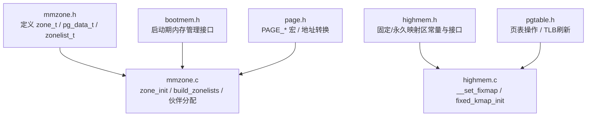
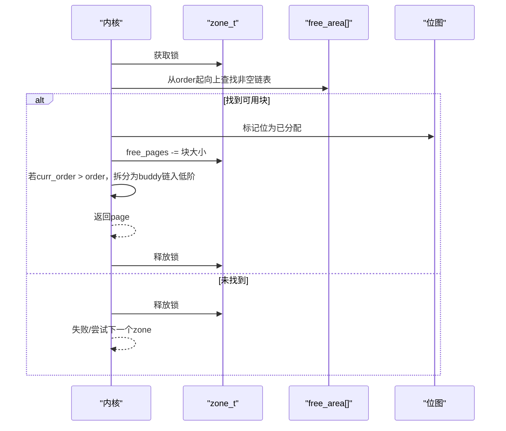
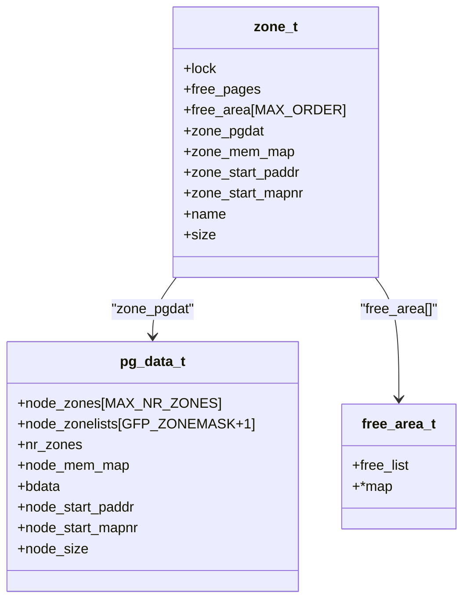
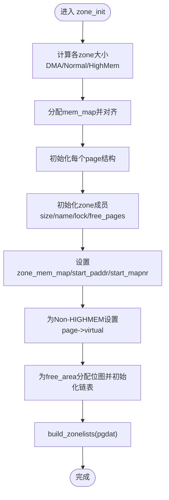
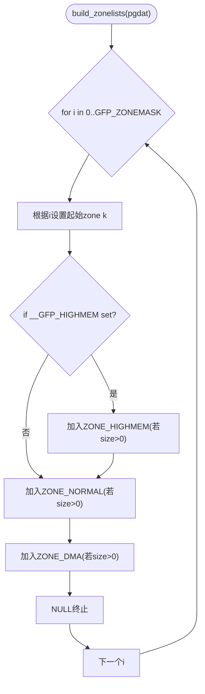
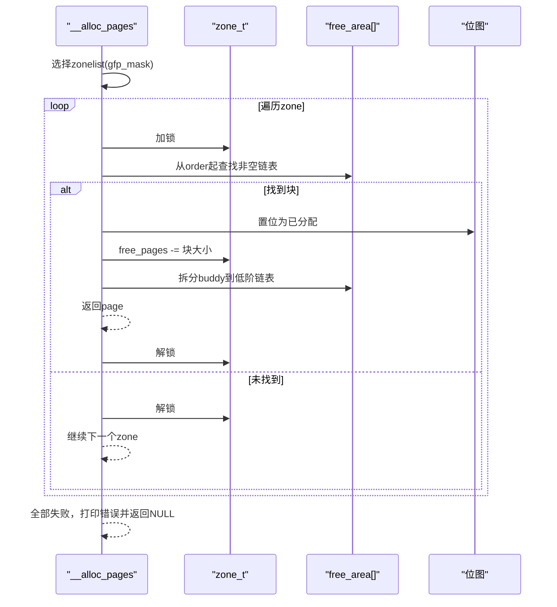
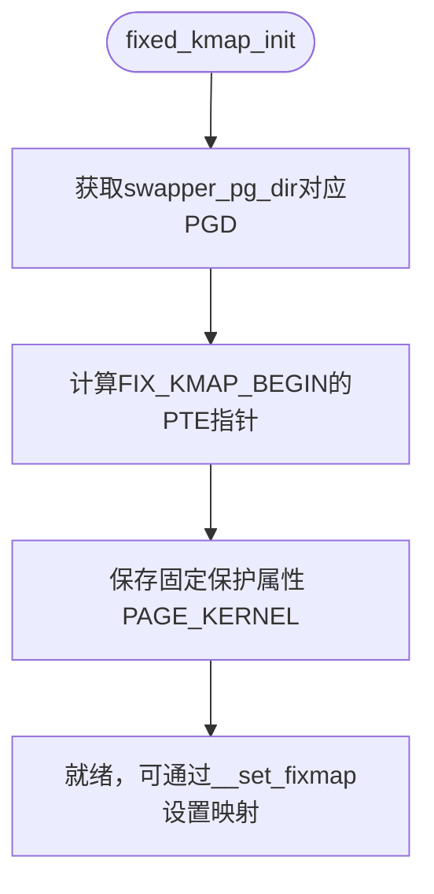
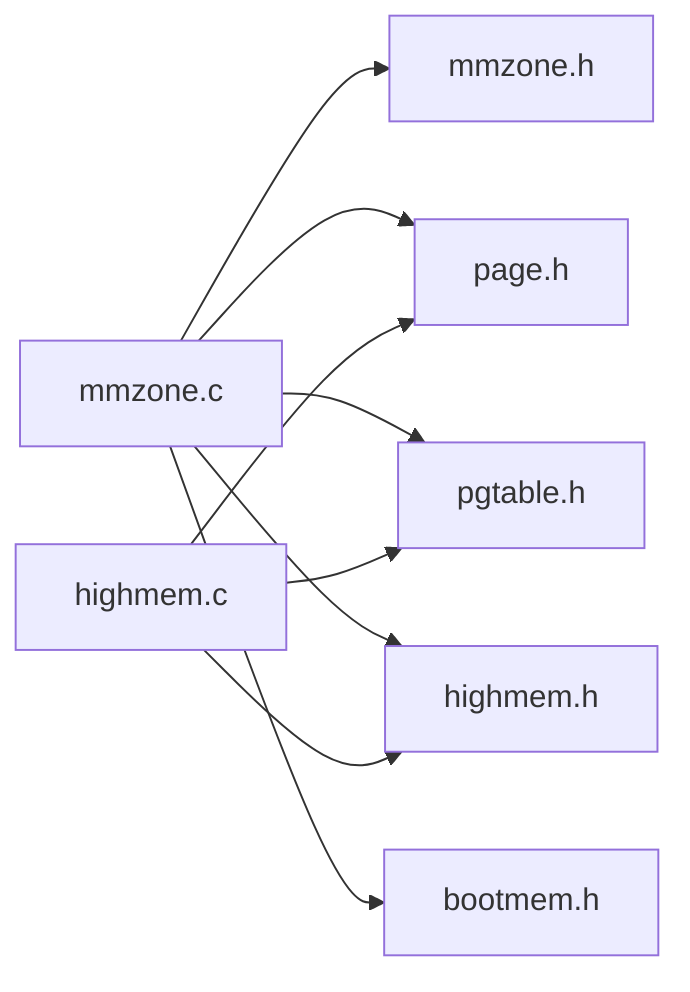

# 页区域管理

<cite>
**本文引用的文件**
- [includes/mm/mmzone.h](file://includes/mm/mmzone.h)
- [kernel/mm/mmzone.c](file://kernel/mm/mmzone.c)
- [includes/arch/x86/highmem.h](file://includes/arch/x86/highmem.h)
- [kernel/mm/highmem.c](file://kernel/mm/highmem.c)
- [includes/mm/bootmem.h](file://includes/mm/bootmem.h)
- [includes/arch/x86/page.h](file://includes/arch/x86/page.h)
- [includes/arch/x86/pgtable.h](file://includes/arch/x86/pgtable.h)
</cite>

## 目录
1. [简介](#简介)
2. [项目结构](#项目结构)
3. [核心组件](#核心组件)
4. [架构总览](#架构总览)
5. [详细组件分析](#详细组件分析)
6. [依赖关系分析](#依赖关系分析)
7. [性能考虑](#性能考虑)
8. [故障排查指南](#故障排查指南)
9. [结论](#结论)
10. [附录](#附录)

## 简介
本文面向LulaOS的页区域（Zone）管理系统，系统性解释ZONE_DMA、ZONE_NORMAL与ZONE_HIGHMEM三种页区域的划分原理与用途；描述zone_t结构体的设计及其关键成员的作用；详解zone_init()的初始化流程（含各区域大小计算与内存映射建立）；说明build_zonelists()如何根据GFP标志构建不同优先级的区域列表；并提供页区域状态监控与调试方法，帮助开发者理解内存分配时的区域选择策略。

## 项目结构
与页区域管理直接相关的代码主要位于：
- 头文件定义：includes/mm/mmzone.h、includes/arch/x86/highmem.h、includes/mm/bootmem.h、includes/arch/x86/page.h、includes/arch/x86/pgtable.h
- 实现逻辑：kernel/mm/mmzone.c、kernel/mm/highmem.c

**图表来源**
- [includes/mm/mmzone.h:1-80](file://includes/mm/mmzone.h#L1-L80)
- [kernel/mm/mmzone.c:1-329](file://kernel/mm/mmzone.c#L1-L329)
- [includes/arch/x86/highmem.h:1-105](file://includes/arch/x86/highmem.h#L1-L105)
- [kernel/mm/highmem.c:1-48](file://kernel/mm/highmem.c#L1-L48)
- [includes/mm/bootmem.h:1-28](file://includes/mm/bootmem.h#L1-L28)
- [includes/arch/x86/page.h:1-47](file://includes/arch/x86/page.h#L1-L47)
- [includes/arch/x86/pgtable.h:1-131](file://includes/arch/x86/pgtable.h#L1-L131)

**章节来源**
- [includes/mm/mmzone.h:1-80](file://includes/mm/mmzone.h#L1-L80)
- [kernel/mm/mmzone.c:1-329](file://kernel/mm/mmzone.c#L1-L329)
- [includes/arch/x86/highmem.h:1-105](file://includes/arch/x86/highmem.h#L1-L105)
- [kernel/mm/highmem.c:1-48](file://kernel/mm/highmem.c#L1-L48)
- [includes/mm/bootmem.h:1-28](file://includes/mm/bootmem.h#L1-L28)
- [includes/arch/x86/page.h:1-47](file://includes/arch/x86/page.h#L1-L47)
- [includes/arch/x86/pgtable.h:1-131](file://includes/arch/x86/pgtable.h#L1-L131)

## 核心组件
- 页区域类型与边界
  - ZONE_DMA：用于DMA设备可访问的低端内存（通常限制在16MB以内）。
  - ZONE_NORMAL：内核可直接映射的低端内存区域（典型为16MB至896MB）。
  - ZONE_HIGHMEM：高端内存，无法被内核直接以固定虚拟地址映射，需通过kmap等机制临时或永久映射。
- 关键数据结构
  - zone_t：表示一个页区域，包含锁、空闲页计数、伙伴系统free_area数组、所属节点指针、本区域page映射起点、起始物理地址、起始页面号、名称、大小等。
  - pg_data_t：表示一个内存节点，包含该节点的所有zone、按GFP掩码预构建的zonelist数组、节点page映射起点、启动期数据等。
  - zonelist_t：由zone指针构成的NULL结尾列表，用于快速遍历候选区域。
- 启动期内存与页表
  - bootmem：提供启动期的内存分配与保留能力，用于分配mem_map和位图。
  - highmem：提供固定映射区与永久映射区的设置能力，以及ioremap/vmalloc等接口声明。

**章节来源**
- [includes/mm/mmzone.h:11-69](file://includes/mm/mmzone.h#L11-L69)
- [includes/arch/x86/highmem.h:12-105](file://includes/arch/x86/highmem.h#L12-L105)
- [includes/mm/bootmem.h:7-28](file://includes/mm/bootmem.h#L7-L28)

## 架构总览
LulaOS将物理内存划分为三个区域，分别服务于不同的硬件与内核需求：
- ZONE_DMA：满足ISA/DMA设备的低地址访问约束。
- ZONE_NORMAL：内核直接映射区，适合大多数内核态分配。
- ZONE_HIGHMEM：超出直接映射范围的高端内存，需要显式映射才能访问。

分配流程基于伙伴系统与zonelist：
- 初始化阶段：计算各区域大小，分配并初始化mem_map与free_area位图，建立zone到page映射。
- 分配阶段：根据GFP标志选择zonelist，按优先级遍历zone，从对应阶的空闲链表分配，必要时拆分大块或合并小块。
- 回收阶段：释放时尝试与伙伴块合并，维护位图与空闲计数。

**图表来源**
- [kernel/mm/mmzone.c:248-324](file://kernel/mm/mmzone.c#L248-L324)

**章节来源**
- [kernel/mm/mmzone.c:21-59](file://kernel/mm/mmzone.c#L21-L59)
- [kernel/mm/mmzone.c:248-324](file://kernel/mm/mmzone.c#L248-L324)

## 详细组件分析

### 页区域划分原理与用途
- ZONE_DMA
  - 目的：为仅能访问低地址的物理设备（如传统PCI ISA总线设备）提供DMA缓冲区。
  - 范围：上限由MAX_DMA_ADDRESS决定（通常为16MB），通过PFN_DOWN转换为页面号。
- ZONE_NORMAL
  - 目的：内核直接映射的低端内存，适用于绝大多数内核态分配。
  - 范围：从max_dma_pfn到max_low_pfn。
- ZONE_HIGHMEM
  - 目的：容纳超过直接映射范围的物理内存，需通过kmap/ioremap/vmalloc等方式访问。
  - 范围：从max_low_pfn到highend_pfn。

这些范围在初始化时由zone_init()依据全局PFN边界变量计算得到。

**章节来源**
- [includes/mm/mmzone.h:11-16](file://includes/mm/mmzone.h#L11-L16)
- [kernel/mm/mmzone.c:61-77](file://kernel/mm/mmzone.c#L61-L77)
- [includes/arch/x86/highmem.h:12-19](file://includes/arch/x86/highmem.h#L12-L19)

### zone_t结构设计及关键成员
- lock：自旋锁，保护对zone内部状态的并发访问。
- free_pages：当前zone中空闲页面的总数（按实际分配粒度统计）。
- free_area[MAX_ORDER]：伙伴系统的空闲块链表与位图数组，每个阶维护对应大小的空闲块。
- zone_pgdat：指向所属的pg_data_t节点。
- zone_mem_map：指向本zone在全局mem_map中的起始page结构。
- zone_start_paddr：本zone的起始物理地址。
- zone_start_mapnr：本zone在mem_map中的起始偏移（页面号）。
- name：区域名称字符串，便于调试输出。
- size：本zone包含的页面数量。

**图表来源**
- [includes/mm/mmzone.h:24-69](file://includes/mm/mmzone.h#L24-L69)

**章节来源**
- [includes/mm/mmzone.h:24-69](file://includes/mm/mmzone.h#L24-L69)

### zone_init()初始化过程
- 计算各区域大小
  - 使用max_dma_pfn、max_low_pfn、highend_pfn确定ZONE_DMA、ZONE_NORMAL、ZONE_HIGHMEM的页面数。
- 分配mem_map
  - 为所有页面分配struct page数组，并进行对齐处理，记录到pgdat->node_mem_map。
- 初始化page结构
  - 遍历mem_map，设置引用计数、保留标志、链表头。
- 初始化zone
  - 为每个zone设置size、name、zone_pgdat、lock、free_pages=0。
  - 设置zone_mem_map、zone_start_paddr、zone_start_mapnr。
  - 为非HIGHMEM区域设置page->virtual为对应的内核虚拟地址。
  - 为每个zone分配free_area位图（除最大阶），并初始化空闲链表。
- 构建zonelist
  - 调用build_zonelists()为每个GFP掩码生成优先级列表。

**图表来源**
- [kernel/mm/mmzone.c:61-150](file://kernel/mm/mmzone.c#L61-L150)

**章节来源**
- [kernel/mm/mmzone.c:61-150](file://kernel/mm/mmzone.c#L61-L150)

### build_zonelists()区域优先级构建
- 输入：pgdat指针。
- 行为：
  - 针对每个GFP掩码i（0..GFP_ZONEMASK），创建zonelist_t并清零。
  - 根据i中的__GFP_HIGHMEM与__GFP_DMA位决定起始zone索引k：
    - 若设置了__GFP_HIGHMEM，则优先尝试ZONE_HIGHMEM。
    - 若设置了__GFP_DMA，则优先尝试ZONE_DMA。
    - 否则默认从ZONE_NORMAL开始。
  - 按顺序将存在的zone加入zonelist，并以NULL结束。
- 结果：每个GFP掩码对应一个优先级明确的zone遍历序列，供分配器快速选择候选区域。

**图表来源**
- [kernel/mm/mmzone.c:21-59](file://kernel/mm/mmzone.c#L21-L59)

**章节来源**
- [kernel/mm/mmzone.c:21-59](file://kernel/mm/mmzone.c#L21-L59)

### 分配与回收流程（伙伴系统）
- 分配
  - 根据gfp_mask选择zonelist，依次尝试各zone。
  - 从order起向上查找非空的free_area链表，找到后摘取块。
  - 更新位图与free_pages计数，必要时将大块拆分为目标order，并将buddy链入低阶链表。
  - 初始化返回page的引用计数与保留标志。
- 回收
  - 检查page是否可释放（非reserved、不在LRU等）。
  - 计算block索引与阶，尝试与buddy合并，直到无法合并或达到最大阶。
  - 将最终块插入对应阶的空闲链表，更新free_pages与位图。

**图表来源**
- [kernel/mm/mmzone.c:248-324](file://kernel/mm/mmzone.c#L248-L324)

**章节来源**
- [kernel/mm/mmzone.c:152-246](file://kernel/mm/mmzone.c#L152-L246)
- [kernel/mm/mmzone.c:248-324](file://kernel/mm/mmzone.c#L248-L324)

### 高端内存映射（fixed/pkmap/ioremap/vmalloc）
- 固定映射区（FIX_KMAP_BEGIN~END）：用于短生命周期的高频映射场景，通过__set_fixmap设置PTE。
- 永久映射区（PKMAP_BASE）：长期映射高端页，通过pkmap_page_table管理。
- ioremap/vmalloc：为设备寄存器或大块不连续物理内存提供虚拟连续映射。

**图表来源**
- [kernel/mm/highmem.c:43-48](file://kernel/mm/highmem.c#L43-L48)
- [includes/arch/x86/highmem.h:19-67](file://includes/arch/x86/highmem.h#L19-L67)

**章节来源**
- [kernel/mm/highmem.c:13-48](file://kernel/mm/highmem.c#L13-L48)
- [includes/arch/x86/highmem.h:12-105](file://includes/arch/x86/highmem.h#L12-L105)

## 依赖关系分析
- mmzone.c依赖：
  - mmzone.h：zone_t、pg_data_t、zonelist_t定义与GFP掩码。
  - page.h：PAGE_*宏与地址转换。
  - pgtable.h：页表操作与TLB刷新。
  - highmem.h：高端内存相关常量与接口。
  - bootmem.h：启动期内存分配。
- highmem.c依赖：
  - pgtable.h：页表项设置与权限。
  - page.h：地址转换。
  - highmem.h：固定/永久映射区常量与接口。

**图表来源**
- [kernel/mm/mmzone.c:1-13](file://kernel/mm/mmzone.c#L1-L13)
- [kernel/mm/highmem.c:1-4](file://kernel/mm/highmem.c#L1-L4)

**章节来源**
- [kernel/mm/mmzone.c:1-13](file://kernel/mm/mmzone.c#L1-L13)
- [kernel/mm/highmem.c:1-4](file://kernel/mm/highmem.c#L1-L4)

## 性能考虑
- 分配路径优化
  - 通过zonelist避免全量扫描zone，按GFP语义优先尝试特定区域。
  - 伙伴系统从高阶向下拆分，减少碎片并提高大块分配效率。
- 回收路径优化
  - 合并buddy块降低碎片，维持较高阶空闲块可用性。
- 锁粒度
  - 以zone为单位加锁，保证并发安全的同时减少锁竞争面。
- 高端内存访问
  - 使用固定映射区减少频繁映射开销；合理复用pkmap条目以降低页表压力。

[本节为通用性能讨论，不直接分析具体文件]

## 故障排查指南
- 常见问题定位
  - 分配失败：检查zonelist是否正确构建，确认各zone的size是否为0；查看__alloc_pages日志输出。
  - 区域越界：验证zone_start_paddr与zone_start_mapnr设置是否正确；检查BAD_RANGE宏条件。
  - 高端映射异常：确认fixed_kmap_init已调用，__set_fixmap参数合法；检查PTE权限设置。
- 调试建议
  - 打印各zone的size、free_pages、nr_zones，观察初始化结果。
  - 在分配/回收路径增加日志，记录order、curr_order、buddy索引与位图变化。
  - 使用printk输出zone名称与当前尝试的zone索引，辅助定位选择策略问题。

**章节来源**
- [kernel/mm/mmzone.c:61-150](file://kernel/mm/mmzone.c#L61-L150)
- [kernel/mm/mmzone.c:248-324](file://kernel/mm/mmzone.c#L248-L324)
- [kernel/mm/highmem.c:31-48](file://kernel/mm/highmem.c#L31-L48)

## 结论
LulaOS通过ZONE_DMA、ZONE_NORMAL与ZONE_HIGHMEM三区域划分，兼顾了设备DMA约束与内核直接映射限制，并利用伙伴系统与zonelist实现了高效、可扩展的内存分配与回收。zone_init()负责建立区域边界、mem_map与free_area结构；build_zonelists()根据GFP语义构建优先级列表，确保分配路径的快速选择。配合高端内存映射机制，系统能够正确管理低端与高端内存资源。开发者可通过监控zone状态与分配路径日志，深入理解内存分配的区域选择策略与性能特征。

[本节为总结性内容，不直接分析具体文件]

## 附录
- 关键宏与常量
  - MAX_DMA_ADDRESS：DMA区域上限（16MB）。
  - ZONE_*：区域枚举值。
  - GFP_ZONEMASK：GFP掩码范围。
  - FIXADDR_TOP/FIX_KMAP_*：固定映射区范围。
  - PKMAP_BASE/LAST_PKMAP：永久映射区范围。
- 常用接口
  - zone_init()：初始化页区域与伙伴系统。
  - alloc_pages()/__alloc_pages()：按GFP与order分配页面。
  - free_pages()/__free_pages()：释放页面并尝试合并。
  - __set_fixmap()/fixed_kmap_init()：设置固定映射。
  - ioremap()/vmalloc()：设备与虚拟连续内存映射。

**章节来源**
- [includes/mm/mmzone.h:11-22](file://includes/mm/mmzone.h#L11-L22)
- [includes/arch/x86/highmem.h:19-67](file://includes/arch/x86/highmem.h#L19-L67)
- [kernel/mm/mmzone.c:61-150](file://kernel/mm/mmzone.c#L61-L150)
- [kernel/mm/mmzone.c:248-324](file://kernel/mm/mmzone.c#L248-L324)
- [kernel/mm/highmem.c:31-48](file://kernel/mm/highmem.c#L31-L48)