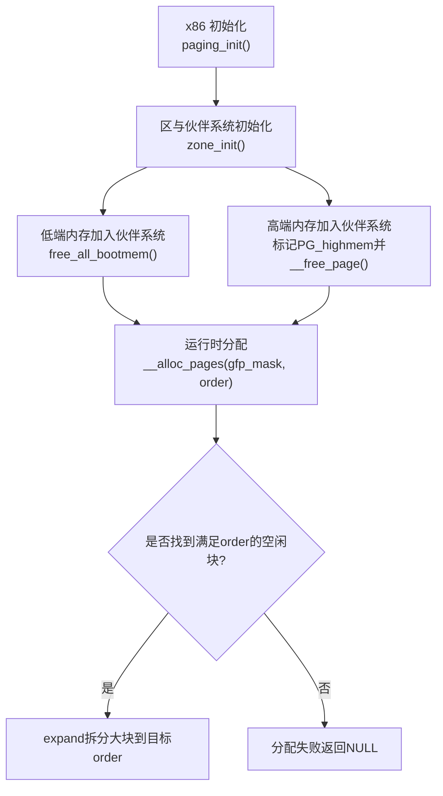
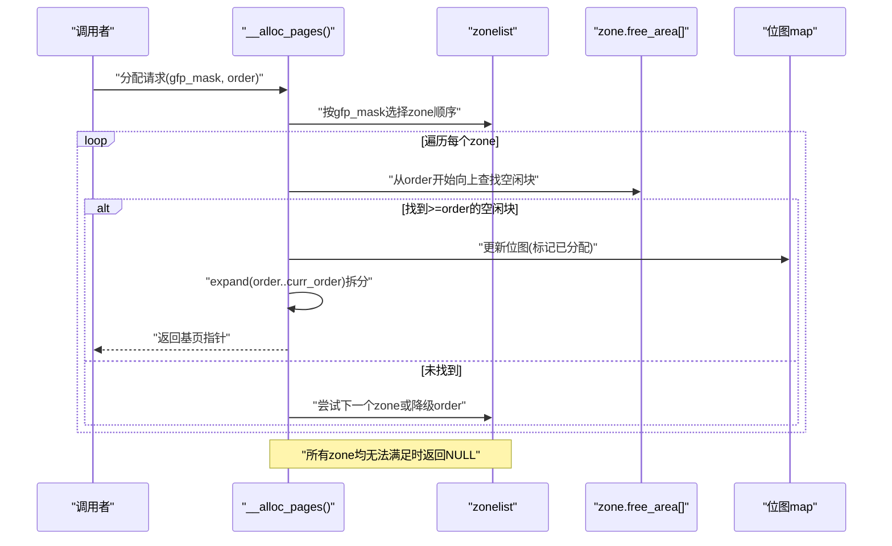
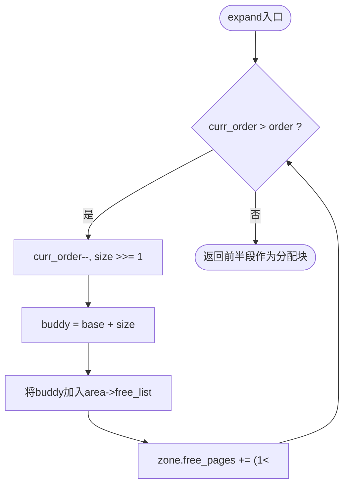
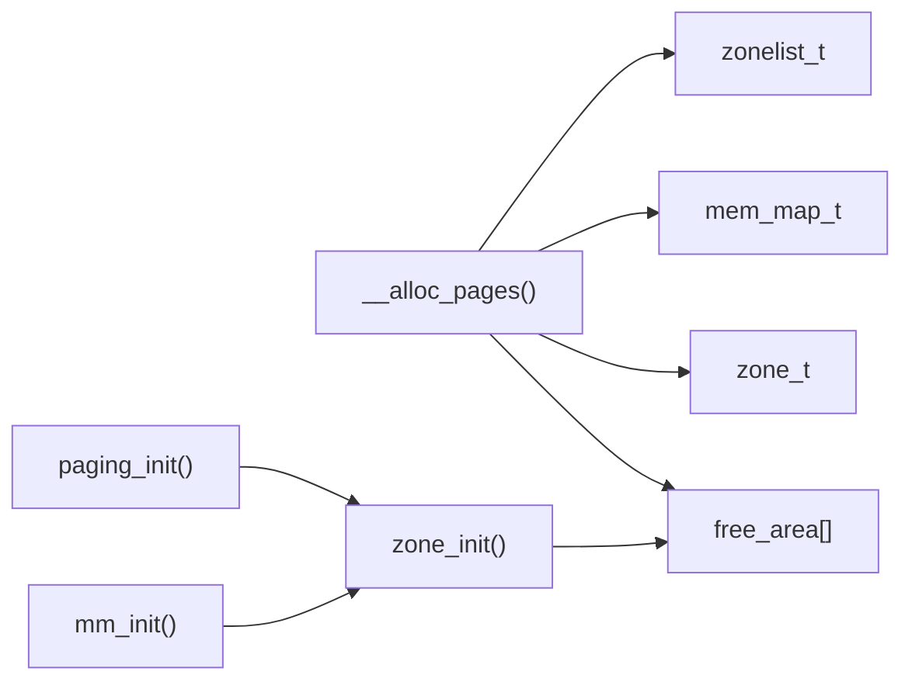

# 页面分配算法

<cite>
**本文引用的文件**
- [mm.h](file://includes/mm/mm.h)
- [mmzone.h](file://includes/mm/mmzone.h)
- [mm.c](file://arch/x86/kernel/mm/mm.c)
- [mmzone.c](file://kernel/mm/mmzone.c)
- [bootmem.c](file://kernel/mm/bootmem.c)
</cite>

## 目录
1. [简介](#简介)
2. [项目结构](#项目结构)
3. [核心组件](#核心组件)
4. [架构总览](#架构总览)
5. [详细组件分析](#详细组件分析)
6. [依赖关系分析](#依赖关系分析)
7. [性能考虑](#性能考虑)
8. [故障排查指南](#故障排查指南)
9. [结论](#结论)
10. [附录](#附录)

## 简介
本文面向LulaOS的伙伴系统页面分配器，重点解析__alloc_pages()的实现逻辑：zonelist遍历、空闲块查找、从高阶到低阶的降级策略、expand拆分过程与buddy处理机制。同时说明不同gfp_mask下的分配行为（DMA/Normal/HighMem优先级）、分配失败流程以及性能优化建议。读者无需深入内核源码即可理解整体工作流与关键设计取舍。

## 项目结构
- 内存管理头文件定义了页描述符、区结构、伙伴系统空闲区域等核心数据结构，并声明了分配与释放接口。
- x86平台初始化负责建立直接映射、固定映射、持久映射，并调用zone_init完成区与伙伴系统的初始化。
- mmzone.c实现了__alloc_pages()的核心路径：zonelist遍历、按order查找空闲块、expand拆分、buddy合并/拆分、返回已分配页。
- bootmem.c提供启动期分配器，用于早期分配和回收，最终将可用页转入伙伴系统。

**图示来源**
- [mm.c:117-134](file://arch/x86/kernel/mm/mm.c#L117-L134)
- [mm.c:145-205](file://arch/x86/kernel/mm/mm.c#L145-L205)
- [mmzone.c:275-329](file://kernel/mm/mmzone.c#L275-L329)

**章节来源**
- [mm.c:117-134](file://arch/x86/kernel/mm/mm.c#L117-L134)
- [mm.c:145-205](file://arch/x86/kernel/mm/mm.c#L145-L205)

## 核心组件
- 页描述符mem_map_t：引用计数、标志位、虚拟地址、所属zone等。
- 区zone_t：包含锁、空闲页计数、MAX_ORDER个free_area（链表+位图）、起始物理地址与大小等。
- zonelist_t：按gfp_mask选择的zone顺序表，决定分配优先级。
- pg_data_t：节点级结构，聚合node_zones与node_zonelists。
- 接口：__alloc_pages(gfp_mask, order)为底层分配入口；alloc_pages()为其封装；__free_pages()用于释放。

**章节来源**
- [mm.h:11-98](file://includes/mm/mm.h#L11-L98)
- [mmzone.h:24-79](file://includes/mm/mmzone.h#L24-L79)

## 架构总览
下图展示了从请求到分配的完整序列：根据gfp_mask选择zonelist，逐zone尝试从对应order或更高阶空闲链表中摘取块；若存在大于目标order的块，则通过expand拆分为目标order，并将buddy半部归还至更低阶空闲链表；否则继续降级order或切换下一个zone，直至成功或失败。

**图示来源**
- [mmzone.c:275-329](file://kernel/mm/mmzone.c#L275-L329)
- [mmzone.h:48-54](file://includes/mm/mmzone.h#L48-L54)

## 详细组件分析

### __alloc_pages() 实现逻辑
- 输入参数：gfp_mask决定可使用的zone集合与约束；order表示所需连续页的对数幂（2^order）。
- 控制流要点：
  - 依据gfp_mask构建或选择zonelist，依次遍历各zone。
  - 在每个zone内，从order开始向上检查free_area[curr_order]是否有空闲块。
  - 若找到，则从该空闲链表头部摘取一个块，更新位图，减少zone.free_pages计数。
  - 执行expand：当curr_order > order时，循环递减order，每次将“后半块”作为buddy插入到对应低阶空闲链表，直到达到目标order。
  - 初始化返回页的count与标志位，对order>0的多页块逐一初始化。
  - 若所有zone均无满足条件的块，打印失败信息并返回NULL。

**图示来源**
- [mmzone.c:275-329](file://kernel/mm/mmzone.c#L275-L329)

**章节来源**
- [mmzone.c:275-329](file://kernel/mm/mmzone.c#L275-L329)

### expand() 操作：大块拆分与buddy处理
- 目的：将大小为2^curr_order的空闲块拆分为多个2^order的小块，以满足精确分配需求。
- 过程：
  - 从curr_order向下迭代到order+1，每次size减半。
  - 计算buddy位置为当前块的“后半段”，将其加入对应低阶free_area的free_list，并增加zone.free_pages计数。
  - 重复直到curr_order==order，此时剩余的前半段即为目标大小的分配块。
- 位图维护：摘取块时通过位图标记该块已分配，避免重复使用。

**图示来源**
- [mmzone.c:291-302](file://kernel/mm/mmzone.c#L291-L302)

**章节来源**
- [mmzone.c:291-302](file://kernel/mm/mmzone.c#L291-L302)

### 从高阶到低阶的查找策略
- 优先在目标order或更高阶空闲链表中寻找，以减少碎片并提高分配效率。
- 若高阶有块，则通过expand拆分到目标order，同时将buddy归还到更低阶空闲链表，形成更细粒度的空闲资源。
- 若当前zone无法提供，则切换到下一个zone（由gfp_mask决定的zonelist顺序），或继续在当前zone内尝试更低order。

**章节来源**
- [mmzone.c:275-329](file://kernel/mm/mmzone.c#L275-L329)

### 不同gfp_mask下的分配行为与区域优先级
- ZONE_DMA：适用于需要低地址DMA的设备，通常位于前16M范围。
- ZONE_NORMAL：常规内核可访问的直接映射区域（约16M-896M）。
- ZONE_HIGHMEM：高于896M的高端内存，需特殊映射访问。
- gfp_mask中的GFP_ZONEMASK位决定允许使用的zone集合，从而控制分配优先级与约束。
- 典型行为：
  - 仅允许DMA时，只在ZONE_DMA中查找。
  - 允许普通分配时，优先尝试ZONE_NORMAL，必要时回退到其他zone。
  - 指定HIGHMEM时，可在ZONE_HIGHMEM中分配，但需注意映射成本。

**章节来源**
- [mmzone.h:11-22](file://includes/mm/mmzone.h#L11-L22)
- [mmzone.h:48-54](file://includes/mm/mmzone.h#L48-L54)

### 初始化与伙伴系统接入
- paging_init()完成页表与固定/持久映射后，调用zone_init()初始化各区与伙伴系统。
- mm_init()将低端内存通过free_all_bootmem()回收并加入伙伴系统；对高端内存设置PG_highmem标志并逐个__free_page()加入伙伴系统。
- 这些步骤确保运行时__alloc_pages()能在正确的zone中找到空闲块。

**章节来源**
- [mm.c:117-134](file://arch/x86/kernel/mm/mm.c#L117-L134)
- [mm.c:145-205](file://arch/x86/kernel/mm/mm.c#L145-L205)
- [bootmem.c:84-139](file://kernel/mm/bootmem.c#L84-L139)

## 依赖关系分析
- __alloc_pages()依赖：
  - zone_t与free_area_t：提供空闲链表与位图。
  - mem_map_t：页描述符，用于初始化count与标志。
  - pg_data_t与zonelist_t：决定zone遍历顺序与可用性。
- 初始化依赖：
  - paging_init()依赖页表与映射初始化。
  - mm_init()依赖bootmem回收与高端内存处理。

**图示来源**
- [mmzone.h:24-63](file://includes/mm/mmzone.h#L24-L63)
- [mm.c:117-134](file://arch/x86/kernel/mm/mm.c#L117-L134)
- [mm.c:145-205](file://arch/x86/kernel/mm/mm.c#L145-L205)

**章节来源**
- [mmzone.h:24-63](file://includes/mm/mmzone.h#L24-L63)
- [mm.c:117-134](file://arch/x86/kernel/mm/mm.c#L117-L134)
- [mm.c:145-205](file://arch/x86/kernel/mm/mm.c#L145-L205)

## 性能考虑
- 尽量在高阶空闲块上分配，减少expand次数与碎片化。
- 合理设置gfp_mask，避免不必要的跨zone搜索。
- 批量分配时复用同一zone，降低锁竞争与缓存失效。
- 监控zone.free_pages与位图状态，及时识别潜在碎片问题。
- 对高频小对象分配，考虑结合slab分配器以降低伙伴系统压力。

## 故障排查指南
- 常见症状：__alloc_pages()返回NULL，日志输出“failed order=...”。
- 可能原因：
  - 目标order过大，无足够连续空闲块。
  - 指定zone不可用或已满。
  - 高order频繁分配导致碎片化严重。
- 排查步骤：
  - 检查gfp_mask是否正确限制zone。
  - 查看各zone.free_pages与free_area使用情况。
  - 评估是否存在大量小块分配导致的碎片。
  - 调整分配粒度或引入slab/池化策略。
- 相关实现参考：
  - 分配失败路径与日志输出。
  - 启动期回收与伙伴系统接入流程。

**章节来源**
- [mmzone.c:321-329](file://kernel/mm/mmzone.c#L321-L329)
- [mm.c:145-205](file://arch/x86/kernel/mm/mm.c#L145-L205)

## 结论
LulaOS的页面分配基于伙伴系统，__alloc_pages()通过zonelist遍历与高阶到低阶的查找策略，结合expand拆分与buddy机制，高效满足各种order的分配需求。合理的gfp_mask配置与初始化流程确保了DMA/Normal/HighMem区域的正确优先级与可用性。面对分配失败与碎片问题，可通过调整分配策略与引入更高层分配器进行优化。

## 附录
- 数据结构速览：
  - mem_map_t：页描述符，含引用计数、标志、虚拟地址、所属zone。
  - zone_t：区结构，含锁、空闲页计数、free_area数组、起始地址与大小。
  - free_area_t：空闲区域，含链表与位图。
  - zonelist_t：zone顺序表，受gfp_mask控制。
  - pg_data_t：节点结构，聚合zones与zonelists。
- 关键接口：
  - __alloc_pages(gfp_mask, order)：底层分配入口。
  - alloc_pages(gfp_mask, order)：对外封装。
  - __free_pages(page, order)：释放连续页。

**章节来源**
- [mm.h:11-98](file://includes/mm/mm.h#L11-L98)
- [mmzone.h:24-79](file://includes/mm/mmzone.h#L24-L79)