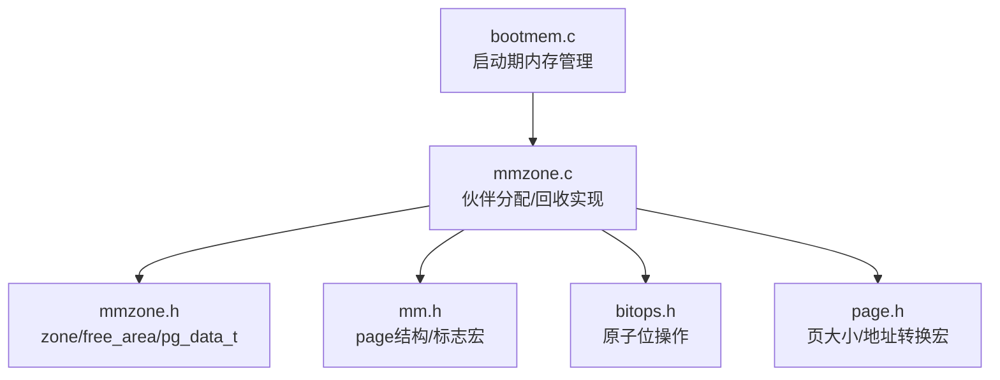
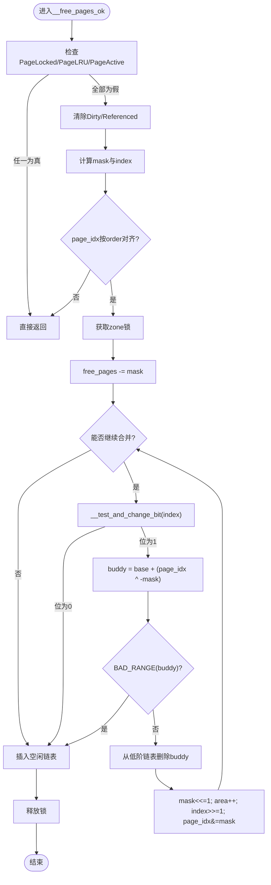
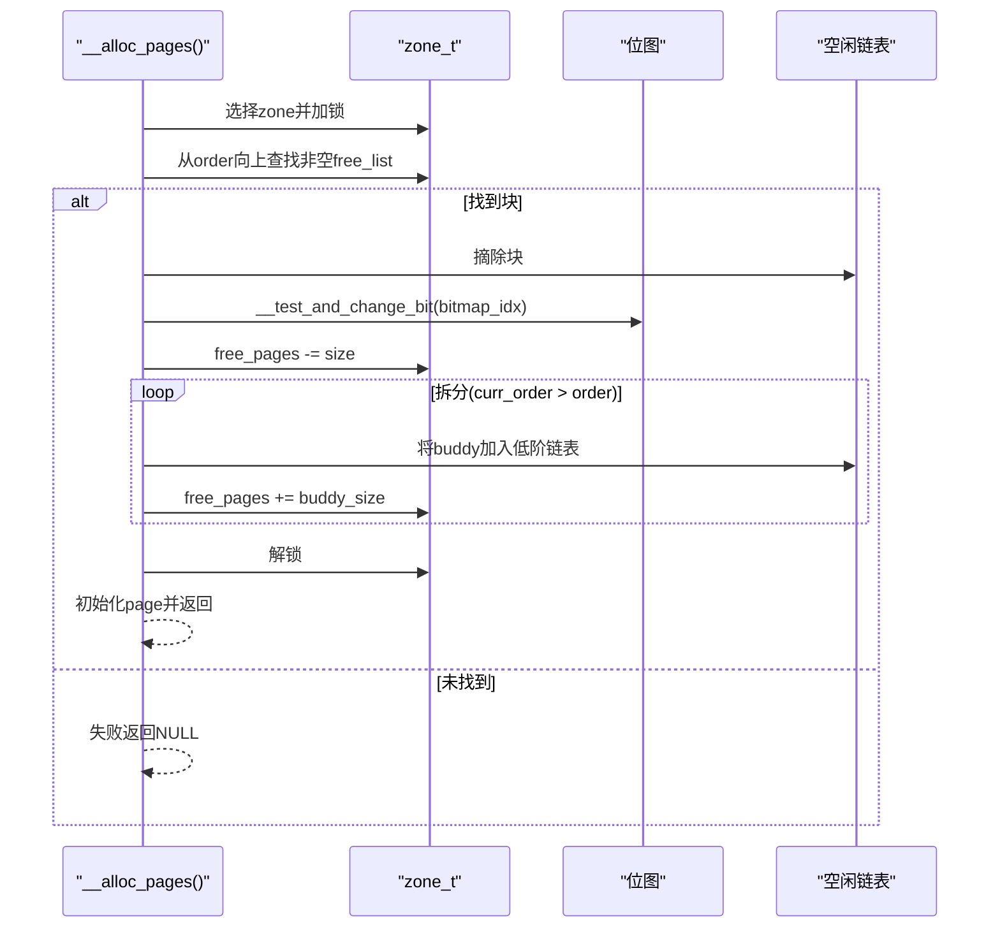
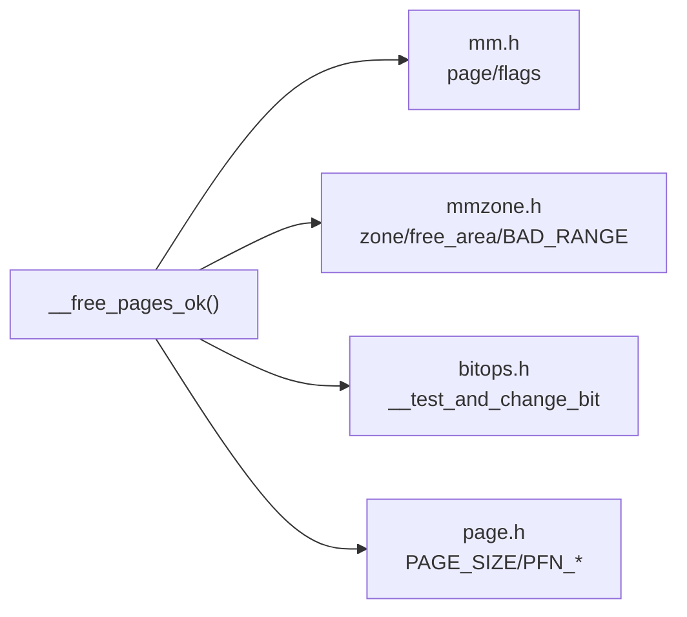

# 页面释放与合并算法

<cite>
**本文引用的文件**
- [mmzone.c](file://kernel/mm/mmzone.c)
- [mmzone.h](file://includes/mm/mmzone.h)
- [mm.h](file://includes/mm/mm.h)
- [bitops.h](file://includes/arch/x86/bitops.h)
- [page.h](file://includes/arch/x86/page.h)
- [bootmem.c](file://kernel/mm/bootmem.c)
</cite>

## 目录
1. [简介](#简介)
2. [项目结构](#项目结构)
3. [核心组件](#核心组件)
4. [架构总览](#架构总览)
5. [详细组件分析](#详细组件分析)
6. [依赖关系分析](#依赖关系分析)
7. [性能考虑](#性能考虑)
8. [故障排查指南](#故障排查指南)
9. [结论](#结论)
10. [附录](#附录)

## 简介
本文档聚焦于LulaOS的页面释放与伙伴系统合并算法，重点解析__free_pages_ok()的实现细节：页面有效性验证、锁机制、合并循环、位图操作与空闲区域状态更新。同时阐述buddy合并的核心逻辑（通过异或运算定位相邻buddy）、边界检查与区域验证，并给出内存碎片化分析与合并效率优化的实践建议。

## 项目结构
LulaOS的伙伴系统与页面管理主要位于内核内存子系统：
- 数据结构与接口定义：includes/mm/mmzone.h、includes/mm/mm.h、includes/arch/x86/page.h、includes/arch/x86/bitops.h
- 实现代码：kernel/mm/mmzone.c（包含伙伴分配/回收、__free_pages_ok、__alloc_pages等）
- 启动期内存管理：kernel/mm/bootmem.c（将可用页回收到伙伴系统）



图表来源
- [mmzone.c:153-219](file://kernel/mm/mmzone.c#L153-L219)
- [mmzone.h:24-46](file://includes/mm/mmzone.h#L24-L46)
- [mm.h:11-81](file://includes/mm/mm.h#L11-L81)
- [bitops.h:58-67](file://includes/arch/x86/bitops.h#L58-L67)
- [page.h:8-19](file://includes/arch/x86/page.h#L8-L19)
- [bootmem.c:194-223](file://kernel/mm/bootmem.c#L194-L223)

章节来源
- [mmzone.c:153-219](file://kernel/mm/mmzone.c#L153-L219)
- [mmzone.h:24-46](file://includes/mm/mmzone.h#L24-L46)
- [mm.h:11-81](file://includes/mm/mm.h#L11-L81)
- [bitops.h:58-67](file://includes/arch/x86/bitops.h#L58-L67)
- [page.h:8-19](file://includes/arch/x86/page.h#L8-L19)
- [bootmem.c:194-223](file://kernel/mm/bootmem.c#L194-L223)

## 核心组件
- 管理区与空闲区域
  - zone_t：维护每个管理区的锁、空闲页计数、各阶空闲链表与位图、物理范围信息等。
  - free_area_t：每阶的空闲链表与位图，用于快速查找和标记空闲块。
  - pg_data_t：节点级内存描述，包含多个zone及zonelist。
- 页面元数据
  - page结构：引用计数、标志位、所属zone、虚拟映射等。
  - 标志位宏：PageLocked/PageLRU/PageActive/PageReserved/ClearPageDirty/ClearPageReferenced等。
- 位操作
  - __test_and_change_bit：原子翻转位，用于在分配/回收时同步更新位图。
- 地址与页号转换
  - PAGE_SIZE/PFN_UP/PFN_DOWN/virt_to_page等宏。

章节来源
- [mmzone.h:24-46](file://includes/mm/mmzone.h#L24-L46)
- [mm.h:11-81](file://includes/mm/mm.h#L11-L81)
- [bitops.h:58-67](file://includes/arch/x86/bitops.h#L58-L67)
- [page.h:8-19](file://includes/arch/x86/page.h#L8-L19)

## 架构总览
伙伴系统在回收路径中通过__free_pages_ok()完成以下工作：
- 页面有效性校验（未锁定、不在LRU、非活跃等）
- 计算掩码与索引，进入临界区
- 尝试向上合并：利用位图与异或运算找到buddy，若可合并则提升阶数并继续尝试
- 最终将合并后的块插入对应阶的空闲链表，并更新空闲计数

```mermaid
sequenceDiagram
participant Caller as "调用者"
participant Free as "__free_pages()"
participant Ok as "__free_pages_ok()"
participant Zone as "zone_t"
participant Map as "位图"
participant List as "空闲链表"
Caller->>Free : 传入(page, order)
Free->>Free : 检查PageReserved与引用计数
alt 引用计数归零
Free->>Ok : 进入实际释放
Ok->>Ok : 校验PageLocked/PageLRU/PageActive
Ok->>Ok : 计算mask/index/base/page_idx
Ok->>Zone : spin_lock_irqsave
Ok->>Zone : free_pages -= mask
loop 尝试合并(从order到MAX_ORDER-1)
Ok->>Map : __test_and_change_bit(index)
alt 位为1(表示空闲)
Ok->>Ok : buddy = base + (page_idx ^ -mask)
Ok->>Ok : BAD_RANGE(zone,buddy)?
alt 越界
break
else
Ok->>List : list_del(&buddy->list)
Ok->>Ok : mask<<=1; area++; index>>=1; page_idx&=mask
end
else 位为0(不可合并)
break
end
end
Ok->>List : list_add(&(base+page_idx)->list, &area->free_list)
Ok->>Zone : spin_unlock_irqrestore
else 不满足释放条件
Free-->>Caller : 返回
end
```

图表来源
- [mmzone.c:153-219](file://kernel/mm/mmzone.c#L153-L219)
- [mmzone.c:221-246](file://kernel/mm/mmzone.c#L221-L246)
- [mmzone.h:7-8](file://includes/mm/mmzone.h#L7-L8)
- [bitops.h:58-67](file://includes/arch/x86/bitops.h#L58-L67)

## 详细组件分析

### __free_pages_ok() 实现详解
- 页面验证
  - 若页面被锁定或在LRU链表中或处于活跃状态，直接返回，避免破坏页面队列一致性。
  - 清除脏位与引用位，确保页面回到干净且未被引用的状态。
- 锁机制
  - 使用自旋锁保护zone的free_pages计数、位图与空闲链表，防止并发修改导致不一致。
- 对齐与索引计算
  - 根据order计算掩码mask，验证page_idx是否按当前阶对齐；否则视为非法释放。
  - 计算位图索引index = page_idx >> (1 + order)，指向当前阶位图中的对应位。
- 合并循环与buddy定位
  - 循环从当前阶向上尝试合并，直到达到MAX_ORDER或无法合并。
  - 通过__test_and_change_bit(index, area->map)原子测试并翻转位：若位为1表示buddy空闲，可合并；否则停止。
  - 使用异或运算定位buddy：buddy = base + (page_idx ^ -mask)。该技巧基于同一阶内两个相邻块的起始页号在该阶位宽上仅相差一位，异或后得到另一块的起始位置。
  - 边界检查：BAD_RANGE(zone, buddy)确保buddy属于同一zone且在有效范围内。
  - 从低阶空闲链表中移除buddy，并将合并后的块提升到更高阶（mask左移、area++、index右移、page_idx &= mask）。
- 位图与空闲区域状态更新
  - 每次成功合并都会更新位图与空闲计数（free_pages），保证分配/回收路径的一致性。
  - 最终将合并后的块插入对应阶的空闲链表头部。



图表来源
- [mmzone.c:153-219](file://kernel/mm/mmzone.c#L153-L219)
- [mmzone.h:7-8](file://includes/mm/mmzone.h#L7-L8)
- [bitops.h:58-67](file://includes/arch/x86/bitops.h#L58-L67)

章节来源
- [mmzone.c:153-219](file://kernel/mm/mmzone.c#L153-L219)
- [mmzone.h:7-8](file://includes/mm/mmzone.h#L7-L8)
- [bitops.h:58-67](file://includes/arch/x86/bitops.h#L58-L67)

### 分配路径与expand（对比理解）
- __alloc_pages()从目标order开始向上查找空闲块，找到后将大块拆分为目标order，并把buddy半部放入更低阶空闲链表，同时更新位图与free_pages。
- 与回收路径对称：分配时“拆分”，回收时“合并”。



图表来源
- [mmzone.c:248-324](file://kernel/mm/mmzone.c#L248-L324)
- [bitops.h:58-67](file://includes/arch/x86/bitops.h#L58-L67)

章节来源
- [mmzone.c:248-324](file://kernel/mm/mmzone.c#L248-L324)

### 启动期内存回收到伙伴系统
- free_all_bootmem()遍历启动期位图，将可用页清除保留位、设置引用计数，并通过__free_page()回收到伙伴系统，随后释放bootmem位图页本身。

章节来源
- [bootmem.c:194-223](file://kernel/mm/bootmem.c#L194-L223)

## 依赖关系分析
- __free_pages_ok()依赖：
  - mm.h中的page结构与标志位宏（PageLocked/PageLRU/PageActive/ClearPageDirty/ClearPageReferenced等）
  - mmzone.h中的zone_t/free_area_t/BAD_RANGE宏
  - bitops.h中的__test_and_change_bit原子位操作
  - page.h中的PAGE_SIZE/PFN_*等地址转换宏
- 耦合性：
  - 高内聚：释放逻辑集中在mmzone.c
  - 低耦合：通过头文件暴露接口与宏，便于跨模块复用
- 外部依赖：
  - 自旋锁与中断屏蔽由arch层提供（spinlock.h未在本文展开）
  - 列表操作由libs/list.h提供



图表来源
- [mmzone.c:153-219](file://kernel/mm/mmzone.c#L153-L219)
- [mm.h:11-81](file://includes/mm/mm.h#L11-L81)
- [mmzone.h:7-8](file://includes/mm/mmzone.h#L7-L8)
- [bitops.h:58-67](file://includes/arch/x86/bitops.h#L58-L67)
- [page.h:8-19](file://includes/arch/x86/page.h#L8-L19)

章节来源
- [mmzone.c:153-219](file://kernel/mm/mmzone.c#L153-L219)
- [mm.h:11-81](file://includes/mm/mm.h#L11-L81)
- [mmzone.h:7-8](file://includes/mm/mmzone.h#L7-L8)
- [bitops.h:58-67](file://includes/arch/x86/bitops.h#L58-L67)
- [page.h:8-19](file://includes/arch/x86/page.h#L8-L19)

## 性能考虑
- 时间复杂度
  - 回收路径：最坏情况下从order向上合并至MAX_ORDER-1，时间复杂度O(MAX_ORDER)，常数较小。
  - 分配路径：从order向上查找，平均情况接近O(1)，最坏O(MAX_ORDER)。
- 空间开销
  - 每阶维护位图与链表，位图大小随zone大小与阶数增长，但整体可控。
- 碎片化分析
  - 高频小对象分配易产生外部碎片；伙伴系统通过合并降低碎片，但仍可能出现高阶空闲块难以满足小请求的情况。
  - 观察free_pages与各阶free_list长度分布，评估碎片程度。
- 优化建议
  - 合理设置order：尽量批量分配以减少合并次数。
  - 控制分配粒度：避免过多不同阶的频繁分配/释放。
  - 监控与调优：统计各阶空闲块数量，调整工作负载或引入预分配策略。

[本节为通用指导，不直接分析具体文件]

## 故障排查指南
- 常见错误与防护
  - 释放未对齐的块：__free_pages_ok()会检测page_idx是否按order对齐，否则直接返回，避免破坏数据结构。
  - 释放仍在LRU或活跃的页：提前返回，防止破坏页面队列。
  - 释放锁定页：直接返回，避免死锁或竞争。
  - 越界访问：BAD_RANGE检查确保buddy在同一zone且有效范围内。
- 调试要点
  - 检查zone->free_pages是否与位图和链表一致。
  - 确认位图位与空闲链表状态一致（分配/回收路径均使用原子位操作）。
  - 打印各阶free_list长度与位图使用情况，辅助定位碎片问题。

章节来源
- [mmzone.c:153-219](file://kernel/mm/mmzone.c#L153-L219)
- [mmzone.c:248-324](file://kernel/mm/mmzone.c#L248-L324)
- [mmzone.h:7-8](file://includes/mm/mmzone.h#L7-L8)

## 结论
LulaOS的伙伴系统通过严谨的页面验证、原子位图操作与高效的buddy合并算法，实现了可靠的页面回收与分配。__free_pages_ok()在保证并发安全的前提下，以最小开销完成合并与状态更新。结合合理的分配策略与监控手段，可有效降低内存碎片化并提升系统整体性能。

[本节为总结，不直接分析具体文件]

## 附录
- 关键宏与函数路径参考
  - 页面标志与操作：[mm.h:20-81](file://includes/mm/mm.h#L20-L81)
  - 管理区与空闲区域结构：[mmzone.h:24-46](file://includes/mm/mmzone.h#L24-L46)
  - 原子位操作：[bitops.h:58-67](file://includes/arch/x86/bitops.h#L58-L67)
  - 页大小与地址转换：[page.h:8-19](file://includes/arch/x86/page.h#L8-L19)
  - 回收主流程：[mmzone.c:153-219](file://kernel/mm/mmzone.c#L153-L219)
  - 分配主流程：[mmzone.c:248-324](file://kernel/mm/mmzone.c#L248-L324)
  - 启动期回收：[bootmem.c:194-223](file://kernel/mm/bootmem.c#L194-L223)