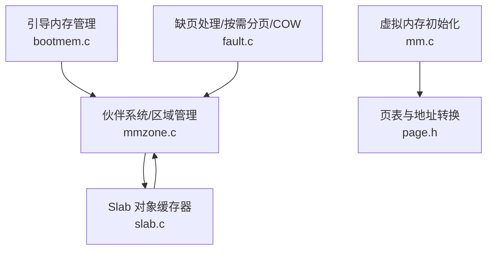
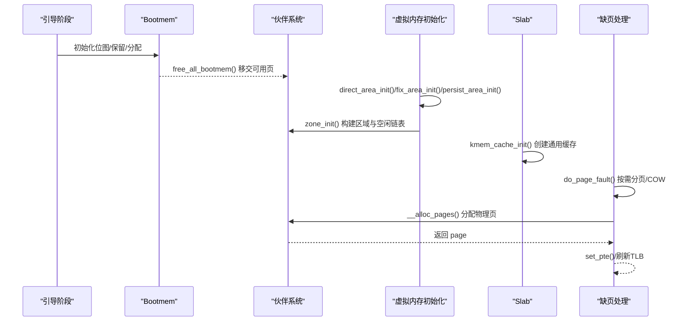
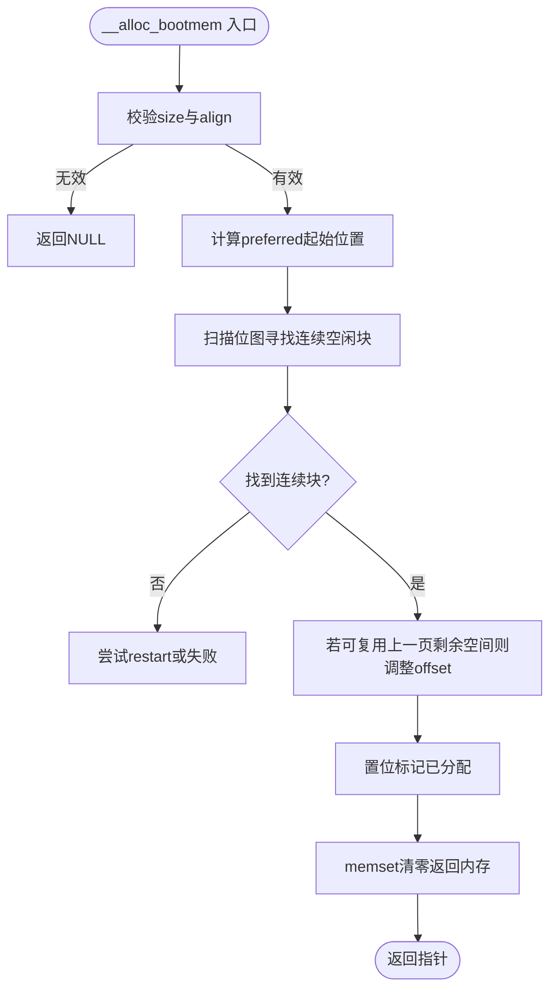
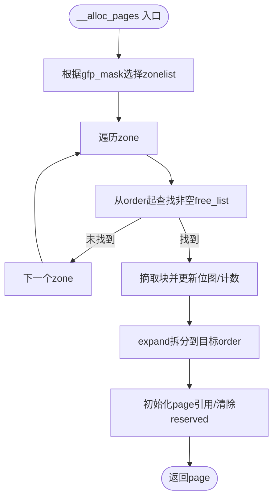
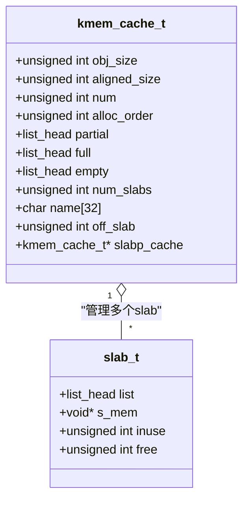
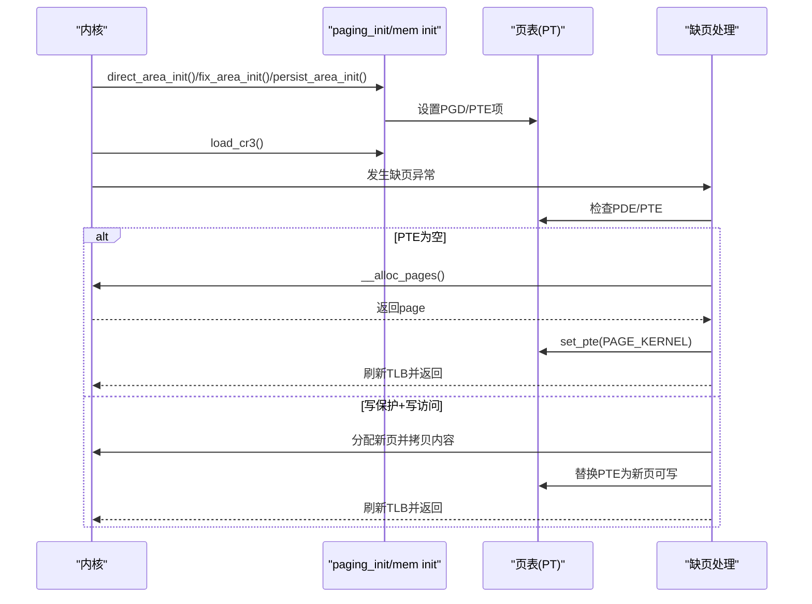
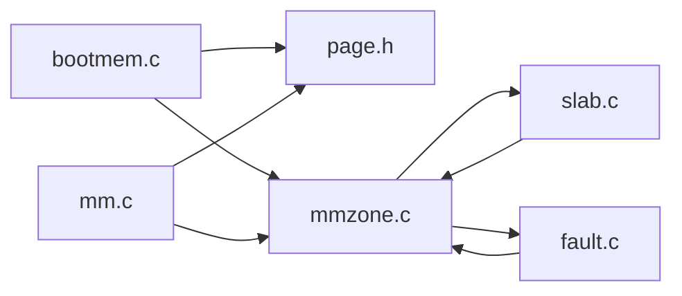
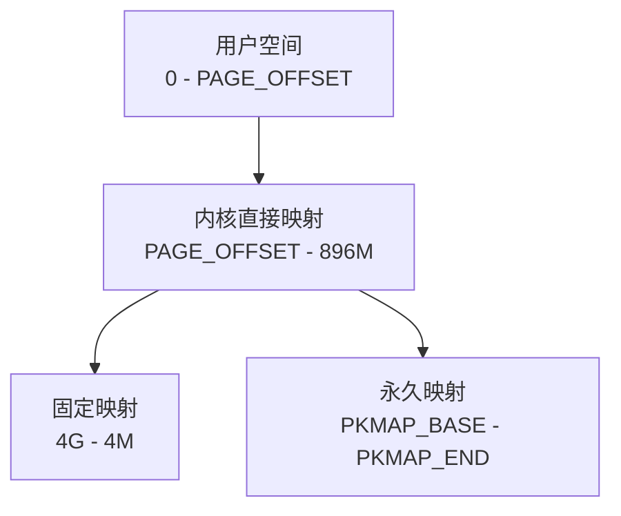
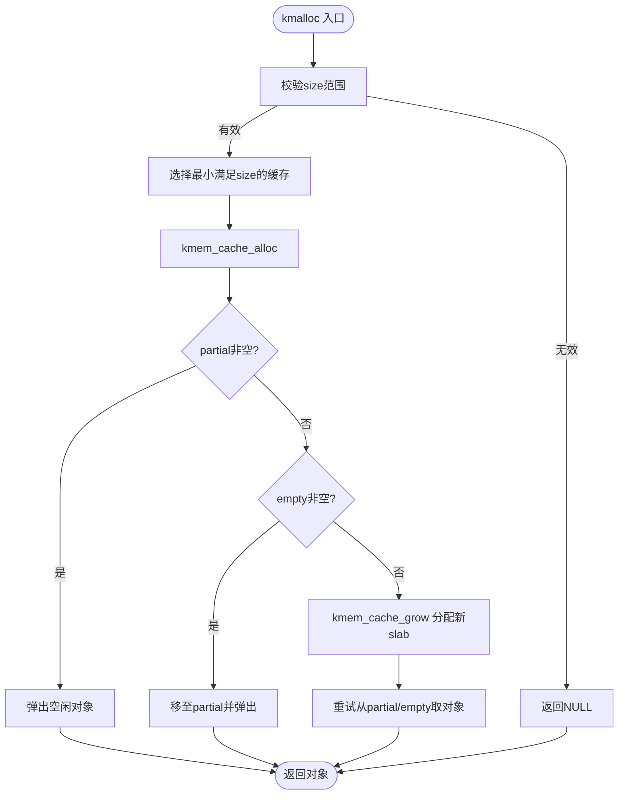

# 内存管理系统

<cite>
**本文引用的文件**
- [bootmem.c](file://kernel/mm/bootmem.c)
- [slab.c](file://kernel/mm/slab.c)
- [mm.c](file://arch/x86/kernel/mm/mm.c)
- [mmzone.c](file://kernel/mm/mmzone.c)
- [fault.c](file://arch/x86/kernel/mm/fault.c)
- [mm.h](file://includes/mm/mm.h)
- [bootmem.h](file://includes/mm/bootmem.h)
- [slab.h](file://includes/mm/slab.h)
- [mmzone.h](file://includes/mm/mmzone.h)
- [page.h](file://includes/arch/x86/page.h)
</cite>

## 目录
1. [简介](#简介)
2. [项目结构](#项目结构)
3. [核心组件](#核心组件)
4. [架构总览](#架构总览)
5. [详细组件分析](#详细组件分析)
6. [依赖关系分析](#依赖关系分析)
7. [性能考虑](#性能考虑)
8. [故障排查指南](#故障排查指南)
9. [结论](#结论)
10. [附录](#附录)

## 简介
本文件系统性地梳理 LulaOS 的内存管理子系统，覆盖引导期内存管理、伙伴系统页面分配器、Slab 对象缓存器、虚拟内存机制（页表管理、地址转换、内存映射），以及通用分配接口 kmalloc/kfree 的使用与最佳实践。文档同时提供内存布局图与关键分配流程图，并给出内存泄漏检测与优化建议，面向驱动程序开发者与系统程序员。

## 项目结构
LulaOS 的内存管理相关代码主要分布在以下位置：
- 引导期内存管理：kernel/mm/bootmem.c + includes/mm/bootmem.h
- 伙伴系统与区域管理：kernel/mm/mmzone.c + includes/mm/mmzone.h
- 虚拟内存初始化与页表建立：arch/x86/kernel/mm/mm.c + includes/arch/x86/page.h
- Slab 对象缓存器：kernel/mm/slab.c + includes/mm/slab.h
- 缺页异常与按需分页/COW：arch/x86/kernel/mm/fault.c
- 页描述符与标志位：includes/mm/mm.h

图表来源
- [bootmem.c:12-28](file://kernel/mm/bootmem.c#L12-L28)
- [mmzone.c:61-150](file://kernel/mm/mmzone.c#L61-L150)
- [slab.c:249-296](file://kernel/mm/slab.c#L249-L296)
- [mm.c:117-134](file://arch/x86/kernel/mm/mm.c#L117-L134)
- [page.h:5-42](file://includes/arch/x86/page.h#L5-L42)
- [fault.c:96-171](file://arch/x86/kernel/mm/fault.c#L96-L171)

章节来源
- [bootmem.c:12-28](file://kernel/mm/bootmem.c#L12-L28)
- [mmzone.c:61-150](file://kernel/mm/mmzone.c#L61-L150)
- [slab.c:249-296](file://kernel/mm/slab.c#L249-L296)
- [mm.c:117-134](file://arch/x86/kernel/mm/mm.c#L117-L134)
- [page.h:5-42](file://includes/arch/x86/page.h#L5-L42)
- [fault.c:96-171](file://arch/x86/kernel/mm/fault.c#L96-L171)

## 核心组件
- 引导内存管理（Bootmem）：在早期阶段使用位图管理物理页，支持保留、释放与分配，并在合适时机将可用页移交伙伴系统。
- 伙伴系统（Buddy System）：维护多阶空闲块链表与位图，实现高效合并/拆分，支持不同阶的页面分配与释放。
- Slab 缓存器：为小对象分配提供高性能缓存，支持 ON_SLAB/OFF_SLAB 两种模式，内置通用大小缓存供 kmalloc/kfree 使用。
- 虚拟内存与页表：建立直接映射区、固定映射区与永久映射区；支持按需分页与写时复制（COW）。
- 通用分配接口：kmalloc/kfree 基于 Slab 的通用缓存，屏蔽底层细节，提供对齐与快速路径。

章节来源
- [bootmem.c:12-28](file://kernel/mm/bootmem.c#L12-L28)
- [mmzone.c:248-329](file://kernel/mm/mmzone.c#L248-L329)
- [slab.c:504-585](file://kernel/mm/slab.c#L504-L585)
- [mm.c:24-134](file://arch/x86/kernel/mm/mm.c#L24-L134)
- [fault.c:96-171](file://arch/x86/kernel/mm/fault.c#L96-L171)

## 架构总览
下图展示了从启动到运行期的内存管理流程：引导期通过 bootmem 管理物理页，随后迁移至伙伴系统；虚拟内存初始化建立内核直接映射、固定映射和永久映射；运行时通过 Slab 进行小对象分配；缺页异常触发按需分页或 COW。

图表来源
- [bootmem.c:194-223](file://kernel/mm/bootmem.c#L194-L223)
- [mm.c:117-134](file://arch/x86/kernel/mm/mm.c#L117-L134)
- [mmzone.c:61-150](file://kernel/mm/mmzone.c#L61-L150)
- [slab.c:249-296](file://kernel/mm/slab.c#L249-L296)
- [fault.c:184-251](file://arch/x86/kernel/mm/fault.c#L184-L251)

## 详细组件分析

### 引导内存管理（Bootmem）
- 设计要点
  - 使用位图记录物理页可用性，支持 reserve/free/alloc。
  - 分配时优先满足对齐与目标地址（goal），并尽量复用上一块的剩余空间以减少碎片。
  - 完成过渡后调用 free_all_bootmem() 将可用页加入伙伴系统，并回收位图页。
- 关键流程
  - init_bootmem：设置节点起始/结束pfn，分配并清零位图。
  - reserve_bootmem/free_bootmem：置位/清位标记不可用/可用。
  - __alloc_bootmem：按对齐与goal搜索连续空闲块，必要时跨页扩展；成功后置位并清零返回内存。
  - free_all_bootmem：遍历位图，将可用页清除保留标志、计数置1并交给伙伴系统；回收位图页。

图表来源
- [bootmem.c:76-177](file://kernel/mm/bootmem.c#L76-L177)
- [bootmem.c:194-223](file://kernel/mm/bootmem.c#L194-L223)

章节来源
- [bootmem.c:12-28](file://kernel/mm/bootmem.c#L12-L28)
- [bootmem.c:33-71](file://kernel/mm/bootmem.c#L33-L71)
- [bootmem.c:76-177](file://kernel/mm/bootmem.c#L76-L177)
- [bootmem.c:194-223](file://kernel/mm/bootmem.c#L194-L223)

### 伙伴系统（Buddy System）
- 设计要点
  - 每个 zone 维护 MAX_ORDER 个空闲区域，包含链表与位图。
  - 分配时从请求阶向上查找空闲块，找到后进行 expand 拆分为目标阶，并将多余半块插入低阶空闲链表。
  - 释放时尝试与伙伴合并，直至无法合并或达到最大阶。
- 关键流程
  - __alloc_pages：选择 zonelist → 遍历 zone → 从 order 起查找空闲块 → 摘取并 expand → 初始化 page 并返回。
  - __free_pages_ok：校验对齐与状态 → 计算伙伴索引 → 循环合并 → 插入高阶空闲链表。
  - zone_init：分配 mem_map，初始化各 zone 的空闲链表与位图，设置页 virtual 映射。

图表来源
- [mmzone.c:248-329](file://kernel/mm/mmzone.c#L248-L329)
- [mmzone.c:153-219](file://kernel/mm/mmzone.c#L153-L219)
- [mmzone.c:61-150](file://kernel/mm/mmzone.c#L61-L150)

章节来源
- [mmzone.c:61-150](file://kernel/mm/mmzone.c#L61-L150)
- [mmzone.c:153-219](file://kernel/mm/mmzone.c#L153-L219)
- [mmzone.c:248-329](file://kernel/mm/mmzone.c#L248-L329)

### Slab 对象缓存器
- 设计要点
  - 静态描述符池避免“鸡生蛋”问题；全局链表便于调试统计。
  - 通用缓存 malloc_caches[] 提供 32/64/.../8192 字节尺寸，kmalloc/kfree 从中选取最小满足尺寸的缓存。
  - 支持 ON_SLAB（描述符嵌入页首）与 OFF_SLAB（描述符独立分配，页全用于对象），大对象启用 OFF_SLAB 保证 8KB 对齐。
- 关键流程
  - kmem_cache_create：计算 aligned_size、num、order，决定是否 OFF_SLAB，登记到全局链表。
  - kmem_cache_alloc：partial → empty → grow（向伙伴系统申请新 slab）→ 弹出空闲对象。
  - kmem_cache_free：通过 virt_to_page + page->virtual 反查 slab，插入空闲链表头，移动 slab 所在链表（full/partial/empty）。
  - kmalloc/kfree：选择合适缓存并调用 alloc/free；kfree 需扫描 malloc_caches[] 匹配对象归属。

图表来源
- [slab.h:45-86](file://includes/mm/slab.h#L45-L86)
- [slab.c:130-199](file://kernel/mm/slab.c#L130-L199)
- [slab.c:249-296](file://kernel/mm/slab.c#L249-L296)
- [slab.c:392-450](file://kernel/mm/slab.c#L392-L450)
- [slab.c:459-502](file://kernel/mm/slab.c#L459-L502)
- [slab.c:518-585](file://kernel/mm/slab.c#L518-L585)

章节来源
- [slab.c:9-47](file://kernel/mm/slab.c#L9-L47)
- [slab.c:130-199](file://kernel/mm/slab.c#L130-L199)
- [slab.c:249-296](file://kernel/mm/slab.c#L249-L296)
- [slab.c:392-450](file://kernel/mm/slab.c#L392-L450)
- [slab.c:459-502](file://kernel/mm/slab.c#L459-L502)
- [slab.c:518-585](file://kernel/mm/slab.c#L518-L585)

### 虚拟内存管理与页表
- 设计要点
  - 直接映射区：0–896M 建立内核直接映射，便于物理地址与虚拟地址互转。
  - 固定映射区：4G-4M 区域预留固定映射，用于设备寄存器访问等。
  - 永久映射区：PKMAP_BASE 开始的 4M 区域，用于临时映射高端内存。
  - 按需分页与 COW：缺页时分配物理页并建立 PTE；写保护写访问时复制旧页内容到新页并替换 PTE。
- 关键流程
  - paging_init：direct_area_init → fix_area_init → persist_area_init → load_cr3 → fixed_kmap_init → zone_init。
  - mm_init：free_all_bootmem → 统计保留页 → 处理高端内存 → 打印统计信息。
  - fault.c：do_page_fault → handle_pde_fault/handle_pte_fault → 按需分页或 COW。

图表来源
- [mm.c:24-134](file://arch/x86/kernel/mm/mm.c#L24-L134)
- [mm.c:145-205](file://arch/x86/kernel/mm/mm.c#L145-L205)
- [fault.c:96-171](file://arch/x86/kernel/mm/fault.c#L96-L171)
- [fault.c:184-251](file://arch/x86/kernel/mm/fault.c#L184-L251)
- [page.h:5-42](file://includes/arch/x86/page.h#L5-L42)

章节来源
- [mm.c:24-134](file://arch/x86/kernel/mm/mm.c#L24-L134)
- [mm.c:145-205](file://arch/x86/kernel/mm/mm.c#L145-L205)
- [fault.c:96-171](file://arch/x86/kernel/mm/fault.c#L96-L171)
- [fault.c:184-251](file://arch/x86/kernel/mm/fault.c#L184-L251)
- [page.h:5-42](file://includes/arch/x86/page.h#L5-L42)

### 内存分配接口（kmalloc/kfree）使用方法与最佳实践
- 使用方法
  - kmalloc(size, flags)：从通用缓存中选择最小满足 size 的缓存分配；flags 当前未区分（预留 GFP_KERNEL/GFP_ATOMIC）。
  - kfree(obj)：自动识别对象所属缓存并归还；对 NULL 安全。
- 最佳实践
  - 控制分配粒度：尽量使用合适大小的缓存，避免过大导致浪费或过小导致频繁扩容。
  - 注意对齐需求：kmalloc 返回的地址满足对齐要求，适合线程栈（THREAD_SIZE=8KB）场景。
  - 及时释放：确保每处 kmalloc 都有对应 kfree，避免泄漏。
  - 原子上下文：在不可睡眠上下文应谨慎使用可能阻塞的分配（当前实现未区分，但未来扩展需注意）。

章节来源
- [slab.c:518-585](file://kernel/mm/slab.c#L518-L585)
- [slab.h:121-144](file://includes/mm/slab.h#L121-L144)

## 依赖关系分析
- 模块耦合
  - bootmem 依赖 mmzone（通过 contig_page_data.bdata）与 page.h（地址转换）。
  - 伙伴系统依赖 mmzone 数据结构与 spinlock，被 slab 与 fault 使用。
  - slab 依赖伙伴系统获取 slab 页，并通过 mm.h 中的 page 标志位管理 slab 页。
  - 虚拟内存初始化依赖 bootmem 分配页表页，最终加载 CR3 切换页表。
  - 缺页处理依赖伙伴系统分配物理页，并通过 page.h 宏操作页表项。
- 外部依赖
  - 页表操作宏与类型定义集中在 page.h。
  - 自旋锁与原子操作来自 arch/x86 子目录。

图表来源
- [bootmem.c:1-6](file://kernel/mm/bootmem.c#L1-L6)
- [mmzone.c:1-12](file://kernel/mm/mmzone.c#L1-L12)
- [slab.c:1-7](file://kernel/mm/slab.c#L1-L7)
- [fault.c:1-10](file://arch/x86/kernel/mm/fault.c#L1-L10)
- [mm.c:1-9](file://arch/x86/kernel/mm/mm.c#L1-L9)
- [page.h:1-47](file://includes/arch/x86/page.h#L1-L47)

章节来源
- [bootmem.c:1-6](file://kernel/mm/bootmem.c#L1-L6)
- [mmzone.c:1-12](file://kernel/mm/mmzone.c#L1-L12)
- [slab.c:1-7](file://kernel/mm/slab.c#L1-L7)
- [fault.c:1-10](file://arch/x86/kernel/mm/fault.c#L1-L10)
- [mm.c:1-9](file://arch/x86/kernel/mm/mm.c#L1-L9)
- [page.h:1-47](file://includes/arch/x86/page.h#L1-L47)

## 性能考虑
- 分配路径优化
  - Slab 优先从 partial 链表取对象，减少伙伴系统调用次数。
  - 大对象启用 OFF_SLAB，提升对齐与利用率，减少页内头部开销。
- 合并策略
  - 伙伴系统在释放时尽可能合并，降低碎片，提高大块分配成功率。
- 按需分页
  - 仅在访问时分配物理页，减少启动开销与内存占用。
- 建议
  - 合理预估对象大小，选择合适的缓存尺寸，避免过度碎片化。
  - 批量分配/释放可降低锁竞争与系统调用开销。
  - 监控 OOM 日志，及时调整分配策略或增大内存。

## 故障排查指南
- 常见问题
  - OOM：当伙伴系统无法满足分配请求时，打印错误并返回 NULL。
  - 非法访问：用户态访问未分配区域或内核态写保护违规，进入 panic。
  - ioremap 区域缺页：该区域必须由 ioremap 主动建立映射，禁止走按需分页。
- 诊断步骤
  - 查看 OOM 日志与堆栈，定位分配点与所需阶数。
  - 检查是否重复释放或未释放，结合 Slab 统计与全局缓存链表。
  - 确认 ioremap 区域是否正确建立映射，避免误入按需分页分支。
- 工具与技巧
  - 利用 printk 输出关键路径信息（如 cache 创建、分配失败）。
  - 使用 GDB/QEMU/Bochs 断点跟踪缺页与分配流程。

章节来源
- [fault.c:96-171](file://arch/x86/kernel/mm/fault.c#L96-L171)
- [fault.c:184-251](file://arch/x86/kernel/mm/fault.c#L184-L251)
- [slab.c:518-585](file://kernel/mm/slab.c#L518-L585)

## 结论
LulaOS 的内存管理采用分层设计：引导期由 bootmem 管理物理页，随后移交伙伴系统进行高效分配；Slab 提供小对象缓存以优化性能；虚拟内存层建立直接映射与按需分页，支持 COW。整体架构清晰、可扩展性强，适合驱动与系统开发。通过合理的分配策略与监控手段，可有效避免内存泄漏与性能瓶颈。

## 附录

### 内存布局图
- 内核直接映射区：0–896M（PAGE_OFFSET 开始）
- 固定映射区：4G-4M
- 永久映射区：PKMAP_BASE 开始的 4M
- 用户空间：0–PAGE_OFFSET

图表来源
- [mm.c:24-134](file://arch/x86/kernel/mm/mm.c#L24-L134)
- [page.h:5-42](file://includes/arch/x86/page.h#L5-L42)

### 分配流程图（kmalloc）

图表来源
- [slab.c:518-585](file://kernel/mm/slab.c#L518-L585)
- [slab.c:392-450](file://kernel/mm/slab.c#L392-L450)
- [slab.c:130-199](file://kernel/mm/slab.c#L130-L199)