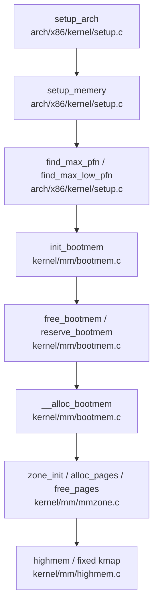
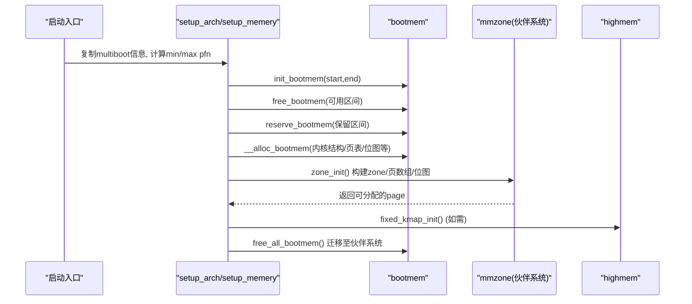
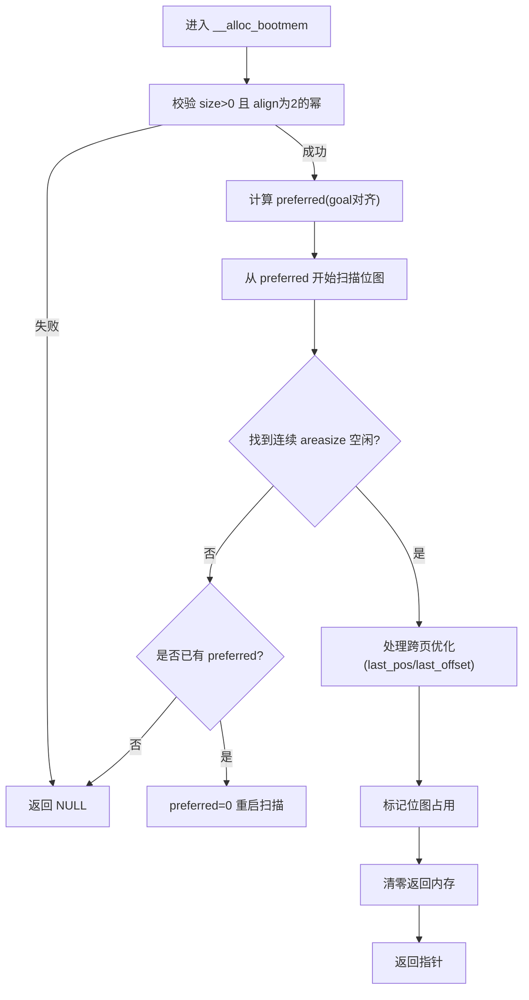
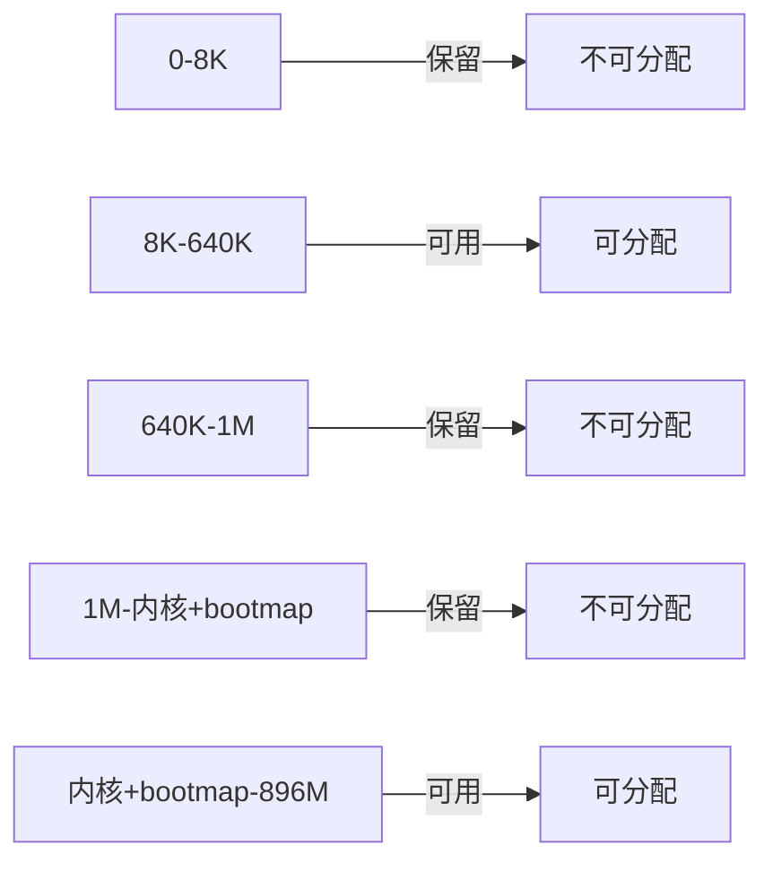
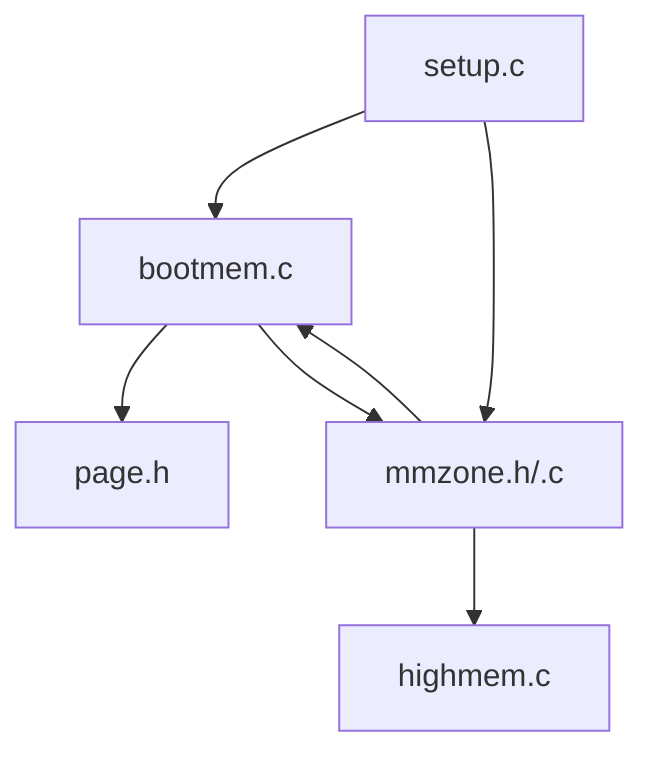

# 引导内存管理

<cite>
**本文引用的文件**
- [kernel/mm/bootmem.c](file://kernel/mm/bootmem.c)
- [includes/mm/bootmem.h](file://includes/mm/bootmem.h)
- [kernel/mm/mmzone.c](file://kernel/mm/mmzone.c)
- [includes/mm/mmzone.h](file://includes/mm/mmzone.h)
- [arch/x86/kernel/setup.c](file://arch/x86/kernel/setup.c)
- [includes/arch/x86/page.h](file://includes/arch/x86/page.h)
- [kernel/mm/highmem.c](file://kernel/mm/highmem.c)
</cite>

## 目录
1. [简介](#简介)
2. [项目结构](#项目结构)
3. [核心组件](#核心组件)
4. [架构总览](#架构总览)
5. [详细组件分析](#详细组件分析)
6. [依赖关系分析](#依赖关系分析)
7. [性能考虑](#性能考虑)
8. [故障排查指南](#故障排查指南)
9. [结论](#结论)
10. [附录](#附录)

## 简介
本文面向LulaOS的引导阶段内存管理系统，系统性阐述从启动到伙伴系统就绪前的内存管理机制。重点覆盖：
- init_bootmem初始化过程与位图管理
- __alloc_bootmem分配算法（对齐、首选地址goal、连续页分配策略）
- reserve_bootmem与free_bootmem的工作机制
- 引导期内存布局与迁移至伙伴系统的流程
- 最佳实践与常见问题定位

## 项目结构
围绕引导内存管理的核心代码分布在以下模块：
- 引导位图与分配器：kernel/mm/bootmem.c、includes/mm/bootmem.h
- 区域/节点与伙伴系统接口：kernel/mm/mmzone.c、includes/mm/mmzone.h
- 架构相关页表/页操作宏：includes/arch/x86/page.h
- 启动流程与内存拓扑发现：arch/x86/kernel/setup.c
- 高内存映射支持：kernel/mm/highmem.c

图表来源
- [arch/x86/kernel/setup.c:182-196](file://arch/x86/kernel/setup.c#L182-L196)
- [kernel/mm/bootmem.c:12-28](file://kernel/mm/bootmem.c#L12-L28)
- [kernel/mm/mmzone.c:61-150](file://kernel/mm/mmzone.c#L61-L150)

章节来源
- [arch/x86/kernel/setup.c:182-196](file://arch/x86/kernel/setup.c#L182-L196)
- [kernel/mm/bootmem.c:12-28](file://kernel/mm/bootmem.c#L12-L28)
- [kernel/mm/mmzone.c:61-150](file://kernel/mm/mmzone.c#L61-L150)

## 核心组件
- 引导位图数据结构与全局状态
  - bootmem_data_t：记录引导位图起始、低区上限、最近一次分配位置与偏移等
  - contig_page_data：单节点pg_data_t，包含bdata指针
- 引导分配器API
  - init_bootmem：初始化位图范围并清零标记
  - reserve_bootmem/free_bootmem：设置/清除位图位，表示保留或可用
  - __alloc_bootmem：按对齐和goal优先分配连续页
  - alloc_bootmem_low_pages：便捷封装，固定对齐为页大小
  - free_all_bootmem：将剩余可用页回收至伙伴系统，并释放位图页
- 区域与伙伴系统
  - zone_init：划分ZONE_DMA/ZONE_NORMAL/ZONE_HIGHMEM，构建zonelist，分配page数组与位图
  - __alloc_pages/__free_pages：伙伴分配/回收，含合并与拆分逻辑

章节来源
- [includes/mm/bootmem.h:12-27](file://includes/mm/bootmem.h#L12-L27)
- [kernel/mm/bootmem.c:12-223](file://kernel/mm/bootmem.c#L12-L223)
- [includes/mm/mmzone.h:24-80](file://includes/mm/mmzone.h#L24-L80)
- [kernel/mm/mmzone.c:61-329](file://kernel/mm/mmzone.c#L61-L329)

## 架构总览
引导阶段的内存管理分为两阶段：
- 阶段一：使用bootmem位图进行简单、快速的连续页分配，用于内核自身关键结构（如page数组、位图、早期缓冲）。
- 阶段二：当伙伴系统就绪后，将bootmem位图中仍可用的页面迁移到伙伴系统，并释放位图本身，完成过渡。

图表来源
- [arch/x86/kernel/setup.c:201-214](file://arch/x86/kernel/setup.c#L201-L214)
- [kernel/mm/bootmem.c:12-223](file://kernel/mm/bootmem.c#L12-L223)
- [kernel/mm/mmzone.c:61-150](file://kernel/mm/mmzone.c#L61-L150)
- [kernel/mm/highmem.c:43-48](file://kernel/mm/highmem.c#L43-L48)

## 详细组件分析

### 引导位图与初始化：init_bootmem
- 作用：确定低区边界（min_low_pfn/max_low_pfn），在低区起始处分配位图空间，并将所有位初始化为“已保留”，随后由调用方对可用区间调用free_bootmem置为可用。
- 关键点：
  - 位图大小按(end-0)/8向上取整并按long对齐
  - 位图物理基址位于PFN_PHYS(start)，通过__va转为虚拟地址
  - 全部置1，表示默认不可用，需显式free

章节来源
- [kernel/mm/bootmem.c:12-28](file://kernel/mm/bootmem.c#L12-L28)
- [includes/arch/x86/page.h:16-19](file://includes/arch/x86/page.h#L16-L19)

### 保留与释放：reserve_bootmem / free_bootmem
- reserve_bootmem(addr,size)：将指定范围的页对应位设置为1（不可用）
- free_bootmem(addr,size)：将指定范围的页对应位设置为0（可用）
- 边界检查：确保不越界node_low_pfn；starti/endi有效范围校验

章节来源
- [kernel/mm/bootmem.c:33-71](file://kernel/mm/bootmem.c#L33-L71)

### 分配器：__alloc_bootmem(size, align, goal)
- 输入约束：size>0且align为2的幂
- 首选地址preferred：若goal在有效范围内，则对其按align对齐作为起点
- 扫描策略：
  - 从preferred开始顺序扫描位图，寻找连续areasize个未占用位
  - 找到后进入分配路径；否则回退preferred=0再扫一遍
- 连续页分配与跨页优化：
  - areasize = PFN_UP(size)
  - 增量incr = max(1, align/PAGE_SIZE)
  - 若上次分配未用完一页（last_pos/last_offset），尝试在同一页内继续分配以满足对齐
- 成功后：
  - 标记位图为已占用
  - 清零返回内存
  - 更新last_pos/last_offset以加速后续小对象分配

图表来源
- [kernel/mm/bootmem.c:76-177](file://kernel/mm/bootmem.c#L76-L177)

章节来源
- [kernel/mm/bootmem.c:76-177](file://kernel/mm/bootmem.c#L76-L177)

### 迁移与收尾：free_all_bootmem
- 遍历位图，将所有未占用的页：
  - 清除保留标志
  - 设置引用计数为1
  - 通过__free_page加入伙伴系统空闲链表
- 释放位图本身的页，同样加入伙伴系统
- 返回迁移的页数

章节来源
- [kernel/mm/bootmem.c:194-223](file://kernel/mm/bootmem.c#L194-L223)

### 伙伴系统与区域初始化：zone_init / __alloc_pages / __free_pages
- zone_init：
  - 计算各zone大小（DMA/Normal/HighMem）
  - 分配并初始化page数组（mem_map）
  - 为每个zone分配位图（除最高阶）
  - 构建zonelist，供后续分配选择zone
- __alloc_pages：
  - 根据gfp_mask选择zonelist
  - 从目标order向上查找空闲块
  - 拆分大块至所需order，维护位图与free_pages计数
- __free_pages：
  - 清理脏/引用标志
  - 尝试与伙伴合并，提升阶数
  - 插入更高阶空闲链表

章节来源
- [kernel/mm/mmzone.c:61-150](file://kernel/mm/mmzone.c#L61-L150)
- [kernel/mm/mmzone.c:152-240](file://kernel/mm/mmzone.c#L152-L240)
- [kernel/mm/mmzone.c:248-329](file://kernel/mm/mmzone.c#L248-L329)

### 启动期内存布局
- setup_bootmem_allocator中注释描述了典型布局（不含APIC等非Ram区域）：
  - 0-8K：不可分配
  - 8K-640K：可分配（可能含APIC配置等）
  - 640K-1M：不可分配（图形卡+BIOS）
  - 1M-(1M+内核大小+bootmem大小)：不可分配
  - (1M+内核大小+bootmem大小)-896M：可分配

图表来源
- [arch/x86/kernel/setup.c:162-176](file://arch/x86/kernel/setup.c#L162-L176)

章节来源
- [arch/x86/kernel/setup.c:123-176](file://arch/x86/kernel/setup.c#L123-L176)

## 依赖关系分析
- bootmem依赖：
  - mmzone中的contig_page_data.bdata与node_mem_map
  - arch/x86/page.h中的页操作宏（PFN_*/__va）
  - bitops原子位操作
- mmzone依赖：
  - bootmem用于分配page数组与位图
  - highmem提供固定映射能力（必要时）
- setup依赖：
  - multiboot内存映射，解析可用区间
  - 调用bootmem与mmzone完成初始化

图表来源
- [kernel/mm/bootmem.c:1-6](file://kernel/mm/bootmem.c#L1-L6)
- [kernel/mm/mmzone.c:1-12](file://kernel/mm/mmzone.c#L1-L12)
- [arch/x86/kernel/setup.c:1-11](file://arch/x86/kernel/setup.c#L1-L11)

章节来源
- [kernel/mm/bootmem.c:1-6](file://kernel/mm/bootmem.c#L1-L6)
- [kernel/mm/mmzone.c:1-12](file://kernel/mm/mmzone.c#L1-L12)
- [arch/x86/kernel/setup.c:1-11](file://arch/x86/kernel/setup.c#L1-L11)

## 性能考虑
- 位图扫描复杂度：__alloc_bootmem在最坏情况下为O(N)扫描，N为可用页数量；建议尽量使用goal减少扫描距离
- 连续分配优化：last_pos/last_offset缓存避免频繁跨页，提高小对象分配效率
- 伙伴系统迁移：free_all_bootmem一次性迁移，减少后续开销
- 位图对齐：按long对齐减少访问开销

[本节为通用指导，不直接分析具体文件]

## 故障排查指南
- 分配失败（返回NULL）
  - 检查size是否为0或align非2的幂
  - 检查goal是否在有效范围内
  - 确认位图未被错误地全部置1（即没有调用free_bootmem）
- 越界访问
  - reserve/free时end_pfn > node_low_pfn会直接返回，需核对传入参数
  - 注意PFN_UP/PFN_DOWN转换导致的边界差异
- 重复释放/未释放
  - 确保reserve与free成对出现，避免位图状态不一致
  - 迁移前不要手动修改位图
- 伙伴系统崩溃
  - 检查__free_pages的PageReserved与LRU标志
  - 确认合并时的buddy索引与mask计算正确

章节来源
- [kernel/mm/bootmem.c:76-177](file://kernel/mm/bootmem.c#L76-L177)
- [kernel/mm/bootmem.c:33-71](file://kernel/mm/bootmem.c#L33-L71)
- [kernel/mm/mmzone.c:152-240](file://kernel/mm/mmzone.c#L152-L240)

## 结论
LulaOS在引导阶段采用简洁高效的bootmem位图分配器，配合setup阶段的内存拓扑发现，快速满足内核早期结构的分配需求。待伙伴系统就绪后，通过free_all_bootmem平滑迁移，释放位图并统一交由伙伴系统管理。该设计兼顾了启动速度与实现复杂度，适合早期内核阶段的高效内存管理。

[本节为总结性内容，不直接分析具体文件]

## 附录

### 关键函数与职责速查
- init_bootmem：初始化位图范围与状态
- reserve_bootmem/free_bootmem：位图位设置/清除
- __alloc_bootmem：对齐、goal优先、连续页分配与跨页优化
- free_all_bootmem：迁移至伙伴系统并释放位图页
- zone_init/__alloc_pages/__free_pages：伙伴系统初始化与分配/回收

章节来源
- [includes/mm/bootmem.h:22-27](file://includes/mm/bootmem.h#L22-L27)
- [kernel/mm/bootmem.c:12-223](file://kernel/mm/bootmem.c#L12-L223)
- [kernel/mm/mmzone.c:61-329](file://kernel/mm/mmzone.c#L61-L329)

### 内存布局与分配流程图（汇总）
- 引导期内存布局见上文“启动期内存布局”图示
- 分配流程见__alloc_bootmem流程图

[本节为概念性图示，不附加图表来源]