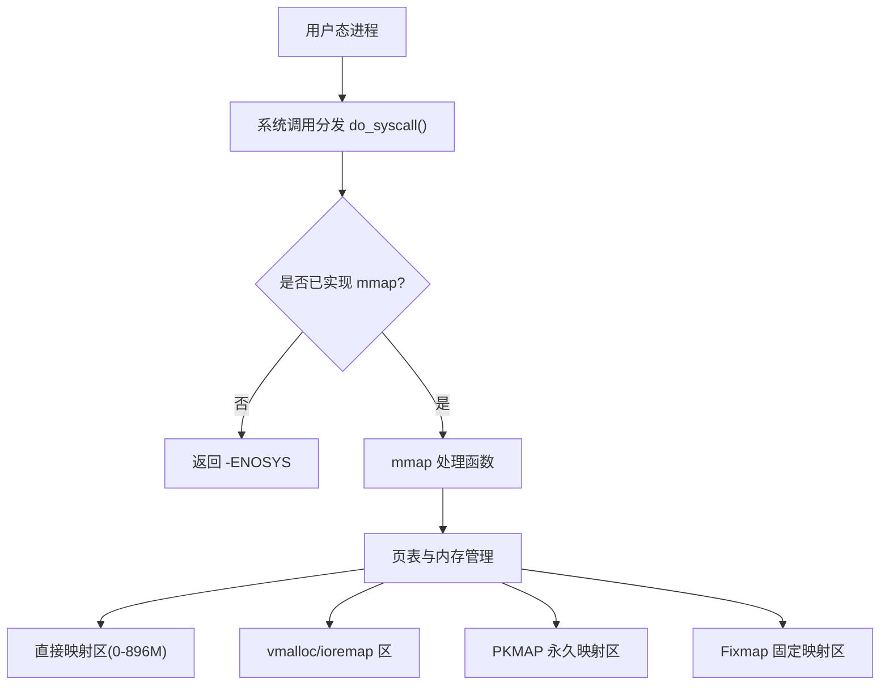
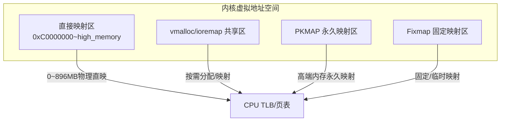
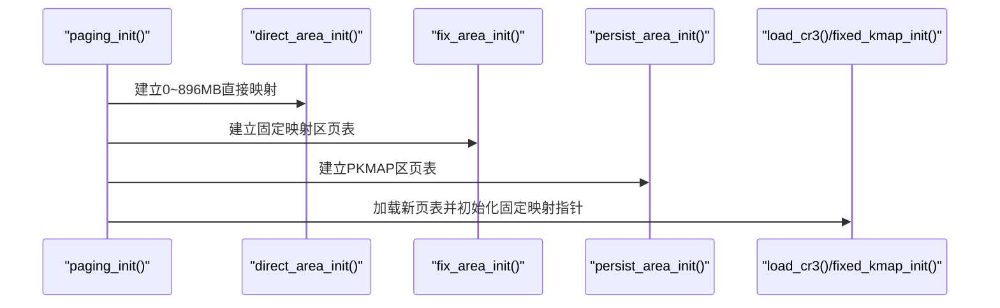
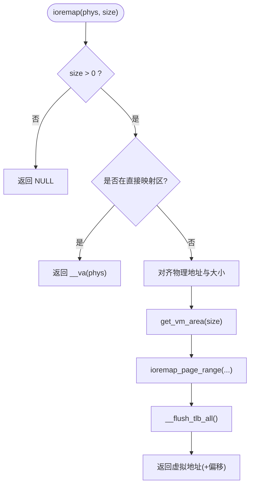
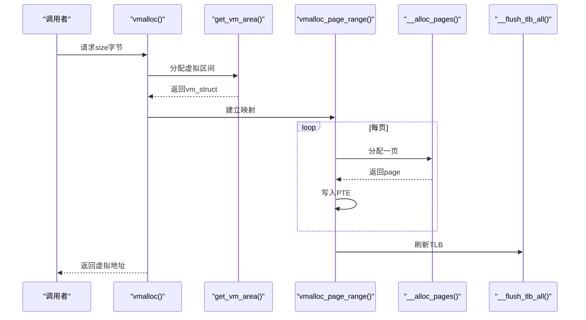
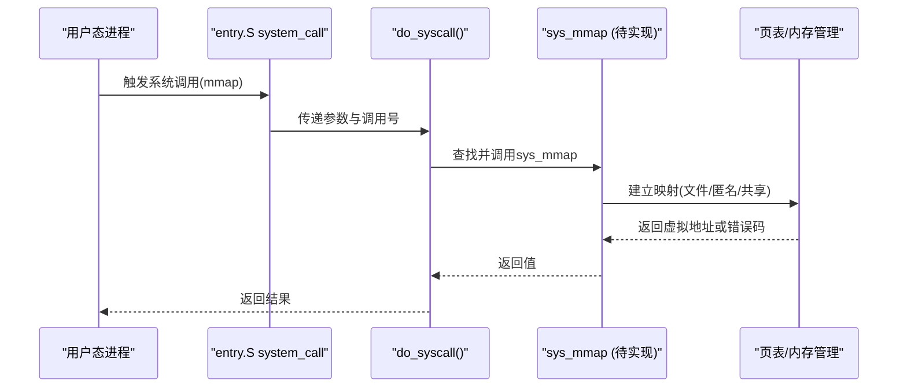
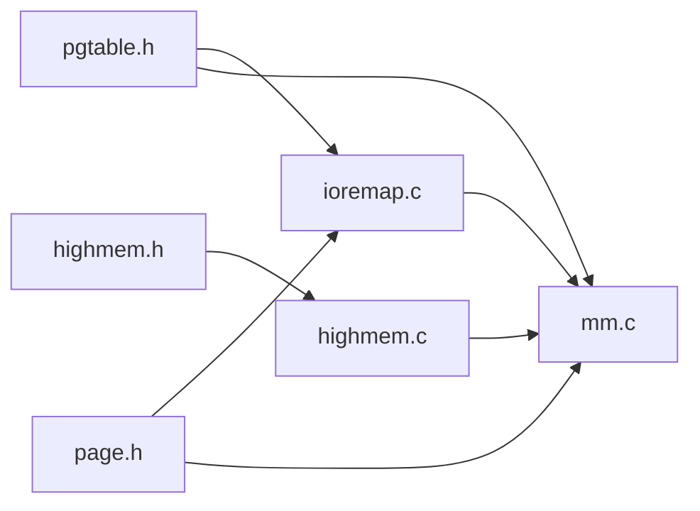
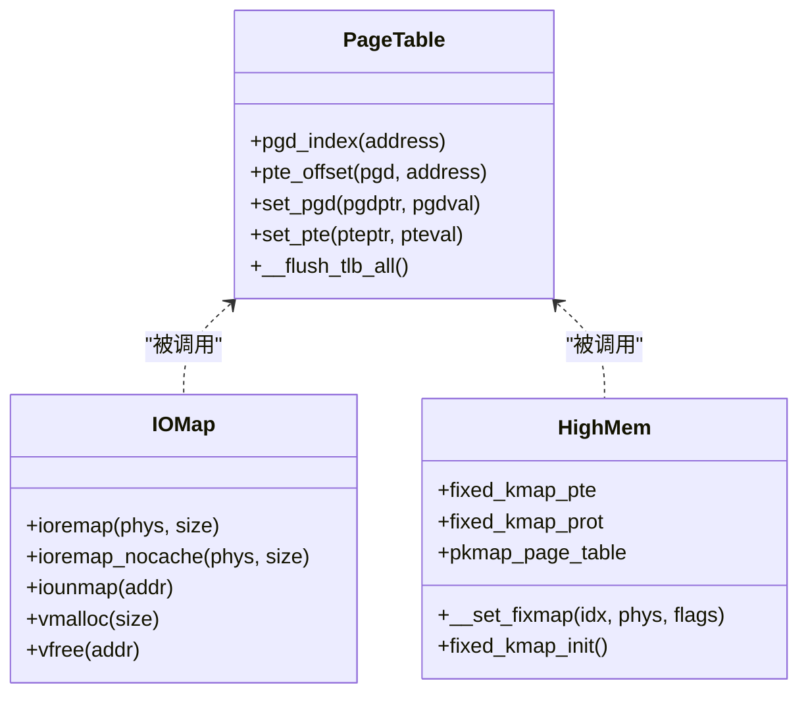

# 内存映射

<cite>
**本文引用的文件**
- [arch/x86/kernel/mm/ioremap.c](file://arch/x86/kernel/mm/ioremap.c)
- [kernel/mm/highmem.c](file://kernel/mm/highmem.c)
- [includes/arch/x86/highmem.h](file://includes/arch/x86/highmem.h)
- [arch/x86/kernel/mm/mm.c](file://arch/x86/kernel/mm/mm.c)
- [includes/arch/x86/pgtable.h](file://includes/arch/x86/pgtable.h)
- [includes/arch/x86/page.h](file://includes/arch/x86/page.h)
- [includes/mm/mm.h](file://includes/mm/mm.h)
- [kernel/syscall.c](file://kernel/syscall.c)
</cite>

## 目录
1. [简介](#简介)
2. [项目结构](#项目结构)
3. [核心组件](#核心组件)
4. [架构总览](#架构总览)
5. [详细组件分析](#详细组件分析)
6. [依赖关系分析](#依赖关系分析)
7. [性能考虑](#性能考虑)
8. [故障排查指南](#故障排查指南)
9. [结论](#结论)
10. [附录](#附录)

## 简介
本文件面向LulaOS的内存映射子系统，聚焦以下目标：
- 解释mmap系统调用的实现原理与使用方式（文件映射、匿名映射、共享内存映射）在LulaOS中的现状与扩展点。
- 详述高端内存（HighMem）管理机制，包括永久映射区（PKMAP）与固定映射区（Fixmap/临时映射）的区别与用途。
- 说明ioremap函数的实现，用于设备寄存器（MMIO）的内存映射。
- 阐述内存映射的保护机制（访问权限检查、地址验证）与生命周期管理（建立、使用、释放）。
- 提供最佳实践与性能优化建议，并给出架构图与API使用示例路径。

## 项目结构
LulaOS的内存映射相关代码主要分布在如下位置：
- 页表与基础页操作：includes/arch/x86/pgtable.h、includes/arch/x86/page.h
- 高端内存与固定映射：kernel/mm/highmem.c、includes/arch/x86/highmem.h
- 内核页表初始化与直接映射：arch/x86/kernel/mm/mm.c
- ioremap/vmalloc实现：arch/x86/kernel/mm/ioremap.c
- 系统调用框架（为后续mmap扩展提供入口）：kernel/syscall.c

图表来源
- [kernel/syscall.c:86-98](file://kernel/syscall.c#L86-L98)
- [arch/x86/kernel/mm/mm.c:117-134](file://arch/x86/kernel/mm/mm.c#L117-L134)
- [arch/x86/kernel/mm/ioremap.c:10-27](file://arch/x86/kernel/mm/ioremap.c#L10-L27)

章节来源
- [kernel/syscall.c:86-98](file://kernel/syscall.c#L86-L98)
- [arch/x86/kernel/mm/mm.c:117-134](file://arch/x86/kernel/mm/mm.c#L117-L134)
- [arch/x86/kernel/mm/ioremap.c:10-27](file://arch/x86/kernel/mm/ioremap.c#L10-L27)

## 核心组件
- 页表与保护位定义：包含PGD/PTE结构、保护位宏、TLB刷新接口等。
- 直接映射与区域初始化：建立0~896MB的直接映射、固定映射区、PKMAP区。
- 高端内存管理：标记和管理896MB~4GB的高端内存，提供固定映射与永久映射能力。
- ioremap/vmalloc：将物理地址或伙伴系统分配的物理页映射到内核虚拟地址空间。
- 系统调用框架：当前未实现mmap，但提供了可扩展的系统调用分发机制。

章节来源
- [includes/arch/x86/pgtable.h:24-63](file://includes/arch/x86/pgtable.h#L24-L63)
- [includes/arch/x86/pgtable.h:118-128](file://includes/arch/x86/pgtable.h#L118-L128)
- [arch/x86/kernel/mm/mm.c:24-134](file://arch/x86/kernel/mm/mm.c#L24-L134)
- [kernel/mm/highmem.c:6-48](file://kernel/mm/highmem.c#L6-L48)
- [arch/x86/kernel/mm/ioremap.c:230-283](file://arch/x86/kernel/mm/ioremap.c#L230-L283)
- [kernel/syscall.c:56-98](file://kernel/syscall.c#L56-L98)

## 架构总览
LulaOS采用两级页表（PGD→PTE），内核虚拟地址空间划分为多个区域：
- 直接映射区：0xC0000000 ~ high_memory（对应物理0~896MB）
- vmalloc/ioremap共享区：从fb_ioremap结束处按4MB对齐开始，至0xFE000000
- PKMAP永久映射区：0xFE000000 ~ 0xFE3FFFFF
- Fixmap固定映射区：0xFFC00000 ~ 0xFFFFE000

图表来源
- [arch/x86/kernel/mm/ioremap.c:10-27](file://arch/x86/kernel/mm/ioremap.c#L10-L27)
- [arch/x86/kernel/mm/mm.c:117-134](file://arch/x86/kernel/mm/mm.c#L117-L134)
- [includes/arch/x86/highmem.h:19-67](file://includes/arch/x86/highmem.h#L19-L67)

## 详细组件分析

### 高端内存（HighMem）与固定/永久映射
- 固定映射区（Fixmap）：位于内核高地址段，提供少量固定槽位用于临时映射，如FIX_KMAP_BEGIN/FIX_KMAP_END。通过__set_fixmap设置具体物理地址与保护位。
- 永久映射区（PKMAP）：用于长期持有对高端内存页的映射，由pkmap_page_table管理起始PTE。
- 初始化流程：paging_init中完成直接映射、固定映射区、PKMAP区初始化，并加载CR3、初始化fixed_kmap。

图表来源
- [arch/x86/kernel/mm/mm.c:117-134](file://arch/x86/kernel/mm/mm.c#L117-L134)
- [kernel/mm/highmem.c:43-48](file://kernel/mm/highmem.c#L43-L48)

章节来源
- [kernel/mm/highmem.c:6-48](file://kernel/mm/highmem.c#L6-L48)
- [includes/arch/x86/highmem.h:19-67](file://includes/arch/x86/highmem.h#L19-L67)
- [arch/x86/kernel/mm/mm.c:117-134](file://arch/x86/kernel/mm/mm.c#L117-L134)

### ioremap 设备寄存器映射
- 功能：将任意物理地址范围映射到内核虚拟地址空间，默认禁用缓存（_PAGE_PCD），适合MMIO访问。
- 流程要点：
  - 若物理地址在直接映射区（<896MB），直接返回__va结果。
  - 否则分配vm_struct记录虚拟区间，逐页建立PTE映射，刷新TLB。
  - 释放时通过iounmap遍历PTE清零并刷新TLB。

图表来源
- [arch/x86/kernel/mm/ioremap.c:230-283](file://arch/x86/kernel/mm/ioremap.c#L230-L283)
- [arch/x86/kernel/mm/ioremap.c:187-211](file://arch/x86/kernel/mm/ioremap.c#L187-L211)
- [includes/arch/x86/pgtable.h:118-128](file://includes/arch/x86/pgtable.h#L118-L128)

章节来源
- [arch/x86/kernel/mm/ioremap.c:230-283](file://arch/x86/kernel/mm/ioremap.c#L230-L283)
- [arch/x86/kernel/mm/ioremap.c:187-211](file://arch/x86/kernel/mm/ioremap.c#L187-L211)
- [includes/arch/x86/pgtable.h:118-128](file://includes/arch/x86/pgtable.h#L118-L128)

### vmalloc/vfree 虚拟连续、物理不连续内存
- 功能：分配虚拟连续、物理不连续的内存块，每页独立从伙伴系统分配，映射到vmalloc区。
- 流程要点：
  - get_vm_area分配虚拟区间并记录到vmlist链表。
  - vmalloc_page_range逐页分配物理页并建立PTE映射。
  - vfree遍历PTE回收物理页、清除PTE、刷新TLB并从链表移除。

图表来源
- [arch/x86/kernel/mm/ioremap.c:442-473](file://arch/x86/kernel/mm/ioremap.c#L442-L473)
- [arch/x86/kernel/mm/ioremap.c:365-426](file://arch/x86/kernel/mm/ioremap.c#L365-L426)
- [arch/x86/kernel/mm/ioremap.c:107-140](file://arch/x86/kernel/mm/ioremap.c#L107-L140)

章节来源
- [arch/x86/kernel/mm/ioremap.c:442-473](file://arch/x86/kernel/mm/ioremap.c#L442-L473)
- [arch/x86/kernel/mm/ioremap.c:365-426](file://arch/x86/kernel/mm/ioremap.c#L365-L426)
- [arch/x86/kernel/mm/ioremap.c:107-140](file://arch/x86/kernel/mm/ioremap.c#L107-L140)

### 系统调用与mmap扩展点
- 当前do_syscall仅注册了write、exit、getpid等内置调用，未实现mmap。
- 扩展mmap需：
  - 在syscall_init中注册mmap处理函数。
  - 实现mmap逻辑：参数校验、地址选择（用户态vs内核态）、页表映射（文件映射/匿名映射/共享映射）。
  - 结合现有页表工具（pgd_offset/pte_offset/set_pte）与保护位（PAGE_*）进行权限控制。

图表来源
- [kernel/syscall.c:86-98](file://kernel/syscall.c#L86-L98)
- [includes/arch/x86/pgtable.h:92-107](file://includes/arch/x86/pgtable.h#L92-L107)

章节来源
- [kernel/syscall.c:56-98](file://kernel/syscall.c#L56-L98)
- [includes/arch/x86/pgtable.h:92-107](file://includes/arch/x86/pgtable.h#L92-L107)

## 依赖关系分析
- 页表与保护位：pgtable.h定义了PGD/PTE结构、保护位宏、索引计算与TLB刷新。
- 页面操作：page.h定义了PAGE_OFFSET、PFN转换、virt_to_page等。
- 高端内存：highmem.h声明了固定映射区与PKMAP常量及API；highmem.c实现固定映射设置与初始化。
- 内存初始化：mm.c负责直接映射、固定映射区、PKMAP区初始化以及zone初始化。
- ioremap/vmalloc：ioremap.c依赖上述模块实现设备映射与虚拟内存分配。

图表来源
- [includes/arch/x86/pgtable.h:24-63](file://includes/arch/x86/pgtable.h#L24-L63)
- [includes/arch/x86/page.h:5-43](file://includes/arch/x86/page.h#L5-L43)
- [includes/arch/x86/highmem.h:19-67](file://includes/arch/x86/highmem.h#L19-L67)
- [kernel/mm/highmem.c:6-48](file://kernel/mm/highmem.c#L6-L48)
- [arch/x86/kernel/mm/mm.c:117-134](file://arch/x86/kernel/mm/mm.c#L117-L134)
- [arch/x86/kernel/mm/ioremap.c:230-283](file://arch/x86/kernel/mm/ioremap.c#L230-L283)

章节来源
- [includes/arch/x86/pgtable.h:24-63](file://includes/arch/x86/pgtable.h#L24-L63)
- [includes/arch/x86/page.h:5-43](file://includes/arch/x86/page.h#L5-L43)
- [includes/arch/x86/highmem.h:19-67](file://includes/arch/x86/highmem.h#L19-L67)
- [kernel/mm/highmem.c:6-48](file://kernel/mm/highmem.c#L6-L48)
- [arch/x86/kernel/mm/mm.c:117-134](file://arch/x86/kernel/mm/mm.c#L117-L134)
- [arch/x86/kernel/mm/ioremap.c:230-283](file://arch/x86/kernel/mm/ioremap.c#L230-L283)

## 性能考虑
- 批量映射与TLB刷新：
  - ioremap/vmalloc在建立完一段映射后统一刷新TLB，减少多次invlpg开销。
- 避免不必要的重映射：
  - 若物理地址已在直接映射区，直接返回__va结果，避免额外页表操作。
- Guard Page：
  - vmalloc分配区间末尾保留一页guard page，有助于捕获越界访问。
- 分页粒度：
  - 使用PGDIR_SIZE（4MB）步进遍历，减少循环次数与页表项数量。

[本节为通用指导，无需特定文件引用]

## 故障排查指南
- ioremap失败：
  - 检查size合法性与溢出判断。
  - 确认vmalloc_area_init已被调用，且vmalloc_next有效。
  - 查看是否成功分配PTE页与物理页。
- iounmap/vfree异常：
  - 确保传入地址属于已记录的vm_struct区间。
  - 确认flags类型匹配（VM_IOREMAP vs VM_ALLOC）。
  - 检查PTE清理与TLB刷新是否执行。
- 固定映射错误：
  - 检查idx是否超出__end_of_fixed_addresses。
  - 确认swapper_pg_dir与pte_offset正确获取。

章节来源
- [arch/x86/kernel/mm/ioremap.c:230-283](file://arch/x86/kernel/mm/ioremap.c#L230-L283)
- [arch/x86/kernel/mm/ioremap.c:306-352](file://arch/x86/kernel/mm/ioremap.c#L306-L352)
- [arch/x86/kernel/mm/ioremap.c:486-535](file://arch/x86/kernel/mm/ioremap.c#L486-L535)
- [kernel/mm/highmem.c:31-41](file://kernel/mm/highmem.c#L31-L41)

## 结论
LulaOS当前已具备完善的内核内存映射基础设施：
- 直接映射、固定映射与永久映射区均已初始化并可配置。
- ioremap/vmalloc实现了设备映射与虚拟内存分配的核心流程。
- 系统调用框架为后续mmap扩展预留了入口。
建议在实现mmap时充分利用现有页表工具与保护位机制，严格进行地址与权限校验，并结合TLB刷新策略优化性能。

[本节为总结性内容，无需特定文件引用]

## 附录

### 内存映射架构图（代码级）

图表来源
- [includes/arch/x86/pgtable.h:92-128](file://includes/arch/x86/pgtable.h#L92-L128)
- [kernel/mm/highmem.c:6-48](file://kernel/mm/highmem.c#L6-L48)
- [arch/x86/kernel/mm/ioremap.c:230-283](file://arch/x86/kernel/mm/ioremap.c#L230-L283)
- [arch/x86/kernel/mm/ioremap.c:442-473](file://arch/x86/kernel/mm/ioremap.c#L442-L473)

### API使用示例（路径引用）
- 设备寄存器映射（ioremap）：
  - 参考：[arch/x86/kernel/mm/ioremap.c:230-283](file://arch/x86/kernel/mm/ioremap.c#L230-L283)
- 虚拟内存分配（vmalloc/vfree）：
  - 参考：[arch/x86/kernel/mm/ioremap.c:442-473](file://arch/x86/kernel/mm/ioremap.c#L442-L473)
  - 参考：[arch/x86/kernel/mm/ioremap.c:486-535](file://arch/x86/kernel/mm/ioremap.c#L486-L535)
- 固定映射（Fixmap）设置：
  - 参考：[kernel/mm/highmem.c:31-41](file://kernel/mm/highmem.c#L31-L41)
- 系统调用扩展点（mmap）：
  - 参考：[kernel/syscall.c:56-98](file://kernel/syscall.c#L56-L98)