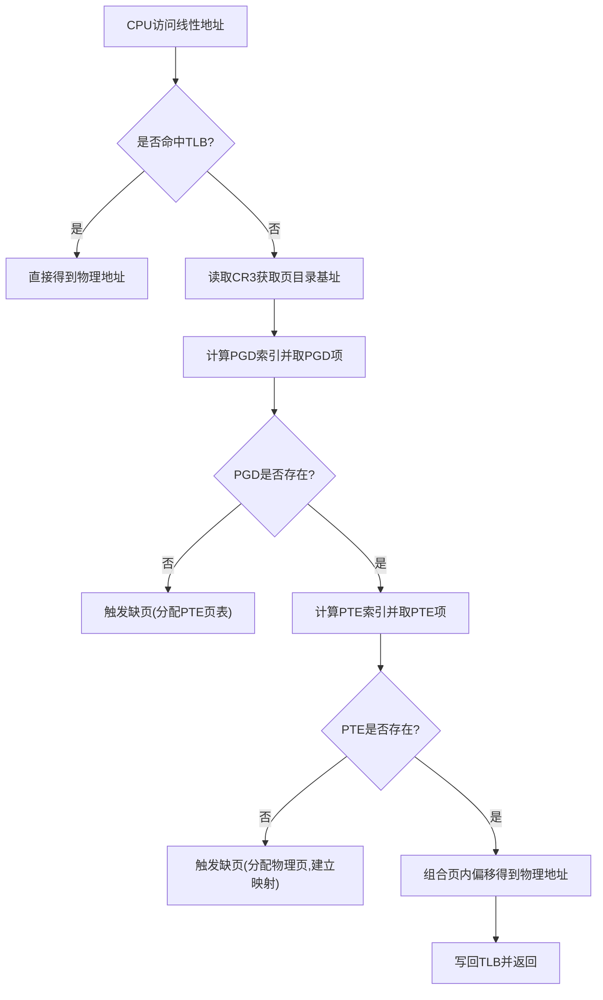
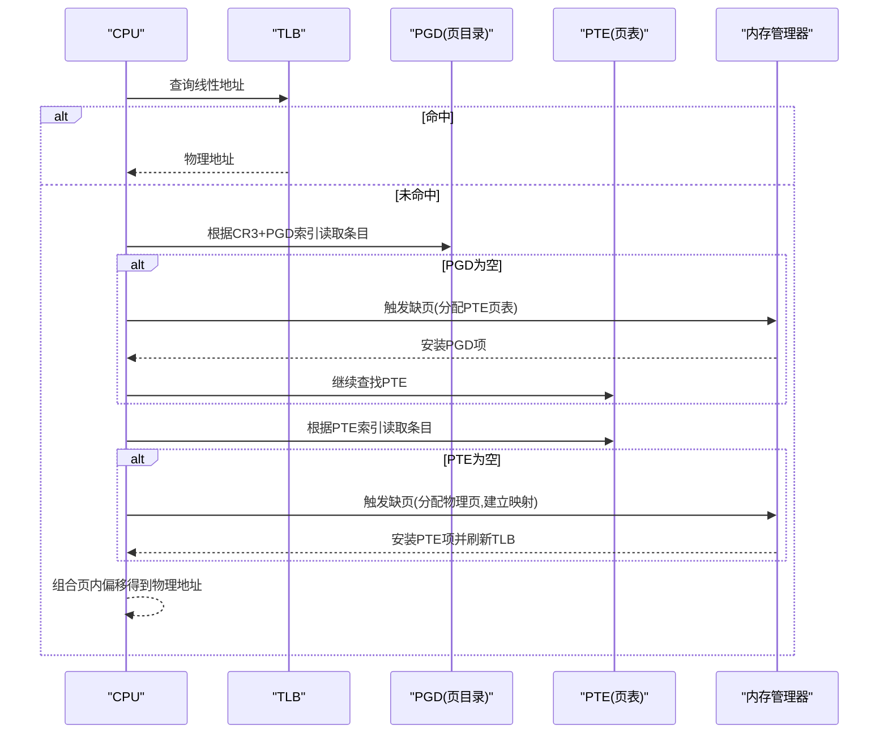
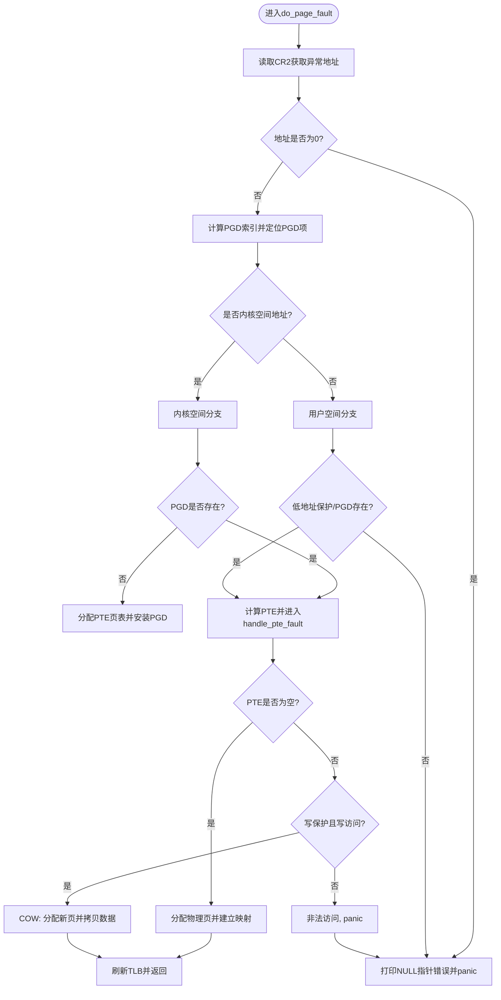
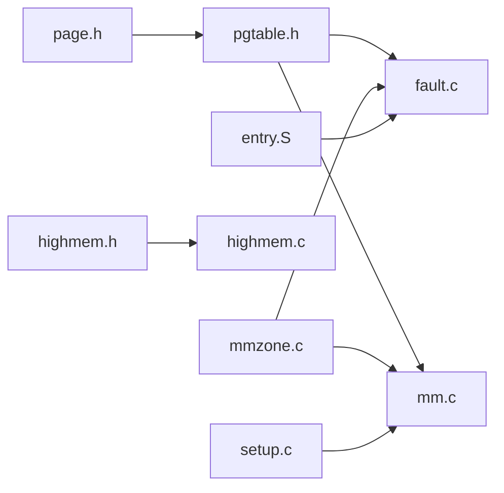
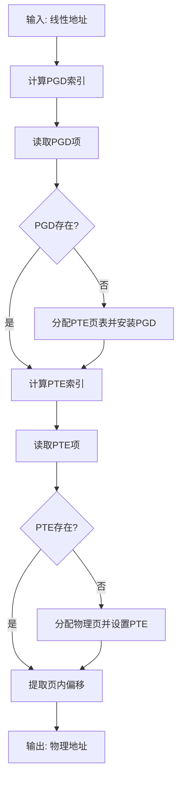
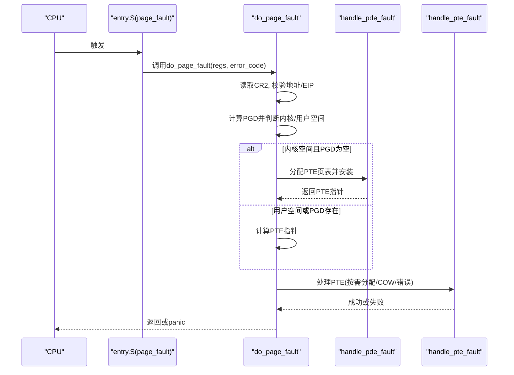

# 地址转换

<cite>
**本文引用的文件**
- [includes/arch/x86/pgtable.h](file://includes/arch/x86/pgtable.h)
- [includes/arch/x86/page.h](file://includes/arch/x86/page.h)
- [arch/x86/kernel/mm/mm.c](file://arch/x86/kernel/mm/mm.c)
- [arch/x86/kernel/mm/fault.c](file://arch/x86/kernel/mm/fault.c)
- [kernel/mm/bootmem.c](file://kernel/mm/bootmem.c)
- [kernel/mm/mmzone.c](file://kernel/mm/mmzone.c)
- [arch/x86/entry.S](file://arch/x86/entry.S)
- [kernel/mm/highmem.c](file://kernel/mm/highmem.c)
- [includes/arch/x86/highmem.h](file://includes/arch/x86/highmem.h)
- [arch/x86/kernel/setup.c](file://arch/x86/kernel/setup.c)
</cite>

## 目录
1. [简介](#简介)
2. [项目结构](#项目结构)
3. [核心组件](#核心组件)
4. [架构总览](#架构总览)
5. [详细组件分析](#详细组件分析)
6. [依赖关系分析](#依赖关系分析)
7. [性能考虑](#性能考虑)
8. [故障排查指南](#故障排查指南)
9. [结论](#结论)
10. [附录](#附录)

## 简介
本文面向LulaOS在x86保护模式下的地址转换机制，系统性地阐述从线性地址到物理地址的完整转换流程、页表遍历算法（PGD索引计算与PTE查找）、TLB缓存与刷新策略、不同内存区域的映射策略（内核空间、用户空间、I/O空间），以及缺页异常处理、错误检测与调试方法。文档同时提供时序图与流程图，帮助读者快速理解并定位问题。

## 项目结构
LulaOS的地址转换相关代码主要分布在以下位置：
- 页表定义与TLB操作：includes/arch/x86/pgtable.h、includes/arch/x86/page.h
- 内核页表初始化与区域映射：arch/x86/kernel/mm/mm.c
- 缺页异常与按需分配/COW：arch/x86/kernel/mm/fault.c
- 启动期内存管理与伙伴系统：kernel/mm/bootmem.c、kernel/mm/mmzone.c
- 中断入口与上下文切换（含CR3切换）：arch/x86/entry.S
- 高端内存与固定映射：kernel/mm/highmem.c、includes/arch/x86/highmem.h
- 启动阶段内存拓扑发现：arch/x86/kernel/setup.c

图表来源
- [includes/arch/x86/pgtable.h:93-107](file://includes/arch/x86/pgtable.h#L93-L107)
- [arch/x86/kernel/mm/fault.c:157-171](file://arch/x86/kernel/mm/fault.c#L157-L171)
- [arch/x86/kernel/mm/fault.c:96-150](file://arch/x86/kernel/mm/fault.c#L96-L150)

章节来源
- [includes/arch/x86/pgtable.h:1-131](file://includes/arch/x86/pgtable.h#L1-L131)
- [includes/arch/x86/page.h:1-47](file://includes/arch/x86/page.h#L1-L47)
- [arch/x86/kernel/mm/mm.c:24-134](file://arch/x86/kernel/mm/mm.c#L24-L134)
- [arch/x86/kernel/mm/fault.c:12-290](file://arch/x86/kernel/mm/fault.c#L12-L290)

## 核心组件
- 页表结构与属性：pgd_t、pte_t、pgprot_t及页表位标志（present/rw/user等）
- 索引与偏移：PGDIR_SHIFT/PAGE_SHIFT、pgd_index/pte_index、PAGE_OFFSET
- TLB管理：__flush_tlb_all（重载CR3）、__flush_tlb_one（invlpg）
- 缺页处理：do_page_fault、handle_pde_fault、handle_pte_fault
- 内存分配：bootmem与伙伴系统（__alloc_pages/free_pages）
- 区域映射：直接映射区、固定映射区、永久映射区、ioremap/vmalloc区
- 启动与初始化：setup_arch → paging_init → zone_init

章节来源
- [includes/arch/x86/pgtable.h:24-107](file://includes/arch/x86/pgtable.h#L24-L107)
- [includes/arch/x86/page.h:5-43](file://includes/arch/x86/page.h#L5-L43)
- [arch/x86/kernel/mm/fault.c:96-171](file://arch/x86/kernel/mm/fault.c#L96-L171)
- [kernel/mm/mmzone.c:248-329](file://kernel/mm/mmzone.c#L248-L329)
- [arch/x86/kernel/mm/mm.c:117-134](file://arch/x86/kernel/mm/mm.c#L117-L134)

## 架构总览
LulaOS采用两级页表（PGD→PTE）实现虚拟地址到物理地址的转换。内核启动时通过paging_init建立直接映射区（0~896M）、固定映射区与永久映射区，并加载CR3指向swapper_pg_dir。运行时由硬件完成TLB命中路径；未命中或权限不足时触发缺页异常，由内核按需分配页面或执行写时复制。

图表来源
- [arch/x86/kernel/mm/fault.c:157-171](file://arch/x86/kernel/mm/fault.c#L157-L171)
- [arch/x86/kernel/mm/fault.c:96-150](file://arch/x86/kernel/mm/fault.c#L96-L150)
- [includes/arch/x86/pgtable.h:93-107](file://includes/arch/x86/pgtable.h#L93-L107)

章节来源
- [arch/x86/kernel/mm/mm.c:117-134](file://arch/x86/kernel/mm/mm.c#L117-L134)
- [arch/x86/entry.S:158-160](file://arch/x86/entry.S#L158-L160)

## 详细组件分析

### 页表遍历与索引计算
- PGD索引：pgd_index(address) = (address >> PGDIR_SHIFT) & (PTRS_PER_PGD - 1)
- PTE索引：pte_index(address) = (address >> PAGE_SHIFT) & (PTRS_PER_PTE - 1)
- PTE指针推导：pte_offset(pgd, address) = pgd_page(*dir) + pte_index(address)
- 页表项属性：_PAGE_PRESENT/_PAGE_RW/_PAGE_USER等标志控制存在性、读写与用户态访问

复杂度分析：
- 时间复杂度：O(1)次内存访问（PGD+PTE各一次）
- 空间复杂度：每级页表为1024项，单页大小（4KB）

章节来源
- [includes/arch/x86/pgtable.h:93-107](file://includes/arch/x86/pgtable.h#L93-L107)
- [includes/arch/x86/pgtable.h:24-63](file://includes/arch/x86/pgtable.h#L24-L63)

### 缺页异常处理与按需分配
- do_page_fault：读取CR2获取异常地址，区分内核/用户空间，定位PGD并分派处理
- handle_pde_fault：若PGD为空则分配一页作为PTE表并安装，再进入PTE层处理
- handle_pte_fault：
  - PTE为空：分配物理页、清零、设置PTE为可写内核页、刷新TLB
  - PTE存在但只读且写访问：COW（分配新页、拷贝旧页内容、替换PTE为新页可写、刷新TLB）
  - 内核态写保护违规：记录BUG并panic
- ioremap区域特殊保护：禁止走Demand Paging，防止误分配普通RAM

图表来源
- [arch/x86/kernel/mm/fault.c:184-251](file://arch/x86/kernel/mm/fault.c#L184-L251)
- [arch/x86/kernel/mm/fault.c:96-171](file://arch/x86/kernel/mm/fault.c#L96-L171)

章节来源
- [arch/x86/kernel/mm/fault.c:12-290](file://arch/x86/kernel/mm/fault.c#L12-L290)

### TLB管理与批量刷新
- __flush_tlb_all：通过重读并重写CR3实现全量TLB失效，适用于页表批量变更场景
- __flush_tlb_one：使用invlpg指令仅刷新指定线性地址对应的TLB条目，适用于单页更新
- 在缺页处理中，建立映射后调用__flush_tlb_one确保后续访问命中新映射

性能影响：
- 全量刷新开销较大，适合页表整体重建或跨进程切换
- 单条刷新开销小，适合频繁的小范围映射更新

章节来源
- [includes/arch/x86/pgtable.h:118-128](file://includes/arch/x86/pgtable.h#L118-L128)
- [arch/x86/kernel/mm/fault.c:113-115](file://arch/x86/kernel/mm/fault.c#L113-L115)
- [arch/x86/kernel/mm/fault.c:137-139](file://arch/x86/kernel/mm/fault.c#L137-L139)

### 内存区域映射策略
- 直接映射区（0~896M）：paging_init中的direct_area_init建立连续映射，便于内核直接访问低端内存
- 固定映射区（接近4G顶部）：fix_area_init与fixed_kmap_init用于临时/固定映射（如APIC、ACPI等）
- 永久映射区（PKMAP）：persist_area_init预留4MB区域供长期映射使用
- ioremap/vmalloc区：将物理地址映射到内核虚拟地址空间，默认禁用缓存以适配MMIO
- 用户空间：启动时清除0~3G的用户页表，避免遗留映射

章节来源
- [arch/x86/kernel/mm/mm.c:24-134](file://arch/x86/kernel/mm/mm.c#L24-L134)
- [kernel/mm/highmem.c:13-48](file://kernel/mm/highmem.c#L13-L48)
- [includes/arch/x86/highmem.h:19-55](file://includes/arch/x86/highmem.h#L19-L55)

### 启动期内存管理与伙伴系统
- bootmem：在早期阶段维护可用/保留位图，支持简单分配与释放
- 伙伴系统：将空闲页按阶组织，支持高效合并与拆分；free_all_bootmem将bootmem回收至伙伴系统
- 区域划分：ZONE_DMA/ZONE_NORMAL/ZONE_HIGHMEM，分别对应不同物理范围与用途

章节来源
- [kernel/mm/bootmem.c:12-223](file://kernel/mm/bootmem.c#L12-L223)
- [kernel/mm/mmzone.c:61-150](file://kernel/mm/mmzone.c#L61-L150)
- [kernel/mm/mmzone.c:153-329](file://kernel/mm/mmzone.c#L153-L329)

### 中断与上下文切换中的地址空间切换
- 缺页异常入口：entry.S中page_fault桩调用do_page_fault
- 上下文切换：__switch_to在任务切换时更新CR3，从而切换到目标进程的页目录

章节来源
- [arch/x86/entry.S:158-160](file://arch/x86/entry.S#L158-L160)
- [arch/x86/entry.S:554-559](file://arch/x86/entry.S#L554-L559)

## 依赖关系分析
- pgtable.h依赖page.h提供的类型与宏（pgd_t/pte_t/PAGE_*）
- fault.c依赖pgtable.h进行页表操作，依赖mmzone.c进行页面分配
- mm.c依赖bootmem与highmem进行区域映射与初始化
- setup.c负责内存拓扑发现，驱动paging_init与zone_init

图表来源
- [includes/arch/x86/page.h:1-47](file://includes/arch/x86/page.h#L1-L47)
- [includes/arch/x86/pgtable.h:1-131](file://includes/arch/x86/pgtable.h#L1-L131)
- [arch/x86/kernel/mm/fault.c:1-290](file://arch/x86/kernel/mm/fault.c#L1-L290)
- [arch/x86/kernel/mm/mm.c:1-218](file://arch/x86/kernel/mm/mm.c#L1-L218)
- [kernel/mm/mmzone.c:1-329](file://kernel/mm/mmzone.c#L1-L329)
- [includes/arch/x86/highmem.h:1-55](file://includes/arch/x86/highmem.h#L1-L55)
- [kernel/mm/highmem.c:1-48](file://kernel/mm/highmem.c#L1-L48)
- [arch/x86/kernel/setup.c:1-216](file://arch/x86/kernel/setup.c#L1-L216)
- [arch/x86/entry.S:158-160](file://arch/x86/entry.S#L158-L160)

章节来源
- [includes/arch/x86/page.h:1-47](file://includes/arch/x86/page.h#L1-L47)
- [includes/arch/x86/pgtable.h:1-131](file://includes/arch/x86/pgtable.h#L1-L131)
- [arch/x86/kernel/mm/fault.c:1-290](file://arch/x86/kernel/mm/fault.c#L1-L290)
- [arch/x86/kernel/mm/mm.c:1-218](file://arch/x86/kernel/mm/mm.c#L1-L218)
- [kernel/mm/mmzone.c:1-329](file://kernel/mm/mmzone.c#L1-L329)
- [includes/arch/x86/highmem.h:1-55](file://includes/arch/x86/highmem.h#L1-L55)
- [kernel/mm/highmem.c:1-48](file://kernel/mm/highmem.c#L1-L48)
- [arch/x86/kernel/setup.c:1-216](file://arch/x86/kernel/setup.c#L1-L216)
- [arch/x86/entry.S:158-160](file://arch/x86/entry.S#L158-L160)

## 性能考虑
- TLB命中率优化：尽量顺序访问同一页以减少TLB缺失；对频繁更新的映射使用__flush_tlb_one而非全量刷新
- 批量刷新策略：在页表批量变更（如进程切换、大段映射重建）时使用__flush_tlb_all减少多次invlpg开销
- 按需分配与COW：延迟分配降低启动成本；COW减少不必要的写放大
- 区域映射选择：对MMIO使用无缓存映射避免脏数据；对热点数据使用直接映射减少额外跳转

[本节为通用性能建议，不直接分析具体文件]

## 故障排查指南
- 常见缺页原因：
  - 空指针解引用：地址为0，快速路径直接panic
  - 用户空间未分配区域：PGD为空，提示SEGFAULT
  - ioremap区域PTE丢失：禁止Demand Paging，需检查映射建立逻辑
  - 内核态写保护违规：PTE存在但不可写，记录BUG并panic
- 调试手段：
  - 查看do_page_fault_panic输出的寄存器与错误码，定位EIP与CR2
  - 检查pgd_index/pte_index计算是否正确，确认PGD/PTE项是否有效
  - 使用printk输出关键路径（如分配失败、COW拷贝）辅助定位
- 恢复策略：
  - 对于可恢复的缺页（如按需分配成功），返回继续执行
  - 对于不可恢复的错误（如iounmap区域访问），停机防止进一步破坏

章节来源
- [arch/x86/kernel/mm/fault.c:184-290](file://arch/x86/kernel/mm/fault.c#L184-L290)

## 结论
LulaOS在x86保护模式下实现了标准的双级页表地址转换机制，结合TLB缓存与缺页异常处理，提供了高效的虚拟内存抽象。通过合理的区域划分（直接映射、固定映射、永久映射、ioremap/vmalloc）与启动期初始化，系统在保障安全性的同时兼顾了性能。缺页处理的按需分配与写时复制策略降低了资源消耗，而TLB的细粒度刷新与批量刷新策略在不同场景下平衡了开销。未来可进一步优化TLB亲和性与映射局部性，提升多核环境下的整体吞吐。

[本节为总结性内容，不直接分析具体文件]

## 附录

### 页表遍历流程图（代码级）

图表来源
- [includes/arch/x86/pgtable.h:93-107](file://includes/arch/x86/pgtable.h#L93-L107)
- [arch/x86/kernel/mm/fault.c:157-171](file://arch/x86/kernel/mm/fault.c#L157-L171)

### 缺页异常时序图（代码级）

图表来源
- [arch/x86/entry.S:158-160](file://arch/x86/entry.S#L158-L160)
- [arch/x86/kernel/mm/fault.c:184-251](file://arch/x86/kernel/mm/fault.c#L184-L251)
- [arch/x86/kernel/mm/fault.c:157-171](file://arch/x86/kernel/mm/fault.c#L157-L171)
- [arch/x86/kernel/mm/fault.c:96-150](file://arch/x86/kernel/mm/fault.c#L96-L150)