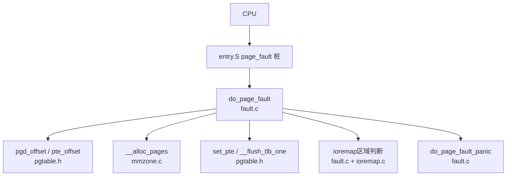
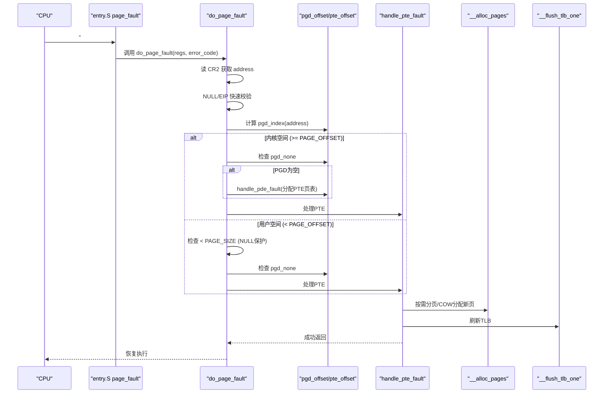
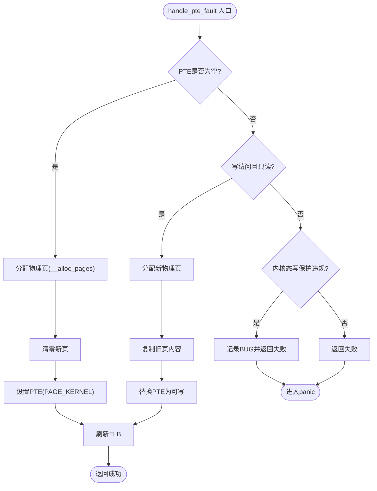
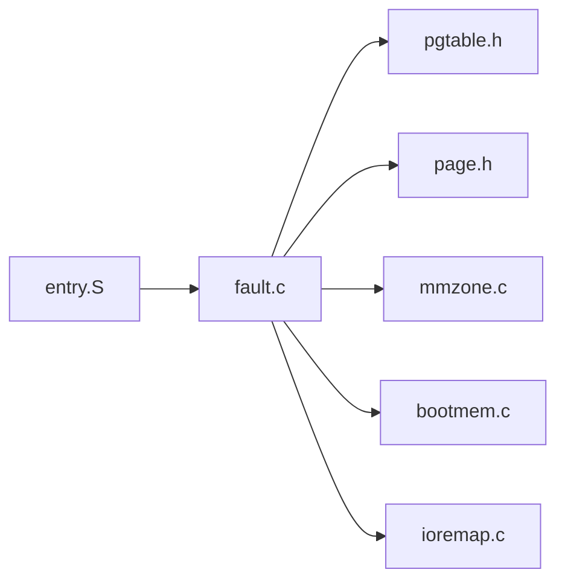
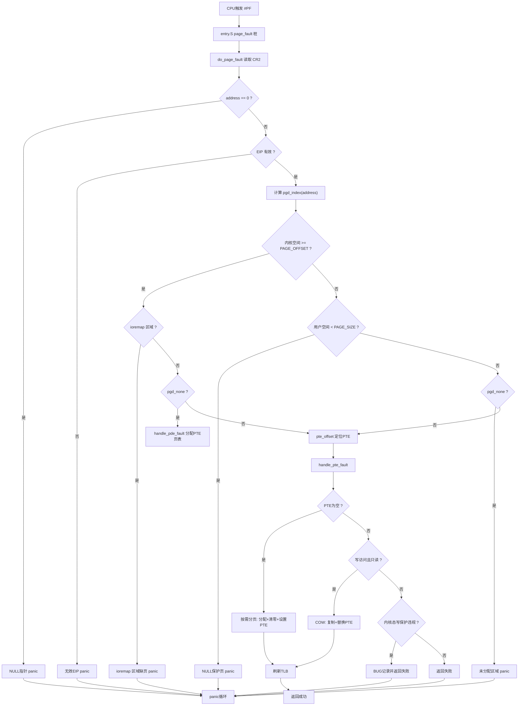

# 缺页异常处理

<cite>
**本文引用的文件**
- [arch/x86/kernel/mm/fault.c](file://arch/x86/kernel/mm/fault.c)
- [includes/arch/x86/page.h](file://includes/arch/x86/page.h)
- [includes/arch/x86/pgtable.h](file://includes/arch/x86/pgtable.h)
- [kernel/mm/mmzone.c](file://kernel/mm/mmzone.c)
- [kernel/mm/bootmem.c](file://kernel/mm/bootmem.c)
- [includes/mm/mm.h](file://includes/mm/mm.h)
- [arch/x86/entry.S](file://arch/x86/entry.S)
- [arch/x86/kernel/mm/ioremap.c](file://arch/x86/kernel/mm/ioremap.c)
</cite>

## 目录
1. [简介](#简介)
2. [项目结构](#项目结构)
3. [核心组件](#核心组件)
4. [架构总览](#架构总览)
5. [详细组件分析](#详细组件分析)
6. [依赖关系分析](#依赖关系分析)
7. [性能考虑](#性能考虑)
8. [故障排除指南](#故障排除指南)
9. [结论](#结论)
10. [附录：错误码与流程图](#附录错误码与流程图)

## 简介
本文档面向LulaOS的缺页异常（Page Fault）处理子系统，系统性阐述以下要点：
- 缺页异常的触发条件与CPU错误码含义（不存在页面、写保护违规、权限不足等）。
- do_page_fault主处理函数的执行流程：从CR2读取异常地址到最终的处理决策。
- 按需分页（Demand Paging）的实现：新页面分配、清零与映射建立。
- 写时复制（COW）机制：页面复制与权限修改。
- ioremap区域的特殊处理与NULL指针保护。
- 调试方法与常见故障排除。
- 完整的异常处理流程图与错误码解析表。

## 项目结构
与缺页异常处理直接相关的代码分布在如下位置：
- 异常入口与分发：arch/x86/entry.S
- 主处理逻辑：arch/x86/kernel/mm/fault.c
- 页表与属性宏：includes/arch/x86/pgtable.h、includes/arch/x86/page.h
- 内存分配与伙伴系统：kernel/mm/mmzone.c、kernel/mm/bootmem.c
- I/O映射与vmalloc区域：arch/x86/kernel/mm/ioremap.c
- 页描述符与标志位：includes/mm/mm.h

图表来源
- [arch/x86/entry.S:158-160](file://arch/x86/entry.S#L158-L160)
- [arch/x86/kernel/mm/fault.c:184-250](file://arch/x86/kernel/mm/fault.c#L184-L250)
- [includes/arch/x86/pgtable.h:93-107](file://includes/arch/x86/pgtable.h#L93-L107)
- [kernel/mm/mmzone.c:248-329](file://kernel/mm/mmzone.c#L248-L329)
- [arch/x86/kernel/mm/ioremap.c:230-281](file://arch/x86/kernel/mm/ioremap.c#L230-L281)

章节来源
- [arch/x86/entry.S:158-160](file://arch/x86/entry.S#L158-L160)
- [arch/x86/kernel/mm/fault.c:184-250](file://arch/x86/kernel/mm/fault.c#L184-L250)
- [includes/arch/x86/pgtable.h:93-107](file://includes/arch/x86/pgtable.h#L93-L107)
- [kernel/mm/mmzone.c:248-329](file://kernel/mm/mmzone.c#L248-L329)
- [arch/x86/kernel/mm/ioremap.c:230-281](file://arch/x86/kernel/mm/ioremap.c#L230-L281)

## 核心组件
- 异常入口与分发：entry.S将page_fault向量指向do_page_fault。
- 主处理函数：do_page_fault负责读取CR2、快速校验、定位PGD/PTE并分派处理。
- PTE级处理：handle_pte_fault实现按需分页与写时复制。
- PGD级处理：handle_pde_fault在缺失PDE时分配PTE页表并继续处理。
- 内存分配：__alloc_pages基于伙伴系统分配物理页。
- 页表操作：pgtable.h提供页表项读写、TLB刷新等。
- I/O映射：ioremap.c建立设备MMIO映射，并在fault.c中受保护避免误分配普通RAM。

章节来源
- [arch/x86/entry.S:158-160](file://arch/x86/entry.S#L158-L160)
- [arch/x86/kernel/mm/fault.c:96-171](file://arch/x86/kernel/mm/fault.c#L96-L171)
- [kernel/mm/mmzone.c:248-329](file://kernel/mm/mmzone.c#L248-L329)
- [includes/arch/x86/pgtable.h:24-90](file://includes/arch/x86/pgtable.h#L24-L90)
- [arch/x86/kernel/mm/ioremap.c:230-281](file://arch/x86/kernel/mm/ioremap.c#L230-L281)

## 架构总览
缺页异常的整体调用链如下：
- CPU触发#PF，entry.S的page_fault桩将控制转移到do_page_fault。
- do_page_fault读取CR2获取异常地址，进行空指针/EIP有效性检查。
- 根据地址是否在内核空间（>= PAGE_OFFSET）决定不同分支：
  - 内核空间：若PGD为空则先分配PTE页表；再进入handle_pte_fault。
  - 用户空间：低地址NULL保护页直接失败；否则检查PGD是否存在，再进入handle_pte_fault。
- handle_pte_fault根据PTE状态选择：
  - PTE为空：按需分页，分配物理页、清零、设置PTE为可写内核属性，刷新TLB。
  - PTE存在且只读+写访问：写时复制，复制旧页内容到新页，替换PTE为可写。
  - 其他：内核态写保护违规或非法访问，进入panic。
- 无法处理的异常统一由do_page_fault_panic打印现场并停机。

图表来源
- [arch/x86/entry.S:158-160](file://arch/x86/entry.S#L158-L160)
- [arch/x86/kernel/mm/fault.c:184-250](file://arch/x86/kernel/mm/fault.c#L184-L250)
- [kernel/mm/mmzone.c:248-329](file://kernel/mm/mmzone.c#L248-L329)
- [includes/arch/x86/pgtable.h:118-128](file://includes/arch/x86/pgtable.h#L118-L128)

## 详细组件分析

### 异常入口与主处理函数
- entry.S将page_fault向量绑定到do_page_fault，CPU自动压入error_code后跳转。
- do_page_fault：
  - 读取CR2得到异常地址。
  - 快速路径：address==0或EIP无效直接panic。
  - 定位PGD条目，区分内核/用户空间。
  - 内核空间：对ioremap区域禁止走按需分页；必要时分配PTE页表。
  - 用户空间：低地址NULL保护页直接失败；未分配区域直接失败。
  - 最终交由handle_pte_fault处理具体PTE。

章节来源
- [arch/x86/entry.S:158-160](file://arch/x86/entry.S#L158-L160)
- [arch/x86/kernel/mm/fault.c:184-250](file://arch/x86/kernel/mm/fault.c#L184-L250)

### PTE级处理：按需分页与写时复制
- 按需分页（PTE为空）：
  - 调用__alloc_pages分配物理页。
  - 将新页清零以避免泄露数据。
  - 使用PAGE_KERNEL属性设置PTE，并刷新TLB。
- 写时复制（PTE存在但只读且发生写访问）：
  - 分配新物理页，复制旧页内容。
  - 用新物理地址+可写属性替换原PTE，刷新TLB。
- 内核态写保护违规：
  - 记录BUG信息并返回失败，进入panic。

图表来源
- [arch/x86/kernel/mm/fault.c:96-150](file://arch/x86/kernel/mm/fault.c#L96-L150)
- [kernel/mm/mmzone.c:248-329](file://kernel/mm/mmzone.c#L248-L329)
- [includes/arch/x86/pgtable.h:118-128](file://includes/arch/x86/pgtable.h#L118-L128)

章节来源
- [arch/x86/kernel/mm/fault.c:96-150](file://arch/x86/kernel/mm/fault.c#L96-L150)
- [kernel/mm/mmzone.c:248-329](file://kernel/mm/mmzone.c#L248-L329)
- [includes/arch/x86/pgtable.h:118-128](file://includes/arch/x86/pgtable.h#L118-L128)

### PGD级处理：PTE页表分配
- 当PGD条目为空时，分配一页作为PTE页表，清零后安装到PGD。
- 随后通过pte_offset定位PTE并继续处理。

章节来源
- [arch/x86/kernel/mm/fault.c:157-171](file://arch/x86/kernel/mm/fault.c#L157-L171)
- [includes/arch/x86/pgtable.h:93-107](file://includes/arch/x86/pgtable.h#L93-L107)

### 内存分配与伙伴系统
- __alloc_pages：
  - 根据gfp_mask选择zonelist，遍历zone寻找空闲块。
  - 从目标阶开始向上查找，找到后从空闲链表摘取。
  - 更新位图与free_pages计数，拆分大块至目标阶。
  - 初始化page结构并返回。
- bootmem阶段：
  - 初始化bootmem位图，标记保留/释放区域。
  - free_all_bootmem将可用页加入伙伴系统。

章节来源
- [kernel/mm/mmzone.c:248-329](file://kernel/mm/mmzone.c#L248-L329)
- [kernel/mm/bootmem.c:12-28](file://kernel/mm/bootmem.c#L12-L28)
- [kernel/mm/bootmem.c:194-223](file://kernel/mm/bootmem.c#L194-L223)

### I/O映射与NULL保护
- ioremap区域：
  - fault.c定义IOREMAP_START/END范围，is_ioremap_addr用于识别。
  - 该区域PTE必须由ioremap主动建立，缺页时禁止走按需分页分配普通RAM。
- NULL保护：
  - 用户空间低地址（< PAGE_SIZE）视为NULL保护页，缺页直接失败。
  - 内核态address==0快速路径直接panic。

章节来源
- [arch/x86/kernel/mm/fault.c:64-70](file://arch/x86/kernel/mm/fault.c#L64-L70)
- [arch/x86/kernel/mm/fault.c:205-235](file://arch/x86/kernel/mm/fault.c#L205-L235)
- [arch/x86/kernel/mm/ioremap.c:230-281](file://arch/x86/kernel/mm/ioremap.c#L230-L281)

## 依赖关系分析
- fault.c依赖pgtable.h进行页表项读写与TLB刷新。
- fault.c依赖mmzone.c的__alloc_pages进行物理页分配。
- fault.c依赖page.h进行虚拟/物理地址转换与页大小常量。
- entry.S将硬件异常路由到do_page_fault。
- ioremap.c与fault.c共同维护ioremap区域的安全边界。

图表来源
- [arch/x86/entry.S:158-160](file://arch/x86/entry.S#L158-L160)
- [arch/x86/kernel/mm/fault.c:184-250](file://arch/x86/kernel/mm/fault.c#L184-L250)
- [includes/arch/x86/pgtable.h:93-128](file://includes/arch/x86/pgtable.h#L93-L128)
- [kernel/mm/mmzone.c:248-329](file://kernel/mm/mmzone.c#L248-L329)
- [kernel/mm/bootmem.c:12-28](file://kernel/mm/bootmem.c#L12-L28)
- [arch/x86/kernel/mm/ioremap.c:230-281](file://arch/x86/kernel/mm/ioremap.c#L230-L281)

章节来源
- [arch/x86/entry.S:158-160](file://arch/x86/entry.S#L158-L160)
- [arch/x86/kernel/mm/fault.c:184-250](file://arch/x86/kernel/mm/fault.c#L184-L250)
- [includes/arch/x86/pgtable.h:93-128](file://includes/arch/x86/pgtable.h#L93-L128)
- [kernel/mm/mmzone.c:248-329](file://kernel/mm/mmzone.c#L248-L329)
- [kernel/mm/bootmem.c:12-28](file://kernel/mm/bootmem.c#L12-L28)
- [arch/x86/kernel/mm/ioremap.c:230-281](file://arch/x86/kernel/mm/ioremap.c#L230-L281)

## 性能考虑
- 快速路径优化：
  - NULL指针与无效EIP的快速检测减少不必要的页表遍历。
  - 仅刷新受影响TLB条目（invlpg），避免全局刷新开销。
- 按需分页与COW：
  - 仅在首次写入时复制页面，降低初始映射成本。
  - 新页清零避免数据泄露，但带来额外内存带宽消耗。
- 伙伴系统分配：
  - 从目标阶向上查找，减少碎片化；拆分大块以匹配需求。
- I/O映射区域保护：
  - 防止误分配普通RAM，避免破坏设备映射一致性。

[本节为通用性能讨论，不直接分析具体文件]

## 故障排除指南
- 常见问题定位：
  - 查看do_page_fault_panic输出中的Address、Error Code、EIP、CS、EFLAGS等寄存器值。
  - 确认异常地址是否在用户空间低地址（NULL保护）、ioremap区域或未分配区域。
  - 检查PTE状态：是否存在、是否只读、是否内核态写保护违规。
- 调试步骤：
  - 启用printk日志，观察按需分页与COW分配过程。
  - 验证ioremap映射是否正确建立，避免PTE丢失导致缺页。
  - 检查__alloc_pages是否成功，OOM时会记录日志。
- 常见错误码解析：
  - bit0=0：页面不存在；bit0=1：权限不足。
  - bit1=1：写访问；bit1=0：读/执行访问。
  - bit2=1：用户态；bit2=0：内核态。
  - bit3：保留位违规；bit4：取指引发。
- 修复建议：
  - 对于用户态NULL解引用，检查指针初始化与边界检查。
  - 对于写保护违规，确认是否需要COW或调整权限。
  - 对于ioremap区域缺页，检查映射建立与生命周期管理。

章节来源
- [arch/x86/kernel/mm/fault.c:256-290](file://arch/x86/kernel/mm/fault.c#L256-L290)
- [arch/x86/kernel/mm/fault.c:184-250](file://arch/x86/kernel/mm/fault.c#L184-L250)
- [arch/x86/kernel/mm/ioremap.c:230-281](file://arch/x86/kernel/mm/ioremap.c#L230-L281)

## 结论
LulaOS的缺页异常处理通过清晰的层次化设计实现了按需分页与写时复制，结合严格的区域保护（NULL页、ioremap区域）确保系统稳定性。主处理函数do_page_fault在快速路径与常规路径之间平衡了性能与正确性，配合伙伴系统的内存分配与页表操作，形成了完整的内存访问异常处理闭环。通过完善的日志与panic机制，便于问题定位与调试。

[本节为总结性内容，不直接分析具体文件]

## 附录：错误码与流程图

### 错误码解析表
- bit0：页面是否存在（0=不存在，1=存在但权限不足）
- bit1：访问类型（0=读/执行，1=写）
- bit2：特权级（0=内核态，1=用户态）
- bit3：保留位违规
- bit4：取指引发

章节来源
- [arch/x86/kernel/mm/fault.c:12-26](file://arch/x86/kernel/mm/fault.c#L12-L26)
- [arch/x86/kernel/mm/fault.c:256-290](file://arch/x86/kernel/mm/fault.c#L256-L290)

### 完整异常处理流程图

图表来源
- [arch/x86/entry.S:158-160](file://arch/x86/entry.S#L158-L160)
- [arch/x86/kernel/mm/fault.c:184-250](file://arch/x86/kernel/mm/fault.c#L184-L250)
- [arch/x86/kernel/mm/fault.c:96-150](file://arch/x86/kernel/mm/fault.c#L96-L150)
- [includes/arch/x86/pgtable.h:118-128](file://includes/arch/x86/pgtable.h#L118-L128)