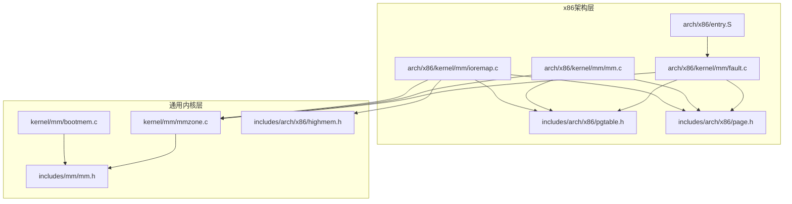
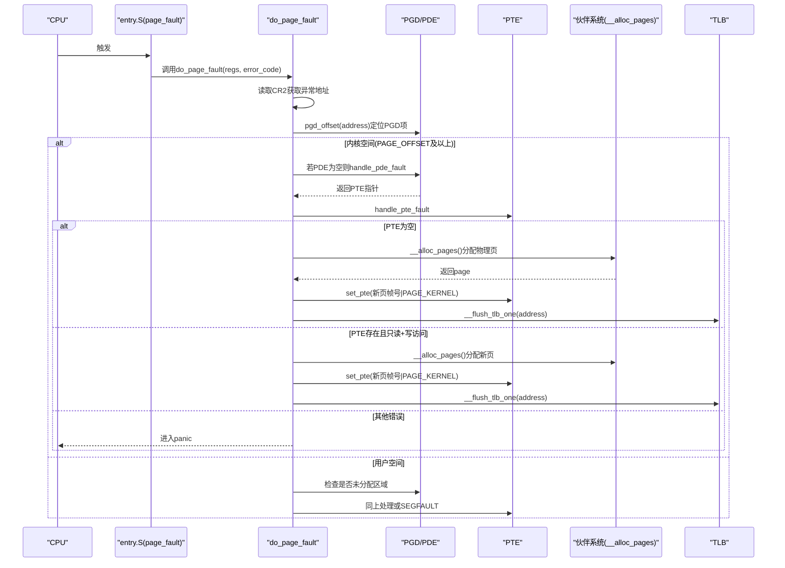
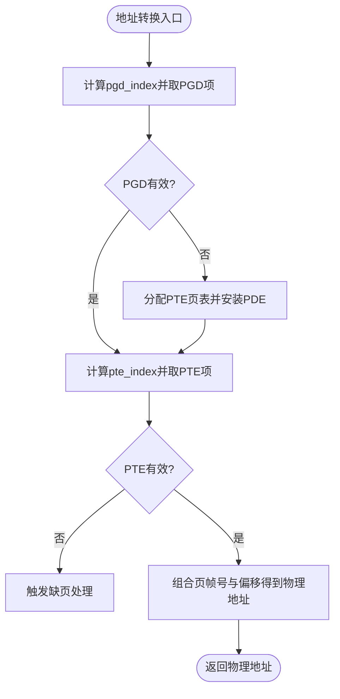
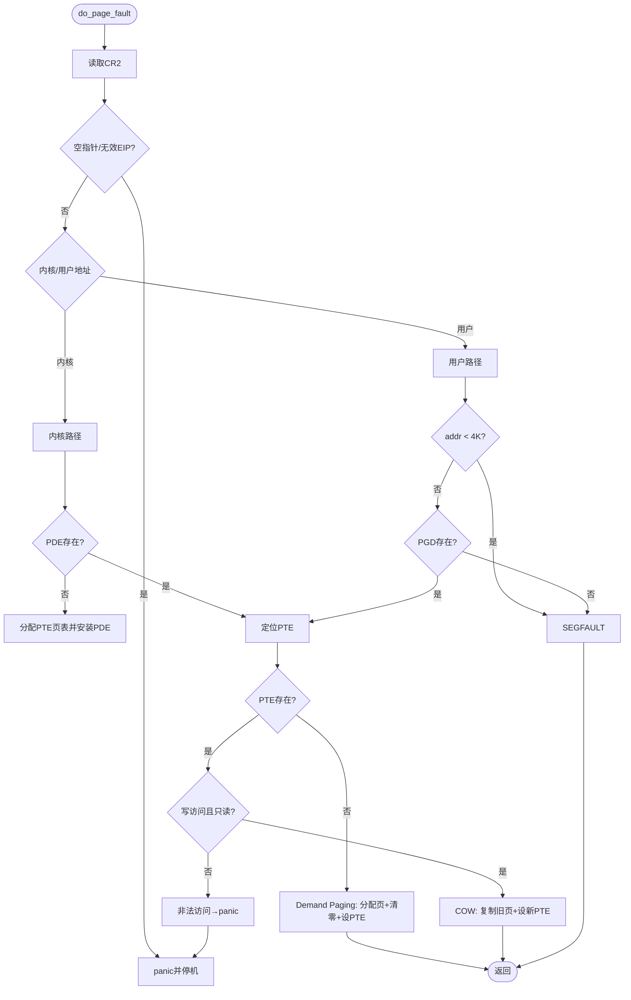
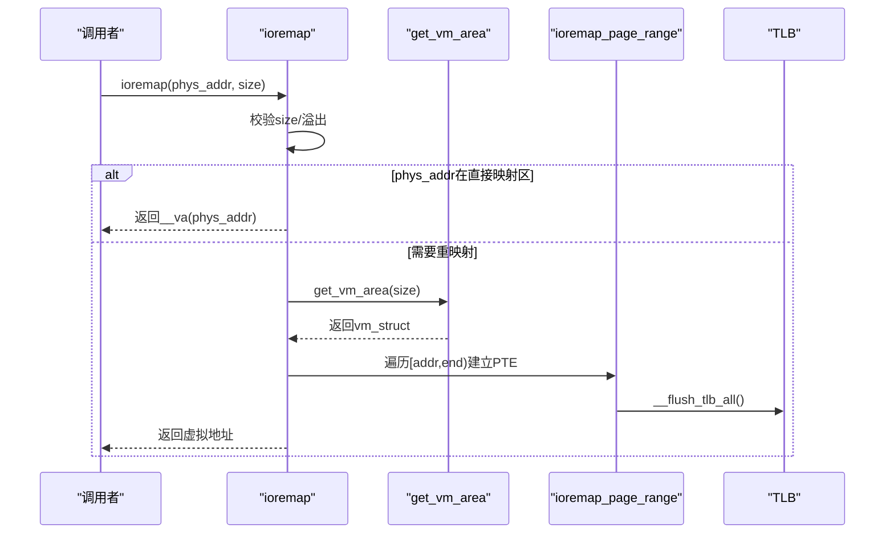
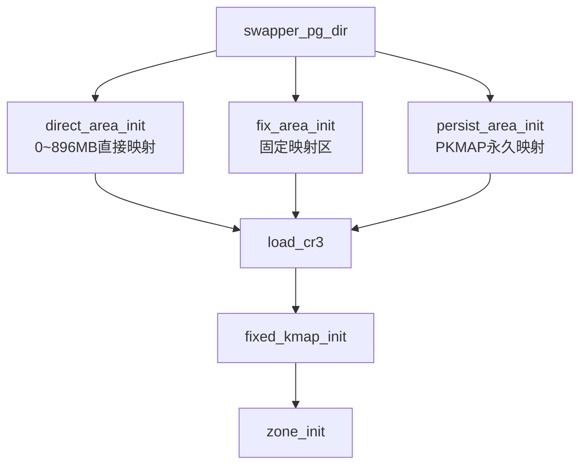
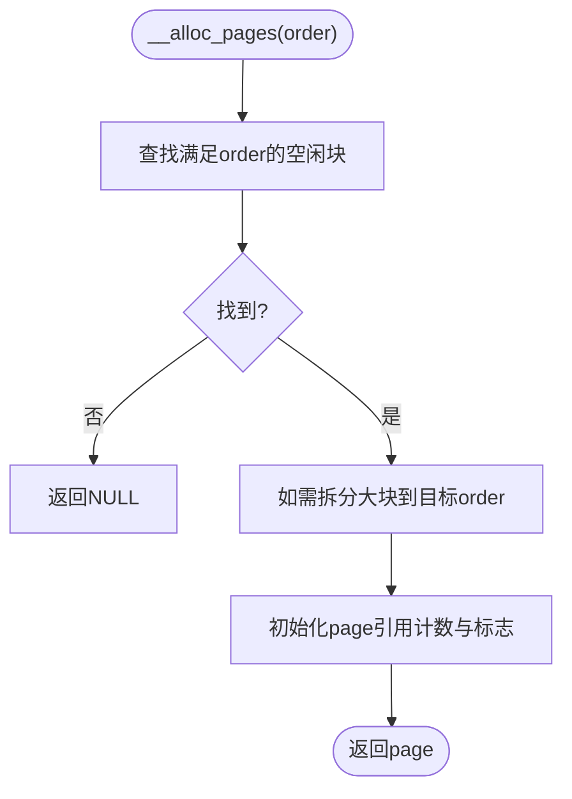
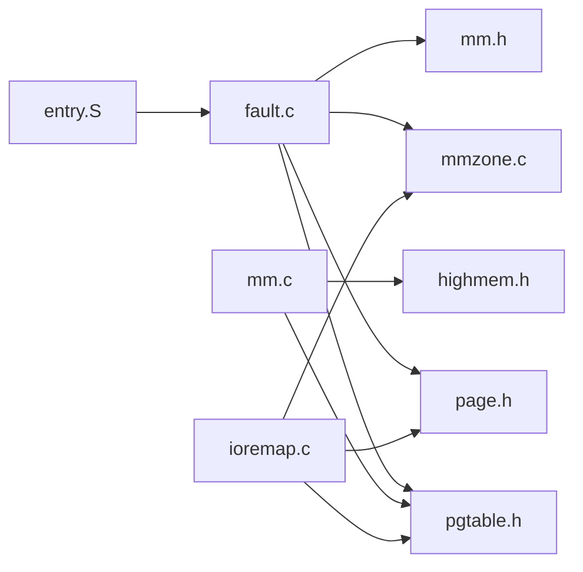
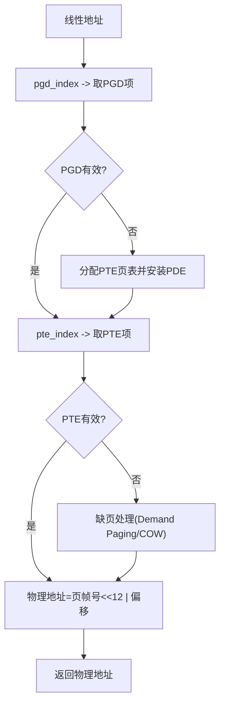
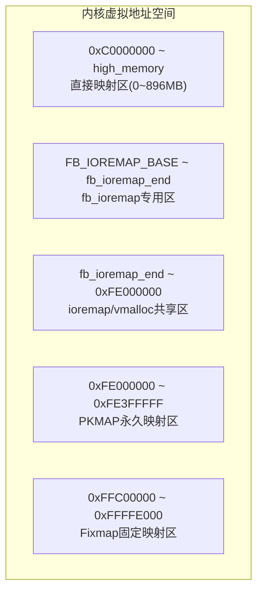

# 虚拟内存管理

<cite>
**本文引用的文件**
- [fault.c](file://arch/x86/kernel/mm/fault.c)
- [mm.c](file://arch/x86/kernel/mm/mm.c)
- [pgtable.h](file://includes/arch/x86/pgtable.h)
- [page.h](file://includes/arch/x86/page.h)
- [mm.h](file://includes/mm/mm.h)
- [bootmem.c](file://kernel/mm/bootmem.c)
- [highmem.h](file://includes/arch/x86/highmem.h)
- [ioremap.c](file://arch/x86/kernel/mm/ioremap.c)
- [mmzone.c](file://kernel/mm/mmzone.c)
- [entry.S](file://arch/x86/entry.S)
</cite>

## 目录
1. [简介](#简介)
2. [项目结构](#项目结构)
3. [核心组件](#核心组件)
4. [架构总览](#架构总览)
5. [详细组件分析](#详细组件分析)
6. [依赖关系分析](#依赖关系分析)
7. [性能考虑](#性能考虑)
8. [故障排除指南](#故障排除指南)
9. [结论](#结论)
10. [附录](#附录)

## 简介
本文件面向LulaOS的虚拟内存子系统，系统性阐述x86架构下的虚拟地址空间、物理地址空间与地址转换机制；解释两级页表（PGD→PTE）的组织方式；详解缺页异常处理流程（demand paging与写时复制COW）；说明内存映射（ioremap/vmalloc）的实现原理与使用要点；并提供调试技巧与常见问题排查方法。文档包含地址转换流程图与内存布局图，帮助开发者理解LulaOS在x86上的虚拟内存管理机制。

## 项目结构
LulaOS将虚拟内存相关代码按“架构相关”和“通用内核”分层组织：
- 架构相关（x86）：页表定义、TLB操作、缺页异常入口与处理、直接映射初始化等
- 通用内核：伙伴系统、启动期分配器、区域划分、高级内存管理等

图表来源
- [fault.c:1-290](file://arch/x86/kernel/mm/fault.c#L1-L290)
- [mm.c:1-218](file://arch/x86/kernel/mm/mm.c#L1-L218)
- [pgtable.h:1-131](file://includes/arch/x86/pgtable.h#L1-L131)
- [page.h:1-47](file://includes/arch/x86/page.h#L1-L47)
- [entry.S:158-160](file://arch/x86/entry.S#L158-L160)
- [ioremap.c:1-281](file://arch/x86/kernel/mm/ioremap.c#L1-L281)
- [mmzone.c:1-200](file://kernel/mm/mmzone.c#L1-L200)
- [bootmem.c:1-223](file://kernel/mm/bootmem.c#L1-L223)
- [mm.h:1-98](file://includes/mm/mm.h#L1-L98)
- [highmem.h:1-105](file://includes/arch/x86/highmem.h#L1-L105)

章节来源
- [fault.c:1-290](file://arch/x86/kernel/mm/fault.c#L1-L290)
- [mm.c:1-218](file://arch/x86/kernel/mm/mm.c#L1-L218)
- [pgtable.h:1-131](file://includes/arch/x86/pgtable.h#L1-L131)
- [page.h:1-47](file://includes/arch/x86/page.h#L1-L47)
- [entry.S:158-160](file://arch/x86/entry.S#L158-L160)
- [ioremap.c:1-281](file://arch/x86/kernel/mm/ioremap.c#L1-L281)
- [mmzone.c:1-200](file://kernel/mm/mmzone.c#L1-L200)
- [bootmem.c:1-223](file://kernel/mm/bootmem.c#L1-L223)
- [mm.h:1-98](file://includes/mm/mm.h#L1-L98)
- [highmem.h:1-105](file://includes/arch/x86/highmem.h#L1-L105)

## 核心组件
- 页表与地址转换
  - 两级页表：PGD（页目录）+ PTE（页表），每项1024个条目，页大小4KB
  - 关键宏：pgd_index/pte_index、pte_offset、__mk_pte、set_pgd/set_pte
  - TLB刷新：__flush_tlb_one / __flush_tlb_all
- 内存布局与直接映射
  - PAGE_OFFSET为内核起始虚拟地址（0xC0000000）
  - direct_area_init建立0~896MB的直接映射
  - fix_area/persist_area用于固定映射与永久映射区
- 启动期分配器与伙伴系统
  - bootmem：早期位图分配，free_all_bootmem后转入伙伴系统
  - mmzone：zone划分（DMA/Normal/HighMem）、空闲块管理、分配/回收
- 缺页异常处理
  - entry.S page_fault → do_page_fault
  - handle_pde_fault：按需分配PTE页表并安装PDE
  - handle_pte_fault：Demand Paging与COW策略
- 内存映射（ioremap/vmalloc）
  - ioremap：将物理地址映射到内核虚拟地址（默认nocache）
  - vmalloc：分配物理不连续但虚拟连续的内存块

章节来源
- [pgtable.h:14-107](file://includes/arch/x86/pgtable.h#L14-L107)
- [page.h:5-43](file://includes/arch/x86/page.h#L5-L43)
- [mm.c:24-134](file://arch/x86/kernel/mm/mm.c#L24-L134)
- [bootmem.c:12-223](file://kernel/mm/bootmem.c#L12-L223)
- [mmzone.c:61-200](file://kernel/mm/mmzone.c#L61-L200)
- [fault.c:76-171](file://arch/x86/kernel/mm/fault.c#L76-L171)
- [ioremap.c:151-211](file://arch/x86/kernel/mm/ioremap.c#L151-L211)

## 架构总览
下图展示了从CPU触发缺页到内核完成页面分配与映射的整体流程，以及关键数据结构之间的关系。

图表来源
- [entry.S:158-160](file://arch/x86/entry.S#L158-L160)
- [fault.c:184-251](file://arch/x86/kernel/mm/fault.c#L184-L251)
- [fault.c:96-171](file://arch/x86/kernel/mm/fault.c#L96-L171)
- [pgtable.h:93-107](file://includes/arch/x86/pgtable.h#L93-L107)
- [mmzone.c:275-329](file://kernel/mm/mmzone.c#L275-L329)

## 详细组件分析

### 页表结构与地址转换
- 页表项格式
  - PTE：低12位为偏移，高位为页帧号与属性位（Present/RW/User/Dirty/Accessed等）
  - PDE：指向PTE页表的物理基址，带表属性
- 索引与偏移
  - pgd_index(address) = (address >> 22) & 1023
  - pte_index(address) = (address >> 12) & 1023
  - pte_offset(pgd, address) = (pte_t*)pgd_page(*pgd) + pte_index(address)
- TLB刷新
  - __flush_tlb_one(addr)：单条invlpg
  - __flush_tlb_all()：重载CR3刷新全部

图表来源
- [pgtable.h:93-107](file://includes/arch/x86/pgtable.h#L93-L107)
- [pgtable.h:118-128](file://includes/arch/x86/pgtable.h#L118-L128)
- [page.h:22-43](file://includes/arch/x86/page.h#L22-L43)

章节来源
- [pgtable.h:14-107](file://includes/arch/x86/pgtable.h#L14-L107)
- [page.h:5-43](file://includes/arch/x86/page.h#L5-L43)

### 缺页异常处理（fault.c）
- 入口与快速路径
  - 读取CR2获取异常地址
  - 空指针与无效EIP快速失败
- 内核空间处理
  - 若PDE缺失：分配PTE页表并安装PDE，再处理PTE
  - 若PTE缺失：分配物理页、清零、设置PTE（PAGE_KERNEL）、刷新TLB
  - 若PTE存在且只读+写访问：COW（复制旧页到新页，替换PTE）
  - 特殊保护：ioremap区域禁止走Demand Paging
- 用户空间处理
  - 低地址NULL保护页拦截
  - 未分配区域直接SEGFAULT
- 无法处理：打印寄存器现场并停机

图表来源
- [fault.c:184-251](file://arch/x86/kernel/mm/fault.c#L184-L251)
- [fault.c:96-171](file://arch/x86/kernel/mm/fault.c#L96-L171)
- [fault.c:67-86](file://arch/x86/kernel/mm/fault.c#L67-L86)

章节来源
- [fault.c:12-54](file://arch/x86/kernel/mm/fault.c#L12-L54)
- [fault.c:76-171](file://arch/x86/kernel/mm/fault.c#L76-L171)
- [fault.c:184-290](file://arch/x86/kernel/mm/fault.c#L184-L290)

### 内存映射（ioremap/vmalloc）
- ioremap
  - 将任意物理地址范围映射到内核虚拟地址空间，默认禁用缓存（_PAGE_PCD）
  - 若物理地址已在直接映射区（<896MB），直接返回__va结果
  - 否则通过get_vm_area分配虚拟区间，逐页建立PTE映射，最后刷新TLB
- vmalloc
  - 分配物理不连续但虚拟连续的内存块，适合大块虚拟连续需求
  - 每页独立从伙伴系统分配，映射到vmalloc区
- 固定映射与永久映射
  - Fixmap：固定地址临时映射（如APIC、IO APIC）
  - PKMAP：永久映射区，供高端内存长期映射使用

图表来源
- [ioremap.c:230-281](file://arch/x86/kernel/mm/ioremap.c#L230-L281)
- [ioremap.c:187-211](file://arch/x86/kernel/mm/ioremap.c#L187-L211)
- [highmem.h:73-105](file://includes/arch/x86/highmem.h#L73-L105)

章节来源
- [ioremap.c:1-281](file://arch/x86/kernel/mm/ioremap.c#L1-L281)
- [highmem.h:1-105](file://includes/arch/x86/highmem.h#L1-L105)

### 内存布局与初始化
- 直接映射区：0~896MB（PAGE_OFFSET起）
- 固定映射区：接近4G顶部（FIXADDR_TOP附近）
- 永久映射区：PKMAP_BASE开始（4M大小）
- vmalloc/ioremap共享区：FB_IOREMAP_BASE之后至PKMAP之前
- 初始化顺序
  - direct_area_init：建立0~896MB直接映射
  - fix_area_init：建立固定映射区页表
  - persist_area_init：建立永久映射区页表
  - load_cr3：加载全局页目录
  - fixed_kmap_init：初始化固定kmap
  - zone_init：初始化zone与伙伴系统

图表来源
- [mm.c:24-134](file://arch/x86/kernel/mm/mm.c#L24-L134)
- [highmem.h:19-67](file://includes/arch/x86/highmem.h#L19-L67)

章节来源
- [mm.c:24-134](file://arch/x86/kernel/mm/mm.c#L24-L134)
- [highmem.h:19-67](file://includes/arch/x86/highmem.h#L19-L67)

### 伙伴系统与页面分配
- 分配流程
  - __alloc_pages：根据order查找合适空闲块，必要时拆分大块
  - 更新位图与zone统计，初始化page引用计数
- 回收流程
  - __free_pages_ok：尝试与buddy合并，维护空闲链表
- 启动期过渡
  - free_all_bootmem：将bootmem可用页加入伙伴系统，释放bootmem位图页

图表来源
- [mmzone.c:275-329](file://kernel/mm/mmzone.c#L275-L329)
- [mmzone.c:153-200](file://kernel/mm/mmzone.c#L153-L200)
- [bootmem.c:194-223](file://kernel/mm/bootmem.c#L194-L223)

章节来源
- [mmzone.c:61-200](file://kernel/mm/mmzone.c#L61-L200)
- [mmzone.c:275-329](file://kernel/mm/mmzone.c#L275-L329)
- [bootmem.c:194-223](file://kernel/mm/bootmem.c#L194-L223)

## 依赖关系分析
- fault.c依赖
  - pgtable.h：页表操作与TLB刷新
  - page.h：地址转换宏与页表类型
  - mm.h/mmzone.h：页面分配与zone接口
  - entry.S：中断入口调用do_page_fault
- mm.c依赖
  - pgtable.h/page.h：页表构建与地址转换
  - highmem.h：固定/永久映射区常量
  - bootmem.h：启动期分配器接口
- ioremap.c依赖
  - pgtable.h/page.h：页表操作
  - highmem.h：ioremap/vmalloc接口与区域常量
  - mmzone.h：伙伴系统分配
- 耦合性
  - fault.c与pgtable.h强耦合（页表操作）
  - mm.c与highmem.h耦合（内存布局）
  - ioremap.c与mmzone.h耦合（页面分配）

图表来源
- [fault.c:1-11](file://arch/x86/kernel/mm/fault.c#L1-L11)
- [mm.c:1-9](file://arch/x86/kernel/mm/mm.c#L1-L9)
- [ioremap.c:29-36](file://arch/x86/kernel/mm/ioremap.c#L29-L36)
- [entry.S:158-160](file://arch/x86/entry.S#L158-L160)

章节来源
- [fault.c:1-11](file://arch/x86/kernel/mm/fault.c#L1-L11)
- [mm.c:1-9](file://arch/x86/kernel/mm/mm.c#L1-L9)
- [ioremap.c:29-36](file://arch/x86/kernel/mm/ioremap.c#L29-L36)
- [entry.S:158-160](file://arch/x86/entry.S#L158-L160)

## 性能考虑
- TLB刷新粒度
  - 优先使用__flush_tlb_one减少开销，仅在批量变更时使用__flush_tlb_all
- 页面分配
  - 合理选择order以减少碎片；避免频繁小对象分配导致大量拆分
- 缺页处理
  - COW可减少写放大，但需权衡拷贝成本
  - 对ioremap区域严格禁止Demand Paging，避免误分配普通RAM页
- 内存布局
  - 固定/永久映射区预留充足空间，避免与vmalloc/ioremap冲突

## 故障排除指南
- 常见缺页原因
  - NULL指针解引用：快速路径检测并panic
  - 用户态访问未分配区域：SEGFAULT
  - ioremap区域PTE丢失：禁止Demand Paging，需检查映射建立逻辑
- 调试技巧
  - 查看do_page_fault_panic输出的寄存器现场（EIP/EFLAGS/ESP等）
  - 检查error_code位含义（Present/Write/User/Reserved/Instruction-Fetch）
  - 确认PGD/PTE是否正确安装，必要时打印pgd_val/pte_val
- 内存分配失败
  - 检查伙伴系统空闲块与zone状态
  - 确认bootmem已正确释放并转入伙伴系统

章节来源
- [fault.c:184-290](file://arch/x86/kernel/mm/fault.c#L184-L290)
- [bootmem.c:194-223](file://kernel/mm/bootmem.c#L194-L223)
- [mmzone.c:275-329](file://kernel/mm/mmzone.c#L275-L329)

## 结论
LulaOS的虚拟内存子系统基于x86两级页表实现，提供完整的缺页处理（Demand Paging与COW）、内存映射（ioremap/vmalloc）与伙伴系统管理。通过清晰的内存布局（直接映射、固定映射、永久映射、vmalloc/ioremap共享区）与严格的边界保护，系统在保障安全性的同时兼顾了性能。开发者可依据本文档的流程与图示，快速定位问题并优化内存使用。

## 附录

### 地址转换流程图（x86）

图表来源
- [pgtable.h:93-107](file://includes/arch/x86/pgtable.h#L93-L107)
- [fault.c:96-171](file://arch/x86/kernel/mm/fault.c#L96-L171)

### 内存布局图（x86）

图表来源
- [mm.c:24-134](file://arch/x86/kernel/mm/mm.c#L24-L134)
- [highmem.h:19-67](file://includes/arch/x86/highmem.h#L19-L67)
- [ioremap.c:10-19](file://arch/x86/kernel/mm/ioremap.c#L10-L19)