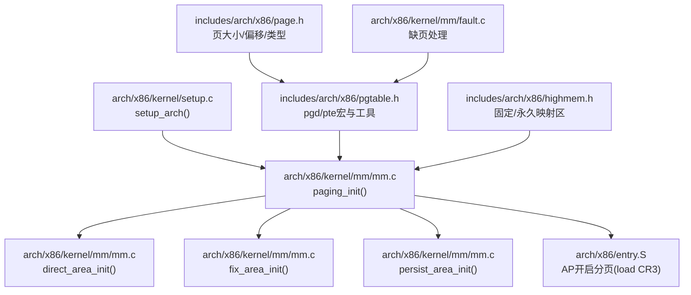
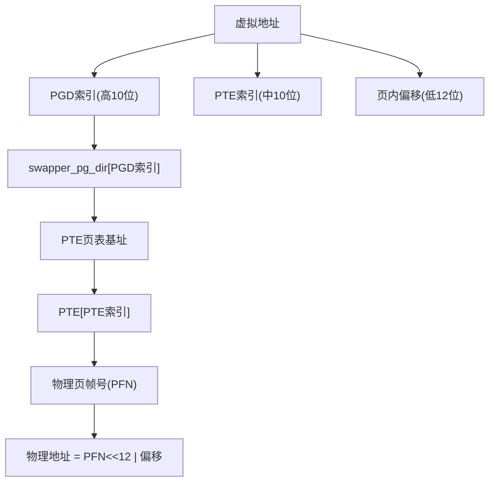
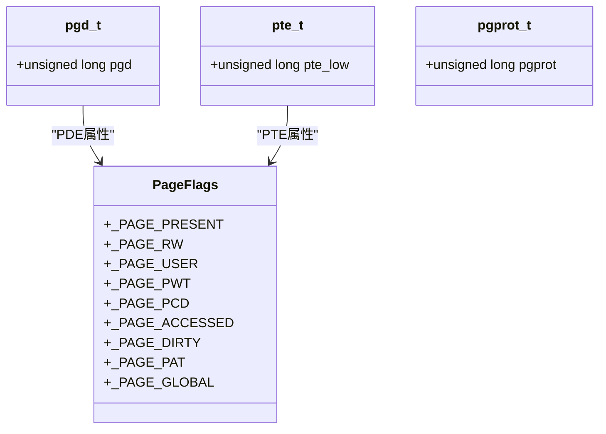
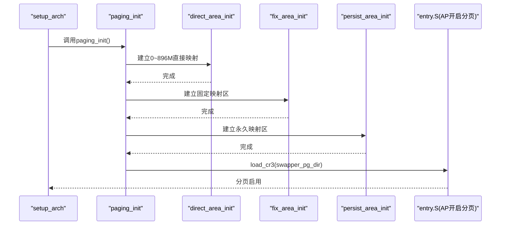
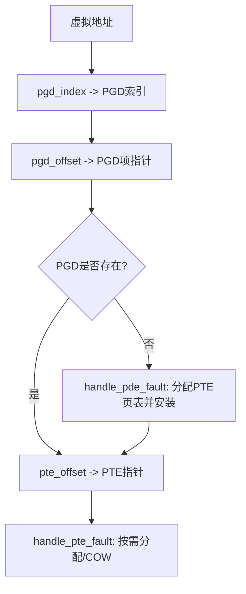
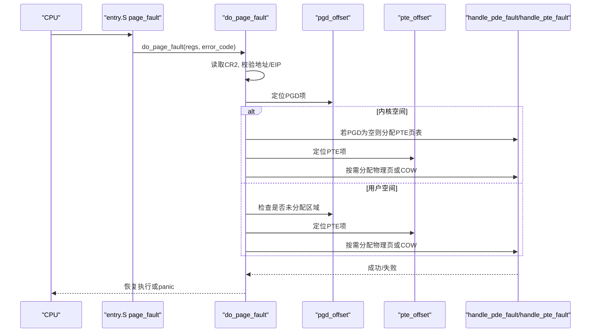
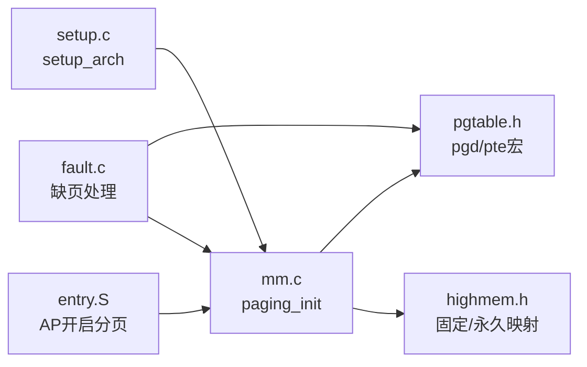
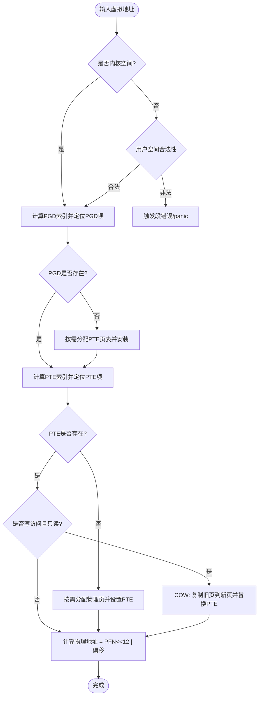

# 页表管理

<cite>
**本文引用的文件**
- [pgtable.h](file://includes/arch/x86/pgtable.h)
- [page.h](file://includes/arch/x86/page.h)
- [mm.c](file://arch/x86/kernel/mm/mm.c)
- [bootmem.c](file://kernel/mm/bootmem.c)
- [setup.c](file://arch/x86/kernel/setup.c)
- [fault.c](file://arch/x86/kernel/mm/fault.c)
- [highmem.h](file://includes/arch/x86/highmem.h)
- [entry.S](file://arch/x86/entry.S)
- [interrupts.h](file://includes/interrupts/interrupts.h)
</cite>

## 目录
1. [简介](#简介)
2. [项目结构](#项目结构)
3. [核心组件](#核心组件)
4. [架构总览](#架构总览)
5. [详细组件分析](#详细组件分析)
6. [依赖关系分析](#依赖关系分析)
7. [性能考虑](#性能考虑)
8. [故障排查指南](#故障排查指南)
9. [结论](#结论)
10. [附录](#附录)

## 简介
本文面向LulaOS在x86架构下的两级页表管理系统，系统采用PGD（页全局目录）+ PTE（页表项）的两级映射模型。文档重点包括：
- x86两级页表结构与PDE/PTE位域定义、权限控制
- 内核页表初始化流程：swapper_pg_dir建立与内核直接映射、固定映射区、永久映射区
- 关键操作函数原理：pgd_offset、pte_offset、TLB刷新
- 页表项属性标志位：存在位、读写、用户/内核模式等
- 缺页异常处理路径与按需分配策略
- 调试技巧与内存布局分析方法
- 虚拟地址到物理地址的转换流程图与结构图

## 项目结构
与页表相关的代码主要分布在以下位置：
- 头文件：包含页表结构、宏定义、接口声明
- 初始化：启动阶段建立内核页表并加载CR3
- 缺页处理：实现按需分配、写时复制、错误诊断
- 高内存与映射：固定映射区与永久映射区支持



图表来源
- [setup.c:182-196](file://arch/x86/kernel/setup.c#L182-L196)
- [mm.c:117-134](file://arch/x86/kernel/mm/mm.c#L117-L134)
- [pgtable.h:14-107](file://includes/arch/x86/pgtable.h#L14-L107)
- [page.h:5-42](file://includes/arch/x86/page.h#L5-L42)
- [fault.c:182-251](file://arch/x86/kernel/mm/fault.c#L182-L251)
- [highmem.h:19-67](file://includes/arch/x86/highmem.h#L19-L67)
- [entry.S:681-690](file://arch/x86/entry.S#L681-L690)

章节来源
- [setup.c:182-196](file://arch/x86/kernel/setup.c#L182-L196)
- [mm.c:117-134](file://arch/x86/kernel/mm/mm.c#L117-L134)
- [pgtable.h:14-107](file://includes/arch/x86/pgtable.h#L14-L107)
- [page.h:5-42](file://includes/arch/x86/page.h#L5-L42)
- [fault.c:182-251](file://arch/x86/kernel/mm/fault.c#L182-L251)
- [highmem.h:19-67](file://includes/arch/x86/highmem.h#L19-L67)
- [entry.S:681-690](file://arch/x86/entry.S#L681-L690)

## 核心组件
- 页表数据结构与宏
  - pgd_t、pte_t、pgprot_t 及其访问宏
  - 页大小、偏移、对齐宏
  - PGD/PTE索引计算、页表项属性宏、TLB刷新接口
- 内核页表初始化
  - swapper_pg_dir：内核全局页目录
  - direct_area_init：建立0~896M直接映射
  - fix_area_init：固定映射区（4G附近）
  - persist_area_init：永久映射区（PKMAP_BASE）
- 缺页异常处理
  - do_page_fault：入口与分派
  - handle_pde_fault：按需分配PTE页表
  - handle_pte_fault：按需分配物理页或COW
- 高内存与映射
  - 固定映射区与永久映射区定义与初始化
  - ioremap/vmalloc相关接口声明

章节来源
- [pgtable.h:23-128](file://includes/arch/x86/pgtable.h#L23-L128)
- [page.h:5-42](file://includes/arch/x86/page.h#L5-L42)
- [mm.c:24-134](file://arch/x86/kernel/mm/mm.c#L24-L134)
- [fault.c:76-251](file://arch/x86/kernel/mm/fault.c#L76-L251)
- [highmem.h:19-105](file://includes/arch/x86/highmem.h#L19-L105)

## 架构总览
LulaOS在x86下使用两级页表：
- 一级：PGD（页全局目录），每项指向一个PTE页表
- 二级：PTE（页表项），每项映射一个4KB页面

虚拟地址拆分（x86 32位）：
- 高位10位 → PGD索引
- 中间10位 → PTE索引
- 低位12位 → 页内偏移

内核空间从PAGE_OFFSET开始，用户空间低于PAGE_OFFSET。内核通过swapper_pg_dir维护全局映射，并在需要时按需创建缺失的PTE/PDE。



图表来源
- [pgtable.h:93-107](file://includes/arch/x86/pgtable.h#L93-L107)
- [page.h:5-11](file://includes/arch/x86/page.h#L5-L11)

章节来源
- [pgtable.h:93-107](file://includes/arch/x86/pgtable.h#L93-L107)
- [page.h:5-11](file://includes/arch/x86/page.h#L5-L11)

## 详细组件分析

### 页表项属性与权限控制
- 页表项位域定义
  - 存在位、读写位、用户/内核位、缓存控制位、已访问/脏标记、全局位等
- 常用保护属性宏
  - PAGE_KERNEL、PAGE_KERNEL_RO、PAGE_KERNEL_NOCACHE
  - PAGE_SHARED、PAGE_COPY、PAGE_READONLY
- 查询与修改接口
  - pte_present、pte_user、pte_read、pte_write、pte_dirty、pte_young
  - 设置/清除：pte_mkwrite、pte_wrprotect、pte_mkdirty、pte_mkclean等
- TLB刷新
  - __flush_tlb_all：重载CR3刷新全部TLB
  - __flush_tlb_one：invlpg刷新单个地址



图表来源
- [pgtable.h:23-63](file://includes/arch/x86/pgtable.h#L23-L63)
- [page.h:23-37](file://includes/arch/x86/page.h#L23-L37)

章节来源
- [pgtable.h:23-63](file://includes/arch/x86/pgtable.h#L23-L63)
- [pgtable.h:65-128](file://includes/arch/x86/pgtable.h#L65-L128)
- [page.h:23-42](file://includes/arch/x86/page.h#L23-L42)

### 页表初始化过程
- 启动阶段调用setup_arch，随后setup_memery进行内存信息收集与bootmem分配器初始化，最后调用paging_init建立内核页表。
- paging_init顺序：
  1) direct_area_init：为0~896M建立直接映射，遍历PGD并为每个PGD项分配PTE页表，填充PTE项指向对应物理页帧，设置内核属性
  2) fix_area_init：为固定映射区（4G附近）按4MB粒度建立PGD条目与PTE页表
  3) persist_area_init：为永久映射区（PKMAP_BASE）建立PGD条目与PTE页表，记录pkmap_page_table起始指针
  4) load_cr3：将swapper_pg_dir载入CR3，启用分页
  5) fixed_kmap_init：初始化固定映射区的临时映射能力
  6) zone_init：初始化内存区域



图表来源
- [setup.c:182-196](file://arch/x86/kernel/setup.c#L182-L196)
- [mm.c:117-134](file://arch/x86/kernel/mm/mm.c#L117-L134)
- [entry.S:681-690](file://arch/x86/entry.S#L681-L690)

章节来源
- [setup.c:182-196](file://arch/x86/kernel/setup.c#L182-L196)
- [mm.c:24-134](file://arch/x86/kernel/mm/mm.c#L24-L134)
- [entry.S:681-690](file://arch/x86/entry.S#L681-L690)

### 页表操作函数原理
- pgd_index(address)：根据虚拟地址的高10位计算PGD索引
- pte_index(address)：根据虚拟地址的中10位计算PTE索引
- pgd_offset(mm, address)：返回当前进程的PGD项指针（内核使用swapper_pg_dir）
- pte_offset(dir, address)：通过PGD项得到PTE页表基址，加上PTE索引得到PTE指针
- set_pgd/set_pte/__mk_pte：写入PGD/PTE项，构建页表项值（含PFN与属性）



图表来源
- [pgtable.h:93-107](file://includes/arch/x86/pgtable.h#L93-L107)
- [fault.c:157-171](file://arch/x86/kernel/mm/fault.c#L157-L171)
- [fault.c:96-150](file://arch/x86/kernel/mm/fault.c#L96-L150)

章节来源
- [pgtable.h:93-107](file://includes/arch/x86/pgtable.h#L93-L107)
- [fault.c:96-171](file://arch/x86/kernel/mm/fault.c#L96-L171)

### 缺页异常处理流程
- 触发：CPU发生页错误中断（#PF），entry.S将do_page_fault作为处理入口
- 主流程：
  - 读取CR2获取异常地址
  - 快速校验空指针与无效EIP
  - 定位PGD项，区分内核/用户空间
  - 内核空间：若PGD为空则按需分配PTE页表；否则进入PTE层处理
  - 用户空间：检查NULL保护页、未分配区域
  - PTE层：PTE为空→按需分配物理页；PTE存在且只读写→COW；其他→panic
- 无法处理：打印寄存器现场并停机



图表来源
- [entry.S:158-160](file://arch/x86/entry.S#L158-L160)
- [fault.c:182-251](file://arch/x86/kernel/mm/fault.c#L182-L251)
- [fault.c:76-171](file://arch/x86/kernel/mm/fault.c#L76-L171)

章节来源
- [entry.S:158-160](file://arch/x86/entry.S#L158-L160)
- [fault.c:182-251](file://arch/x86/kernel/mm/fault.c#L182-L251)
- [fault.c:76-171](file://arch/x86/kernel/mm/fault.c#L76-L171)

### 高内存与映射区
- 固定映射区（FIXADDR_TOP附近）：用于临时映射设备寄存器、APIC等，避免占用vmalloc区
- 永久映射区（PKMAP_BASE）：长期存在的映射，便于频繁访问的设备或数据结构
- 初始化：
  - fix_area_init：为固定映射区建立PGD/PTE
  - persist_area_init：为永久映射区建立PGD/PTE，记录pkmap_page_table
- 相关接口：set_fixmap、set_fixmap_nocache、ioremap/iounmap、vmalloc/vfree

章节来源
- [highmem.h:19-67](file://includes/arch/x86/highmem.h#L19-L67)
- [mm.c:58-107](file://arch/x86/kernel/mm/mm.c#L58-L107)

## 依赖关系分析
- setup_arch依赖memory map与bootmem分配器，最终调用paging_init
- paging_init依赖pgtable宏与页表结构，以及highmem映射区定义
- fault处理依赖pgtable工具与页表结构，同时依赖伙伴系统与bootmem释放逻辑
- AP开启分页在entry.S中直接load CR3，依赖swapper_pg_dir已就绪



图表来源
- [setup.c:182-196](file://arch/x86/kernel/setup.c#L182-L196)
- [mm.c:117-134](file://arch/x86/kernel/mm/mm.c#L117-L134)
- [pgtable.h:93-128](file://includes/arch/x86/pgtable.h#L93-L128)
- [highmem.h:19-67](file://includes/arch/x86/highmem.h#L19-L67)
- [fault.c:182-251](file://arch/x86/kernel/mm/fault.c#L182-L251)
- [entry.S:681-690](file://arch/x86/entry.S#L681-L690)

章节来源
- [setup.c:182-196](file://arch/x86/kernel/setup.c#L182-L196)
- [mm.c:117-134](file://arch/x86/kernel/mm/mm.c#L117-L134)
- [pgtable.h:93-128](file://includes/arch/x86/pgtable.h#L93-L128)
- [highmem.h:19-67](file://includes/arch/x86/highmem.h#L19-L67)
- [fault.c:182-251](file://arch/x86/kernel/mm/fault.c#L182-L251)
- [entry.S:681-690](file://arch/x86/entry.S#L681-L690)

## 性能考虑
- 两级页表查找开销：每次访存需两次查表（PGD+PTE），可通过TLB减少重复查找
- TLB刷新策略：批量变更时使用__flush_tlb_all，单条更新使用__flush_tlb_one以减少开销
- 固定映射与永久映射：减少频繁映射/解映射的开销，适合高频访问的设备或数据结构
- 按需分配：降低启动开销，但可能引入缺页异常延迟；建议对热点数据预分配
- 高内存访问：优先使用固定/永久映射，避免vmalloc带来的额外开销

## 故障排查指南
- 常见错误码含义
  - bit0：页不存在（0）或权限不足（1）
  - bit1：读/执行（0）或写（1）
  - bit2：内核态（0）或用户态（1）
  - bit3：保留位违规
  - bit4：取指引发
- 调试步骤
  - 查看do_page_fault_panic输出：记录CR2、error_code、EIP、寄存器状态
  - 确认PGD/PTE是否正确建立：检查pgd_none与pte_present
  - 检查ioremap区域：该区域PTE必须显式建立，不能走按需分配
  - 验证TLB一致性：修改页表后确保调用__flush_tlb_one或__flush_tlb_all
- 工具与方法
  - 使用printk输出关键变量：pgd_val、pte_val、address、error_code
  - 结合Bochs/QEMU日志观察CR2、CR3变化
  - 断点设置在do_page_fault入口，逐步跟踪handle_pde_fault/handle_pte_fault分支

章节来源
- [fault.c:256-290](file://arch/x86/kernel/mm/fault.c#L256-L290)
- [interrupts.h:25-25](file://includes/interrupts/interrupts.h#L25-L25)
- [pgtable.h:118-128](file://includes/arch/x86/pgtable.h#L118-L128)

## 结论
LulaOS的页表管理基于x86两级页表模型，通过swapper_pg_dir建立内核全局映射，并在启动阶段完成直接映射、固定映射与永久映射。缺页异常处理实现了按需分配与写时复制，配合TLB刷新机制保证一致性。开发者应重点关注PGD/PTE属性设置、映射区域规划与异常处理路径，以构建稳定高效的内存子系统。

## 附录

### 虚拟地址到物理地址转换流程图


图表来源
- [pgtable.h:93-107](file://includes/arch/x86/pgtable.h#L93-L107)
- [fault.c:96-171](file://arch/x86/kernel/mm/fault.c#L96-L171)
- [page.h:5-11](file://includes/arch/x86/page.h#L5-L11)

### 页表结构图
```mermaid
erDiagram
PGD {
unsigned long pgd_val
int present
int rw
int user
int accessed
int dirty
}
PTE {
unsigned long pte_low
int present
int rw
int user
int accessed
int dirty
int pfn
}
PGD ||--o{ PTE : "指向PTE页表"
```

图表来源
- [pgtable.h:23-63](file://includes/arch/x86/pgtable.h#L23-L63)
- [page.h:23-37](file://includes/arch/x86/page.h#L23-L37)