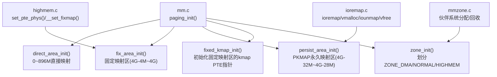
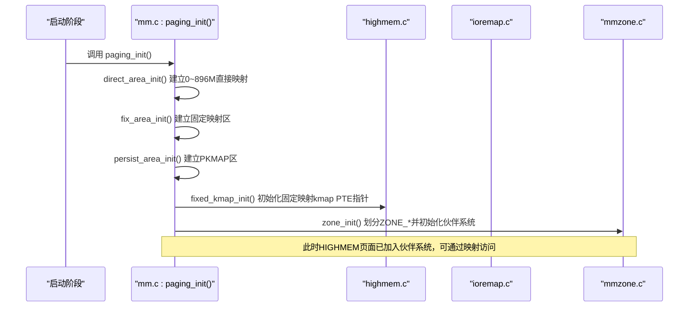
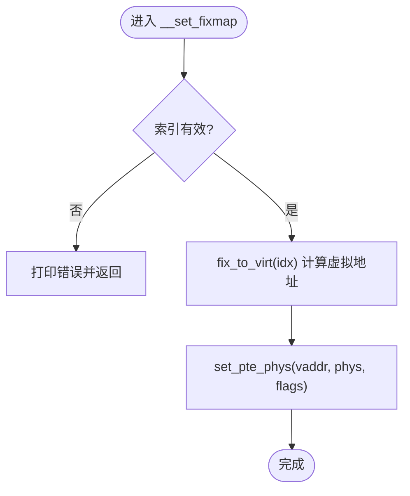
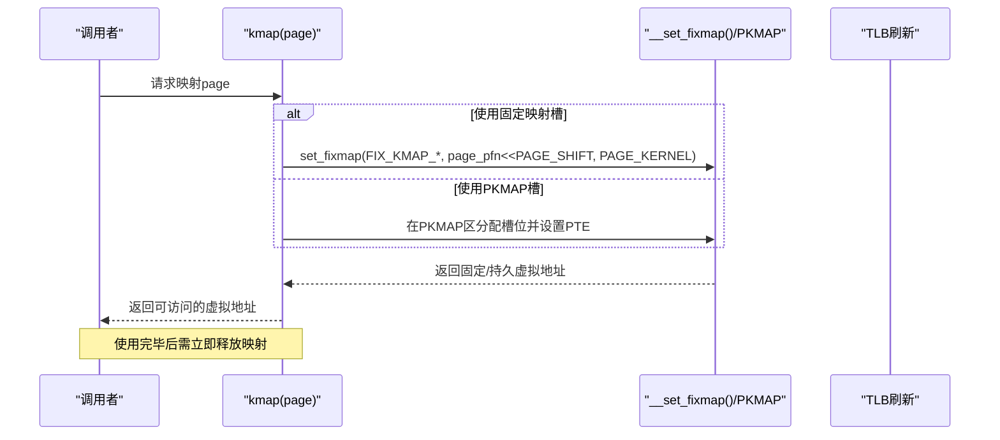
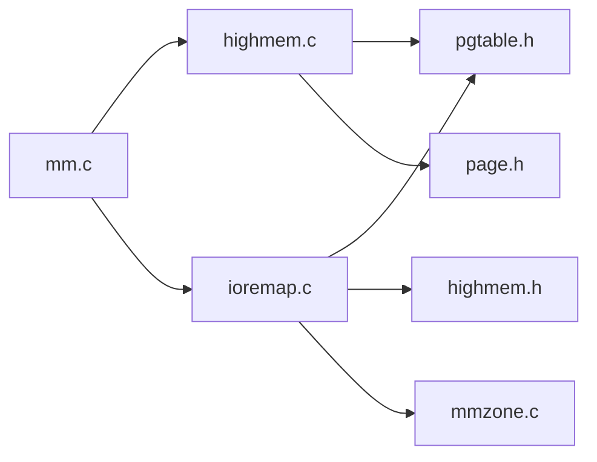
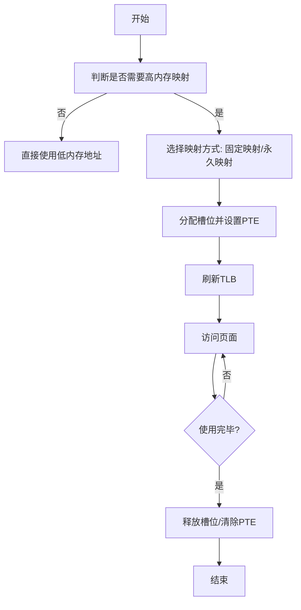
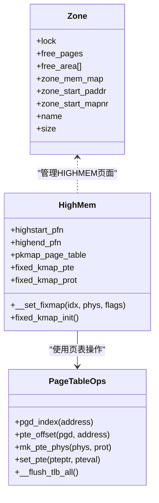

# 高内存管理

<cite>
**本文引用的文件列表**
- [kernel/mm/highmem.c](file://kernel/mm/highmem.c)
- [includes/arch/x86/highmem.h](file://includes/arch/x86/highmem.h)
- [arch/x86/kernel/mm/mm.c](file://arch/x86/kernel/mm/mm.c)
- [arch/x86/kernel/mm/ioremap.c](file://arch/x86/kernel/mm/ioremap.c)
- [includes/arch/x86/pgtable.h](file://includes/arch/x86/pgtable.h)
- [includes/arch/x86/page.h](file://includes/arch/x86/page.h)
- [kernel/mm/mmzone.c](file://kernel/mm/mmzone.c)
- [includes/mm/mmzone.h](file://includes/mm/mmzone.h)
</cite>

## 目录
1. [简介](#简介)
2. [项目结构](#项目结构)
3. [核心组件](#核心组件)
4. [架构总览](#架构总览)
5. [详细组件分析](#详细组件分析)
6. [依赖关系分析](#依赖关系分析)
7. [性能考虑](#性能考虑)
8. [故障排查指南](#故障排查指南)
9. [结论](#结论)
10. [附录](#附录)

## 简介
本文件面向LulaOS的“高内存（HighMem）”子系统，聚焦在32位x86系统中超过896MB物理内存的管理策略与访问机制。重点包括：
- 高内存的概念、必要性及与低内存的区别
- 固定映射区（fixmap）与永久映射区（PKMAP）的设计与作用
- 临时内核映射（kmap/kunmap）的实现原理与生命周期
- 高端页面的访问模式、TLB刷新与性能权衡
- 最佳实践与常见陷阱
- 高内存映射流程图与性能对比分析

## 项目结构
LulaOS将内存管理与页表初始化拆分到多个模块：
- 页表与地址空间布局：arch/x86/kernel/mm/mm.c
- 高内存基础能力（固定映射区、PKMAP基址等）：includes/arch/x86/highmem.h 与 kernel/mm/highmem.c
- I/O映射与vmalloc实现：arch/x86/kernel/mm/ioremap.c
- 伙伴系统与页面分配/回收：kernel/mm/mmzone.c 与 includes/mm/mmzone.h
- 页表操作与属性定义：includes/arch/x86/pgtable.h、includes/arch/x86/page.h

图表来源
- [arch/x86/kernel/mm/mm.c:117-134](file://arch/x86/kernel/mm/mm.c#L117-L134)
- [kernel/mm/highmem.c:13-48](file://kernel/mm/highmem.c#L13-L48)
- [arch/x86/kernel/mm/ioremap.c:88-140](file://arch/x86/kernel/mm/ioremap.c#L88-L140)
- [kernel/mm/mmzone.c:61-150](file://kernel/mm/mmzone.c#L61-L150)

章节来源
- [arch/x86/kernel/mm/mm.c:117-134](file://arch/x86/kernel/mm/mm.c#L117-L134)
- [kernel/mm/highmem.c:13-48](file://kernel/mm/highmem.c#L13-L48)
- [arch/x86/kernel/mm/ioremap.c:88-140](file://arch/x86/kernel/mm/ioremap.c#L88-L140)
- [kernel/mm/mmzone.c:61-150](file://kernel/mm/mmzone.c#L61-L150)

## 核心组件
- 高内存边界与分区
  - ZONE_NORMAL：0~896MB，内核可直接通过线性地址访问
  - ZONE_HIGHMEM：>896MB，需通过映射机制访问
- 固定映射区（FIXADDR_TOP附近）
  - 用于短生命周期、固定虚拟地址的内核态映射（如APIC、IO APIC、临时kmap槽位）
  - 通过 fix_to_virt(idx) 计算虚拟地址，使用 __set_fixmap 设置PTE
- 永久映射区（PKMAP_BASE=0xFE000000，约4MB）
  - 用于较长时间存在的页面映射（传统kmap/kunmap常基于此区域）
  - 由 persist_area_init() 建立PGD/PTE并记录 pkmap_page_table
- 页表与属性
  - PAGE_KERNEL、PAGE_KERNEL_NOCACHE 等保护位
  - pte_offset/pgd_index/mk_pte_phys 等工具函数

章节来源
- [includes/mm/mmzone.h:30-34](file://includes/mm/mmzone.h#L30-L34)
- [includes/arch/x86/highmem.h:19-55](file://includes/arch/x86/highmem.h#L19-L55)
- [arch/x86/kernel/mm/mm.c:83-107](file://arch/x86/kernel/mm/mm.c#L83-L107)
- [includes/arch/x86/pgtable.h:60-66](file://includes/arch/x86/pgtable.h#L60-L66)

## 架构总览
下图展示从启动到可用的高内存访问路径：

图表来源
- [arch/x86/kernel/mm/mm.c:117-134](file://arch/x86/kernel/mm/mm.c#L117-L134)
- [kernel/mm/highmem.c:43-48](file://kernel/mm/highmem.c#L43-L48)
- [kernel/mm/mmzone.c:61-150](file://kernel/mm/mmzone.c#L61-L150)

## 详细组件分析

### 高内存概念与必要性
- 32位x86内核仅能直接映射最多896MB物理内存（ZONE_NORMAL），超出部分为高内存（ZONE_HIGHMEM）
- 高内存必须通过显式映射才能被内核访问，避免占用宝贵的直接映射空间
- 高内存页面在启动时会被识别并加入伙伴系统，供后续按需映射使用

章节来源
- [includes/mm/mmzone.h:30-34](file://includes/mm/mmzone.h#L30-L34)
- [arch/x86/kernel/mm/mm.c:172-189](file://arch/x86/kernel/mm/mm.c#L172-L189)

### 固定映射区（FIXMAP）与临时映射
- 固定映射区位于接近4G的地址空间顶部，提供少量固定虚拟地址槽位
- 通过 set_fixmap/set_fixmap_nocache 将任意物理页映射到固定虚拟地址
- 适合短生命周期、对延迟敏感的场景（如中断上下文、原子操作）

图表来源
- [kernel/mm/highmem.c:31-41](file://kernel/mm/highmem.c#L31-L41)
- [includes/arch/x86/highmem.h:41-51](file://includes/arch/x86/highmem.h#L41-L51)

章节来源
- [kernel/mm/highmem.c:13-48](file://kernel/mm/highmem.c#L13-L48)
- [includes/arch/x86/highmem.h:19-55](file://includes/arch/x86/highmem.h#L19-L55)

### 永久映射区（PKMAP）与长期映射
- PKMAP_BASE=0xFE000000，预留约4MB空间，用于持久化页面映射
- 启动时通过 persist_area_init() 建立PGD/PTE，并记录 pkmap_page_table 起始位置
- 传统kmap/kunmap通常基于该区域进行页面映射与释放

章节来源
- [arch/x86/kernel/mm/mm.c:83-107](file://arch/x86/kernel/mm/mm.c#L83-L107)
- [includes/arch/x86/highmem.h:65-68](file://includes/arch/x86/highmem.h#L65-L68)

### kmap/kunmap 的实现要点与流程
说明：当前仓库未包含完整的kmap/kunmap实现代码，但提供了必要的支撑设施（FIXMAP/PKMAP、固定映射API）。典型流程如下：

图表来源
- [kernel/mm/highmem.c:31-48](file://kernel/mm/highmem.c#L31-L48)
- [arch/x86/kernel/mm/mm.c:83-107](file://arch/x86/kernel/mm/mm.c#L83-L107)

章节来源
- [kernel/mm/highmem.c:31-48](file://kernel/mm/highmem.c#L31-L48)
- [arch/x86/kernel/mm/mm.c:83-107](file://arch/x86/kernel/mm/mm.c#L83-L107)

### 高端页面访问模式与性能
- 固定映射（FIXMAP）：极短生命周期、固定虚拟地址，开销最小，适合中断/原子上下文
- 永久映射（PKMAP）：较长生命周期，需要维护槽位分配与释放，适合驱动批量I/O
- 非缓存映射（PAGE_KERNEL_NOCACHE）：适用于设备寄存器或一致性要求高的场景
- TLB刷新：每次修改页表后应刷新TLB，保证多CPU一致性

章节来源
- [includes/arch/x86/pgtable.h:60-66](file://includes/arch/x86/pgtable.h#L60-L66)
- [arch/x86/kernel/mm/ioremap.c:207-210](file://arch/x86/kernel/mm/ioremap.c#L207-L210)
- [arch/x86/kernel/mm/ioremap.c:422-425](file://arch/x86/kernel/mm/ioremap.c#L422-L425)

### 高内存与低内存的区别与适用场景
- 低内存（ZONE_NORMAL）：内核可直接访问，适合频繁访问、对延迟敏感的数据结构
- 高内存（ZONE_HIGHMEM）：需映射访问，适合大块缓冲、I/O数据、图形帧缓冲等
- 选择建议：优先复用低内存；仅在必要时使用高内存并尽量缩短映射时间

章节来源
- [includes/mm/mmzone.h:30-34](file://includes/mm/mmzone.h#L30-L34)
- [arch/x86/kernel/mm/ioremap.c:10-19](file://arch/x86/kernel/mm/ioremap.c#L10-L19)

### 最佳实践与常见陷阱
- 最佳实践
  - 使用固定映射处理短生命周期映射（如中断上下文）
  - 使用永久映射处理较长生命周期的页面映射
  - 对设备寄存器使用无缓存映射（PAGE_KERNEL_NOCACHE）
  - 及时释放映射，避免固定/永久槽位泄漏
  - 批量映射后再统一刷新TLB，减少开销
- 常见陷阱
  - 忘记释放映射导致槽位耗尽
  - 在中断上下文中使用可能睡眠的分配器
  - 跨CPU共享映射时未正确刷新TLB
  - 在高内存上执行长驻循环访问造成性能抖动

[本节为通用指导，不直接分析具体文件]

## 依赖关系分析
- mm.c 负责整体页表初始化与分区，依赖 highmem.c 提供的固定映射初始化
- ioremap.c 依赖 pgtable.h 的页表操作与 highmem.h 的常量定义
- mmzone.c 提供伙伴系统，供 vmalloc/ioremap 分配物理页
- highmem.h 暴露固定映射与PKMAP相关接口与常量

图表来源
- [arch/x86/kernel/mm/mm.c:117-134](file://arch/x86/kernel/mm/mm.c#L117-L134)
- [arch/x86/kernel/mm/ioremap.c:29-37](file://arch/x86/kernel/mm/ioremap.c#L29-L37)
- [kernel/mm/highmem.c:1-4](file://kernel/mm/highmem.c#L1-L4)
- [kernel/mm/mmzone.c:1-12](file://kernel/mm/mmzone.c#L1-L12)

章节来源
- [arch/x86/kernel/mm/mm.c:117-134](file://arch/x86/kernel/mm/mm.c#L117-L134)
- [arch/x86/kernel/mm/ioremap.c:29-37](file://arch/x86/kernel/mm/ioremap.c#L29-L37)
- [kernel/mm/highmem.c:1-4](file://kernel/mm/highmem.c#L1-L4)
- [kernel/mm/mmzone.c:1-12](file://kernel/mm/mmzone.c#L1-L12)

## 性能考虑
- 固定映射 vs 永久映射
  - 固定映射：无需维护复杂状态，切换快，适合极短生命周期
  - 永久映射：需要槽位管理，适合较长生命周期但存在分配/释放成本
- 缓存策略
  - 普通内存使用可缓存映射（PAGE_KERNEL）
  - 设备寄存器使用无缓存映射（PAGE_KERNEL_NOCACHE）以避免乱序与缓存一致性问题
- TLB刷新
  - 批量修改页表后统一刷新，减少invlpg/cr3写开销
- 伙伴系统
  - 合理选择order，避免过度碎片化
  - 释放时自动合并伙伴块，降低碎片

[本节为通用指导，不直接分析具体文件]

## 故障排查指南
- 固定映射越界
  - 现象：__set_fixmap 打印无效索引
  - 排查：检查传入的索引是否小于 __end_of_fixed_addresses
- 页表缺失
  - 现象：PAE BUG 或无法定位PTE
  - 排查：确认对应PGD项是否存在，必要时重新分配PTE页
- 映射泄漏
  - 现象：固定/永久槽位耗尽，新映射失败
  - 排查：确保每处映射都有对应的释放路径
- TLB不一致
  - 现象：多CPU下读取旧数据
  - 排查：确认修改页表后调用了TLB刷新

章节来源
- [kernel/mm/highmem.c:31-41](file://kernel/mm/highmem.c#L31-L41)
- [arch/x86/kernel/mm/ioremap.c:207-210](file://arch/x86/kernel/mm/ioremap.c#L207-L210)
- [arch/x86/kernel/mm/ioremap.c:422-425](file://arch/x86/kernel/mm/ioremap.c#L422-L425)

## 结论
LulaOS通过固定映射区与永久映射区协同工作，为32位系统下的896MB以上高内存提供可控、高效的访问能力。配合伙伴系统与页表管理，开发者可以在不同场景选择合适的映射策略，兼顾性能与资源利用率。遵循最佳实践并及时释放映射，是稳定运行高内存的关键。

[本节为总结性内容，不直接分析具体文件]

## 附录

### 高内存映射流程图（概念级）

[此图为概念流程，不对应具体源码文件，故无图表来源]

### 关键数据结构与关系（类图）

图表来源
- [includes/mm/mmzone.h:35-46](file://includes/mm/mmzone.h#L35-L46)
- [includes/arch/x86/pgtable.h:93-128](file://includes/arch/x86/pgtable.h#L93-L128)
- [kernel/mm/highmem.c:6-48](file://kernel/mm/highmem.c#L6-L48)