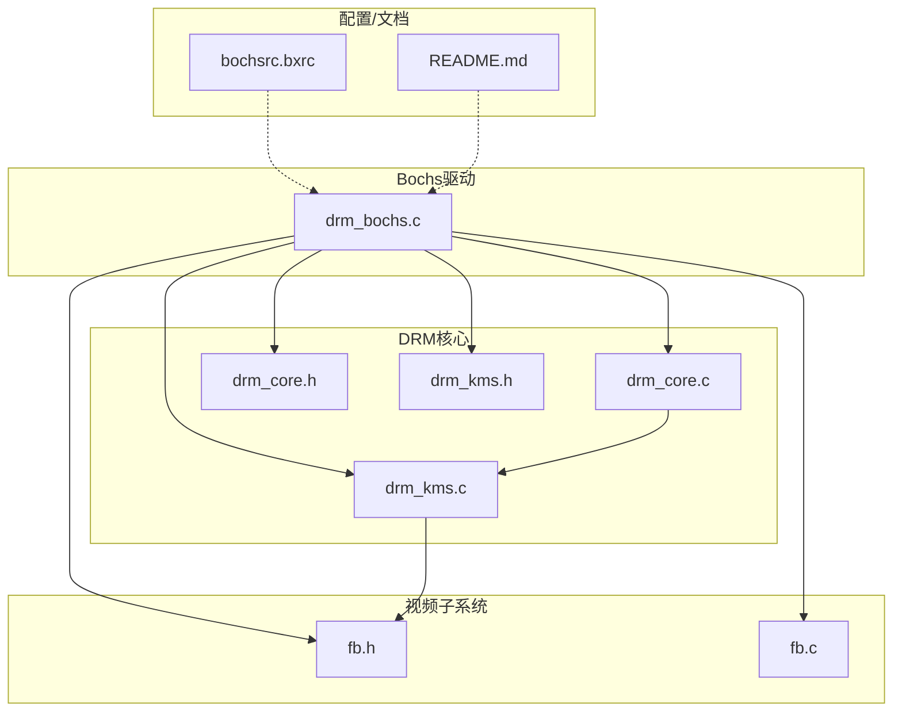
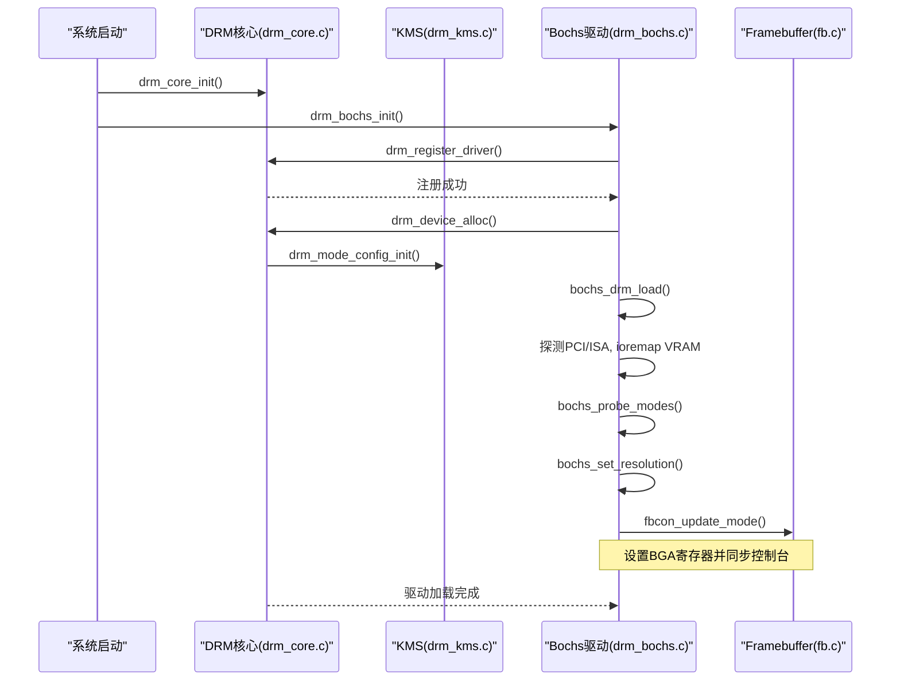
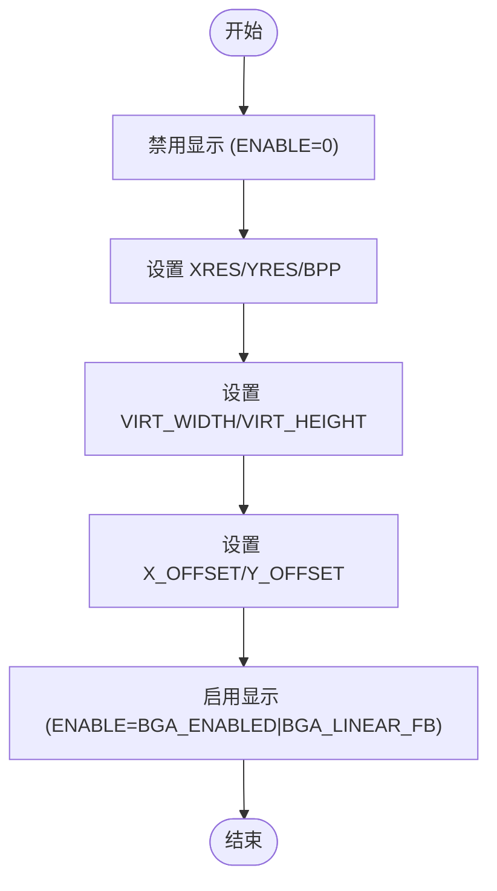
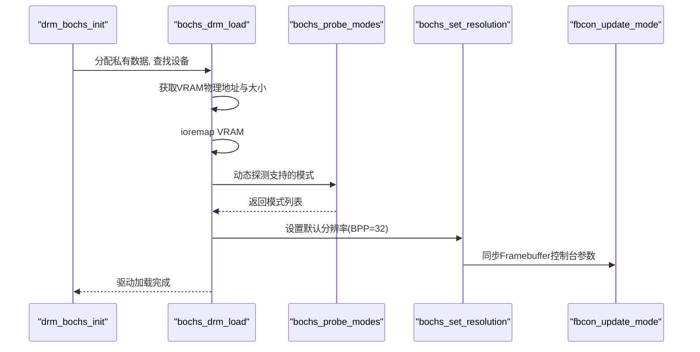
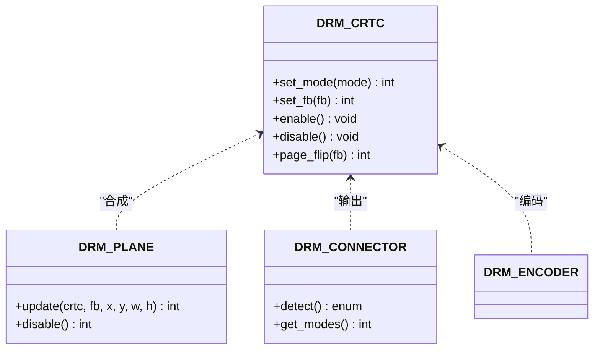
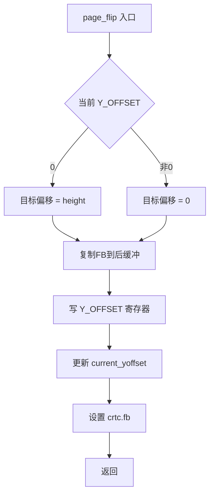
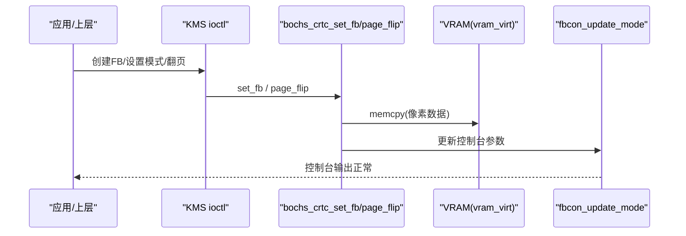
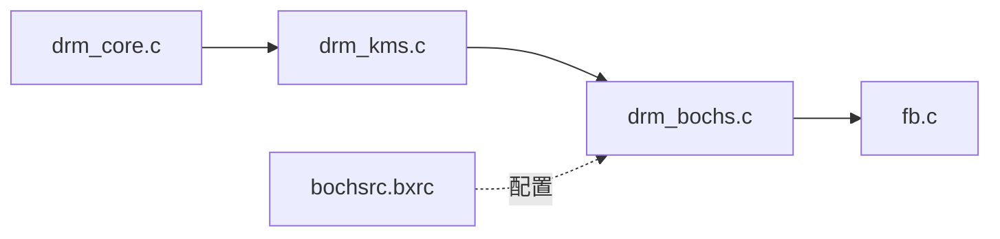

# Bochs VGA驱动

<cite>
**本文引用的文件**
- [kernel/drm/drm_bochs.c](file://kernel/drm/drm_bochs.c)
- [includes/drm/drm_core.h](file://includes/drm/drm_core.h)
- [includes/drm/drm_kms.h](file://includes/drm/drm_kms.h)
- [kernel/drm/drm_core.c](file://kernel/drm/drm_core.c)
- [kernel/drm/drm_kms.c](file://kernel/drm/drm_kms.c)
- [includes/video/fb.h](file://includes/video/fb.h)
- [kernel/video/fb.c](file://kernel/video/fb.c)
- [bochsrc.bxrc](file://bochsrc.bxrc)
- [README.md](file://README.md)
</cite>

## 目录
1. [简介](#简介)
2. [项目结构](#项目结构)
3. [核心组件](#核心组件)
4. [架构总览](#架构总览)
5. [详细组件分析](#详细组件分析)
6. [依赖关系分析](#依赖关系分析)
7. [性能考虑](#性能考虑)
8. [故障排查指南](#故障排查指南)
9. [结论](#结论)
10. [附录](#附录)

## 简介
本文件为LulaOS中Bochs/QEMU VBE的VGA DRM驱动提供完整技术文档。内容涵盖：
- Bochs虚拟机的VGA硬件模拟特性与BGA寄存器映射
- 驱动的初始化流程、设备探测机制与模式枚举
- VGA寄存器读写、显示模式配置与双缓冲翻页
- 图形输出实现细节（VRAM映射、帧缓冲拷贝、控制台同步）
- 驱动配置选项与调试方法
- 在虚拟机环境下进行图形开发的实践指南

## 项目结构
本项目采用分层组织：DRM核心框架位于内核层，具体GPU驱动以模块形式接入；视频子系统提供Framebuffer控制台能力；Bochs/VBE相关逻辑集中在drm_bochs.c中。

**图表来源**
- [kernel/drm/drm_bochs.c:1-591](file://kernel/drm/drm_bochs.c#L1-L591)
- [kernel/drm/drm_core.c:1-375](file://kernel/drm/drm_core.c#L1-L375)
- [kernel/drm/drm_kms.c:1-470](file://kernel/drm/drm_kms.c#L1-L470)
- [includes/drm/drm_core.h:1-155](file://includes/drm/drm_core.h#L1-L155)
- [includes/drm/drm_kms.h:1-318](file://includes/drm/drm_kms.h#L1-L318)
- [kernel/video/fb.c:1-320](file://kernel/video/fb.c#L1-L320)
- [includes/video/fb.h:1-49](file://includes/video/fb.h#L1-L49)
- [bochsrc.bxrc:1-59](file://bochsrc.bxrc#L1-L59)
- [README.md:1-84](file://README.md#L1-L84)

**章节来源**
- [kernel/drm/drm_bochs.c:1-591](file://kernel/drm/drm_bochs.c#L1-L591)
- [kernel/drm/drm_core.c:1-375](file://kernel/drm/drm_core.c#L1-L375)
- [kernel/drm/drm_kms.c:1-470](file://kernel/drm/drm_kms.c#L1-L470)
- [includes/drm/drm_core.h:1-155](file://includes/drm/drm_core.h#L1-L155)
- [includes/drm/drm_kms.h:1-318](file://includes/drm/drm_kms.h#L1-L318)
- [kernel/video/fb.c:1-320](file://kernel/video/fb.c#L1-L320)
- [includes/video/fb.h:1-49](file://includes/video/fb.h#L1-L49)
- [bochsrc.bxrc:1-59](file://bochsrc.bxrc#L1-L59)
- [README.md:1-84](file://README.md#L1-L84)

## 核心组件
- Bochs设备结构与BGA寄存器操作：定义BGA索引/数据端口、分辨率/BPP/偏移等寄存器，封装读写函数，并提供分辨率设置与双缓冲支持。
- CRTC/Plane/Connector/Encoder：实现KMS对象回调，完成模式设置、FB绑定、页面翻转等。
- 模式探测：基于VRAM大小动态筛选支持的分辨率列表，并设置默认最高模式。
- VRAM管理：从PCI BAR或固定地址获取物理显存，使用ioremap映射到内核虚拟地址空间，供写入像素数据。
- 控制台同步：在分辨率变化时更新Framebuffer控制台参数，避免花屏和越界访问。

**章节来源**
- [kernel/drm/drm_bochs.c:30-214](file://kernel/drm/drm_bochs.c#L30-L214)
- [kernel/drm/drm_bochs.c:216-384](file://kernel/drm/drm_bochs.c#L216-L384)
- [kernel/drm/drm_bochs.c:388-523](file://kernel/drm/drm_bochs.c#L388-L523)
- [kernel/video/fb.c:204-251](file://kernel/video/fb.c#L204-L251)

## 架构总览
下图展示了Bochs驱动与DRM核心、KMS以及Framebuffer控制台的交互关系。

**图表来源**
- [kernel/drm/drm_core.c:258-343](file://kernel/drm/drm_core.c#L258-L343)
- [kernel/drm/drm_kms.c:79-103](file://kernel/drm/drm_kms.c#L79-L103)
- [kernel/drm/drm_bochs.c:560-591](file://kernel/drm/drm_bochs.c#L560-L591)
- [kernel/drm/drm_bochs.c:388-523](file://kernel/drm/drm_bochs.c#L388-L523)
- [kernel/video/fb.c:204-251](file://kernel/video/fb.c#L204-L251)

## 详细组件分析

### BGA寄存器与硬件模拟
- 端口映射：索引端口0x01CE，数据端口0x01CF。
- 关键寄存器：ID、XRES、YRES、BPP、ENABLE、BANK、VIRT_WIDTH、VIRT_HEIGHT、X_OFFSET、Y_OFFSET。
- 启用标志：BGA_ENABLED与BGA_LINEAR_FB用于开启线性帧缓冲模式。
- 读写封装：通过outw/inw对BGA寄存器进行原子化访问。

**图表来源**
- [kernel/drm/drm_bochs.c:117-127](file://kernel/drm/drm_bochs.c#L117-L127)
- [kernel/drm/drm_bochs.c:167-214](file://kernel/drm/drm_bochs.c#L167-L214)

**章节来源**
- [kernel/drm/drm_bochs.c:30-49](file://kernel/drm/drm_bochs.c#L30-L49)
- [kernel/drm/drm_bochs.c:117-127](file://kernel/drm/drm_bochs.c#L117-L127)
- [kernel/drm/drm_bochs.c:167-214](file://kernel/drm/drm_bochs.c#L167-L214)

### 初始化流程与设备探测
- 驱动入口：drm_bochs_init()注册驱动并创建设备，调用load()完成硬件初始化。
- 设备查找：优先查找QEMU std-vga（PCI 0x1234:0x1111），未找到则回退至Bochs VBE（固定VRAM地址0xE0000000）。
- VRAM映射：使用ioremap将物理显存映射到内核虚拟地址空间，便于直接写入像素。
- 模式探测：根据VRAM大小计算可承载的双缓冲帧数，筛选出支持的分辨率列表。
- 默认模式：选择列表中最大分辨率作为初始模式，并通过BGA寄存器设置。

**图表来源**
- [kernel/drm/drm_bochs.c:560-591](file://kernel/drm/drm_bochs.c#L560-L591)
- [kernel/drm/drm_bochs.c:388-523](file://kernel/drm/drm_bochs.c#L388-L523)
- [kernel/drm/drm_bochs.c:140-165](file://kernel/drm/drm_bochs.c#L140-L165)
- [kernel/drm/drm_bochs.c:167-214](file://kernel/drm/drm_bochs.c#L167-L214)
- [kernel/video/fb.c:204-251](file://kernel/video/fb.c#L204-L251)

**章节来源**
- [kernel/drm/drm_bochs.c:388-523](file://kernel/drm/drm_bochs.c#L388-L523)
- [kernel/drm/drm_bochs.c:140-165](file://kernel/drm/drm_bochs.c#L140-L165)

### CRTC/Plane/Connector回调与显示模式配置
- CRTC：set_mode设置分辨率，set_fb将FB内容拷贝到VRAM，enable/disable控制显示开关，page_flip实现双缓冲翻页。
- Plane：primary plane更新时将FB内容复制到VRAM。
- Connector：始终连接，get_modes填充动态探测到的分辨率列表。
- Encoder：简化为空操作。

**图表来源**
- [includes/drm/drm_kms.h:92-214](file://includes/drm/drm_kms.h#L92-L214)
- [kernel/drm/drm_bochs.c:216-384](file://kernel/drm/drm_bochs.c#L216-L384)

**章节来源**
- [kernel/drm/drm_bochs.c:216-384](file://kernel/drm/drm_bochs.c#L216-L384)
- [includes/drm/drm_kms.h:92-214](file://includes/drm/drm_kms.h#L92-L214)

### 双缓冲翻页机制
- 原理：虚拟高度设置为实际高度的两倍，前缓冲位于Y=0~height-1，后缓冲位于Y=height~2*height-1。
- 流程：新帧写入后缓冲，切换Y_OFFSET指向后缓冲，完成无撕裂翻页。
- 实现：page_flip回调中计算目标偏移，复制FB到对应位置，更新寄存器与状态。

**图表来源**
- [kernel/drm/drm_bochs.c:261-305](file://kernel/drm/drm_bochs.c#L261-L305)

**章节来源**
- [kernel/drm/drm_bochs.c:261-305](file://kernel/drm/drm_bochs.c#L261-L305)

### 图形输出实现细节
- VRAM来源：QEMU通过PCI BAR0提供，Bochs固定于0xE0000000。
- 映射策略：使用ioremap将完整VRAM映射到虚拟地址空间，避免GRUB小映射导致的Page Fault。
- 像素写入：CRTC/Plane回调中将FB内容memcpy到vram_virt，确保格式与pitch一致。
- 控制台同步：分辨率变化时调用fbcon_update_mode更新宽度、高度、pitch、bpp及虚拟地址，清屏并复位光标。

**图表来源**
- [kernel/drm/drm_bochs.c:226-246](file://kernel/drm/drm_bochs.c#L226-L246)
- [kernel/drm/drm_bochs.c:271-305](file://kernel/drm/drm_bochs.c#L271-L305)
- [kernel/video/fb.c:204-251](file://kernel/video/fb.c#L204-L251)

**章节来源**
- [kernel/drm/drm_bochs.c:226-305](file://kernel/drm/drm_bochs.c#L226-L305)
- [kernel/video/fb.c:204-251](file://kernel/video/fb.c#L204-L251)

## 依赖关系分析
- DRM核心：提供驱动注册、设备分配、ioctl分发、KMS对象管理。
- KMS：实现CRTC/Plane/Connector/Encoder/FB生命周期与模式设置。
- 视频子系统：提供Framebuffer控制台能力，并在分辨率变化时同步参数。
- 配置：bochsrc.bxrc启用VBE扩展，确保Bochs暴露VGA接口。

**图表来源**
- [kernel/drm/drm_core.c:1-375](file://kernel/drm/drm_core.c#L1-L375)
- [kernel/drm/drm_kms.c:1-470](file://kernel/drm/drm_kms.c#L1-L470)
- [kernel/drm/drm_bochs.c:1-591](file://kernel/drm/drm_bochs.c#L1-L591)
- [kernel/video/fb.c:1-320](file://kernel/video/fb.c#L1-L320)
- [bochsrc.bxrc:1-59](file://bochsrc.bxrc#L1-L59)

**章节来源**
- [kernel/drm/drm_core.c:1-375](file://kernel/drm/drm_core.c#L1-L375)
- [kernel/drm/drm_kms.c:1-470](file://kernel/drm/drm_kms.c#L1-L470)
- [kernel/drm/drm_bochs.c:1-591](file://kernel/drm/drm_bochs.c#L1-L591)
- [kernel/video/fb.c:1-320](file://kernel/video/fb.c#L1-L320)
- [bochsrc.bxrc:1-59](file://bochsrc.bxrc#L1-L59)

## 性能考虑
- 内存带宽：像素拷贝使用memcpy，注意pitch对齐与边界检查，避免越界。
- 双缓冲：通过虚拟高度翻倍减少撕裂，但需确保VRAM足够容纳两帧。
- 模式选择：优先选择VRAM可承载的最大分辨率，避免频繁切换导致开销。
- 映射范围：使用完整VRAM映射降低Page Fault风险，提升稳定性。

[本节为通用指导，不直接分析具体文件]

## 故障排查指南
- 无VRAM或映射失败：检查PCI BAR或Bochs固定地址是否正确，确认ioremap返回值。
- 花屏或越界：确保fbcon_update_mode已调用，且new_virt指向完整映射区域。
- 无法设置模式：验证BGA寄存器写入顺序（先禁用再设置再启用），检查XRES/YRES/BPP是否合法。
- 翻页异常：确认虚拟高度与实际高度的关系，检查Y_OFFSET更新与FB复制偏移。

**章节来源**
- [kernel/drm/drm_bochs.c:425-437](file://kernel/drm/drm_bochs.c#L425-L437)
- [kernel/video/fb.c:204-251](file://kernel/video/fb.c#L204-L251)
- [kernel/drm/drm_bochs.c:167-214](file://kernel/drm/drm_bochs.c#L167-L214)
- [kernel/drm/drm_bochs.c:271-305](file://kernel/drm/drm_bochs.c#L271-L305)

## 结论
本驱动在LulaOS中实现了Bochs/QEMU VBE的VGA图形输出，通过BGA寄存器控制显示模式，结合DRM/KMS框架提供稳定的模式设置与双缓冲翻页能力。配合Framebuffer控制台同步，确保在分辨率变化时的正确显示。建议在开发中关注VRAM容量限制与映射范围，以获得最佳性能与稳定性。

[本节为总结性内容，不直接分析具体文件]

## 附录

### 配置选项与环境
- Bochs配置：启用VBE扩展，确保显卡接口可用。
- 构建与运行：参考README中的工具链与运行命令。

**章节来源**
- [bochsrc.bxrc:28-30](file://bochsrc.bxrc#L28-L30)
- [README.md:77-81](file://README.md#L77-L81)

### API与数据结构速查
- BGA寄存器：索引/数据端口、分辨率/BPP/偏移等。
- KMS对象：CRTC/Plane/Connector/Encoder/FB及其回调。
- 错误码：DRM_ERR_*系列。

**章节来源**
- [kernel/drm/drm_bochs.c:30-49](file://kernel/drm/drm_bochs.c#L30-L49)
- [includes/drm/drm_kms.h:29-59](file://includes/drm/drm_kms.h#L29-L59)
- [includes/drm/drm_core.h:147-152](file://includes/drm/drm_core.h#L147-L152)