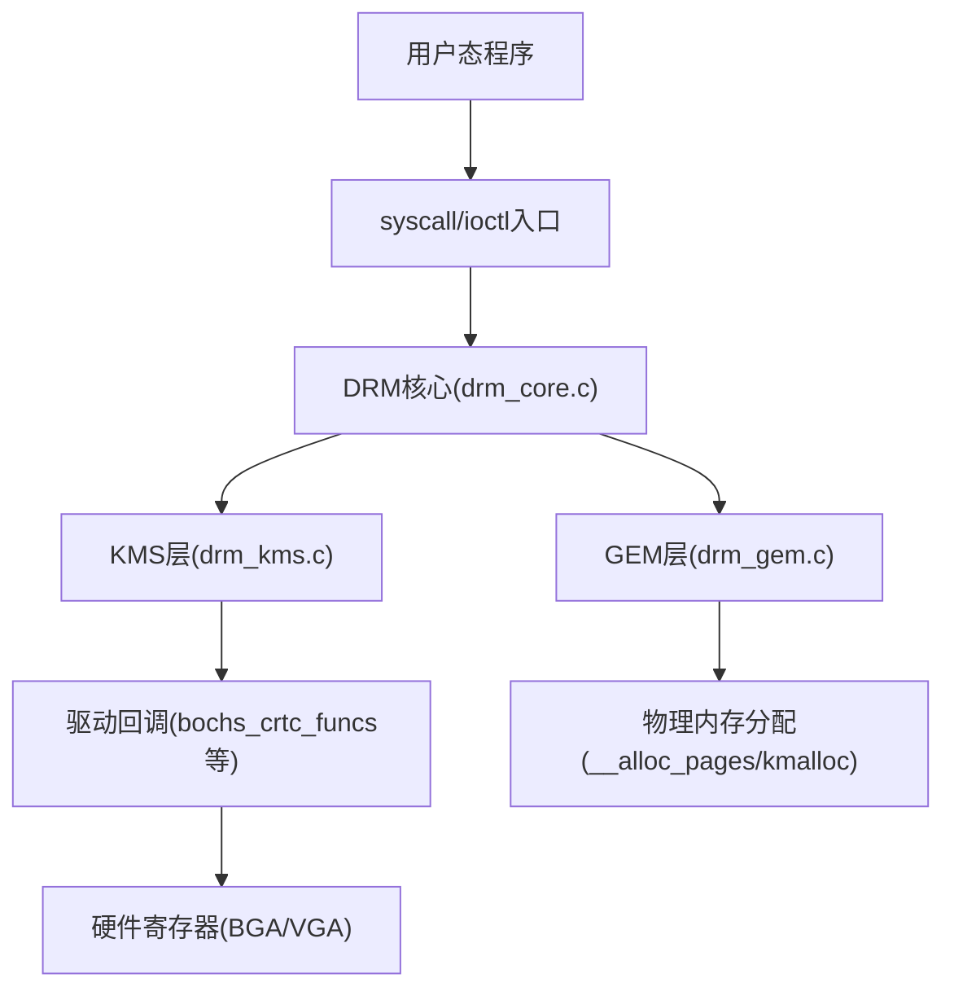
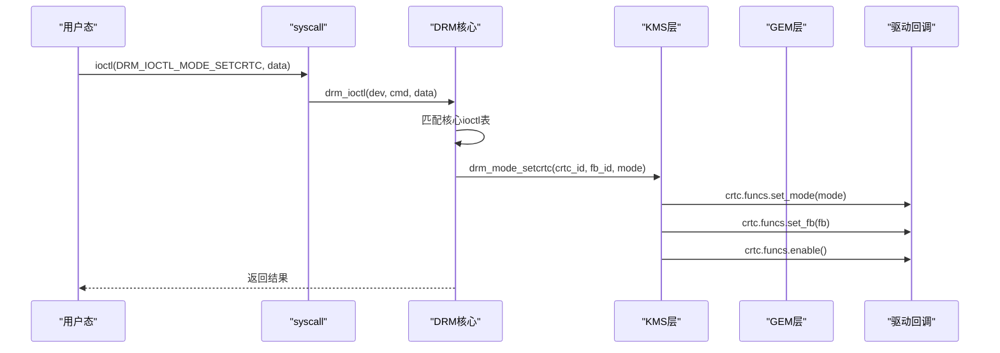
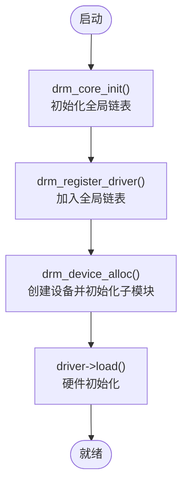
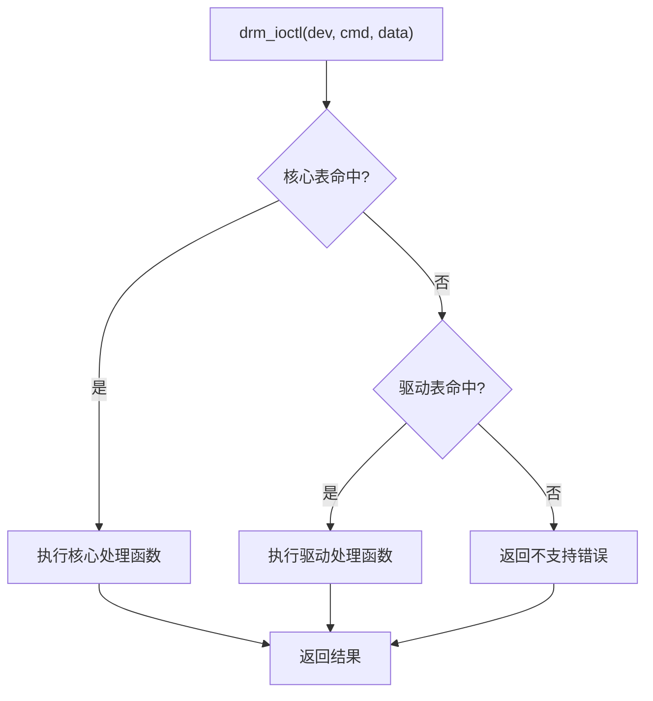
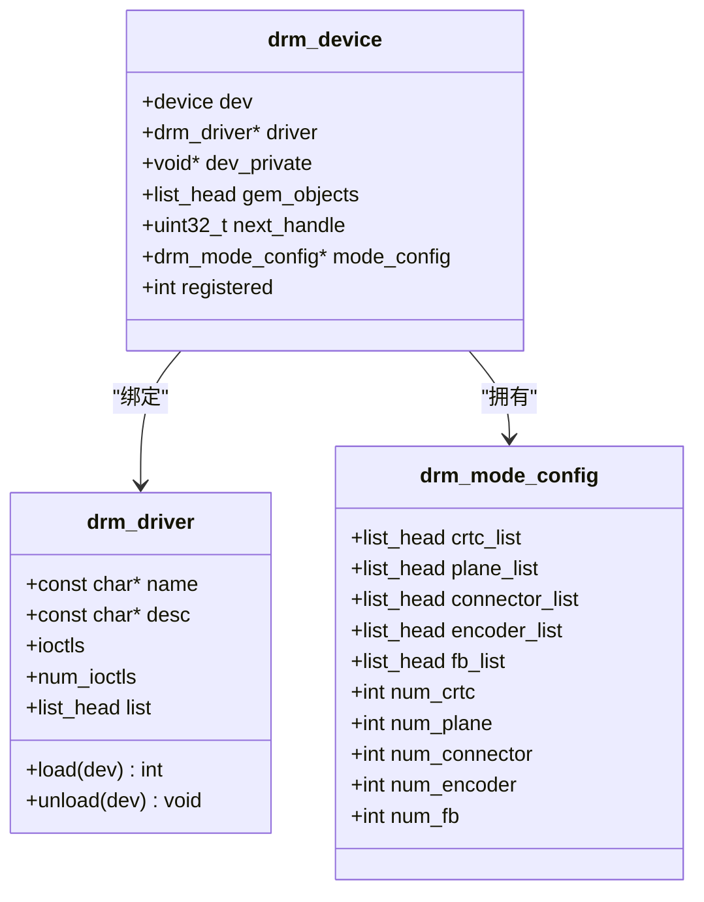
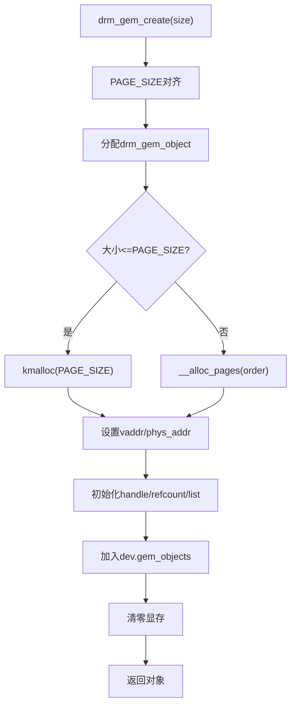
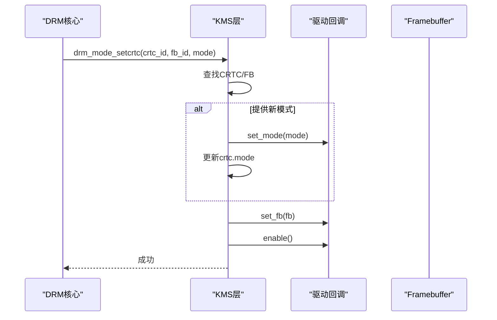
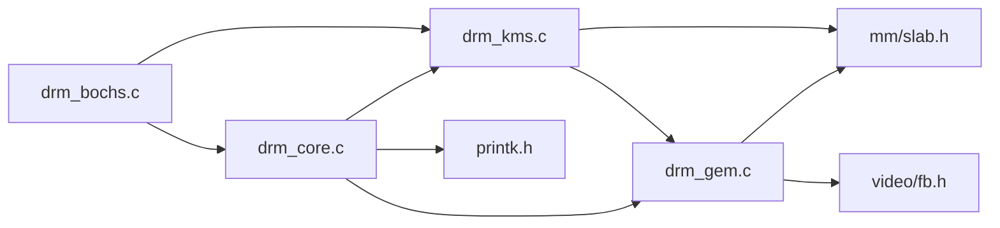

# DRM框架核心

<cite>
**本文引用的文件**
- [drm_core.h](file://includes/drm/drm_core.h)
- [drm_core.c](file://kernel/drm/drm_core.c)
- [drm_ioctl.h](file://includes/drm/drm_ioctl.h)
- [drm_gem.h](file://includes/drm/drm_gem.h)
- [drm_gem.c](file://kernel/drm/drm_gem.c)
- [drm_kms.h](file://includes/drm/drm_kms.h)
- [drm_kms.c](file://kernel/drm/drm_kms.c)
- [drm_bochs.c](file://kernel/drm/drm_bochs.c)
- [drm_fb_helper.c](file://kernel/drm/drm_fb_helper.c)
</cite>

## 目录
1. [简介](#简介)
2. [项目结构](#项目结构)
3. [核心组件](#核心组件)
4. [架构总览](#架构总览)
5. [详细组件分析](#详细组件分析)
6. [依赖关系分析](#依赖关系分析)
7. [性能考量](#性能考量)
8. [故障排查指南](#故障排查指南)
9. [结论](#结论)
10. [附录：API参考与最佳实践](#附录api参考与最佳实践)

## 简介
本文件为LulaOS的DRM（内核模式设置）框架核心文档，面向DRM驱动开发者。内容覆盖整体架构、驱动注册机制、设备管理模型、ioctl命令分发、drm_device生命周期、全局驱动链表管理、GEM对象管理与内存共享机制，以及KMS显示控制流程。通过Bochs/QEMU VBE驱动示例，展示如何从零实现一个DRM驱动并接入系统。

## 项目结构
DRM子系统按职责分层组织：
- 核心层：设备/驱动注册、ioctl分发、全局状态维护
- KMS层：CRTC/Plane/Connector/Encoder/Framebuffer等显示对象管理
- GEM层：显存对象分配、映射、引用计数
- 驱动层：具体GPU驱动（以Bochs为例）
- 图形辅助层：帧缓冲绘制API（用于测试和演示）

图表来源
- [drm_core.c:287-311](file://kernel/drm/drm_core.c#L287-L311)
- [drm_kms.c:382-469](file://kernel/drm/drm_kms.c#L382-L469)
- [drm_gem.c:135-217](file://kernel/drm/drm_gem.c#L135-L217)
- [drm_bochs.c:218-313](file://kernel/drm/drm_bochs.c#L218-L313)

章节来源
- [drm_core.h:14-155](file://includes/drm/drm_core.h#L14-L155)
- [drm_core.c:25-31](file://kernel/drm/drm_core.c#L25-L31)

## 核心组件
- drm_driver：驱动描述符，包含名称、描述、生命周期回调(load/unload)、私有ioctl表、链表节点
- drm_device：设备描述符，嵌入统一设备模型，持有绑定驱动、私有数据、GEM对象链表、mode_config、状态标志
- drm_mode_config：KMS全局配置，维护CRTC/Plane/Connector/Encoder/FB列表及数量
- drm_gem_object：显存对象，封装物理连续内存、内核虚拟地址、handle、引用计数
- ioctl描述符：cmd到处理函数的映射，核心与驱动各自维护

章节来源
- [drm_core.h:30-90](file://includes/drm/drm_core.h#L30-L90)
- [drm_kms.h:245-261](file://includes/drm/drm_kms.h#L245-L261)
- [drm_gem.h:24-45](file://includes/drm/drm_gem.h#L24-L45)

## 架构总览
DRM框架采用“核心+驱动”的分层设计：
- 核心负责通用能力：驱动注册、设备创建、ioctl分发、资源清理
- 驱动实现具体硬件操作：初始化VRAM、设置分辨率、双缓冲翻页、模式枚举
- KMS抽象显示管线：CRTC从FB读取像素并按时序扫描输出
- GEM统一管理显存：CPU/GPU共享同一块物理内存，通过handle访问

图表来源
- [drm_core.c:287-311](file://kernel/drm/drm_core.c#L287-L311)
- [drm_kms.c:382-433](file://kernel/drm/drm_kms.c#L382-L433)
- [drm_bochs.c:218-259](file://kernel/drm/drm_bochs.c#L218-L259)

## 详细组件分析

### 驱动注册与发现机制
- 全局驱动链表：所有已注册的drm_driver通过list_head链入drm_driver_list
- 注册流程：drm_register_driver将驱动加入链表，供后续匹配或查询
- 设备创建：drm_device_alloc分配设备，初始化GEM/KMS子系统，记录全局设备指针
- 注销流程：drm_unregister_driver从链表移除；drm_device_free清理KMS/GEM并释放设备

图表来源
- [drm_core.c:258-285](file://kernel/drm/drm_core.c#L258-L285)
- [drm_core.c:320-344](file://kernel/drm/drm_core.c#L320-L344)

章节来源
- [drm_core.h:92-120](file://includes/drm/drm_core.h#L92-L120)
- [drm_core.c:25-31](file://kernel/drm/drm_core.c#L25-L31)
- [drm_core.c:258-344](file://kernel/drm/drm_core.c#L258-L344)

### ioctl命令分发系统
- 核心ioctl表：包含GET_CAP、VERSION、GEM_CREATE/MMAP/CLOSE、MODE_GETRESOURCES/ADD_FB2/SETCRTC/PAGE_FLIP等
- 分发策略：先匹配核心表，再匹配驱动私有表，未找到返回不支持错误
- 参数结构：在drm_ioctl.h中定义，涵盖能力查询、版本信息、GEM对象、KMS资源与模式设置

图表来源
- [drm_core.c:242-311](file://kernel/drm/drm_core.c#L242-L311)
- [drm_ioctl.h:19-37](file://includes/drm/drm_ioctl.h#L19-L37)

章节来源
- [drm_core.c:242-311](file://kernel/drm/drm_core.c#L242-L311)
- [drm_ioctl.h:19-178](file://includes/drm/drm_ioctl.h#L19-L178)

### drm_device结构与生命周期
- 成员要点：device基类、绑定驱动、私有数据、GEM对象链表、next_handle计数器、mode_config指针、registered标志
- 生命周期：
  - 分配：drm_device_alloc初始化各子系统，设置next_handle=1，记录全局设备
  - 使用：驱动load完成硬件初始化，注册KMS对象
  - 销毁：drm_device_free清理KMS/GEM，重置全局指针，释放内存

图表来源
- [drm_core.h:45-90](file://includes/drm/drm_core.h#L45-L90)
- [drm_kms.h:245-261](file://includes/drm/drm_kms.h#L245-L261)

章节来源
- [drm_core.h:67-90](file://includes/drm/drm_core.h#L67-L90)
- [drm_core.c:320-364](file://kernel/drm/drm_core.c#L320-L364)

### 全局驱动链表与驱动发现
- 链表头：drm_driver_list为全局驱动集合
- 添加/删除：INIT_LIST_HEAD初始化，list_add_tail加入，list_del移除
- 用途：便于未来扩展设备匹配、枚举、热插拔支持

章节来源
- [drm_core.c:25-31](file://kernel/drm/drm_core.c#L25-L31)
- [drm_core.c:265-285](file://kernel/drm/drm_core.c#L265-L285)

### GEM对象管理与内存共享
- 对象结构：drm_gem_object包含dev、size、vaddr、phys_addr、handle、refcount、list
- 分配策略：单页用kmalloc，多页用__alloc_pages获取连续物理页，计算物理地址与虚拟地址
- 映射机制：drm_gem_mmap通过fb_ioremap将物理页映射到指定虚拟地址，供CPU直接访问
- 引用计数：drm_gem_get增加，drm_gem_put减少，归零时自动销毁
- 设备级管理：每个drm_device维护gem_objects链表，next_handle自增分配句柄

图表来源
- [drm_gem.c:38-82](file://kernel/drm/drm_gem.c#L38-L82)
- [drm_gem.c:135-183](file://kernel/drm/drm_gem.c#L135-L183)

章节来源
- [drm_gem.h:24-128](file://includes/drm/drm_gem.h#L24-L128)
- [drm_gem.c:117-217](file://kernel/drm/drm_gem.c#L117-L217)

### KMS显示控制流程
- 模式生成：drm_mode_make_default根据宽高刷新率计算时序参数
- 资源枚举：drm_mode_getresources返回CRTC/Connector/Encoder/FB数量与ID列表
- 帧缓冲创建：drm_mode_addfb2基于GEM handle创建FB，绑定格式/尺寸/步长
- 设置CRTC：drm_mode_setcrtc查找CRTC/FB，调用驱动回调设置模式、绑定FB、启用输出
- 双缓冲翻页：drm_mode_page_flip切换FB，驱动实现page_flip回调更新Y_OFFSET

图表来源
- [drm_kms.c:30-75](file://kernel/drm/drm_kms.c#L30-L75)
- [drm_kms.c:382-433](file://kernel/drm/drm_kms.c#L382-L433)
- [drm_bochs.c:218-259](file://kernel/drm/drm_bochs.c#L218-L259)

章节来源
- [drm_kms.h:63-90](file://includes/drm/drm_kms.h#L63-L90)
- [drm_kms.c:79-146](file://kernel/drm/drm_kms.c#L79-L146)
- [drm_kms.c:382-469](file://kernel/drm/drm_kms.c#L382-L469)

### Bochs驱动实现示例
- 设备探测：优先查找QEMU std-vga PCI设备，否则回退到Bochs VBE固定地址
- VRAM映射：ioremap映射VRAM至内核虚拟地址，支持线性帧缓冲
- 模式探测：根据VRAM大小动态筛选支持的分辨率（考虑双缓冲需求）
- CRTC回调：set_mode设置BGA寄存器，set_fb拷贝像素到VRAM，page_flip切换Y_OFFSET
- 连接器：始终报告CONNECTED，get_modes填充探测到的模式列表

章节来源
- [drm_bochs.c:85-113](file://kernel/drm/drm_bochs.c#L85-L113)
- [drm_bochs.c:140-165](file://kernel/drm/drm_bochs.c#L140-L165)
- [drm_bochs.c:176-214](file://kernel/drm/drm_bochs.c#L176-L214)
- [drm_bochs.c:218-313](file://kernel/drm/drm_bochs.c#L218-L313)
- [drm_bochs.c:357-384](file://kernel/drm/drm_bochs.c#L357-L384)
- [drm_bochs.c:388-524](file://kernel/drm/drm_bochs.c#L388-L524)

### 帧缓冲图形API
- 初始化：drm_fb_helper_init缓存fb.virt_addr、宽高、pitch
- 基础绘制：put_pixel、fill_rect、clear直接操作VRAM
- 位图/图片：draw_bitmap解码1bpp位图，draw_image复制XRGB8888图像
- 文字渲染：draw_char/draw_string使用内置字体
- 测试图案：test_image综合验证渐变、色条、矩形、菱形、精灵、文字

章节来源
- [drm_fb_helper.c:44-60](file://kernel/drm/drm_fb_helper.c#L44-L60)
- [drm_fb_helper.c:72-129](file://kernel/drm/drm_fb_helper.c#L72-L129)
- [drm_fb_helper.c:145-210](file://kernel/drm/drm_fb_helper.c#L145-L210)
- [drm_fb_helper.c:220-245](file://kernel/drm/drm_fb_helper.c#L220-L245)
- [drm_fb_helper.c:430-609](file://kernel/drm/drm_fb_helper.c#L430-L609)

## 依赖关系分析
- 核心依赖：mm/slab.h（内存分配）、printk.h（日志）、libs/memcpy.h（内存拷贝）
- KMS依赖：drm_core.h、drm_gem.h、mm/slab.h
- GEM依赖：arch/x86/page.h、arch/x86/pgtable.h、video/fb.h（映射接口）
- 驱动依赖：pci/pci.h、arch/x86/io.h、arch/x86/highmem.h

图表来源
- [drm_core.c:15-22](file://kernel/drm/drm_core.c#L15-L22)
- [drm_gem.c:15-23](file://kernel/drm/drm_gem.c#L15-L23)
- [drm_kms.c:15-20](file://kernel/drm/drm_kms.c#L15-L20)
- [drm_bochs.c:18-28](file://kernel/drm/drm_bochs.c#L18-L28)

章节来源
- [drm_core.c:15-22](file://kernel/drm/drm_core.c#L15-L22)
- [drm_gem.c:15-23](file://kernel/drm/drm_gem.c#L15-L23)
- [drm_kms.c:15-20](file://kernel/drm/drm_kms.c#L15-L20)
- [drm_bochs.c:18-28](file://kernel/drm/drm_bochs.c#L18-L28)

## 性能考量
- GEM分配策略：小对象使用kmalloc避免伙伴系统开销，大对象使用__alloc_pages保证物理连续性
- 内存对齐：所有GEM对象按PAGE_SIZE对齐，简化映射与DMA访问
- 双缓冲优化：Bochs驱动通过虚拟高度实现前后缓冲，减少撕裂
- 批量拷贝：set_fb/page_flip中使用memcpy批量传输像素数据
- 建议：在高负载场景下可引入零拷贝路径（如直接映射用户空间），减少内核态拷贝

[本节为通用指导，不直接分析具体文件]

## 故障排查指南
- 常见错误码：DRM_ERR_INVAL（参数无效）、DRM_ERR_NOMEM（内存不足）、DRM_ERR_NODEV（设备不存在）、DRM_ERR_BUSY（设备忙）、DRM_ERR_NOTSUPP（不支持）
- 调试技巧：
  - 检查驱动是否成功注册：查看“Registered driver”日志
  - 确认GEM对象创建：查看“Created object”日志
  - 验证CRTC/FB绑定：查看“setcrtc”、“FB created”日志
  - 排查VRAM映射：检查“VRAM phys/virt/size”输出
- 常见问题：
  - 无显示器输出：确认connector状态为CONNECTED，mode已设置
  - 花屏/错位：检查pitch与宽度是否一致，确保fbcon_update_mode正确调用
  - 内存泄漏：使用drm_gem_cleanup_device检测未释放对象

章节来源
- [drm_core.h:147-152](file://includes/drm/drm_core.h#L147-L152)
- [drm_core.c:265-285](file://kernel/drm/drm_core.c#L265-L285)
- [drm_gem.c:123-133](file://kernel/drm/drm_gem.c#L123-L133)
- [drm_bochs.c:474-520](file://kernel/drm/drm_bochs.c#L474-L520)

## 结论
LulaOS DRM框架提供了完整的内核模式设置基础设施，涵盖驱动注册、设备管理、ioctl分发、GEM显存管理和KMS显示控制。通过Bochs驱动示例，开发者可以快速理解如何集成新GPU驱动。框架设计清晰、模块化良好，适合教学与轻量级图形系统开发。

[本节为总结性内容，不直接分析具体文件]

## 附录：API参考与最佳实践

### 驱动注册与注销API
- drm_core_init：初始化DRM子系统，必须在PCI初始化后调用
- drm_register_driver：注册驱动到全局链表，需确保name非空
- drm_unregister_driver：从链表移除驱动，建议在卸载时调用
- drm_device_alloc：创建设备并初始化GEM/KMS子系统
- drm_device_free：清理设备并释放资源

章节来源
- [drm_core.h:98-120](file://includes/drm/drm_core.h#L98-L120)
- [drm_core.c:258-344](file://kernel/drm/drm_core.c#L258-L344)

### GEM对象管理API
- drm_gem_create：分配显存对象，返回handle
- drm_gem_destroy：释放对象并解除链表关联
- drm_gem_find：根据handle查找对象
- drm_gem_mmap：映射到用户虚拟地址
- drm_gem_get/drm_gem_put：引用计数管理

章节来源
- [drm_gem.h:49-128](file://includes/drm/drm_gem.h#L49-L128)
- [drm_gem.c:135-257](file://kernel/drm/drm_gem.c#L135-L257)

### KMS对象管理API
- drm_mode_config_init/cleanup：初始化/清理KMS配置
- drm_crtc_init/cleanup：注册/注销CRTC
- drm_plane_init/cleanup：注册/注销Plane
- drm_connector_init/cleanup：注册/注销Connector
- drm_encoder_init/cleanup：注册/注销Encoder
- drm_framebuffer_init/cleanup：创建/销毁FB
- drm_mode_setcrtc/page_flip：设置模式与翻页

章节来源
- [drm_kms.h:265-315](file://includes/drm/drm_kms.h#L265-L315)
- [drm_kms.c:79-469](file://kernel/drm/drm_kms.c#L79-L469)

### 最佳实践
- 驱动加载顺序：先drm_core_init，再drm_bochs_init，最后drm_fb_helper_init
- 内存管理：确保GEM对象在设备销毁前全部释放，避免泄漏
- 模式设置：优先使用drm_mode_make_default生成标准时序
- 双缓冲：合理设置虚拟高度，避免撕裂
- 错误处理：所有API返回负错误码，调用方应检查并处理
- 日志输出：关键路径添加printk，便于调试

[本节为通用指导，不直接分析具体文件]