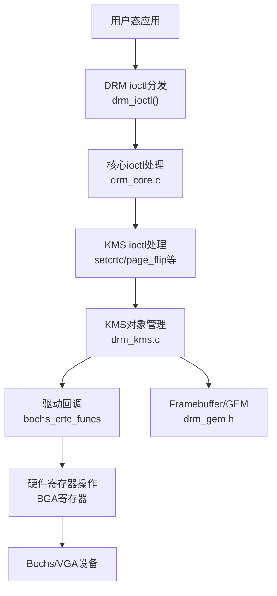
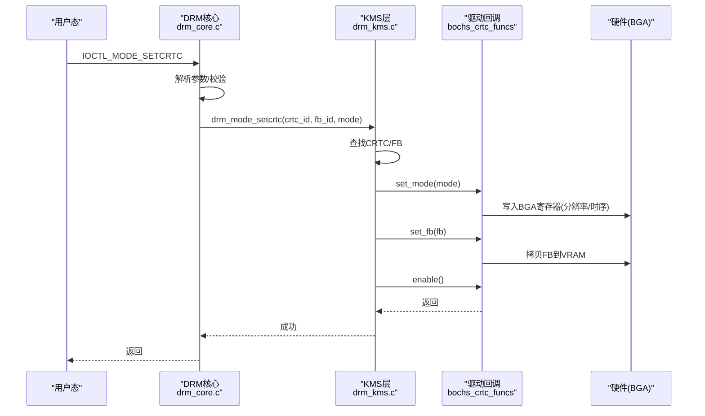
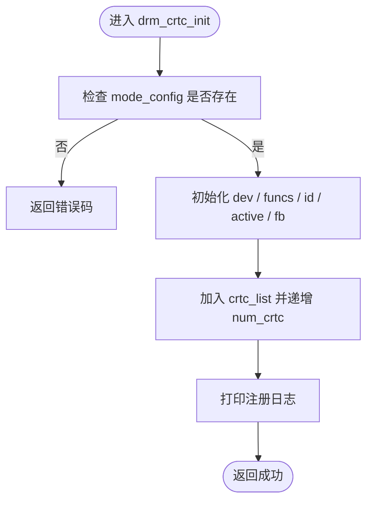
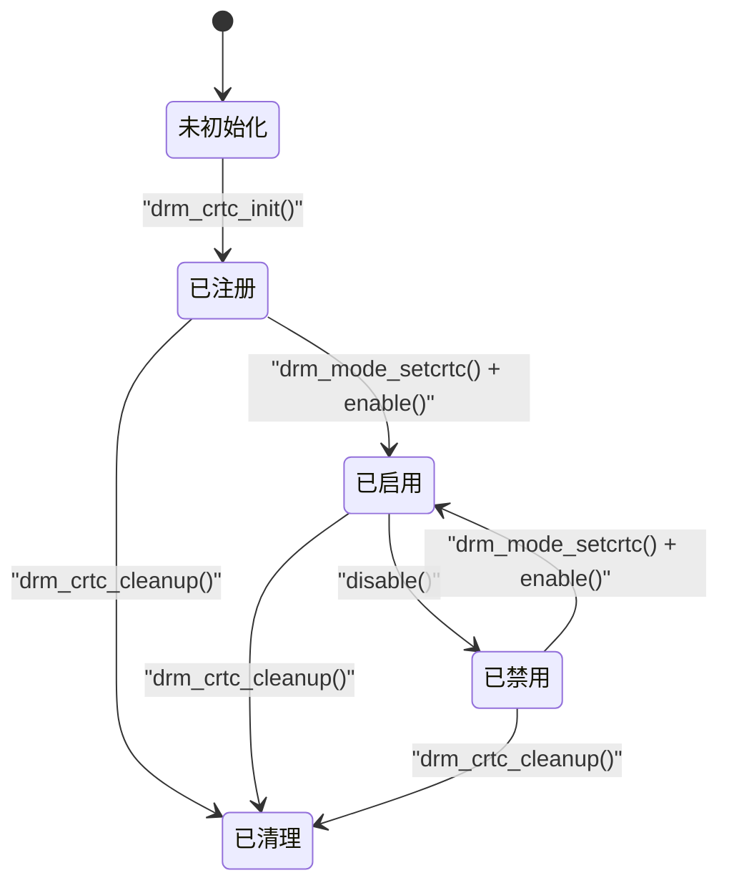
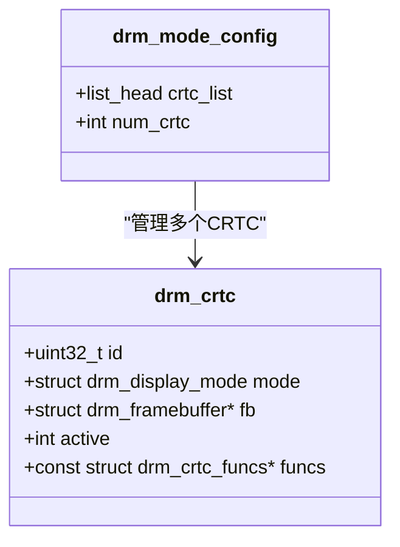
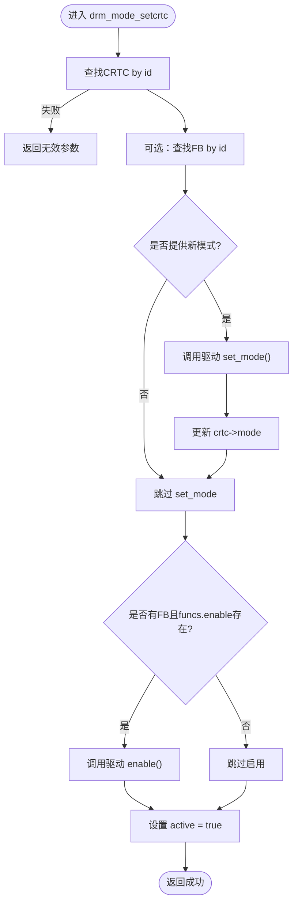
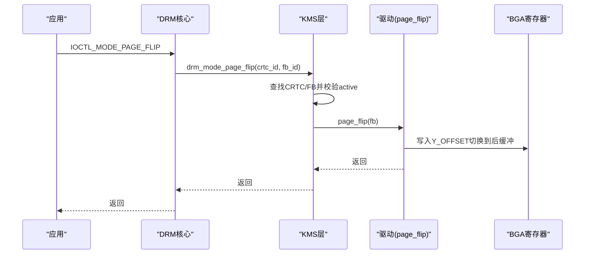
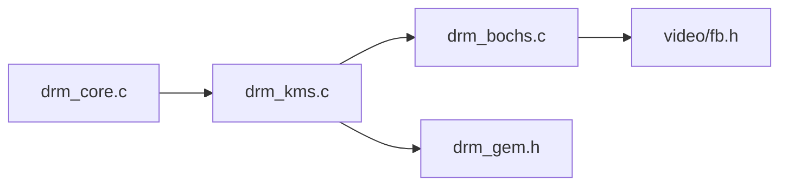

# CRTC管理实现

<cite>
**本文引用的文件**
- [kernel/drm/drm_core.c](file://kernel/drm/drm_core.c)
- [kernel/drm/drm_kms.c](file://kernel/drm/drm_kms.c)
- [includes/drm/drm_core.h](file://includes/drm/drm_core.h)
- [includes/drm/drm_kms.h](file://includes/drm/drm_kms.h)
- [kernel/drm/drm_bochs.c](file://kernel/drm/drm_bochs.c)
- [kernel/drm/drm_fb_helper.c](file://kernel/drm/drm_fb_helper.c)
- [includes/video/fb.h](file://includes/video/fb.h)
</cite>

## 目录
1. [简介](#简介)
2. [项目结构](#项目结构)
3. [核心组件](#核心组件)
4. [架构总览](#架构总览)
5. [详细组件分析](#详细组件分析)
6. [依赖关系分析](#依赖关系分析)
7. [性能考量](#性能考量)
8. [故障排查指南](#故障排查指南)
9. [结论](#结论)
10. [附录：API参考与使用示例](#附录api参考与使用示例)

## 简介
本文件为LulaOS的KMS（内核模式设置）CRTC管理实现提供深入文档。内容涵盖：
- CRTC的概念、在显示管线中的位置与作用
- drm_crtc_init()与drm_crtc_cleanup()的实现原理
- CRTC生命周期管理：初始化、激活、禁用、清理
- CRTC对象注册与查找机制
- CRTC状态管理与模式设置的API
- 面向驱动开发者的编程接口与使用示例

## 项目结构
本项目DRM/KMS相关代码主要位于以下路径：
- 核心框架与设备管理：kernel/drm/drm_core.c，includes/drm/drm_core.h
- KMS对象与模式设置：kernel/drm/drm_kms.c，includes/drm/drm_kms.h
- Bochs/QEMU VBE驱动实现：kernel/drm/drm_bochs.c
- Framebuffer图形辅助：kernel/drm/drm_fb_helper.c，includes/video/fb.h

图表来源
- [kernel/drm/drm_core.c:240-311](file://kernel/drm/drm_core.c#L240-L311)
- [kernel/drm/drm_kms.c:380-469](file://kernel/drm/drm_kms.c#L380-L469)
- [kernel/drm/drm_bochs.c:218-313](file://kernel/drm/drm_bochs.c#L218-L313)

章节来源
- [kernel/drm/drm_core.c:258-311](file://kernel/drm/drm_core.c#L258-L311)
- [kernel/drm/drm_kms.c:79-146](file://kernel/drm/drm_kms.c#L79-L146)
- [includes/drm/drm_core.h:75-142](file://includes/drm/drm_core.h#L75-L142)
- [includes/drm/drm_kms.h:92-318](file://includes/drm/drm_kms.h#L92-L318)

## 核心组件
- DRM设备与驱动：drm_device、drm_driver，负责设备生命周期与ioctl分发
- KMS模式配置：drm_mode_config，统一管理CRTC/Plane/Connector/Encoder/FB
- CRTC：显示控制器，控制扫描输出时序，绑定FB并启用/禁用
- Plane：图层，指向FB，由CRTC合成输出
- Connector：物理接口，检测显示器连接状态与EDID支持的分辨率
- Encoder：将像素数据转换为接口信号格式
- Framebuffer：封装GEM对象+格式/尺寸信息
- GEM：显存对象，统一分配/释放与引用计数管理

章节来源
- [includes/drm/drm_core.h:45-90](file://includes/drm/drm_core.h#L45-L90)
- [includes/drm/drm_kms.h:92-261](file://includes/drm/drm_kms.h#L92-L261)
- [includes/drm/drm_gem.h:24-45](file://includes/drm/drm_gem.h#L24-L45)

## 架构总览
下图展示了从用户态调用到硬件输出的完整流程，重点标注了CRTC在其中的作用。

图表来源
- [kernel/drm/drm_core.c:214-228](file://kernel/drm/drm_core.c#L214-L228)
- [kernel/drm/drm_kms.c:382-433](file://kernel/drm/drm_kms.c#L382-L433)
- [kernel/drm/drm_bochs.c:218-259](file://kernel/drm/drm_bochs.c#L218-L259)

## 详细组件分析

### CRTC概念与在显示管线中的位置
- CRTC（阴极射线管控制器）负责从FrameBuffer读取像素数据，按指定时序（分辨率、刷新率、同步信号）扫描输出到显示器。
- 在KMS中，CRTC是显示管线的核心节点：它绑定一个或多个Plane，最终通过Encoder和Connector输出到物理接口。
- 在LulaOS中，CRTC通过drm_crtc结构体表示，包含当前模式、绑定的FB、是否激活以及驱动回调函数集。

章节来源
- [includes/drm/drm_kms.h:92-125](file://includes/drm/drm_kms.h#L92-L125)

### drm_crtc_init()与drm_crtc_cleanup()实现原理
- drm_crtc_init()：
  - 将CRTC关联到所属DRM设备
  - 设置驱动回调函数集
  - 分配唯一ID（基于mode_config计数器）
  - 将CRTC加入mode_config的crtc_list，并递增num_crtc
- drm_crtc_cleanup()：
  - 从crtc_list移除CRTC
  - 递减num_crtc
  - 保证在设备或模块卸载时正确释放资源

图表来源
- [kernel/drm/drm_kms.c:150-169](file://kernel/drm/drm_kms.c#L150-L169)
- [kernel/drm/drm_kms.c:171-177](file://kernel/drm/drm_kms.c#L171-L177)

章节来源
- [kernel/drm/drm_kms.c:150-177](file://kernel/drm/drm_kms.c#L150-L177)

### CRTC生命周期管理：初始化、激活、禁用、清理
- 初始化：
  - 驱动在load()中创建drm_crtc实例，填充driver_private，调用drm_crtc_init()注册
- 激活：
  - 通过drm_mode_setcrtc()设置模式与FB，并调用enable()回调
  - 设置active标志为真
- 禁用：
  - 调用disable()回调，关闭硬件输出
  - 清除active标志
- 清理：
  - 在drm_mode_config_cleanup()中遍历并调用drm_crtc_cleanup()，从链表移除并计数递减

图表来源
- [kernel/drm/drm_kms.c:150-177](file://kernel/drm/drm_kms.c#L150-L177)
- [kernel/drm/drm_kms.c:382-433](file://kernel/drm/drm_kms.c#L382-L433)
- [kernel/drm/drm_kms.c:105-146](file://kernel/drm/drm_kms.c#L105-L146)

章节来源
- [kernel/drm/drm_kms.c:105-177](file://kernel/drm/drm_kms.c#L105-L177)
- [kernel/drm/drm_kms.c:382-433](file://kernel/drm/drm_kms.c#L382-L433)

### CRTC对象注册与查找机制
- 注册：
  - 通过drm_crtc_init()将CRTC加入mode_config.crtc_list，并分配唯一id
- 查找：
  - drm_crtc_find()遍历crtc_list，匹配id返回CRTC指针
- 其他对象（Plane/Connector/Encoder/FB）同样采用“注册到列表+按id查找”的模式

图表来源
- [includes/drm/drm_kms.h:245-261](file://includes/drm/drm_kms.h#L245-L261)
- [includes/drm/drm_kms.h:113-125](file://includes/drm/drm_kms.h#L113-L125)
- [kernel/drm/drm_kms.c:316-330](file://kernel/drm/drm_kms.c#L316-L330)

章节来源
- [kernel/drm/drm_kms.c:316-330](file://kernel/drm/drm_kms.c#L316-L330)
- [includes/drm/drm_kms.h:245-261](file://includes/drm/drm_kms.h#L245-L261)

### CRTC状态管理与模式设置API
- 状态字段：
  - mode：当前显示模式（分辨率、时序、刷新率）
  - fb：当前绑定的帧缓冲
  - active：是否启用
- 模式设置：
  - drm_mode_make_default()生成标准显示模式
  - drm_mode_setcrtc()执行：
    - 查找CRTC与FB
    - 调用驱动set_mode()设置分辨率与时序
    - 调用驱动set_fb()绑定FB
    - 调用enable()启用输出
    - 更新active标志与日志

图表来源
- [kernel/drm/drm_kms.c:30-75](file://kernel/drm/drm_kms.c#L30-L75)
- [kernel/drm/drm_kms.c:382-433](file://kernel/drm/drm_kms.c#L382-L433)

章节来源
- [kernel/drm/drm_kms.c:30-75](file://kernel/drm/drm_kms.c#L30-L75)
- [kernel/drm/drm_kms.c:382-433](file://kernel/drm/drm_kms.c#L382-L433)

### 驱动侧CRTC回调与双缓冲翻页
- 驱动回调：
  - set_mode：设置BGA寄存器分辨率与时序
  - set_fb：将FB内容拷贝到VRAM
  - enable/disable：开启/关闭显示输出
  - page_flip：双缓冲翻页，切换Y_OFFSET以显示后缓冲
- 双缓冲原理：
  - VRAM虚拟高度=实际高度×2
  - 前缓冲：Y=0~height-1；后缓冲：Y=height~2*height-1
  - 新帧写入后缓冲后，更新Y_OFFSET切换到后缓冲

图表来源
- [kernel/drm/drm_kms.c:435-469](file://kernel/drm/drm_kms.c#L435-L469)
- [kernel/drm/drm_bochs.c:271-305](file://kernel/drm/drm_bochs.c#L271-L305)

章节来源
- [kernel/drm/drm_bochs.c:218-313](file://kernel/drm/drm_bochs.c#L218-L313)
- [kernel/drm/drm_kms.c:435-469](file://kernel/drm/drm_kms.c#L435-L469)

## 依赖关系分析
- 核心依赖：
  - drm_core.c提供设备与ioctl分发
  - drm_kms.c提供KMS对象管理与模式设置
  - drm_bochs.c提供具体驱动的CRTC/Plane/Connector/Encoder实现
- 外部依赖：
  - GEM子系统用于显存对象管理
  - fb_info用于控制台与图形API共享帧缓冲参数
- 耦合与内聚：
  - KMS层与驱动回调解耦，便于替换不同GPU驱动
  - CRTC状态集中在drm_crtc结构体，内聚良好

图表来源
- [kernel/drm/drm_core.c:258-311](file://kernel/drm/drm_core.c#L258-L311)
- [kernel/drm/drm_kms.c:79-146](file://kernel/drm/drm_kms.c#L79-L146)
- [kernel/drm/drm_bochs.c:388-523](file://kernel/drm/drm_bochs.c#L388-L523)
- [includes/drm/drm_gem.h:49-128](file://includes/drm/drm_gem.h#L49-L128)
- [includes/video/fb.h:11-41](file://includes/video/fb.h#L11-L41)

章节来源
- [kernel/drm/drm_core.c:258-311](file://kernel/drm/drm_core.c#L258-L311)
- [kernel/drm/drm_kms.c:79-146](file://kernel/drm/drm_kms.c#L79-L146)
- [kernel/drm/drm_bochs.c:388-523](file://kernel/drm/drm_bochs.c#L388-L523)

## 性能考量
- 模式计算：
  - drm_mode_make_default()使用简化CVT-RB风格计算时序，避免复杂算法开销
- 内存拷贝：
  - set_fb/page_flip中将FB拷贝到VRAM，注意pitch与边界检查，避免越界
- 双缓冲：
  - 通过Y_OFFSET切换减少撕裂，但需确保前后缓冲大小不超过VRAM
- 查找效率：
  - 对象查找为线性遍历，数量较少时性能可接受；若对象增多可考虑哈希表优化

[本节提供一般性指导，不直接分析具体文件]

## 故障排查指南
- 常见错误码：
  - DRM_ERR_INVAL：参数无效（如CRTC/FB不存在）
  - DRM_ERR_NOMEM：内存不足
  - DRM_ERR_NODEV：设备不存在
  - DRM_ERR_NOTSUPP：不支持的操作
- 排查步骤：
  - 确认mode_config已初始化（drm_mode_config_init）
  - 确认CRTC已注册（drm_crtc_init）且id有效
  - 确认FB已创建且引用计数正确（drm_framebuffer_init/drm_gem_get/drm_gem_put）
  - 检查驱动回调是否正确实现（set_mode/set_fb/enable/disable/page_flip）
  - 查看日志输出定位问题阶段

章节来源
- [kernel/drm/drm_core.c:287-311](file://kernel/drm/drm_core.c#L287-L311)
- [kernel/drm/drm_kms.c:382-469](file://kernel/drm/drm_kms.c#L382-L469)
- [includes/drm/drm_core.h:147-152](file://includes/drm/drm_core.h#L147-L152)

## 结论
LulaOS的KMS CRTC管理实现了完整的显示控制器抽象与生命周期管理，支持模式设置、FB绑定、启用/禁用与双缓冲翻页。通过驱动回调机制，不同GPU驱动可复用同一套KMS接口。该实现简洁清晰，适合教学与嵌入式场景，同时具备良好的扩展性。

[本节总结性内容，不直接分析具体文件]

## 附录：API参考与使用示例

### API参考
- 模式设置
  - drm_mode_make_default(mode, hdisplay, vdisplay, vrefresh)
  - drm_mode_setcrtc(dev, crtc_id, fb_id, mode)
- CRTC管理
  - drm_crtc_init(dev, crtc, funcs)
  - drm_crtc_cleanup(crtc)
  - drm_crtc_find(dev, id)
- 对象管理
  - drm_plane_init()/drm_plane_cleanup()
  - drm_connector_init()/drm_connector_cleanup()
  - drm_encoder_init()/drm_encoder_cleanup()
  - drm_framebuffer_init()/drm_framebuffer_cleanup()
- GEM管理
  - drm_gem_create()/drm_gem_destroy()
  - drm_gem_find()/drm_gem_mmap()
  - drm_gem_get()/drm_gem_put()

章节来源
- [includes/drm/drm_kms.h:265-318](file://includes/drm/drm_kms.h#L265-L318)
- [includes/drm/drm_gem.h:49-128](file://includes/drm/drm_gem.h#L49-L128)

### 使用示例（驱动开发者）
- 初始化CRTC：
  - 在驱动load()中分配drm_crtc实例，填充driver_private
  - 定义drm_crtc_funcs并实现set_mode/set_fb/enable/disable/page_flip
  - 调用drm_crtc_init()注册CRTC
- 设置模式与FB：
  - 调用drm_mode_make_default()生成模式
  - 调用drm_mode_setcrtc()设置CRTC模式与FB
- 双缓冲翻页：
  - 准备后缓冲FB，调用drm_mode_page_flip()切换显示

章节来源
- [kernel/drm/drm_bochs.c:388-523](file://kernel/drm/drm_bochs.c#L388-L523)
- [kernel/drm/drm_kms.c:382-469](file://kernel/drm/drm_kms.c#L382-L469)