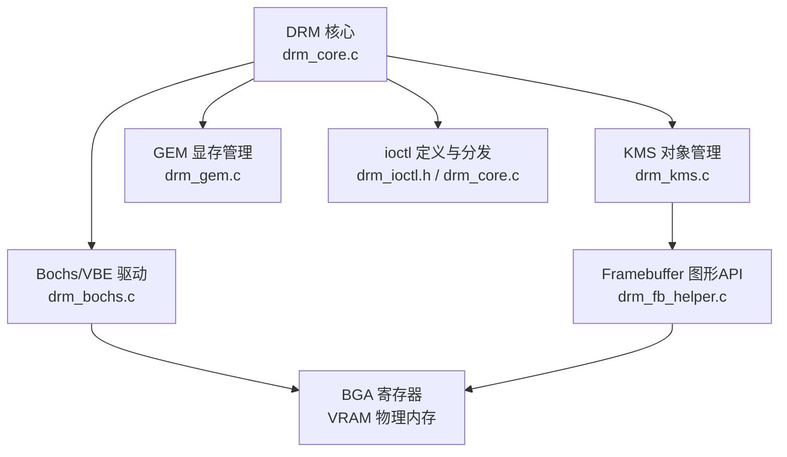
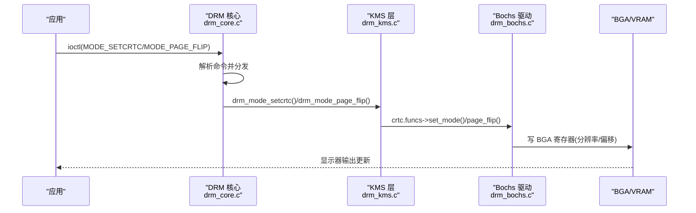
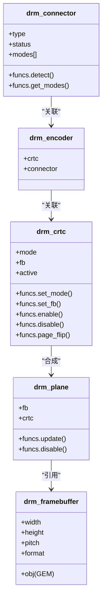
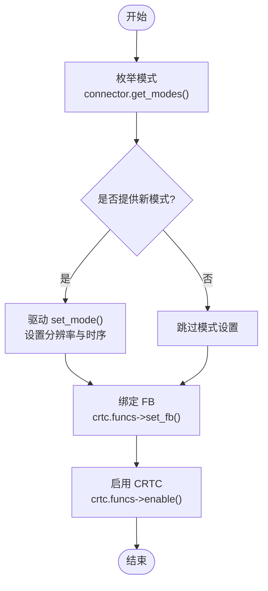
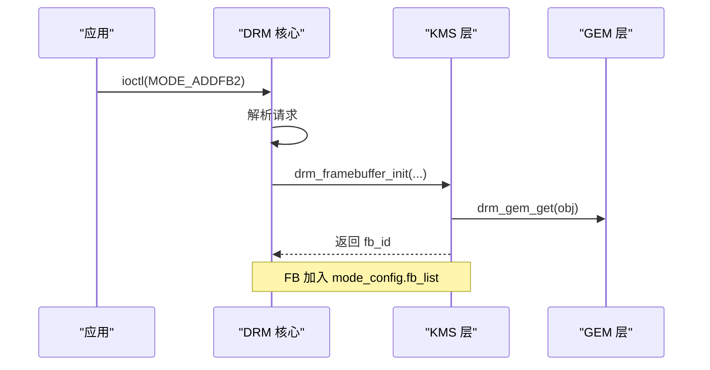
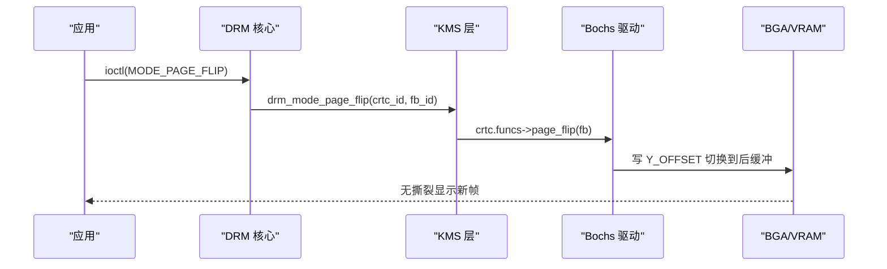
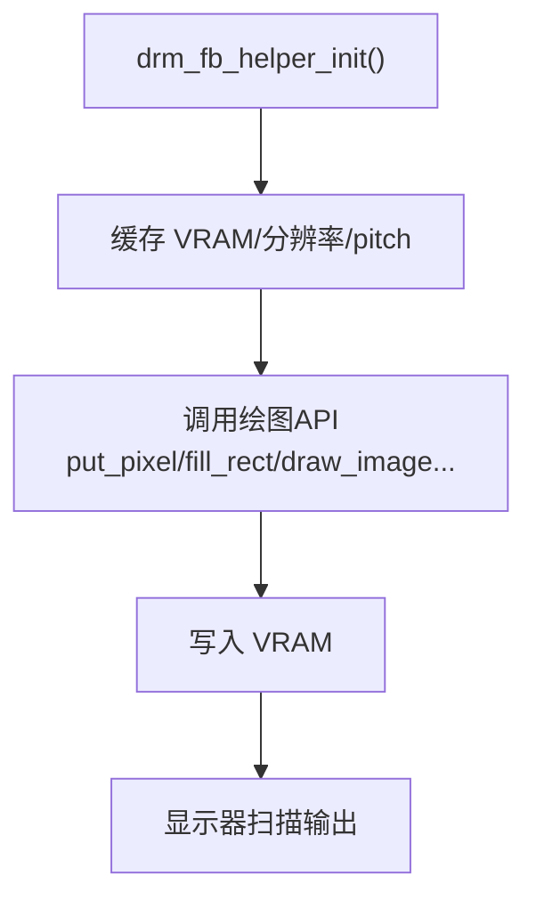
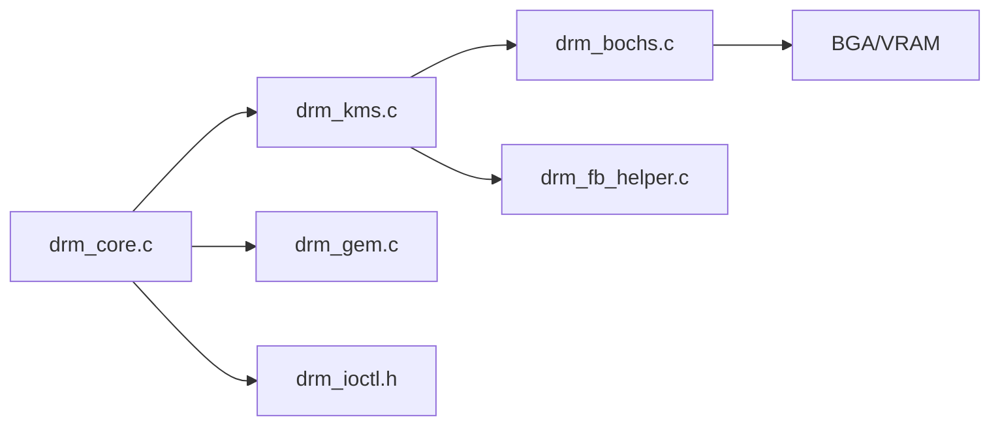

# KMS模式设置实现

<cite>
**本文引用的文件**
- [drm_kms.h](file://includes/drm/drm_kms.h)
- [drm_kms.c](file://kernel/drm/drm_kms.c)
- [drm_core.h](file://includes/drm/drm_core.h)
- [drm_core.c](file://kernel/drm/drm_core.c)
- [drm_fb_helper.h](file://includes/drm/drm_fb_helper.h)
- [drm_fb_helper.c](file://kernel/drm/drm_fb_helper.c)
- [drm_gem.h](file://includes/drm/drm_gem.h)
- [drm_gem.c](file://kernel/drm/drm_gem.c)
- [drm_ioctl.h](file://includes/drm/drm_ioctl.h)
- [drm_bochs.c](file://kernel/drm/drm_bochs.c)
</cite>

## 目录
1. [简介](#简介)
2. [项目结构](#项目结构)
3. [核心组件](#核心组件)
4. [架构总览](#架构总览)
5. [详细组件分析](#详细组件分析)
6. [依赖关系分析](#依赖关系分析)
7. [性能考量](#性能考量)
8. [故障排查指南](#故障排查指南)
9. [结论](#结论)
10. [附录：API参考与使用示例](#附录api参考与使用示例)

## 简介
本文件面向图形应用开发者，系统性阐述 LulaOS 中基于 DRM/KMS 的显示子系统实现。重点覆盖以下主题：
- CRTC、Connector、Encoder、Plane、Framebuffer 的概念与相互关系
- 显示模式的枚举、验证与设置流程
- 帧缓冲（FB）的创建、管理与销毁
- 页面翻转（Page Flip）机制的实现细节
- 显示模式配置与分辨率设置的 API 参考
- 面向应用的 KMS 编程接口与典型用法

## 项目结构
LulaOS 的 DRM/KMS 子系统由“核心框架 + KMS 对象管理 + GEM 显存管理 + 具体驱动（Bochs/QEMU VBE）+ 图形辅助层”组成：
- 核心框架：设备注册、ioctl 分发、能力查询等
- KMS 对象：CRTC/Plane/Connector/Encoder/FB 的注册、查找与生命周期管理
- GEM：显存对象的分配、引用计数、映射
- Bochs 驱动：通过 BGA 寄存器控制分辨率、双缓冲翻页
- 图形辅助层：直接写 VRAM 的像素级绘制 API

图表来源
- [drm_core.c:258-311](file://kernel/drm/drm_core.c#L258-L311)
- [drm_kms.c:79-146](file://kernel/drm/drm_kms.c#L79-L146)
- [drm_gem.c:117-133](file://kernel/drm/drm_gem.c#L117-L133)
- [drm_bochs.c:388-523](file://kernel/drm/drm_bochs.c#L388-L523)

章节来源
- [drm_core.h:75-90](file://includes/drm/drm_core.h#L75-L90)
- [drm_core.c:258-311](file://kernel/drm/drm_core.c#L258-L311)
- [drm_kms.h:245-261](file://includes/drm/drm_kms.h#L245-L261)
- [drm_kms.c:79-146](file://kernel/drm/drm_kms.c#L79-L146)

## 核心组件
- drm_device：DRM 设备描述符，嵌入统一设备模型，持有 driver、mode_config、gem_objects 等
- drm_mode_config：KMS 全局配置，维护 CRTC/Plane/Connector/Encoder/FB 链表及数量
- drm_crtc：显示控制器，负责扫描输出时序、绑定 FB、启用/禁用、Page Flip
- drm_plane：图层，指向一个 FB，由 CRTC 合成输出（Primary/Cursor/Overlay）
- drm_connector：物理连接器（VGA/HDMI/DP/Virtual），检测连接状态、枚举支持模式
- drm_encoder：编码器，将像素数据转换为接口信号（简化实现为空操作）
- drm_framebuffer：封装 GEM 对象 + 格式/尺寸信息，供 CRTC 读取像素
- drm_display_mode：分辨率与时序参数（有效区域、同步、总像素、时钟、刷新率）
- drm_gem_object：显存对象，封装物理连续内存、内核虚拟地址、用户句柄 handle

章节来源
- [drm_core.h:75-90](file://includes/drm/drm_core.h#L75-L90)
- [drm_kms.h:69-90](file://includes/drm/drm_kms.h#L69-L90)
- [drm_kms.h:113-125](file://includes/drm/drm_kms.h#L113-L125)
- [drm_kms.h:149-164](file://includes/drm/drm_kms.h#L149-L164)
- [drm_kms.h:200-214](file://includes/drm/drm_kms.h#L200-L214)
- [drm_kms.h:224-236](file://includes/drm/drm_kms.h#L224-L236)
- [drm_gem.h:34-45](file://includes/drm/drm_gem.h#L34-L45)

## 架构总览
下图展示了从应用调用到硬件输出的完整链路：应用通过 ioctl 进入核心，核心根据命令分发到 KMS/GEM 处理函数；KMS 层调用驱动回调完成模式设置与翻页；Bochs 驱动通过 BGA 寄存器写入分辨率与偏移，最终由显示器扫描 VRAM 输出。

图表来源
- [drm_core.c:287-311](file://kernel/drm/drm_core.c#L287-L311)
- [drm_kms.c:382-433](file://kernel/drm/drm_kms.c#L382-L433)
- [drm_kms.c:435-469](file://kernel/drm/drm_kms.c#L435-L469)
- [drm_bochs.c:218-224](file://kernel/drm/drm_bochs.c#L218-L224)
- [drm_bochs.c:271-305](file://kernel/drm/drm_bochs.c#L271-L305)

## 详细组件分析

### CRTC、Connector、Encoder、Plane、Framebuffer 的关系
- Connector 负责检测显示器并枚举支持的显示模式
- Encoder 将 CRTC 输出的像素数据转换为接口信号（简化实现为空操作）
- CRTC 控制扫描时序，从 Plane 获取 FB 像素数据并输出到 Connector
- Plane 指向一个 Framebuffer，表示要显示的图像内容
- Framebuffer 封装 GEM 对象和格式/尺寸信息，提供像素数据源

图表来源
- [drm_kms.h:187-214](file://includes/drm/drm_kms.h#L187-L214)
- [drm_kms.h:174-182](file://includes/drm/drm_kms.h#L174-L182)
- [drm_kms.h:113-125](file://includes/drm/drm_kms.h#L113-L125)
- [drm_kms.h:149-164](file://includes/drm/drm_kms.h#L149-L164)
- [drm_kms.h:224-236](file://includes/drm/drm_kms.h#L224-L236)

章节来源
- [drm_kms.h:187-214](file://includes/drm/drm_kms.h#L187-L214)
- [drm_kms.h:174-182](file://includes/drm/drm_kms.h#L174-L182)
- [drm_kms.h:113-125](file://includes/drm/drm_kms.h#L113-L125)
- [drm_kms.h:149-164](file://includes/drm/drm_kms.h#L149-L164)
- [drm_kms.h:224-236](file://includes/drm/drm_kms.h#L224-L236)

### 显示模式枚举、验证与设置流程
- 枚举：Connector 的 get_modes 回调填充 modes 数组，drm_bochs 根据 VRAM 大小动态筛选支持的模式
- 验证：KMS 层在 setcrtc 时检查 CRTC/FB 是否存在，必要时调用驱动的 set_mode
- 设置：调用驱动的 set_mode 设置分辨率与时序，随后绑定 FB 并启用 CRTC

图表来源
- [drm_bochs.c:364-379](file://kernel/drm/drm_bochs.c#L364-L379)
- [drm_kms.c:382-433](file://kernel/drm/drm_kms.c#L382-L433)

章节来源
- [drm_bochs.c:140-165](file://kernel/drm/drm_bochs.c#L140-L165)
- [drm_bochs.c:364-379](file://kernel/drm/drm_bochs.c#L364-L379)
- [drm_kms.c:382-433](file://kernel/drm/drm_kms.c#L382-L433)

### 帧缓冲的创建、管理与销毁
- 创建：应用通过 ADDFB2 ioctl 传入 GEM handle、宽高、pitch、格式，核心调用 drm_framebuffer_init 创建 FB 并增加 GEM 引用计数
- 管理：FB 链入 mode_config.fb_list，可通过 ID 查找
- 销毁：清理时释放 GEM 引用并从链表移除

图表来源
- [drm_core.c:185-211](file://kernel/drm/drm_core.c#L185-L211)
- [drm_kms.c:274-301](file://kernel/drm/drm_kms.c#L274-L301)
- [drm_gem.h:96-108](file://includes/drm/drm_gem.h#L96-L108)

章节来源
- [drm_core.c:185-211](file://kernel/drm/drm_core.c#L185-L211)
- [drm_kms.c:274-301](file://kernel/drm/drm_kms.c#L274-L301)
- [drm_kms.c:303-312](file://kernel/drm/drm_kms.c#L303-L312)

### 页面翻转（Page Flip）机制
- 原理：使用双缓冲，VRAM 虚拟高度为实际高度的两倍；前缓冲 Y=0~height-1，后缓冲 Y=height~2*height-1
- 流程：新帧写入后缓冲 → 切换 Y_OFFSET → 显示器自动扫描新缓冲
- 实现：驱动 page_flip 回调计算 back_yoffset，拷贝 FB 内容到后缓冲，更新 BGA 偏移

图表来源
- [drm_core.c:233-238](file://kernel/drm/drm_core.c#L233-L238)
- [drm_kms.c:435-469](file://kernel/drm/drm_kms.c#L435-L469)
- [drm_bochs.c:271-305](file://kernel/drm/drm_bochs.c#L271-L305)

章节来源
- [drm_bochs.c:271-305](file://kernel/drm/drm_bochs.c#L271-L305)
- [drm_kms.c:435-469](file://kernel/drm/drm_kms.c#L435-L469)

### 图形辅助层（Framebuffer API）
- 初始化：drm_fb_helper_init 缓存 fb.virt_addr、分辨率、pitch
- 绘制：提供 put_pixel、fill_rect、clear、draw_bitmap、draw_image、draw_char/string 等接口
- 显示链路：直接写 VRAM，显示器自动扫描输出

图表来源
- [drm_fb_helper.c:44-60](file://kernel/drm/drm_fb_helper.c#L44-L60)
- [drm_fb_helper.c:72-81](file://kernel/drm/drm_fb_helper.c#L72-L81)
- [drm_fb_helper.c:89-110](file://kernel/drm/drm_fb_helper.c#L89-L110)
- [drm_fb_helper.c:184-210](file://kernel/drm/drm_fb_helper.c#L184-L210)

章节来源
- [drm_fb_helper.h:21-123](file://includes/drm/drm_fb_helper.h#L21-L123)
- [drm_fb_helper.c:44-60](file://kernel/drm/drm_fb_helper.c#L44-L60)
- [drm_fb_helper.c:72-81](file://kernel/drm/drm_fb_helper.c#L72-L81)
- [drm_fb_helper.c:89-110](file://kernel/drm/drm_fb_helper.c#L89-L110)
- [drm_fb_helper.c:184-210](file://kernel/drm/drm_fb_helper.c#L184-L210)

## 依赖关系分析
- 核心依赖：drm_core.c 提供 ioctl 分发与驱动注册；drm_kms.c 提供 KMS 对象管理；drm_gem.c 提供显存管理
- 驱动依赖：drm_bochs.c 实现具体硬件操作（BGA 寄存器、VRAM 映射）
- 图形层依赖：drm_fb_helper.c 直接访问 fb 结构体进行像素绘制

图表来源
- [drm_core.c:258-311](file://kernel/drm/drm_core.c#L258-L311)
- [drm_kms.c:79-146](file://kernel/drm/drm_kms.c#L79-L146)
- [drm_gem.c:117-133](file://kernel/drm/drm_gem.c#L117-L133)
- [drm_bochs.c:388-523](file://kernel/drm/drm_bochs.c#L388-L523)

章节来源
- [drm_core.h:75-90](file://includes/drm/drm_core.h#L75-L90)
- [drm_core.c:258-311](file://kernel/drm/drm_core.c#L258-L311)
- [drm_kms.h:245-261](file://includes/drm/drm_kms.h#L245-L261)
- [drm_kms.c:79-146](file://kernel/drm/drm_kms.c#L79-L146)
- [drm_gem.h:34-45](file://includes/drm/drm_gem.h#L34-L45)
- [drm_gem.c:117-133](file://kernel/drm/drm_gem.c#L117-L133)
- [drm_bochs.c:388-523](file://kernel/drm/drm_bochs.c#L388-L523)

## 性能考量
- 双缓冲 Page Flip：避免撕裂，减少重绘开销；需确保 VRAM 足够容纳两帧
- 批量写入：优先使用 fill_rect/draw_image 等批量接口，减少逐像素写入
- 裁剪优化：绘图 API 内置边界裁剪，避免越界访问
- 显存对齐：GEM 分配按 PAGE_SIZE 对齐，提升 DMA 效率

[本节为通用指导，不直接分析具体文件]

## 故障排查指南
- 模式设置失败：检查 CRTC/FB 是否存在，确认驱动 set_mode 返回值
- Page Flip 失败：确认 CRTC 已激活，FB 有效且大小匹配
- 花屏/错位：检查 pitch 与分辨率是否一致，确认 VRAM 映射正确
- 资源泄漏：关注 GEM 对象引用计数，确保 FB/GEM 正确释放

章节来源
- [drm_kms.c:382-433](file://kernel/drm/drm_kms.c#L382-L433)
- [drm_kms.c:435-469](file://kernel/drm/drm_kms.c#L435-L469)
- [drm_bochs.c:218-224](file://kernel/drm/drm_bochs.c#L218-L224)
- [drm_bochs.c:271-305](file://kernel/drm/drm_bochs.c#L271-L305)

## 结论
LulaOS 的 DRM/KMS 子系统提供了完整的显示模式设置、帧缓冲管理与页面翻转能力。通过模块化设计，核心框架、KMS 对象管理、GEM 显存管理与具体驱动解耦，便于扩展与维护。图形辅助层为应用提供了直观的像素级绘制接口，适合快速构建图形界面或测试画面。

[本节为总结性内容，不直接分析具体文件]

## 附录：API参考与使用示例

### KMS 公共 API
- 模式配置
  - drm_mode_config_init/cleanup：初始化/清理 KMS 全局配置
  - drm_mode_setcrtc：设置 CRTC 模式与 FB
  - drm_mode_make_default：生成标准显示模式
- 对象管理
  - drm_crtc_init/cleanup：注册/注销 CRTC
  - drm_plane_init/cleanup：注册/注销 Plane
  - drm_connector_init/cleanup：注册/注销 Connector
  - drm_encoder_init/cleanup：注册/注销 Encoder
  - drm_framebuffer_init/cleanup：创建/销毁 FB
- 查找辅助
  - drm_crtc_find/plane_find/connector_find/framebuffer_find：按 ID 查找对象

章节来源
- [drm_kms.h:265-315](file://includes/drm/drm_kms.h#L265-L315)
- [drm_kms.c:79-146](file://kernel/drm/drm_kms.c#L79-L146)
- [drm_kms.c:316-378](file://kernel/drm/drm_kms.c#L316-L378)

### 图形辅助层 API
- drm_fb_helper_init：初始化图形层
- drm_fb_put_pixel/fill_rect/clear：基础绘制
- drm_fb_draw_bitmap/draw_image：位图与真彩图片绘制
- drm_fb_draw_char/draw_string：文字渲染
- drm_fb_test_image：综合测试图案

章节来源
- [drm_fb_helper.h:21-123](file://includes/drm/drm_fb_helper.h#L21-L123)
- [drm_fb_helper.c:44-60](file://kernel/drm/drm_fb_helper.c#L44-L60)
- [drm_fb_helper.c:72-81](file://kernel/drm/drm_fb_helper.c#L72-L81)
- [drm_fb_helper.c:89-110](file://kernel/drm/drm_fb_helper.c#L89-L110)
- [drm_fb_helper.c:184-210](file://kernel/drm/drm_fb_helper.c#L184-L210)
- [drm_fb_helper.c:430-609](file://kernel/drm/drm_fb_helper.c#L430-L609)

### 典型使用流程（应用视角）
1. 打开 DRM 设备，查询能力（GET_CAP）
2. 枚举资源（GETRESOURCES）获取 CRTC/Connector/FB ID
3. 创建 GEM 对象（GEM_CREATE）并映射（GEM_MMAP）
4. 创建 FB（ADDFB2）绑定 GEM handle
5. 设置模式（SETCRTC）指定分辨率与 FB
6. 循环绘制后缓冲，触发 Page Flip（PAGE_FLIP）实现无撕裂更新

章节来源
- [drm_core.c:36-53](file://kernel/drm/drm_core.c#L36-L53)
- [drm_core.c:144-180](file://kernel/drm/drm_core.c#L144-L180)
- [drm_core.c:90-137](file://kernel/drm/drm_core.c#L90-L137)
- [drm_core.c:185-211](file://kernel/drm/drm_core.c#L185-L211)
- [drm_core.c:216-238](file://kernel/drm/drm_core.c#L216-L238)