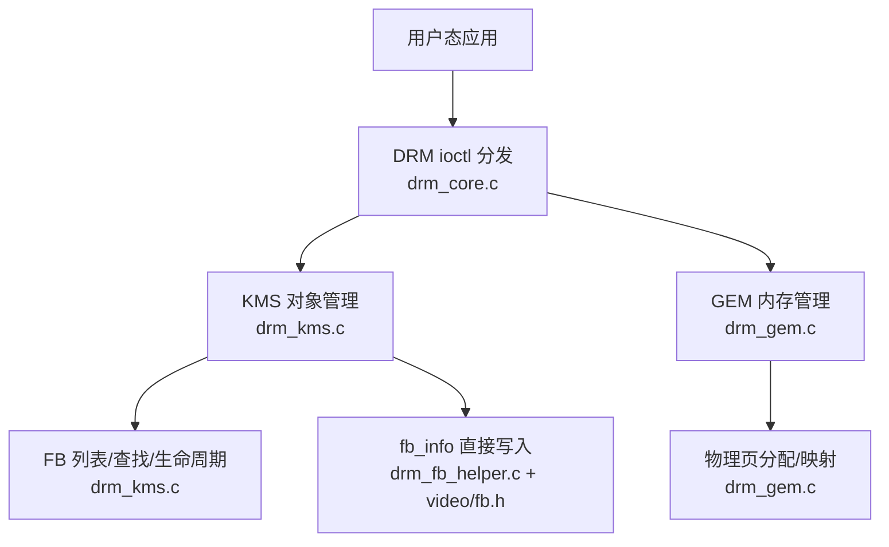
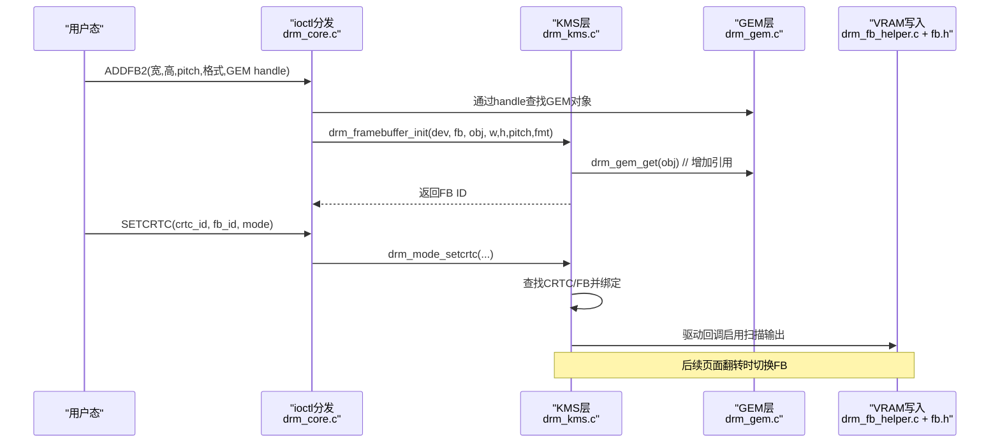
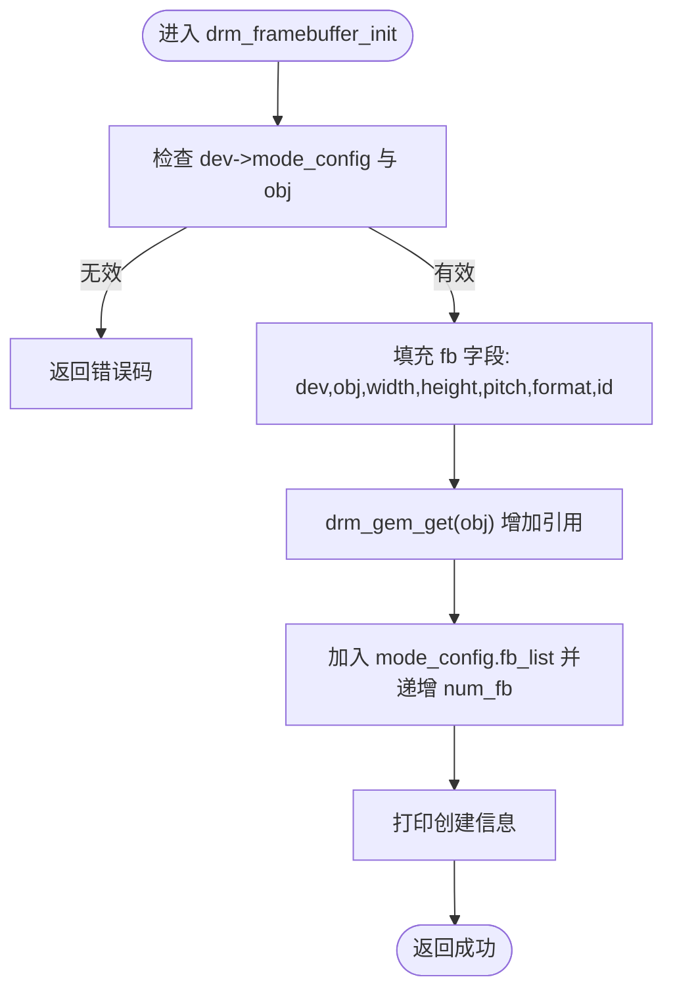
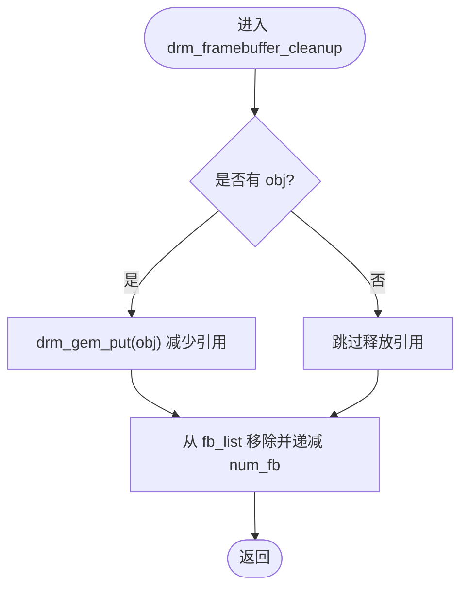
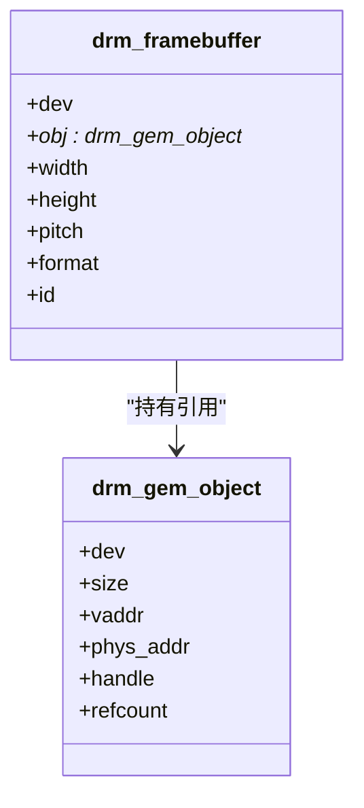
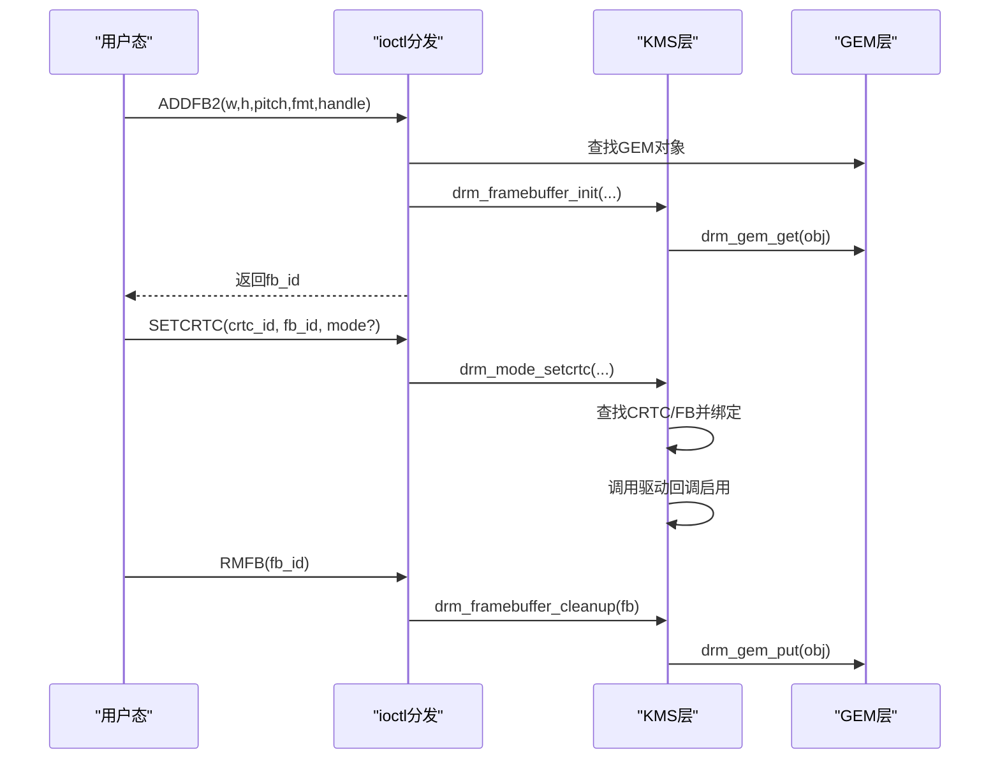
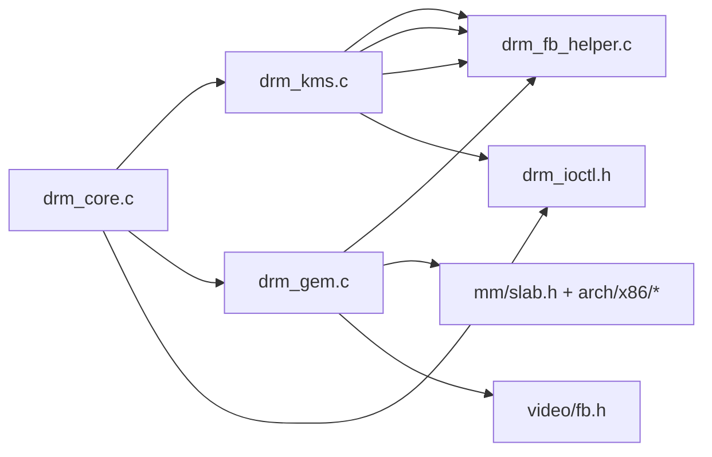

# 帧缓冲管理实现

<cite>
**本文引用的文件**
- [kernel/drm/drm_core.c](file://kernel/drm/drm_core.c)
- [kernel/drm/drm_kms.c](file://kernel/drm/drm_kms.c)
- [kernel/drm/drm_gem.c](file://kernel/drm/drm_gem.c)
- [kernel/drm/drm_fb_helper.c](file://kernel/drm/drm_fb_helper.c)
- [includes/drm/drm_core.h](file://includes/drm/drm_core.h)
- [includes/drm/drm_kms.h](file://includes/drm/drm_kms.h)
- [includes/drm/drm_gem.h](file://includes/drm/drm_gem.h)
- [includes/drm/drm_ioctl.h](file://includes/drm/drm_ioctl.h)
- [includes/video/fb.h](file://includes/video/fb.h)
</cite>

## 目录
1. [简介](#简介)
2. [项目结构](#项目结构)
3. [核心组件](#核心组件)
4. [架构总览](#架构总览)
5. [详细组件分析](#详细组件分析)
6. [依赖关系分析](#依赖关系分析)
7. [性能考量](#性能考量)
8. [故障排查指南](#故障排查指南)
9. [结论](#结论)
10. [附录：API参考与最佳实践](#附录api参考与最佳实践)

## 简介
本文件面向图形应用开发者，系统性阐述 LulaOS KMS 子系统中的帧缓冲（Framebuffer）管理机制。内容涵盖：
- Framebuffer 的概念及其在图形渲染管线中的作用
- drm_framebuffer_init() 与 drm_framebuffer_cleanup() 的实现原理
- 帧缓冲与 GEM 对象的关联关系和引用计数机制
- 帧缓冲的创建、配置、销毁流程
- 像素格式支持、像素布局、pitch 计算等关键技术点
- 面向应用的 API 使用建议与最佳实践

## 项目结构
LulaOS 的 DRM/KMS 子系统按职责分层组织：
- 核心层：设备注册、ioctl 分发、全局状态管理
- KMS 层：CRTC/Plane/Connector/Encoder/Framebuffer 对象管理与模式设置
- GEM 层：显存分配、映射、句柄管理
- FB Helper 层：基于 fb_info 的直接像素绘制与测试图像生成
- 头文件：定义数据结构、常量、公共 API

图表来源
- [kernel/drm/drm_core.c:240-311](file://kernel/drm/drm_core.c#L240-L311)
- [kernel/drm/drm_kms.c:77-146](file://kernel/drm/drm_kms.c#L77-L146)
- [kernel/drm/drm_gem.c:117-183](file://kernel/drm/drm_gem.c#L117-L183)
- [kernel/drm/drm_fb_helper.c:44-60](file://kernel/drm/drm_fb_helper.c#L44-L60)
- [includes/video/fb.h:11-23](file://includes/video/fb.h#L11-L23)

章节来源
- [kernel/drm/drm_core.c:240-311](file://kernel/drm/drm_core.c#L240-L311)
- [kernel/drm/drm_kms.c:77-146](file://kernel/drm/drm_kms.c#L77-L146)
- [kernel/drm/drm_gem.c:117-183](file://kernel/drm/drm_gem.c#L117-L183)
- [includes/drm/drm_core.h:75-90](file://includes/drm/drm_core.h#L75-L90)
- [includes/drm/drm_kms.h:224-261](file://includes/drm/drm_kms.h#L224-L261)
- [includes/drm/drm_gem.h:34-45](file://includes/drm/drm_gem.h#L34-L45)
- [includes/video/fb.h:11-23](file://includes/video/fb.h#L11-L23)

## 核心组件
- DRM 核心：负责驱动注册、ioctl 分发、设备生命周期管理
- KMS：管理显示资源（CRTC/Plane/Connector/Encoder/FB），提供模式设置与翻页
- GEM：统一显存分配、映射、句柄与引用计数
- FB Helper：基于 fb_info 的直接像素操作与测试图像绘制

章节来源
- [kernel/drm/drm_core.c:258-311](file://kernel/drm/drm_core.c#L258-L311)
- [kernel/drm/drm_kms.c:77-146](file://kernel/drm/drm_kms.c#L77-L146)
- [kernel/drm/drm_gem.c:117-183](file://kernel/drm/drm_gem.c#L117-L183)
- [kernel/drm/drm_fb_helper.c:44-60](file://kernel/drm/drm_fb_helper.c#L44-L60)

## 架构总览
下图展示了从用户态调用到内核帧缓冲绘制的完整路径，包括 ioctl 分发、KMS 对象绑定、GEM 引用管理以及最终对 VRAM 的写入。

图表来源
- [kernel/drm/drm_core.c:185-211](file://kernel/drm/drm_core.c#L185-L211)
- [kernel/drm/drm_kms.c:274-312](file://kernel/drm/drm_kms.c#L274-L312)
- [kernel/drm/drm_gem.c:248-256](file://kernel/drm/drm_gem.c#L248-L256)
- [kernel/drm/drm_kms.c:382-433](file://kernel/drm/drm_kms.c#L382-L433)
- [kernel/drm/drm_fb_helper.c:72-81](file://kernel/drm/drm_fb_helper.c#L72-L81)
- [includes/video/fb.h:11-23](file://includes/video/fb.h#L11-L23)

## 详细组件分析

### Framebuffer 概念与作用
- Framebuffer 是封装了“像素数据 + 元信息”的对象：包含宽度、高度、每行字节数（pitch）、像素格式（FourCC），以及指向底层像素存储（GEM 对象）的指针。
- 在 KMS 中，CRTC 从绑定的 Framebuffer 读取像素并按时序扫描输出到显示器；Page Flip 可在不重绘的情况下切换当前显示的 FB，避免撕裂。
- 像素布局与 pitch：pitch 表示一行像素占用的字节数，通常大于等于 width × bytes_per_pixel，用于对齐或硬件限制；实际偏移为 y × pitch + x × bytes_per_pixel。

章节来源
- [includes/drm/drm_kms.h:224-236](file://includes/drm/drm_kms.h#L224-L236)
- [includes/drm/drm_kms.h:29-33](file://includes/drm/drm_kms.h#L29-L33)
- [kernel/drm/drm_fb_helper.c:64-81](file://kernel/drm/drm_fb_helper.c#L64-L81)

### drm_framebuffer_init() 实现原理
- 参数校验：确保存在有效的 mode_config 与 GEM 对象
- 初始化字段：dev、obj、width、height、pitch、format、id
- 引用计数：调用 drm_gem_get(obj) 增加 GEM 对象引用，保证 FB 生命周期内 GEM 不被释放
- 注册到全局 FB 列表：加入 mode_config.fb_list 并递增 num_fb
- 日志输出：记录 FB 的宽高、pitch、格式等信息

图表来源
- [kernel/drm/drm_kms.c:274-301](file://kernel/drm/drm_kms.c#L274-L301)
- [includes/drm/drm_gem.h:96-99](file://includes/drm/drm_gem.h#L96-L99)

章节来源
- [kernel/drm/drm_kms.c:274-301](file://kernel/drm/drm_kms.c#L274-L301)

### drm_framebuffer_cleanup() 实现原理
- 释放引用：若 fb 持有 GEM 对象，则调用 drm_gem_put(fb->obj) 减少引用计数
- 移除列表：从 mode_config.fb_list 删除自身，并递减 num_fb
- 注意：该函数不负责释放 fb 本身内存（由调用方管理）

图表来源
- [kernel/drm/drm_kms.c:303-312](file://kernel/drm/drm_kms.c#L303-L312)
- [kernel/drm/drm_gem.c:248-256](file://kernel/drm/drm_gem.c#L248-L256)

章节来源
- [kernel/drm/drm_kms.c:303-312](file://kernel/drm/drm_kms.c#L303-L312)

### 帧缓冲与 GEM 对象的关联与引用计数
- 关联方式：drm_framebuffer.obj 指向一个 drm_gem_object，后者封装了物理连续内存（显存或系统内存）
- 引用计数：
  - 创建 FB 时：drm_gem_get(obj) 将 refcount++
  - 销毁 FB 时：drm_gem_put(obj) 将 refcount--，当 refcount 归零时触发 drm_gem_destroy() 释放物理内存
- 句柄机制：用户态通过 handle 访问 GEM 对象，内核通过 drm_gem_find() 根据 handle 查找对象

图表来源
- [includes/drm/drm_kms.h:224-236](file://includes/drm/drm_kms.h#L224-L236)
- [includes/drm/drm_gem.h:34-45](file://includes/drm/drm_gem.h#L34-L45)
- [kernel/drm/drm_kms.c:274-312](file://kernel/drm/drm_kms.c#L274-L312)
- [kernel/drm/drm_gem.c:248-256](file://kernel/drm/drm_gem.c#L248-L256)

章节来源
- [includes/drm/drm_kms.h:224-236](file://includes/drm/drm_kms.h#L224-L236)
- [includes/drm/drm_gem.h:34-45](file://includes/drm/drm_gem.h#L34-L45)
- [kernel/drm/drm_kms.c:274-312](file://kernel/drm/drm_kms.c#L274-L312)
- [kernel/drm/drm_gem.c:248-256](file://kernel/drm/drm_gem.c#L248-L256)

### 帧缓冲的创建、配置、销毁流程
- 创建：
  - 用户态通过 IOCTL_MODE_ADDFB2 提交宽、高、pitch、像素格式与 GEM handle
  - 内核查找 GEM 对象，分配并初始化 drm_framebuffer，调用 drm_framebuffer_init()
  - 返回 FB ID 给用户态
- 配置：
  - 用户态通过 IOCTL_MODE_SETCRTC 指定 crtc_id 与 fb_id，可选设置显示模式
  - 内核查找 CRTC 与 FB，调用驱动回调 set_mode/set_fb/enable，更新 CRTC 状态
- 销毁：
  - 用户态通过 IOCTL_MODE_RMFB 请求删除 FB
  - 内核查找 FB，调用 drm_framebuffer_cleanup() 释放引用并从列表移除
  - 调用方释放 fb 内存

图表来源
- [kernel/drm/drm_core.c:185-211](file://kernel/drm/drm_core.c#L185-L211)
- [kernel/drm/drm_core.c:216-238](file://kernel/drm/drm_core.c#L216-L238)
- [kernel/drm/drm_kms.c:274-312](file://kernel/drm/drm_kms.c#L274-L312)
- [kernel/drm/drm_kms.c:382-433](file://kernel/drm/drm_kms.c#L382-L433)
- [includes/drm/drm_ioctl.h:108-127](file://includes/drm/drm_ioctl.h#L108-L127)

章节来源
- [kernel/drm/drm_core.c:185-211](file://kernel/drm/drm_core.c#L185-L211)
- [kernel/drm/drm_core.c:216-238](file://kernel/drm/drm_core.c#L216-L238)
- [kernel/drm/drm_kms.c:274-312](file://kernel/drm/drm_kms.c#L274-L312)
- [kernel/drm/drm_kms.c:382-433](file://kernel/drm/drm_kms.c#L382-L433)
- [includes/drm/drm_ioctl.h:108-127](file://includes/drm/drm_ioctl.h#L108-L127)

### 像素格式支持与像素布局
- 支持的像素格式（FourCC）：
  - XRGB8888：32bpp，无 alpha
  - ARGB8888：32bpp，有 alpha
  - RGB888：24bpp
  - RGB565：16bpp
- 像素布局：
  - 线性扫描：像素按行顺序存放，第 (x,y) 像素偏移 = y × pitch + x × bytes_per_pixel
  - 对于 XRGB8888，bytes_per_pixel = 4；pitch 通常为 width × 4，但可能因对齐而更大
- 在 FB Helper 中，直接通过 fb.virt_addr 与 fb.pitch 进行像素写入，确保边界检查与裁剪

章节来源
- [includes/drm/drm_kms.h:29-33](file://includes/drm/drm_kms.h#L29-L33)
- [kernel/drm/drm_fb_helper.c:64-81](file://kernel/drm/drm_fb_helper.c#L64-L81)
- [includes/video/fb.h:11-23](file://includes/video/fb.h#L11-L23)

### Pitch 计算与关键注意事项
- 基本公式：pitch ≥ width × bytes_per_pixel
- 常见情况：
  - XRGB8888：pitch = width × 4（若无额外对齐）
  - 某些硬件要求行对齐（如 64 字节对齐），此时 pitch 会增大
- 在 FB Helper 中，逐行写入时使用 row × pitch 作为行起始偏移，列偏移为 col × bytes_per_pixel
- 多平面格式（如 YUV）需分别处理 pitches[0..3] 与 offsets[0..3]，当前实现以单平面为主

章节来源
- [kernel/drm/drm_fb_helper.c:64-81](file://kernel/drm/drm_fb_helper.c#L64-L81)
- [includes/drm/drm_ioctl.h:108-119](file://includes/drm/drm_ioctl.h#L108-L119)

## 依赖关系分析
- drm_core.c 依赖 drm_kms.h、drm_gem.h、drm_ioctl.h，负责 ioctl 分发与设备生命周期
- drm_kms.c 依赖 drm_core.h、drm_gem.h、video/fb.h，实现 KMS 对象管理与模式设置
- drm_gem.c 依赖 mm/slab.h、arch/x86/page.h、arch/x86/pgtable.h、video/fb.h，实现显存分配与映射
- drm_fb_helper.c 依赖 video/fb.h，提供像素级绘图能力

图表来源
- [kernel/drm/drm_core.c:15-22](file://kernel/drm/drm_core.c#L15-L22)
- [kernel/drm/drm_kms.c:15-21](file://kernel/drm/drm_kms.c#L15-L21)
- [kernel/drm/drm_gem.c:15-23](file://kernel/drm/drm_gem.c#L15-L23)
- [kernel/drm/drm_fb_helper.c:21-25](file://kernel/drm/drm_fb_helper.c#L21-L25)

章节来源
- [kernel/drm/drm_core.c:15-22](file://kernel/drm/drm_core.c#L15-L22)
- [kernel/drm/drm_kms.c:15-21](file://kernel/drm/drm_kms.c#L15-L21)
- [kernel/drm/drm_gem.c:15-23](file://kernel/drm/drm_gem.c#L15-L23)
- [kernel/drm/drm_fb_helper.c:21-25](file://kernel/drm/drm_fb_helper.c#L21-L25)

## 性能考量
- 使用 Page Flip 避免重绘导致的撕裂与卡顿
- 合理设置 pitch，避免过大的行对齐导致内存浪费
- 批量写入优先于逐像素写入（例如 fill_rect、draw_image）
- 使用 drm_gem_mmap 将显存映射到用户空间，减少内核拷贝开销（简化实现中通过 fb_ioremap）
- 在 FB Helper 中进行边界检查与裁剪，避免越界写导致的性能回退或崩溃

[本节为通用指导，不直接分析具体文件]

## 故障排查指南
- 常见问题：
  - 找不到 CRTC/FB：检查 ID 是否正确，确认已注册并处于活动状态
  - 内存不足：GEM 分配失败或映射失败，检查可用内存与对齐要求
  - 无效参数：ADD_FB2 的 pitch、格式、尺寸不匹配，或 handle 无效
- 定位方法：
  - 查看内核日志中的 “[drm:kms]” 与 “[drm:gem]” 输出
  - 验证 mode_config 是否初始化完成
  - 确认驱动回调（set_mode/set_fb/enable）是否实现并返回正确状态

章节来源
- [kernel/drm/drm_kms.c:382-433](file://kernel/drm/drm_kms.c#L382-L433)
- [kernel/drm/drm_gem.c:135-183](file://kernel/drm/drm_gem.c#L135-L183)
- [kernel/drm/drm_core.c:185-211](file://kernel/drm/drm_core.c#L185-L211)

## 结论
LulaOS 的 KMS 帧缓冲管理通过清晰的层次化设计实现了显存分配、对象管理与显示输出的解耦。drm_framebuffer_init/cleanup 提供了安全的生命周期管理，结合 GEM 引用计数确保资源一致性。配合 FB Helper 的直接像素操作，开发者可以快速构建图形界面与测试场景。遵循本文的最佳实践可显著提升稳定性与性能。

[本节为总结性内容，不直接分析具体文件]

## 附录：API参考与最佳实践

### 关键 API 概览
- 帧缓冲
  - drm_framebuffer_init(dev, fb, obj, width, height, pitch, format)
  - drm_framebuffer_cleanup(fb)
- 模式设置与翻页
  - drm_mode_setcrtc(dev, crtc_id, fb_id, mode)
  - drm_mode_page_flip(dev, crtc_id, fb_id)
- GEM 对象
  - drm_gem_create(dev, size)
  - drm_gem_find(dev, handle)
  - drm_gem_mmap(obj, user_vaddr)
  - drm_gem_put(obj)
- 像素绘制（FB Helper）
  - drm_fb_put_pixel(x, y, color)
  - drm_fb_fill_rect(x, y, w, h, color)
  - drm_fb_draw_image(x, y, w, h, pixels, img_pitch)

章节来源
- [kernel/drm/drm_kms.c:274-312](file://kernel/drm/drm_kms.c#L274-L312)
- [kernel/drm/drm_kms.c:382-433](file://kernel/drm/drm_kms.c#L382-L433)
- [kernel/drm/drm_gem.c:135-183](file://kernel/drm/drm_gem.c#L135-L183)
- [kernel/drm/drm_gem.c:219-246](file://kernel/drm/drm_gem.c#L219-L246)
- [kernel/drm/drm_fb_helper.c:72-81](file://kernel/drm/drm_fb_helper.c#L72-L81)
- [kernel/drm/drm_fb_helper.c:89-110](file://kernel/drm/drm_fb_helper.c#L89-L110)
- [kernel/drm/drm_fb_helper.c:184-210](file://kernel/drm/drm_fb_helper.c#L184-L210)

### 最佳实践
- 创建 FB 前确保 GEM 对象已成功分配且大小满足需求
- 设置 pitch 时考虑硬件对齐要求，避免不必要的内存浪费
- 使用 Page Flip 切换 FB，避免在扫描期间修改正在显示的缓冲区
- 在 FB Helper 中始终进行边界检查与裁剪，防止越界写入
- 合理使用 drm_gem_mmap 将显存映射到用户空间，减少内核拷贝
- 关注内核日志，及时定位资源泄漏与无效参数问题

[本节为通用指导，不直接分析具体文件]