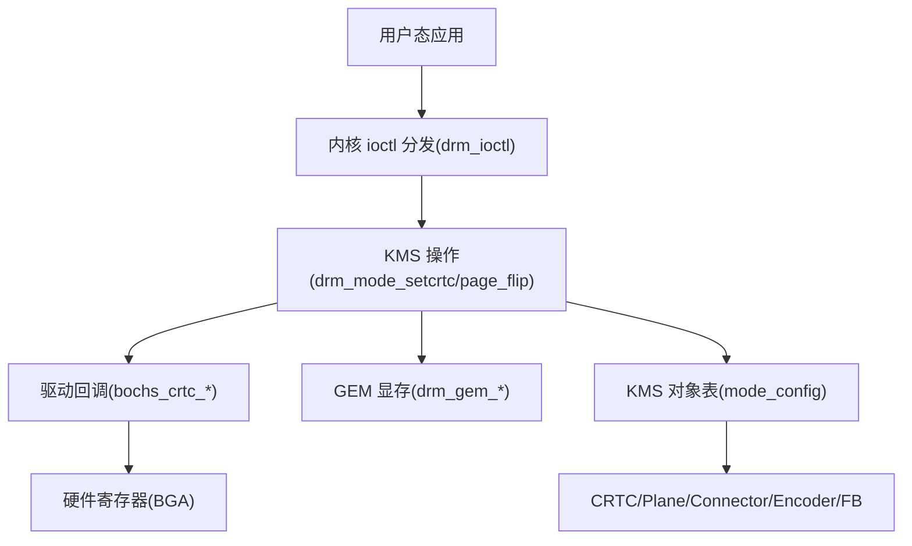
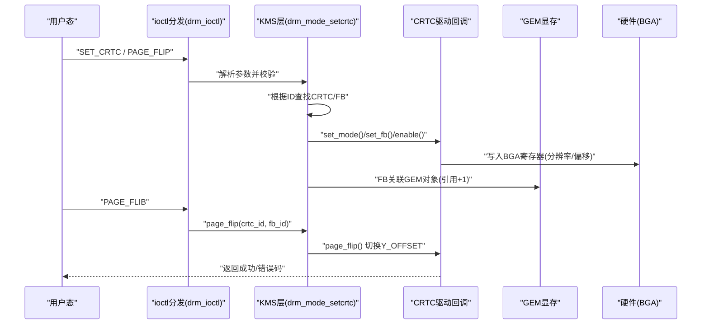
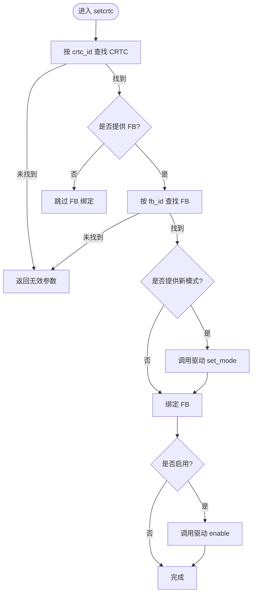
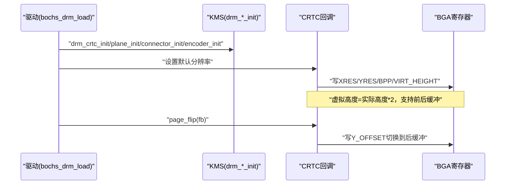
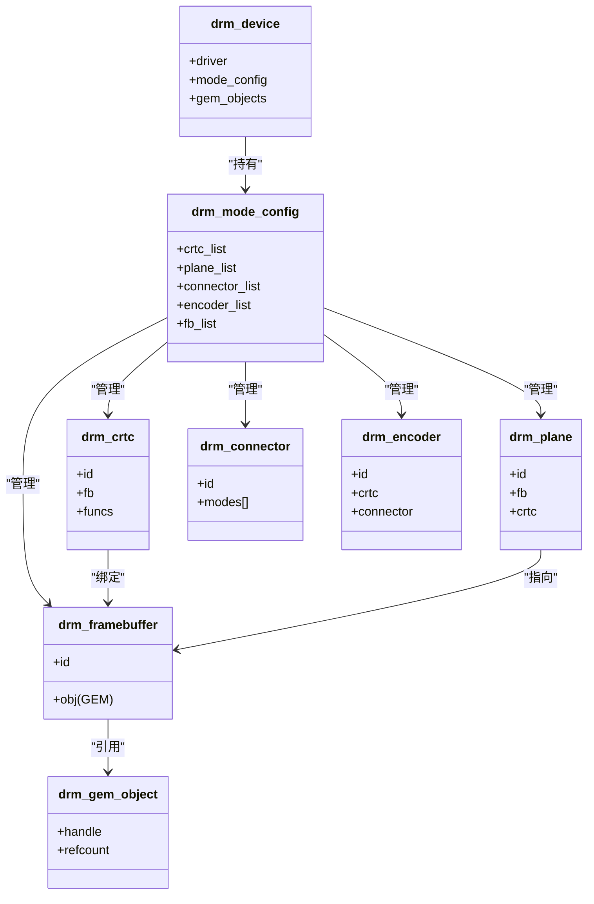

# 显示对象生命周期管理

<cite>
**本文引用的文件**
- [drm_core.h](file://includes/drm/drm_core.h)
- [drm_kms.h](file://includes/drm/drm_kms.h)
- [drm_gem.h](file://includes/drm/drm_gem.h)
- [drm_ioctl.h](file://includes/drm/drm_ioctl.h)
- [drm_core.c](file://kernel/drm/drm_core.c)
- [drm_kms.c](file://kernel/drm/drm_kms.c)
- [drm_gem.c](file://kernel/drm/drm_gem.c)
- [drm_bochs.c](file://kernel/drm/drm_bochs.c)
</cite>

## 目录
1. [简介](#简介)
2. [项目结构](#项目结构)
3. [核心组件](#核心组件)
4. [架构总览](#架构总览)
5. [详细组件分析](#详细组件分析)
6. [依赖关系分析](#依赖关系分析)
7. [性能考量](#性能考量)
8. [故障排查指南](#故障排查指南)
9. [结论](#结论)
10. [附录](#附录)

## 简介
本文件面向驱动开发者，系统性阐述 LulaOS DRM KMS 显示对象模型与生命周期管理。内容覆盖 CRTC、Plane、Connector、Encoder、Framebuffer 的创建、注册、查找与销毁流程；解释对象 ID 分配机制与全局对象表（mode_config）管理；说明对象间依赖关系与引用计数实现；给出错误处理与资源清理策略；并提供扩展自定义对象的实践指导。

## 项目结构
DRM/KMS 子系统由“核心框架 + KMS 对象管理 + GEM 显存管理 + 具体驱动”组成：
- 核心框架：设备/驱动注册、ioctl 分发、全局状态维护
- KMS 对象：CRTC/Plane/Connector/Encoder/FB 的生命周期与模式设置
- GEM：显存对象分配、映射、引用计数
- 驱动示例：Bochs/QEMU VBE 驱动演示完整 KMS 对象链路与双缓冲翻页

图表来源
- [drm_core.c:287-311](file://kernel/drm/drm_core.c#L287-L311)
- [drm_kms.c:382-469](file://kernel/drm/drm_kms.c#L382-L469)
- [drm_bochs.c:218-313](file://kernel/drm/drm_bochs.c#L218-L313)
- [drm_gem.c:135-183](file://kernel/drm/drm_gem.c#L135-L183)

章节来源
- [drm_core.h:45-90](file://includes/drm/drm_core.h#L45-L90)
- [drm_kms.h:92-261](file://includes/drm/drm_kms.h#L92-L261)
- [drm_gem.h:24-45](file://includes/drm/drm_gem.h#L24-L45)
- [drm_core.c:258-375](file://kernel/drm/drm_core.c#L258-L375)
- [drm_kms.c:79-146](file://kernel/drm/drm_kms.c#L79-L146)
- [drm_gem.c:117-133](file://kernel/drm/drm_gem.c#L117-L133)
- [drm_bochs.c:388-524](file://kernel/drm/drm_bochs.c#L388-L524)

## 核心组件
- drm_device：DRM 设备描述符，嵌入统一设备模型，持有 driver、mode_config、GEM 对象链表等
- drm_driver：驱动描述符，定义 load/unload/ioctls 回调并注册到全局驱动链表
- drm_mode_config：KMS 全局配置，维护 CRTC/Plane/Connector/Encoder/FB 列表与数量
- 显示对象：
  - CRTC：控制扫描输出时序，绑定 FB，支持 set_mode/set_fb/enable/disable/page_flip
  - Plane：图层，指向 FB，可定位到 CRTC 上指定区域
  - Connector：物理接口，检测连接状态与 EDID 支持的分辨率
  - Encoder：将像素数据转换为接口信号（简化为空操作）
  - Framebuffer：封装 GEM 对象 + 格式/尺寸信息，供 CRTC 读取像素
- GEM：显存对象，提供 handle 引用、物理连续内存分配、mmap 映射、引用计数

章节来源
- [drm_core.h:45-90](file://includes/drm/drm_core.h#L45-L90)
- [drm_kms.h:92-261](file://includes/drm/drm_kms.h#L92-L261)
- [drm_gem.h:24-45](file://includes/drm/drm_gem.h#L24-L45)

## 架构总览
DRM/KMS 在启动时初始化核心，随后驱动加载并创建 KMS 对象，形成“Connector → Encoder → CRTC → Plane → Framebuffer → GEM”的数据流链路。用户态通过 ioctl 触发模式设置与翻页，内核调用驱动回调完成硬件编程与显存拷贝。

图表来源
- [drm_core.c:287-311](file://kernel/drm/drm_core.c#L287-L311)
- [drm_kms.c:382-469](file://kernel/drm/drm_kms.c#L382-L469)
- [drm_bochs.c:218-313](file://kernel/drm/drm_bochs.c#L218-L313)
- [drm_gem.c:135-183](file://kernel/drm/drm_gem.c#L135-L183)

## 详细组件分析

### CRTC（显示控制器）
- 职责：设置显示模式、绑定 FB、启用/禁用、双缓冲翻页
- 生命周期：
  - 创建与注册：drm_crtc_init 分配 id、加入 mode_config.crtc_list、记录驱动回调
  - 查找：drm_crtc_find 遍历列表按 id 匹配
  - 销毁：drm_crtc_cleanup 从列表移除并递减计数
- 关键流程：
  - set_mode：调用驱动回调设置硬件时序
  - set_fb：绑定 FB，必要时拷贝像素到 VRAM
  - enable/disable：控制显示开关
  - page_flip：切换 Y_OFFSET 实现无撕裂翻页

图表来源
- [drm_kms.c:382-433](file://kernel/drm/drm_kms.c#L382-L433)
- [drm_bochs.c:218-259](file://kernel/drm/drm_bochs.c#L218-L259)

章节来源
- [drm_kms.h:92-125](file://includes/drm/drm_kms.h#L92-L125)
- [drm_kms.c:150-177](file://kernel/drm/drm_kms.c#L150-L177)
- [drm_kms.c:316-330](file://kernel/drm/drm_kms.c#L316-L330)
- [drm_kms.c:382-433](file://kernel/drm/drm_kms.c#L382-L433)
- [drm_bochs.c:218-313](file://kernel/drm/drm_bochs.c#L218-L313)

### Plane（图层）
- 职责：指向一个 FB，并可定位到 CRTC 上的矩形区域
- 生命周期：
  - 创建与注册：drm_plane_init 分配 id、加入 plane_list
  - 更新：plane_funcs.update 设置位置/大小并可选拷贝 FB 到 VRAM
  - 销毁：drm_plane_cleanup 从列表移除并递减计数
- 典型用法：Primary Plane 全屏显示，Cursor/Overlay 用于叠加

章节来源
- [drm_kms.h:127-164](file://includes/drm/drm_kms.h#L127-L164)
- [drm_kms.c:181-210](file://kernel/drm/drm_kms.c#L181-L210)
- [drm_bochs.c:317-353](file://kernel/drm/drm_bochs.c#L317-L353)

### Connector（连接器）
- 职责：检测显示器连接状态，枚举支持的分辨率（EDID）
- 生命周期：
  - 创建与注册：drm_connector_init 分配 id、加入 connector_list
  - 探测：connector_funcs.detect/get_modes 填充 modes 数组
  - 销毁：drm_connector_cleanup 从列表移除并递减计数
- 虚拟显示器：始终 CONNECTED，modes 由驱动动态探测

章节来源
- [drm_kms.h:184-214](file://includes/drm/drm_kms.h#L184-L214)
- [drm_kms.c:214-243](file://kernel/drm/drm_kms.c#L214-L243)
- [drm_bochs.c:357-384](file://kernel/drm/drm_bochs.c#L357-L384)

### Encoder（编码器）
- 职责：将像素数据转换为接口信号（HDMI/DP/VGA），简化实现中为空操作
- 生命周期：
  - 创建与注册：drm_encoder_init 分配 id、加入 encoder_list
  - 销毁：drm_encoder_cleanup 从列表移除并递减计数
- 关系：通常绑定到一个 CRTC 和一个 Connector

章节来源
- [drm_kms.h:166-182](file://includes/drm/drm_kms.h#L166-L182)
- [drm_kms.c:247-270](file://kernel/drm/drm_kms.c#L247-L270)

### Framebuffer（帧缓冲）
- 职责：封装 GEM 对象 + 格式/尺寸信息，供 CRTC 读取像素
- 生命周期：
  - 创建：drm_framebuffer_init 分配 id、增加 GEM 引用、加入 fb_list
  - 销毁：drm_framebuffer_cleanup 减少 GEM 引用并从列表移除
- 注意：FB 不拥有 GEM 内存所有权，仅持有引用

章节来源
- [drm_kms.h:216-236](file://includes/drm/drm_kms.h#L216-L236)
- [drm_kms.c:274-312](file://kernel/drm/drm_kms.c#L274-L312)

### GEM（显存对象）
- 职责：分配物理连续内存、维护 handle、提供 mmap、引用计数
- 生命周期：
  - 创建：drm_gem_create 分配内存、分配 handle、加入设备链表
  - 查找：drm_gem_find 遍历设备链表按 handle 匹配
  - 释放：drm_gem_put 减少引用计数，归零时销毁
- 与 FB 的关系：FB 通过 drm_gem_get 增加引用，避免被提前释放

章节来源
- [drm_gem.h:24-45](file://includes/drm/drm_gem.h#L24-L45)
- [drm_gem.c:135-183](file://kernel/drm/drm_gem.c#L135-L183)
- [drm_gem.c:203-217](file://kernel/drm/drm_gem.c#L203-L217)
- [drm_gem.c:248-257](file://kernel/drm/drm_gem.c#L248-L257)

### Bochs 驱动中的对象链路与双缓冲
- 驱动在 load 中创建 CRTC/Plane/Connector/Encoder，并设置默认分辨率
- 通过 BGA 寄存器设置分辨率、虚拟高度（双缓冲）、Y_OFFSET 切换
- Page Flip 将新帧写入后缓冲并切换 Y_OFFSET，实现无撕裂刷新

图表来源
- [drm_bochs.c:388-524](file://kernel/drm/drm_bochs.c#L388-L524)
- [drm_bochs.c:218-313](file://kernel/drm/drm_bochs.c#L218-L313)

章节来源
- [drm_bochs.c:388-524](file://kernel/drm/drm_bochs.c#L388-L524)
- [drm_bochs.c:218-313](file://kernel/drm/drm_bochs.c#L218-L313)

## 依赖关系分析
- 对象间依赖：
  - Connector 提供可用模式给上层
  - Encoder 桥接 CRTC 与 Connector
  - CRTC 绑定 FB，驱动回调负责硬件编程
  - Plane 作为合成输入源，Primary Plane 常直接驱动 CRTC
  - FB 依赖 GEM 对象提供像素数据
- 全局对象表：
  - mode_config 维护各类型对象链表与计数
  - 所有对象通过 id 进行查找与操作
- 引用计数：
  - FB 引用 GEM 对象，防止显存过早释放
  - GEM 对象 refcount 归零时自动销毁

图表来源
- [drm_core.h:75-90](file://includes/drm/drm_core.h#L75-L90)
- [drm_kms.h:245-261](file://includes/drm/drm_kms.h#L245-L261)
- [drm_kms.h:113-236](file://includes/drm/drm_kms.h#L113-L236)
- [drm_gem.h:34-45](file://includes/drm/drm_gem.h#L34-L45)

章节来源
- [drm_core.h:75-90](file://includes/drm/drm_core.h#L75-L90)
- [drm_kms.h:245-261](file://includes/drm/drm_kms.h#L245-L261)
- [drm_gem.h:34-45](file://includes/drm/drm_gem.h#L34-L45)

## 性能考量
- 显存拷贝：Bochs 驱动在 set_fb/page_flip 中将 FB 内容拷贝到 VRAM，建议在高吞吐场景使用 DMA/GPU 命令缓冲区替代 memcpy
- 双缓冲：虚拟高度为实际高度的两倍，避免撕裂；需确保 VRAM 足够容纳两帧
- 模式选择：动态探测基于 VRAM 大小筛选分辨率，避免超出显存限制导致失败
- 对象查找：当前为链表线性查找，若对象数量增长可考虑哈希表优化

[本节为通用指导，不直接分析具体文件]

## 故障排查指南
- 常见错误码：
  - DRM_ERR_INVAL：参数无效（如找不到 CRTC/FB）
  - DRM_ERR_NOMEM：内存不足（分配失败）
  - DRM_ERR_NODEV：设备不存在（未初始化或已释放）
  - DRM_ERR_NOTSUPP：不支持的操作（ioctl 未实现）
- 排查步骤：
  - 检查 mode_config 是否初始化（drm_mode_config_init）
  - 确认对象已注册（id 有效且在列表中）
  - 验证 FB 与 GEM 对象引用是否正确（drm_gem_get/drm_gem_put）
  - 查看驱动回调返回值与日志（printk）
- 资源泄漏防护：
  - 设备销毁时清理所有 KMS 对象（drm_mode_config_cleanup）
  - GEM 子系统在设备清理时检测未释放对象并打印警告

章节来源
- [drm_core.h:147-153](file://includes/drm/drm_core.h#L147-L153)
- [drm_kms.c:105-146](file://kernel/drm/drm_kms.c#L105-L146)
- [drm_gem.c:123-133](file://kernel/drm/drm_gem.c#L123-L133)

## 结论
LulaOS DRM KMS 实现了完整的显示对象模型与生命周期管理：通过 mode_config 统一管理 CRTC/Plane/Connector/Encoder/FB，结合 GEM 显存管理与引用计数，保障对象安全释放；Bochs 驱动展示了从驱动加载到双缓冲翻页的完整流程。驱动开发者可基于此扩展自定义对象与能力，遵循现有 API 与错误处理约定，确保系统稳定性与可维护性。

[本节为总结，不直接分析具体文件]

## 附录

### 对象 ID 分配与全局对象表管理
- 每个对象类型在 mode_config 中维护独立链表与计数器
- 注册时分配 id = num_xxx，递增计数；注销时移除并递减计数
- 查找函数遍历对应链表按 id 匹配

章节来源
- [drm_kms.c:79-146](file://kernel/drm/drm_kms.c#L79-L146)
- [drm_kms.c:150-270](file://kernel/drm/drm_kms.c#L150-L270)
- [drm_kms.c:316-378](file://kernel/drm/drm_kms.c#L316-L378)

### 对象间依赖与引用计数实现
- FB 引用 GEM 对象：创建 FB 时 drm_gem_get，销毁时 drm_gem_put
- CRTC/Plane 可持有 FB 指针，但不改变其所有权
- GEM 对象 refcount 归零时自动销毁，避免悬挂指针

章节来源
- [drm_kms.c:274-312](file://kernel/drm/drm_kms.c#L274-L312)
- [drm_gem.c:248-257](file://kernel/drm/drm_gem.c#L248-L257)

### 驱动开发扩展指南
- 新增对象类型：
  - 在 drm_mode_config 中添加链表与计数
  - 实现 init/cleanup/find 函数
  - 在 ioctl 层添加相应操作
- 自定义回调：
  - 在对象结构中定义 funcs 指针
  - 驱动实现具体逻辑并在 init 时绑定
- 错误处理：
  - 统一返回 DRM_ERR_* 错误码
  - 在关键路径打印日志便于定位问题

章节来源
- [drm_kms.h:263-310](file://includes/drm/drm_kms.h#L263-L310)
- [drm_core.c:287-311](file://kernel/drm/drm_core.c#L287-L311)