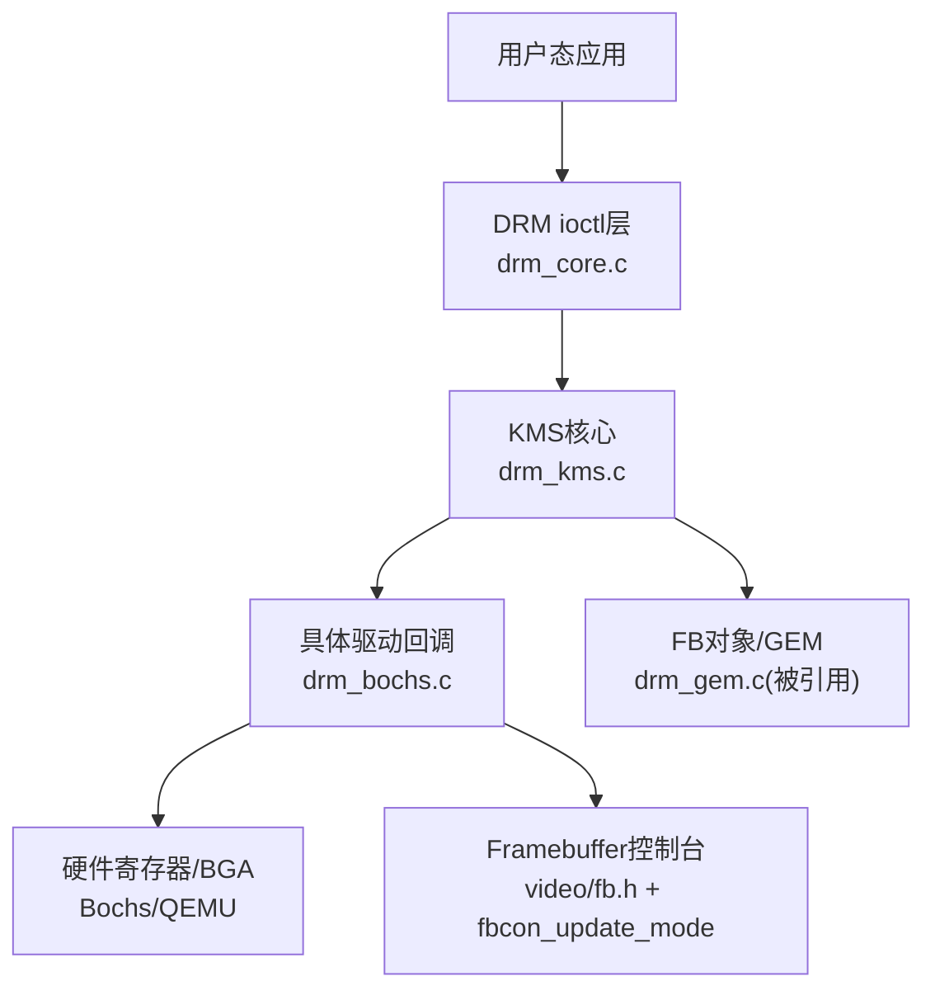
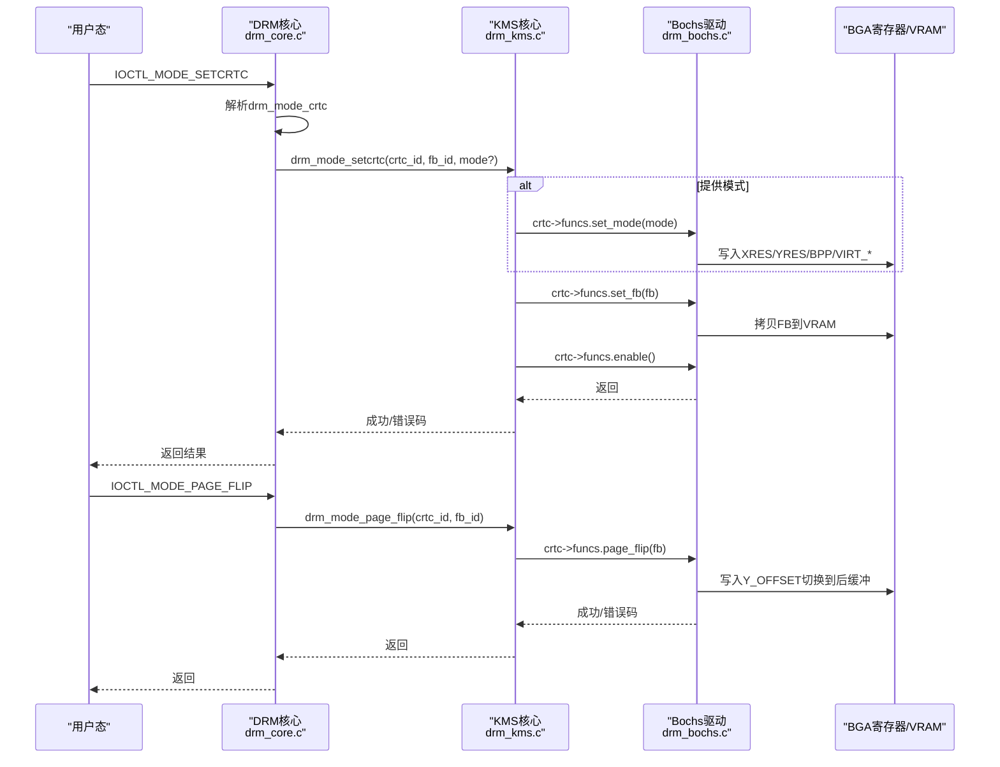
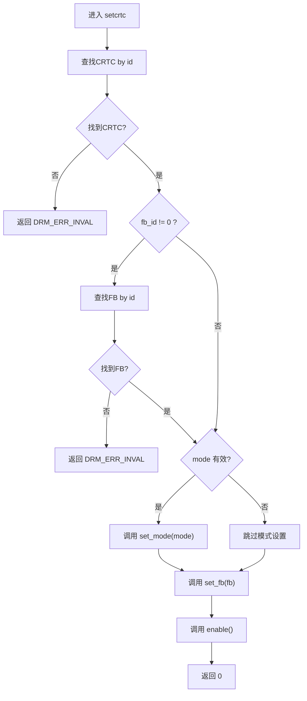
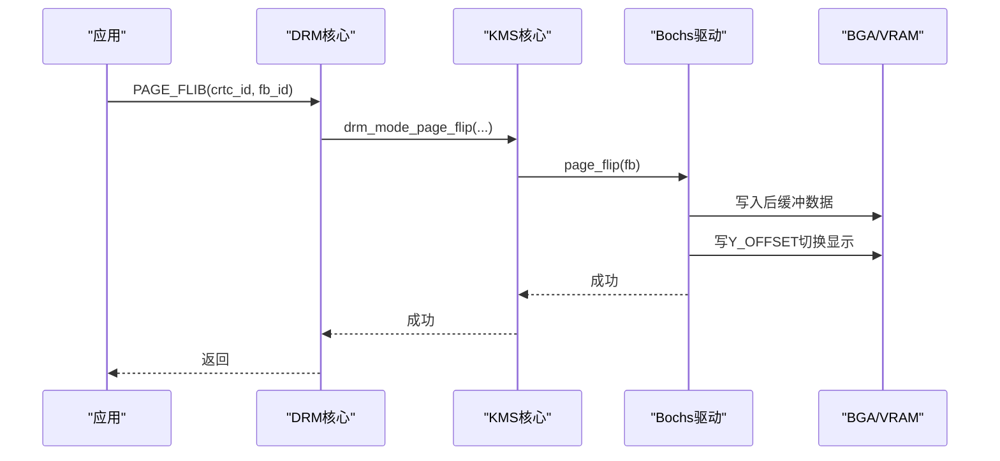
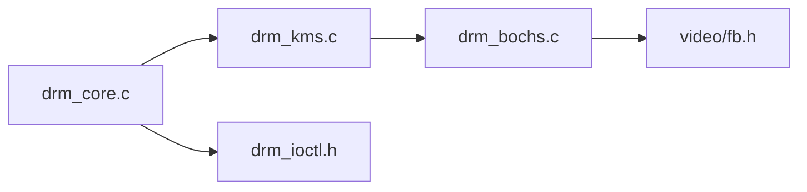

# 模式设置操作

<cite>
**本文引用的文件**
- [kernel/drm/drm_kms.c](file://kernel/drm/drm_kms.c)
- [includes/drm/drm_kms.h](file://includes/drm/drm_kms.h)
- [kernel/drm/drm_core.c](file://kernel/drm/drm_core.c)
- [includes/drm/drm_core.h](file://includes/drm/drm_core.h)
- [includes/drm/drm_ioctl.h](file://includes/drm/drm_ioctl.h)
- [kernel/drm/drm_bochs.c](file://kernel/drm/drm_bochs.c)
- [kernel/drm/drm_fb_helper.c](file://kernel/drm/drm_fb_helper.c)
- [includes/video/fb.h](file://includes/video/fb.h)
</cite>

## 目录
1. [简介](#简介)
2. [项目结构](#项目结构)
3. [核心组件](#核心组件)
4. [架构总览](#架构总览)
5. [详细组件分析](#详细组件分析)
6. [依赖关系分析](#依赖关系分析)
7. [性能考虑](#性能考虑)
8. [故障排查指南](#故障排查指南)
9. [结论](#结论)
10. [附录：API使用与优化建议](#附录api使用与优化建议)

## 简介
本文件面向LulaOS的KMS（内核模式设置）子系统，聚焦“模式设置操作”的完整实现与使用。内容涵盖：
- 显示模式的概念与时序参数含义
- drm_mode_setcrtc()的工作流程与参数验证机制
- 显示模式的枚举、验证与应用过程
- 页面翻转（Page Flip）机制的实现原理与调用时机
- 模式切换的原子性保证与错误处理策略
- 为应用程序开发者提供的模式设置API使用指南与性能优化建议

## 项目结构
DRM KMS在LulaOS中由核心框架、KMS对象管理、具体驱动（Bochs/QEMU VBE）以及Framebuffer图形辅助组成。关键路径如下：
- 核心框架：drm_core.c/drm_core.h（ioctl分发、设备/驱动生命周期）
- KMS对象与模式设置：drm_kms.c/drm_kms.h（CRTC/Plane/Connector/Encoder/FB、mode_config、setcrtc/page_flip）
- 具体驱动：drm_bochs.c（BGA寄存器控制、VRAM映射、模式探测、双缓冲翻页）
- ioctl定义：drm_ioctl.h（命令编号与参数结构）
- Framebuffer图形API：drm_fb_helper.c（像素绘制、测试图像）
- 帧缓冲信息：fb.h（全局fb_info，分辨率/行距/地址等）

图表来源
- [kernel/drm/drm_core.c:242-252](file://kernel/drm/drm_core.c#L242-L252)
- [kernel/drm/drm_kms.c:382-433](file://kernel/drm/drm_kms.c#L382-L433)
- [kernel/drm/drm_bochs.c:218-313](file://kernel/drm/drm_bochs.c#L218-L313)
- [includes/video/fb.h:34-37](file://includes/video/fb.h#L34-L37)

章节来源
- [kernel/drm/drm_core.c:242-252](file://kernel/drm/drm_core.c#L242-L252)
- [kernel/drm/drm_kms.c:79-146](file://kernel/drm/drm_kms.c#L79-L146)
- [kernel/drm/drm_bochs.c:388-524](file://kernel/drm/drm_bochs.c#L388-L524)
- [includes/drm/drm_ioctl.h:21-36](file://includes/drm/drm_ioctl.h#L21-L36)

## 核心组件
- 显示模式（drm_display_mode）：描述有效区域、同步信号时序、总像素/行数、时钟与刷新率。用于精确控制扫描时序。
- CRTC（显示控制器）：负责从FB读取像素并按模式时序输出到显示器；提供set_mode/set_fb/enable/disable/page_flip回调。
- Plane（图层）：指向一个FB，由CRTC合成输出；Primary Plane为主画面。
- Connector（连接器）：物理接口（VGA/HDMI/DP/Virtual），检测连接状态并上报支持的模式列表。
- Encoder（编码器）：将CRTC输出的像素转换为接口信号格式（简化实现为空操作）。
- Framebuffer（帧缓冲）：封装GEM对象与像素格式/尺寸/行距等信息。
- mode_config：管理所有KMS对象的集合与计数，提供最小/最大分辨率限制。

章节来源
- [includes/drm/drm_kms.h:61-90](file://includes/drm/drm_kms.h#L61-L90)
- [includes/drm/drm_kms.h:94-125](file://includes/drm/drm_kms.h#L94-L125)
- [includes/drm/drm_kms.h:127-164](file://includes/drm/drm_kms.h#L127-L164)
- [includes/drm/drm_kms.h:166-214](file://includes/drm/drm_kms.h#L166-L214)
- [includes/drm/drm_kms.h:216-261](file://includes/drm/drm_kms.h#L216-L261)

## 架构总览
下图展示从用户态发起KMS ioctl到最终硬件显示的调用链，重点标注setcrtc与page_flip路径。

图表来源
- [kernel/drm/drm_core.c:216-238](file://kernel/drm/drm_core.c#L216-L238)
- [kernel/drm/drm_kms.c:382-469](file://kernel/drm/drm_kms.c#L382-L469)
- [kernel/drm/drm_bochs.c:218-313](file://kernel/drm/drm_bochs.c#L218-L313)

## 详细组件分析

### 显示模式与时序参数
- hdisplay/vdisplay：水平/垂直有效像素数
- hsync_start/hsync_end、vsync_start/vsync_end：同步信号起止位置
- htotal/vtotal：包含消隐区的总像素/行数
- clock：像素时钟（kHz）
- vrefresh：垂直刷新率（Hz）
- name：模式名称（如“1920x1080”）

默认模式生成函数根据分辨率与刷新率计算时序（CVT-RB风格），并填充clock与name。

章节来源
- [includes/drm/drm_kms.h:61-90](file://includes/drm/drm_kms.h#L61-L90)
- [kernel/drm/drm_kms.c:30-75](file://kernel/drm/drm_kms.c#L30-L75)

### drm_mode_setcrtc()工作流程与参数验证
- 查找CRTC：通过ID遍历mode_config.crtc_list
- 可选FB查找：若fb_id非0则查找FB
- 模式设置：若提供mode且存在set_mode回调，则调用驱动设置分辨率与时序
- 绑定FB：若存在set_fb回调，则调用驱动将FB内容写入显存
- 启用CRTC：调用enable回调，标记active
- 日志输出：记录当前CRTC状态与模式

图表来源
- [kernel/drm/drm_kms.c:382-433](file://kernel/drm/drm_kms.c#L382-L433)

章节来源
- [kernel/drm/drm_kms.c:382-433](file://kernel/drm/drm_kms.c#L382-L433)

### 显示模式的枚举、验证与应用
- 枚举：Connector.get_modes()将运行时探测到的支持模式填入modes数组，数量num_modes
- 验证：应用侧可查询能力（DRM_CAP_PAGE_FLIP等），并结合connector返回的模式进行校验
- 应用：通过SETCRTC ioctl传入hdisplay/vdisplay/vrefresh，核心调用make_default生成drm_display_mode，再交由驱动set_mode写入BGA寄存器

章节来源
- [kernel/drm/drm_bochs.c:364-379](file://kernel/drm/drm_bochs.c#L364-L379)
- [kernel/drm/drm_core.c:216-228](file://kernel/drm/drm_core.c#L216-L228)
- [includes/drm/drm_ioctl.h:21-51](file://includes/drm/drm_ioctl.h#L21-L51)

### 页面翻转（Page Flip）机制
- 目的：避免撕裂，采用前/后缓冲交替显示
- 原理：虚拟高度=实际高度×2；后缓冲位于height偏移处；新帧写入后缓冲后，更新Y_OFFSET切换显示
- 调用时机：应用完成一帧绘制后，调用PAGE_FLIP ioctl触发切换
- 驱动实现：bochs_crtc_page_flip写入后缓冲数据，写BGA_REG_Y_OFFSET切换，更新crtc->fb指针

图表来源
- [kernel/drm/drm_core.c:233-238](file://kernel/drm/drm_core.c#L233-L238)
- [kernel/drm/drm_kms.c:435-469](file://kernel/drm/drm_kms.c#L435-L469)
- [kernel/drm/drm_bochs.c:271-305](file://kernel/drm/drm_bochs.c#L271-L305)

章节来源
- [kernel/drm/drm_bochs.c:271-305](file://kernel/drm/drm_bochs.c#L271-L305)
- [kernel/drm/drm_kms.c:435-469](file://kernel/drm/drm_kms.c#L435-L469)

### 原子性保证与错误处理
- 原子性：当前实现按顺序执行set_mode→set_fb→enable，未引入锁或事务机制；多CRTC或多平面场景下可能产生中间态可见窗口。建议在更复杂场景中引入事务/锁以保证原子切换。
- 错误处理：
  - 无效参数（找不到CRTC/FB）返回DRM_ERR_INVAL
  - 内存不足返回DRM_ERR_NOMEM
  - 不支持操作返回DRM_ERR_NOTSUPP
  - 设备不存在返回DRM_ERR_NODEV
  - 驱动回调失败直接向上返回错误码

章节来源
- [kernel/drm/drm_kms.c:382-469](file://kernel/drm/drm_kms.c#L382-L469)
- [includes/drm/drm_core.h:147-152](file://includes/drm/drm_core.h#L147-L152)

## 依赖关系分析
- drm_core.c提供ioctl表与分发，依赖drm_kms.c的KMS API
- drm_kms.c管理KMS对象，依赖drm_bochs.c的驱动回调
- drm_bochs.c通过BGA寄存器与VRAM访问硬件，并通过fbcon_update_mode同步fb_info
- drm_ioctl.h定义ioctl命令与参数结构，贯穿用户态与内核态交互

图表来源
- [kernel/drm/drm_core.c:242-252](file://kernel/drm/drm_core.c#L242-L252)
- [kernel/drm/drm_kms.c:382-469](file://kernel/drm/drm_kms.c#L382-L469)
- [kernel/drm/drm_bochs.c:218-313](file://kernel/drm/drm_bochs.c#L218-L313)
- [includes/drm/drm_ioctl.h:21-36](file://includes/drm/drm_ioctl.h#L21-L36)

章节来源
- [kernel/drm/drm_core.c:242-252](file://kernel/drm/drm_core.c#L242-L252)
- [kernel/drm/drm_kms.c:382-469](file://kernel/drm/drm_kms.c#L382-L469)
- [kernel/drm/drm_bochs.c:218-313](file://kernel/drm/drm_bochs.c#L218-L313)
- [includes/drm/drm_ioctl.h:21-36](file://includes/drm/drm_ioctl.h#L21-L36)

## 性能考虑
- 模式设置开销：每次set_mode需写多个BGA寄存器，应避免频繁切换分辨率
- FB拷贝成本：set_fb/page_flip涉及大量内存拷贝，尽量批量更新并使用页翻减少重绘
- VRAM大小限制：动态探测模式时考虑双缓冲需求（width*height*4*2 <= vram_size），过高分辨率会导致无可用模式
- 行距对齐：pitch影响拷贝效率，确保每行字节数合理对齐
- 渲染路径：优先使用drm_fb_helper中的fill_rect/draw_image等批量API，减少逐像素调用

[本节为通用性能指导，不直接分析具体文件]

## 故障排查指南
- 无法设置模式：检查CRTC是否存在、mode_valid是否设置、驱动set_mode是否返回错误
- 页面翻转无效：确认CRTC已激活、FB有效、驱动page_flip回调存在且成功
- 花屏/错位：检查pitch与bpp设置是否正确，fbcon_update_mode是否及时调用
- 资源不足：降低分辨率或关闭双缓冲，确保所需显存不超过vram_size

章节来源
- [kernel/drm/drm_kms.c:382-469](file://kernel/drm/drm_kms.c#L382-L469)
- [kernel/drm/drm_bochs.c:140-165](file://kernel/drm/drm_bochs.c#L140-L165)
- [kernel/drm/drm_bochs.c:218-214](file://kernel/drm/drm_bochs.c#L218-L214)

## 结论
LulaOS的DRM KMS实现了完整的模式设置与页面翻转机制，通过CRTC/Plane/Connector/Encoder/FB对象模型统一管理显示资源。Bochs驱动基于BGA寄存器与VRAM实现分辨率切换与双缓冲翻页。当前实现简洁高效，适用于单设备与基础图形场景；在多CRTC/多平面或高并发场景下，建议引入事务与锁以增强原子性与一致性。

[本节为总结性内容，不直接分析具体文件]

## 附录：API使用与优化建议

### 应用程序开发者的模式设置步骤
- 初始化与能力查询：
  - 使用GET_CAP查询DRM_CAP_PAGE_FLIP等能力
- 枚举资源与模式：
  - GETRESOURCES获取CRTC/Connector ID
  - GETCONNECTOR获取支持的drm_display_mode列表
- 创建FB：
  - GEM_CREATE分配显存handle
  - ADDFB2用handle创建FB（指定width/height/pitch/format）
- 设置模式：
  - SETCRTC传入crtc_id、fb_id、hdisplay/vdisplay/vrefresh（mode_valid=1）
- 页面翻转：
  - 绘制完成后调用PAGE_FLIC切换至新FB

章节来源
- [includes/drm/drm_ioctl.h:21-36](file://includes/drm/drm_ioctl.h#L21-L36)
- [kernel/drm/drm_core.c:216-238](file://kernel/drm/drm_core.c#L216-L238)
- [kernel/drm/drm_kms.c:382-469](file://kernel/drm/drm_kms.c#L382-L469)

### 性能优化建议
- 预分配多个FB并轮换使用，减少频繁创建销毁
- 使用批量绘制API（fill_rect/draw_image）减少逐像素调用
- 合理选择分辨率与bpp，确保在vram_size范围内并满足双缓冲需求
- 避免频繁set_mode，尽量在一次会话内固定分辨率
- 利用page_flip减少撕裂，结合应用帧率控制减少不必要的切换

[本节为通用优化建议，不直接分析具体文件]