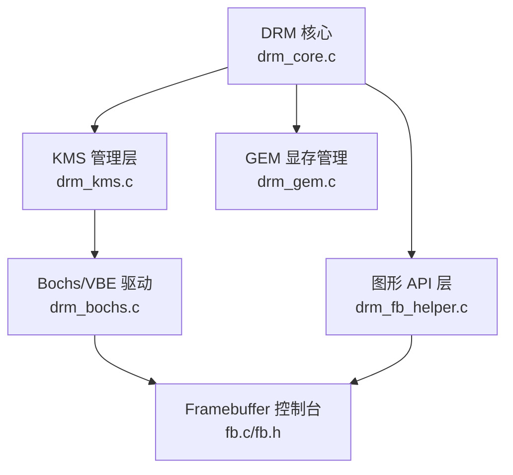
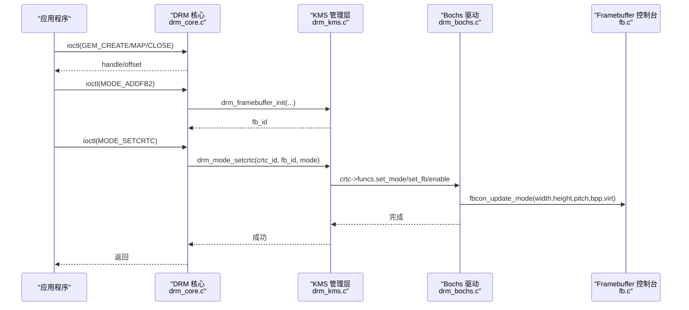
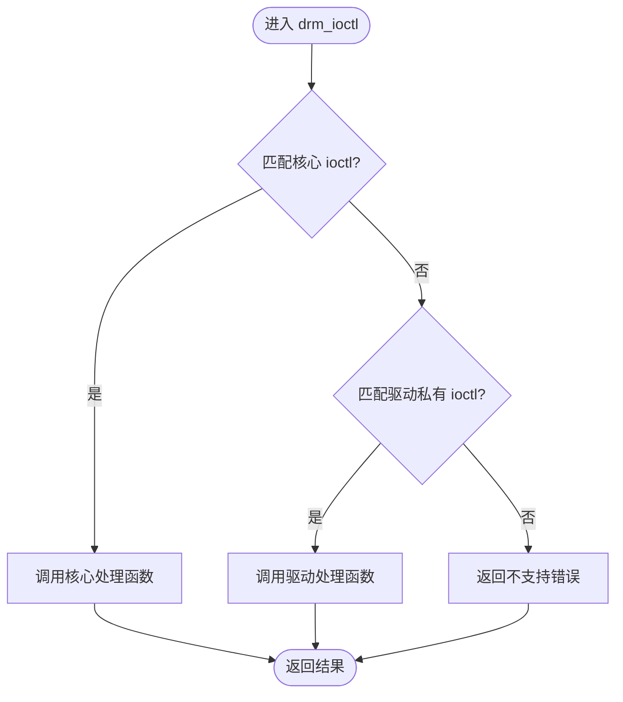
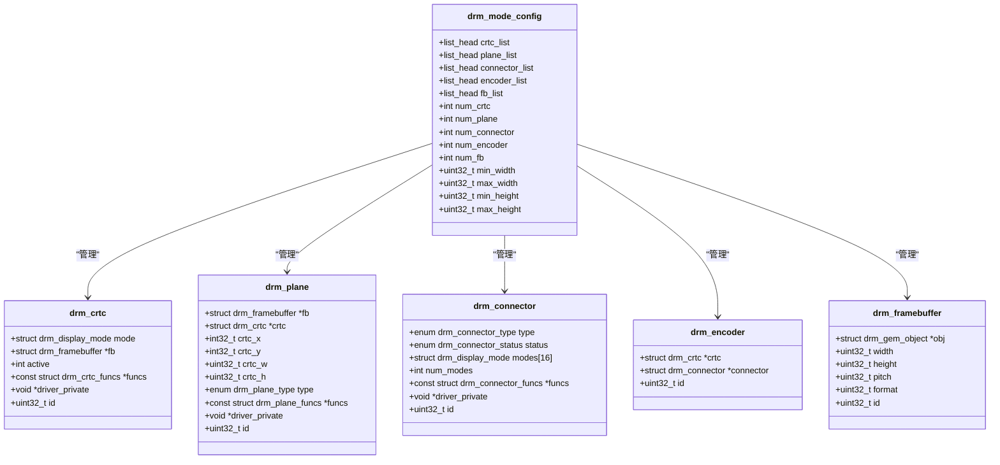
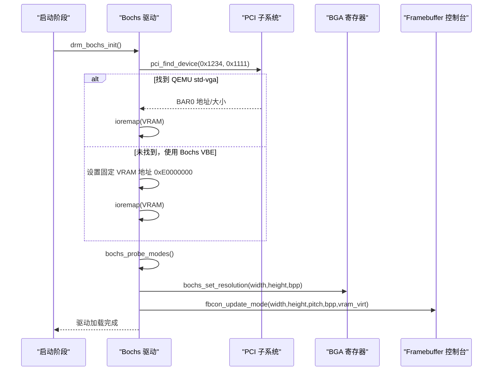
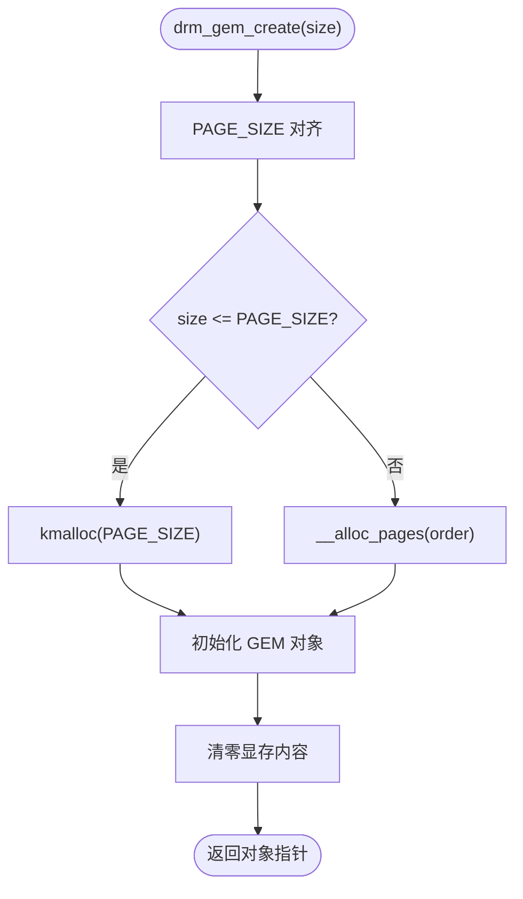
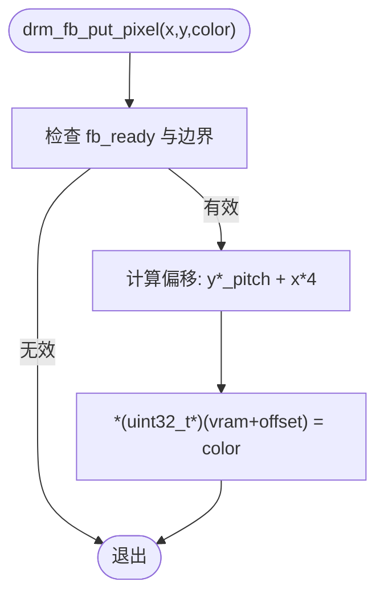
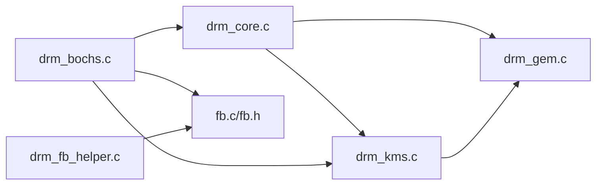

# 图形显示系统

<cite>
**本文引用的文件**
- [kernel/drm/drm_core.c](file://kernel/drm/drm_core.c)
- [kernel/drm/drm_kms.c](file://kernel/drm/drm_kms.c)
- [kernel/drm/drm_bochs.c](file://kernel/drm/drm_bochs.c)
- [kernel/drm/drm_gem.c](file://kernel/drm/drm_gem.c)
- [kernel/drm/drm_fb_helper.c](file://kernel/drm/drm_fb_helper.c)
- [includes/drm/drm_core.h](file://includes/drm/drm_core.h)
- [includes/drm/drm_kms.h](file://includes/drm/drm_kms.h)
- [includes/drm/drm_gem.h](file://includes/drm/drm_gem.h)
- [includes/video/fb.h](file://includes/video/fb.h)
- [kernel/video/fb.c](file://kernel/video/fb.c)
</cite>

## 目录
1. [简介](#简介)
2. [项目结构](#项目结构)
3. [核心组件](#核心组件)
4. [架构总览](#架构总览)
5. [详细组件分析](#详细组件分析)
6. [依赖关系分析](#依赖关系分析)
7. [性能考量](#性能考量)
8. [故障排查指南](#故障排查指南)
9. [结论](#结论)
10. [附录：API 参考与开发示例](#附录api-参考与开发示例)

## 简介
本文件系统性地梳理并文档化 LulaOS 的图形显示子系统，重点覆盖以下方面：
- DRM（内核模式设置 KMS）框架的设计与实现：设备/驱动模型、KMS 对象管理、ioctl 分发。
- Bochs/QEMU VBE 驱动的硬件抽象：BGA 寄存器控制、VRAM 映射、分辨率探测与切换。
- 帧缓冲管理与渲染管线：GEM 显存对象、Framebuffer 创建与绑定、双缓冲翻页。
- 图形 API 层：像素绘制、位图/图片绘制、文字渲染与测试图案。
- 扩展开发指南：如何新增 GPU 驱动、配置显示模式、使用 API 进行渲染。

该文档既适合对底层图形栈感兴趣的开发者，也适合希望基于现有框架快速构建图形应用的工程师。

## 项目结构
LulaOS 图形子系统按“核心框架 + KMS 管理层 + 具体驱动 + 内存管理 + 图形 API”分层组织：
- 核心框架：drm_core.c/drm_core.h，负责驱动注册、设备生命周期、ioctl 分发。
- KMS 管理层：drm_kms.c/drm_kms.h，定义 CRTC/Plane/Connector/Encoder/FB 等对象及模式设置流程。
- 具体驱动：drm_bochs.c，实现 Bochs/QEMU VBE 的 BGA 寄存器操作、VRAM 映射、模式探测与输出控制。
- 显存管理：drm_gem.c/drm_gem.h，提供 GEM 对象分配、查找、释放与映射能力。
- 图形 API：drm_fb_helper.c，封装像素级绘图、位图/图片绘制、文字渲染与综合测试。
- 帧缓冲控制台：video/fb.c/fb.h，维护 fb_info，提供 ioremap 与 fbcon_update_mode 接口，供 DRM 驱动在分辨率变化时同步控制台参数。

图表来源
- [kernel/drm/drm_core.c:258-311](file://kernel/drm/drm_core.c#L258-L311)
- [kernel/drm/drm_kms.c:79-146](file://kernel/drm/drm_kms.c#L79-L146)
- [kernel/drm/drm_bochs.c:388-523](file://kernel/drm/drm_bochs.c#L388-L523)
- [kernel/drm/drm_gem.c:117-183](file://kernel/drm/drm_gem.c#L117-L183)
- [kernel/drm/drm_fb_helper.c:44-60](file://kernel/drm/drm_fb_helper.c#L44-L60)
- [kernel/video/fb.c:222-251](file://kernel/video/fb.c#L222-L251)

章节来源
- [kernel/drm/drm_core.c:258-311](file://kernel/drm/drm_core.c#L258-L311)
- [kernel/drm/drm_kms.c:79-146](file://kernel/drm/drm_kms.c#L79-L146)
- [kernel/drm/drm_bochs.c:388-523](file://kernel/drm/drm_bochs.c#L388-L523)
- [kernel/drm/drm_gem.c:117-183](file://kernel/drm/drm_gem.c#L117-L183)
- [kernel/drm/drm_fb_helper.c:44-60](file://kernel/drm/drm_fb_helper.c#L44-L60)
- [kernel/video/fb.c:222-251](file://kernel/video/fb.c#L222-L251)

## 核心组件
- DRM 核心：维护全局驱动链表、设备生命周期、ioctl 分发；提供 drm_device_alloc/free、drm_register_driver/unregister_driver、drm_ioctl。
- KMS 管理层：初始化 mode_config，管理 CRTC/Plane/Connector/Encoder/FB 对象；提供 drm_mode_setcrtc、drm_mode_page_flip、drm_mode_make_default。
- Bochs 驱动：通过 BGA 寄存器设置分辨率、虚拟高度（双缓冲）、偏移；动态探测 VRAM 支持的分辨率；创建并注册 CRTC/Plane/Connector/Encoder。
- GEM 显存管理：分配物理连续内存（kmalloc 或伙伴系统），创建 GEM 对象，支持 mmap 到用户空间（简化实现）。
- 图形 API：提供 put_pixel、fill_rect、clear、draw_bitmap、draw_image、draw_char、draw_string、test_image 等高级绘图接口。
- Framebuffer 控制台：维护 fb_info，提供 fb_ioremap 和 fbcon_update_mode，确保分辨率变化后控制台正确工作。

章节来源
- [includes/drm/drm_core.h:43-145](file://includes/drm/drm_core.h#L43-L145)
- [includes/drm/drm_kms.h:61-315](file://includes/drm/drm_kms.h#L61-L315)
- [kernel/drm/drm_bochs.c:85-113](file://kernel/drm/drm_bochs.c#L85-L113)
- [kernel/drm/drm_gem.c:135-183](file://kernel/drm/drm_gem.c#L135-L183)
- [kernel/drm/drm_fb_helper.c:44-60](file://kernel/drm/drm_fb_helper.c#L44-L60)
- [includes/video/fb.h:11-48](file://includes/video/fb.h#L11-L48)

## 架构总览
下图展示了从应用调用到硬件输出的完整数据流与控制流：

图表来源
- [kernel/drm/drm_core.c:287-311](file://kernel/drm/drm_core.c#L287-L311)
- [kernel/drm/drm_kms.c:382-433](file://kernel/drm/drm_kms.c#L382-L433)
- [kernel/drm/drm_bochs.c:218-224](file://kernel/drm/drm_bochs.c#L218-L224)
- [kernel/video/fb.c:222-251](file://kernel/video/fb.c#L222-L251)

## 详细组件分析

### DRM 核心（drm_core.c）
- 功能要点：
  - 全局驱动链表管理：drm_register_driver/drm_unregister_driver。
  - 内置 ioctl 表：版本查询、能力查询、GEM 创建/映射/关闭、KMS 资源枚举、FB 创建、CRTC 设置、Page Flip。
  - 设备生命周期：drm_device_alloc/free，内部初始化 GEM 子系统和 KMS mode_config。
- 关键流程：
  - drm_ioctl：先匹配核心 ioctl 表，再匹配驱动私有表，未找到返回不支持。
  - drm_device_alloc：初始化 gem_objects 链表、next_handle、mode_config，并记录全局设备指针。

图表来源
- [kernel/drm/drm_core.c:287-311](file://kernel/drm/drm_core.c#L287-L311)

章节来源
- [kernel/drm/drm_core.c:258-311](file://kernel/drm/drm_core.c#L258-L311)
- [includes/drm/drm_core.h:43-145](file://includes/drm/drm_core.h#L43-L145)

### KMS 管理层（drm_kms.c）
- 功能要点：
  - mode_config 初始化与清理：维护 CRTC/Plane/Connector/Encoder/FB 列表与计数。
  - 对象注册：drm_crtc_init、drm_plane_init、drm_connector_init、drm_encoder_init。
  - Framebuffer 管理：drm_framebuffer_init/cleanup，关联 GEM 对象与格式/尺寸信息。
  - Mode Setting：drm_mode_setcrtc 调用驱动回调 set_mode/set_fb/enable，更新 CRTC 状态。
  - Page Flip：drm_mode_page_flip 调用驱动 page_flip 或直接切换 FB。
- 时序计算：drm_mode_make_default 生成标准 CVT-RB 风格时序。

图表来源
- [includes/drm/drm_kms.h:245-315](file://includes/drm/drm_kms.h#L245-L315)

章节来源
- [kernel/drm/drm_kms.c:79-146](file://kernel/drm/drm_kms.c#L79-L146)
- [kernel/drm/drm_kms.c:150-270](file://kernel/drm/drm_kms.c#L150-L270)
- [kernel/drm/drm_kms.c:274-312](file://kernel/drm/drm_kms.c#L274-L312)
- [kernel/drm/drm_kms.c:382-469](file://kernel/drm/drm_kms.c#L382-L469)
- [includes/drm/drm_kms.h:61-315](file://includes/drm/drm_kms.h#L61-L315)

### Bochs/QEMU VBE 驱动（drm_bochs.c）
- 硬件抽象：
  - BGA 寄存器：索引端口 0x01CE，数据端口 0x01CF；支持 XRES/YRES/BPP/ENABLE/BANK/VIRT_WIDTH/VIRT_HEIGHT/X_OFFSET/Y_OFFSET。
  - VRAM 来源：QEMU std-vga 通过 PCI BAR0；Bochs VBE 固定地址 0xE0000000。
- 模式探测：
  - vesa_probe_modes 表包含常见分辨率；根据 VRAM 大小筛选可承载的模式（考虑双缓冲需 2 倍帧大小）。
  - 若无一满足则回退至 640x480。
- 显示控制：
  - bochs_set_resolution：禁用显示 → 设置分辨率/BPP → 设置虚拟尺寸（双缓冲）→ 设置偏移 → 启用显示（线性帧缓冲）。
  - CRTC 回调：set_mode/set_fb/enable/disable/page_flip；page_flip 通过切换 Y_OFFSET 实现无撕裂翻页。
- 驱动加载：
  - 查找 PCI VGA 设备或回退 Bochs VBE；ioremap 完整 VRAM；动态探测模式；创建并注册 KMS 对象；打印诊断信息。

图表来源
- [kernel/drm/drm_bochs.c:388-523](file://kernel/drm/drm_bochs.c#L388-L523)
- [kernel/drm/drm_bochs.c:140-214](file://kernel/drm/drm_bochs.c#L140-L214)
- [kernel/video/fb.c:222-251](file://kernel/video/fb.c#L222-L251)

章节来源
- [kernel/drm/drm_bochs.c:30-113](file://kernel/drm/drm_bochs.c#L30-L113)
- [kernel/drm/drm_bochs.c:140-214](file://kernel/drm/drm_bochs.c#L140-L214)
- [kernel/drm/drm_bochs.c:218-313](file://kernel/drm/drm_bochs.c#L218-L313)
- [kernel/drm/drm_bochs.c:388-523](file://kernel/drm/drm_bochs.c#L388-L523)

### GEM 显存管理（drm_gem.c）
- 功能要点：
  - 分配策略：单页用 kmalloc，多页用 __alloc_pages 获取物理连续页；统一转换为物理地址与内核虚拟地址。
  - 对象管理：drm_gem_create/destroy/find，维护设备级链表与句柄分配。
  - 映射：drm_gem_mmap 调用 fb_ioremap 将物理页映射到指定虚拟地址（简化实现）。
- 复杂度与优化：
  - 分配/释放时间复杂度 O(order)，order 为所需阶数；实际开销较小。
  - 建议后续引入引用计数与共享映射以提升并发性能。

图表来源
- [kernel/drm/drm_gem.c:38-82](file://kernel/drm/drm_gem.c#L38-L82)
- [kernel/drm/drm_gem.c:135-183](file://kernel/drm/drm_gem.c#L135-L183)

章节来源
- [kernel/drm/drm_gem.c:117-183](file://kernel/drm/drm_gem.c#L117-L183)
- [kernel/drm/drm_gem.c:203-257](file://kernel/drm/drm_gem.c#L203-L257)
- [includes/drm/drm_gem.h:24-128](file://includes/drm/drm_gem.h#L24-L128)

### 图形 API 层（drm_fb_helper.c）
- 功能要点：
  - 初始化：drm_fb_helper_init 缓存 fb.virt_addr、width、height、pitch，标记可用。
  - 基础绘图：put_pixel、fill_rect、clear，直接写入 VRAM。
  - 位图/图片：draw_bitmap（1bpp→32bpp 展开）、draw_image（XRGB8888 真彩）。
  - 文字渲染：draw_char/draw_string，基于 font_8x16。
  - 测试图案：test_image 综合展示渐变、色条、矩形、菱形、精灵与文字。
- 数据流：
  - 所有绘制最终落到 VRAM 线性缓冲区；显示器自动扫描输出。

图表来源
- [kernel/drm/drm_fb_helper.c:72-81](file://kernel/drm/drm_fb_helper.c#L72-L81)

章节来源
- [kernel/drm/drm_fb_helper.c:44-60](file://kernel/drm/drm_fb_helper.c#L44-L60)
- [kernel/drm/drm_fb_helper.c:72-129](file://kernel/drm/drm_fb_helper.c#L72-L129)
- [kernel/drm/drm_fb_helper.c:145-210](file://kernel/drm/drm_fb_helper.c#L145-L210)
- [kernel/drm/drm_fb_helper.c:220-245](file://kernel/drm/drm_fb_helper.c#L220-L245)
- [kernel/drm/drm_fb_helper.c:430-609](file://kernel/drm/drm_fb_helper.c#L430-L609)

### Framebuffer 控制台（fb.c/fb.h）
- 功能要点：
  - fb_info：维护 phys_addr、virt_addr、width、height、pitch、bpp、type、active。
  - ioremap：将物理地址映射到 vmalloc 区域虚拟地址，建立页表项。
  - fbcon_update_mode：分辨率变化后同步 fb 参数，切换到完整 VRAM 映射，清屏并复位光标。
- 重要性：
  - 确保 DRM 驱动修改分辨率后，控制台与图形 API 仍能正确访问 VRAM，避免花屏与 Page Fault。

章节来源
- [includes/video/fb.h:11-48](file://includes/video/fb.h#L11-L48)
- [kernel/video/fb.c:37-74](file://kernel/video/fb.c#L37-L74)
- [kernel/video/fb.c:222-251](file://kernel/video/fb.c#L222-L251)
- [kernel/video/fb.c:255-319](file://kernel/video/fb.c#L255-L319)

## 依赖关系分析
- 模块耦合：
  - drm_core 依赖 drm_kms 与 drm_gem，提供 ioctl 分发与设备生命周期。
  - drm_kms 依赖 drm_gem（FB 关联 GEM），并提供 KMS 对象管理。
  - drm_bochs 依赖 drm_core、drm_kms、pci、arch/x86/io、highmem（ioremap）、video/fb。
  - drm_fb_helper 依赖 video/fb，直接操作 VRAM。
- 外部依赖：
  - PCI 子系统用于发现 QEMU std-vga。
  - 页表与 TLB 刷新用于 ioremap。
- 潜在循环依赖：
  - 当前设计清晰分层，未见明显循环依赖。

图表来源
- [kernel/drm/drm_core.c:15-21](file://kernel/drm/drm_core.c#L15-L21)
- [kernel/drm/drm_kms.c:15-20](file://kernel/drm/drm_kms.c#L15-L20)
- [kernel/drm/drm_bochs.c:18-28](file://kernel/drm/drm_bochs.c#L18-L28)
- [kernel/drm/drm_fb_helper.c:21-25](file://kernel/drm/drm_fb_helper.c#L21-L25)

章节来源
- [kernel/drm/drm_core.c:15-21](file://kernel/drm/drm_core.c#L15-L21)
- [kernel/drm/drm_kms.c:15-20](file://kernel/drm/drm_kms.c#L15-L20)
- [kernel/drm/drm_bochs.c:18-28](file://kernel/drm/drm_bochs.c#L18-L28)
- [kernel/drm/drm_fb_helper.c:21-25](file://kernel/drm/drm_fb_helper.c#L21-L25)

## 性能考量
- 内存分配：
  - GEM 分配采用伙伴系统，尽量保证物理连续性以利于 DMA；单页路径使用 kmalloc 减少开销。
- 拷贝开销：
  - Bochs 驱动在 set_fb/page_flip 中执行 memcpy 到 VRAM；在高刷新率场景下可考虑零拷贝或 DMA 引擎。
- 双缓冲：
  - 通过虚拟高度与 Y_OFFSET 切换实现无撕裂翻页；注意 VRAM 容量限制与模式探测准确性。
- I/O 映射：
  - ioremap 建立页表项并刷新 TLB；频繁映射应缓存虚拟地址以避免重复开销。
- 渲染路径：
  - 图形 API 直接写 VRAM；批量绘制建议使用 fill_rect/draw_image 减少逐像素调用。

[本节为通用性能讨论，不直接分析具体文件]

## 故障排查指南
- 无 VRAM 或映射失败：
  - 检查 PCI BAR0 是否有效；Bochs VBE 固定地址是否正确；ioremap 返回值是否为空。
  - 参考日志：bochs-drm 打印 VRAM 物理/虚拟地址与大小。
- 花屏或 Page Fault：
  - 确认 fbcon_update_mode 已调用且 new_virt 指向完整 VRAM 映射；检查 pitch/bpp 是否与分辨率匹配。
  - 参考 fbcon_update_mode 的实现逻辑。
- 模式不可用：
  - 检查 vesa_probe_modes 表与 VRAM 大小；若无一满足，会回退至 640x480。
  - 参考 bochs_probe_modes 的逻辑。
- CRTC 未激活：
  - 确认 drm_mode_setcrtc 成功调用；检查驱动回调 enable 是否被触发。
  - 参考 drm_mode_setcrtc 的流程。

章节来源
- [kernel/drm/drm_bochs.c:425-441](file://kernel/drm/drm_bochs.c#L425-L441)
- [kernel/video/fb.c:222-251](file://kernel/video/fb.c#L222-L251)
- [kernel/drm/drm_bochs.c:140-165](file://kernel/drm/drm_bochs.c#L140-L165)
- [kernel/drm/drm_kms.c:382-433](file://kernel/drm/drm_kms.c#L382-L433)

## 结论
LulaOS 的图形显示子系统以 DRM 为核心，结合 KMS 管理层与 Bochs/VBE 驱动，实现了完整的显示模式设置、帧缓冲管理与双缓冲翻页能力。GEM 显存管理提供了安全的显存分配与映射机制，图形 API 层简化了像素级绘制与图像渲染。整体架构清晰、可扩展性强，适合进一步集成更多 GPU 驱动与高级图形特性。

[本节为总结性内容，不直接分析具体文件]

## 附录：API 参考与开发示例

### 显示模式配置与分辨率设置
- 动态探测：
  - 使用 vesa_probe_modes 表与 VRAM 大小筛选支持的模式；默认选择最大模式。
  - 参考：bochs_probe_modes、bochs_set_resolution。
- 手动设置：
  - 通过 drm_mode_make_default 生成模式，调用 drm_mode_setcrtc 设置 CRTC。
  - 参考：drm_mode_make_default、drm_mode_setcrtc。

章节来源
- [kernel/drm/drm_bochs.c:140-214](file://kernel/drm/drm_bochs.c#L140-L214)
- [kernel/drm/drm_kms.c:30-75](file://kernel/drm/drm_kms.c#L30-L75)
- [kernel/drm/drm_kms.c:382-433](file://kernel/drm/drm_kms.c#L382-L433)

### 图形驱动扩展开发指南
- 新增 GPU 驱动步骤：
  1. 定义驱动描述符 drm_driver，实现 load/unload 回调。
  2. 在 load 中分配并初始化 drm_device，创建 CRTC/Plane/Connector/Encoder。
  3. 实现 CRTC 回调：set_mode/set_fb/enable/disable/page_flip。
  4. 注册驱动并调用 drm_device_alloc/load。
  5. 必要时实现私有 ioctl 表。
- 关键参考：
  - drm_bochs_drm_driver 定义与 drm_bochs_init 入口。
  - drm_register_driver/drm_device_alloc/driver->load。

章节来源
- [kernel/drm/drm_bochs.c:544-590](file://kernel/drm/drm_bochs.c#L544-L590)
- [kernel/drm/drm_core.c:265-311](file://kernel/drm/drm_core.c#L265-L311)

### 完整 API 参考
- DRM 核心：
  - drm_core_init、drm_register_driver、drm_unregister_driver、drm_ioctl、drm_device_alloc/free、drm_get_global_device。
- KMS：
  - drm_mode_config_init/cleanup、drm_crtc_init/cleanup、drm_plane_init/cleanup、drm_connector_init/cleanup、drm_encoder_init/cleanup、drm_framebuffer_init/cleanup、drm_mode_setcrtc、drm_mode_page_flip、drm_mode_make_default。
- GEM：
  - drm_gem_init_device/cleanup_device、drm_gem_create/destroy/find/mmap、drm_gem_get/put。
- 图形 API：
  - drm_fb_helper_init、drm_fb_put_pixel、drm_fb_fill_rect、drm_fb_clear、drm_fb_draw_bitmap、drm_fb_draw_image、drm_fb_draw_char、drm_fb_draw_string、drm_fb_test_image。
- Framebuffer：
  - fbcon_init、fbcon_put_char/string/clear/scroll_up、fbcon_update_mode、fb_ioremap。

章节来源
- [includes/drm/drm_core.h:98-145](file://includes/drm/drm_core.h#L98-L145)
- [includes/drm/drm_kms.h:265-315](file://includes/drm/drm_kms.h#L265-L315)
- [includes/drm/drm_gem.h:49-128](file://includes/drm/drm_gem.h#L49-L128)
- [kernel/drm/drm_fb_helper.c:44-245](file://kernel/drm/drm_fb_helper.c#L44-L245)
- [includes/video/fb.h:27-48](file://includes/video/fb.h#L27-L48)

### 开发示例
- 创建帧缓冲并设置 CRTC：
  1. 调用 drm_gem_create 分配显存对象。
  2. 调用 drm_mode_addfb2 创建 Framebuffer。
  3. 调用 drm_mode_setcrtc 设置 CRTC 模式与 FB。
  4. 可选：调用 drm_mode_page_flip 实现双缓冲翻页。
- 绘制测试图案：
  - 调用 drm_fb_test_image 验证图形子系统工作正常。

章节来源
- [kernel/drm/drm_core.c:185-238](file://kernel/drm/drm_core.c#L185-L238)
- [kernel/drm/drm_kms.c:382-469](file://kernel/drm/drm_kms.c#L382-L469)
- [kernel/drm/drm_fb_helper.c:430-609](file://kernel/drm/drm_fb_helper.c#L430-L609)