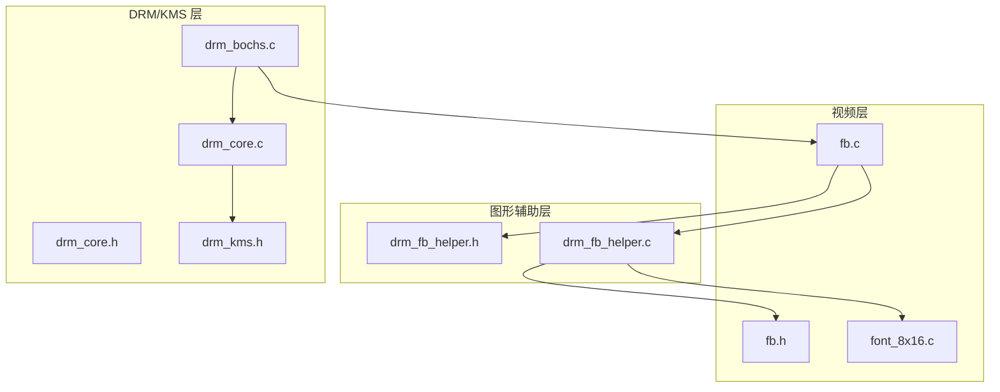
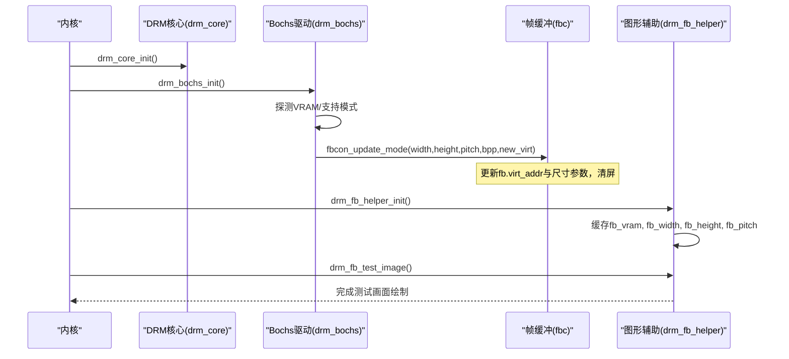
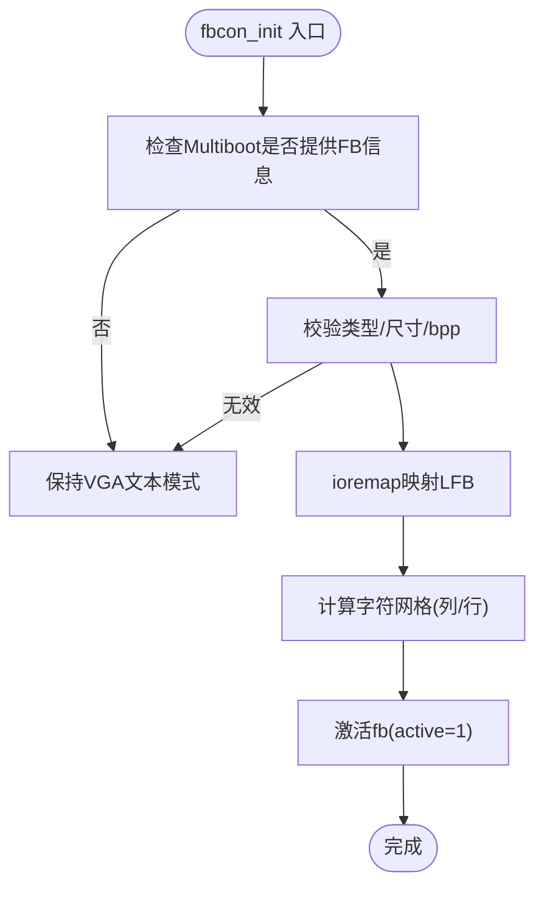
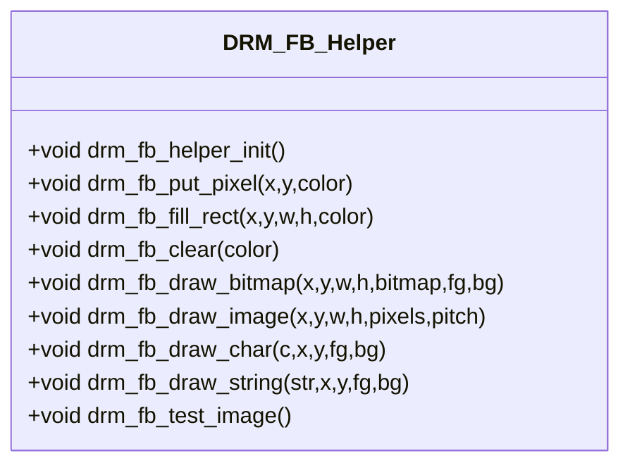
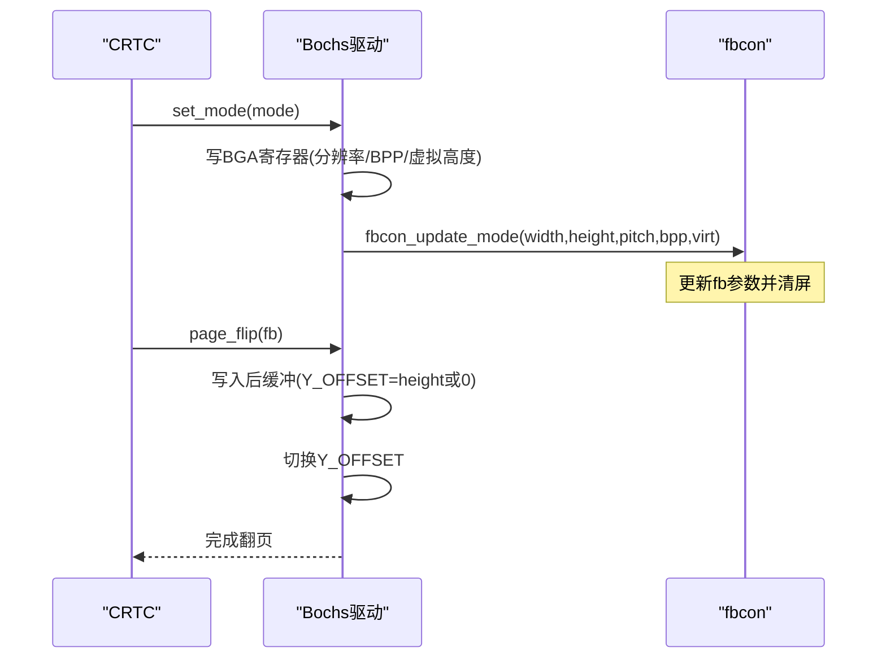
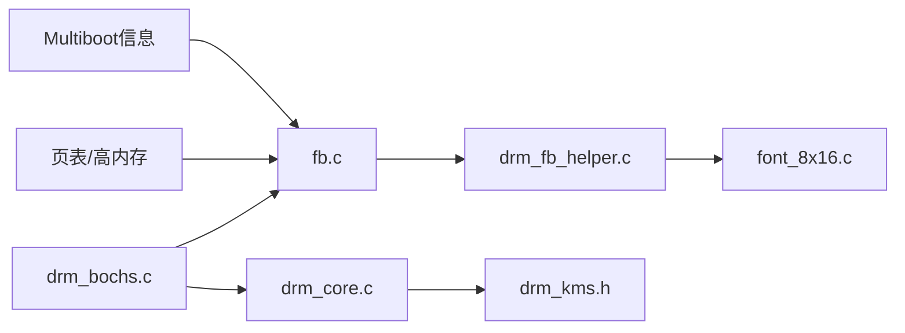

# 帧缓冲辅助工具

<cite>
**本文引用的文件**
- [includes/video/fb.h](file://includes/video/fb.h)
- [kernel/video/fb.c](file://kernel/video/fb.c)
- [kernel/video/font_8x16.c](file://kernel/video/font_8x16.c)
- [includes/drm/drm_fb_helper.h](file://includes/drm/drm_fb_helper.h)
- [kernel/drm/drm_fb_helper.c](file://kernel/drm/drm_fb_helper.c)
- [includes/drm/drm_core.h](file://includes/drm/drm_core.h)
- [kernel/drm/drm_core.c](file://kernel/drm/drm_core.c)
- [includes/drm/drm_kms.h](file://includes/drm/drm_kms.h)
- [kernel/drm/drm_bochs.c](file://kernel/drm/drm_bochs.c)
- [README.md](file://README.md)
</cite>

## 目录
1. [简介](#简介)
2. [项目结构](#项目结构)
3. [核心组件](#核心组件)
4. [架构总览](#架构总览)
5. [详细组件分析](#详细组件分析)
6. [依赖关系分析](#依赖关系分析)
7. [性能与优化建议](#性能与优化建议)
8. [故障排查指南](#故障排查指南)
9. [结论](#结论)
10. [附录：API参考](#附录api参考)

## 简介
本文件为 LulaOS 的“帧缓冲辅助工具”提供系统化文档。内容涵盖：
- 帧缓冲的概念及其在图形系统中的关键作用
- 帧缓冲的创建、初始化与配置流程
- 像素格式支持与颜色空间（XRGB8888）说明
- 内存管理与访问接口（控制台与图形 API）
- 与 DRM/KMS 系统的集成方式（Bochs/QEMU VBE 驱动）
- 面向图形应用开发者的最佳实践与性能优化建议

## 项目结构
LulaOS 将帧缓冲相关能力分为三层：
- 底层视频层：负责从 Multiboot 获取 LFB，建立 ioremap 映射，实现 fbcon 控制台输出与模式切换同步
- 图形辅助层：基于 fb.virt_addr 提供像素级绘制 API（点、矩形、位图、图像、字符/字符串）
- DRM/KMS 层：封装设备、CRTC、Plane、Connector、Framebuffer 等对象，提供 ioctl 与 Page Flip 能力；Bochs 驱动通过 BGA 寄存器设置分辨率并更新 fb 参数

图表来源
- [kernel/video/fb.c:1-320](file://kernel/video/fb.c#L1-L320)
- [kernel/drm/drm_fb_helper.c:1-610](file://kernel/drm/drm_fb_helper.c#L1-L610)
- [kernel/drm/drm_bochs.c:1-591](file://kernel/drm/drm_bochs.c#L1-L591)
- [kernel/drm/drm_core.c:1-375](file://kernel/drm/drm_core.c#L1-L375)
- [includes/drm/drm_kms.h:1-318](file://includes/drm/drm_kms.h#L1-L318)

章节来源
- [README.md:1-84](file://README.md#L1-L84)

## 核心组件
- 帧缓冲信息与控制台：定义 fb_info 结构体，维护物理地址、虚拟地址、分辨率、pitch、bpp、颜色通道布局等；提供 fbcon_init、fbcon_put_char/string、fbcon_clear、fbcon_scroll_up、fbcon_update_mode 等接口
- 图形辅助 API：drm_fb_helper 模块缓存 fb 参数并提供 drm_fb_put_pixel、drm_fb_fill_rect、drm_fb_clear、drm_fb_draw_bitmap、drm_fb_draw_image、drm_fb_draw_char/string、drm_fb_test_image 等
- DRM/KMS：drm_core 管理驱动注册与 ioctl 分发；drm_kms 定义 CRTC/Plane/Connector/Encoder/Framebuffer/Mode；bochs 驱动通过 BGA 寄存器设置分辨率、双缓冲翻页，并通过 fbcon_update_mode 同步 fb 参数

章节来源
- [includes/video/fb.h:1-49](file://includes/video/fb.h#L1-L49)
- [kernel/video/fb.c:1-320](file://kernel/video/fb.c#L1-L320)
- [includes/drm/drm_fb_helper.h:1-126](file://includes/drm/drm_fb_helper.h#L1-L126)
- [kernel/drm/drm_fb_helper.c:1-610](file://kernel/drm/drm_fb_helper.c#L1-L610)
- [includes/drm/drm_core.h:1-155](file://includes/drm/drm_core.h#L1-L155)
- [kernel/drm/drm_core.c:1-375](file://kernel/drm/drm_core.c#L1-L375)
- [includes/drm/drm_kms.h:1-318](file://includes/drm/drm_kms.h#L1-L318)
- [kernel/drm/drm_bochs.c:1-591](file://kernel/drm/drm_bochs.c#L1-L591)

## 架构总览
下图展示从内核启动到图形输出的整体链路：DRM 核心初始化 → Bochs 驱动加载 → 设置分辨率并更新 fb → 图形辅助层缓存参数 → 测试图案绘制

图表来源
- [kernel/drm/drm_core.c:258-311](file://kernel/drm/drm_core.c#L258-L311)
- [kernel/drm/drm_bochs.c:456-459](file://kernel/drm/drm_bochs.c#L456-L459)
- [kernel/drm/drm_bochs.c:176-214](file://kernel/drm/drm_bochs.c#L176-L214)
- [kernel/video/fb.c:222-251](file://kernel/video/fb.c#L222-L251)
- [kernel/drm/drm_fb_helper.c:44-60](file://kernel/drm/drm_fb_helper.c#L44-L60)
- [kernel/drm/drm_fb_helper.c:430-609](file://kernel/drm/drm_fb_helper.c#L430-L609)

## 详细组件分析

### 帧缓冲控制台（fbcon）
- 功能要点
  - 从 Multiboot 获取 LFB 信息（类型、分辨率、pitch、bpp、颜色通道布局）
  - 使用自定义 ioremap 将物理显存映射到 vmalloc 区域（FB_IOREMAP_BASE 起始）
  - 提供字符渲染（8x16 字体）、滚动、清屏、换行/制表符处理
  - 当分辨率变化时，通过 fbcon_update_mode 同步 fb 参数并切换到完整 VRAM 映射，避免越界与花屏
- 关键数据结构
  - fb_info：包含 phys_addr、virt_addr、width、height、pitch、bpp、type、颜色通道位置/大小、active 标志
- 关键流程
  - fbcon_init：校验 Multiboot 信息 → 读取 fb 参数 → ioremap → 计算字符网格 → 激活
  - fbcon_update_mode：接收新分辨率与 DRMs 提供的完整 VRAM 虚拟地址，更新 fb 并清屏
  - fb_ioremap：逐页建立页表映射，标记为不可缓存，刷新 TLB

图表来源
- [kernel/video/fb.c:255-319](file://kernel/video/fb.c#L255-L319)
- [kernel/video/fb.c:42-74](file://kernel/video/fb.c#L42-L74)
- [kernel/video/fb.c:222-251](file://kernel/video/fb.c#L222-L251)

章节来源
- [includes/video/fb.h:11-49](file://includes/video/fb.h#L11-L49)
- [kernel/video/fb.c:1-320](file://kernel/video/fb.c#L1-L320)
- [kernel/video/font_8x16.c:1-104](file://kernel/video/font_8x16.c#L1-L104)

### 图形辅助 API（drm_fb_helper）
- 功能要点
  - 在 DRM 驱动初始化后缓存 fb 参数，直接操作 VRAM 虚拟地址
  - 提供像素级绘制：画点、填充矩形、清屏、绘制单色位图、绘制真彩图片、字符/字符串
  - 内置综合测试函数 drm_fb_test_image，用于验证显示服务
- 像素格式与颜色
  - 默认使用 XRGB8888（32bpp），颜色值格式为 0x00RRGGBB
  - 位图绘制按每字节描述 8 个水平像素（高位在左），bit=1 前景色，bit=0 背景色
- 边界与裁剪
  - 所有绘制函数均进行越界检查与裁剪，确保不写入屏幕外区域

图表来源
- [includes/drm/drm_fb_helper.h:20-123](file://includes/drm/drm_fb_helper.h#L20-L123)
- [kernel/drm/drm_fb_helper.c:44-60](file://kernel/drm/drm_fb_helper.c#L44-L60)
- [kernel/drm/drm_fb_helper.c:72-129](file://kernel/drm/drm_fb_helper.c#L72-L129)
- [kernel/drm/drm_fb_helper.c:145-210](file://kernel/drm/drm_fb_helper.c#L145-L210)
- [kernel/drm/drm_fb_helper.c:220-245](file://kernel/drm/drm_fb_helper.c#L220-L245)
- [kernel/drm/drm_fb_helper.c:430-609](file://kernel/drm/drm_fb_helper.c#L430-L609)

章节来源
- [includes/drm/drm_fb_helper.h:1-126](file://includes/drm/drm_fb_helper.h#L1-L126)
- [kernel/drm/drm_fb_helper.c:1-610](file://kernel/drm/drm_fb_helper.c#L1-L610)

### DRM/KMS 集成（Bochs 驱动）
- 功能要点
  - 通过 BGA 寄存器设置分辨率、BPP、虚拟高度（双缓冲）
  - 动态探测支持的分辨率列表（基于 VRAM 大小与双缓冲需求）
  - 创建 CRTC/Plane/Connector/Encoder，并绑定到 fbcon_update_mode 更新的 fb 参数
  - 支持 Page Flip：将新帧写入后缓冲，切换 Y_OFFSET 实现无撕裂翻页
- 关键流程
  - bochs_set_resolution：禁用显示 → 设置分辨率/BPP → 设置虚拟尺寸 → 启用显示 → 调用 fbcon_update_mode
  - bochs_crtc_page_flip：确定后缓冲偏移 → 拷贝新帧 → 切换 Y_OFFSET → 更新 CRTC.fb

图表来源
- [kernel/drm/drm_bochs.c:176-214](file://kernel/drm/drm_bochs.c#L176-L214)
- [kernel/drm/drm_bochs.c:271-305](file://kernel/drm/drm_bochs.c#L271-L305)
- [kernel/video/fb.c:222-251](file://kernel/video/fb.c#L222-L251)

章节来源
- [kernel/drm/drm_bochs.c:1-591](file://kernel/drm/drm_bochs.c#L1-L591)
- [includes/drm/drm_kms.h:29-90](file://includes/drm/drm_kms.h#L29-L90)
- [includes/drm/drm_kms.h:113-164](file://includes/drm/drm_kms.h#L113-L164)
- [includes/drm/drm_kms.h:224-261](file://includes/drm/drm_kms.h#L224-L261)

### 像素格式与颜色空间
- 当前实现以 XRGB8888 为主（32bpp，无 alpha），颜色值为 0x00RRGGBB
- fb_info 中保留 red/green/blue 的位置与掩码大小字段，便于未来扩展其他格式
- 图形辅助 API 统一以 XRGB8888 作为输入格式，简化实现与测试

章节来源
- [includes/drm/drm_kms.h:29-33](file://includes/drm/drm_kms.h#L29-L33)
- [includes/video/fb.h:11-23](file://includes/video/fb.h#L11-L23)
- [kernel/drm/drm_fb_helper.c:72-81](file://kernel/drm/drm_fb_helper.c#L72-L81)

## 依赖关系分析
- 视频层依赖 Multiboot 信息、页表与高内存映射能力
- 图形辅助层依赖 fb_info 全局状态与字体数据
- DRM/KMS 层依赖 PCI/IO 端口访问、页表映射、以及 fbcon_update_mode 同步机制
- 各层通过明确的接口耦合：drm_bochs 调用 fbcon_update_mode；drm_fb_helper 读取 fb 参数

图表来源
- [kernel/video/fb.c:1-320](file://kernel/video/fb.c#L1-L320)
- [kernel/drm/drm_fb_helper.c:1-610](file://kernel/drm/drm_fb_helper.c#L1-L610)
- [kernel/drm/drm_bochs.c:1-591](file://kernel/drm/drm_bochs.c#L1-L591)
- [kernel/drm/drm_core.c:1-375](file://kernel/drm/drm_core.c#L1-L375)
- [includes/drm/drm_kms.h:1-318](file://includes/drm/drm_kms.h#L1-L318)

章节来源
- [kernel/video/fb.c:1-320](file://kernel/video/fb.c#L1-L320)
- [kernel/drm/drm_fb_helper.c:1-610](file://kernel/drm/drm_fb_helper.c#L1-L610)
- [kernel/drm/drm_bochs.c:1-591](file://kernel/drm/drm_bochs.c#L1-L591)
- [kernel/drm/drm_core.c:1-375](file://kernel/drm/drm_core.c#L1-L375)
- [includes/drm/drm_kms.h:1-318](file://includes/drm/drm_kms.h#L1-L318)

## 性能与优化建议
- 批量写入优先
  - 使用 drm_fb_fill_rect 替代逐点绘制，减少循环开销
  - 使用 drm_fb_draw_image 进行整块像素拷贝，必要时可替换为 memcpy 优化
- 裁剪与边界检查
  - 所有绘制函数已做裁剪，避免越界导致的额外分支与错误
- 双缓冲与翻页
  - 利用 Page Flip 切换 Y_OFFSET，避免撕裂；在后缓冲绘制完成后一次性切换
- 字体渲染
  - 使用 drm_fb_draw_bitmap 渲染 8x16 字体，避免重复解码逻辑
- 内存映射
  - 使用 fbcon_update_mode 切换到完整 VRAM 映射，避免 GRUB 小映射导致的 Page Fault
- 色彩与格式
  - 保持 XRGB8888 一致性，减少转换开销；如需扩展其他格式，应在 fb_info 与辅助层统一处理

[本节为通用指导，不直接分析具体文件]

## 故障排查指南
- 无帧缓冲信息
  - 现象：fb.active=0，回退 VGA 文本模式
  - 排查：确认 Multiboot 提供 framebuffer 信息且类型为 RGB
  - 参考路径：[kernel/video/fb.c:255-272](file://kernel/video/fb.c#L255-L272)
- 参数无效
  - 现象：phys_addr=0 或 width/height=0 或 bpp!=32
  - 排查：检查 Multiboot 传递的参数是否正确
  - 参考路径：[kernel/video/fb.c:289-295](file://kernel/video/fb.c#L289-L295)
- ioremap 失败
  - 现象：无法映射 LFB，保持 VGA
  - 排查：检查页表分配与 PTE 设置，确认 TLB 刷新
  - 参考路径：[kernel/video/fb.c:42-74](file://kernel/video/fb.c#L42-L74)
- 分辨率变化后花屏
  - 现象：pitch 不一致导致像素错位
  - 排查：确保调用 fbcon_update_mode 更新 fb 参数并清屏
  - 参考路径：[kernel/video/fb.c:222-251](file://kernel/video/fb.c#L222-L251)
- 图形 API 未初始化
  - 现象：drm_fb_helper 跳过绘制
  - 排查：确认 fb.active 为真且已调用 drm_fb_helper_init
  - 参考路径：[kernel/drm/drm_fb_helper.c:44-60](file://kernel/drm/drm_fb_helper.c#L44-L60)
- Bochs 驱动加载失败
  - 现象：未找到 VRAM 或 ioremap 失败
  - 排查：检查 PCI BAR 或固定地址，确认 ioremap 成功
  - 参考路径：[kernel/drm/drm_bochs.c:404-441](file://kernel/drm/drm_bochs.c#L404-L441)

章节来源
- [kernel/video/fb.c:255-319](file://kernel/video/fb.c#L255-L319)
- [kernel/drm/drm_fb_helper.c:44-60](file://kernel/drm/drm_fb_helper.c#L44-L60)
- [kernel/drm/drm_bochs.c:404-441](file://kernel/drm/drm_bochs.c#L404-L441)

## 结论
LulaOS 的帧缓冲辅助工具通过清晰的层次划分实现了从底层视频控制到上层图形绘制的完整链路：
- fbcon 提供稳定的控制台输出与模式同步
- drm_fb_helper 提供直观的像素级绘制 API，便于快速构建图形界面
- DRM/KMS 与 Bochs 驱动结合，实现分辨率设置、双缓冲翻页与资源管理
该设计兼顾了易用性与可扩展性，适合在模拟器环境中进行图形系统开发与调试。

[本节为总结，不直接分析具体文件]

## 附录：API参考

### 帧缓冲控制台接口（fbcon）
- fbcon_init：初始化帧缓冲控制台，从 Multiboot 获取 LFB 并映射
- fbcon_put_char / fbcon_put_string：输出字符/字符串，支持换行、制表符、滚动
- fbcon_clear：清屏
- fbcon_scroll_up：上滚一行
- fbcon_update_mode：分辨率变化时同步 fb 参数并切换至完整 VRAM 映射
- fb_ioremap：将物理地址映射到 vmalloc 区域

章节来源
- [includes/video/fb.h:27-42](file://includes/video/fb.h#L27-L42)
- [kernel/video/fb.c:118-202](file://kernel/video/fb.c#L118-L202)
- [kernel/video/fb.c:222-251](file://kernel/video/fb.c#L222-L251)
- [kernel/video/fb.c:42-74](file://kernel/video/fb.c#L42-L74)

### 图形辅助 API（drm_fb_helper）
- drm_fb_helper_init：初始化图形 API，缓存 fb 参数
- drm_fb_put_pixel：画一个像素（XRGB8888）
- drm_fb_fill_rect：填充矩形区域
- drm_fb_clear：清屏
- drm_fb_draw_bitmap：绘制单色位图（1bpp→32bpp）
- drm_fb_draw_image：绘制真彩图片（XRGB8888）
- drm_fb_draw_char / drm_fb_draw_string：绘制字符/字符串
- drm_fb_test_image：绘制综合测试图案

章节来源
- [includes/drm/drm_fb_helper.h:20-123](file://includes/drm/drm_fb_helper.h#L20-L123)
- [kernel/drm/drm_fb_helper.c:44-60](file://kernel/drm/drm_fb_helper.c#L44-L60)
- [kernel/drm/drm_fb_helper.c:72-245](file://kernel/drm/drm_fb_helper.c#L72-L245)
- [kernel/drm/drm_fb_helper.c:430-609](file://kernel/drm/drm_fb_helper.c#L430-L609)

### DRM/KMS 公共接口（drm_core/drm_kms）
- drm_core_init：初始化 DRM 核心
- drm_register_driver / drm_unregister_driver：注册/注销驱动
- drm_ioctl：ioctl 分发入口
- drm_mode_config_init / drm_mode_config_cleanup：KMS 配置初始化/清理
- drm_crtc_init / drm_plane_init / drm_connector_init / drm_encoder_init：注册 KMS 对象
- drm_framebuffer_init / drm_framebuffer_cleanup：创建/销毁 Framebuffer
- drm_mode_setcrtc / drm_mode_page_flip：设置 CRTC 模式与翻页
- drm_mode_make_default：生成默认显示模式

章节来源
- [includes/drm/drm_core.h:98-145](file://includes/drm/drm_core.h#L98-L145)
- [kernel/drm/drm_core.c:258-311](file://kernel/drm/drm_core.c#L258-L311)
- [includes/drm/drm_kms.h:265-315](file://includes/drm/drm_kms.h#L265-L315)