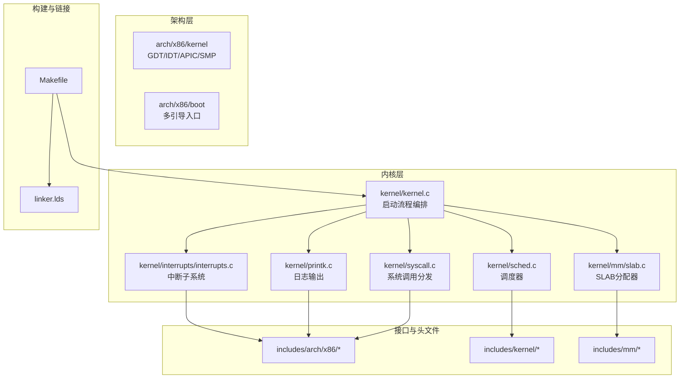
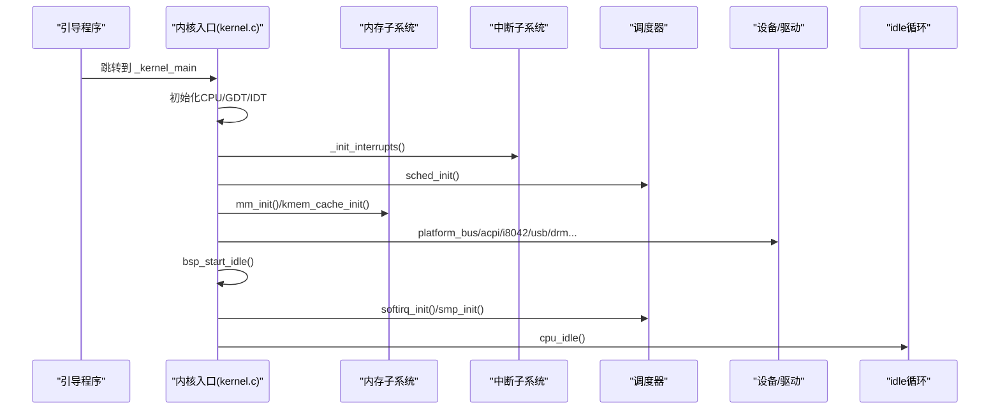
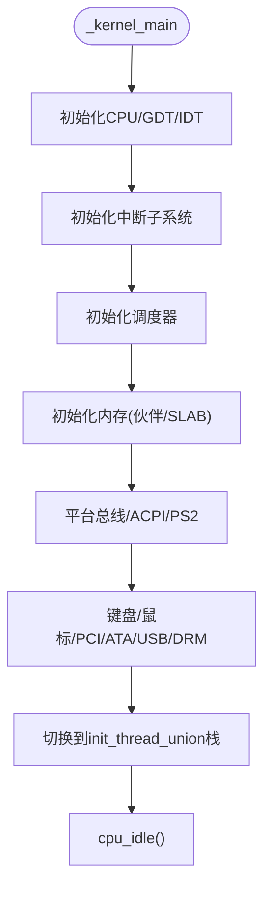
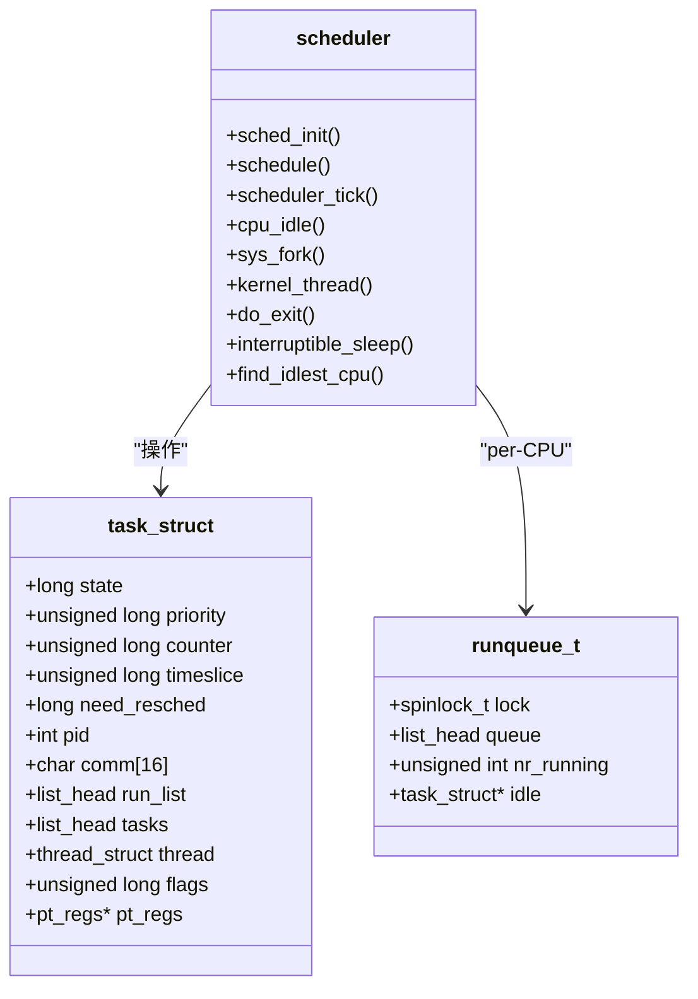
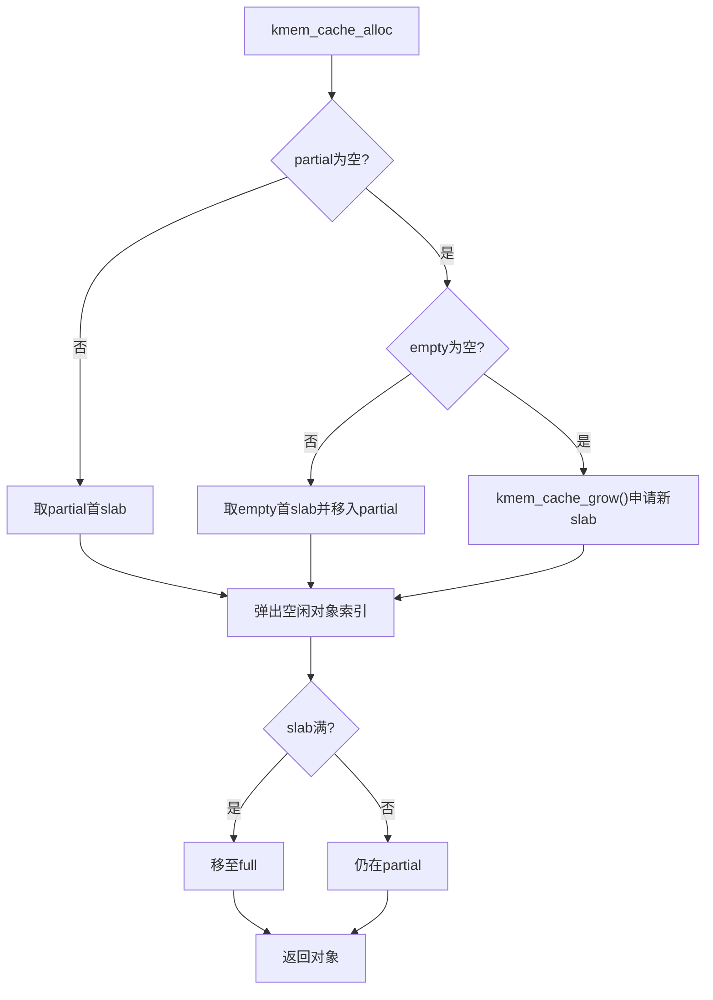
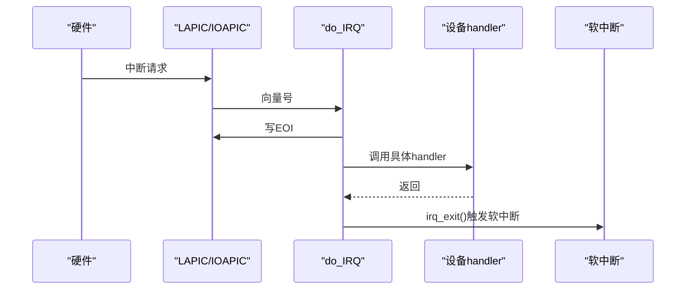
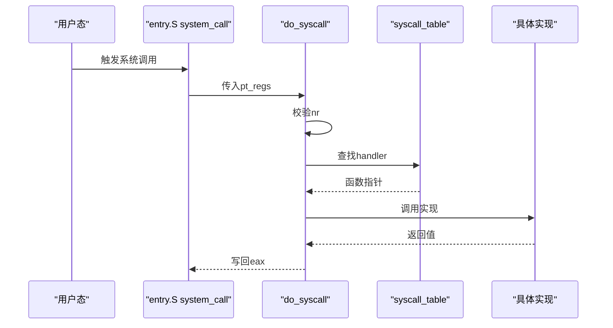
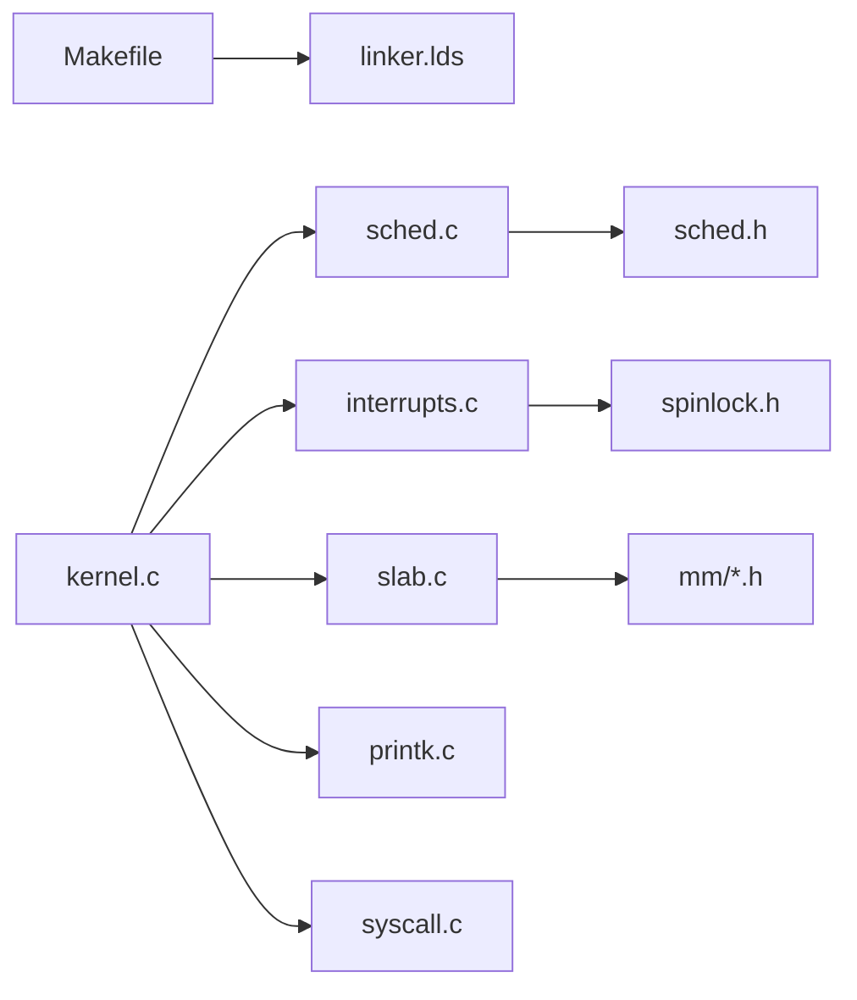

# 代码规范与最佳实践

<cite>
**本文引用的文件**
- [README.md](file://README.md)
- [Makefile](file://Makefile)
- [linker.lds](file://linker.lds)
- [kernel.c](file://kernel/kernel.c)
- [printk.c](file://kernel/printk.c)
- [sched.c](file://kernel/sched.c)
- [syscall.c](file://kernel/syscall.c)
- [setup.c](file://arch/x86/kernel/setup.c)
- [slab.c](file://kernel/mm/slab.c)
- [interrupts.c](file://kernel/interrupts/interrupts.c)
- [spinlock.h](file://includes/arch/x86/spinlock.h)
- [sched.h](file://includes/kernel/sched.h)
- [gdt.c](file://arch/x86/kernel/gdt.c)
</cite>

## 目录
1. [简介](#简介)
2. [项目结构](#项目结构)
3. [核心组件](#核心组件)
4. [架构总览](#架构总览)
5. [详细组件分析](#详细组件分析)
6. [依赖关系分析](#依赖关系分析)
7. [性能考虑](#性能考虑)
8. [故障排查指南](#故障排查指南)
9. [结论](#结论)
10. [附录](#附录)

## 简介
本指南面向 LulaOS 内核开发，提供统一的编码风格、命名约定、注释格式与文件组织规范；总结内核编程最佳实践（错误处理、内存管理、并发控制）；给出代码审查清单与质量检查标准；文档化安全编程要点（缓冲区溢出防护、权限检查）；并提供性能优化建议、调试技巧以及重构与版本管理指导。目标是让不同背景的开发者在一致规范下高效协作，保障内核稳定性与可维护性。

## 项目结构
LulaOS 采用分层与按功能模块组织的混合方式：
- arch/x86：架构相关实现（GDT/IDT、APIC、SMP、页表等）
- kernel：核心子系统（调度、中断、MM、TTY、USB、DRM 等）
- includes：公共头文件，按 arch/device/mm/libs 等维度组织
- libs：通用库（如 vsprintf）
- config、docs、工具脚本与构建配置（Makefile、linker.lds）

图表来源
- [Makefile:1-138](file://Makefile#L1-L138)
- [linker.lds:1-103](file://linker.lds#L1-L103)
- [kernel.c:27-141](file://kernel/kernel.c#L27-L141)

章节来源
- [Makefile:1-138](file://Makefile#L1-L138)
- [linker.lds:1-103](file://linker.lds#L1-L103)
- [kernel.c:27-141](file://kernel/kernel.c#L27-L141)

## 核心组件
- 启动与初始化：内核入口负责 GDT/IDT、中断、调度、内存、设备总线与驱动的有序初始化，最终切换到 idle 循环。
- 调度器：基于静态优先级+时间片轮转，支持 SMP 运行队列与负载均衡。
- 内存管理：bootmem → 伙伴系统 → SLAB 缓存；kmalloc/kfree 提供常用对象分配。
- 中断子系统：IRQ 描述符表、IOAPIC/LAPIC 管理、定时器 tick 驱动调度。
- 系统调用：注册表 + 分发器，内置 write/exit/getpid。
- 日志与 I/O：SMP 安全的 printk，通过 TTY/FB 输出。

章节来源
- [kernel.c:27-141](file://kernel/kernel.c#L27-L141)
- [sched.c:76-259](file://kernel/sched.c#L76-L259)
- [slab.c:249-585](file://kernel/mm/slab.c#L249-L585)
- [interrupts.c:18-145](file://kernel/interrupts/interrupts.c#L18-L145)
- [syscall.c:56-99](file://kernel/syscall.c#L56-L99)
- [printk.c:21-36](file://kernel/printk.c#L21-L36)

## 架构总览
下图展示从内核启动到进入 idle 的关键路径，以及各子系统间的调用顺序。

图表来源
- [kernel.c:27-141](file://kernel/kernel.c#L27-L141)
- [interrupts.c:18-27](file://kernel/interrupts/interrupts.c#L18-L27)
- [sched.c:76-97](file://kernel/sched.c#L76-L97)
- [slab.c:249-296](file://kernel/mm/slab.c#L249-L296)

## 详细组件分析

### 启动与初始化流程（kernel.c）
- 职责：按序初始化 CPU、架构、中断、调度、内存、平台总线、ACPI、PS/2、键盘/鼠标、PCI、ATA、USB、DRM 等，最后切换栈并进入 idle。
- 关键约束：
  - 必须在内存子系统就绪后初始化需要 kmalloc 的组件（如 PCI）。
  - 图形显示初始化后设置 vmalloc 起始地址以避免冲突。
  - 最终通过内联汇编切换至 init_thread_union 栈并进入 idle。

图表来源
- [kernel.c:73-141](file://kernel/kernel.c#L73-L141)

章节来源
- [kernel.c:73-141](file://kernel/kernel.c#L73-L141)

### 调度器（sched.c / sched.h）
- 设计要点：
  - 每个 CPU 一个 runqueue，使用自旋锁保护。
  - 任务创建时分配 8KB 对齐的 thread_union，current 宏通过 esp 屏蔽低 13 位定位。
  - 时间片由 APIC Timer tick 递减，耗尽置 need_resched，schedule() 选择 counter 最大者。
  - 支持负载均衡：fork/kernel_thread 可选择最空闲 CPU。
- 并发与同步：
  - schedule() 中 local_irq_save + rq->lock，避免中断重入导致死锁。
  - add_task_to_cpu 直接写目标 CPU idle->need_resched 唤醒 idle。

图表来源
- [sched.h:45-201](file://includes/kernel/sched.h#L45-L201)
- [sched.c:76-259](file://kernel/sched.c#L76-L259)

章节来源
- [sched.c:76-259](file://kernel/sched.c#L76-L259)
- [sched.h:45-201](file://includes/kernel/sched.h#L45-L201)

### 内存管理与 SLAB（slab.c）
- 设计要点：
  - 预分配静态缓存描述符池，避免“鸡生蛋”。
  - 支持 ON_SLAB 与 OFF_SLAB 两种模式，大对象启用 OFF_SLAB 提升空间利用率。
  - 空闲对象以嵌入式链表管理，partial/full/empty 三链表维护 slab 状态。
  - kmalloc/kfree 基于固定尺寸缓存表快速分配/释放。
- 并发与一致性：
  - 全局 slab_lock 保护链表操作，alloc/free 均使用 spin_lock_irqsave。
  - grow 路径在 unlock→lock 窗口后重试，防止竞态。

图表来源
- [slab.c:386-450](file://kernel/mm/slab.c#L386-L450)

章节来源
- [slab.c:249-585](file://kernel/mm/slab.c#L249-L585)

### 中断子系统（interrupts.c）
- 设计要点：
  - irq_desc 数组维护向量到 handler 的映射。
  - request_irq/free_irq 负责注册/注销与 IOAPIC 使能/屏蔽。
  - do_IRQ 统一入口，发送 EOI 后调用具体 handler，irq_exit 触发软中断。
  - APIC Timer 中断驱动调度器 tick。
- 并发与正确性：
  - 先 EOI 再执行耗时逻辑，避免阻塞同级/低优先级中断。
  - free_irq 先屏蔽再清 handler，避免悬空中断。

图表来源
- [interrupts.c:84-145](file://kernel/interrupts/interrupts.c#L84-L145)

章节来源
- [interrupts.c:18-145](file://kernel/interrupts/interrupts.c#L18-L145)

### 系统调用（syscall.c）
- 设计要点：
  - syscall_table 注册内置调用（write/exit/getpid）。
  - do_syscall 校验编号并分发参数。
- 安全与健壮性：
  - 非法编号返回 -ENOSYS。
  - sys_write 对 buf/count 做基本校验。

图表来源
- [syscall.c:56-99](file://kernel/syscall.c#L56-L99)

章节来源
- [syscall.c:56-99](file://kernel/syscall.c#L56-L99)

### 打印与并发安全（printk.c）
- 设计要点：
  - 使用自旋锁 + 关中断保护格式化与输出，避免 SMP 与中断重入破坏缓冲。
  - 输出经 TTY/FB 通道。
- 并发模型：
  - spin_lock_irqsave/restore 保证临界区原子性与不可抢占。

章节来源
- [printk.c:21-36](file://kernel/printk.c#L21-L36)
- [spinlock.h:137-138](file://includes/arch/x86/spinlock.h#L137-L138)

### 架构初始化（GDT/Setup）
- GDT：定义内核/用户态代码段与数据段，限制访问级别。
- Setup：复制 multiboot 信息、计算物理内存范围、建立 bootmem 与页表、初始化帧缓冲控制台与 ACPI。

章节来源
- [gdt.c:13-22](file://arch/x86/kernel/gdt.c#L13-L22)
- [setup.c:201-214](file://arch/x86/kernel/setup.c#L201-L214)

## 依赖关系分析
- 启动链：kernel.c 依赖 arch/x86 的 GDT/IDT、中断、SMP；依赖 kernel 子系统的 sched/interrupts/mm/tty/usb/drm。
- 构建链：Makefile 收集所有 .c/.S 编译为 obj，链接到 linker.lds 指定的布局，生成 ISO/IMG。
- 运行时依赖：调度依赖 APIC Timer；内存依赖伙伴系统与 SLAB；I/O 依赖 TTY/FB。

图表来源
- [Makefile:1-138](file://Makefile#L1-L138)
- [linker.lds:1-103](file://linker.lds#L1-L103)
- [kernel.c:27-141](file://kernel/kernel.c#L27-L141)
- [sched.c:76-259](file://kernel/sched.c#L76-L259)
- [interrupts.c:18-145](file://kernel/interrupts/interrupts.c#L18-L145)
- [slab.c:249-585](file://kernel/mm/slab.c#L249-L585)
- [printk.c:21-36](file://kernel/printk.c#L21-L36)
- [syscall.c:56-99](file://kernel/syscall.c#L56-L99)

章节来源
- [Makefile:1-138](file://Makefile#L1-L138)
- [linker.lds:1-103](file://linker.lds#L1-L103)

## 性能考虑
- 调度
  - 优先在当前 CPU 加入运行队列以减少迁移开销；必要时使用 KT_BALANCE。
  - idle 循环使用 safe_halt 降低功耗。
- 内存
  - 尽量复用 SLAB 缓存，避免频繁增长；合理选择对象大小以匹配缓存粒度。
  - 避免在高频路径进行 kmalloc，必要时使用 per-CPU 缓存或预分配。
- 中断
  - 保持 ISR 短小，耗时工作下沉到软中断或线程。
  - 及时发送 EOI，避免阻塞后续中断。
- I/O
  - 批量写入减少 printk 次数；FB 模式下优先使用帧缓冲绘制。
- 构建与链接
  - 使用合适的优化等级与符号保留策略便于调试；利用 Makefile 的 all-debug 目标生成反汇编。

[本节为通用性能建议，不直接分析特定文件]

## 故障排查指南
- 常见问题定位
  - 无法调度：检查 APIC Timer 是否注册、scheduler_tick 是否被调用、need_resched 是否正确置位。
  - 内存泄漏/崩溃：确认 kmalloc/kfree 成对出现，避免重复释放；检查 SLAB 的 partial/full/empty 链表状态。
  - 中断风暴：确认 request_irq/free_irq 配对，避免未屏蔽导致重复触发。
  - 打印乱码：确认 printk 的 spinlock 未被提前释放；检查 TTY/FB 初始化顺序。
- 调试手段
  - 使用 Makefile 的 debug-qemu/debug-bochs 目标，结合 GDB 与 QEMU monitor。
  - 开启 all-debug 生成 kdump.txt 辅助定位。
  - 在关键路径添加 printk 输出，注意关闭中断上下文中的长耗时操作。

章节来源
- [Makefile:88-112](file://Makefile#L88-L112)
- [interrupts.c:116-145](file://kernel/interrupts/interrupts.c#L116-L145)
- [slab.c:386-585](file://kernel/mm/slab.c#L386-L585)
- [printk.c:21-36](file://kernel/printk.c#L21-L36)

## 结论
LulaOS 的内核子系统遵循清晰的初始化顺序与模块化设计，调度、内存、中断与 I/O 之间职责明确。通过统一的自旋锁与中断保护、合理的内存分配策略与轻量化的 ISR，系统在 SMP 环境下具备良好可扩展性。遵循本文档的编码规范与安全实践，将显著提升代码质量与可维护性。

[本节为总结性内容，不直接分析特定文件]

## 附录

### 编码规范与命名约定
- 文件组织
  - 架构相关代码置于 arch/x86，通用内核逻辑置于 kernel，头文件按功能域放置于 includes。
  - 每个子系统包含独立的 .c/.h，避免跨模块强耦合。
- 命名约定
  - 函数：动词+名词，如 sched_init、kmem_cache_alloc。
  - 类型：下划线分隔，如 task_struct、runqueue_t。
  - 常量/宏：全大写+下划线，如 THREAD_SIZE、TASK_RUNNING。
  - 私有变量：前缀下划线或 static 限定作用域。
- 注释格式
  - 文件头部说明模块职责与依赖。
  - 函数注释说明参数、返回值、前置条件与并发约束。
  - 复杂算法附流程图或伪代码注释。

### 内核编程最佳实践
- 错误处理
  - 对外 API 返回明确错误码；失败路径记录日志并清理资源。
  - 对 NULL 指针、越界访问、非法参数进行防御性检查。
- 内存管理
  - 严格配对 kmalloc/kfree；避免在持有锁时长时间分配。
  - 合理使用 GFP_KERNEL/GFP_ATOMIC 语义（当前预留扩展点）。
- 并发控制
  - 使用 spin_lock_irqsave/restore 保护临界区；避免嵌套锁与死锁。
  - 在 ISR 中仅做最小化处理，耗时工作移交软中断或内核线程。

### 代码审查清单
- 正确性
  - 是否在所有路径释放资源？是否存在内存泄漏？
  - 是否对所有输入进行边界检查？
  - 是否正确使用自旋锁与中断开关？
- 可读性
  - 命名是否清晰？函数是否单一职责？
  - 是否有必要注释解释复杂逻辑？
- 性能
  - 是否在热点路径避免不必要分配？
  - 是否减少锁竞争与上下文切换？
- 安全性
  - 是否避免缓冲区溢出？是否验证用户态指针与长度？
  - 是否最小化权限暴露？

### 安全编程指南
- 缓冲区溢出防护
  - 使用带长度参数的拷贝函数；禁止无界字符串操作。
  - 对用户态输入进行合法性校验后再复制到内核空间。
- 权限检查
  - 区分内核态/用户态访问路径，必要时进行权限判定。
  - 敏感数据结构加锁保护，避免并发篡改。

### 性能优化建议
- 调度
  - 优先本地 CPU 执行，减少迁移；合理设置时间片。
- 内存
  - 预分配热点对象；合并小对象分配；避免碎片化。
- I/O
  - 批量写入；减少 printk 频率；使用 FB 加速图形输出。
- 构建
  - 使用 all-debug 目标配合 objdump 分析热点路径。

### 调试技巧
- 使用 QEMU/GDB 或 Bochs 进行断点与单步调试。
- 在关键路径添加结构化日志，区分不同子系统前缀。
- 利用 Makefile 生成的 kdump.txt 核对符号与指令流。

### 重构与版本管理
- 重构原则
  - 小步提交，保持每次变更可测试、可回滚。
  - 提取公共逻辑为独立函数/模块，降低耦合。
- 版本管理
  - 使用有意义的 commit message，标注影响范围与原因。
  - 分支策略：feature/bugfix/release 分离，定期合入主干。