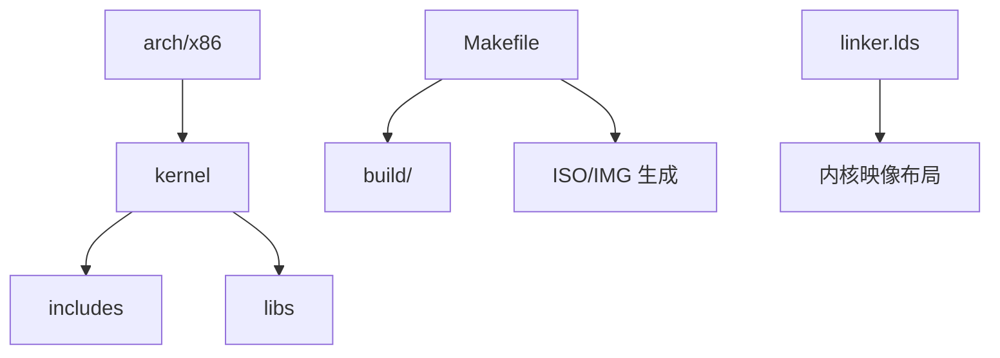
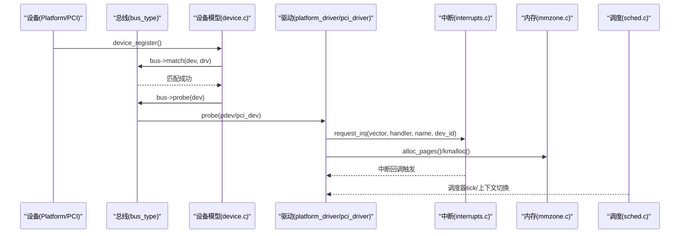
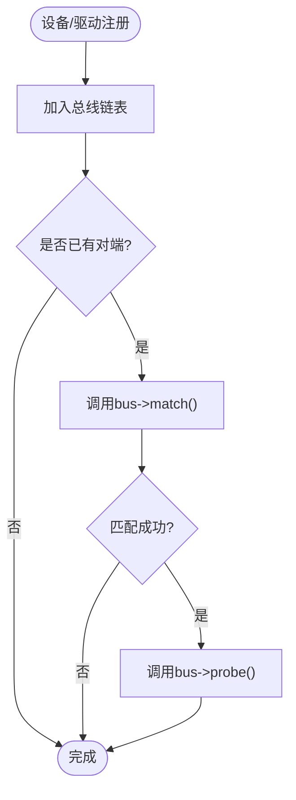
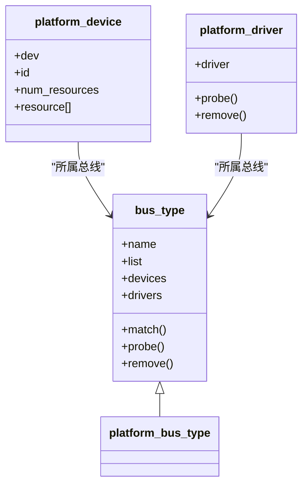
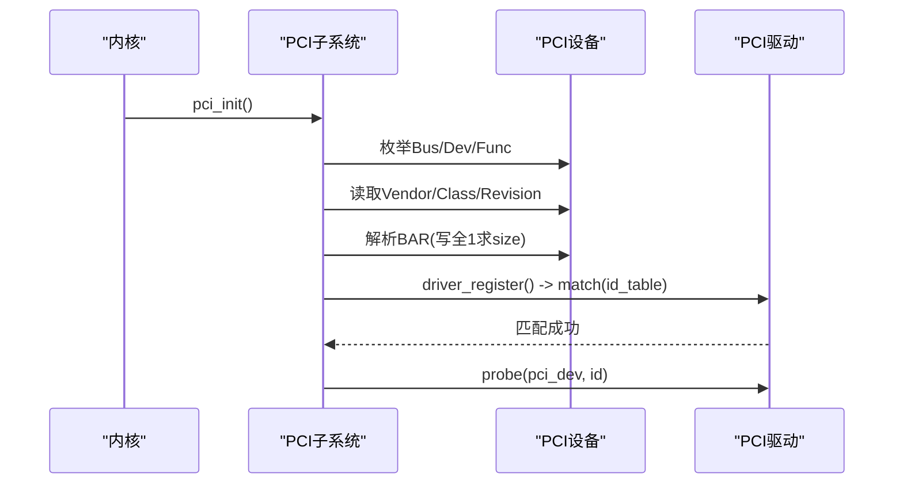
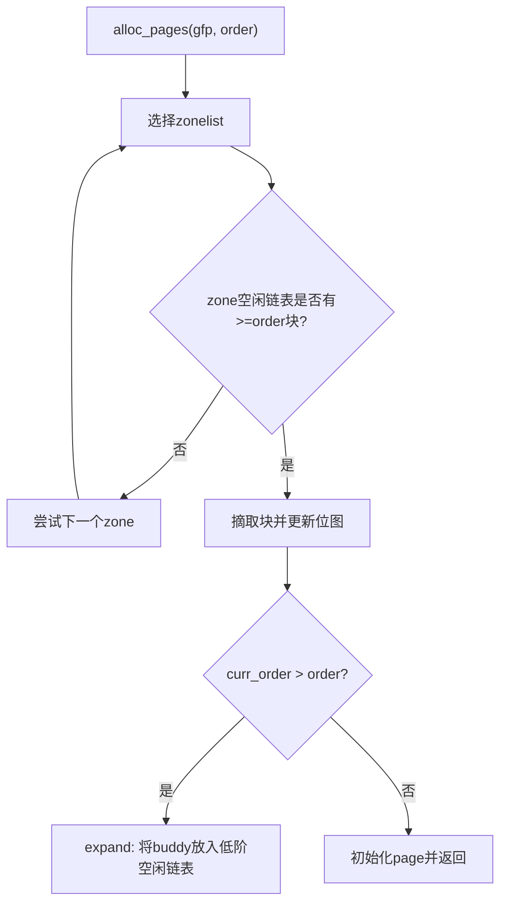
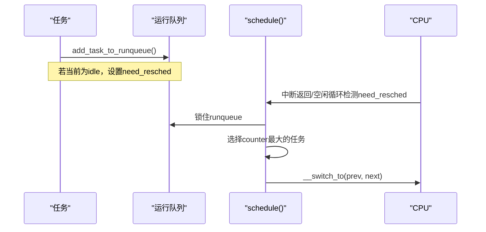
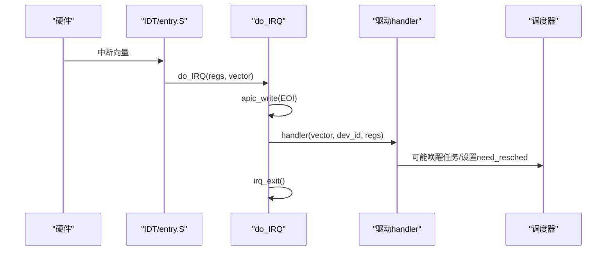
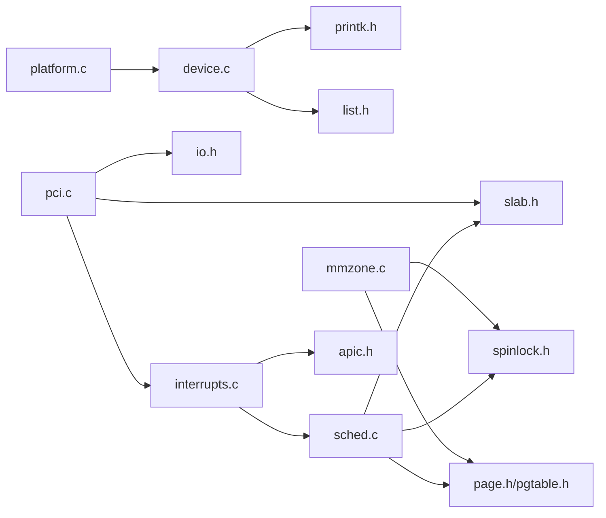

# 开发指南

<cite>
**本文引用的文件**
- [README.md](file://README.md)
- [Makefile](file://Makefile)
- [linker.lds](file://linker.lds)
- [includes/device/device.h](file://includes/device/device.h)
- [kernel/device/device.c](file://kernel/device/device.c)
- [includes/device/platform.h](file://includes/device/platform.h)
- [kernel/device/platform.c](file://kernel/device/platform.c)
- [includes/pci/pci.h](file://includes/pci/pci.h)
- [kernel/pci/pci.c](file://kernel/pci/pci.c)
- [includes/mm/mm.h](file://includes/mm/mm.h)
- [kernel/mm/mmzone.c](file://kernel/mm/mmzone.c)
- [includes/kernel/sched.h](file://includes/kernel/sched.h)
- [kernel/sched.c](file://kernel/sched.c)
- [includes/interrupts/interrupts.h](file://includes/interrupts/interrupts.h)
- [kernel/interrupts/interrupts.c](file://kernel/interrupts/interrupts.c)
</cite>

## 目录
1. [简介](#简介)
2. [项目结构](#项目结构)
3. [核心组件](#核心组件)
4. [架构总览](#架构总览)
5. [详细组件分析](#详细组件分析)
6. [依赖关系分析](#依赖关系分析)
7. [性能考虑](#性能考虑)
8. [故障排查指南](#故障排查指南)
9. [结论](#结论)
10. [附录](#附录)

## 简介
本指南面向LulaOS的贡献者与高级开发者，提供从设备驱动开发、子系统扩展（总线类型、内存分配策略、调度算法）、构建与配置、到代码规范与测试流程的完整说明。文档基于仓库现有实现进行梳理，帮助读者快速上手并安全地扩展系统能力。

## 项目结构
LulaOS采用分层组织：
- arch/x86：体系结构相关代码（启动、中断、页表、SMP等）
- kernel：内核子系统（设备模型、PCI、USB、TTY、视频、内存管理、调度、软中断、系统调用等）
- includes：公共头文件（按子系统划分）
- config：构建配置（当前为空，可通过Makefile变量定制）
- docs：文档（当前为空）
- libs：基础库（如vsprintf）
- 根目录：构建脚本与链接脚本（Makefile、linker.lds、bochs.cfg等）

**章节来源**
- [Makefile:1-138](file://Makefile#L1-L138)
- [linker.lds:1-103](file://linker.lds#L1-L103)

## 核心组件
- 统一设备模型：bus_type/device/device_driver 抽象，支持多总线（platform、pci）
- 平台总线：用于非PCI发现机制的设备（固定地址、板级设备等）
- PCI子系统：枚举、BAR解析、中断信息读取、驱动匹配框架
- 内存管理：伙伴系统、zonelist、页面分配与释放
- 进程调度：优先级+时间片轮转、每CPU运行队列、负载均衡
- 中断系统：IRQ注册/注销、APIC定时器、错误处理、系统调用入口

**章节来源**
- [includes/device/device.h:1-80](file://includes/device/device.h#L1-L80)
- [kernel/device/device.c:1-165](file://kernel/device/device.c#L1-L165)
- [includes/device/platform.h:1-84](file://includes/device/platform.h#L1-L84)
- [kernel/device/platform.c:1-160](file://kernel/device/platform.c#L1-L160)
- [includes/pci/pci.h:1-170](file://includes/pci/pci.h#L1-L170)
- [kernel/pci/pci.c:1-493](file://kernel/pci/pci.c#L1-L493)
- [includes/mm/mm.h:1-98](file://includes/mm/mm.h#L1-L98)
- [kernel/mm/mmzone.c:1-329](file://kernel/mm/mmzone.c#L1-L329)
- [includes/kernel/sched.h:1-201](file://includes/kernel/sched.h#L1-L201)
- [kernel/sched.c:1-479](file://kernel/sched.c#L1-L479)
- [includes/interrupts/interrupts.h:1-78](file://includes/interrupts/interrupts.h#L1-L78)
- [kernel/interrupts/interrupts.c:1-145](file://kernel/interrupts/interrupts.c#L1-L145)

## 架构总览
下图展示了设备驱动在LulaOS中的关键交互路径：设备/驱动通过总线类型进行匹配，匹配成功后进入probe阶段；硬件中断由中断子系统分发至驱动；内存与调度为驱动提供资源与执行环境。

**图表来源**
- [kernel/device/device.c:22-87](file://kernel/device/device.c#L22-L87)
- [kernel/device/platform.c:15-77](file://kernel/device/platform.c#L15-L77)
- [kernel/pci/pci.c:28-241](file://kernel/pci/pci.c#L28-L241)
- [kernel/interrupts/interrupts.c:18-108](file://kernel/interrupts/interrupts.c#L18-L108)
- [kernel/mm/mmzone.c:248-329](file://kernel/mm/mmzone.c#L248-L329)
- [kernel/sched.c:76-259](file://kernel/sched.c#L76-L259)

## 详细组件分析

### 统一设备模型（bus_type/device/device_driver）
- 设计要点
  - 每种总线维护设备链表与驱动链表，并提供match/probe/remove回调
  - 设备注册时尝试匹配已注册驱动；驱动注册时尝试匹配已注册设备
  - 通过container_of将具体总线设备/驱动嵌入通用结构
- 关键流程
  - bus_register：初始化并加入全局总线链表
  - device_register/driver_register：插入链表并触发匹配
  - device_attach/driver_attach：遍历对方链表，调用match与probe
- 扩展点
  - 新增总线：定义bus_type实例，实现match/probe/remove，并在子系统初始化中注册

**图表来源**
- [kernel/device/device.c:22-87](file://kernel/device/device.c#L22-L87)

**章节来源**
- [includes/device/device.h:26-79](file://includes/device/device.h#L26-L79)
- [kernel/device/device.c:22-165](file://kernel/device/device.c#L22-L165)

### 平台总线（Platform Bus）
- 用途：描述非PCI发现机制的设备（固定地址、板级外设）
- 匹配规则：platform_device.dev.name == platform_driver.driver.name
- 资源管理：支持IO/MEM/IRQ资源描述与查询
- 典型用法：
  - 定义platform_resource数组，填充start/end/flags
  - 定义platform_device并调用platform_device_register
  - 定义platform_driver并调用platform_driver_register

**图表来源**
- [includes/device/platform.h:28-82](file://includes/device/platform.h#L28-L82)
- [kernel/device/platform.c:15-114](file://kernel/device/platform.c#L15-L114)

**章节来源**
- [includes/device/platform.h:1-84](file://includes/device/platform.h#L1-L84)
- [kernel/device/platform.c:1-160](file://kernel/device/platform.c#L1-L160)

### PCI子系统
- 功能：配置空间访问、总线/设备/功能枚举、BAR解析、中断引脚/线读取、驱动匹配框架
- 关键点
  - 使用Type 1配置机制读写配置寄存器
  - BAR大小计算：写入全1后读回mask，恢复原始值
  - 驱动匹配：根据vendor/device/class与id_table匹配
  - 设备使能：开启命令寄存器的IO与MEM响应位
- 典型流程：
  - pci_init：注册总线、扫描Bus 0、打印设备与BAR
  - 驱动注册：设置id_table，实现probe/remove，调用pci_register_driver

**图表来源**
- [kernel/pci/pci.c:450-493](file://kernel/pci/pci.c#L450-L493)
- [kernel/pci/pci.c:105-157](file://kernel/pci/pci.c#L105-L157)
- [kernel/pci/pci.c:194-241](file://kernel/pci/pci.c#L194-L241)

**章节来源**
- [includes/pci/pci.h:1-170](file://includes/pci/pci.h#L1-L170)
- [kernel/pci/pci.c:1-493](file://kernel/pci/pci.c#L1-L493)

### 内存管理（伙伴系统）
- 数据结构：page、zone、free_area、zonelist
- 初始化：zone_init建立zonelist、分配mem_map、初始化空闲链表与位图
- 分配：__alloc_pages按gfp_mask选择zonelist，从目标order向上查找，expand拆分大块
- 释放：__free_pages_ok检查锁定/LRU/Active状态，合并伙伴块，更新位图与计数
- 扩展点：
  - 新增GFP标志或zonelist顺序以调整分配策略
  - 在高内存区（HighMem）增加映射策略

**图表来源**
- [kernel/mm/mmzone.c:248-329](file://kernel/mm/mmzone.c#L248-L329)
- [kernel/mm/mmzone.c:153-219](file://kernel/mm/mmzone.c#L153-L219)

**章节来源**
- [includes/mm/mm.h:1-98](file://includes/mm/mm.h#L1-L98)
- [kernel/mm/mmzone.c:1-329](file://kernel/mm/mmzone.c#L1-L329)

### 进程调度（优先级+时间片轮转）
- 任务结构：task_struct包含状态、优先级、时间片、运行队列节点、CPU上下文等
- 运行队列：每CPU一个runqueue，维护可运行任务链表与idle任务指针
- 调度策略：每个tick递减counter，耗尽则置need_resched；schedule选择counter最大的TASK_RUNNING任务
- 创建线程：sys_fork/kernel_thread分配thread_union（8KB对齐），设置初始栈帧与eip，加入目标CPU运行队列
- 负载均衡：find_idlest_cpu选择nr_running最小的在线CPU

**图表来源**
- [kernel/sched.c:136-213](file://kernel/sched.c#L136-L213)
- [kernel/sched.c:250-259](file://kernel/sched.c#L250-L259)
- [includes/kernel/sched.h:147-181](file://includes/kernel/sched.h#L147-L181)

**章节来源**
- [includes/kernel/sched.h:1-201](file://includes/kernel/sched.h#L1-L201)
- [kernel/sched.c:1-479](file://kernel/sched.c#L1-L479)

### 中断系统
- 向量与描述符：irq_desc[NR_IRQS]保存handler/dev_id/name
- 注册/注销：request_irq/free_irq管理IRQ并使能/屏蔽IOAPIC RTE
- 总入口：do_IRQ发送EOI、调用注册的handler，irq_exit处理软中断
- APIC定时器：scheduler_tick更新时间片，必要时置need_resched
- 错误处理：记录APIC错误寄存器并发送EOI

**图表来源**
- [kernel/interrupts/interrupts.c:84-108](file://kernel/interrupts/interrupts.c#L84-L108)
- [kernel/interrupts/interrupts.c:116-128](file://kernel/interrupts/interrupts.c#L116-L128)

**章节来源**
- [includes/interrupts/interrupts.h:1-78](file://includes/interrupts/interrupts.h#L1-L78)
- [kernel/interrupts/interrupts.c:1-145](file://kernel/interrupts/interrupts.c#L1-L145)

## 依赖关系分析
- 设备模型依赖：printk、list、各总线实现
- Platform总线依赖：字符串比较、设备模型
- PCI子系统依赖：I/O端口访问、slab分配、中断、打印
- 内存管理依赖：页表、自旋锁、bootmem、原子操作
- 调度器依赖：spinlock、页表、slab、SMP接口
- 中断系统依赖：APIC、ptrace、调度器、软中断

**图表来源**
- [kernel/device/device.c:1-165](file://kernel/device/device.c#L1-L165)
- [kernel/device/platform.c:1-160](file://kernel/device/platform.c#L1-L160)
- [kernel/pci/pci.c:1-493](file://kernel/pci/pci.c#L1-L493)
- [kernel/mm/mmzone.c:1-329](file://kernel/mm/mmzone.c#L1-L329)
- [kernel/sched.c:1-479](file://kernel/sched.c#L1-L479)
- [kernel/interrupts/interrupts.c:1-145](file://kernel/interrupts/interrupts.c#L1-L145)

**章节来源**
- [kernel/device/device.c:1-165](file://kernel/device/device.c#L1-L165)
- [kernel/device/platform.c:1-160](file://kernel/device/platform.c#L1-L160)
- [kernel/pci/pci.c:1-493](file://kernel/pci/pci.c#L1-L493)
- [kernel/mm/mmzone.c:1-329](file://kernel/mm/mmzone.c#L1-L329)
- [kernel/sched.c:1-479](file://kernel/sched.c#L1-L479)
- [kernel/interrupts/interrupts.c:1-145](file://kernel/interrupts/interrupts.c#L1-L145)

## 性能考虑
- 设备匹配：尽量精简match逻辑，避免频繁字符串比较；对高频设备可使用缓存或哈希
- 内存分配：优先使用合适order的分配；减少跨zone分配；合理使用GFP标志
- 调度开销：避免在中断上下文中执行耗时操作；合理设置优先级与时间片
- 中断处理：尽早发送EOI；最小化临界区；使用软中断处理延迟工作
- 构建优化：release模式使用-O3；调试模式使用-O0并保留符号

[本节为通用指导，不直接分析具体文件]

## 故障排查指南
- 设备未匹配
  - 检查设备名称与驱动名称是否一致（Platform总线）
  - 检查PCI id_table是否覆盖vendor/device/class
  - 确认总线已注册且设备/驱动已正确加入链表
- 中断未触发
  - 确认request_irq成功且IOAPIC RTE已使能
  - 检查do_IRQ是否正确转发到handler
  - 验证APIC定时器是否正常工作（scheduler_tick）
- 内存分配失败
  - 检查zonelist与zone大小；确认空闲链表是否为空
  - 检查伙伴系统位图一致性；避免非法order
- 调度异常
  - 检查need_resched是否在适当时机被置位
  - 确认runqueue锁保护范围正确，避免竞态

**章节来源**
- [kernel/device/platform.c:25-77](file://kernel/device/platform.c#L25-L77)
- [kernel/pci/pci.c:194-241](file://kernel/pci/pci.c#L194-L241)
- [kernel/interrupts/interrupts.c:40-108](file://kernel/interrupts/interrupts.c#L40-L108)
- [kernel/mm/mmzone.c:248-329](file://kernel/mm/mmzone.c#L248-L329)
- [kernel/sched.c:136-259](file://kernel/sched.c#L136-L259)

## 结论
LulaOS提供了清晰可扩展的设备模型、成熟的内存与调度子系统以及完整的PCI/Platform总线支持。贡献者可基于这些基础设施快速开发新驱动与扩展子系统。遵循本文档的流程与规范，可有效降低集成风险并提升系统稳定性。

[本节为总结性内容，不直接分析具体文件]

## 附录

### 构建系统与自定义配置
- 工具链与环境
  - GCC/G++交叉编译工具链
  - QEMU/Bochs仿真器
  - GRUB工具链
- 常用目标
  - make all：构建磁盘镜像
  - make run-qemu：启动QEMU并打开监控终端
  - make debug-qemu：构建调试镜像并启动GDB远程调试
  - make debug-bochs：使用Bochs调试
- 构建选项
  - all-debug：关闭优化并生成反汇编
  - 链接脚本：linker.lds控制段布局与入口点
- 输出产物
  - build/bin/*.bin：内核二进制
  - build/*.iso/*.img：可引导镜像

**章节来源**
- [README.md:1-84](file://README.md#L1-L84)
- [Makefile:1-138](file://Makefile#L1-L138)
- [linker.lds:1-103](file://linker.lds#L1-L103)

### 代码规范与最佳实践
- 命名与结构
  - 设备/驱动结构体将通用基结构作为首成员，便于container_of转换
  - 函数名保持语义清晰，参数校验在前，错误码明确
- 并发与安全
  - 临界区使用自旋锁保护，避免在中断中长时间持有锁
  - 注意SMP场景下的原子操作与内存屏障
- 日志与调试
  - 使用printk输出关键路径与错误信息
  - 利用objdump与GDB定位问题
- 资源管理
  - 分配与释放成对出现，确保无泄漏
  - 中断注册/注销严格配对，避免悬空回调

[本节为通用规范，不直接分析具体文件]

### 贡献者提交与测试流程
- 本地构建
  - make clean && make all
  - 使用debug目标生成调试符号
- 运行与测试
  - make run-qemu：基本功能验证
  - make debug-qemu/debug-bochs：断点调试
- 提交前检查
  - 确保所有子系统初始化顺序正确（总线→设备→驱动）
  - 验证中断注册成功、内存分配正常、调度行为符合预期
- 回归测试
  - 针对新增驱动编写最小化测试用例（如打印BAR、响应中断）
  - 在多CPU环境下验证负载均衡与并发安全性

**章节来源**
- [Makefile:86-113](file://Makefile#L86-L113)
- [kernel/device/device.c:22-87](file://kernel/device/device.c#L22-L87)
- [kernel/interrupts/interrupts.c:40-108](file://kernel/interrupts/interrupts.c#L40-L108)
- [kernel/mm/mmzone.c:248-329](file://kernel/mm/mmzone.c#L248-L329)
- [kernel/sched.c:136-259](file://kernel/sched.c#L136-L259)