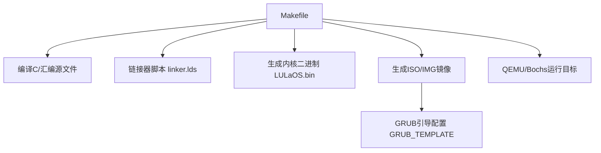
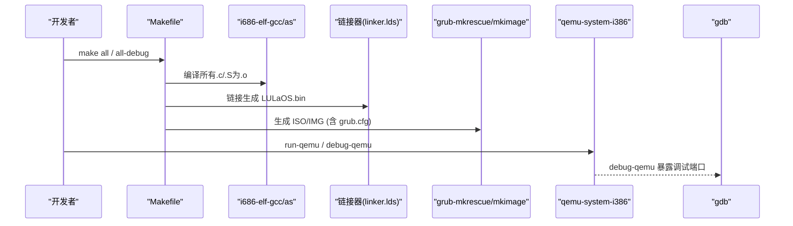
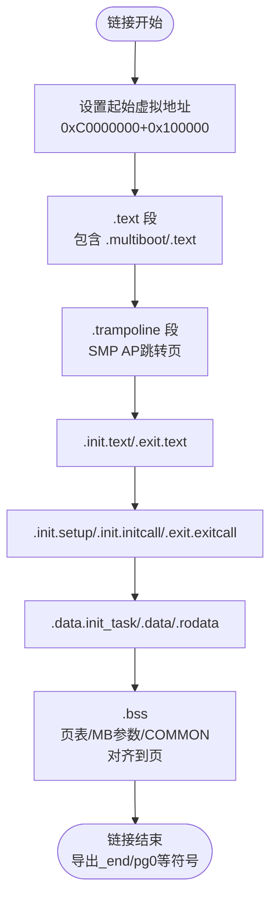
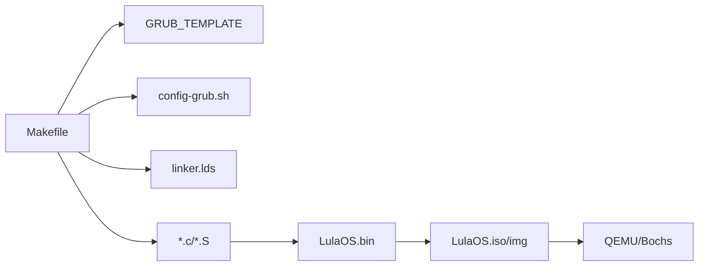

# 构建系统使用

<cite>
**本文引用的文件**
- [Makefile](file://Makefile)
- [linker.lds](file://linker.lds)
- [README.md](file://README.md)
- [config-grub.sh](file://config-grub.sh)
- [GRUB_TEMPLATE](file://GRUB_TEMPLATE)
- [bochs.cfg](file://bochs.cfg)
- [bochsrc.bxrc](file://bochsrc.bxrc)
- [arch/x86/entry.S](file://arch/x86/entry.S)
</cite>

## 目录
1. [简介](#简介)
2. [项目结构](#项目结构)
3. [核心组件](#核心组件)
4. [架构总览](#架构总览)
5. [详细组件分析](#详细组件分析)
6. [依赖关系分析](#依赖关系分析)
7. [性能与优化建议](#性能与优化建议)
8. [故障排查指南](#故障排查指南)
9. [结论](#结论)
10. [附录](#附录)

## 简介
本指南面向LulaOS的构建系统，聚焦于Makefile驱动的编译、链接、镜像生成与运行流程。文档将解释：
- 交叉编译工具链的安装与配置要点
- Makefile中的关键变量、规则与目标（all、all-debug、run-qemu、debug-qemu等）
- 链接脚本linker.lds的内存布局与段定义
- 如何自定义编译器选项、调试符号与优化级别
- 常见构建问题的定位与解决方法

## 项目结构
LulaOS采用按功能分层与架构分离的组织方式：
- arch/x86：架构相关代码（启动入口、中断向量、SMP trampoline等）
- kernel：内核子系统（设备、内存、调度、中断、TTY、USB、视频等）
- includes：头文件（架构、驱动、内核接口等）
- libs：通用库实现
- config：构建配置（当前为空，可通过外部make参数或环境变量扩展）
- 根目录：构建脚本与配置文件（Makefile、linker.lds、GRUB模板、Bochs/QEMU配置等）

图表来源
- [Makefile:1-138](file://Makefile#L1-L138)
- [GRUB_TEMPLATE:1-5](file://GRUB_TEMPLATE#L1-L5)

章节来源
- [Makefile:1-138](file://Makefile#L1-L138)
- [README.md:1-84](file://README.md#L1-L84)

## 核心组件
- 交叉编译工具链：i686-elf-gcc、i686-elf-as、grub-mkrescue/grub-mkimage、qemu-system-i386、gdb、bochs
- 构建产物：build/bin/LulaOS.bin、build/LulaOS.img、build/LulaOS.iso
- 引导配置：GRUB_TEMPLATE通过config-grub.sh生成grub.cfg
- 链接脚本：linker.lds定义内核虚拟地址空间、段布局与对齐策略
- 运行目标：run-qemu、debug-qemu、debug-bochs

章节来源
- [Makefile:23-31](file://Makefile#L23-L31)
- [Makefile:53-83](file://Makefile#L53-L83)
- [Makefile:86-112](file://Makefile#L86-L112)
- [GRUB_TEMPLATE:1-5](file://GRUB_TEMPLATE#L1-L5)
- [config-grub.sh:1-5](file://config-grub.sh#L1-L5)
- [linker.lds:1-103](file://linker.lds#L1-L103)

## 架构总览
下图展示从源码到可执行镜像再到运行的整体流程：

图表来源
- [Makefile:45-83](file://Makefile#L45-L83)
- [Makefile:99-109](file://Makefile#L99-L109)

章节来源
- [Makefile:45-109](file://Makefile#L45-L109)

## 详细组件分析

### Makefile构建流程与目标
- 工具链与路径
  - 编译器：i686-elf-gcc；汇编器：i686-elf-as
  - 输出目录：build/{obj,bin,iso}
  - 包含目录：includes
- 编译规则
  - .S -> .o：调用编译器并传入包含路径
  - .c -> .o：调用编译器并传入CFLAGS
- 链接阶段
  - 使用-T linker.lds链接所有对象文件，生成LulaOS.bin
- 镜像生成
  - ISO：通过config-grub.sh生成grub.cfg，复制内核到boot目录，使用grub-mkrescue打包
  - IMG：准备staging目录，创建ext2分区镜像，生成GRUB core.img，写入boot area并拼接为最终磁盘镜像
- 运行与调试
  - run-qemu：启动QEMU并打开监控端口
  - debug-qemu：构建调试版本，提取调试符号，启动QEMU监听调试端口，自动连接gdb
  - debug-bochs：以调试模式启动Bochs

章节来源
- [Makefile:23-31](file://Makefile#L23-L31)
- [Makefile:45-55](file://Makefile#L45-L55)
- [Makefile:57-83](file://Makefile#L57-L83)
- [Makefile:86-112](file://Makefile#L86-L112)

### 链接脚本linker.lds与内存布局
- 入口点：ENTRY(start_)
- 起始虚拟地址：0xC0000000 + 0x100000（内核高地址映射）
- 段组织
  - .text：代码段，包含.multiboot与.text
  - .trampoline：SMP AP启动用的跳转页，避免污染前8KB
  - .init.text/.exit.text：初始化/退出代码段
  - .init.setup/.init.initcall/.exit.exitcall：初始化/退出数据与回调表
  - .data.init_task/.data/.rodata：读写数据与只读数据
  - .bss：未初始化数据，包含页表、多引导参数、COMMON块，并对齐到页边界
- 对齐与块大小：多数段按4K对齐，部分按8K对齐，确保分页与缓存友好
- 符号导出：_text/_etext、_data/_edata、_rodata/_erodata、_bss/_end、pg0等用于运行时定位

图表来源
- [linker.lds:1-103](file://linker.lds#L1-L103)

章节来源
- [linker.lds:1-103](file://linker.lds#L1-L103)

### GRUB引导与镜像制作
- GRUB模板：GRUB_TEMPLATE定义图形分辨率与菜单项，加载/boot/<OS>.bin
- 动态生成：config-grub.sh通过envsubst替换_OS_NAME，生成grub.cfg
- ISO制作：复制内核到ISO的boot目录，使用grub-mkrescue打包
- IMG制作：创建boot area与ext2分区，生成core.img并写入MBR分区表，最终拼接为完整磁盘镜像

章节来源
- [GRUB_TEMPLATE:1-5](file://GRUB_TEMPLATE#L1-L5)
- [config-grub.sh:1-5](file://config-grub.sh#L1-L5)
- [Makefile:57-83](file://Makefile#L57-L83)

### QEMU与Bochs运行配置
- QEMU
  - run-qemu：启动虚拟机，挂载生成的镜像，开启监控端口
  - debug-qemu：启用-s/-S参数暴露调试端口，自动启动gdb并附加远程调试
- Bochs
  - debug-bochs：使用bochs.cfg或bochsrc.bxrc启动，支持断点与日志
  - bochs.cfg指定磁盘路径、CPU数、VGA扩展、日志输出等

章节来源
- [Makefile:99-112](file://Makefile#L99-L112)
- [bochs.cfg:1-9](file://bochs.cfg#L1-L9)
- [bochsrc.bxrc:1-59](file://bochsrc.bxrc#L1-L59)

### 启动入口与中断处理（与构建相关）
- 入口符号start_由链接脚本指定，实际入口在arch/x86/entry.S中提供
- entry.S包含大量中断向量与系统调用入口，以及SMP trampoline逻辑
- 这些汇编文件会被编译进内核映像，影响链接与运行时行为

章节来源
- [linker.lds:1-5](file://linker.lds#L1-L5)
- [arch/x86/entry.S:1-736](file://arch/x86/entry.S#L1-L736)

## 依赖关系分析
- 构建依赖
  - 编译器/工具链：i686-elf-gcc、i686-elf-as、grub-mkrescue、grub-mkimage、xorriso、dd、mke2fs、sfdisk
  - 调试工具：gdb、qemu-system-i386、bochs
- 文件依赖
  - Makefile依赖GRUB_TEMPLATE与config-grub.sh生成grub.cfg
  - 链接阶段依赖linker.lds
  - 运行阶段依赖QEMU/Bochs配置

图表来源
- [Makefile:45-83](file://Makefile#L45-L83)
- [GRUB_TEMPLATE:1-5](file://GRUB_TEMPLATE#L1-L5)
- [config-grub.sh:1-5](file://config-grub.sh#L1-L5)
- [linker.lds:1-103](file://linker.lds#L1-L103)

章节来源
- [Makefile:45-83](file://Makefile#L45-L83)
- [README.md:1-84](file://README.md#L1-L84)

## 性能与优化建议
- 优化级别
  - 默认构建使用-O3以获得较高性能
  - 调试构建all-debug切换为-O0并生成调试信息，便于gdb单步与断点
- 编译器标志
  - -ffreestanding：无标准库环境
  - -nostdlib：不链接标准库
  - -Wall -Wextra：增强警告
  - -fomit-frame-pointer：在调试构建中关闭以保留帧指针（all-debug已调整）
- 链接选项
  - -T linker.lds：固定内存布局
  - -lgcc：链接GCC运行时支持
- 建议
  - 开发期使用all-debug配合debug-qemu进行断点调试
  - 发布期使用all并评估-O3对体积与性能的影响
  - 如需进一步裁剪，可在CFLAGS中添加-fno-exceptions、-fno-rtti等（注意freestanding环境兼容性）

章节来源
- [Makefile:26-29](file://Makefile#L26-L29)
- [Makefile:88-93](file://Makefile#L88-L93)

## 故障排查指南
- 交叉工具链不可用
  - 症状：i686-elf-gcc/i686-elf-as命令未找到
  - 解决：安装或配置PATH指向正确的交叉工具链
  - 参考：README中关于交叉编译工具链的说明
- GRUB工具缺失
  - 症状：grub-mkrescue/grub-mkimage未找到
  - 解决：安装grub2-common、grub-pc-bin、xorriso等包
- QEMU/Bochs无法启动或黑屏
  - 检查镜像是否成功生成（build/LulaOS.img或LulaOS.iso）
  - 确认QEMU/Bochs配置中的磁盘路径正确
  - 查看日志文件（如bochs.log）定位错误
- 调试无法连接
  - debug-qemu需确保端口未被占用，gdb能连接到localhost:1234
  - 确认已生成kernel.dbg调试符号文件
- 链接错误或段冲突
  - 检查linker.lds中的段定义是否与源代码节名匹配
  - 确认入口符号start_存在且被正确链接

章节来源
- [README.md:10-25](file://README.md#L10-L25)
- [README.md:69-73](file://README.md#L69-L73)
- [Makefile:99-112](file://Makefile#L99-L112)
- [bochs.cfg:1-9](file://bochs.cfg#L1-L9)
- [linker.lds:1-103](file://linker.lds#L1-L103)

## 结论
LulaOS的构建系统基于Makefile组织，结合GRUB引导与QEMU/Bochs运行环境，提供了完整的编译、链接、镜像生成与调试流程。通过合理配置编译器选项与链接脚本，可以在开发与发布之间灵活切换。遵循本指南的步骤与排错方法，可高效完成LulaOS的构建与调试。

## 附录
- 常用命令速查
  - 构建发行镜像：make all
  - 构建调试镜像并生成反汇编：make all-debug
  - 运行QEMU：make run-qemu
  - 调试QEMU：make debug-qemu
  - 调试Bochs：make debug-bochs
- 环境变量与配置
  - QEMU监控端口：QEMU_MON_PORT（用于telnet监控）
  - 终端命令：QEMU_MON_TERM（用于打开监控终端）
  - 可通过修改Makefile顶部变量或传入make参数覆盖默认值

章节来源
- [Makefile:86-112](file://Makefile#L86-L112)
- [README.md:77-81](file://README.md#L77-L81)