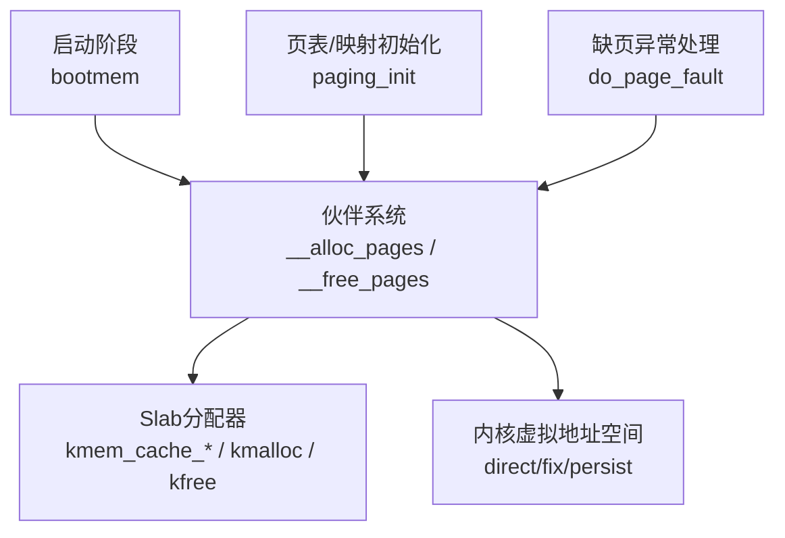
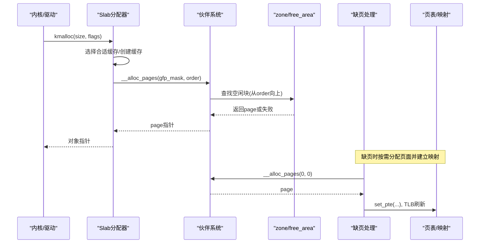
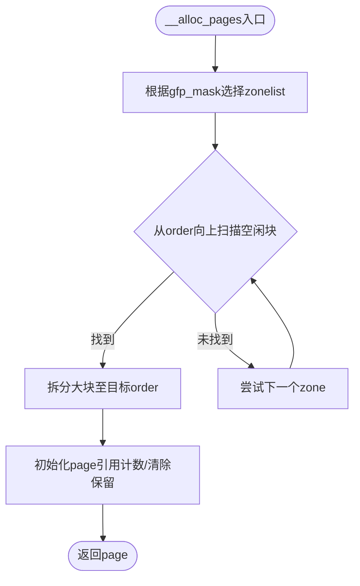
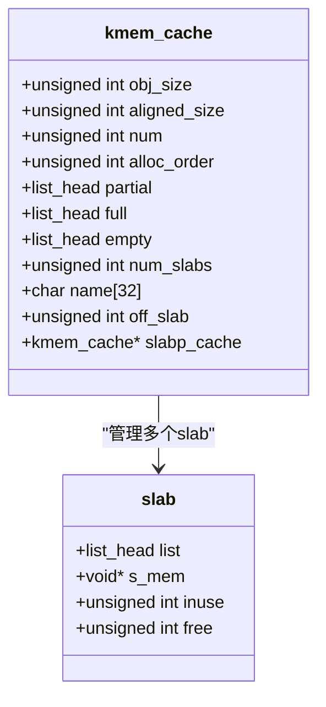
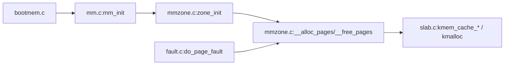

# 内存管理器扩展

<cite>
**本文引用的文件**
- [includes/mm/mm.h](file://includes/mm/mm.h)
- [includes/mm/slab.h](file://includes/mm/slab.h)
- [includes/mm/mmzone.h](file://includes/mm/mmzone.h)
- [kernel/mm/slab.c](file://kernel/mm/slab.c)
- [kernel/mm/mmzone.c](file://kernel/mm/mmzone.c)
- [kernel/mm/bootmem.c](file://kernel/mm/bootmem.c)
- [includes/mm/bootmem.h](file://includes/mm/bootmem.h)
- [arch/x86/kernel/mm/mm.c](file://arch/x86/kernel/mm/mm.c)
- [arch/x86/kernel/mm/fault.c](file://arch/x86/kernel/mm/fault.c)
- [includes/arch/x86/page.h](file://includes/arch/x86/page.h)
</cite>

## 目录
1. [简介](#简介)
2. [项目结构](#项目结构)
3. [核心组件](#核心组件)
4. [架构总览](#架构总览)
5. [详细组件分析](#详细组件分析)
6. [依赖关系分析](#依赖关系分析)
7. [性能考虑](#性能考虑)
8. [故障排除指南](#故障排除指南)
9. [结论](#结论)
10. [附录：扩展示例与最佳实践](#附录扩展示例与最佳实践)

## 简介
本指南面向希望在LulaOS上扩展内存管理系统的开发者，重点覆盖以下目标：
- 扩展现有伙伴系统（Buddy System）与Slab分配器
- 实现新的内存分配策略、添加缓存管理与监控能力
- 优化内存分配性能与可扩展性
- 明确页框分配器的扩展点、内存区域管理接口规范
- 提供NUMA支持思路与具体实现建议
- 给出对象池分配器、内存泄漏检测、性能分析与调试工具等扩展示例

## 项目结构
LulaOS的内存子系统由启动期分配器、伙伴系统、Slab分配器、缺页处理与页表管理等模块组成。关键路径如下：
- 启动期：bootmem负责早期位图分配，随后释放并转入伙伴系统
- 伙伴系统：按阶维护空闲块链表与位图，提供__alloc_pages/__free_pages
- Slab分配器：基于伙伴系统构建对象级缓存，提供kmalloc/kfree
- 缺页处理：按需分配页面、写时复制、错误诊断
- 页表与映射：直接映射区、固定映射区、持久映射区

图表来源
- [kernel/mm/bootmem.c:12-28](file://kernel/mm/bootmem.c#L12-L28)
- [kernel/mm/mmzone.c:248-324](file://kernel/mm/mmzone.c#L248-L324)
- [kernel/mm/slab.c:249-296](file://kernel/mm/slab.c#L249-L296)
- [arch/x86/kernel/mm/mm.c:117-134](file://arch/x86/kernel/mm/mm.c#L117-L134)
- [arch/x86/kernel/mm/fault.c:184-251](file://arch/x86/kernel/mm/fault.c#L184-L251)

章节来源
- [arch/x86/kernel/mm/mm.c:117-134](file://arch/x86/kernel/mm/mm.c#L117-L134)
- [kernel/mm/mmzone.c:61-150](file://kernel/mm/mmzone.c#L61-L150)
- [kernel/mm/bootmem.c:194-223](file://kernel/mm/bootmem.c#L194-L223)

## 核心组件
- 页描述符与标志：mem_map_t、page flags（PG_locked、PG_dirty、PG_slab、PG_highmem等），引用计数
- 内存区域与节点：zone_t、pg_data_t、zonelist_t，划分DMA/Normal/HighMem
- 伙伴系统：free_area[MAX_ORDER]，位图+链表，分配/回收与合并
- Slab分配器：kmem_cache_t、slab_t，partial/full/empty三链，OFF_SLAB支持
- 启动期分配器：bootmem_data_t，位图分配与释放，最终移交伙伴系统
- 缺页处理：按需分配、COW、错误打印与停机

章节来源
- [includes/mm/mm.h:11-98](file://includes/mm/mm.h#L11-L98)
- [includes/mm/mmzone.h:24-80](file://includes/mm/mmzone.h#L24-L80)
- [kernel/mm/mmzone.c:152-240](file://kernel/mm/mmzone.c#L152-L240)
- [includes/mm/slab.h:45-147](file://includes/mm/slab.h#L45-L147)
- [kernel/mm/slab.c:1-585](file://kernel/mm/slab.c#L1-L585)
- [includes/mm/bootmem.h:12-28](file://includes/mm/bootmem.h#L12-L28)
- [kernel/mm/bootmem.c:76-177](file://kernel/mm/bootmem.c#L76-L177)

## 架构总览
下图展示了从高层到硬件的关键调用链与数据流：

图表来源
- [kernel/mm/slab.c:518-540](file://kernel/mm/slab.c#L518-L540)
- [kernel/mm/mmzone.c:248-324](file://kernel/mm/mmzone.c#L248-L324)
- [arch/x86/kernel/mm/fault.c:96-150](file://arch/x86/kernel/mm/fault.c#L96-L150)

## 详细组件分析

### 伙伴系统（Buddy System）
- 数据结构
  - free_area_t：包含空闲链表与位图map
  - zone_t：维护各阶空闲块、锁、所属节点、起始物理地址与页面数
  - pg_data_t：节点级结构，包含zones、zonelists、node_mem_map等
- 分配流程
  - 根据gfp_mask选择zonelist，遍历zone，从请求order向上查找可用块
  - 找到大块后拆分为目标order，更新位图与free_pages计数
  - 初始化page引用计数与清除保留标记
- 回收流程
  - 检查锁定/LRU/Active状态，清理脏/引用标志
  - 将块加入对应阶空闲链表，尝试与伙伴合并至更高阶
- 扩展点
  - 在zone_t中增加统计字段（如碎片率、合并次数）
  - 在free_area_t中增加审计钩子（记录分配/回收事件）
  - 在__alloc_pages中引入NUMA感知策略（优先本地节点）

图表来源
- [kernel/mm/mmzone.c:248-324](file://kernel/mm/mmzone.c#L248-L324)
- [kernel/mm/mmzone.c:152-240](file://kernel/mm/mmzone.c#L152-L240)

章节来源
- [includes/mm/mmzone.h:24-80](file://includes/mm/mmzone.h#L24-L80)
- [kernel/mm/mmzone.c:61-150](file://kernel/mm/mmzone.c#L61-L150)
- [kernel/mm/mmzone.c:152-240](file://kernel/mm/mmzone.c#L152-L240)
- [kernel/mm/mmzone.c:248-324](file://kernel/mm/mmzone.c#L248-L324)

### Slab分配器
- 数据结构
  - slab_t：单个slab页描述符，嵌入或独立于页首
  - kmem_cache_t：对象缓存，维护partial/full/empty链表、num_slabs、名称、对齐大小、阶数
- 分配流程
  - 优先从partial取，其次empty，最后grow（向伙伴系统申请新slab）
  - 使用嵌入式空闲链表索引管理对象，满则移入full
- 回收流程
  - 通过virt_to_page反查slab，计算对象索引，插入空闲链表头
  - 根据inuse变化移动slab所在链表（full→partial→empty）
- OFF_SLAB支持
  - 大对象缓存启用OFF_SLAB，描述符独立分配，页内100%用于对象，保证8KB对齐
- 通用分配器
  - malloc_caches[9]覆盖32~8192字节，kmalloc从中选择最小满足size的缓存

图表来源
- [includes/mm/slab.h:45-88](file://includes/mm/slab.h#L45-L88)
- [kernel/mm/slab.c:130-199](file://kernel/mm/slab.c#L130-L199)

章节来源
- [includes/mm/slab.h:90-147](file://includes/mm/slab.h#L90-L147)
- [kernel/mm/slab.c:249-296](file://kernel/mm/slab.c#L249-L296)
- [kernel/mm/slab.c:392-450](file://kernel/mm/slab.c#L392-L450)
- [kernel/mm/slab.c:459-502](file://kernel/mm/slab.c#L459-L502)
- [kernel/mm/slab.c:518-585](file://kernel/mm/slab.c#L518-L585)

### 启动期分配器（Bootmem）
- 作用：内核早期分配少量内存，使用位图管理
- 生命周期：mm_init中调用free_all_bootmem将可用页归还伙伴系统，并释放bootmem位图页
- 扩展点：可在此处收集早期分配统计，便于后续分析

章节来源
- [includes/mm/bootmem.h:12-28](file://includes/mm/bootmem.h#L12-L28)
- [kernel/mm/bootmem.c:76-177](file://kernel/mm/bootmem.c#L76-L177)
- [kernel/mm/bootmem.c:194-223](file://kernel/mm/bootmem.c#L194-L223)

### 缺页处理与按需分配
- 处理策略：PTE为空→按需分配并清零；写保护+写访问→COW；其他→panic
- 扩展点：可在handle_pte_fault中注入监控逻辑（分配计数、延迟统计）

章节来源
- [arch/x86/kernel/mm/fault.c:96-150](file://arch/x86/kernel/mm/fault.c#L96-L150)
- [arch/x86/kernel/mm/fault.c:184-251](file://arch/x86/kernel/mm/fault.c#L184-L251)

## 依赖关系分析
- 模块耦合
  - Slab依赖伙伴系统进行底层页分配
  - 伙伴系统依赖zone与pg_data_t组织内存区域
  - 缺页处理依赖伙伴系统与页表操作
  - 启动期分配器在mm_init后被伙伴系统替代
- 外部接口
  - 页表操作：set_pgd/set_pte、pte_offset、pgd_index
  - 原子与自旋锁：atomic、spinlock_t
  - 列表操作：list_head

图表来源
- [kernel/mm/bootmem.c:194-223](file://kernel/mm/bootmem.c#L194-L223)
- [arch/x86/kernel/mm/mm.c:145-205](file://arch/x86/kernel/mm/mm.c#L145-L205)
- [kernel/mm/mmzone.c:61-150](file://kernel/mm/mmzone.c#L61-L150)
- [kernel/mm/mmzone.c:248-324](file://kernel/mm/mmzone.c#L248-L324)
- [kernel/mm/slab.c:249-296](file://kernel/mm/slab.c#L249-L296)
- [arch/x86/kernel/mm/fault.c:184-251](file://arch/x86/kernel/mm/fault.c#L184-L251)

章节来源
- [includes/arch/x86/page.h:22-43](file://includes/arch/x86/page.h#L22-L43)
- [includes/mm/mmzone.h:52-69](file://includes/mm/mmzone.h#L52-L69)

## 性能考虑
- 减少跨zone分配：合理设置gfp_mask，避免不必要的zone切换
- 利用Slab缓存：对频繁分配的小对象使用专用缓存，降低碎片
- 合并效率：确保释放顺序与对齐正确，提升伙伴合并概率
- 缺页开销：尽量预分配热点数据，减少运行时按需分配
- NUMA亲和：在多节点系统中，优先本地节点分配以降低延迟

## 故障排除指南
- 常见错误
  - OOM：__alloc_pages无法找到足够大块，检查zone空闲与order上限
  - 非法释放：kfree非slab对象会打印警告，确认对象来源
  - 缺页panic：ioremap区域PTE为0不应走按需分配，检查映射建立
- 定位方法
  - 查看printk输出中的[SLAB]/[OOM]/[BUG]信息
  - 使用GDB断点在do_page_fault与__alloc_pages
  - 统计free_pages与num_slabs变化趋势

章节来源
- [kernel/mm/slab.c:551-585](file://kernel/mm/slab.c#L551-L585)
- [arch/x86/kernel/mm/fault.c:256-290](file://arch/x86/kernel/mm/fault.c#L256-L290)

## 结论
LulaOS的内存子系统具备清晰的层次化设计：bootmem过渡到伙伴系统，Slab在此基础上提供高效对象分配。通过明确扩展点（zone/pg_data_t、free_area、kmem_cache、缺页处理），可以安全地引入NUMA、监控与自定义分配策略，同时保持现有API兼容性与稳定性。

## 附录：扩展示例与最佳实践

### 扩展示例一：对象池分配器
- 目标：为特定类型对象提供固定大小、快速分配的池
- 步骤
  - 定义对象池结构，内含空闲链表与容量限制
  - 复用Slab的kmem_cache_create创建固定大小缓存
  - 在池初始化时预分配若干slab，提高命中率
  - 提供pool_alloc/pool_free接口，封装kmalloc/kfree
- 参考路径
  - [includes/mm/slab.h:97-147](file://includes/mm/slab.h#L97-L147)
  - [kernel/mm/slab.c:249-296](file://kernel/mm/slab.c#L249-L296)

### 扩展示例二：内存监控功能
- 目标：统计分配/回收频率、碎片率、各zone使用情况
- 步骤
  - 在zone_t中添加统计字段（alloc_count、free_count、merge_count）
  - 在__alloc_pages与__free_pages_ok中更新统计
  - 暴露统计读取接口（如/proc/meminfo风格）
- 参考路径
  - [includes/mm/mmzone.h:35-63](file://includes/mm/mmzone.h#L35-L63)
  - [kernel/mm/mmzone.c:248-324](file://kernel/mm/mmzone.c#L248-L324)
  - [kernel/mm/mmzone.c:152-240](file://kernel/mm/mmzone.c#L152-L240)

### 扩展示例三：调试工具（分配追踪）
- 目标：记录每次kmalloc/kfree的来源与大小
- 步骤
  - 在kmalloc/kfree中记录调用栈、size、时间戳
  - 维护环形缓冲区存储最近N条记录
  - 提供导出接口供用户态或控制台查看
- 参考路径
  - [kernel/mm/slab.c:518-585](file://kernel/mm/slab.c#L518-L585)

### 扩展示例四：NUMA支持
- 目标：在多节点系统中实现本地优先分配与迁移
- 步骤
  - 扩展pg_data_t以标识节点ID与本地zone
  - 在__alloc_pages中优先选择本地节点的zonelist
  - 在伙伴系统回收时考虑跨节点迁移策略
  - 在Slab层为每个节点维护per-node缓存（可选）
- 参考路径
  - [includes/mm/mmzone.h:52-69](file://includes/mm/mmzone.h#L52-L69)
  - [kernel/mm/mmzone.c:21-59](file://kernel/mm/mmzone.c#L21-L59)
  - [kernel/mm/mmzone.c:248-324](file://kernel/mm/mmzone.c#L248-L324)

### 扩展示例五：内存泄漏检测
- 目标：检测未释放的slab对象
- 步骤
  - 在kmem_cache_free中校验对象归属，记录异常
  - 定期扫描slab的空闲链表，统计未释放对象
  - 提供报告接口列出疑似泄漏对象
- 参考路径
  - [kernel/mm/slab.c:459-502](file://kernel/mm/slab.c#L459-L502)

### 最佳实践
- 谨慎选择order：避免过大order导致碎片
- 合理使用OFF_SLAB：大对象缓存启用以提升对齐与利用率
- 控制cache数量：避免过多缓存造成元数据开销
- 结合缺页优化：热点路径预分配，减少运行时分配