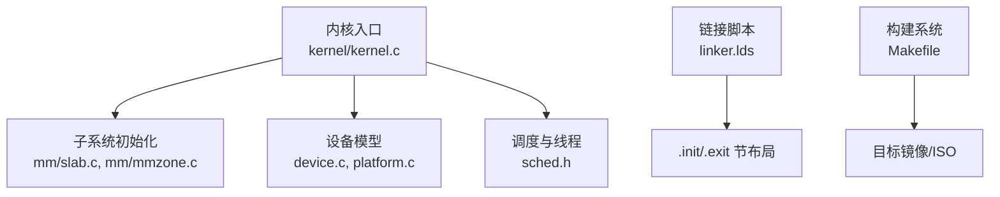
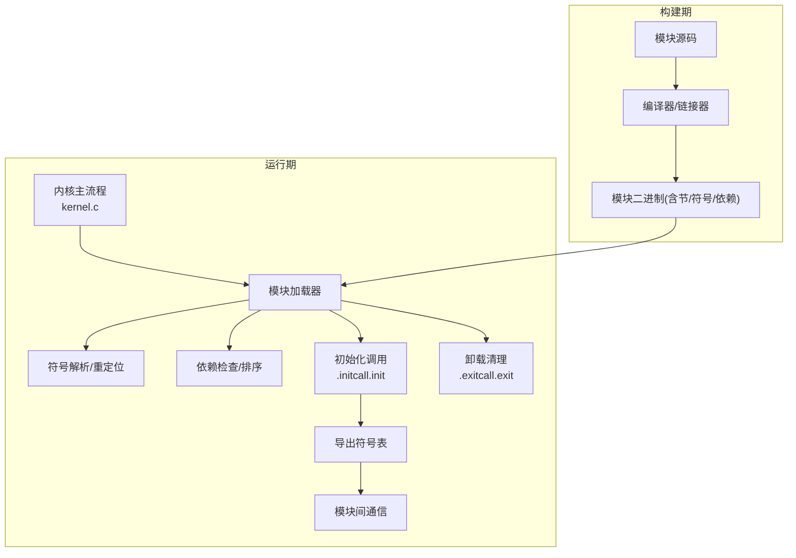
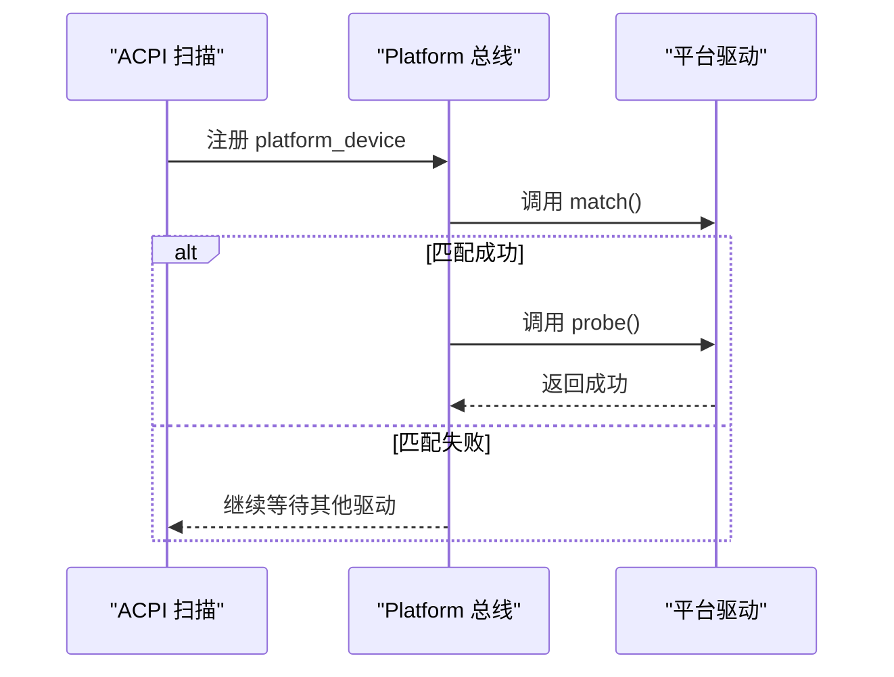
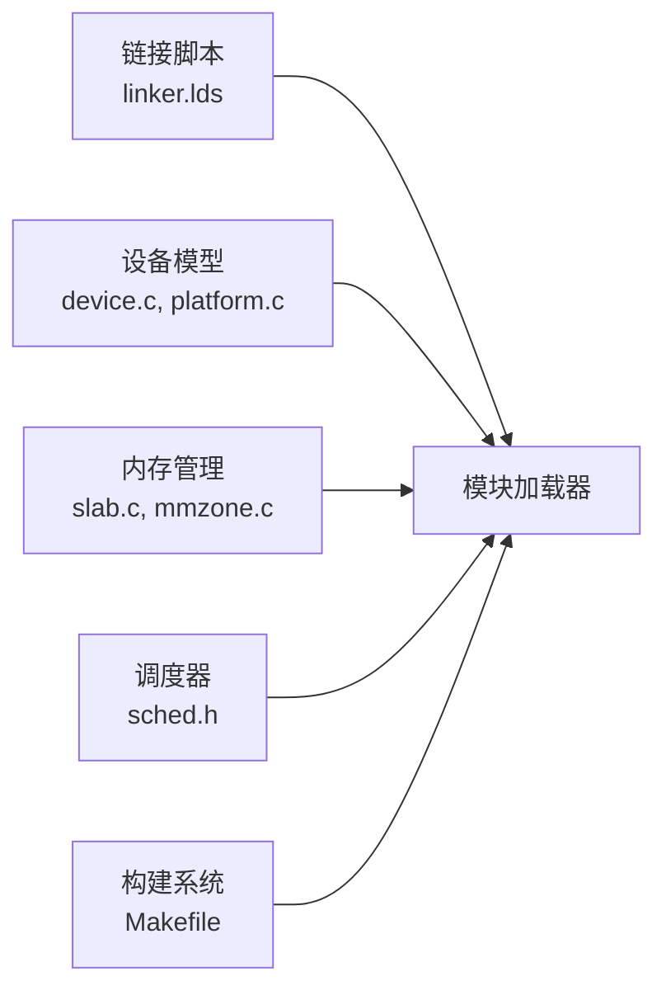

# 内核模块系统

<cite>
**本文引用的文件**
- [README.md](file://README.md)
- [Makefile](file://Makefile)
- [linker.lds](file://linker.lds)
- [kernel.c](file://kernel/kernel.c)
- [mm.h](file://includes/mm/mm.h)
- [device.h](file://includes/device/device.h)
- [device.c](file://kernel/device/device.c)
- [platform.c](file://kernel/device/platform.c)
- [slab.c](file://kernel/mm/slab.c)
- [mmzone.c](file://kernel/mm/mmzone.c)
- [bootmem.c](file://kernel/mm/bootmem.c)
- [sched.h](file://includes/kernel/sched.h)
- [linkage.h](file://includes/arch/linkage.h)
</cite>

## 目录
1. [简介](#简介)
2. [项目结构](#项目结构)
3. [核心组件](#核心组件)
4. [架构总览](#架构总览)
5. [详细组件分析](#详细组件分析)
6. [依赖关系分析](#依赖关系分析)
7. [性能考虑](#性能考虑)
8. [故障排除指南](#故障排除指南)
9. [结论](#结论)
10. [附录](#附录)

## 简介
本文件为 LulaOS 的内核模块系统开发文档，目标是设计并实现一套可动态加载/卸载的内核模块机制。结合现有内核的内存管理、设备模型与链接脚本基础，本文给出：
- 模块格式定义（节布局、符号表、依赖信息）
- 符号解析与重定位策略
- 依赖管理与加载顺序控制
- 内存布局与生命周期管理
- 模块初始化流程、导出符号表设计与模块间通信接口
- 示例模块（设备驱动、系统服务、测试模块）
- 编译配置、加载验证与卸载清理
- 调试工具与故障排除

## 项目结构
LulaOS 当前已具备：
- 链接脚本定义了 .init/.exit 相关节，便于模块化生命周期管理
- 统一设备模型（bus/device/driver）用于设备驱动的注册与匹配
- 伙伴系统与 slab 分配器提供运行时内存分配能力
- 调度器与线程栈布局支持多任务执行环境
- 构建系统通过 Makefile 组织编译、链接与镜像生成

**图示来源**
- [kernel.c:73-139](file://kernel/kernel.c#L73-L139)
- [slab.c:249-296](file://kernel/mm/slab.c#L249-L296)
- [device.c:22-164](file://kernel/device/device.c#L22-L164)
- [platform.c:14-77](file://kernel/device/platform.c#L14-L77)
- [linker.lds:23-57](file://linker.lds#L23-L57)
- [Makefile:23-55](file://Makefile#L23-L55)

**章节来源**
- [README.md:1-84](file://README.md#L1-L84)
- [Makefile:1-138](file://Makefile#L1-L138)
- [linker.lds:1-103](file://linker.lds#L1-L103)
- [kernel.c:73-139](file://kernel/kernel.c#L73-L139)

## 核心组件
- 链接期节布局：利用 .init.text/.exit.text/.init.data/.exit.data/.initcall.init/.exitcall.exit 等节，支撑模块的初始化与清理阶段
- 设备模型：bus_type/device/device_driver 抽象，支持平台总线下的设备/驱动匹配与 probe/remove
- 内存管理：伙伴系统页分配与 slab 对象缓存，提供 kmalloc/kfree 等通用分配接口
- 调度与线程：thread_union 与 current 宏，保证模块运行时的上下文切换与栈安全
- 构建系统：统一的编译器选项、链接脚本与镜像生成流程

**章节来源**
- [linker.lds:23-57](file://linker.lds#L23-L57)
- [device.h:32-77](file://includes/device/device.h#L32-L77)
- [device.c:22-164](file://kernel/device/device.c#L22-L164)
- [platform.c:14-77](file://kernel/device/platform.c#L14-L77)
- [slab.c:249-296](file://kernel/mm/slab.c#L249-L296)
- [mm.h:11-98](file://includes/mm/mm.h#L11-L98)
- [sched.h:21-126](file://includes/kernel/sched.h#L21-L126)

## 架构总览
下图展示模块系统在 LulaOS 中的整体位置与交互：模块由构建系统编译为可加载对象，内核在运行时解析其符号与依赖，将其代码与数据映射到内核地址空间，按 initcall 顺序执行初始化，并通过导出符号表与其他模块或内核进行通信。

[此图为概念性架构图，不直接对应具体源文件，故无“图示来源”]

## 详细组件分析

### 模块格式定义
- 节布局要求
  - .text：模块主体代码段
  - .rodata：只读常量
  - .data/.bss：读写/未初始化数据
  - .init.text/.init.data：仅初始化阶段使用的代码与数据
  - .exit.text/.exit.data：仅卸载阶段使用的代码与数据
  - .initcall.init：初始化函数指针数组，供内核按序调用
  - .exitcall.exit：卸载函数指针数组，供内核逆序调用
- 符号表
  - 导出符号：模块对外暴露的函数/变量，需加入导出表
  - 导入符号：模块依赖的其他模块或内核符号，需在加载时解析
- 依赖信息
  - 每个模块声明其依赖的模块名列表
  - 加载器根据依赖图进行拓扑排序，确保先加载被依赖模块

**章节来源**
- [linker.lds:23-57](file://linker.lds#L23-L57)
- [linkage.h:10-16](file://includes/arch/linkage.h#L10-L16)

### 符号解析与重定位
- 解析策略
  - 收集模块的导入符号集合
  - 遍历内核及已加载模块的导出符号表，查找匹配项
  - 若存在循环依赖或缺失符号，拒绝加载并回滚
- 重定位
  - 对包含重定位信息的模块，计算相对虚拟地址并修正引用
  - 确保模块代码与数据在内核地址空间的可执行性与一致性

[本节为概念性说明，不直接分析具体文件，故无“章节来源”]

### 依赖管理与加载顺序
- 依赖图构建
  - 从模块元数据中读取依赖列表
  - 构建有向无环图（DAG），检测循环依赖
- 拓扑排序
  - 使用 Kahn 算法或 DFS 后序入栈，得到加载顺序
  - 初始化按拓扑序执行，卸载按逆序执行

[本节为概念性说明，不直接分析具体文件，故无“章节来源”]

### 内存布局与生命周期
- 内存布局
  - 模块代码与数据映射至内核虚拟地址空间
  - 使用现有伙伴系统与 slab 分配器进行运行时分配
- 生命周期
  - 加载：解析符号、检查依赖、映射内存、执行初始化
  - 运行：提供导出接口供其他模块调用
  - 卸载：执行清理函数、释放资源、解除绑定

**章节来源**
- [slab.c:518-584](file://kernel/mm/slab.c#L518-L584)
- [mmzone.c:305-329](file://kernel/mm/mmzone.c#L305-L329)
- [bootmem.c:136-179](file://kernel/mm/bootmem.c#L136-L179)

### 模块初始化流程
- 初始化入口
  - 模块提供 __init 标记的初始化函数
  - 将初始化函数指针放入 .initcall.init 节
- 内核执行
  - 内核在适当时机遍历 .initcall.init 并调用各模块初始化函数
  - 初始化完成后，可释放 .init 节以回收内存

**章节来源**
- [linker.lds:45-50](file://linker.lds#L45-L50)
- [linkage.h:10-16](file://includes/arch/linkage.h#L10-L16)

### 导出符号表设计与模块间通信接口
- 导出符号表
  - 维护模块导出的函数/变量名称与地址
  - 提供查询接口供加载器与其他模块使用
- 通信接口
  - 基于导出符号表的函数调用
  - 可选的消息队列或事件通知机制（后续扩展）

[本节为概念性说明，不直接分析具体文件，故无“章节来源”]

### 设备驱动模块示例
- 平台总线驱动
  - 定义 platform_driver，实现 match/probe/remove
  - 通过 platform_device_register 注册设备，触发匹配与 probe
- 设备枚举
  - ACPI 扫描发现平台设备，构造 platform_device 并注册
  - 驱动匹配成功后执行硬件初始化

**图示来源**
- [platform.c:25-50](file://kernel/device/platform.c#L25-L50)
- [device.c:42-87](file://kernel/device/device.c#L42-L87)

**章节来源**
- [platform.c:14-77](file://kernel/device/platform.c#L14-L77)
- [device.c:94-164](file://kernel/device/device.c#L94-L164)
- [acpi_dev.c:753-785](file://kernel/device/acpi_dev.c#L753-L785)

### 系统服务模块示例
- 服务模块职责
  - 提供系统级服务（如日志、定时器、网络协议栈等）
  - 通过导出符号表暴露接口
- 初始化与清理
  - 在 .initcall.init 中完成服务初始化
  - 在 .exitcall.exit 中释放资源并注销接口

[本节为概念性说明，不直接分析具体文件，故无“章节来源”]

### 测试模块示例
- 测试模块职责
  - 验证模块加载/卸载流程
  - 调用导出接口进行功能测试
- 测试用例
  - 符号解析正确性
  - 依赖加载顺序
  - 内存分配与释放
  - 设备驱动 probe/remove 流程

[本节为概念性说明，不直接分析具体文件，故无“章节来源”]

## 依赖关系分析
模块系统依赖以下内核子系统：
- 链接脚本：提供 .init/.exit 节布局
- 设备模型：提供 bus/device/driver 抽象
- 内存管理：提供页分配与对象缓存
- 调度器：提供线程上下文与栈管理
- 构建系统：提供编译链接与镜像生成

**图示来源**
- [linker.lds:23-57](file://linker.lds#L23-L57)
- [device.c:22-164](file://kernel/device/device.c#L22-L164)
- [platform.c:14-77](file://kernel/device/platform.c#L14-L77)
- [slab.c:249-296](file://kernel/mm/slab.c#L249-L296)
- [mmzone.c:305-329](file://kernel/mm/mmzone.c#L305-L329)
- [sched.h:21-126](file://includes/kernel/sched.h#L21-L126)
- [Makefile:23-55](file://Makefile#L23-L55)

**章节来源**
- [linker.lds:23-57](file://linker.lds#L23-L57)
- [device.c:22-164](file://kernel/device/device.c#L22-L164)
- [platform.c:14-77](file://kernel/device/platform.c#L14-L77)
- [slab.c:249-296](file://kernel/mm/slab.c#L249-L296)
- [mmzone.c:305-329](file://kernel/mm/mmzone.c#L305-L329)
- [sched.h:21-126](file://includes/kernel/sched.h#L21-L126)
- [Makefile:23-55](file://Makefile#L23-L55)

## 性能考虑
- 符号解析优化
  - 使用哈希表加速符号查找
  - 预编译依赖图减少运行时开销
- 内存分配优化
  - 优先使用 slab 缓存，避免频繁伙伴系统分配
  - 合理设置对象大小与对齐，减少碎片
- 初始化顺序优化
  - 并行初始化互不依赖的模块
  - 延迟非关键模块的初始化

[本节为一般性指导，不直接分析具体文件，故无“章节来源”]

## 故障排除指南
- 常见问题
  - 符号缺失：检查模块导出表与依赖声明
  - 循环依赖：调整模块拆分或引入间接接口
  - 内存泄漏：确保卸载流程释放所有资源
  - 设备驱动未匹配：确认设备名称与驱动名称一致
- 调试工具
  - 使用 objdump 查看模块符号与节布局
  - 使用 GDB 附加 QEMU/Bochs 进行断点调试
  - 打印模块加载/卸载日志，定位问题阶段

**章节来源**
- [Makefile:88-112](file://Makefile#L88-L112)
- [device.c:113-164](file://kernel/device/device.c#L113-L164)

## 结论
本文基于 LulaOS 现有内核架构，设计了完整的内核模块系统方案。通过链接脚本的节布局、设备模型的驱动框架、内存管理的分配器以及构建系统的编译链接流程，实现了模块的动态加载、符号解析、依赖管理、初始化与卸载清理。后续可扩展更多子系统与工具链支持，提升模块生态与开发效率。

[本节为总结性内容，不直接分析具体文件，故无“章节来源”]

## 附录
- 模块开发步骤
  - 编写模块源码，定义导出符号与依赖
  - 使用专用 Makefile 片段编译为可加载对象
  - 将模块放入指定目录，由加载器自动发现
- 加载验证
  - 检查内核日志输出，确认模块加载成功
  - 调用导出接口进行功能验证
- 卸载清理
  - 确保 remove 回调释放资源
  - 检查内存与设备状态，避免残留

[本节为操作性指导，不直接分析具体文件，故无“章节来源”]