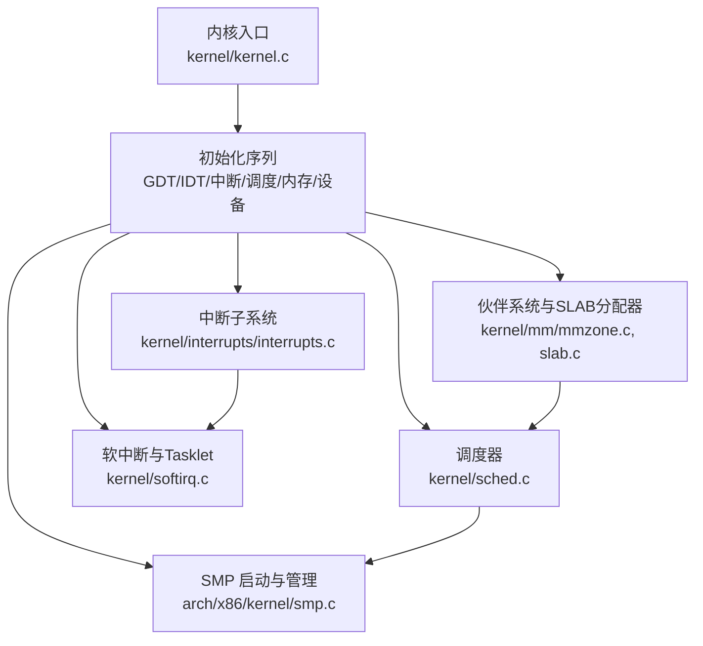
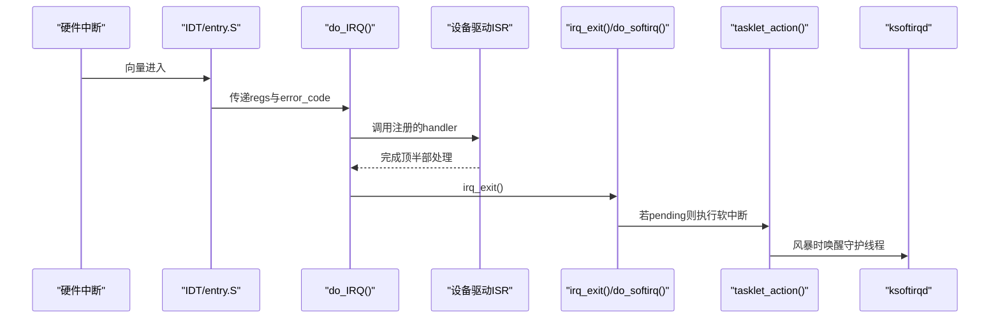
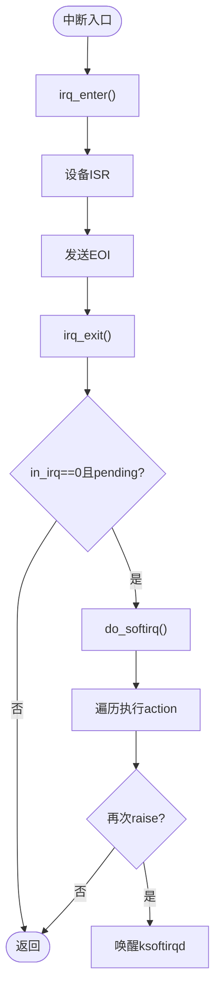
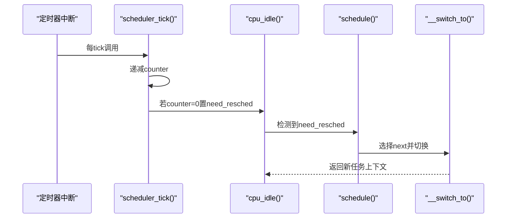
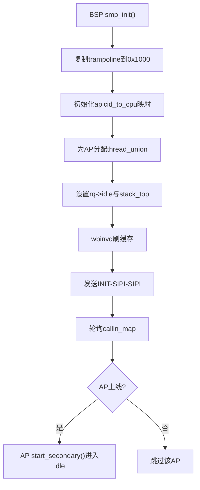
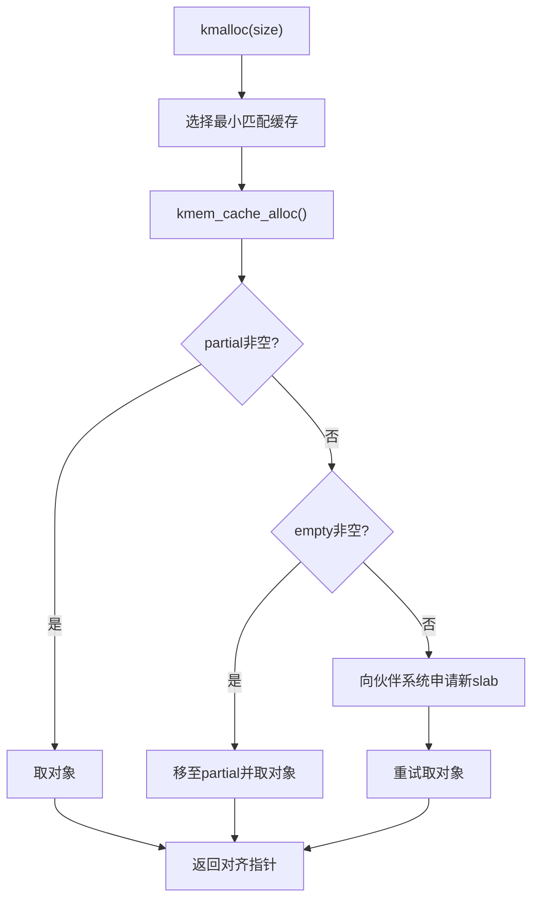
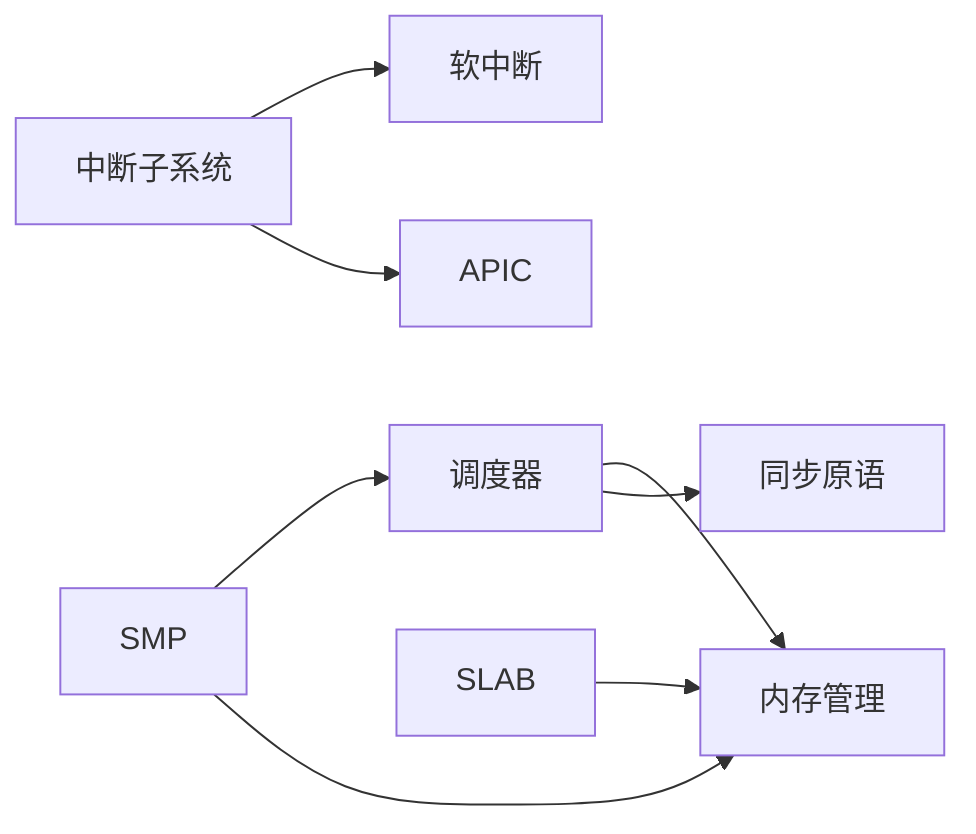

# 扩展开发最佳实践

<cite>
**本文引用的文件**
- [README.md](file://README.md)
- [Makefile](file://Makefile)
- [kernel.c](file://kernel/kernel.c)
- [sched.c](file://kernel/sched.c)
- [thread.h](file://includes/thread.h)
- [interrupts.c](file://kernel/interrupts/interrupts.c)
- [interrupts.h](file://includes/interrupts/interrupts.h)
- [softirq.c](file://kernel/softirq.c)
- [softirq.h](file://includes/kernel/softirq.h)
- [smp.c](file://arch/x86/kernel/smp.c)
- [smp.h](file://includes/arch/x86/smp.h)
- [slab.c](file://kernel/mm/slab.c)
- [mmzone.c](file://kernel/mm/mmzone.c)
- [spinlock.h](file://includes/arch/x86/spinlock.h)
- [fault.c](file://arch/x86/kernel/mm/fault.c)
- [idt.c](file://arch/x86/kernel/idt.c)
</cite>

## 目录
1. [简介](#简介)
2. [项目结构](#项目结构)
3. [核心组件](#核心组件)
4. [架构总览](#架构总览)
5. [详细组件分析](#详细组件分析)
6. [依赖关系分析](#依赖关系分析)
7. [性能考虑](#性能考虑)
8. [故障排查指南](#故障排查指南)
9. [结论](#结论)
10. [附录](#附录)

## 简介
本指南面向在 LulaOS 上进行内核扩展开发的工程师，总结通用原则与设计模式，覆盖接口设计、错误处理、SMP 安全编程、中断上下文与内存管理约束，并提供质量保证方法（静态分析、单元测试、集成测试）、常见陷阱与解决方案、性能基准方法与调试技巧，以及完整的扩展开发工作流程与代码审查清单。

## 项目结构
LulaOS 采用分层组织：
- 架构相关代码位于 arch/x86，包含启动、SMP、页表、异常等底层实现
- 内核子系统位于 kernel，包括调度、中断、软中断、设备驱动框架、内存管理等
- 公共头文件位于 includes，按 arch、kernel、mm、device 等维度划分
- 构建系统通过 Makefile 统一编译链接，并支持 QEMU/Bochs 调试

图表来源
- [kernel.c:27-139](file://kernel/kernel.c#L27-L139)
- [sched.c:76-259](file://kernel/sched.c#L76-L259)
- [interrupts.c:18-108](file://kernel/interrupts/interrupts.c#L18-L108)
- [softirq.c:399-414](file://kernel/softirq.c#L399-L414)
- [smp.c:74-215](file://arch/x86/kernel/smp.c#L74-L215)
- [mmzone.c:61-150](file://kernel/mm/mmzone.c#L61-L150)
- [slab.c:249-296](file://kernel/mm/slab.c#L249-L296)

章节来源
- [README.md:1-84](file://README.md#L1-L84)
- [Makefile:1-138](file://Makefile#L1-L138)
- [kernel.c:27-139](file://kernel/kernel.c#L27-L139)

## 核心组件
- 调度器：基于静态优先级+时间片轮转，per-CPU 运行队列，idle 循环与 need_resched 协作触发调度
- 中断子系统：统一的 do_IRQ 入口，注册/注销 IRQ，APIC Timer 驱动 tick
- 软中断与 Tasklet：中断顶半部快速处理，底半部延迟执行，ksoftirqd 守护进程防风暴
- SMP：BSP 引导 AP，trampoline 切换至保护模式，per-CPU idle task，wbinvd 缓存一致性
- 内存管理：伙伴系统分配/释放页面，SLAB 对象缓存，kmalloc/kfree 通用接口
- 同步原语：自旋锁、读写锁、原子操作，配合 irqsave/restore 保证 SMP 安全

章节来源
- [sched.c:136-259](file://kernel/sched.c#L136-L259)
- [interrupts.c:18-108](file://kernel/interrupts/interrupts.c#L18-L108)
- [softirq.c:54-149](file://kernel/softirq.c#L54-L149)
- [smp.c:74-215](file://arch/x86/kernel/smp.c#L74-L215)
- [mmzone.c:248-329](file://kernel/mm/mmzone.c#L248-L329)
- [slab.c:518-584](file://kernel/mm/slab.c#L518-L584)
- [spinlock.h:95-138](file://includes/arch/x86/spinlock.h#L95-L138)

## 架构总览
下图展示从硬件中断到调度与软中断的完整调用链，体现“顶半部快、底半部慢”的分层设计。

图表来源
- [interrupts.c:84-108](file://kernel/interrupts/interrupts.c#L84-L108)
- [softirq.c:89-149](file://kernel/softirq.c#L89-L149)
- [softirq.c:369-385](file://kernel/softirq.c#L369-L385)
- [softirq.c:161-177](file://kernel/softirq.c#L161-L177)

## 详细组件分析

### 中断与软中断子系统
- 设计要点
  - 顶半部（硬中断）必须短小精悍，仅做必要寄存器保存、设备状态复位、EOI 发送
  - 将耗时工作下沉到底半部（软中断/Tasklet），避免阻塞同级或低优先级中断
  - 使用 per-CPU pending 位掩码与 ksoftirqd 防止高负载下中断风暴
- 关键流程
  - request_irq/free_irq 管理 IRQ 描述符与 IOAPIC 使能/屏蔽
  - do_IRQ 统一入口，分发到具体 handler，并在退出路径触发软中断处理
  - irq_enter/irq_exit 维护嵌套计数，确保最外层退出时才处理 pending softirq
  - tasklet 提供普通与高优先级两种调度通道，支持禁用/启用与立即执行（调试用途）

图表来源
- [interrupts.c:84-108](file://kernel/interrupts/interrupts.c#L84-L108)
- [softirq.c:131-149](file://kernel/softirq.c#L131-L149)
- [softirq.c:89-123](file://kernel/softirq.c#L89-L123)
- [softirq.c:161-177](file://kernel/softirq.c#L161-L177)

章节来源
- [interrupts.c:18-108](file://kernel/interrupts/interrupts.c#L18-L108)
- [interrupts.h:45-78](file://includes/interrupts/interrupts.h#L45-L78)
- [softirq.c:54-149](file://kernel/softirq.c#L54-L149)
- [softirq.h:16-99](file://includes/kernel/softirq.h#L16-L99)

### 调度器与空闲循环
- 设计要点
  - 每个 CPU 拥有独立运行队列，idle 任务默认指向 init_task，AP 启动后替换为各自 idle
  - scheduler_tick 递减 counter，耗尽时置位 need_resched；cpu_idle 循环检测并调度
  - schedule 获取 rq 锁，选择 counter 最大的可运行任务，必要时进行上下文切换
- 关键流程
  - sys_fork/kernel_thread 分配 thread_union（8KB 对齐），设置初始栈帧与 eip/esp
  - add_task_to_cpu 将任务加入目标 CPU 运行队列，支持负载均衡标志

图表来源
- [sched.c:223-259](file://kernel/sched.c#L223-L259)
- [sched.c:136-213](file://kernel/sched.c#L136-L213)
- [sched.c:275-433](file://kernel/sched.c#L275-L433)

章节来源
- [sched.c:76-259](file://kernel/sched.c#L76-L259)
- [thread.h:1-32](file://includes/thread.h#L1-L32)

### SMP 安全编程与 AP 启动
- 设计要点
  - BSP 复制 trampoline 到固定物理地址，更新 GDTR base，建立 apicid_to_cpu 映射
  - 对每个 AP 分配独立 thread_union，设置 stack_top 与 runqueues[cpu].idle
  - wbinvd 强制写回缓存，确保 AP 读取到正确的栈指针与 idle 任务
  - start_secondary 尽早标记在线，等待 callout，初始化 Local APIC，创建 ksoftirqd，进入 idle
- 关键风险
  - 未设置 idle->thread.esp 会导致 __switch_to 恢复 ESP=0，引发 #PF/Triple Fault
  - 未提前注册 rq->idle 可能导致 AP Timer 误判导致错误调度

图表来源
- [smp.c:74-215](file://arch/x86/kernel/smp.c#L74-L215)
- [smp.c:233-276](file://arch/x86/kernel/smp.c#L233-L276)
- [smp.h:16-76](file://includes/arch/x86/smp.h#L16-L76)

章节来源
- [smp.c:74-215](file://arch/x86/kernel/smp.c#L74-L215)
- [smp.h:16-76](file://includes/arch/x86/smp.h#L16-L76)

### 内存管理与 SLAB 分配器
- 设计要点
  - 伙伴系统负责大块页面分配/释放，支持阶合并与拆分
  - SLAB 提供细粒度对象缓存，支持 ON_SLAB 与 OFF_SLAB 两种布局
  - kmalloc/kfree 封装常用尺寸缓存，THREAD_SIZE(8KB) 分配满足 current 宏对齐要求
- 关键流程
  - __alloc_pages 根据 gfp_mask 选择 zonelist，查找空闲块并拆分
  - kmem_cache_alloc 优先 partial→empty→grow，并发安全通过 spin_lock_irqsave
  - kfree 通过 virt_to_page 反查 slab，归还对象并移动链表

图表来源
- [slab.c:518-584](file://kernel/mm/slab.c#L518-L584)
- [slab.c:392-450](file://kernel/mm/slab.c#L392-L450)
- [mmzone.c:248-329](file://kernel/mm/mmzone.c#L248-L329)

章节来源
- [slab.c:249-296](file://kernel/mm/slab.c#L249-L296)
- [slab.c:392-450](file://kernel/mm/slab.c#L392-L450)
- [mmzone.c:248-329](file://kernel/mm/mmzone.c#L248-L329)

### 同步原语与SMP安全
- 自旋锁与中断屏蔽
  - spin_lock_irqsave/spin_unlock_irqrestore 组合用于临界区保护
  - 在中断上下文中避免睡眠，使用原子操作与忙等
- 关键约束
  - 持有锁期间禁止长时间阻塞
  - 跨 CPU 共享数据必须加锁或使用原子操作
  - 注意锁顺序，避免死锁

章节来源
- [spinlock.h:95-138](file://includes/arch/x86/spinlock.h#L95-L138)

## 依赖关系分析
- 模块耦合
  - 调度器依赖内存分配（kmalloc）与自旋锁
  - 中断子系统依赖 APIC 与软中断
  - SMP 依赖页分配器与调度器（为 AP 创建 idle）
  - SLAB 依赖伙伴系统
- 外部依赖
  - 构建工具链（GCC交叉编译）、调试器（QEMU/Bochs/GDB）
  - GRUB 引导配置

图表来源
- [sched.c:76-259](file://kernel/sched.c#L76-L259)
- [interrupts.c:18-108](file://kernel/interrupts/interrupts.c#L18-L108)
- [softirq.c:399-414](file://kernel/softirq.c#L399-L414)
- [smp.c:74-215](file://arch/x86/kernel/smp.c#L74-L215)
- [slab.c:249-296](file://kernel/mm/slab.c#L249-L296)

章节来源
- [Makefile:1-138](file://Makefile#L1-L138)
- [README.md:1-84](file://README.md#L1-L84)

## 性能考虑
- 中断处理
  - 尽量缩短顶半部执行时间，尽快发送 EOI
  - 使用 Tasklet 将耗时逻辑移出中断上下文
- 调度开销
  - 合理设置 timeslice，避免频繁切换
  - 利用 KT_BALANCE 进行负载均衡，减少热点 CPU 压力
- 内存分配
  - 优先复用 SLAB 缓存，避免频繁伙伴系统调用
  - 大对象使用 OFF_SLAB 提升空间利用率
- 同步
  - 缩小临界区范围，减少锁竞争
  - 避免在持锁时进行可能阻塞的操作

## 故障排查指南
- 缺页异常与崩溃
  - 打印 CR2、错误码、寄存器现场，定位非法访问
  - 内核态异常直接停机，防止二次破坏
- 常见问题
  - Triple Fault：检查 AP idle->thread.esp 是否设置、rq->idle 是否正确注册
  - 调度异常：确认 need_resched 置位路径与 cpu_idle 循环
  - 内存泄漏：监控 SLAB 统计，检查 kfree 配对
- 调试技巧
  - 使用 QEMU + GDB 远程调试，结合 objdump 反汇编
  - 在关键路径添加 printk，观察初始化顺序与状态变化

章节来源
- [fault.c:254-290](file://arch/x86/kernel/mm/fault.c#L254-L290)
- [idt.c:173-205](file://arch/x86/kernel/idt.c#L173-L205)

## 结论
LulaOS 提供了清晰的中断/调度/SMP/内存分层架构，扩展开发应遵循“顶半部快、底半部慢”的原则，严格遵循 SMP 安全编程规范，合理使用同步原语与内存分配接口，并通过完善的测试与调试手段保障稳定性与性能。

## 附录

### 扩展开发工作流程
- 需求分析与接口设计
  - 明确扩展职责边界，定义稳定 API
  - 确定中断/软中断/进程上下文使用场景
- 实现与集成
  - 在对应子系统注册回调（如 request_irq/open_softirq）
  - 遵循初始化顺序（mm→slab→smp→设备）
- 测试与验证
  - 单测：隔离功能模块，模拟中断/内存分配
  - 集成测：全量启动，验证多核与设备交互
- 发布与维护
  - 静态分析、覆盖率统计、性能基准
  - 文档更新与回归测试

### 代码审查清单
- 正确性
  - 是否正确使用 spin_lock_irqsave/restore？
  - 是否在持有锁时避免了睡眠？
  - 中断顶半部是否足够短？
- 安全性
  - 是否处理了 NULL/越界/溢出？
  - 是否考虑了 SMP 并发与缓存一致性（wbinvd/barrier）？
- 性能
  - 是否减少了不必要的分配/拷贝？
  - 是否利用了 SLAB 缓存与 Tasklet？
- 可维护性
  - 命名清晰、注释充分、错误码一致
  - 日志输出适度，便于问题定位

### 常见陷阱与解决方案
- 陷阱：AP 启动后 Timer 中断触发但 rq->idle 未设置
  - 解决：在 wbinvd 前设置 runqueues[cpu].idle
- 陷阱：__switch_to 恢复 ESP=0 导致 #PF
  - 解决：确保 idle->thread.esp 设置为栈顶
- 陷阱：软中断风暴占用 CPU
  - 解决：使用 ksoftirqd 在进程上下文处理，避免长时间中断上下文