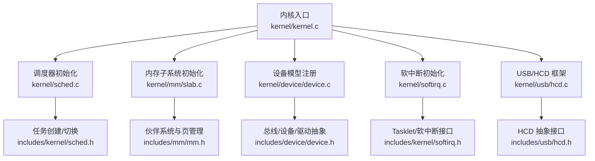
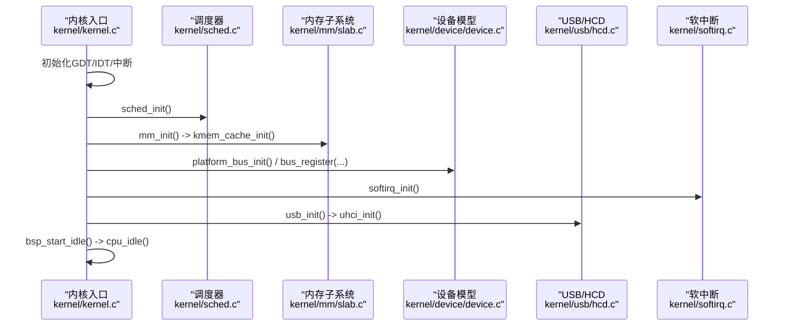
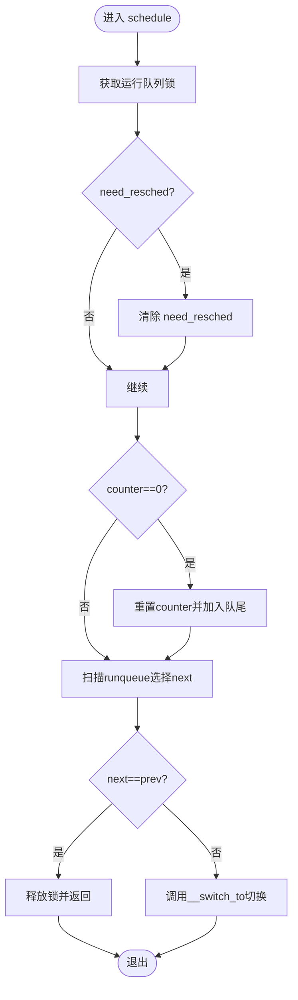
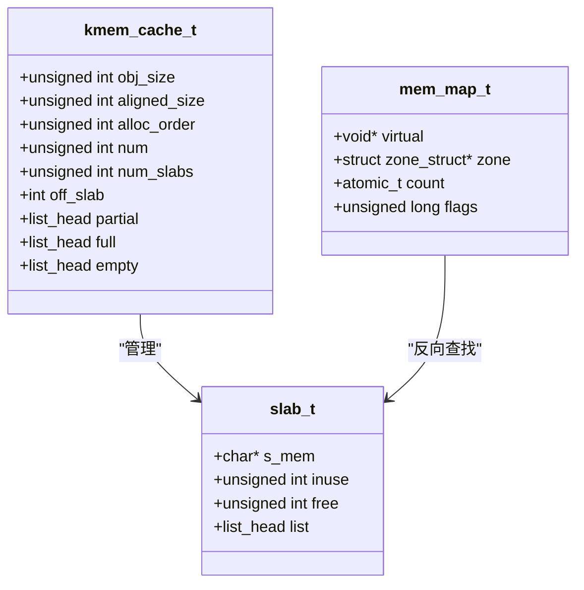
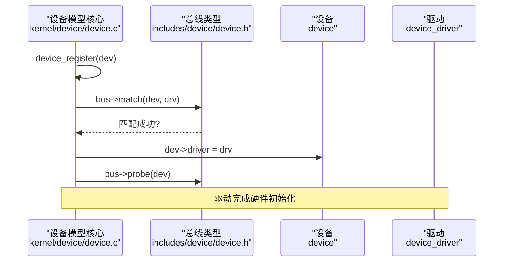
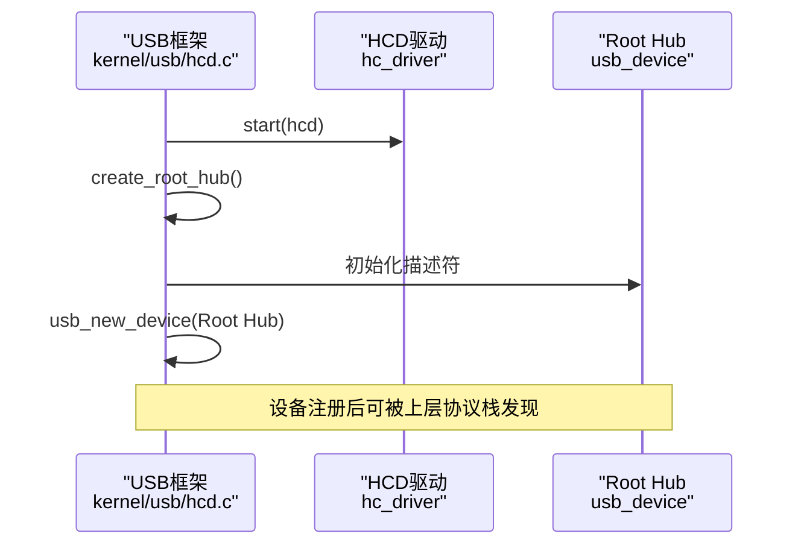
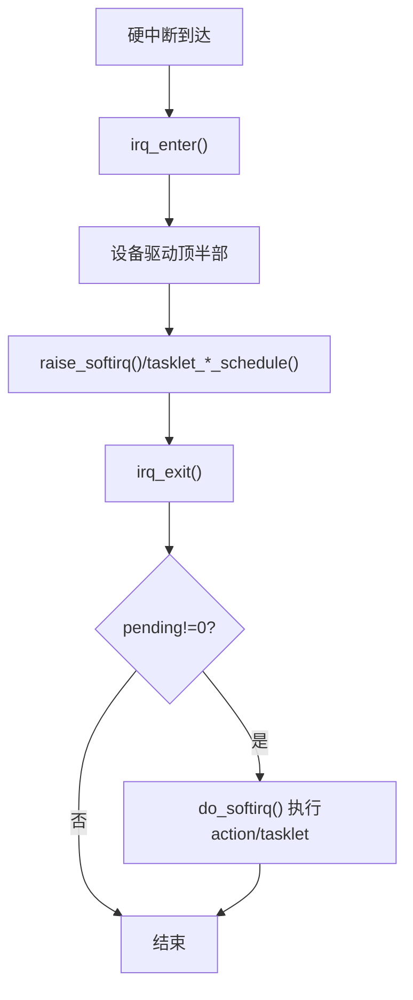
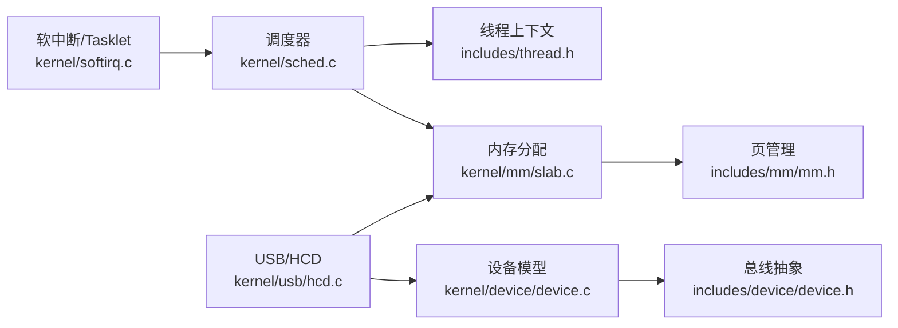

# 系统扩展开发

<cite>
**本文引用的文件**
- [kernel.c](file://kernel/kernel.c)
- [sched.c](file://kernel/sched.c)
- [includes/kernel/sched.h](file://includes/kernel/sched.h)
- [slab.c](file://kernel/mm/slab.c)
- [includes/mm/mm.h](file://includes/mm/mm.h)
- [device.c](file://kernel/device/device.c)
- [includes/device/device.h](file://includes/device/device.h)
- [hcd.c](file://kernel/usb/hcd.c)
- [includes/usb/hcd.h](file://includes/usb/hcd.h)
- [softirq.c](file://kernel/softirq.c)
- [includes/kernel/softirq.h](file://includes/kernel/softirq.h)
- [thread.h](file://includes/thread.h)
</cite>

## 目录
1. [简介](#简介)
2. [项目结构](#项目结构)
3. [核心组件](#核心组件)
4. [架构总览](#架构总览)
5. [详细组件分析](#详细组件分析)
6. [依赖关系分析](#依赖关系分析)
7. [性能考虑](#性能考虑)
8. [故障排查指南](#故障排查指南)
9. [结论](#结论)
10. [附录](#附录)

## 简介
本指南面向希望为 LulaOS 添加新总线类型、内存分配策略与调度算法的开发者。文档基于仓库现有实现，梳理内核子系统边界与扩展点，给出可操作的扩展示例（如自定义调度器、内存分配器、设备框架扩展），并配套测试与验证方法。重点覆盖：
- 调度器钩子与扩展点
- 内存分配器接口与替换策略
- 设备模型与总线扩展点
- 软中断与 Tasklet 作为异步扩展机制
- 模块加载与动态加载现状与建议

## 项目结构
LulaOS 采用分层组织：
- arch/x86：架构相关初始化、页表、中断、SMP 等
- kernel：调度、内存、设备模型、USB、DRM、软中断等核心子系统
- includes：各子系统对外头文件与接口定义
- hal/libs：基础库与工具函数

图表来源
- [kernel.c:73-141](file://kernel/kernel.c#L73-L141)
- [sched.c:76-97](file://kernel/sched.c#L76-L97)
- [slab.c:249-296](file://kernel/mm/slab.c#L249-L296)
- [device.c:22-34](file://kernel/device/device.c#L22-L34)
- [softirq.c:399-414](file://kernel/softirq.c#L399-L414)
- [hcd.c:125-166](file://kernel/usb/hcd.c#L125-L166)

章节来源
- [kernel.c:73-141](file://kernel/kernel.c#L73-L141)

## 核心组件
- 调度器：提供进程/线程生命周期管理、时间片轮转、负载均衡与上下文切换。
- 内存子系统：SLAB 分配器 + 伙伴系统，提供 kmalloc/kfree 通用分配接口。
- 设备模型：bus_type/device/device_driver 统一抽象，支持 match/probe/remove 回调。
- USB/HCD：主机控制器抽象层，封装 Root Hub 创建与控制器生命周期。
- 软中断与 Tasklet：中断下半部机制，提供高/普通优先级任务延迟执行。

章节来源
- [includes/kernel/sched.h:44-143](file://includes/kernel/sched.h#L44-L143)
- [slab.c:506-584](file://kernel/mm/slab.c#L506-L584)
- [includes/device/device.h:32-77](file://includes/device/device.h#L32-L77)
- [includes/usb/hcd.h:28-108](file://includes/usb/hcd.h#L28-L108)
- [includes/kernel/softirq.h:17-99](file://includes/kernel/softirq.h#L17-L99)

## 架构总览
下图展示了启动阶段关键子系统初始化顺序及交互关系，体现扩展点位置。

图表来源
- [kernel.c:73-141](file://kernel/kernel.c#L73-L141)
- [sched.c:76-97](file://kernel/sched.c#L76-L97)
- [slab.c:249-296](file://kernel/mm/slab.c#L249-L296)
- [device.c:22-34](file://kernel/device/device.c#L22-L34)
- [softirq.c:399-414](file://kernel/softirq.c#L399-L414)
- [hcd.c:125-166](file://kernel/usb/hcd.c#L125-L166)

## 详细组件分析

### 调度器扩展：新增调度算法与钩子
- 当前实现要点
  - 每 CPU 运行队列 runqueue_t，按 counter 选择下一个任务。
  - scheduler_tick 递减 counter，置位 need_resched。
  - schedule 负责将耗尽时间片任务放回队尾并选择 next。
  - sys_fork/kernel_thread 支持 KT_BALANCE 负载均衡。
- 可扩展点
  - 在 schedule 中插入“选前/选后”钩子，便于注入新策略（如 O(1) 队列、CFS 思想）。
  - 在 scheduler_tick 中增加“抢占评估”钩子，支持优先级继承或实时任务插队。
  - 在 add_task_to_runqueue/del_task_from_runqueue 处扩展统计与审计。
- 扩展示例：实现“优先级+公平权重”调度
  - 步骤
    1) 在 task_struct 中增加权重字段（参考 includes/kernel/sched.h 中的 task_struct 布局）。
    2) 在 scheduler_tick 中根据权重调整 counter 衰减速度。
    3) 在 schedule 中选择 next 时，优先选取权重最高且 counter 最大的任务。
    4) 在 sys_fork/kernel_thread 中为新任务设置初始权重。
  - 风险与注意
    - 保持对 idle 任务的特殊处理，避免饿死。
    - 保证 SMP 下 per-CPU 运行队列锁的正确使用。
- 验证方法
  - 构造多个不同优先级的内核线程，观察调度时序与公平性。
  - 通过 printk 打印每次 schedule 选择的 prev/next 与 counter。

图表来源
- [sched.c:136-213](file://kernel/sched.c#L136-L213)
- [includes/kernel/sched.h:147-198](file://includes/kernel/sched.h#L147-L198)

章节来源
- [sched.c:136-213](file://kernel/sched.c#L136-L213)
- [includes/kernel/sched.h:44-143](file://includes/kernel/sched.h#L44-L143)

### 内存分配器扩展：替换/增强 kmalloc
- 当前实现要点
  - SLAB 分配器维护多尺寸缓存（kmalloc-32..8192），支持 ON_SLAB/OFF_SLAB。
  - kmalloc 选择最小满足 size 的缓存；kfree 通过 page->virtual 反查 slab 描述符。
  - 伙伴系统提供底层页分配（order 提升以容纳对象）。
- 可扩展点
  - 新增“专用缓存”用于高频小对象，减少碎片。
  - 在 kmem_cache_grow 中引入 NUMA 感知或 per-CPU 缓存池。
  - 在 kmalloc/kfree 路径中加入调试信息（越界检测、泄漏追踪）。
- 扩展示例：实现“带元数据的分配器包装”
  - 步骤
    1) 在 kmalloc 返回前写入固定大小元数据（如 magic、size、caller）。
    2) 在 kfree 前校验元数据，记录异常日志。
    3) 提供统计接口（分配次数、失败次数、峰值占用）。
  - 风险与注意
    - 确保对齐要求（THREAD_SIZE 对齐）不被破坏。
    - OFF_SLAB 模式下需正确维护 backptr。
- 验证方法
  - 压力测试：大量 kmalloc/kfree 循环，检查无泄漏与崩溃。
  - 随机化大小与并发度，验证 SMP 安全性。

图表来源
- [slab.c:130-199](file://kernel/mm/slab.c#L130-L199)
- [includes/mm/mm.h:11-98](file://includes/mm/mm.h#L11-L98)

章节来源
- [slab.c:249-296](file://kernel/mm/slab.c#L249-L296)
- [slab.c:392-502](file://kernel/mm/slab.c#L392-L502)
- [slab.c:506-584](file://kernel/mm/slab.c#L506-L584)
- [includes/mm/mm.h:11-98](file://includes/mm/mm.h#L11-L98)

### 设备框架扩展：新增总线类型
- 当前实现要点
  - bus_type 定义 name/devices/drivers/match/probe/remove。
  - device_register/driver_register 自动触发匹配与 probe。
  - 已存在 Platform/PCI/USB 总线实例（由子系统初始化）。
- 可扩展点
  - 新增 bus_type 实例，实现 match/probe/remove。
  - 在子系统初始化中注册总线，并在枚举阶段注册设备/驱动。
- 扩展示例：实现“虚拟总线 vbus”
  - 步骤
    1) 定义 struct bus_type vbus_type，实现 match/probe/remove。
    2) 在子系统初始化中调用 bus_register(&vbus_type)。
    3) 创建若干 device 与 driver，调用 device_register/driver_register 完成绑定。
  - 风险与注意
    - 确保 device.driver_data 与 driver 私有数据结构一致。
    - remove 中需释放资源，避免悬挂指针。
- 验证方法
  - 打印 match/probe/remove 调用链，确认生命周期。
  - 模拟热插拔：先注册驱动再注册设备，反之亦然。

图表来源
- [device.c:42-87](file://kernel/device/device.c#L42-L87)
- [includes/device/device.h:32-77](file://includes/device/device.h#L32-L77)

章节来源
- [device.c:22-34](file://kernel/device/device.c#L22-L34)
- [device.c:94-164](file://kernel/device/device.c#L94-L164)
- [includes/device/device.h:32-77](file://includes/device/device.h#L32-L77)

### USB/HCD 扩展：新增主机控制器驱动
- 当前实现要点
  - hc_driver 提供 start/stop/reset/urb_enqueue/... 回调。
  - usb_create_hcd/usb_add_hcd 负责创建 HCD、启动硬件、创建 Root Hub 并注册到 USB 总线。
- 可扩展点
  - 实现新的 hc_driver（如 OHCI/EHCI 变体），接入 usb_add_hcd。
  - 在 create_root_hub 中扩展端口枚举与描述符填充。
- 扩展示例：实现“仿真 HCD”
  - 步骤
    1) 定义 hc_driver 并实现 start/stop/urb_enqueue。
    2) 调用 usb_create_hcd 创建实例，随后 usb_add_hcd 启动。
    3) 在 probe 中配置寄存器、开启中断。
  - 风险与注意
    - 确保 Root Hub 描述符符合 USB 规范。
    - 中断路径需与软中断/Tasklet 配合，避免阻塞。
- 验证方法
  - 枚举 Root Hub 与端口状态变化。
  - 发送控制传输，验证响应。

图表来源
- [hcd.c:43-81](file://kernel/usb/hcd.c#L43-L81)
- [hcd.c:125-166](file://kernel/usb/hcd.c#L125-L166)
- [includes/usb/hcd.h:28-108](file://includes/usb/hcd.h#L28-L108)

章节来源
- [hcd.c:88-166](file://kernel/usb/hcd.c#L88-L166)
- [includes/usb/hcd.h:28-108](file://includes/usb/hcd.h#L28-L108)

### 软中断与 Tasklet：异步扩展机制
- 当前实现要点
  - open_softirq/raise_softirq/do_softirq 构成软中断路径。
  - tasklet 提供普通/高优先级两类延迟执行单元。
  - ksoftirqd 守护线程防止风暴。
- 可扩展点
  - 新增软中断向量与 action，承载特定子系统下半部逻辑。
  - 使用 tasklet_schedule/hi_schedule 调度轻量任务。
- 扩展示例：为设备驱动添加“批量上报”tasklet
  - 步骤
    1) 声明 DECLARE_TASKLET(batch_report, report_func, data)。
    2) 在中断顶半部 raise_softirq(TASKLET_SOFTIRQ) 或 hi_schedule。
    3) 在 report_func 中合并多次事件，降低开销。
  - 风险与注意
    - 避免在 tasklet 中长时间阻塞。
    - 合理选择优先级，避免饥饿。
- 验证方法
  - 压测中断频率，观察 do_softirq 执行次数与耗时。
  - 对比启用/禁用 tasklet 的性能差异。

图表来源
- [softirq.c:54-123](file://kernel/softirq.c#L54-L123)
- [softirq.c:231-267](file://kernel/softirq.c#L231-L267)
- [includes/kernel/softirq.h:17-99](file://includes/kernel/softirq.h#L17-L99)

章节来源
- [softirq.c:54-123](file://kernel/softirq.c#L54-L123)
- [softirq.c:231-267](file://kernel/softirq.c#L231-L267)
- [includes/kernel/softirq.h:17-99](file://includes/kernel/softirq.h#L17-L99)

### 模块机制与动态加载
- 现状
  - 仓库未包含完整的可加载模块（ko）机制与动态加载器。
  - 子系统通过静态初始化顺序组合（见 kernel/kernel.c 的初始化序列）。
- 建议方案
  - 设计模块元数据（符号表、依赖、init/exit 函数指针）。
  - 实现 ELF 解析与重定位，按需映射到内核空间。
  - 建立模块注册表，支持 init/exit 生命周期与依赖解析。
  - 与设备模型结合：模块注册 bus/device/driver，触发匹配流程。
- 安全与稳定性
  - 严格校验模块签名与版本兼容性。
  - 隔离模块地址空间，限制可访问符号。
  - 提供回滚与卸载清理能力。

[本节为概念性说明，不直接分析具体文件]

## 依赖关系分析
- 调度器依赖
  - 线程上下文 thread_struct（includes/thread.h）。
  - 自旋锁与 SMP 原语（arch/x86/spinlock.h、smp.h）。
  - 内存分配（kmalloc 来自 slab.c）。
- 内存子系统依赖
  - 伙伴系统与页标志（includes/mm/mm.h）。
  - 全局页数组与 zone 管理（mmzone.h）。
- 设备模型依赖
  - 链表工具（libs/list.h）。
  - 子系统总线（platform/pci/usb）通过 bus_register 注册。
- USB/HCD 依赖
  - 设备模型（device.h）。
  - 内存分配（kmalloc）。
  - 软中断/Tasklet（可选，用于中断下半部）。

图表来源
- [sched.c:136-213](file://kernel/sched.c#L136-L213)
- [includes/thread.h:7-17](file://includes/thread.h#L7-L17)
- [slab.c:506-584](file://kernel/mm/slab.c#L506-L584)
- [includes/mm/mm.h:11-98](file://includes/mm/mm.h#L11-L98)
- [device.c:22-34](file://kernel/device/device.c#L22-L34)
- [includes/device/device.h:32-77](file://includes/device/device.h#L32-L77)
- [hcd.c:125-166](file://kernel/usb/hcd.c#L125-L166)
- [softirq.c:399-414](file://kernel/softirq.c#L399-L414)

章节来源
- [kernel/kernel.c:73-141](file://kernel/kernel.c#L73-L141)

## 性能考虑
- 调度器
  - 减少 schedule 临界区长度，避免持有运行队列锁过久。
  - 利用 per-CPU 运行队列降低竞争。
  - 合理设置 timeslice 与优先级，避免抖动。
- 内存分配
  - 优先使用合适尺寸的 SLAB 缓存，减少跨缓存分配。
  - 避免频繁大对象分配，必要时使用 vmalloc。
  - 监控 OOM 路径，优化 grow 策略。
- 设备模型
  - 在 match/probe 中避免阻塞操作。
  - 批量注册设备/驱动以减少遍历开销。
- USB/HCD
  - 中断下半部尽量轻量化，复杂逻辑放入 tasklet。
  - 合理使用 urb 队列与缓冲，减少拷贝。
- 软中断/Tasklet
  - 控制 tasklet 数量与执行时长，避免抢占过多 CPU。
  - 高优先级 tasklet 仅用于关键路径。

[本节提供一般性指导，不直接分析具体文件]

## 故障排查指南
- 调度器问题
  - 现象：任务饿死、频繁切换。
  - 排查：检查 need_resched 置位路径与 schedule 选择逻辑；打印 runqueue 长度与 counter。
  - 参考路径：[sched.c:136-213](file://kernel/sched.c#L136-L213)
- 内存分配问题
  - 现象：OOM、内存泄漏、越界。
  - 排查：检查 kmalloc/kfree 配对；在 kfree 前校验 PageSlab；增加元数据校验。
  - 参考路径：[slab.c:506-584](file://kernel/mm/slab.c#L506-L584)
- 设备模型问题
  - 现象：驱动未绑定、probe 未调用。
  - 排查：确认 bus_register 成功；检查 match 返回值；打印设备/驱动链表。
  - 参考路径：[device.c:42-87](file://kernel/device/device.c#L42-L87)
- USB/HCD 问题
  - 现象：Root Hub 未注册、端口无响应。
  - 排查：检查 hc_driver->start 返回值；确认 Root Hub 描述符；查看 usb_new_device 结果。
  - 参考路径：[hcd.c:125-166](file://kernel/usb/hcd.c#L125-L166)
- 软中断/Tasklet 问题
  - 现象：中断风暴、任务不执行。
  - 排查：检查 raise_softirq 是否被调用；确认 do_softirq 路径；观察 ksoftirqd 唤醒。
  - 参考路径：[softirq.c:54-123](file://kernel/softirq.c#L54-L123), [softirq.c:231-267](file://kernel/softirq.c#L231-L267)

章节来源
- [sched.c:136-213](file://kernel/sched.c#L136-L213)
- [slab.c:506-584](file://kernel/mm/slab.c#L506-L584)
- [device.c:42-87](file://kernel/device/device.c#L42-L87)
- [hcd.c:125-166](file://kernel/usb/hcd.c#L125-L166)
- [softirq.c:54-123](file://kernel/softirq.c#L54-L123)
- [softirq.c:231-267](file://kernel/softirq.c#L231-L267)

## 结论
LulaOS 提供了清晰的扩展点：
- 调度器：可在 schedule/scheduler_tick 中注入新策略，并通过 per-CPU 运行队列降低竞争。
- 内存子系统：SLAB 分配器支持多尺寸缓存与 OFF_SLAB，适合扩展专用缓存与调试功能。
- 设备模型：bus_type/device/device_driver 抽象便于新增总线与驱动，match/probe/remove 回调清晰。
- USB/HCD：hc_driver 接口标准化控制器驱动接入，便于扩展新型控制器。
- 软中断/Tasklet：提供高效的中断下半部机制，适合异步扩展。

建议在扩展时遵循以下最佳实践：
- 明确子系统边界，仅在对应扩展点修改。
- 保持 SMP 安全，正确使用锁与原子操作。
- 充分测试：单核/多核、压力场景、异常路径。
- 逐步引入新功能，保留回退能力。

[本节总结性内容，不直接分析具体文件]

## 附录
- 快速上手清单
  - 新增调度算法：修改 includes/kernel/sched.h 与 kernel/sched.c 的 schedule/scheduler_tick。
  - 新增内存缓存：在 kernel/mm/slab.c 中创建新缓存并集成到 kmalloc 路径。
  - 新增总线：实现 includes/device/device.h 中 bus_type，并在子系统初始化中注册。
  - 新增 HCD：实现 includes/usb/hcd.h 中 hc_driver，并通过 usb_add_hcd 接入。
  - 新增 Tasklet：使用 includes/kernel/softirq.h 接口，在中断顶半部调度。
- 常用调试技巧
  - 在关键路径添加 printk，输出状态与计数。
  - 使用 bochs/qemu 进行断点与单步调试。
  - 通过 dmesg 风格日志定位问题。

[本节为操作性补充，不直接分析具体文件]