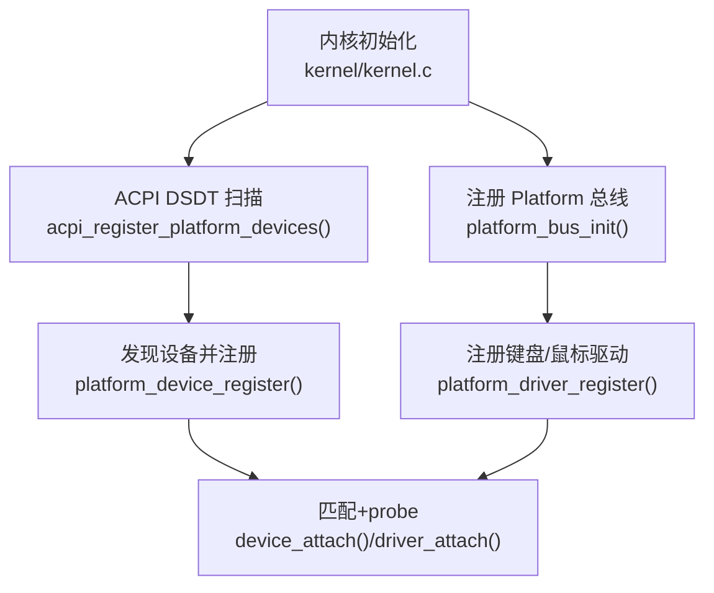
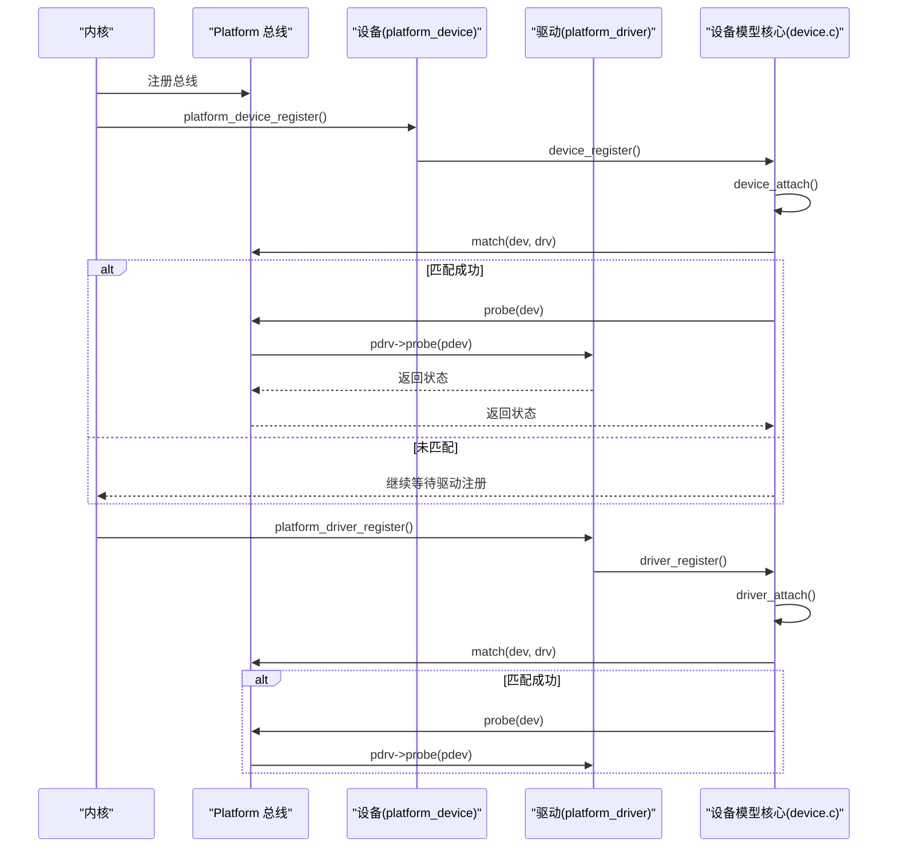
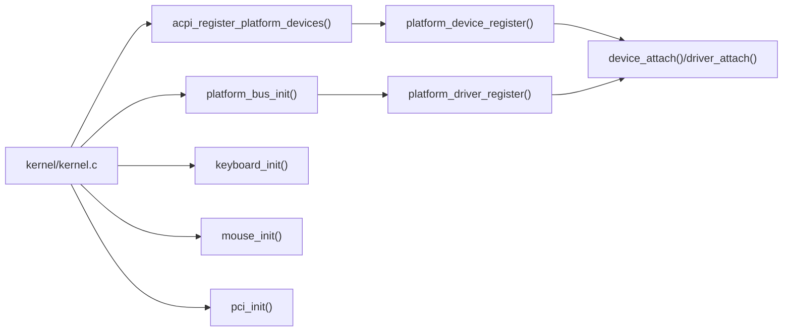

# 设备框架扩展

<cite>
**本文引用的文件**
- [includes/device/device.h](file://includes/device/device.h)
- [kernel/device/device.c](file://kernel/device/device.c)
- [includes/device/platform.h](file://includes/device/platform.h)
- [kernel/device/platform.c](file://kernel/device/platform.c)
- [kernel/device/acpi_dev.c](file://kernel/device/acpi_dev.c)
- [includes/arch/x86/acpi.h](file://includes/arch/x86/acpi.h)
- [kernel/kernel.c](file://kernel/kernel.c)
- [kernel/keyboard.c](file://kernel/keyboard.c)
- [kernel/mouse.c](file://kernel/mouse.c)
- [kernel/i8042.c](file://kernel/i8042.c)
- [includes/pci/pci.h](file://includes/pci/pci.h)
- [kernel/pci/pci.c](file://kernel/pci/pci.c)
</cite>

## 目录
1. [简介](#简介)
2. [项目结构](#项目结构)
3. [核心组件](#核心组件)
4. [架构总览](#架构总览)
5. [详细组件分析](#详细组件分析)
6. [依赖关系分析](#依赖关系分析)
7. [性能考虑](#性能考虑)
8. [故障排查指南](#故障排查指南)
9. [结论](#结论)
10. [附录：扩展示例与最佳实践](#附录扩展示例与最佳实践)

## 简介
本文件面向希望在 LulaOS 上扩展设备驱动框架的开发者，系统阐述统一设备模型的架构设计、设备-驱动绑定流程与生命周期管理，并给出可操作的扩展示例（新增总线类型、设备枚举、电源管理接口扩展）。文档同时提供驱动开发最佳实践、调试技巧与性能优化建议，帮助快速构建稳定高效的设备栈。

## 项目结构
LulaOS 的设备模型采用“总线-设备-驱动”三层抽象：
- 总线层：定义匹配规则与 probe/remove 回调（bus_type）
- 设备层：具体总线设备描述符（如 platform_device、pci_dev）
- 驱动层：具体总线驱动描述符（如 platform_driver、pci_driver）

关键路径与职责：
- includes/device/device.h：总线/设备/驱动的通用结构体与 API 声明
- kernel/device/device.c：总线注册、设备/驱动注册、匹配与绑定核心逻辑
- includes/device/platform.h + kernel/device/platform.c：Platform 总线实现（名称匹配）
- kernel/device/acpi_dev.c：ACPI DSDT 扫描，解析 _HID/_CID/_CRS，生成 Platform 设备并注册
- includes/arch/x86/acpi.h：ACPI 表结构与上下文定义
- kernel/kernel.c：内核初始化流程，按序注册总线、枚举设备、加载驱动
- kernel/keyboard.c / kernel/mouse.c：基于 Platform 总线的键盘/鼠标驱动示例
- kernel/i8042.c：PS/2 控制器驱动，作为平台设备，负责硬件初始化与子设备回退注册
- includes/pci/pci.h + kernel/pci/pci.c：PCI 总线实现（ID 表匹配），展示另一种匹配策略

**图表来源**
- [kernel/kernel.c:96-106](file://kernel/kernel.c#L96-L106)
- [kernel/device/platform.c:70-77](file://kernel/device/platform.c#L70-L77)
- [kernel/device/acpi_dev.c:749-796](file://kernel/device/acpi_dev.c#L749-L796)
- [kernel/device/device.c:94-104](file://kernel/device/device.c#L94-L104)
- [kernel/device/device.c:130-139](file://kernel/device/device.c#L130-L139)

**章节来源**
- [kernel/kernel.c:96-106](file://kernel/kernel.c#L96-L106)
- [kernel/device/platform.c:70-77](file://kernel/device/platform.c#L70-L77)
- [kernel/device/acpi_dev.c:749-796](file://kernel/device/acpi_dev.c#L749-L796)
- [kernel/device/device.c:94-104](file://kernel/device/device.c#L94-L104)
- [kernel/device/device.c:130-139](file://kernel/device/device.c#L130-L139)

## 核心组件
- bus_type：总线抽象，包含 name、devices/drivers 链表以及 match/probe/remove 回调
- device：设备基础结构，嵌入到各总线设备结构体的首成员
- device_driver：驱动基础结构，嵌入到各总线驱动结构体的首成员
- 核心 API：bus_register、device_register、driver_register、device_unregister、driver_unregister

这些组件共同构成统一的设备模型，屏蔽不同总线差异，提供一致的注册、匹配与生命周期管理。

**章节来源**
- [includes/device/device.h:26-77](file://includes/device/device.h#L26-L77)
- [kernel/device/device.c:22-34](file://kernel/device/device.c#L22-L34)
- [kernel/device/device.c:42-87](file://kernel/device/device.c#L42-L87)
- [kernel/device/device.c:94-165](file://kernel/device/device.c#L94-L165)

## 架构总览
统一设备模型通过“总线”将设备与驱动解耦。每种总线实现自己的匹配策略与 probe/remove 转发：
- Platform 总线：基于名称字符串匹配（dev.name == drv->name）
- PCI 总线：基于 vendor/device/class 的 id_table 匹配
- USB 总线：基于设备描述符字段匹配（vendor/product/class/subclass/protocol）

设备注册时加入总线设备链表并尝试匹配已注册驱动；驱动注册时遍历总线设备链表进行匹配。匹配成功后调用总线 probe，完成设备初始化。

**图表来源**
- [kernel/device/platform.c:25-50](file://kernel/device/platform.c#L25-L50)
- [kernel/device/device.c:42-87](file://kernel/device/device.c#L42-L87)
- [kernel/device/device.c:94-139](file://kernel/device/device.c#L94-L139)

**章节来源**
- [kernel/device/platform.c:25-50](file://kernel/device/platform.c#L25-L50)
- [kernel/device/device.c:42-87](file://kernel/device/device.c#L42-L87)
- [kernel/device/device.c:94-139](file://kernel/device/device.c#L94-L139)

## 详细组件分析

### 统一设备模型核心（device.c/device.h）
- 总线注册：初始化设备/驱动链表并加入全局总线列表
- 设备注册：加入总线设备链表，触发 device_attach 尝试匹配
- 驱动注册：加入总线驱动链表，触发 driver_attach 尝试匹配
- 注销流程：移除链表节点，必要时调用 remove 回调清理资源

复杂度与性能：
- 匹配为 O(N) 遍历，N 为同总线上的驱动或设备数量
- 可通过限制总线规模、减少无关驱动/设备提升效率

错误处理：
- 参数校验失败直接返回错误码
- 匹配失败不阻塞后续注册流程

**章节来源**
- [kernel/device/device.c:22-34](file://kernel/device/device.c#L22-L34)
- [kernel/device/device.c:42-87](file://kernel/device/device.c#L42-L87)
- [kernel/device/device.c:94-165](file://kernel/device/device.c#L94-L165)
- [includes/device/device.h:26-77](file://includes/device/device.h#L26-L77)

### Platform 总线（platform.c/platform.h）
- 匹配策略：比较 platform_device.dev.name 与 platform_driver.driver.name
- probe/remove 转发：将统一模型回调转发至 platform_driver 的具体函数
- 资源访问：platform_get_resource 支持 IORESOURCE_MEM/IO/IRQ 索引查找
- 设备查找：platform_find_device 按名称查找设备

典型用途：SoC 内部外设、固定地址设备、由 ACPI/板级代码描述的设备

**章节来源**
- [includes/device/platform.h:28-81](file://includes/device/platform.h#L28-L81)
- [kernel/device/platform.c:15-77](file://kernel/device/platform.c#L15-L77)
- [kernel/device/platform.c:84-160](file://kernel/device/platform.c#L84-L160)

### ACPI 设备枚举（acpi_dev.c + acpi.h）
- 扫描 DSDT AML：解析 Scope/Device/Name 对象，提取 _HID/_CID/_CRS
- 资源转换：将小型/大型资源描述符转换为 platform_resource（IO/MEM/IRQ）
- 设备注册：将解析到的设备以 platform_device 形式注册，供驱动匹配

关键点：
- 仅做只读扫描，不执行 Method
- 若 ACPI 未发现设备，可由控制器驱动（如 i8042）回退注册

**章节来源**
- [kernel/device/acpi_dev.c:22-92](file://kernel/device/acpi_dev.c#L22-L92)
- [kernel/device/acpi_dev.c:328-421](file://kernel/device/acpi_dev.c#L328-L421)
- [kernel/device/acpi_dev.c:632-740](file://kernel/device/acpi_dev.c#L632-L740)
- [kernel/device/acpi_dev.c:749-796](file://kernel/device/acpi_dev.c#L749-L796)
- [includes/arch/x86/acpi.h:202-240](file://includes/arch/x86/acpi.h#L202-L240)

### PS/2 控制器与输入设备（i8042.c, keyboard.c, mouse.c）
- i8042 控制器：自检、启用 AUX、配置中断、鼠标初始化，并在必要时回退注册键盘/鼠标设备
- 键盘驱动：匹配 HID=PNP0303，从资源获取 IRQ，注册中断处理函数
- 鼠标驱动：匹配 HID=PNP0F13，从资源获取 IRQ，注册中断处理函数

该组合展示了“控制器驱动 + 功能驱动”的分层模式，控制器负责硬件初始化，功能驱动专注协议与事件处理。

**章节来源**
- [kernel/i8042.c:128-220](file://kernel/i8042.c#L128-L220)
- [kernel/i8042.c:253-303](file://kernel/i8042.c#L253-L303)
- [kernel/keyboard.c:190-235](file://kernel/keyboard.c#L190-L235)
- [kernel/mouse.c:122-167](file://kernel/mouse.c#L122-L167)

### PCI 总线（pci.h + pci.c）
- 匹配策略：基于 pci_device_id 表（vendor/device/class）匹配
- probe/remove 转发：将统一模型回调转发至 pci_driver 的具体函数
- 设备使能：开启 I/O 和内存空间响应

PCI 总线展示了更复杂的匹配机制，适合热插拔与动态发现场景。

**章节来源**
- [includes/pci/pci.h:78-169](file://includes/pci/pci.h#L78-L169)
- [kernel/pci/pci.c:193-241](file://kernel/pci/pci.c#L193-L241)

## 依赖关系分析
- 内核初始化顺序：先注册总线，再枚举设备，最后注册驱动，确保匹配时机正确
- Platform 总线依赖 ACPI 枚举结果，若无则回退注册
- 输入设备驱动依赖 i8042 控制器初始化完成
- PCI 子系统独立于 Platform，但同样遵循统一模型

**图表来源**
- [kernel/kernel.c:96-127](file://kernel/kernel.c#L96-L127)
- [kernel/device/platform.c:70-114](file://kernel/device/platform.c#L70-L114)
- [kernel/device/device.c:94-139](file://kernel/device/device.c#L94-L139)

**章节来源**
- [kernel/kernel.c:96-127](file://kernel/kernel.c#L96-L127)
- [kernel/device/platform.c:70-114](file://kernel/device/platform.c#L70-L114)
- [kernel/device/device.c:94-139](file://kernel/device/device.c#L94-L139)

## 性能考虑
- 匹配复杂度：O(N) 遍历，建议控制总线规模，避免过多无关驱动/设备
- 资源查找：platform_get_resource 线性扫描，建议合理组织资源数组
- 中断处理：顶半部尽量轻量，避免在 ISR 中执行耗时操作
- 映射与访问：ACPI 扫描使用映射窗口，注意边界检查与超时保护
- 日志输出：生产环境减少 printk 频率，避免影响性能

[本节为通用指导，无需特定文件引用]

## 故障排查指南
常见问题与定位方法：
- 设备未匹配：检查 dev.name 与 drv->name 是否一致（Platform 总线）
- 资源缺失：确认 ACPI _CRS 是否正确解析，或回退设备是否注册
- 中断未触发：验证 IRQ 资源、向量映射与 request_irq 返回值
- 控制器不可用：检查 i8042 自检与配置字节更新结果
- PCI 设备未识别：核对 vendor/device/class 是否在 id_table 中

调试技巧：
- 利用 printk 打印匹配与 probe 过程
- 使用 platform_find_device 验证设备是否存在
- 检查 ACPI 扫描日志，确认 HID/CID/资源信息
- 对 PCI 设备读取配置空间，确认 BAR 与中断引脚

**章节来源**
- [kernel/device/platform.c:119-160](file://kernel/device/platform.c#L119-L160)
- [kernel/device/acpi_dev.c:749-796](file://kernel/device/acpi_dev.c#L749-L796)
- [kernel/keyboard.c:197-218](file://kernel/keyboard.c#L197-L218)
- [kernel/mouse.c:129-150](file://kernel/mouse.c#L129-L150)
- [kernel/i8042.c:128-220](file://kernel/i8042.c#L128-L220)

## 结论
LulaOS 的统一设备模型以 bus_type 为核心，将设备与驱动解耦，提供一致的注册、匹配与生命周期管理。Platform 总线适用于静态/ACPI 描述设备，PCI 总线适用于动态发现设备。通过 ACPI 枚举与控制器回退机制，系统具备良好的兼容性与鲁棒性。扩展新总线时，只需实现 match/probe/remove 与资源管理接口，即可无缝融入现有框架。

[本节为总结，无需特定文件引用]

## 附录：扩展示例与最佳实践

### 新增总线类型（以 SPI/I2C 为例）
步骤：
- 定义总线结构体：实现 bus_type，设置 name、match、probe、remove
- 设备/驱动结构体：在首成员嵌入 struct device/struct device_driver
- 匹配策略：根据总线特性实现 match（如寄存器 ID、设备 ID、兼容性 ID）
- 资源管理：定义资源类型（寄存器基址、中断、DMA 通道等）
- 注册流程：总线初始化后，设备注册触发匹配，驱动注册触发匹配

参考实现模式：
- Platform 总线名称匹配
- PCI 总线 ID 表匹配
- USB 总线描述符匹配

**章节来源**
- [includes/device/device.h:26-77](file://includes/device/device.h#L26-L77)
- [kernel/device/platform.c:25-50](file://kernel/device/platform.c#L25-L50)
- [kernel/pci/pci.c:193-241](file://kernel/pci/pci.c#L193-L241)

### 设备枚举功能扩展
- ACPI 扫描：完善 Scope 递归解析，支持更多 AML 对象与资源类型
- 板级枚举：在板级代码中构造设备并注册，用于无 ACPI 环境
- 动态枚举：总线扫描（如 PCI/USB）动态发现设备并注册

**章节来源**
- [kernel/device/acpi_dev.c:632-740](file://kernel/device/acpi_dev.c#L632-L740)
- [kernel/device/acpi_dev.c:749-796](file://kernel/device/acpi_dev.c#L749-L796)

### 电源管理接口扩展
- 在 bus_type 中增加 suspend/resume 回调，或在 device_driver 中增加 pm 相关接口
- 在 probe 中记录电源状态，在 remove/unregister 中恢复状态
- 结合 ACPI _PS0/_PS3 等方法（如需）

[本节为概念性扩展，无需特定文件引用]

### 驱动开发最佳实践
- 明确分层：控制器驱动负责硬件初始化，功能驱动专注协议与事件
- 资源管理：严格申请/释放资源，避免泄漏与冲突
- 错误处理：所有外部调用检查返回值，失败时清理已分配资源
- 并发安全：使用锁保护共享数据结构，避免竞态条件
- 日志与调试：合理使用 printk，区分调试与生产环境

**章节来源**
- [kernel/i8042.c:128-220](file://kernel/i8042.c#L128-L220)
- [kernel/keyboard.c:197-218](file://kernel/keyboard.c#L197-L218)
- [kernel/mouse.c:129-150](file://kernel/mouse.c#L129-L150)

### 调试技巧
- 打印匹配与 probe 过程，确认设备/驱动是否成功绑定
- 检查 ACPI 扫描结果，确认 HID/CID/资源信息
- 使用 platform_find_device 验证设备存在性
- 对 PCI 设备读取配置空间，确认 BAR 与中断引脚

**章节来源**
- [kernel/device/platform.c:119-160](file://kernel/device/platform.c#L119-L160)
- [kernel/device/acpi_dev.c:749-796](file://kernel/device/acpi_dev.c#L749-L796)
- [kernel/pci/pci.c:193-241](file://kernel/pci/pci.c#L193-L241)

### 性能优化建议
- 减少不必要的 printk 与复杂计算在中断上下文中
- 优化匹配算法，避免全量遍历（如引入哈希或索引）
- 批量处理资源与数据，减少频繁 I/O
- 使用缓存与预取降低延迟

[本节为通用指导，无需特定文件引用]