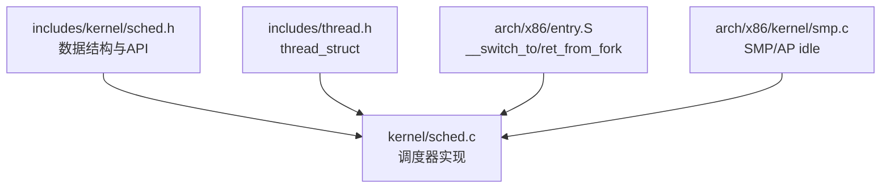
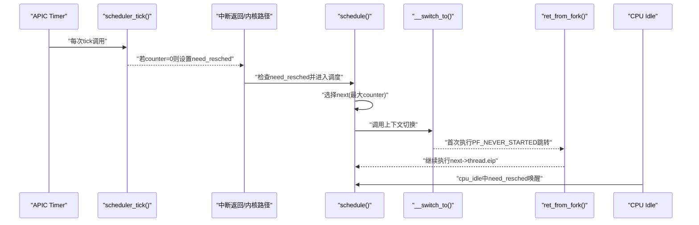
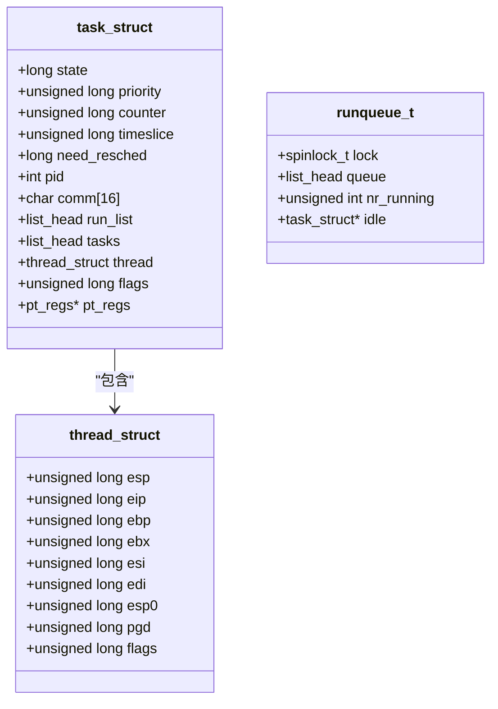
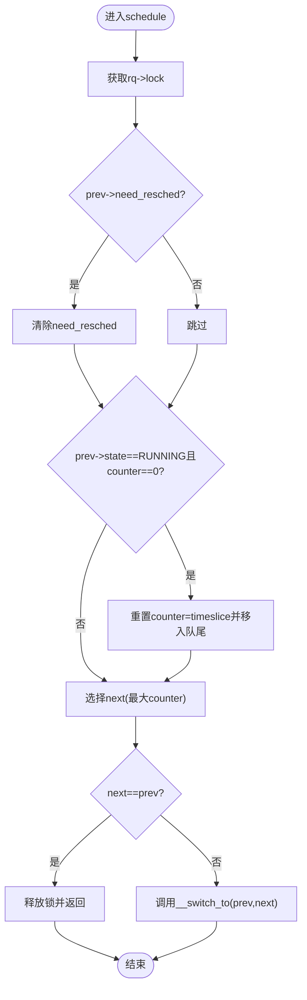
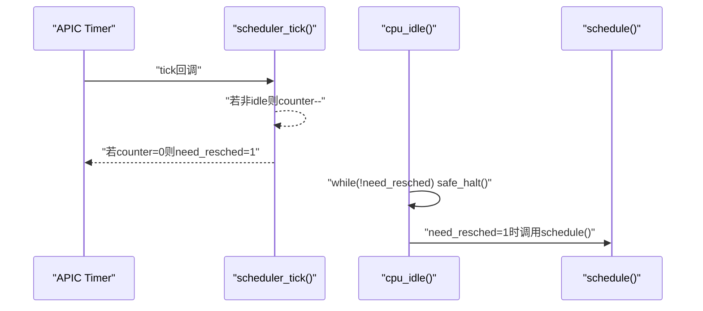
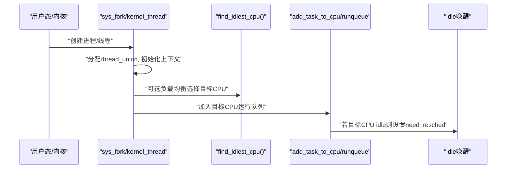
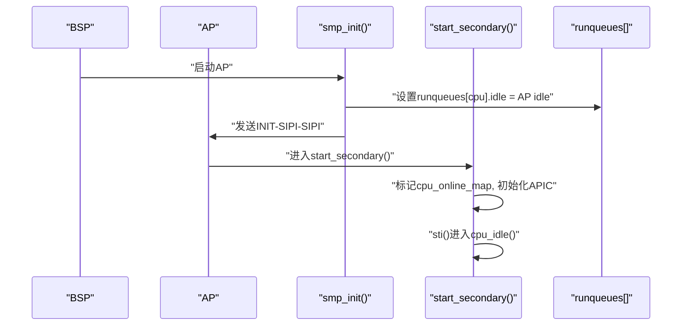
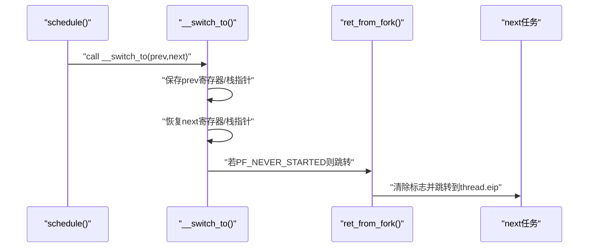
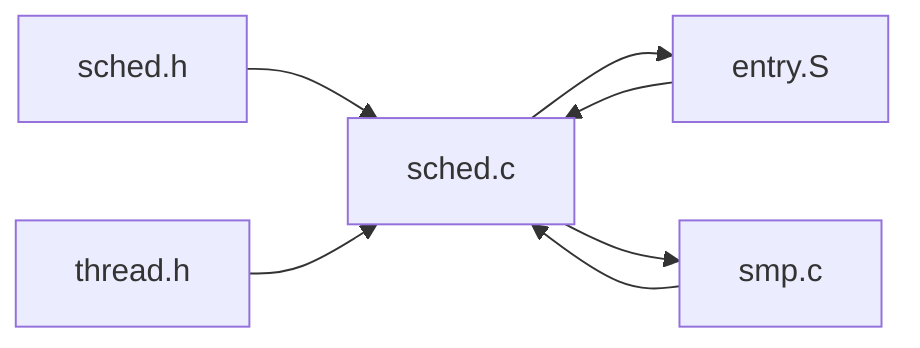

# 调度器扩展开发

<cite>
**本文引用的文件**
- [kernel/sched.c](file://kernel/sched.c)
- [includes/kernel/sched.h](file://includes/kernel/sched.h)
- [includes/thread.h](file://includes/thread.h)
- [arch/x86/entry.S](file://arch/x86/entry.S)
- [arch/x86/kernel/smp.c](file://arch/x86/kernel/smp.c)
</cite>

## 目录
1. [简介](#简介)
2. [项目结构](#项目结构)
3. [核心组件](#核心组件)
4. [架构总览](#架构总览)
5. [详细组件分析](#详细组件分析)
6. [依赖关系分析](#依赖关系分析)
7. [性能考虑](#性能考虑)
8. [故障排查指南](#故障排查指南)
9. [结论](#结论)
10. [附录：扩展与优化实践](#附录：扩展与优化实践)

## 简介
本文件面向希望在LulaOS上扩展调度器的开发者，目标是深入解释如何扩展现有的时间片轮转调度算法，包括：
- 添加新的调度策略（如优先级调度、实时调度）
- 实现自定义调度钩子与统计信息
- 优化调度性能
- 扩展 task_struct、运行队列以及SMP环境下的同步机制
- 提供具体代码示例路径，展示如何实现自定义调度算法、添加调试功能与性能分析

当前LulaOS采用“静态优先级 + 时间片轮转”的简化调度策略：每个tick递减counter，counter为0时设置need_resched；schedule()选择counter最大的可运行任务。该设计简单直观，便于扩展为更复杂的调度策略。

## 项目结构
与调度器直接相关的核心文件如下：
- includes/kernel/sched.h：定义task_struct、runqueue_t、调度常量与API
- kernel/sched.c：调度器实现（初始化、schedule、scheduler_tick、进程创建/退出等）
- includes/thread.h：线程上下文thread_struct定义
- arch/x86/entry.S：__switch_to与ret_from_fork等上下文切换汇编
- arch/x86/kernel/smp.c：SMP启动与AP idle任务注册

**图表来源**
- [includes/kernel/sched.h:44-89](file://includes/kernel/sched.h#L44-L89)
- [kernel/sched.c:76-97](file://kernel/sched.c#L76-L97)
- [includes/thread.h:7-17](file://includes/thread.h#L7-L17)
- [arch/x86/entry.S:520-610](file://arch/x86/entry.S#L520-L610)
- [arch/x86/kernel/smp.c:118-180](file://arch/x86/kernel/smp.c#L118-L180)

**章节来源**
- [includes/kernel/sched.h:21-89](file://includes/kernel/sched.h#L21-L89)
- [kernel/sched.c:76-97](file://kernel/sched.c#L76-L97)
- [includes/thread.h:7-17](file://includes/thread.h#L7-L17)
- [arch/x86/entry.S:520-610](file://arch/x86/entry.S#L520-L610)
- [arch/x86/kernel/smp.c:118-180](file://arch/x86/kernel/smp.c#L118-L180)

## 核心组件
- task_struct：保存调度状态、优先级、时间片、链表节点、CPU上下文等
- runqueue_t：每CPU运行队列，包含自旋锁、可运行任务链表、计数与idle指针
- thread_struct：保存切换所需的寄存器与页目录基址
- schedule()：调度主入口，负责选择下一个任务并触发上下文切换
- scheduler_tick()：定时器回调，递减counter并置位need_resched
- cpu_idle()：空闲循环，等待need_resched后调用schedule()
- SMP支持：find_idlest_cpu()负载均衡，smp_init/start_secondary管理AP idle

**章节来源**
- [includes/kernel/sched.h:44-89](file://includes/kernel/sched.h#L44-L89)
- [kernel/sched.c:136-213](file://kernel/sched.c#L136-L213)
- [kernel/sched.c:223-237](file://kernel/sched.c#L223-L237)
- [kernel/sched.c:250-259](file://kernel/sched.c#L250-L259)
- [kernel/sched.c:108-124](file://kernel/sched.c#L108-L124)
- [arch/x86/kernel/smp.c:233-276](file://arch/x86/kernel/smp.c#L233-L276)

## 架构总览
下图展示了调度器在系统启动、定时中断、进程创建与上下文切换中的交互关系。

**图表来源**
- [kernel/sched.c:223-237](file://kernel/sched.c#L223-L237)
- [kernel/sched.c:136-213](file://kernel/sched.c#L136-L213)
- [arch/x86/entry.S:520-610](file://arch/x86/entry.S#L520-L610)
- [kernel/sched.c:250-259](file://kernel/sched.c#L250-L259)

## 详细组件分析

### 数据结构与内存布局
- task_struct字段：state、priority、counter、timeslice、need_resched、pid、comm、run_list、tasks、thread、flags、pt_regs
- runqueue_t字段：lock、queue、nr_running、idle
- thread_union：将task_struct与8KB内核栈合并，current通过esp屏蔽低13位定位

**图表来源**
- [includes/kernel/sched.h:44-89](file://includes/kernel/sched.h#L44-L89)
- [includes/thread.h:7-17](file://includes/thread.h#L7-L17)

**章节来源**
- [includes/kernel/sched.h:44-89](file://includes/kernel/sched.h#L44-L89)
- [includes/thread.h:7-17](file://includes/thread.h#L7-L17)

### 调度主流程与选择策略
- schedule()获取rq锁，处理prev的counter与need_resched，遍历runqueue选择counter最大的TASK_RUNNING任务
- 若next==prev则跳过切换
- 通过内联汇编调用__switch_to完成上下文切换

**图表来源**
- [kernel/sched.c:136-213](file://kernel/sched.c#L136-L213)

**章节来源**
- [kernel/sched.c:136-213](file://kernel/sched.c#L136-L213)

### 定时器Tick与Idle循环
- scheduler_tick()对非idle任务递减counter，counter为0时设置need_resched
- cpu_idle()循环safe_halt等待need_resched，然后调用schedule()

**图表来源**
- [kernel/sched.c:223-237](file://kernel/sched.c#L223-L237)
- [kernel/sched.c:250-259](file://kernel/sched.c#L250-L259)

**章节来源**
- [kernel/sched.c:223-237](file://kernel/sched.c#L223-L237)
- [kernel/sched.c:250-259](file://kernel/sched.c#L250-L259)

### 进程创建与加入运行队列
- sys_fork()与kernel_thread()分配thread_union，复制父进程上下文，设置初始栈帧与eip
- 根据fork_flags或flags选择目标CPU（KT_BALANCE使用find_idlest_cpu），将任务加入对应runqueue
- add_task_to_runqueue()/add_task_to_cpu()维护nr_running并在idle情况下唤醒目标CPU

**图表来源**
- [kernel/sched.c:275-356](file://kernel/sched.c#L275-L356)
- [kernel/sched.c:369-433](file://kernel/sched.c#L369-L433)
- [kernel/sched.c:108-124](file://kernel/sched.c#L108-L124)
- [includes/kernel/sched.h:147-181](file://includes/kernel/sched.h#L147-L181)

**章节来源**
- [kernel/sched.c:275-356](file://kernel/sched.c#L275-L356)
- [kernel/sched.c:369-433](file://kernel/sched.c#L369-L433)
- [includes/kernel/sched.h:147-181](file://includes/kernel/sched.h#L147-L181)

### SMP环境与同步机制
- smp_init()为每个AP分配独立idle任务，设置ap_stack_start.esp与runqueues[cpu].idle，并通过wbinvd确保可见性
- start_secondary()标记在线、初始化APIC、开中断并进入cpu_idle()
- find_idlest_cpu()扫描在线CPU，选择nr_running最小的逻辑CPU进行负载均衡

**图表来源**
- [arch/x86/kernel/smp.c:118-180](file://arch/x86/kernel/smp.c#L118-L180)
- [arch/x86/kernel/smp.c:233-276](file://arch/x86/kernel/smp.c#L233-L276)

**章节来源**
- [arch/x86/kernel/smp.c:118-180](file://arch/x86/kernel/smp.c#L118-L180)
- [arch/x86/kernel/smp.c:233-276](file://arch/x86/kernel/smp.c#L233-L276)

### 上下文切换与首次执行
- __switch_to()保存prev寄存器到thread_struct，恢复next寄存器，必要时切换CR3
- 若next->flags含PF_NEVER_STARTED，跳转到ret_from_fork清除标志并跳转到thread.eip

**图表来源**
- [arch/x86/entry.S:520-610](file://arch/x86/entry.S#L520-L610)

**章节来源**
- [arch/x86/entry.S:520-610](file://arch/x86/entry.S#L520-L610)

## 依赖关系分析
- sched.c依赖sched.h的数据结构与API、thread.h的thread_struct、entry.S的__switch_to/ret_from_fork、smp.c的SMP支持
- 运行时依赖：APIC Timer触发scheduler_tick，中断返回路径检查need_resched并调用schedule()
- 关键耦合点：
  - task_struct字段偏移与entry.S硬编码偏移必须一致
  - runqueues[NR_CPUS]与SMP初始化顺序需严格同步
  - current宏依赖THREAD_SIZE对齐的thread_union布局

**图表来源**
- [includes/kernel/sched.h:128-143](file://includes/kernel/sched.h#L128-L143)
- [kernel/sched.c:28-37](file://kernel/sched.c#L28-L37)
- [arch/x86/entry.S:520-610](file://arch/x86/entry.S#L520-L610)
- [arch/x86/kernel/smp.c:15-25](file://arch/x86/kernel/smp.c#L15-L25)

**章节来源**
- [includes/kernel/sched.h:128-143](file://includes/kernel/sched.h#L128-L143)
- [kernel/sched.c:28-37](file://kernel/sched.c#L28-L37)
- [arch/x86/entry.S:520-610](file://arch/x86/entry.S#L520-L610)
- [arch/x86/kernel/smp.c:15-25](file://arch/x86/kernel/smp.c#L15-L25)

## 性能考虑
- 选择策略复杂度：O(n)遍历runqueue，n为可运行任务数；可通过多级队列或红黑树优化
- 锁粒度：rq->lock保护runqueue操作，减少竞争可提升多核性能
- 时间片大小：MIN_TIMESLICE~MAX_TIMESLICE影响响应性与吞吐；可根据负载动态调整
- 负载均衡：find_idlest_cpu()基于nr_running，可扩展为考虑cache亲和性或权重
- 上下文切换开销：__switch_to最小化寄存器保存/恢复，避免不必要的CR3切换

[本节为通用性能讨论，不直接分析具体文件]

## 故障排查指南
- 常见错误：
  - task_struct字段偏移与entry.S不一致导致上下文损坏
  - AP idle未正确注册导致Timer中断误减counter引发异常
  - rq->idle->need_resched未设置导致新任务饿死
- 调试建议：
  - 打印调度事件（fork、sleep、exit、schedule选择）
  - 检查runqueue链表完整性与nr_running一致性
  - 验证current宏指向正确的task_struct

**章节来源**
- [kernel/sched.c:437-478](file://kernel/sched.c#L437-L478)
- [arch/x86/kernel/smp.c:118-180](file://arch/x86/kernel/smp.c#L118-L180)
- [includes/kernel/sched.h:147-181](file://includes/kernel/sched.h#L147-L181)

## 结论
LulaOS调度器提供了简洁的时间片轮转基础，具备清晰的扩展点：
- 可在schedule()中替换选择策略以支持优先级或实时调度
- 可在scheduler_tick()中引入动态时间片或CFS类算法
- 可在task_struct中添加统计字段并在关键路径更新
- 可在SMP路径增强负载均衡与缓存亲和性
- 保持task_struct偏移与entry.S一致，确保上下文切换安全

[本节为总结性内容，不直接分析具体文件]

## 附录：扩展与优化实践

### 添加新的调度策略（优先级/实时）
- 在task_struct中增加调度相关字段（如policy、rt_priority、vruntime等）
- 修改schedule()的选择逻辑：按优先级排序或使用虚拟时钟
- 在scheduler_tick()中更新虚拟时钟或剩余时间
- 参考路径：
  - [includes/kernel/sched.h:44-89](file://includes/kernel/sched.h#L44-L89)
  - [kernel/sched.c:136-213](file://kernel/sched.c#L136-L213)
  - [kernel/sched.c:223-237](file://kernel/sched.c#L223-L237)

### 实现自定义调度钩子
- 在schedule()前后插入钩子函数（如pre_schedule/post_schedule）
- 在scheduler_tick()中记录时间片消耗与调度次数
- 在进程创建/退出路径添加统计更新
- 参考路径：
  - [kernel/sched.c:136-213](file://kernel/sched.c#L136-L213)
  - [kernel/sched.c:275-356](file://kernel/sched.c#L275-L356)
  - [kernel/sched.c:437-478](file://kernel/sched.c#L437-L478)

### 扩展task_struct与运行队列
- 在task_struct中添加统计字段（如sched_count、last_runtime）
- 在runqueue_t中添加统计（如total_switches、avg_wait_time）
- 在关键路径更新这些字段，并提供导出接口供调试
- 参考路径：
  - [includes/kernel/sched.h:44-89](file://includes/kernel/sched.h#L44-L89)
  - [includes/kernel/sched.h:84-89](file://includes/kernel/sched.h#L84-L89)

### SMP环境下的调度器同步机制
- 使用rq->lock保护runqueue操作
- 在负载均衡时读取nr_running并选择最空闲CPU
- 确保AP idle正确注册并设置rq->idle
- 参考路径：
  - [kernel/sched.c:108-124](file://kernel/sched.c#L108-L124)
  - [arch/x86/kernel/smp.c:118-180](file://arch/x86/kernel/smp.c#L118-L180)
  - [arch/x86/kernel/smp.c:233-276](file://arch/x86/kernel/smp.c#L233-L276)

### 性能分析与调优指南
- 分析schedule()选择复杂度与runqueue长度
- 调整时间片大小以平衡响应性与吞吐
- 评估负载均衡效果与迁移成本
- 监控上下文切换频率与锁竞争
- 参考路径：
  - [kernel/sched.c:136-213](file://kernel/sched.c#L136-L213)
  - [kernel/sched.c:223-237](file://kernel/sched.c#L223-L237)
  - [kernel/sched.c:108-124](file://kernel/sched.c#L108-L124)