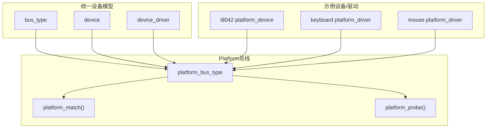
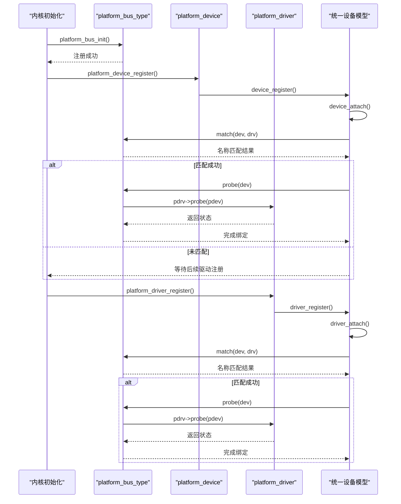
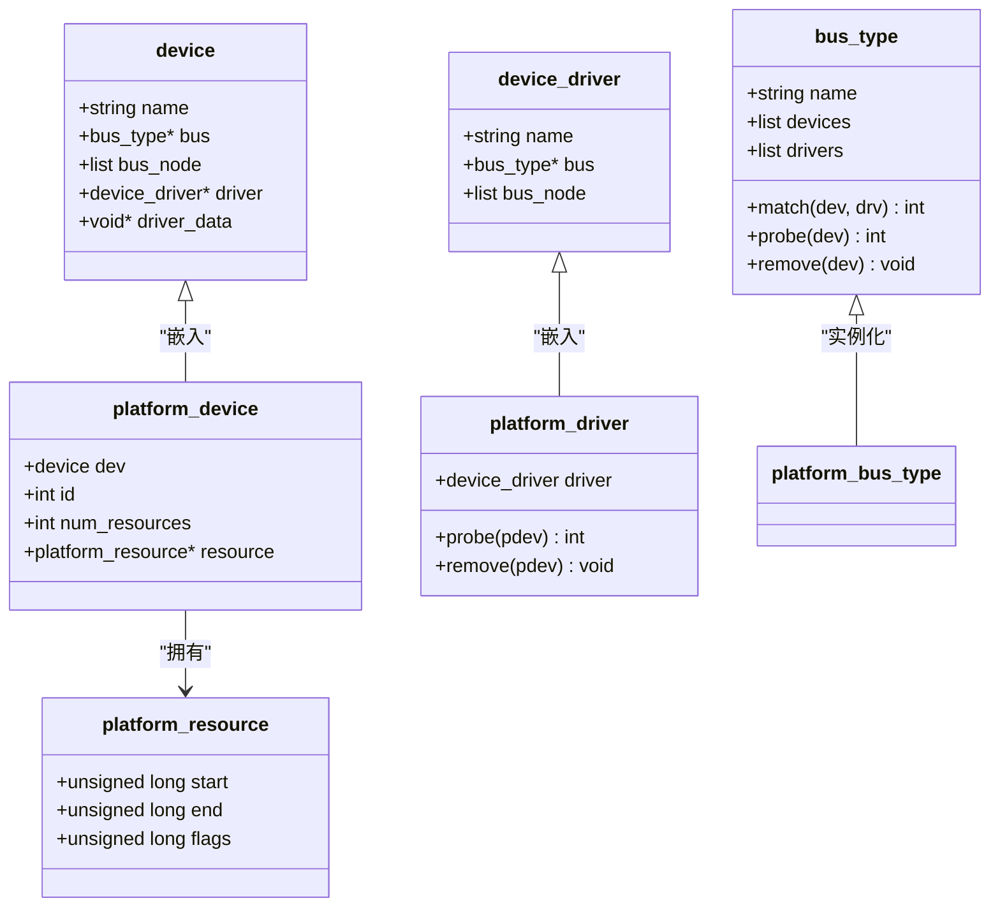
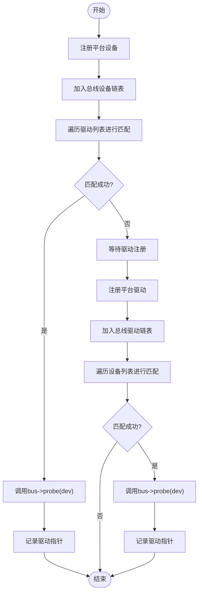
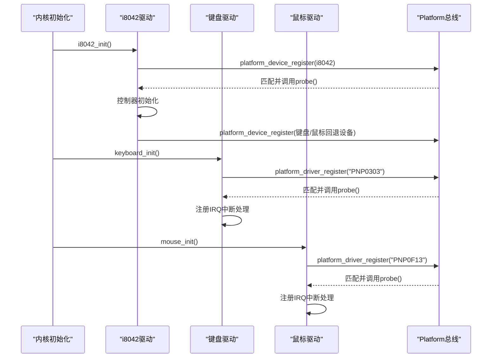

# Platform总线概念与设计

<cite>
**本文引用的文件**
- [includes/device/platform.h](file://includes/device/platform.h)
- [kernel/device/platform.c](file://kernel/device/platform.c)
- [includes/device/device.h](file://includes/device/device.h)
- [kernel/device/device.c](file://kernel/device/device.c)
- [kernel/kernel.c](file://kernel/kernel.c)
- [kernel/i8042.c](file://kernel/i8042.c)
- [kernel/keyboard.c](file://kernel/keyboard.c)
- [kernel/mouse.c](file://kernel/mouse.c)
</cite>

## 目录
1. [简介](#简介)
2. [项目结构](#项目结构)
3. [核心组件](#核心组件)
4. [架构总览](#架构总览)
5. [详细组件分析](#详细组件分析)
6. [依赖关系分析](#依赖关系分析)
7. [性能考量](#性能考量)
8. [故障排查指南](#故障排查指南)
9. [结论](#结论)
10. [附录](#附录)

## 简介
本文件面向LulaOS的Platform总线，系统性阐述其设计理念、适用场景、与PCI/USB等总线的差异与优势，并深入解析设备模型数据结构（device_driver、platform_device等）、匹配机制（名称匹配策略）、以及它在系统架构中的位置与作用。文档通过架构图与数据流图展示组件间关系，帮助读者理解Platform总线如何简化嵌入式设备的驱动开发。

## 项目结构
LulaOS将“统一设备模型”抽象为bus_type/device/device_driver，Platform总线作为其中一种总线类型实现，提供基于名称的设备/驱动匹配能力。关键文件分布如下：
- 统一设备模型接口与实现：includes/device/device.h、kernel/device/device.c
- Platform总线定义与实现：includes/device/platform.h、kernel/device/platform.c
- 内核初始化流程：kernel/kernel.c
- 使用Platform总线的示例：PS/2控制器（i8042）及其键盘/鼠标驱动：kernel/i8042.c、kernel/keyboard.c、kernel/mouse.c

图表来源
- [includes/device/device.h:32-66](file://includes/device/device.h#L32-L66)
- [kernel/device/device.c:22-87](file://kernel/device/device.c#L22-L87)
- [includes/device/platform.h:44-60](file://includes/device/platform.h#L44-L60)
- [kernel/device/platform.c:15-77](file://kernel/device/platform.c#L15-L77)

章节来源
- [includes/device/device.h:1-80](file://includes/device/device.h#L1-L80)
- [kernel/device/device.c:1-165](file://kernel/device/device.c#L1-L165)
- [includes/device/platform.h:1-84](file://includes/device/platform.h#L1-L84)
- [kernel/device/platform.c:1-160](file://kernel/device/platform.c#L1-L160)

## 核心组件
- bus_type：总线类型抽象，包含name、devices/drivers链表以及match/probe/remove回调。每种总线（如PCI、Platform、USB）各有一个实例。
- device：设备基础结构，包含name、所属总线指针、总线节点、已绑定驱动指针及私有数据。
- device_driver：驱动基础结构，包含name、所属总线指针、总线节点。
- platform_device：Platform设备描述符，嵌入device，并提供资源数组（MMIO/I/O端口/IRQ）。
- platform_driver：Platform驱动描述符，嵌入device_driver，并提供probe/remove回调。
- platform_bus_type：Platform总线实例，注册后提供名称匹配与probe转发。

章节来源
- [includes/device/device.h:32-66](file://includes/device/device.h#L32-L66)
- [includes/device/platform.h:28-60](file://includes/device/platform.h#L28-L60)

## 架构总览
Platform总线在系统架构中位于“统一设备模型”层之上，负责管理非即插即用或固定地址设备的发现与绑定。它不关心底层物理总线细节，仅通过名称匹配将设备与驱动关联，并在匹配成功后调用驱动的probe完成硬件初始化。

图表来源
- [kernel/device/platform.c:70-114](file://kernel/device/platform.c#L70-L114)
- [kernel/device/device.c:94-139](file://kernel/device/device.c#L94-L139)

章节来源
- [kernel/kernel.c:96-109](file://kernel/kernel.c#L96-L109)
- [kernel/device/platform.c:70-114](file://kernel/device/platform.c#L70-L114)
- [kernel/device/device.c:94-139](file://kernel/device/device.c#L94-L139)

## 详细组件分析

### Platform总线的数据结构与职责
- platform_resource：描述MMIO范围、I/O端口范围或IRQ号，支持标志位区分资源类型。
- platform_device：嵌入device，维护id、资源数组与数量；通过dev.name参与匹配。
- platform_driver：嵌入device_driver，提供probe/remove回调；通过driver.name参与匹配。
- platform_bus_type：设置match/probe/remove回调，并注册到全局总线链表中。

图表来源
- [includes/device/device.h:32-66](file://includes/device/device.h#L32-L66)
- [includes/device/platform.h:28-60](file://includes/device/platform.h#L28-L60)

章节来源
- [includes/device/platform.h:28-60](file://includes/device/platform.h#L28-L60)
- [kernel/device/platform.c:15-77](file://kernel/device/platform.c#L15-L77)

### 设备与驱动的匹配机制
- 匹配策略：Platform总线采用“名称匹配”，比较platform_device.dev.name与platform_driver.driver.name是否相等。
- 触发时机：
  - 设备注册时：遍历该总线上的所有驱动，尝试匹配，成功后调用probe。
  - 驱动注册时：遍历该总线上的所有设备，尝试匹配，成功后调用probe。
- 资源访问：驱动在probe中通过platform_get_resource按类型和序号获取资源（如IRQ、MMIO、I/O端口）。

图表来源
- [kernel/device/device.c:42-87](file://kernel/device/device.c#L42-L87)
- [kernel/device/platform.c:25-50](file://kernel/device/platform.c#L25-L50)

章节来源
- [kernel/device/device.c:42-87](file://kernel/device/device.c#L42-L87)
- [kernel/device/platform.c:25-50](file://kernel/device/platform.c#L25-L50)

### 典型用例：PS/2控制器与键盘/鼠标
- i8042控制器：作为Platform设备注册，probe中完成控制器自检、端口启用、配置字节读写、鼠标初始化，并回退注册键盘/鼠标子设备（若ACPI未发现）。
- 键盘驱动：作为Platform驱动注册，名称匹配“PNP0303”，probe中从设备资源获取IRQ并注册中断处理函数。
- 鼠标驱动：作为Platform驱动注册，名称匹配“PNP0F13”，probe中从设备资源获取IRQ并注册中断处理函数。

图表来源
- [kernel/i8042.c:267-303](file://kernel/i8042.c#L267-L303)
- [kernel/keyboard.c:197-234](file://kernel/keyboard.c#L197-L234)
- [kernel/mouse.c:129-166](file://kernel/mouse.c#L129-L166)
- [kernel/device/platform.c:84-114](file://kernel/device/platform.c#L84-L114)

章节来源
- [kernel/i8042.c:267-303](file://kernel/i8042.c#L267-L303)
- [kernel/keyboard.c:197-234](file://kernel/keyboard.c#L197-L234)
- [kernel/mouse.c:129-166](file://kernel/mouse.c#L129-L166)

### 与其他总线类型的区别与优势
- PCI总线：基于枚举与配置空间发现设备，适合可热插拔与复杂拓扑；Platform总线适用于固定地址、非即插即用设备（SoC内部外设、PS/2控制器、中断控制器等），无需复杂枚举。
- USB总线：动态枚举与分层协议栈；Platform总线更轻量，直接通过名称匹配与资源描述完成绑定，降低嵌入式设备驱动复杂度。
- 优势：简单直观、易于扩展、资源描述清晰（MMIO/I/O/IRQ），便于在板级代码或ACPI/DTS中声明设备信息。

[本节为概念性说明，不直接分析具体文件]

## 依赖关系分析
- 统一设备模型依赖：bus_type/device/device_driver提供通用框架。
- Platform总线依赖：实现match/probe/remove，并通过device_register/driver_register触发匹配。
- 示例驱动依赖：i8042/keyboard/mouse通过platform_device_register/platform_driver_register接入总线。

图表来源
- [includes/device/device.h:32-66](file://includes/device/device.h#L32-L66)
- [kernel/device/platform.c:15-77](file://kernel/device/platform.c#L15-L77)
- [kernel/i8042.c:267-303](file://kernel/i8042.c#L267-L303)
- [kernel/keyboard.c:197-234](file://kernel/keyboard.c#L197-L234)
- [kernel/mouse.c:129-166](file://kernel/mouse.c#L129-L166)

章节来源
- [includes/device/device.h:32-66](file://includes/device/device.h#L32-L66)
- [kernel/device/platform.c:15-77](file://kernel/device/platform.c#L15-L77)
- [kernel/i8042.c:267-303](file://kernel/i8042.c#L267-L303)
- [kernel/keyboard.c:197-234](file://kernel/keyboard.c#L197-L234)
- [kernel/mouse.c:129-166](file://kernel/mouse.c#L129-L166)

## 性能考量
- 匹配复杂度：名称匹配为O(N)遍历，N为同总线设备/驱动数量；对于少量设备影响可忽略。
- 资源查询：platform_get_resource线性扫描资源数组，建议合理组织资源顺序以减少查找次数。
- 初始化顺序：确保platform_bus_init先于设备/驱动注册；设备与驱动注册顺序不影响最终绑定（双向匹配）。

[本节提供一般性指导，不直接分析具体文件]

## 故障排查指南
- 设备无名称：platform_device_register会检查dev.name是否为空，为空则返回错误。需确保设备名称正确设置。
- 驱动名称不匹配：platform_match比较字符串，名称不一致将导致无法绑定。检查platform_driver.driver.name与platform_device.dev.name。
- 资源缺失：probe中通过platform_get_resource获取资源，若失败需检查设备资源数组是否正确配置。
- 总线未注册：若platform_bus_init未调用，设备/驱动将无法加入总线，匹配流程不会执行。

章节来源
- [kernel/device/platform.c:84-98](file://kernel/device/platform.c#L84-L98)
- [kernel/device/platform.c:25-30](file://kernel/device/platform.c#L25-L30)
- [kernel/device/platform.c:142-159](file://kernel/device/platform.c#L142-L159)
- [kernel/device/platform.c:70-77](file://kernel/device/platform.c#L70-L77)

## 结论
LulaOS的Platform总线通过统一的设备模型与简单的名称匹配机制，为嵌入式设备提供了轻量、易用的驱动框架。它避免了复杂总线枚举，聚焦于资源描述与驱动初始化，显著降低了开发成本。结合ACPI/板级代码，Platform总线能够灵活适配多种固定地址设备，是嵌入式系统驱动开发的重要基石。

[本节为总结性内容，不直接分析具体文件]

## 附录
- 术语表：
  - bus_type：总线类型抽象，定义匹配与生命周期回调。
  - device：设备基础结构，承载名称、总线指针与绑定驱动。
  - device_driver：驱动基础结构，承载名称与总线指针。
  - platform_device：Platform设备描述符，嵌入device并提供资源数组。
  - platform_driver：Platform驱动描述符，嵌入device_driver并提供probe/remove。
  - platform_bus_type：Platform总线实例，实现名称匹配与probe转发。

[本节为补充说明，不直接分析具体文件]