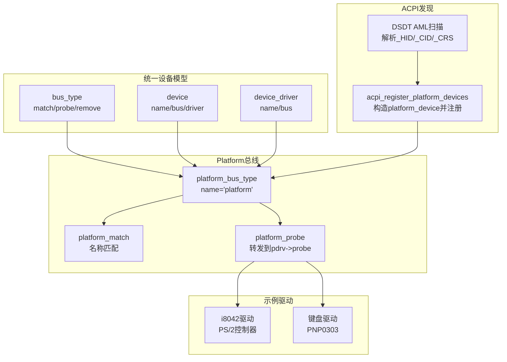
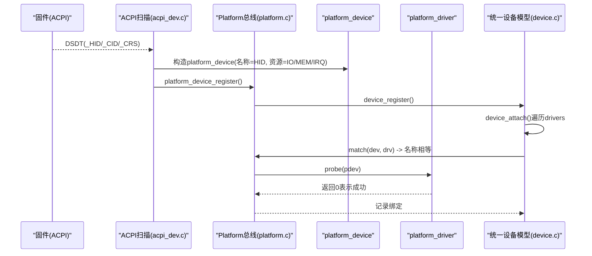
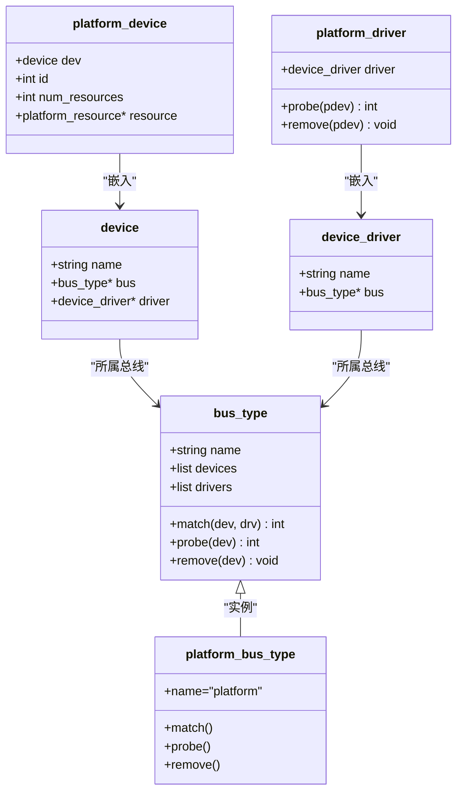
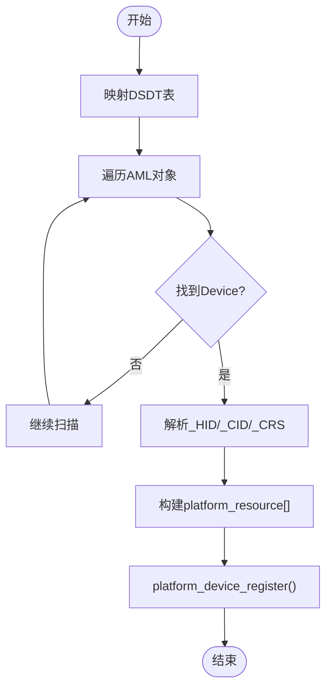
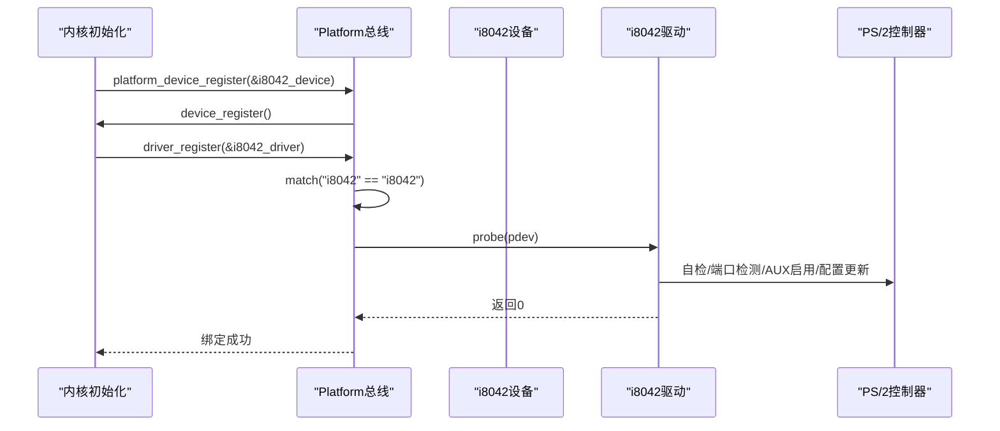
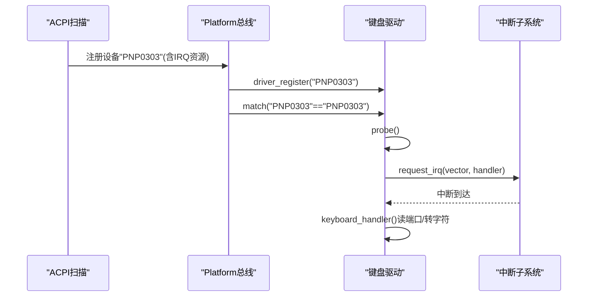
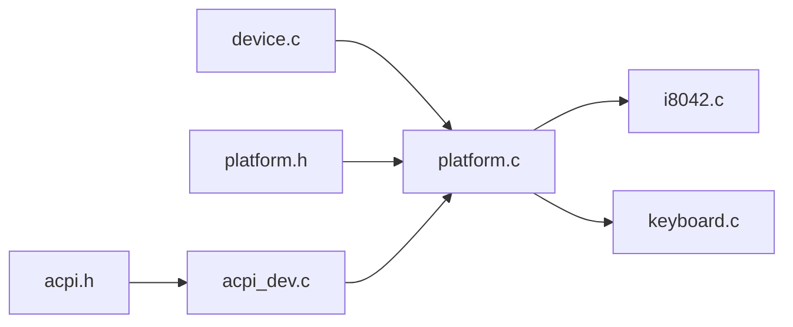
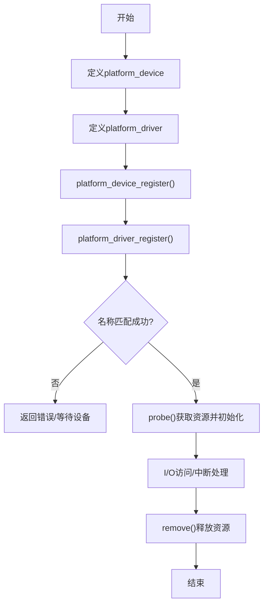

# Platform总线驱动开发

<cite>
**本文引用的文件**
- [includes/device/platform.h](file://includes/device/platform.h)
- [kernel/device/platform.c](file://kernel/device/platform.c)
- [includes/device/device.h](file://includes/device/device.h)
- [kernel/device/device.c](file://kernel/device/device.c)
- [kernel/device/acpi_dev.c](file://kernel/device/acpi_dev.c)
- [includes/arch/x86/acpi.h](file://includes/arch/x86/acpi.h)
- [kernel/i8042.c](file://kernel/i8042.c)
- [kernel/keyboard.c](file://kernel/keyboard.c)
</cite>

## 目录
1. [简介](#简介)
2. [项目结构](#项目结构)
3. [核心组件](#核心组件)
4. [架构总览](#架构总览)
5. [详细组件分析](#详细组件分析)
6. [依赖关系分析](#依赖关系分析)
7. [性能与资源管理](#性能与资源管理)
8. [故障排查指南](#故障排查指南)
9. [结论](#结论)
10. [附录：典型Platform设备驱动实现流程](#附录：典型platform设备驱动实现流程)

## 简介
本指南面向在LulaOS上开发Platform总线设备的工程师，系统阐述Platform总线的设计原理、适用场景、与PCI等其它总线类型的差异；详细说明Platform设备的注册过程、资源描述与分配；完整文档化Platform驱动的初始化到probe的实现流程；提供中断处理、内存映射与I/O操作的实践要点；并解释ACPI设备发现机制与动态设备配置。最后给出资源管理与错误处理的建议。

## 项目结构
LulaOS的Platform总线位于统一设备模型之上，核心由“总线抽象 + platform总线实现 + ACPI设备扫描”构成，配合具体外设驱动（如i8042、键盘）展示完整的设备-驱动匹配与资源使用方式。

图表来源
- [kernel/device/device.c:22-34](file://kernel/device/device.c#L22-L34)
- [kernel/device/platform.c:14-77](file://kernel/device/platform.c#L14-L77)
- [kernel/device/acpi_dev.c:749-796](file://kernel/device/acpi_dev.c#L749-L796)

章节来源
- [includes/device/device.h:27-66](file://includes/device/device.h#L27-L66)
- [kernel/device/device.c:22-165](file://kernel/device/device.c#L22-L165)
- [kernel/device/platform.c:14-160](file://kernel/device/platform.c#L14-L160)
- [kernel/device/acpi_dev.c:1-797](file://kernel/device/acpi_dev.c#L1-L797)

## 核心组件
- 总线抽象：bus_type定义match/probe/remove回调，维护devices/drivers链表，负责设备与驱动的绑定与生命周期管理。
- Platform总线：platform_bus_type将名称匹配策略注入总线，并在匹配成功后调用平台驱动的probe/remove。
- 设备/驱动描述符：platform_device包含dev、id、资源数组；platform_driver包含driver及probe/remove回调。
- ACPI设备发现：扫描DSDT中的Device节点，提取_HID/_CID/_CRS，转换为platform_resource并注册为platform_device。
- 示例驱动：i8042作为平台设备驱动完成PS/2控制器初始化；键盘驱动通过HID“PNP0303”匹配并注册中断。

章节来源
- [includes/device/platform.h:20-83](file://includes/device/platform.h#L20-L83)
- [kernel/device/platform.c:14-160](file://kernel/device/platform.c#L14-L160)
- [kernel/device/acpi_dev.c:749-796](file://kernel/device/acpi_dev.c#L749-L796)
- [kernel/i8042.c:267-303](file://kernel/i8042.c#L267-L303)
- [kernel/keyboard.c:190-234](file://kernel/keyboard.c#L190-L234)

## 架构总览
Platform总线基于统一设备模型，采用“名称匹配”的设备-驱动绑定机制。ACPI DSDT扫描将固件描述的设备转化为内核中的platform_device，随后由同名驱动进行匹配和初始化。

图表来源
- [kernel/device/acpi_dev.c:749-796](file://kernel/device/acpi_dev.c#L749-L796)
- [kernel/device/platform.c:84-114](file://kernel/device/platform.c#L84-L114)
- [kernel/device/device.c:42-87](file://kernel/device/device.c#L42-L87)

## 详细组件分析

### 统一设备模型与Platform总线
- bus_type：定义总线名称、设备/驱动链表以及match/probe/remove函数指针。
- device/device_driver：设备与驱动的基础结构，嵌入各自总线扩展结构的首成员。
- platform_bus_type：将match设置为名称比较，probe转发到platform_driver->probe，remove转发到platform_driver->remove。
- 注册流程：platform_device_register设置bus并调用device_register；platform_driver_register设置bus并调用driver_register；两者任一先注册都会触发匹配。

图表来源
- [includes/device/device.h:27-66](file://includes/device/device.h#L27-L66)
- [includes/device/platform.h:44-60](file://includes/device/platform.h#L44-L60)
- [kernel/device/platform.c:14-77](file://kernel/device/platform.c#L14-L77)

章节来源
- [includes/device/device.h:27-77](file://includes/device/device.h#L27-L77)
- [kernel/device/device.c:22-165](file://kernel/device/device.c#L22-L165)
- [kernel/device/platform.c:14-160](file://kernel/device/platform.c#L14-L160)

### ACPI设备发现与动态配置
- DSDT扫描：解析AML对象，识别Scope/Device/Name，提取_HID、_CID、_CRS。
- _CRS解析：将小型/大型资源描述符转换为platform_resource（IO端口、内存范围、IRQ）。
- 设备注册：将HID作为设备名，复制资源到platform_device，调用platform_device_register完成注册。
- 回退机制：当ACPI未发现特定设备时，可由控制器驱动（如i8042）补充注册子设备。

图表来源
- [kernel/device/acpi_dev.c:632-740](file://kernel/device/acpi_dev.c#L632-L740)
- [kernel/device/acpi_dev.c:749-796](file://kernel/device/acpi_dev.c#L749-L796)

章节来源
- [kernel/device/acpi_dev.c:1-797](file://kernel/device/acpi_dev.c#L1-L797)
- [includes/arch/x86/acpi.h:202-250](file://includes/arch/x86/acpi.h#L202-L250)

### 典型Platform设备驱动：i8042（PS/2控制器）
- 设备定义：声明IO资源（数据/命令端口），以“i8042”为设备名注册。
- 驱动定义：驱动名为“i8042”，probe中执行控制器自检、端口检测、AUX启用、配置字节更新、鼠标初始化。
- 子设备回退：若ACPI未枚举键盘/鼠标，则注册回退设备“PNP0303”“PNP0F13”。

图表来源
- [kernel/i8042.c:267-303](file://kernel/i8042.c#L267-L303)
- [kernel/device/platform.c:84-114](file://kernel/device/platform.c#L84-L114)

章节来源
- [kernel/i8042.c:1-303](file://kernel/i8042.c#L1-L303)
- [kernel/device/platform.c:84-114](file://kernel/device/platform.c#L84-L114)

### 典型Platform设备驱动：键盘（PNP0303）
- 设备来源：ACPI DSDT扫描或i8042回退注册，设备名为“PNP0303”。
- 驱动行为：probe中从资源获取IRQ号，计算中断向量并注册中断处理函数。
- 中断处理：读取状态寄存器区分数据来源（键盘/鼠标），读取扫描码并转ASCII输出。

图表来源
- [kernel/keyboard.c:190-234](file://kernel/keyboard.c#L190-L234)
- [kernel/device/acpi_dev.c:749-796](file://kernel/device/acpi_dev.c#L749-L796)

章节来源
- [kernel/keyboard.c:1-235](file://kernel/keyboard.c#L1-L235)
- [kernel/device/acpi_dev.c:749-796](file://kernel/device/acpi_dev.c#L749-L796)

## 依赖关系分析
- platform.c依赖device.c提供的总线与设备/驱动注册、匹配机制。
- acpi_dev.c依赖arch/x86/acpi.h中的ACPI表结构与上下文，并将解析结果转为platform_device。
- i8042.c与keyboard.c作为具体平台驱动，依赖platform总线接口与x86 I/O操作。

图表来源
- [kernel/device/device.c:22-165](file://kernel/device/device.c#L22-L165)
- [kernel/device/platform.c:14-160](file://kernel/device/platform.c#L14-L160)
- [kernel/device/acpi_dev.c:749-796](file://kernel/device/acpi_dev.c#L749-L796)
- [kernel/i8042.c:267-303](file://kernel/i8042.c#L267-L303)
- [kernel/keyboard.c:190-234](file://kernel/keyboard.c#L190-L234)

章节来源
- [kernel/device/device.c:22-165](file://kernel/device/device.c#L22-L165)
- [kernel/device/platform.c:14-160](file://kernel/device/platform.c#L14-L160)
- [kernel/device/acpi_dev.c:749-796](file://kernel/device/acpi_dev.c#L749-L796)

## 性能与资源管理
- 资源访问顺序：优先通过platform_get_resource按类型与索引获取资源，避免硬编码地址。
- I/O与MMIO：对I/O端口使用inb/outb等I/O指令；对内存映射需结合高内存映射能力（参考高内存API）进行安全访问。
- 中断管理：从资源中获取IRQ，计算向量后注册中断；确保中断处理函数快速返回，必要时延后处理至软中断或工作队列。
- 错误处理：probe失败应返回负错误码；资源缺失时及时报错并退出；移除时释放已申请的资源（中断、映射等）。
- 并发与锁：设备/驱动注册与匹配过程中注意保护链表与共享状态；中断上下文中避免阻塞操作。

[本节为通用指导，不直接分析具体文件]

## 故障排查指南
- 设备未匹配：检查platform_device.dev.name与platform_driver.driver.name是否一致；确认platform_bus_init已调用。
- 资源缺失：确认ACPI _CRS是否正确描述IO/MEM/IRQ；platform_get_resource返回值是否为NULL。
- 中断无效：验证IRQ资源与向量映射；确认中断处理函数正确注册且未被其他驱动抢占。
- 控制器初始化失败：检查i8042自检与端口响应；查看超时与错误日志。

章节来源
- [kernel/device/platform.c:84-114](file://kernel/device/platform.c#L84-L114)
- [kernel/device/platform.c:142-159](file://kernel/device/platform.c#L142-L159)
- [kernel/i8042.c:128-220](file://kernel/i8042.c#L128-L220)
- [kernel/keyboard.c:197-218](file://kernel/keyboard.c#L197-L218)

## 结论
LulaOS的Platform总线以统一设备模型为基础，通过名称匹配实现设备与驱动的解耦；ACPI DSDT扫描将固件描述的设备动态转化为platform_device，使驱动可跨平台复用。i8042与键盘驱动展示了完整的设备注册、资源获取、中断处理与I/O操作流程。遵循资源管理与错误处理最佳实践，可提升系统的稳定性与可维护性。

[本节为总结，不直接分析具体文件]

## 附录：典型Platform设备驱动实现流程
- 步骤1：定义platform_device，填写dev.name、id、resource数组与num_resources。
- 步骤2：定义platform_driver，填写driver.name与probe/remove回调。
- 步骤3：在初始化阶段调用platform_device_register与platform_driver_register。
- 步骤4：在probe中通过platform_get_resource获取IO/MEM/IRQ资源，完成硬件初始化与中断注册。
- 步骤5：在remove中释放资源与中断，清理状态。

[此图为概念流程图，无需图表来源]