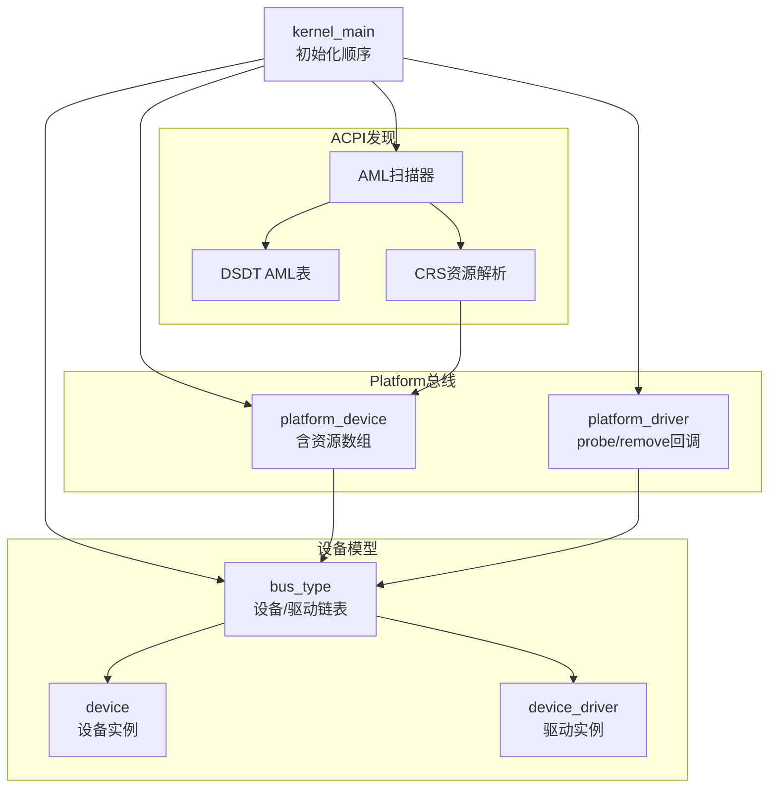
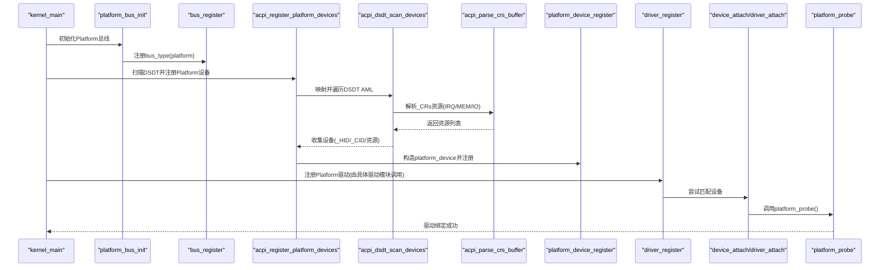
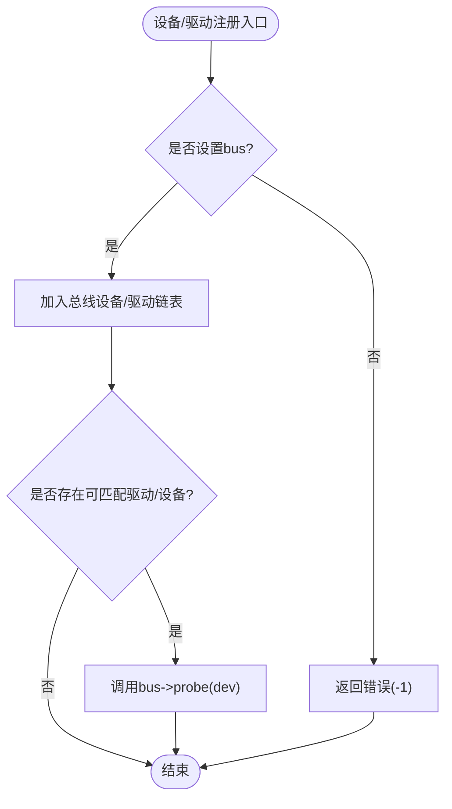
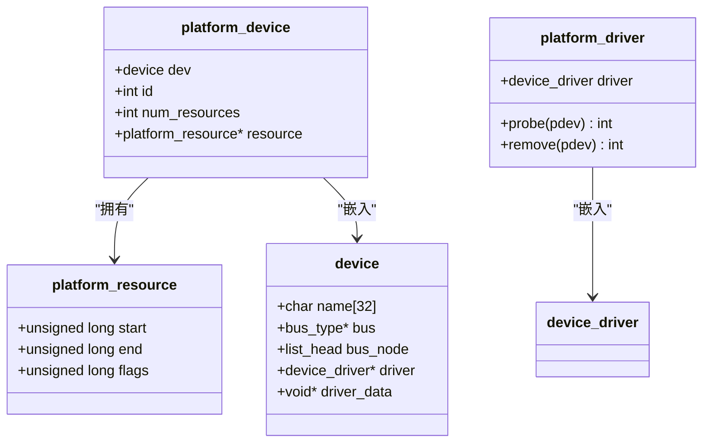
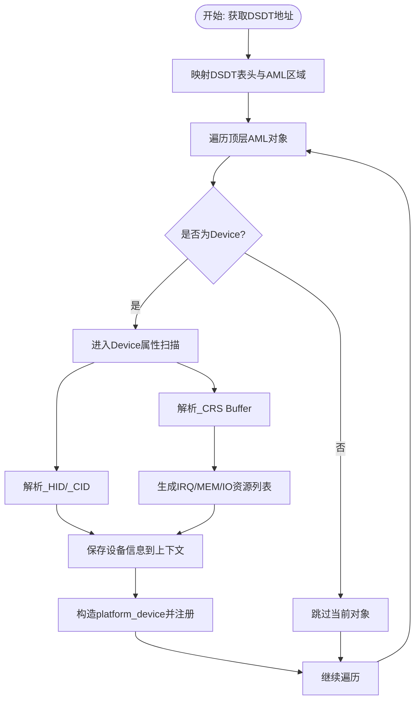
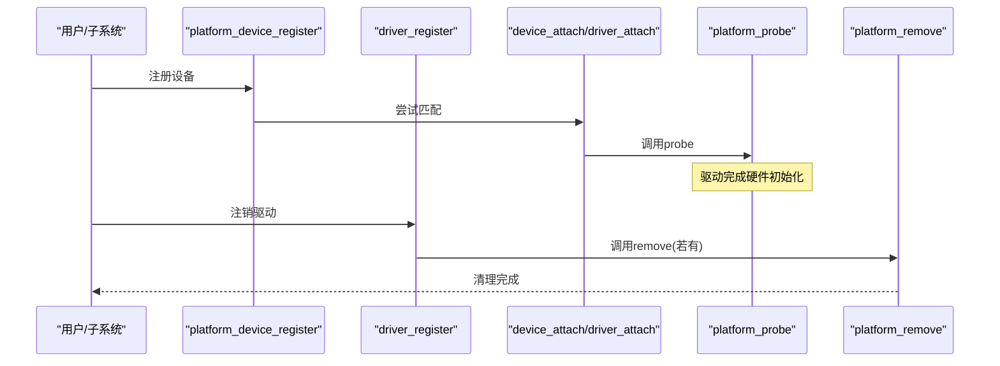
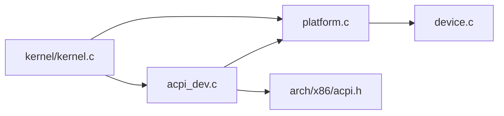

# Platform设备注册与管理

<cite>
**本文引用的文件**
- [includes/device/platform.h](file://includes/device/platform.h)
- [kernel/device/platform.c](file://kernel/device/platform.c)
- [includes/device/device.h](file://includes/device/device.h)
- [kernel/device/device.c](file://kernel/device/device.c)
- [kernel/device/acpi_dev.c](file://kernel/device/acpi_dev.c)
- [includes/arch/x86/acpi.h](file://includes/arch/x86/acpi.h)
- [kernel/kernel.c](file://kernel/kernel.c)
</cite>

## 目录
1. [简介](#简介)
2. [项目结构](#项目结构)
3. [核心组件](#核心组件)
4. [架构总览](#架构总览)
5. [详细组件分析](#详细组件分析)
6. [依赖关系分析](#依赖关系分析)
7. [性能与资源特性](#性能与资源特性)
8. [故障排查指南](#故障排查指南)
9. [结论](#结论)
10. [附录：使用示例与最佳实践](#附录使用示例与最佳实践)

## 简介
本文件面向LulaOS的Platform设备子系统，系统性说明平台设备的注册流程、ACPI设备发现机制、设备树概念与用法（在本实现中通过ACPI DSDT描述硬件拓扑）、设备生命周期管理（添加、移除、销毁）以及错误处理与资源清理的最佳实践。文档以代码为依据，提供流程图与时序图帮助理解数据流与控制流。

## 项目结构
LulaOS将“统一设备模型”抽象为总线/设备/驱动三层，Platform总线用于非PCI发现的固定地址设备（如SoC内部外设、PS/2控制器等）。关键文件职责如下：
- includes/device/device.h、kernel/device/device.c：总线类型、设备与驱动的通用定义与注册匹配逻辑
- includes/device/platform.h、kernel/device/platform.c：Platform总线及其设备/驱动接口
- kernel/device/acpi_dev.c：解析DSDT AML表，枚举设备并转换为Platform设备
- includes/arch/x86/acpi.h：ACPI表结构与上下文定义
- kernel/kernel.c：内核初始化流程，按序完成总线与设备注册

图表来源
- [kernel/device/device.c:22-34](file://kernel/device/device.c#L22-L34)
- [kernel/device/platform.c:15-17](file://kernel/device/platform.c#L15-L17)
- [kernel/device/acpi_dev.c:632-740](file://kernel/device/acpi_dev.c#L632-L740)
- [kernel/kernel.c:96-100](file://kernel/kernel.c#L96-L100)

章节来源
- [kernel/device/device.c:22-34](file://kernel/device/device.c#L22-L34)
- [kernel/device/platform.c:15-17](file://kernel/device/platform.c#L15-L17)
- [kernel/device/acpi_dev.c:632-740](file://kernel/device/acpi_dev.c#L632-L740)
- [kernel/kernel.c:96-100](file://kernel/kernel.c#L96-L100)

## 核心组件
- 总线与设备/驱动
  - bus_type：维护设备/驱动链表，提供match/probe/remove钩子
  - device：设备基础结构，包含名称、所属总线、已绑定驱动指针等
  - device_driver：驱动基础结构，包含名称、所属总线等
- Platform扩展
  - platform_resource：描述MMIO/I/O端口/IRQ等资源范围
  - platform_device：嵌入device，增加id与resource数组指针
  - platform_driver：嵌入device_driver，增加probe/remove回调
- ACPI发现
  - acpi_table_context：保存FADT/DSDT地址、MADT信息等
  - acpi_dsdt_device/_HID/_CID/_CRS：从DSDT提取设备标识与资源
  - aml_scan_*：AML遍历与NameString解析、CRS资源解析

章节来源
- [includes/device/device.h:26-66](file://includes/device/device.h#L26-L66)
- [includes/device/platform.h:28-60](file://includes/device/platform.h#L28-L60)
- [includes/arch/x86/acpi.h:202-240](file://includes/arch/x86/acpi.h#L202-L240)

## 架构总览
下图展示从内核初始化到设备匹配的完整时序：

图表来源
- [kernel/kernel.c:96-100](file://kernel/kernel.c#L96-L100)
- [kernel/device/platform.c:70-77](file://kernel/device/platform.c#L70-L77)
- [kernel/device/device.c:94-105](file://kernel/device/device.c#L94-L105)
- [kernel/device/device.c:130-139](file://kernel/device/device.c#L130-L139)
- [kernel/device/acpi_dev.c:632-740](file://kernel/device/acpi_dev.c#L632-L740)
- [kernel/device/acpi_dev.c:334-421](file://kernel/device/acpi_dev.c#L334-L421)

## 详细组件分析

### Platform总线与设备/驱动模型
- 总线注册：设置match/probe/remove函数指针后，加入全局总线链表
- 设备注册：设置bus、初始化节点、校验name，加入总线设备链表并尝试匹配
- 驱动注册：设置bus、初始化节点，加入总线驱动链表并尝试匹配
- 匹配策略：platform_match比较设备名与驱动名；成功后调用platform_probe转发到pdrv->probe

图表来源
- [kernel/device/device.c:22-34](file://kernel/device/device.c#L22-L34)
- [kernel/device/device.c:94-105](file://kernel/device/device.c#L94-L105)
- [kernel/device/device.c:130-139](file://kernel/device/device.c#L130-L139)
- [kernel/device/platform.c:25-50](file://kernel/device/platform.c#L25-L50)

章节来源
- [kernel/device/device.c:22-34](file://kernel/device/device.c#L22-L34)
- [kernel/device/device.c:94-105](file://kernel/device/device.c#L94-L105)
- [kernel/device/device.c:130-139](file://kernel/device/device.c#L130-L139)
- [kernel/device/platform.c:25-50](file://kernel/device/platform.c#L25-L50)

### Platform设备结构体与资源描述符
- platform_device：必须将struct device作为首成员，便于container_of转换；包含id、num_resources、resource指针
- platform_resource：start/end/flags，支持IO/MEM/IRQ三类资源
- 资源获取：platform_get_resource按type和index查找对应资源

图表来源
- [includes/device/device.h:43-66](file://includes/device/device.h#L43-L66)
- [includes/device/platform.h:28-60](file://includes/device/platform.h#L28-L60)

章节来源
- [includes/device/platform.h:28-60](file://includes/device/platform.h#L28-L60)
- [kernel/device/platform.c:142-159](file://kernel/device/platform.c#L142-L159)

### ACPI设备发现机制（DSDT解析与设备枚举）
- 目标：只读扫描DSDT AML，解析Scope/Device/Name对象，提取_HID/_CID/_CRS
- 步骤：
  1) 通过FADT获取DSDT物理地址并映射
  2) 遍历顶层AML对象，识别Device/Scope
  3) 在Device内解析Name对象，提取_HID/_CID/_CRS
  4) _CRS Buffer解析为IRQ/MEM/IO资源
  5) 将设备信息保存到上下文，随后转为platform_device并注册

图表来源
- [kernel/device/acpi_dev.c:632-740](file://kernel/device/acpi_dev.c#L632-L740)
- [kernel/device/acpi_dev.c:334-421](file://kernel/device/acpi_dev.c#L334-L421)
- [includes/arch/x86/acpi.h:202-240](file://includes/arch/x86/acpi.h#L202-L240)

章节来源
- [kernel/device/acpi_dev.c:632-740](file://kernel/device/acpi_dev.c#L632-L740)
- [kernel/device/acpi_dev.c:334-421](file://kernel/device/acpi_dev.c#L334-L421)
- [includes/arch/x86/acpi.h:202-240](file://includes/arch/x86/acpi.h#L202-L240)

### 设备树的概念与使用方法
- 概念：设备树是一种用树形结构描述硬件拓扑的文本格式，常用于ARM等平台；每个节点代表一个设备或总线，属性描述寄存器基址、中断号、时钟等
- 在本实现中，硬件拓扑通过ACPI DSDT的AML描述表达，等效于设备树的作用：声明设备、资源与层次关系
- 使用方式：无需额外工具链，系统启动时由ACPI子系统解析DSDT，自动发现并注册Platform设备；驱动通过名称匹配完成绑定

章节来源
- [kernel/device/acpi_dev.c:632-740](file://kernel/device/acpi_dev.c#L632-L740)

### 静态注册与动态发现
- 静态注册：在板级代码中直接构造platform_device并调用platform_device_register；适用于固定地址、无ACPI的设备
- 动态发现：通过ACPI DSDT扫描，自动生成platform_device并注册；适用于标准PC/笔记本等设备
- 两者均走同一注册路径，最终进入统一设备模型的匹配流程

章节来源
- [kernel/device/platform.c:84-98](file://kernel/device/platform.c#L84-L98)
- [kernel/device/acpi_dev.c:749-796](file://kernel/device/acpi_dev.c#L749-L796)

### 设备生命周期管理
- 添加：platform_device_register -> device_register -> device_attach -> bus->probe
- 移除：driver_unregister或设备注销时，若存在绑定驱动且总线提供remove回调，则调用bus->remove（platform_remove转发到pdrv->remove）
- 销毁：从总线链表移除，解除驱动绑定，释放资源（由上层驱动负责）

图表来源
- [kernel/device/device.c:94-105](file://kernel/device/device.c#L94-L105)
- [kernel/device/device.c:130-139](file://kernel/device/device.c#L130-L139)
- [kernel/device/platform.c:37-62](file://kernel/device/platform.c#L37-L62)

章节来源
- [kernel/device/device.c:94-105](file://kernel/device/device.c#L94-L105)
- [kernel/device/device.c:130-139](file://kernel/device/device.c#L130-L139)
- [kernel/device/platform.c:37-62](file://kernel/device/platform.c#L37-L62)

## 依赖关系分析
- platform.c依赖device.c提供的bus/device/driver注册与匹配能力
- acpi_dev.c依赖arch/x86/acpi.h中的表结构，并通过rang_mapping映射DSDT内存
- kernel/kernel.c按序调用platform_bus_init与acpi_register_platform_devices，确保总线先于设备注册

图表来源
- [kernel/kernel.c:96-100](file://kernel/kernel.c#L96-L100)
- [kernel/device/platform.c:9-12](file://kernel/device/platform.c#L9-L12)
- [kernel/device/acpi_dev.c:13-20](file://kernel/device/acpi_dev.c#L13-L20)

章节来源
- [kernel/kernel.c:96-100](file://kernel/kernel.c#L96-L100)
- [kernel/device/platform.c:9-12](file://kernel/device/platform.c#L9-L12)
- [kernel/device/acpi_dev.c:13-20](file://kernel/device/acpi_dev.c#L13-L20)

## 性能与资源特性
- 匹配复杂度：设备/驱动注册时为O(N)遍历总线链表；对于少量设备/驱动开销可忽略
- 资源解析：_CRS解析为线性扫描Buffer，遇到End Tag停止；对典型设备规模高效
- 内存映射：DSDT表通过rang_mapping按需映射，避免长期占用虚拟地址空间
- 优化建议：
  - 对频繁查询的资源可使用索引缓存（例如按类型分组）
  - 限制最大设备数与资源数，防止异常AML导致越界

章节来源
- [kernel/device/device.c:42-60](file://kernel/device/device.c#L42-L60)
- [kernel/device/device.c:68-87](file://kernel/device/device.c#L68-L87)
- [kernel/device/acpi_dev.c:334-421](file://kernel/device/acpi_dev.c#L334-L421)

## 故障排查指南
- 设备未匹配
  - 检查platform_device.dev.name与platform_driver.driver.name是否一致
  - 确认platform_bus_init已在设备/驱动注册前调用
- ACPI未发现设备
  - 检查FADT中DSDT地址是否正确映射
  - 查看打印日志确认AML扫描是否进入Device分支
  - 验证_CRs Buffer是否包含有效资源描述符
- 资源访问失败
  - 使用platform_get_resource获取正确的start/end/flags
  - 确认I/O或MMIO范围未被其他设备占用
- 驱动卸载问题
  - 确保实现pdrv->remove并在driver_unregister时被调用
  - 检查是否有悬挂引用或未释放资源

章节来源
- [kernel/device/platform.c:25-50](file://kernel/device/platform.c#L25-L50)
- [kernel/device/platform.c:84-98](file://kernel/device/platform.c#L84-L98)
- [kernel/device/acpi_dev.c:632-740](file://kernel/device/acpi_dev.c#L632-L740)
- [kernel/device/platform.c:142-159](file://kernel/device/platform.c#L142-L159)

## 结论
LulaOS的Platform设备子系统基于统一设备模型，提供了简洁而可扩展的平台设备注册与匹配机制。通过ACPI DSDT的AML扫描，系统能够自动发现并注册平台设备，将资源描述转化为统一的platform_resource，并由驱动通过名称匹配完成绑定。该设计兼顾了静态板级配置与动态固件发现，具备良好的可维护性与扩展性。

## 附录：使用示例与最佳实践

### 静态注册设备（示例路径）
- 构造platform_device并设置dev.name、id与resource数组
- 调用platform_device_register完成注册
- 参考路径：[platform_device_register:84-98](file://kernel/device/platform.c#L84-L98)

### 动态发现设备（示例路径）
- 调用acpi_register_platform_devices进行DSDT扫描与设备注册
- 参考路径：[acpi_register_platform_devices:749-796](file://kernel/device/acpi_dev.c#L749-L796)

### 驱动注册与匹配（示例路径）
- 构造platform_driver并设置driver.name、probe/remove
- 调用platform_driver_register完成注册
- 参考路径：[platform_driver_register:105-114](file://kernel/device/platform.c#L105-L114)

### 资源访问（示例路径）
- 使用platform_get_resource按类型与序号获取资源
- 参考路径：[platform_get_resource:142-159](file://kernel/device/platform.c#L142-L159)

### 错误处理与资源清理最佳实践
- 注册前校验参数（空指针、名称为空）
- 映射失败时记录日志并安全返回
- 驱动probe失败时保持设备状态一致，避免部分初始化
- 驱动remove中释放所有分配资源，解除中断与映射
- 参考路径：
  - [device_register:94-105](file://kernel/device/device.c#L94-L105)
  - [driver_register:130-139](file://kernel/device/device.c#L130-L139)
  - [platform_probe:37-50](file://kernel/device/platform.c#L37-L50)
  - [platform_remove:55-62](file://kernel/device/platform.c#L55-L62)